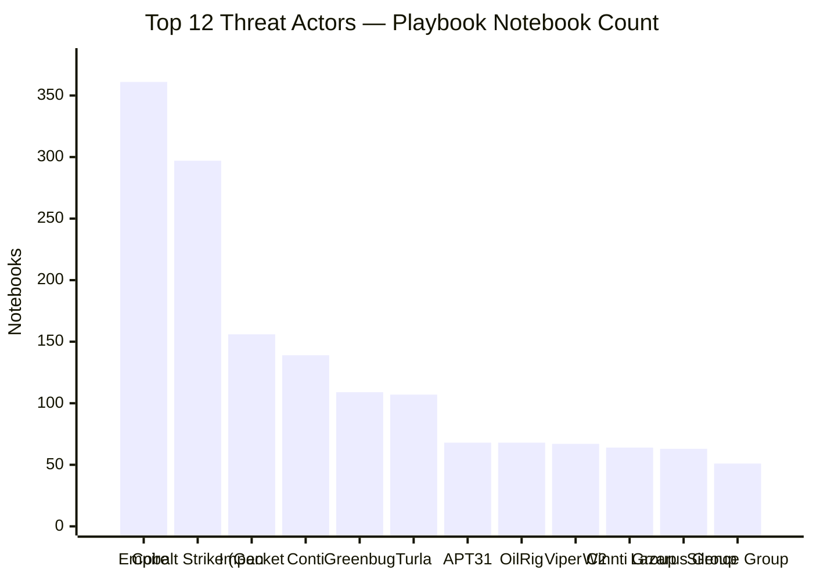

# Threat Actor Coverage Map

> **Auto-generated** from the notebook corpus — do not edit manually.  
> Last updated: `2026-05-06 04:47Z` · Re-run with `make threat-actors`  
> Total actor-tagged notebooks: **2,060**

---

## Summary

| Threat Actor | Nation / Type | ATT&CK | Playbooks |
|---|---|---|---|
| [Empire / PowerSploit](#empire-powersploit) | Multiple (open-source red team tools) | [S0363](https://attack.mitre.org/software/S0363/) | 361 |
| [Cobalt Strike (Generic)](#cobalt-strike-generic) | Multiple (dual-use framework) |  | 297 |
| [Impacket](#impacket) | Multiple (open-source red team tool) | [S0357](https://attack.mitre.org/software/S0357/) | 156 |
| [Conti](#conti) | Criminal (Russia-affiliated) |  | 139 |
| [Greenbug / Chafer](#greenbug-chafer) | 🇮🇷 Iran |  | 109 |
| [Turla / Snake](#turla-snake) | 🇷🇺 Russia (FSB) | [G0010](https://attack.mitre.org/groups/G0010/) | 107 |
| [APT31 / ZIRCONIUM](#apt31-zirconium) | 🇨🇳 China (MSS) | [G0128](https://attack.mitre.org/groups/G0128/) | 68 |
| [OilRig / APT34](#oilrig-apt34) | 🇮🇷 Iran (IRGC) | [G0049](https://attack.mitre.org/groups/G0049/) | 68 |
| [Viper C2](#viper-c2) | 🇨🇳 China (open-source C2 used by PLA-linked actors) |  | 67 |
| [Winnti Group](#winnti-group) | 🇨🇳 China | [G0044](https://attack.mitre.org/groups/G0044/) | 64 |
| [Lazarus Group](#lazarus-group) | 🇰🇵 DPRK (Reconnaissance General Bureau) | [G0032](https://attack.mitre.org/groups/G0032/) | 63 |
| [Silence Group](#silence-group) | Criminal (Russia) | [G0091](https://attack.mitre.org/groups/G0091/) | 51 |
| [Equation Group](#equation-group) | 🇺🇸 NSA/TAO — attributed | [G0020](https://attack.mitre.org/groups/G0020/) | 44 |
| [APT29 / Cozy Bear](#apt29-cozy-bear) | 🇷🇺 Russia (SVR) | [G0016](https://attack.mitre.org/groups/G0016/) | 38 |
| [3CX Supply Chain](#3cx-supply-chain) | 🇰🇵 DPRK (Lazarus Group) |  | 36 |
| [GALLIUM](#gallium) | 🇨🇳 China (state-sponsored) | [G0093](https://attack.mitre.org/groups/G0093/) | 32 |
| [Ursnif / Gozi](#ursnif-gozi) | Criminal | [S0386](https://attack.mitre.org/software/S0386/) | 32 |
| [XenoRAT](#xenorat) | Criminal / MaaS |  | 29 |
| [HAFNIUM](#hafnium) | 🇨🇳 China (state-sponsored) | [G0125](https://attack.mitre.org/groups/G0125/) | 27 |
| [Ryuk](#ryuk) | Criminal |  | 25 |
| [Elise Backdoor](#elise-backdoor) | 🇨🇳 China (APT32-related) | [S0081](https://attack.mitre.org/software/S0081/) | 23 |
| [Adwind RAT](#adwind-rat) | Criminal / MaaS | [S0045](https://attack.mitre.org/software/S0045/) | 23 |
| [Ke3chang / APT15](#ke3chang-apt15) | 🇨🇳 China (MSS) | [G0004](https://attack.mitre.org/groups/G0004/) | 21 |
| [DarkSide](#darkside) | Criminal |  | 21 |
| [MuddyWater](#muddywater) | 🇮🇷 Iran (MOIS) | [G0069](https://attack.mitre.org/groups/G0069/) | 19 |
| [BlackCat / ALPHV](#blackcat-alphv) | Criminal |  | 17 |
| [FIN7 / Carbanak](#fin7-carbanak) | Criminal | [G0046](https://attack.mitre.org/groups/G0046/) | 17 |
| [PrinterNightmare](#printernightmare) | Multiple (exploited by many actors) |  | 15 |
| [Mustang Panda](#mustang-panda) | 🇨🇳 China | [G0129](https://attack.mitre.org/groups/G0129/) | 13 |
| [APT3 / Gothic Panda](#apt3-gothic-panda) | 🇨🇳 China (MSS) | [G0022](https://attack.mitre.org/groups/G0022/) | 11 |
| [Operation Triangulation](#operation-triangulation) | Unknown (iOS zero-click implant) |  | 10 |
| [Gamaredon Group](#gamaredon-group) | 🇷🇺 Russia (FSB) | [G0047](https://attack.mitre.org/groups/G0047/) | 9 |
| [Formbook](#formbook) | Criminal / MaaS | [S0171](https://attack.mitre.org/software/S0171/) | 8 |
| [APT10 / menuPass](#apt10-menupass) | 🇨🇳 China (MSS) | [G0045](https://attack.mitre.org/groups/G0045/) | 7 |
| [Hurricane Panda](#hurricane-panda) | 🇨🇳 China | [G0009](https://attack.mitre.org/groups/G0009/) | 7 |
| [REvil / Sodinokibi](#revil-sodinokibi) | Criminal | [G0115](https://attack.mitre.org/groups/G0115/) | 7 |
| [TA505](#ta505) | Criminal | [G0092](https://attack.mitre.org/groups/G0092/) | 7 |
| [Threat Group-3390 / APT27](#threat-group-3390-apt27) | 🇨🇳 China | [G0027](https://attack.mitre.org/groups/G0027/) | 7 |
| [APT32 / OceanLotus](#apt32-oceanlotus) | 🇻🇳 Vietnam (likely state-sponsored) | [G0050](https://attack.mitre.org/groups/G0050/) | 5 |

---

## 📊 Top Actors by Playbook Coverage

---

## Empire / PowerSploit

**Nation / Type**: Multiple (open-source red team tools)  
**ATT&CK**: [S0363](https://attack.mitre.org/software/S0363/)  
**Description**: PowerShell-based post-exploitation frameworks widely abused.

**361 playbook(s)** in this repository:

| Playbook | ATT&CK Technique |
|---|---|
| [Simple keyword detection rule for PowerSploit](https://github.com/w8mej/InfoSec-Blueprints/blob/main/autonomic_loops/remediation/canary/T1003_Simple_keyword_detection_rule_for_PowerSploit.ipynb) | — |
| [Simple keyword detection rule for PowerSploit](https://github.com/w8mej/InfoSec-Blueprints/blob/main/autonomic_loops/remediation/enterprise/collection/email_collection-_-t1114/T1003_Simple_keyword_detection_rule_for_PowerSploit.ipynb) | — |
| [Simple keyword detection rule for PowerSploit](https://github.com/w8mej/InfoSec-Blueprints/blob/main/autonomic_loops/remediation/enterprise/command_and_control/T1003_Simple_keyword_detection_rule_for_PowerSploit.ipynb) | — |
| [Simple keyword detection rule for PowerSploit](https://github.com/w8mej/InfoSec-Blueprints/blob/main/autonomic_loops/remediation/enterprise/credential_access/os_credential_dumping-_-t1003/T1003_Simple_keyword_detection_rule_for_PowerSploit.ipynb) | — |
| [Simple keyword detection rule for PowerSploit](https://github.com/w8mej/InfoSec-Blueprints/blob/main/autonomic_loops/remediation/enterprise/execution/command_and_scripting_interpreter-_-t1059/T1003_Simple_keyword_detection_rule_for_PowerSploit.ipynb) | — |
| [Simple keyword detection rule for PowerSploit](https://github.com/w8mej/InfoSec-Blueprints/blob/main/autonomic_loops/remediation/enterprise/execution/user_execution-_-t1204/T1003_Simple_keyword_detection_rule_for_PowerSploit.ipynb) | — |
| [Simple keyword detection rule for PowerSploit](https://github.com/w8mej/InfoSec-Blueprints/blob/main/autonomic_loops/remediation/enterprise/privilege_escalation/scheduled_task_job-_-t1053/T1003_Simple_keyword_detection_rule_for_PowerSploit.ipynb) | — |
| [Simple keyword detection rule for PowerSploit](https://github.com/w8mej/InfoSec-Blueprints/blob/main/autonomic_loops/remediation/ics/execution/T1003_Simple_keyword_detection_rule_for_PowerSploit.ipynb) | — |
| [Simple keyword detection rule for PowerSploit](https://github.com/w8mej/InfoSec-Blueprints/blob/main/autonomic_loops/remediation/ics/lateral_movement/T1003_Simple_keyword_detection_rule_for_PowerSploit.ipynb) | — |
| [Simple keyword detection rule for PowerSploit V2](https://github.com/w8mej/InfoSec-Blueprints/blob/main/autonomic_loops/remediation/enterprise/collection/email_collection-_-t1114/T1003_Simple_keyword_detection_rule_for_PowerSploit_V2.ipynb) | — |
| [Simple keyword detection rule for PowerSploit V2](https://github.com/w8mej/InfoSec-Blueprints/blob/main/autonomic_loops/remediation/enterprise/command_and_control/T1003_Simple_keyword_detection_rule_for_PowerSploit_V2.ipynb) | — |
| [Simple keyword detection rule for PowerSploit V2](https://github.com/w8mej/InfoSec-Blueprints/blob/main/autonomic_loops/remediation/enterprise/credential_access/os_credential_dumping-_-t1003/T1003_Simple_keyword_detection_rule_for_PowerSploit_V2.ipynb) | — |
| [Simple keyword detection rule for PowerSploit V2](https://github.com/w8mej/InfoSec-Blueprints/blob/main/autonomic_loops/remediation/enterprise/execution/command_and_scripting_interpreter-_-t1059/T1003_Simple_keyword_detection_rule_for_PowerSploit_V2.ipynb) | — |
| [Simple keyword detection rule for PowerSploit V2](https://github.com/w8mej/InfoSec-Blueprints/blob/main/autonomic_loops/remediation/enterprise/execution/user_execution-_-t1204/T1003_Simple_keyword_detection_rule_for_PowerSploit_V2.ipynb) | — |
| [Simple keyword detection rule for PowerSploit V2](https://github.com/w8mej/InfoSec-Blueprints/blob/main/autonomic_loops/remediation/enterprise/privilege_escalation/scheduled_task_job-_-t1053/T1003_Simple_keyword_detection_rule_for_PowerSploit_V2.ipynb) | — |
| [Simple keyword detection rule for PowerSploit V2](https://github.com/w8mej/InfoSec-Blueprints/blob/main/autonomic_loops/remediation/ics/execution/T1003_Simple_keyword_detection_rule_for_PowerSploit_V2.ipynb) | — |
| [Simple keyword detection rule for PowerSploit V2](https://github.com/w8mej/InfoSec-Blueprints/blob/main/autonomic_loops/remediation/ics/lateral_movement/T1003_Simple_keyword_detection_rule_for_PowerSploit_V2.ipynb) | — |
| [Default PowerSploit Schtasks Persistence](https://github.com/w8mej/InfoSec-Blueprints/blob/main/autonomic_loops/remediation/canary/T1053_Default_PowerSploit_Schtasks_Persistence.ipynb) | — |
| [Default PowerSploit Schtasks Persistence](https://github.com/w8mej/InfoSec-Blueprints/blob/main/autonomic_loops/remediation/enterprise/privilege_escalation/T1053_Default_PowerSploit_Schtasks_Persistence.ipynb) | — |
| [Default PowerSploit Schtasks Persistence](https://github.com/w8mej/InfoSec-Blueprints/blob/main/autonomic_loops/remediation/enterprise/privilege_escalation/scheduled_task_job-_-t1053/T1053_Default_PowerSploit_Schtasks_Persistence.ipynb) | — |
| [Default PowerSploit Schtasks Persistence](https://github.com/w8mej/InfoSec-Blueprints/blob/main/autonomic_loops/remediation/ics/execution/T1053_Default_PowerSploit_Schtasks_Persistence.ipynb) | — |
| [Default PowerSploit Schtasks Persistence](https://github.com/w8mej/InfoSec-Blueprints/blob/main/autonomic_loops/remediation/mobile/persistence/T1053_Default_PowerSploit_Schtasks_Persistence.ipynb) | — |
| [Default PowerSploit Schtasks Persistence](https://github.com/w8mej/InfoSec-Blueprints/blob/main/autonomic_loops/remediation/unmapped/T1053_Default_PowerSploit_Schtasks_Persistence.ipynb) | — |
| [Default PowerSploit Schtasks Persistence V2](https://github.com/w8mej/InfoSec-Blueprints/blob/main/autonomic_loops/remediation/enterprise/privilege_escalation/T1053_Default_PowerSploit_Schtasks_Persistence_V2.ipynb) | — |
| [Default PowerSploit Schtasks Persistence V2](https://github.com/w8mej/InfoSec-Blueprints/blob/main/autonomic_loops/remediation/enterprise/privilege_escalation/scheduled_task_job-_-t1053/T1053_Default_PowerSploit_Schtasks_Persistence_V2.ipynb) | — |
| [Default PowerSploit Schtasks Persistence V2](https://github.com/w8mej/InfoSec-Blueprints/blob/main/autonomic_loops/remediation/ics/execution/T1053_Default_PowerSploit_Schtasks_Persistence_V2.ipynb) | — |
| [Default PowerSploit Schtasks Persistence V2](https://github.com/w8mej/InfoSec-Blueprints/blob/main/autonomic_loops/remediation/mobile/persistence/T1053_Default_PowerSploit_Schtasks_Persistence_V2.ipynb) | — |
| [Default PowerSploit Schtasks Persistence V2](https://github.com/w8mej/InfoSec-Blueprints/blob/main/autonomic_loops/remediation/unmapped/T1053_Default_PowerSploit_Schtasks_Persistence_V2.ipynb) | — |
| [Default PowerSploit and Empire Schtasks Persistence](https://github.com/w8mej/InfoSec-Blueprints/blob/main/autonomic_loops/remediation/canary/T1053_Default_PowerSploit_and_Empire_Schtasks_Persistence.ipynb) | — |
| [Default PowerSploit and Empire Schtasks Persistence](https://github.com/w8mej/InfoSec-Blueprints/blob/main/autonomic_loops/remediation/enterprise/execution/command_and_scripting_interpreter-_-t1059/Subtechniques/powershell--t1059.001/T1053_Default_PowerSploit_and_Empire_Schtasks_Persistence.ipynb) | — |
| [Default PowerSploit and Empire Schtasks Persistence](https://github.com/w8mej/InfoSec-Blueprints/blob/main/autonomic_loops/remediation/enterprise/execution/scheduled_task_job-_-t1053/Subtechniques/scheduled_task--t1053.005/T1053_Default_PowerSploit_and_Empire_Schtasks_Persistence.ipynb) | — |
| [Default PowerSploit and Empire Schtasks Persistence](https://github.com/w8mej/InfoSec-Blueprints/blob/main/autonomic_loops/remediation/enterprise/privilege_escalation/T1053_Default_PowerSploit_and_Empire_Schtasks_Persistence.ipynb) | — |
| [Default PowerSploit and Empire Schtasks Persistence](https://github.com/w8mej/InfoSec-Blueprints/blob/main/autonomic_loops/remediation/enterprise/privilege_escalation/scheduled_task_job-_-t1053/T1053_Default_PowerSploit_and_Empire_Schtasks_Persistence.ipynb) | — |
| [Default PowerSploit and Empire Schtasks Persistence](https://github.com/w8mej/InfoSec-Blueprints/blob/main/autonomic_loops/remediation/ics/execution/T1053_Default_PowerSploit_and_Empire_Schtasks_Persistence.ipynb) | — |
| [Default PowerSploit and Empire Schtasks Persistence](https://github.com/w8mej/InfoSec-Blueprints/blob/main/autonomic_loops/remediation/mobile/persistence/T1053_Default_PowerSploit_and_Empire_Schtasks_Persistence.ipynb) | — |
| [Default PowerSploit and Empire Schtasks Persistence](https://github.com/w8mej/InfoSec-Blueprints/blob/main/autonomic_loops/remediation/unmapped/T1053_Default_PowerSploit_and_Empire_Schtasks_Persistence.ipynb) | — |
| [Default PowerSploit and Empire Schtasks Persistence V2](https://github.com/w8mej/InfoSec-Blueprints/blob/main/autonomic_loops/remediation/enterprise/execution/command_and_scripting_interpreter-_-t1059/Subtechniques/powershell--t1059.001/T1053_Default_PowerSploit_and_Empire_Schtasks_Persistence_V2.ipynb) | — |
| [Default PowerSploit and Empire Schtasks Persistence V2](https://github.com/w8mej/InfoSec-Blueprints/blob/main/autonomic_loops/remediation/enterprise/execution/scheduled_task_job-_-t1053/Subtechniques/scheduled_task--t1053.005/T1053_Default_PowerSploit_and_Empire_Schtasks_Persistence_V2.ipynb) | — |
| [Default PowerSploit and Empire Schtasks Persistence V2](https://github.com/w8mej/InfoSec-Blueprints/blob/main/autonomic_loops/remediation/enterprise/privilege_escalation/T1053_Default_PowerSploit_and_Empire_Schtasks_Persistence_V2.ipynb) | — |
| [Default PowerSploit and Empire Schtasks Persistence V2](https://github.com/w8mej/InfoSec-Blueprints/blob/main/autonomic_loops/remediation/enterprise/privilege_escalation/scheduled_task_job-_-t1053/T1053_Default_PowerSploit_and_Empire_Schtasks_Persistence_V2.ipynb) | — |
| [Default PowerSploit and Empire Schtasks Persistence V2](https://github.com/w8mej/InfoSec-Blueprints/blob/main/autonomic_loops/remediation/ics/execution/T1053_Default_PowerSploit_and_Empire_Schtasks_Persistence_V2.ipynb) | — |
| [Default PowerSploit and Empire Schtasks Persistence V2](https://github.com/w8mej/InfoSec-Blueprints/blob/main/autonomic_loops/remediation/mobile/persistence/T1053_Default_PowerSploit_and_Empire_Schtasks_Persistence_V2.ipynb) | — |
| [Default PowerSploit and Empire Schtasks Persistence V2](https://github.com/w8mej/InfoSec-Blueprints/blob/main/autonomic_loops/remediation/unmapped/T1053_Default_PowerSploit_and_Empire_Schtasks_Persistence_V2.ipynb) | — |
| [Empire Monkey](https://github.com/w8mej/InfoSec-Blueprints/blob/main/autonomic_loops/remediation/canary/T1086_Empire_Monkey.ipynb) | — |
| [Empire Monkey](https://github.com/w8mej/InfoSec-Blueprints/blob/main/autonomic_loops/remediation/ics/execution/T1086_Empire_Monkey.ipynb) | — |
| [Empire Monkey](https://github.com/w8mej/InfoSec-Blueprints/blob/main/autonomic_loops/remediation/unmapped/T1086_Empire_Monkey.ipynb) | — |
| [Empire Monkey V2](https://github.com/w8mej/InfoSec-Blueprints/blob/main/autonomic_loops/remediation/ics/execution/T1086_Empire_Monkey_V2.ipynb) | — |
| [Empire Monkey V2](https://github.com/w8mej/InfoSec-Blueprints/blob/main/autonomic_loops/remediation/unmapped/T1086_Empire_Monkey_V2.ipynb) | — |
| [Simple keyword detection rule for empire](https://github.com/w8mej/InfoSec-Blueprints/blob/main/autonomic_loops/remediation/canary/T1003.001_Simple_keyword_detection_rule_for_empire.ipynb) | [T1003](https://attack.mitre.org/techniques/T1003) |
| [Simple keyword detection rule for empire](https://github.com/w8mej/InfoSec-Blueprints/blob/main/autonomic_loops/remediation/enterprise/collection/archive_collected_data-_-t1560/T1003.001_Simple_keyword_detection_rule_for_empire.ipynb) | [T1003](https://attack.mitre.org/techniques/T1003) |
| [Simple keyword detection rule for empire](https://github.com/w8mej/InfoSec-Blueprints/blob/main/autonomic_loops/remediation/enterprise/collection/audio_capture-_-t1123/T1003.001_Simple_keyword_detection_rule_for_empire.ipynb) | [T1003](https://attack.mitre.org/techniques/T1003) |
| [Simple keyword detection rule for empire](https://github.com/w8mej/InfoSec-Blueprints/blob/main/autonomic_loops/remediation/enterprise/collection/automated_collection-_-t1119/T1003.001_Simple_keyword_detection_rule_for_empire.ipynb) | [T1003](https://attack.mitre.org/techniques/T1003) |
| [Simple keyword detection rule for empire](https://github.com/w8mej/InfoSec-Blueprints/blob/main/autonomic_loops/remediation/enterprise/collection/clipboard_data-_-t1115/T1003.001_Simple_keyword_detection_rule_for_empire.ipynb) | [T1003](https://attack.mitre.org/techniques/T1003) |
| [Simple keyword detection rule for empire](https://github.com/w8mej/InfoSec-Blueprints/blob/main/autonomic_loops/remediation/enterprise/collection/data_staged-_-t1074/T1003.001_Simple_keyword_detection_rule_for_empire.ipynb) | [T1003](https://attack.mitre.org/techniques/T1003) |
| [Simple keyword detection rule for empire](https://github.com/w8mej/InfoSec-Blueprints/blob/main/autonomic_loops/remediation/enterprise/collection/email_collection-_-t1114/Subtechniques/local_email_collection--t1114.001/T1003.001_Simple_keyword_detection_rule_for_empire.ipynb) | [T1003](https://attack.mitre.org/techniques/T1003) |
| [Simple keyword detection rule for empire](https://github.com/w8mej/InfoSec-Blueprints/blob/main/autonomic_loops/remediation/enterprise/collection/email_collection-_-t1114/T1003.001_Simple_keyword_detection_rule_for_empire.ipynb) | [T1003](https://attack.mitre.org/techniques/T1003) |
| [Simple keyword detection rule for empire](https://github.com/w8mej/InfoSec-Blueprints/blob/main/autonomic_loops/remediation/enterprise/collection/input_capture-_-t1056/Subtechniques/credential_api_hooking--t1056.004/T1003.001_Simple_keyword_detection_rule_for_empire.ipynb) | [T1003](https://attack.mitre.org/techniques/T1003) |
| [Simple keyword detection rule for empire](https://github.com/w8mej/InfoSec-Blueprints/blob/main/autonomic_loops/remediation/enterprise/collection/input_capture-_-t1056/Subtechniques/keylogging--t1056.001/T1003.001_Simple_keyword_detection_rule_for_empire.ipynb) | [T1003](https://attack.mitre.org/techniques/T1003) |
| [Simple keyword detection rule for empire](https://github.com/w8mej/InfoSec-Blueprints/blob/main/autonomic_loops/remediation/enterprise/collection/input_capture-_-t1056/T1003.001_Simple_keyword_detection_rule_for_empire.ipynb) | [T1003](https://attack.mitre.org/techniques/T1003) |
| [Simple keyword detection rule for empire](https://github.com/w8mej/InfoSec-Blueprints/blob/main/autonomic_loops/remediation/enterprise/collection/screen_capture-_-t1113/T1003.001_Simple_keyword_detection_rule_for_empire.ipynb) | [T1003](https://attack.mitre.org/techniques/T1003) |
| [Simple keyword detection rule for empire](https://github.com/w8mej/InfoSec-Blueprints/blob/main/autonomic_loops/remediation/enterprise/collection/video_capture-_-t1125/T1003.001_Simple_keyword_detection_rule_for_empire.ipynb) | [T1003](https://attack.mitre.org/techniques/T1003) |
| [Simple keyword detection rule for empire](https://github.com/w8mej/InfoSec-Blueprints/blob/main/autonomic_loops/remediation/enterprise/command_and_control/T1003.001_Simple_keyword_detection_rule_for_empire.ipynb) | [T1003](https://attack.mitre.org/techniques/T1003) |
| [Simple keyword detection rule for empire](https://github.com/w8mej/InfoSec-Blueprints/blob/main/autonomic_loops/remediation/enterprise/command_and_control/application_layer_protocol-_-t1071/Subtechniques/web_protocols--t1071.001/T1003.001_Simple_keyword_detection_rule_for_empire.ipynb) | [T1003](https://attack.mitre.org/techniques/T1003) |
| [Simple keyword detection rule for empire](https://github.com/w8mej/InfoSec-Blueprints/blob/main/autonomic_loops/remediation/enterprise/command_and_control/application_layer_protocol-_-t1071/T1003.001_Simple_keyword_detection_rule_for_empire.ipynb) | [T1003](https://attack.mitre.org/techniques/T1003) |
| [Simple keyword detection rule for empire](https://github.com/w8mej/InfoSec-Blueprints/blob/main/autonomic_loops/remediation/enterprise/command_and_control/communication_through_removable_media-_-t1092/T1003.001_Simple_keyword_detection_rule_for_empire.ipynb) | [T1003](https://attack.mitre.org/techniques/T1003) |
| [Simple keyword detection rule for empire](https://github.com/w8mej/InfoSec-Blueprints/blob/main/autonomic_loops/remediation/enterprise/command_and_control/encrypted_channel-_-t1573/Subtechniques/asymmetric_cryptography--t1573.002/T1003.001_Simple_keyword_detection_rule_for_empire.ipynb) | [T1003](https://attack.mitre.org/techniques/T1003) |
| [Simple keyword detection rule for empire](https://github.com/w8mej/InfoSec-Blueprints/blob/main/autonomic_loops/remediation/enterprise/command_and_control/ingress_tool_transfer-_-t1105/T1003.001_Simple_keyword_detection_rule_for_empire.ipynb) | [T1003](https://attack.mitre.org/techniques/T1003) |
| [Simple keyword detection rule for empire](https://github.com/w8mej/InfoSec-Blueprints/blob/main/autonomic_loops/remediation/enterprise/command_and_control/multi-stage_channels-_-t1104/T1003.001_Simple_keyword_detection_rule_for_empire.ipynb) | [T1003](https://attack.mitre.org/techniques/T1003) |
| [Simple keyword detection rule for empire](https://github.com/w8mej/InfoSec-Blueprints/blob/main/autonomic_loops/remediation/enterprise/command_and_control/non-application_layer_protocol-_-t1095/T1003.001_Simple_keyword_detection_rule_for_empire.ipynb) | [T1003](https://attack.mitre.org/techniques/T1003) |
| [Simple keyword detection rule for empire](https://github.com/w8mej/InfoSec-Blueprints/blob/main/autonomic_loops/remediation/enterprise/command_and_control/proxy-_-t1090/T1003.001_Simple_keyword_detection_rule_for_empire.ipynb) | [T1003](https://attack.mitre.org/techniques/T1003) |
| [Simple keyword detection rule for empire](https://github.com/w8mej/InfoSec-Blueprints/blob/main/autonomic_loops/remediation/enterprise/command_and_control/web_service-_-t1102/Subtechniques/bidirectional_communication--t1102.002/T1003.001_Simple_keyword_detection_rule_for_empire.ipynb) | [T1003](https://attack.mitre.org/techniques/T1003) |
| [Simple keyword detection rule for empire](https://github.com/w8mej/InfoSec-Blueprints/blob/main/autonomic_loops/remediation/enterprise/command_and_control/web_service-_-t1102/T1003.001_Simple_keyword_detection_rule_for_empire.ipynb) | [T1003](https://attack.mitre.org/techniques/T1003) |
| [Simple keyword detection rule for empire](https://github.com/w8mej/InfoSec-Blueprints/blob/main/autonomic_loops/remediation/enterprise/credential_access/T1003.001_Simple_keyword_detection_rule_for_empire.ipynb) | [T1003](https://attack.mitre.org/techniques/T1003) |
| [Simple keyword detection rule for empire](https://github.com/w8mej/InfoSec-Blueprints/blob/main/autonomic_loops/remediation/enterprise/credential_access/adversary-in-the-middle-_-t1557/Subtechniques/llmnr_nbt-ns_poisoning_and_smb_relay--t1557.001/T1003.001_Simple_keyword_detection_rule_for_empire.ipynb) | [T1003](https://attack.mitre.org/techniques/T1003) |
| [Simple keyword detection rule for empire](https://github.com/w8mej/InfoSec-Blueprints/blob/main/autonomic_loops/remediation/enterprise/credential_access/brute_force-_-t1110/T1003.001_Simple_keyword_detection_rule_for_empire.ipynb) | [T1003](https://attack.mitre.org/techniques/T1003) |
| [Simple keyword detection rule for empire](https://github.com/w8mej/InfoSec-Blueprints/blob/main/autonomic_loops/remediation/enterprise/credential_access/credentials_from_password_stores-_-t1555/Subtechniques/credentials_from_web_browsers--t1555.003/T1003.001_Simple_keyword_detection_rule_for_empire.ipynb) | [T1003](https://attack.mitre.org/techniques/T1003) |
| [Simple keyword detection rule for empire](https://github.com/w8mej/InfoSec-Blueprints/blob/main/autonomic_loops/remediation/enterprise/credential_access/multi-factor_authentication_interception-_-t1111/T1003.001_Simple_keyword_detection_rule_for_empire.ipynb) | [T1003](https://attack.mitre.org/techniques/T1003) |
| [Simple keyword detection rule for empire](https://github.com/w8mej/InfoSec-Blueprints/blob/main/autonomic_loops/remediation/enterprise/credential_access/os_credential_dumping-_-t1003/Subtechniques/lsass_memory--t1003.001/T1003.001_Simple_keyword_detection_rule_for_empire.ipynb) | [T1003](https://attack.mitre.org/techniques/T1003) |
| [Simple keyword detection rule for empire](https://github.com/w8mej/InfoSec-Blueprints/blob/main/autonomic_loops/remediation/enterprise/credential_access/steal_or_forge_kerberos_tickets-_-t1558/Subtechniques/golden_ticket--t1558.001/T1003.001_Simple_keyword_detection_rule_for_empire.ipynb) | [T1003](https://attack.mitre.org/techniques/T1003) |
| [Simple keyword detection rule for empire](https://github.com/w8mej/InfoSec-Blueprints/blob/main/autonomic_loops/remediation/enterprise/credential_access/steal_or_forge_kerberos_tickets-_-t1558/Subtechniques/kerberoasting--t1558.003/T1003.001_Simple_keyword_detection_rule_for_empire.ipynb) | [T1003](https://attack.mitre.org/techniques/T1003) |
| [Simple keyword detection rule for empire](https://github.com/w8mej/InfoSec-Blueprints/blob/main/autonomic_loops/remediation/enterprise/credential_access/steal_or_forge_kerberos_tickets-_-t1558/Subtechniques/silver_ticket--t1558.002/T1003.001_Simple_keyword_detection_rule_for_empire.ipynb) | [T1003](https://attack.mitre.org/techniques/T1003) |
| [Simple keyword detection rule for empire](https://github.com/w8mej/InfoSec-Blueprints/blob/main/autonomic_loops/remediation/enterprise/credential_access/unsecured_credentials-_-t1552/Subtechniques/credentials_in_files--t1552.001/T1003.001_Simple_keyword_detection_rule_for_empire.ipynb) | [T1003](https://attack.mitre.org/techniques/T1003) |
| [Simple keyword detection rule for empire](https://github.com/w8mej/InfoSec-Blueprints/blob/main/autonomic_loops/remediation/enterprise/credential_access/unsecured_credentials-_-t1552/Subtechniques/private_keys--t1552.004/T1003.001_Simple_keyword_detection_rule_for_empire.ipynb) | [T1003](https://attack.mitre.org/techniques/T1003) |
| [Simple keyword detection rule for empire](https://github.com/w8mej/InfoSec-Blueprints/blob/main/autonomic_loops/remediation/enterprise/defense_evasion/access_token_manipulation-_-t1134/Subtechniques/sid-history_injection--t1134.005/T1003.001_Simple_keyword_detection_rule_for_empire.ipynb) | [T1003](https://attack.mitre.org/techniques/T1003) |
| [Simple keyword detection rule for empire](https://github.com/w8mej/InfoSec-Blueprints/blob/main/autonomic_loops/remediation/enterprise/defense_evasion/deobfuscate_decode_files_or_information-_-t1140/T1003.001_Simple_keyword_detection_rule_for_empire.ipynb) | [T1003](https://attack.mitre.org/techniques/T1003) |
| [Simple keyword detection rule for empire](https://github.com/w8mej/InfoSec-Blueprints/blob/main/autonomic_loops/remediation/enterprise/defense_evasion/domain_policy_modification-_-t1484/Subtechniques/group_policy_modification--t1484.001/T1003.001_Simple_keyword_detection_rule_for_empire.ipynb) | [T1003](https://attack.mitre.org/techniques/T1003) |
| [Simple keyword detection rule for empire](https://github.com/w8mej/InfoSec-Blueprints/blob/main/autonomic_loops/remediation/enterprise/defense_evasion/hijack_execution_flow-_-t1574/Subtechniques/dll_search_order_hijacking--t1574.001/T1003.001_Simple_keyword_detection_rule_for_empire.ipynb) | [T1003](https://attack.mitre.org/techniques/T1003) |
| [Simple keyword detection rule for empire](https://github.com/w8mej/InfoSec-Blueprints/blob/main/autonomic_loops/remediation/enterprise/defense_evasion/hijack_execution_flow-_-t1574/Subtechniques/dylib_hijacking--t1574.004/T1003.001_Simple_keyword_detection_rule_for_empire.ipynb) | [T1003](https://attack.mitre.org/techniques/T1003) |
| [Simple keyword detection rule for empire](https://github.com/w8mej/InfoSec-Blueprints/blob/main/autonomic_loops/remediation/enterprise/defense_evasion/hijack_execution_flow-_-t1574/Subtechniques/path_interception_by_path_environment_variable--t1574.007/T1003.001_Simple_keyword_detection_rule_for_empire.ipynb) | [T1003](https://attack.mitre.org/techniques/T1003) |
| [Simple keyword detection rule for empire](https://github.com/w8mej/InfoSec-Blueprints/blob/main/autonomic_loops/remediation/enterprise/defense_evasion/impair_defenses-_-t1562/Subtechniques/disable_or_modify_tools--t1562.001/T1003.001_Simple_keyword_detection_rule_for_empire.ipynb) | [T1003](https://attack.mitre.org/techniques/T1003) |
| [Simple keyword detection rule for empire](https://github.com/w8mej/InfoSec-Blueprints/blob/main/autonomic_loops/remediation/enterprise/defense_evasion/indicator_removal-_-t1070/Subtechniques/timestomp--t1070.006/T1003.001_Simple_keyword_detection_rule_for_empire.ipynb) | [T1003](https://attack.mitre.org/techniques/T1003) |
| [Simple keyword detection rule for empire](https://github.com/w8mej/InfoSec-Blueprints/blob/main/autonomic_loops/remediation/enterprise/defense_evasion/indicator_removal-_-t1070/T1003.001_Simple_keyword_detection_rule_for_empire.ipynb) | [T1003](https://attack.mitre.org/techniques/T1003) |
| [Simple keyword detection rule for empire](https://github.com/w8mej/InfoSec-Blueprints/blob/main/autonomic_loops/remediation/enterprise/defense_evasion/modify_registry-_-t1112/T1003.001_Simple_keyword_detection_rule_for_empire.ipynb) | [T1003](https://attack.mitre.org/techniques/T1003) |
| [Simple keyword detection rule for empire](https://github.com/w8mej/InfoSec-Blueprints/blob/main/autonomic_loops/remediation/enterprise/defense_evasion/obfuscated_files_or_information-_-t1027/T1003.001_Simple_keyword_detection_rule_for_empire.ipynb) | [T1003](https://attack.mitre.org/techniques/T1003) |
| [Simple keyword detection rule for empire](https://github.com/w8mej/InfoSec-Blueprints/blob/main/autonomic_loops/remediation/enterprise/defense_evasion/trusted_developer_utilities_proxy_execution-_-t1127/Subtechniques/msbuild--t1127.001/T1003.001_Simple_keyword_detection_rule_for_empire.ipynb) | [T1003](https://attack.mitre.org/techniques/T1003) |
| [Simple keyword detection rule for empire](https://github.com/w8mej/InfoSec-Blueprints/blob/main/autonomic_loops/remediation/enterprise/defense_evasion/trusted_developer_utilities_proxy_execution-_-t1127/T1003.001_Simple_keyword_detection_rule_for_empire.ipynb) | [T1003](https://attack.mitre.org/techniques/T1003) |
| [Simple keyword detection rule for empire](https://github.com/w8mej/InfoSec-Blueprints/blob/main/autonomic_loops/remediation/enterprise/defense_evasion/use_alternate_authentication_material-_-t1550/Subtechniques/pass_the_hash--t1550.002/T1003.001_Simple_keyword_detection_rule_for_empire.ipynb) | [T1003](https://attack.mitre.org/techniques/T1003) |
| [Simple keyword detection rule for empire](https://github.com/w8mej/InfoSec-Blueprints/blob/main/autonomic_loops/remediation/enterprise/defense_evasion/valid_accounts-_-t1078/T1003.001_Simple_keyword_detection_rule_for_empire.ipynb) | [T1003](https://attack.mitre.org/techniques/T1003) |
| [Simple keyword detection rule for empire](https://github.com/w8mej/InfoSec-Blueprints/blob/main/autonomic_loops/remediation/enterprise/discovery/account_discovery-_-t1087/Subtechniques/domain_account--t1087.002/T1003.001_Simple_keyword_detection_rule_for_empire.ipynb) | [T1003](https://attack.mitre.org/techniques/T1003) |
| [Simple keyword detection rule for empire](https://github.com/w8mej/InfoSec-Blueprints/blob/main/autonomic_loops/remediation/enterprise/discovery/account_discovery-_-t1087/Subtechniques/local_account--t1087.001/T1003.001_Simple_keyword_detection_rule_for_empire.ipynb) | [T1003](https://attack.mitre.org/techniques/T1003) |
| [Simple keyword detection rule for empire](https://github.com/w8mej/InfoSec-Blueprints/blob/main/autonomic_loops/remediation/enterprise/discovery/account_discovery-_-t1087/T1003.001_Simple_keyword_detection_rule_for_empire.ipynb) | [T1003](https://attack.mitre.org/techniques/T1003) |
| [Simple keyword detection rule for empire](https://github.com/w8mej/InfoSec-Blueprints/blob/main/autonomic_loops/remediation/enterprise/discovery/browser_information_discovery-_-t1217/T1003.001_Simple_keyword_detection_rule_for_empire.ipynb) | [T1003](https://attack.mitre.org/techniques/T1003) |
| [Simple keyword detection rule for empire](https://github.com/w8mej/InfoSec-Blueprints/blob/main/autonomic_loops/remediation/enterprise/discovery/domain_trust_discovery-_-t1482/T1003.001_Simple_keyword_detection_rule_for_empire.ipynb) | [T1003](https://attack.mitre.org/techniques/T1003) |
| [Simple keyword detection rule for empire](https://github.com/w8mej/InfoSec-Blueprints/blob/main/autonomic_loops/remediation/enterprise/discovery/file_and_directory_discovery-_-t1083/T1003.001_Simple_keyword_detection_rule_for_empire.ipynb) | [T1003](https://attack.mitre.org/techniques/T1003) |
| [Simple keyword detection rule for empire](https://github.com/w8mej/InfoSec-Blueprints/blob/main/autonomic_loops/remediation/enterprise/discovery/group_policy_discovery-_-t1615/T1003.001_Simple_keyword_detection_rule_for_empire.ipynb) | [T1003](https://attack.mitre.org/techniques/T1003) |
| [Simple keyword detection rule for empire](https://github.com/w8mej/InfoSec-Blueprints/blob/main/autonomic_loops/remediation/enterprise/discovery/network_service_discovery-_-t1046/T1003.001_Simple_keyword_detection_rule_for_empire.ipynb) | [T1003](https://attack.mitre.org/techniques/T1003) |
| [Simple keyword detection rule for empire](https://github.com/w8mej/InfoSec-Blueprints/blob/main/autonomic_loops/remediation/enterprise/discovery/network_share_discovery-_-t1135/T1003.001_Simple_keyword_detection_rule_for_empire.ipynb) | [T1003](https://attack.mitre.org/techniques/T1003) |
| [Simple keyword detection rule for empire](https://github.com/w8mej/InfoSec-Blueprints/blob/main/autonomic_loops/remediation/enterprise/discovery/network_sniffing-_-t1040/T1003.001_Simple_keyword_detection_rule_for_empire.ipynb) | [T1003](https://attack.mitre.org/techniques/T1003) |
| [Simple keyword detection rule for empire](https://github.com/w8mej/InfoSec-Blueprints/blob/main/autonomic_loops/remediation/enterprise/discovery/peripheral_device_discovery-_-t1120/T1003.001_Simple_keyword_detection_rule_for_empire.ipynb) | [T1003](https://attack.mitre.org/techniques/T1003) |
| [Simple keyword detection rule for empire](https://github.com/w8mej/InfoSec-Blueprints/blob/main/autonomic_loops/remediation/enterprise/discovery/permission_groups_discovery-_-t1069/T1003.001_Simple_keyword_detection_rule_for_empire.ipynb) | [T1003](https://attack.mitre.org/techniques/T1003) |
| [Simple keyword detection rule for empire](https://github.com/w8mej/InfoSec-Blueprints/blob/main/autonomic_loops/remediation/enterprise/discovery/process_discovery-_-t1057/T1003.001_Simple_keyword_detection_rule_for_empire.ipynb) | [T1003](https://attack.mitre.org/techniques/T1003) |
| [Simple keyword detection rule for empire](https://github.com/w8mej/InfoSec-Blueprints/blob/main/autonomic_loops/remediation/enterprise/discovery/software_discovery-_-t1518/Subtechniques/security_software_discovery--t1518.001/T1003.001_Simple_keyword_detection_rule_for_empire.ipynb) | [T1003](https://attack.mitre.org/techniques/T1003) |
| [Simple keyword detection rule for empire](https://github.com/w8mej/InfoSec-Blueprints/blob/main/autonomic_loops/remediation/enterprise/discovery/system_information_discovery-_-t1082/T1003.001_Simple_keyword_detection_rule_for_empire.ipynb) | [T1003](https://attack.mitre.org/techniques/T1003) |
| [Simple keyword detection rule for empire](https://github.com/w8mej/InfoSec-Blueprints/blob/main/autonomic_loops/remediation/enterprise/discovery/system_network_configuration_discovery-_-t1016/T1003.001_Simple_keyword_detection_rule_for_empire.ipynb) | [T1003](https://attack.mitre.org/techniques/T1003) |
| [Simple keyword detection rule for empire](https://github.com/w8mej/InfoSec-Blueprints/blob/main/autonomic_loops/remediation/enterprise/discovery/system_network_connections_discovery-_-t1049/T1003.001_Simple_keyword_detection_rule_for_empire.ipynb) | [T1003](https://attack.mitre.org/techniques/T1003) |
| [Simple keyword detection rule for empire](https://github.com/w8mej/InfoSec-Blueprints/blob/main/autonomic_loops/remediation/enterprise/discovery/system_owner_user_discovery-_-t1033/T1003.001_Simple_keyword_detection_rule_for_empire.ipynb) | [T1003](https://attack.mitre.org/techniques/T1003) |
| [Simple keyword detection rule for empire](https://github.com/w8mej/InfoSec-Blueprints/blob/main/autonomic_loops/remediation/enterprise/discovery/system_time_discovery-_-t1124/T1003.001_Simple_keyword_detection_rule_for_empire.ipynb) | [T1003](https://attack.mitre.org/techniques/T1003) |
| [Simple keyword detection rule for empire](https://github.com/w8mej/InfoSec-Blueprints/blob/main/autonomic_loops/remediation/enterprise/execution/command_and_scripting_interpreter-_-t1059/Subtechniques/powershell--t1059.001/T1003.001_Simple_keyword_detection_rule_for_empire.ipynb) | [T1003](https://attack.mitre.org/techniques/T1003) |
| [Simple keyword detection rule for empire](https://github.com/w8mej/InfoSec-Blueprints/blob/main/autonomic_loops/remediation/enterprise/execution/command_and_scripting_interpreter-_-t1059/Subtechniques/windows_command_shell--t1059.003/T1003.001_Simple_keyword_detection_rule_for_empire.ipynb) | [T1003](https://attack.mitre.org/techniques/T1003) |
| [Simple keyword detection rule for empire](https://github.com/w8mej/InfoSec-Blueprints/blob/main/autonomic_loops/remediation/enterprise/execution/command_and_scripting_interpreter-_-t1059/T1003.001_Simple_keyword_detection_rule_for_empire.ipynb) | [T1003](https://attack.mitre.org/techniques/T1003) |
| [Simple keyword detection rule for empire](https://github.com/w8mej/InfoSec-Blueprints/blob/main/autonomic_loops/remediation/enterprise/execution/native_api-_-t1106/T1003.001_Simple_keyword_detection_rule_for_empire.ipynb) | [T1003](https://attack.mitre.org/techniques/T1003) |
| [Simple keyword detection rule for empire](https://github.com/w8mej/InfoSec-Blueprints/blob/main/autonomic_loops/remediation/enterprise/execution/scheduled_task_job-_-t1053/Subtechniques/scheduled_task--t1053.005/T1003.001_Simple_keyword_detection_rule_for_empire.ipynb) | [T1003](https://attack.mitre.org/techniques/T1003) |
| [Simple keyword detection rule for empire](https://github.com/w8mej/InfoSec-Blueprints/blob/main/autonomic_loops/remediation/enterprise/execution/shared_modules-_-t1129/T1003.001_Simple_keyword_detection_rule_for_empire.ipynb) | [T1003](https://attack.mitre.org/techniques/T1003) |
| [Simple keyword detection rule for empire](https://github.com/w8mej/InfoSec-Blueprints/blob/main/autonomic_loops/remediation/enterprise/execution/system_services-_-t1569/Subtechniques/service_execution--t1569.002/T1003.001_Simple_keyword_detection_rule_for_empire.ipynb) | [T1003](https://attack.mitre.org/techniques/T1003) |
| [Simple keyword detection rule for empire](https://github.com/w8mej/InfoSec-Blueprints/blob/main/autonomic_loops/remediation/enterprise/execution/windows_management_instrumentation-_-t1047/T1003.001_Simple_keyword_detection_rule_for_empire.ipynb) | [T1003](https://attack.mitre.org/techniques/T1003) |
| [Simple keyword detection rule for empire](https://github.com/w8mej/InfoSec-Blueprints/blob/main/autonomic_loops/remediation/enterprise/exfiltration/automated_exfiltration-_-t1020/T1003.001_Simple_keyword_detection_rule_for_empire.ipynb) | [T1003](https://attack.mitre.org/techniques/T1003) |
| [Simple keyword detection rule for empire](https://github.com/w8mej/InfoSec-Blueprints/blob/main/autonomic_loops/remediation/enterprise/exfiltration/exfiltration_over_alternative_protocol-_-t1048/T1003.001_Simple_keyword_detection_rule_for_empire.ipynb) | [T1003](https://attack.mitre.org/techniques/T1003) |
| [Simple keyword detection rule for empire](https://github.com/w8mej/InfoSec-Blueprints/blob/main/autonomic_loops/remediation/enterprise/exfiltration/exfiltration_over_c2_channel-_-t1041/T1003.001_Simple_keyword_detection_rule_for_empire.ipynb) | [T1003](https://attack.mitre.org/techniques/T1003) |
| [Simple keyword detection rule for empire](https://github.com/w8mej/InfoSec-Blueprints/blob/main/autonomic_loops/remediation/enterprise/exfiltration/exfiltration_over_physical_medium-_-t1052/T1003.001_Simple_keyword_detection_rule_for_empire.ipynb) | [T1003](https://attack.mitre.org/techniques/T1003) |
| [Simple keyword detection rule for empire](https://github.com/w8mej/InfoSec-Blueprints/blob/main/autonomic_loops/remediation/enterprise/exfiltration/exfiltration_over_web_service-_-t1567/Subtechniques/exfiltration_to_cloud_storage--t1567.002/T1003.001_Simple_keyword_detection_rule_for_empire.ipynb) | [T1003](https://attack.mitre.org/techniques/T1003) |
| [Simple keyword detection rule for empire](https://github.com/w8mej/InfoSec-Blueprints/blob/main/autonomic_loops/remediation/enterprise/exfiltration/exfiltration_over_web_service-_-t1567/Subtechniques/exfiltration_to_code_repository--t1567.001/T1003.001_Simple_keyword_detection_rule_for_empire.ipynb) | [T1003](https://attack.mitre.org/techniques/T1003) |
| [Simple keyword detection rule for empire](https://github.com/w8mej/InfoSec-Blueprints/blob/main/autonomic_loops/remediation/enterprise/initial_access/external_remote_services-_-t1133/T1003.001_Simple_keyword_detection_rule_for_empire.ipynb) | [T1003](https://attack.mitre.org/techniques/T1003) |
| [Simple keyword detection rule for empire](https://github.com/w8mej/InfoSec-Blueprints/blob/main/autonomic_loops/remediation/enterprise/initial_access/replication_through_removable_media-_-t1091/T1003.001_Simple_keyword_detection_rule_for_empire.ipynb) | [T1003](https://attack.mitre.org/techniques/T1003) |
| [Simple keyword detection rule for empire](https://github.com/w8mej/InfoSec-Blueprints/blob/main/autonomic_loops/remediation/enterprise/lateral_movement/exploitation_of_remote_services-_-t1210/T1003.001_Simple_keyword_detection_rule_for_empire.ipynb) | [T1003](https://attack.mitre.org/techniques/T1003) |
| [Simple keyword detection rule for empire](https://github.com/w8mej/InfoSec-Blueprints/blob/main/autonomic_loops/remediation/enterprise/lateral_movement/remote_services-_-t1021/Subtechniques/distributed_component_object_model--t1021.003/T1003.001_Simple_keyword_detection_rule_for_empire.ipynb) | [T1003](https://attack.mitre.org/techniques/T1003) |
| [Simple keyword detection rule for empire](https://github.com/w8mej/InfoSec-Blueprints/blob/main/autonomic_loops/remediation/enterprise/lateral_movement/remote_services-_-t1021/Subtechniques/ssh--t1021.004/T1003.001_Simple_keyword_detection_rule_for_empire.ipynb) | [T1003](https://attack.mitre.org/techniques/T1003) |
| [Simple keyword detection rule for empire](https://github.com/w8mej/InfoSec-Blueprints/blob/main/autonomic_loops/remediation/enterprise/lateral_movement/software_deployment_tools-_-t1072/T1003.001_Simple_keyword_detection_rule_for_empire.ipynb) | [T1003](https://attack.mitre.org/techniques/T1003) |
| [Simple keyword detection rule for empire](https://github.com/w8mej/InfoSec-Blueprints/blob/main/autonomic_loops/remediation/enterprise/lateral_movement/taint_shared_content-_-t1080/T1003.001_Simple_keyword_detection_rule_for_empire.ipynb) | [T1003](https://attack.mitre.org/techniques/T1003) |
| [Simple keyword detection rule for empire](https://github.com/w8mej/InfoSec-Blueprints/blob/main/autonomic_loops/remediation/enterprise/persistence/account_manipulation-_-t1098/T1003.001_Simple_keyword_detection_rule_for_empire.ipynb) | [T1003](https://attack.mitre.org/techniques/T1003) |
| [Simple keyword detection rule for empire](https://github.com/w8mej/InfoSec-Blueprints/blob/main/autonomic_loops/remediation/enterprise/persistence/boot_or_logon_autostart_execution-_-t1547/Subtechniques/security_support_provider--t1547.005/T1003.001_Simple_keyword_detection_rule_for_empire.ipynb) | [T1003](https://attack.mitre.org/techniques/T1003) |
| [Simple keyword detection rule for empire](https://github.com/w8mej/InfoSec-Blueprints/blob/main/autonomic_loops/remediation/enterprise/persistence/create_account-_-t1136/Subtechniques/domain_account--t1136.002/T1003.001_Simple_keyword_detection_rule_for_empire.ipynb) | [T1003](https://attack.mitre.org/techniques/T1003) |
| [Simple keyword detection rule for empire](https://github.com/w8mej/InfoSec-Blueprints/blob/main/autonomic_loops/remediation/enterprise/persistence/create_account-_-t1136/Subtechniques/local_account--t1136.001/T1003.001_Simple_keyword_detection_rule_for_empire.ipynb) | [T1003](https://attack.mitre.org/techniques/T1003) |
| [Simple keyword detection rule for empire](https://github.com/w8mej/InfoSec-Blueprints/blob/main/autonomic_loops/remediation/enterprise/persistence/create_account-_-t1136/T1003.001_Simple_keyword_detection_rule_for_empire.ipynb) | [T1003](https://attack.mitre.org/techniques/T1003) |
| [Simple keyword detection rule for empire](https://github.com/w8mej/InfoSec-Blueprints/blob/main/autonomic_loops/remediation/enterprise/persistence/create_or_modify_system_process-_-t1543/Subtechniques/windows_service--t1543.003/T1003.001_Simple_keyword_detection_rule_for_empire.ipynb) | [T1003](https://attack.mitre.org/techniques/T1003) |
| [Simple keyword detection rule for empire](https://github.com/w8mej/InfoSec-Blueprints/blob/main/autonomic_loops/remediation/enterprise/persistence/event_triggered_execution-_-t1546/Subtechniques/accessibility_features--t1546.008/T1003.001_Simple_keyword_detection_rule_for_empire.ipynb) | [T1003](https://attack.mitre.org/techniques/T1003) |
| [Simple keyword detection rule for empire](https://github.com/w8mej/InfoSec-Blueprints/blob/main/autonomic_loops/remediation/enterprise/persistence/hijack_execution_flow-_-t1574/Subtechniques/path_interception_by_search_order_hijacking--t1574.008/T1003.001_Simple_keyword_detection_rule_for_empire.ipynb) | [T1003](https://attack.mitre.org/techniques/T1003) |
| [Simple keyword detection rule for empire](https://github.com/w8mej/InfoSec-Blueprints/blob/main/autonomic_loops/remediation/enterprise/persistence/office_application_startup-_-t1137/T1003.001_Simple_keyword_detection_rule_for_empire.ipynb) | [T1003](https://attack.mitre.org/techniques/T1003) |
| [Simple keyword detection rule for empire](https://github.com/w8mej/InfoSec-Blueprints/blob/main/autonomic_loops/remediation/enterprise/privilege_escalation/T1003.001_Simple_keyword_detection_rule_for_empire.ipynb) | [T1003](https://attack.mitre.org/techniques/T1003) |
| [Simple keyword detection rule for empire](https://github.com/w8mej/InfoSec-Blueprints/blob/main/autonomic_loops/remediation/enterprise/privilege_escalation/abuse_elevation_control_mechanism-_-t1548/Subtechniques/bypass_user_account_control--t1548.002/T1003.001_Simple_keyword_detection_rule_for_empire.ipynb) | [T1003](https://attack.mitre.org/techniques/T1003) |
| [Simple keyword detection rule for empire](https://github.com/w8mej/InfoSec-Blueprints/blob/main/autonomic_loops/remediation/enterprise/privilege_escalation/access_token_manipulation-_-t1134/Subtechniques/create_process_with_token--t1134.002/T1003.001_Simple_keyword_detection_rule_for_empire.ipynb) | [T1003](https://attack.mitre.org/techniques/T1003) |
| [Simple keyword detection rule for empire](https://github.com/w8mej/InfoSec-Blueprints/blob/main/autonomic_loops/remediation/enterprise/privilege_escalation/access_token_manipulation-_-t1134/T1003.001_Simple_keyword_detection_rule_for_empire.ipynb) | [T1003](https://attack.mitre.org/techniques/T1003) |
| [Simple keyword detection rule for empire](https://github.com/w8mej/InfoSec-Blueprints/blob/main/autonomic_loops/remediation/enterprise/privilege_escalation/boot_or_logon_autostart_execution-_-t1547/Subtechniques/registry_run_keys___startup_folder--t1547.001/T1003.001_Simple_keyword_detection_rule_for_empire.ipynb) | [T1003](https://attack.mitre.org/techniques/T1003) |
| [Simple keyword detection rule for empire](https://github.com/w8mej/InfoSec-Blueprints/blob/main/autonomic_loops/remediation/enterprise/privilege_escalation/boot_or_logon_autostart_execution-_-t1547/Subtechniques/shortcut_modification--t1547.009/T1003.001_Simple_keyword_detection_rule_for_empire.ipynb) | [T1003](https://attack.mitre.org/techniques/T1003) |
| [Simple keyword detection rule for empire](https://github.com/w8mej/InfoSec-Blueprints/blob/main/autonomic_loops/remediation/enterprise/privilege_escalation/exploitation_for_privilege_escalation-_-t1068/T1003.001_Simple_keyword_detection_rule_for_empire.ipynb) | [T1003](https://attack.mitre.org/techniques/T1003) |
| [Simple keyword detection rule for empire](https://github.com/w8mej/InfoSec-Blueprints/blob/main/autonomic_loops/remediation/enterprise/privilege_escalation/hijack_execution_flow-_-t1574/Subtechniques/path_interception_by_unquoted_path--t1574.009/T1003.001_Simple_keyword_detection_rule_for_empire.ipynb) | [T1003](https://attack.mitre.org/techniques/T1003) |
| [Simple keyword detection rule for empire](https://github.com/w8mej/InfoSec-Blueprints/blob/main/autonomic_loops/remediation/enterprise/privilege_escalation/process_injection-_-t1055/T1003.001_Simple_keyword_detection_rule_for_empire.ipynb) | [T1003](https://attack.mitre.org/techniques/T1003) |
| [Simple keyword detection rule for empire](https://github.com/w8mej/InfoSec-Blueprints/blob/main/autonomic_loops/remediation/enterprise/privilege_escalation/scheduled_task_job-_-t1053/T1003.001_Simple_keyword_detection_rule_for_empire.ipynb) | [T1003](https://attack.mitre.org/techniques/T1003) |
| [Simple keyword detection rule for empire](https://github.com/w8mej/InfoSec-Blueprints/blob/main/autonomic_loops/remediation/ics/collection/T1003.001_Simple_keyword_detection_rule_for_empire.ipynb) | [T1003](https://attack.mitre.org/techniques/T1003) |
| [Simple keyword detection rule for empire](https://github.com/w8mej/InfoSec-Blueprints/blob/main/autonomic_loops/remediation/ics/discovery/T1003.001_Simple_keyword_detection_rule_for_empire.ipynb) | [T1003](https://attack.mitre.org/techniques/T1003) |
| [Simple keyword detection rule for empire](https://github.com/w8mej/InfoSec-Blueprints/blob/main/autonomic_loops/remediation/ics/execution/T1003.001_Simple_keyword_detection_rule_for_empire.ipynb) | [T1003](https://attack.mitre.org/techniques/T1003) |
| [Simple keyword detection rule for empire](https://github.com/w8mej/InfoSec-Blueprints/blob/main/autonomic_loops/remediation/mobile/defense_evasion/T1003.001_Simple_keyword_detection_rule_for_empire.ipynb) | [T1003](https://attack.mitre.org/techniques/T1003) |
| [Simple keyword detection rule for empire](https://github.com/w8mej/InfoSec-Blueprints/blob/main/autonomic_loops/remediation/mobile/exfiltration/T1003.001_Simple_keyword_detection_rule_for_empire.ipynb) | [T1003](https://attack.mitre.org/techniques/T1003) |
| [Simple keyword detection rule for empire](https://github.com/w8mej/InfoSec-Blueprints/blob/main/autonomic_loops/remediation/mobile/impact/T1003.001_Simple_keyword_detection_rule_for_empire.ipynb) | [T1003](https://attack.mitre.org/techniques/T1003) |
| [Simple keyword detection rule for empire](https://github.com/w8mej/InfoSec-Blueprints/blob/main/autonomic_loops/remediation/mobile/persistence/T1003.001_Simple_keyword_detection_rule_for_empire.ipynb) | [T1003](https://attack.mitre.org/techniques/T1003) |
| [Simple keyword detection rule for empire](https://github.com/w8mej/InfoSec-Blueprints/blob/main/autonomic_loops/remediation/unmapped/T1003.001_Simple_keyword_detection_rule_for_empire.ipynb) | [T1003](https://attack.mitre.org/techniques/T1003) |
| [Simple keyword detection rule for empire V2](https://github.com/w8mej/InfoSec-Blueprints/blob/main/autonomic_loops/remediation/enterprise/collection/archive_collected_data-_-t1560/T1003.001_Simple_keyword_detection_rule_for_empire_V2.ipynb) | [T1003](https://attack.mitre.org/techniques/T1003) |
| [Simple keyword detection rule for empire V2](https://github.com/w8mej/InfoSec-Blueprints/blob/main/autonomic_loops/remediation/enterprise/collection/audio_capture-_-t1123/T1003.001_Simple_keyword_detection_rule_for_empire_V2.ipynb) | [T1003](https://attack.mitre.org/techniques/T1003) |
| [Simple keyword detection rule for empire V2](https://github.com/w8mej/InfoSec-Blueprints/blob/main/autonomic_loops/remediation/enterprise/collection/automated_collection-_-t1119/T1003.001_Simple_keyword_detection_rule_for_empire_V2.ipynb) | [T1003](https://attack.mitre.org/techniques/T1003) |
| [Simple keyword detection rule for empire V2](https://github.com/w8mej/InfoSec-Blueprints/blob/main/autonomic_loops/remediation/enterprise/collection/clipboard_data-_-t1115/T1003.001_Simple_keyword_detection_rule_for_empire_V2.ipynb) | [T1003](https://attack.mitre.org/techniques/T1003) |
| [Simple keyword detection rule for empire V2](https://github.com/w8mej/InfoSec-Blueprints/blob/main/autonomic_loops/remediation/enterprise/collection/data_staged-_-t1074/T1003.001_Simple_keyword_detection_rule_for_empire_V2.ipynb) | [T1003](https://attack.mitre.org/techniques/T1003) |
| [Simple keyword detection rule for empire V2](https://github.com/w8mej/InfoSec-Blueprints/blob/main/autonomic_loops/remediation/enterprise/collection/email_collection-_-t1114/Subtechniques/local_email_collection--t1114.001/T1003.001_Simple_keyword_detection_rule_for_empire_V2.ipynb) | [T1003](https://attack.mitre.org/techniques/T1003) |
| [Simple keyword detection rule for empire V2](https://github.com/w8mej/InfoSec-Blueprints/blob/main/autonomic_loops/remediation/enterprise/collection/email_collection-_-t1114/T1003.001_Simple_keyword_detection_rule_for_empire_V2.ipynb) | [T1003](https://attack.mitre.org/techniques/T1003) |
| [Simple keyword detection rule for empire V2](https://github.com/w8mej/InfoSec-Blueprints/blob/main/autonomic_loops/remediation/enterprise/collection/input_capture-_-t1056/Subtechniques/credential_api_hooking--t1056.004/T1003.001_Simple_keyword_detection_rule_for_empire_V2.ipynb) | [T1003](https://attack.mitre.org/techniques/T1003) |
| [Simple keyword detection rule for empire V2](https://github.com/w8mej/InfoSec-Blueprints/blob/main/autonomic_loops/remediation/enterprise/collection/input_capture-_-t1056/Subtechniques/keylogging--t1056.001/T1003.001_Simple_keyword_detection_rule_for_empire_V2.ipynb) | [T1003](https://attack.mitre.org/techniques/T1003) |
| [Simple keyword detection rule for empire V2](https://github.com/w8mej/InfoSec-Blueprints/blob/main/autonomic_loops/remediation/enterprise/collection/input_capture-_-t1056/T1003.001_Simple_keyword_detection_rule_for_empire_V2.ipynb) | [T1003](https://attack.mitre.org/techniques/T1003) |
| [Simple keyword detection rule for empire V2](https://github.com/w8mej/InfoSec-Blueprints/blob/main/autonomic_loops/remediation/enterprise/collection/screen_capture-_-t1113/T1003.001_Simple_keyword_detection_rule_for_empire_V2.ipynb) | [T1003](https://attack.mitre.org/techniques/T1003) |
| [Simple keyword detection rule for empire V2](https://github.com/w8mej/InfoSec-Blueprints/blob/main/autonomic_loops/remediation/enterprise/collection/video_capture-_-t1125/T1003.001_Simple_keyword_detection_rule_for_empire_V2.ipynb) | [T1003](https://attack.mitre.org/techniques/T1003) |
| [Simple keyword detection rule for empire V2](https://github.com/w8mej/InfoSec-Blueprints/blob/main/autonomic_loops/remediation/enterprise/command_and_control/T1003.001_Simple_keyword_detection_rule_for_empire_V2.ipynb) | [T1003](https://attack.mitre.org/techniques/T1003) |
| [Simple keyword detection rule for empire V2](https://github.com/w8mej/InfoSec-Blueprints/blob/main/autonomic_loops/remediation/enterprise/command_and_control/application_layer_protocol-_-t1071/Subtechniques/web_protocols--t1071.001/T1003.001_Simple_keyword_detection_rule_for_empire_V2.ipynb) | [T1003](https://attack.mitre.org/techniques/T1003) |
| [Simple keyword detection rule for empire V2](https://github.com/w8mej/InfoSec-Blueprints/blob/main/autonomic_loops/remediation/enterprise/command_and_control/application_layer_protocol-_-t1071/T1003.001_Simple_keyword_detection_rule_for_empire_V2.ipynb) | [T1003](https://attack.mitre.org/techniques/T1003) |
| [Simple keyword detection rule for empire V2](https://github.com/w8mej/InfoSec-Blueprints/blob/main/autonomic_loops/remediation/enterprise/command_and_control/communication_through_removable_media-_-t1092/T1003.001_Simple_keyword_detection_rule_for_empire_V2.ipynb) | [T1003](https://attack.mitre.org/techniques/T1003) |
| [Simple keyword detection rule for empire V2](https://github.com/w8mej/InfoSec-Blueprints/blob/main/autonomic_loops/remediation/enterprise/command_and_control/encrypted_channel-_-t1573/Subtechniques/asymmetric_cryptography--t1573.002/T1003.001_Simple_keyword_detection_rule_for_empire_V2.ipynb) | [T1003](https://attack.mitre.org/techniques/T1003) |
| [Simple keyword detection rule for empire V2](https://github.com/w8mej/InfoSec-Blueprints/blob/main/autonomic_loops/remediation/enterprise/command_and_control/ingress_tool_transfer-_-t1105/T1003.001_Simple_keyword_detection_rule_for_empire_V2.ipynb) | [T1003](https://attack.mitre.org/techniques/T1003) |
| [Simple keyword detection rule for empire V2](https://github.com/w8mej/InfoSec-Blueprints/blob/main/autonomic_loops/remediation/enterprise/command_and_control/multi-stage_channels-_-t1104/T1003.001_Simple_keyword_detection_rule_for_empire_V2.ipynb) | [T1003](https://attack.mitre.org/techniques/T1003) |
| [Simple keyword detection rule for empire V2](https://github.com/w8mej/InfoSec-Blueprints/blob/main/autonomic_loops/remediation/enterprise/command_and_control/non-application_layer_protocol-_-t1095/T1003.001_Simple_keyword_detection_rule_for_empire_V2.ipynb) | [T1003](https://attack.mitre.org/techniques/T1003) |
| [Simple keyword detection rule for empire V2](https://github.com/w8mej/InfoSec-Blueprints/blob/main/autonomic_loops/remediation/enterprise/command_and_control/proxy-_-t1090/T1003.001_Simple_keyword_detection_rule_for_empire_V2.ipynb) | [T1003](https://attack.mitre.org/techniques/T1003) |
| [Simple keyword detection rule for empire V2](https://github.com/w8mej/InfoSec-Blueprints/blob/main/autonomic_loops/remediation/enterprise/command_and_control/web_service-_-t1102/Subtechniques/bidirectional_communication--t1102.002/T1003.001_Simple_keyword_detection_rule_for_empire_V2.ipynb) | [T1003](https://attack.mitre.org/techniques/T1003) |
| [Simple keyword detection rule for empire V2](https://github.com/w8mej/InfoSec-Blueprints/blob/main/autonomic_loops/remediation/enterprise/command_and_control/web_service-_-t1102/T1003.001_Simple_keyword_detection_rule_for_empire_V2.ipynb) | [T1003](https://attack.mitre.org/techniques/T1003) |
| [Simple keyword detection rule for empire V2](https://github.com/w8mej/InfoSec-Blueprints/blob/main/autonomic_loops/remediation/enterprise/credential_access/T1003.001_Simple_keyword_detection_rule_for_empire_V2.ipynb) | [T1003](https://attack.mitre.org/techniques/T1003) |
| [Simple keyword detection rule for empire V2](https://github.com/w8mej/InfoSec-Blueprints/blob/main/autonomic_loops/remediation/enterprise/credential_access/adversary-in-the-middle-_-t1557/Subtechniques/llmnr_nbt-ns_poisoning_and_smb_relay--t1557.001/T1003.001_Simple_keyword_detection_rule_for_empire_V2.ipynb) | [T1003](https://attack.mitre.org/techniques/T1003) |
| [Simple keyword detection rule for empire V2](https://github.com/w8mej/InfoSec-Blueprints/blob/main/autonomic_loops/remediation/enterprise/credential_access/brute_force-_-t1110/T1003.001_Simple_keyword_detection_rule_for_empire_V2.ipynb) | [T1003](https://attack.mitre.org/techniques/T1003) |
| [Simple keyword detection rule for empire V2](https://github.com/w8mej/InfoSec-Blueprints/blob/main/autonomic_loops/remediation/enterprise/credential_access/credentials_from_password_stores-_-t1555/Subtechniques/credentials_from_web_browsers--t1555.003/T1003.001_Simple_keyword_detection_rule_for_empire_V2.ipynb) | [T1003](https://attack.mitre.org/techniques/T1003) |
| [Simple keyword detection rule for empire V2](https://github.com/w8mej/InfoSec-Blueprints/blob/main/autonomic_loops/remediation/enterprise/credential_access/multi-factor_authentication_interception-_-t1111/T1003.001_Simple_keyword_detection_rule_for_empire_V2.ipynb) | [T1003](https://attack.mitre.org/techniques/T1003) |
| [Simple keyword detection rule for empire V2](https://github.com/w8mej/InfoSec-Blueprints/blob/main/autonomic_loops/remediation/enterprise/credential_access/os_credential_dumping-_-t1003/Subtechniques/lsass_memory--t1003.001/T1003.001_Simple_keyword_detection_rule_for_empire_V2.ipynb) | [T1003](https://attack.mitre.org/techniques/T1003) |
| [Simple keyword detection rule for empire V2](https://github.com/w8mej/InfoSec-Blueprints/blob/main/autonomic_loops/remediation/enterprise/credential_access/steal_or_forge_kerberos_tickets-_-t1558/Subtechniques/golden_ticket--t1558.001/T1003.001_Simple_keyword_detection_rule_for_empire_V2.ipynb) | [T1003](https://attack.mitre.org/techniques/T1003) |
| [Simple keyword detection rule for empire V2](https://github.com/w8mej/InfoSec-Blueprints/blob/main/autonomic_loops/remediation/enterprise/credential_access/steal_or_forge_kerberos_tickets-_-t1558/Subtechniques/kerberoasting--t1558.003/T1003.001_Simple_keyword_detection_rule_for_empire_V2.ipynb) | [T1003](https://attack.mitre.org/techniques/T1003) |
| [Simple keyword detection rule for empire V2](https://github.com/w8mej/InfoSec-Blueprints/blob/main/autonomic_loops/remediation/enterprise/credential_access/steal_or_forge_kerberos_tickets-_-t1558/Subtechniques/silver_ticket--t1558.002/T1003.001_Simple_keyword_detection_rule_for_empire_V2.ipynb) | [T1003](https://attack.mitre.org/techniques/T1003) |
| [Simple keyword detection rule for empire V2](https://github.com/w8mej/InfoSec-Blueprints/blob/main/autonomic_loops/remediation/enterprise/credential_access/unsecured_credentials-_-t1552/Subtechniques/credentials_in_files--t1552.001/T1003.001_Simple_keyword_detection_rule_for_empire_V2.ipynb) | [T1003](https://attack.mitre.org/techniques/T1003) |
| [Simple keyword detection rule for empire V2](https://github.com/w8mej/InfoSec-Blueprints/blob/main/autonomic_loops/remediation/enterprise/credential_access/unsecured_credentials-_-t1552/Subtechniques/private_keys--t1552.004/T1003.001_Simple_keyword_detection_rule_for_empire_V2.ipynb) | [T1003](https://attack.mitre.org/techniques/T1003) |
| [Simple keyword detection rule for empire V2](https://github.com/w8mej/InfoSec-Blueprints/blob/main/autonomic_loops/remediation/enterprise/defense_evasion/access_token_manipulation-_-t1134/Subtechniques/sid-history_injection--t1134.005/T1003.001_Simple_keyword_detection_rule_for_empire_V2.ipynb) | [T1003](https://attack.mitre.org/techniques/T1003) |
| [Simple keyword detection rule for empire V2](https://github.com/w8mej/InfoSec-Blueprints/blob/main/autonomic_loops/remediation/enterprise/defense_evasion/deobfuscate_decode_files_or_information-_-t1140/T1003.001_Simple_keyword_detection_rule_for_empire_V2.ipynb) | [T1003](https://attack.mitre.org/techniques/T1003) |
| [Simple keyword detection rule for empire V2](https://github.com/w8mej/InfoSec-Blueprints/blob/main/autonomic_loops/remediation/enterprise/defense_evasion/domain_policy_modification-_-t1484/Subtechniques/group_policy_modification--t1484.001/T1003.001_Simple_keyword_detection_rule_for_empire_V2.ipynb) | [T1003](https://attack.mitre.org/techniques/T1003) |
| [Simple keyword detection rule for empire V2](https://github.com/w8mej/InfoSec-Blueprints/blob/main/autonomic_loops/remediation/enterprise/defense_evasion/hijack_execution_flow-_-t1574/Subtechniques/dll_search_order_hijacking--t1574.001/T1003.001_Simple_keyword_detection_rule_for_empire_V2.ipynb) | [T1003](https://attack.mitre.org/techniques/T1003) |
| [Simple keyword detection rule for empire V2](https://github.com/w8mej/InfoSec-Blueprints/blob/main/autonomic_loops/remediation/enterprise/defense_evasion/hijack_execution_flow-_-t1574/Subtechniques/dylib_hijacking--t1574.004/T1003.001_Simple_keyword_detection_rule_for_empire_V2.ipynb) | [T1003](https://attack.mitre.org/techniques/T1003) |
| [Simple keyword detection rule for empire V2](https://github.com/w8mej/InfoSec-Blueprints/blob/main/autonomic_loops/remediation/enterprise/defense_evasion/hijack_execution_flow-_-t1574/Subtechniques/path_interception_by_path_environment_variable--t1574.007/T1003.001_Simple_keyword_detection_rule_for_empire_V2.ipynb) | [T1003](https://attack.mitre.org/techniques/T1003) |
| [Simple keyword detection rule for empire V2](https://github.com/w8mej/InfoSec-Blueprints/blob/main/autonomic_loops/remediation/enterprise/defense_evasion/impair_defenses-_-t1562/Subtechniques/disable_or_modify_tools--t1562.001/T1003.001_Simple_keyword_detection_rule_for_empire_V2.ipynb) | [T1003](https://attack.mitre.org/techniques/T1003) |
| [Simple keyword detection rule for empire V2](https://github.com/w8mej/InfoSec-Blueprints/blob/main/autonomic_loops/remediation/enterprise/defense_evasion/indicator_removal-_-t1070/Subtechniques/timestomp--t1070.006/T1003.001_Simple_keyword_detection_rule_for_empire_V2.ipynb) | [T1003](https://attack.mitre.org/techniques/T1003) |
| [Simple keyword detection rule for empire V2](https://github.com/w8mej/InfoSec-Blueprints/blob/main/autonomic_loops/remediation/enterprise/defense_evasion/indicator_removal-_-t1070/T1003.001_Simple_keyword_detection_rule_for_empire_V2.ipynb) | [T1003](https://attack.mitre.org/techniques/T1003) |
| [Simple keyword detection rule for empire V2](https://github.com/w8mej/InfoSec-Blueprints/blob/main/autonomic_loops/remediation/enterprise/defense_evasion/modify_registry-_-t1112/T1003.001_Simple_keyword_detection_rule_for_empire_V2.ipynb) | [T1003](https://attack.mitre.org/techniques/T1003) |
| [Simple keyword detection rule for empire V2](https://github.com/w8mej/InfoSec-Blueprints/blob/main/autonomic_loops/remediation/enterprise/defense_evasion/obfuscated_files_or_information-_-t1027/T1003.001_Simple_keyword_detection_rule_for_empire_V2.ipynb) | [T1003](https://attack.mitre.org/techniques/T1003) |
| [Simple keyword detection rule for empire V2](https://github.com/w8mej/InfoSec-Blueprints/blob/main/autonomic_loops/remediation/enterprise/defense_evasion/trusted_developer_utilities_proxy_execution-_-t1127/Subtechniques/msbuild--t1127.001/T1003.001_Simple_keyword_detection_rule_for_empire_V2.ipynb) | [T1003](https://attack.mitre.org/techniques/T1003) |
| [Simple keyword detection rule for empire V2](https://github.com/w8mej/InfoSec-Blueprints/blob/main/autonomic_loops/remediation/enterprise/defense_evasion/trusted_developer_utilities_proxy_execution-_-t1127/T1003.001_Simple_keyword_detection_rule_for_empire_V2.ipynb) | [T1003](https://attack.mitre.org/techniques/T1003) |
| [Simple keyword detection rule for empire V2](https://github.com/w8mej/InfoSec-Blueprints/blob/main/autonomic_loops/remediation/enterprise/defense_evasion/use_alternate_authentication_material-_-t1550/Subtechniques/pass_the_hash--t1550.002/T1003.001_Simple_keyword_detection_rule_for_empire_V2.ipynb) | [T1003](https://attack.mitre.org/techniques/T1003) |
| [Simple keyword detection rule for empire V2](https://github.com/w8mej/InfoSec-Blueprints/blob/main/autonomic_loops/remediation/enterprise/defense_evasion/valid_accounts-_-t1078/T1003.001_Simple_keyword_detection_rule_for_empire_V2.ipynb) | [T1003](https://attack.mitre.org/techniques/T1003) |
| [Simple keyword detection rule for empire V2](https://github.com/w8mej/InfoSec-Blueprints/blob/main/autonomic_loops/remediation/enterprise/discovery/account_discovery-_-t1087/Subtechniques/domain_account--t1087.002/T1003.001_Simple_keyword_detection_rule_for_empire_V2.ipynb) | [T1003](https://attack.mitre.org/techniques/T1003) |
| [Simple keyword detection rule for empire V2](https://github.com/w8mej/InfoSec-Blueprints/blob/main/autonomic_loops/remediation/enterprise/discovery/account_discovery-_-t1087/Subtechniques/local_account--t1087.001/T1003.001_Simple_keyword_detection_rule_for_empire_V2.ipynb) | [T1003](https://attack.mitre.org/techniques/T1003) |
| [Simple keyword detection rule for empire V2](https://github.com/w8mej/InfoSec-Blueprints/blob/main/autonomic_loops/remediation/enterprise/discovery/account_discovery-_-t1087/T1003.001_Simple_keyword_detection_rule_for_empire_V2.ipynb) | [T1003](https://attack.mitre.org/techniques/T1003) |
| [Simple keyword detection rule for empire V2](https://github.com/w8mej/InfoSec-Blueprints/blob/main/autonomic_loops/remediation/enterprise/discovery/browser_information_discovery-_-t1217/T1003.001_Simple_keyword_detection_rule_for_empire_V2.ipynb) | [T1003](https://attack.mitre.org/techniques/T1003) |
| [Simple keyword detection rule for empire V2](https://github.com/w8mej/InfoSec-Blueprints/blob/main/autonomic_loops/remediation/enterprise/discovery/domain_trust_discovery-_-t1482/T1003.001_Simple_keyword_detection_rule_for_empire_V2.ipynb) | [T1003](https://attack.mitre.org/techniques/T1003) |
| [Simple keyword detection rule for empire V2](https://github.com/w8mej/InfoSec-Blueprints/blob/main/autonomic_loops/remediation/enterprise/discovery/file_and_directory_discovery-_-t1083/T1003.001_Simple_keyword_detection_rule_for_empire_V2.ipynb) | [T1003](https://attack.mitre.org/techniques/T1003) |
| [Simple keyword detection rule for empire V2](https://github.com/w8mej/InfoSec-Blueprints/blob/main/autonomic_loops/remediation/enterprise/discovery/group_policy_discovery-_-t1615/T1003.001_Simple_keyword_detection_rule_for_empire_V2.ipynb) | [T1003](https://attack.mitre.org/techniques/T1003) |
| [Simple keyword detection rule for empire V2](https://github.com/w8mej/InfoSec-Blueprints/blob/main/autonomic_loops/remediation/enterprise/discovery/network_service_discovery-_-t1046/T1003.001_Simple_keyword_detection_rule_for_empire_V2.ipynb) | [T1003](https://attack.mitre.org/techniques/T1003) |
| [Simple keyword detection rule for empire V2](https://github.com/w8mej/InfoSec-Blueprints/blob/main/autonomic_loops/remediation/enterprise/discovery/network_share_discovery-_-t1135/T1003.001_Simple_keyword_detection_rule_for_empire_V2.ipynb) | [T1003](https://attack.mitre.org/techniques/T1003) |
| [Simple keyword detection rule for empire V2](https://github.com/w8mej/InfoSec-Blueprints/blob/main/autonomic_loops/remediation/enterprise/discovery/network_sniffing-_-t1040/T1003.001_Simple_keyword_detection_rule_for_empire_V2.ipynb) | [T1003](https://attack.mitre.org/techniques/T1003) |
| [Simple keyword detection rule for empire V2](https://github.com/w8mej/InfoSec-Blueprints/blob/main/autonomic_loops/remediation/enterprise/discovery/peripheral_device_discovery-_-t1120/T1003.001_Simple_keyword_detection_rule_for_empire_V2.ipynb) | [T1003](https://attack.mitre.org/techniques/T1003) |
| [Simple keyword detection rule for empire V2](https://github.com/w8mej/InfoSec-Blueprints/blob/main/autonomic_loops/remediation/enterprise/discovery/permission_groups_discovery-_-t1069/T1003.001_Simple_keyword_detection_rule_for_empire_V2.ipynb) | [T1003](https://attack.mitre.org/techniques/T1003) |
| [Simple keyword detection rule for empire V2](https://github.com/w8mej/InfoSec-Blueprints/blob/main/autonomic_loops/remediation/enterprise/discovery/process_discovery-_-t1057/T1003.001_Simple_keyword_detection_rule_for_empire_V2.ipynb) | [T1003](https://attack.mitre.org/techniques/T1003) |
| [Simple keyword detection rule for empire V2](https://github.com/w8mej/InfoSec-Blueprints/blob/main/autonomic_loops/remediation/enterprise/discovery/software_discovery-_-t1518/Subtechniques/security_software_discovery--t1518.001/T1003.001_Simple_keyword_detection_rule_for_empire_V2.ipynb) | [T1003](https://attack.mitre.org/techniques/T1003) |
| [Simple keyword detection rule for empire V2](https://github.com/w8mej/InfoSec-Blueprints/blob/main/autonomic_loops/remediation/enterprise/discovery/system_information_discovery-_-t1082/T1003.001_Simple_keyword_detection_rule_for_empire_V2.ipynb) | [T1003](https://attack.mitre.org/techniques/T1003) |
| [Simple keyword detection rule for empire V2](https://github.com/w8mej/InfoSec-Blueprints/blob/main/autonomic_loops/remediation/enterprise/discovery/system_network_configuration_discovery-_-t1016/T1003.001_Simple_keyword_detection_rule_for_empire_V2.ipynb) | [T1003](https://attack.mitre.org/techniques/T1003) |
| [Simple keyword detection rule for empire V2](https://github.com/w8mej/InfoSec-Blueprints/blob/main/autonomic_loops/remediation/enterprise/discovery/system_network_connections_discovery-_-t1049/T1003.001_Simple_keyword_detection_rule_for_empire_V2.ipynb) | [T1003](https://attack.mitre.org/techniques/T1003) |
| [Simple keyword detection rule for empire V2](https://github.com/w8mej/InfoSec-Blueprints/blob/main/autonomic_loops/remediation/enterprise/discovery/system_owner_user_discovery-_-t1033/T1003.001_Simple_keyword_detection_rule_for_empire_V2.ipynb) | [T1003](https://attack.mitre.org/techniques/T1003) |
| [Simple keyword detection rule for empire V2](https://github.com/w8mej/InfoSec-Blueprints/blob/main/autonomic_loops/remediation/enterprise/discovery/system_time_discovery-_-t1124/T1003.001_Simple_keyword_detection_rule_for_empire_V2.ipynb) | [T1003](https://attack.mitre.org/techniques/T1003) |
| [Simple keyword detection rule for empire V2](https://github.com/w8mej/InfoSec-Blueprints/blob/main/autonomic_loops/remediation/enterprise/execution/command_and_scripting_interpreter-_-t1059/Subtechniques/powershell--t1059.001/T1003.001_Simple_keyword_detection_rule_for_empire_V2.ipynb) | [T1003](https://attack.mitre.org/techniques/T1003) |
| [Simple keyword detection rule for empire V2](https://github.com/w8mej/InfoSec-Blueprints/blob/main/autonomic_loops/remediation/enterprise/execution/command_and_scripting_interpreter-_-t1059/Subtechniques/windows_command_shell--t1059.003/T1003.001_Simple_keyword_detection_rule_for_empire_V2.ipynb) | [T1003](https://attack.mitre.org/techniques/T1003) |
| [Simple keyword detection rule for empire V2](https://github.com/w8mej/InfoSec-Blueprints/blob/main/autonomic_loops/remediation/enterprise/execution/command_and_scripting_interpreter-_-t1059/T1003.001_Simple_keyword_detection_rule_for_empire_V2.ipynb) | [T1003](https://attack.mitre.org/techniques/T1003) |
| [Simple keyword detection rule for empire V2](https://github.com/w8mej/InfoSec-Blueprints/blob/main/autonomic_loops/remediation/enterprise/execution/native_api-_-t1106/T1003.001_Simple_keyword_detection_rule_for_empire_V2.ipynb) | [T1003](https://attack.mitre.org/techniques/T1003) |
| [Simple keyword detection rule for empire V2](https://github.com/w8mej/InfoSec-Blueprints/blob/main/autonomic_loops/remediation/enterprise/execution/scheduled_task_job-_-t1053/Subtechniques/scheduled_task--t1053.005/T1003.001_Simple_keyword_detection_rule_for_empire_V2.ipynb) | [T1003](https://attack.mitre.org/techniques/T1003) |
| [Simple keyword detection rule for empire V2](https://github.com/w8mej/InfoSec-Blueprints/blob/main/autonomic_loops/remediation/enterprise/execution/shared_modules-_-t1129/T1003.001_Simple_keyword_detection_rule_for_empire_V2.ipynb) | [T1003](https://attack.mitre.org/techniques/T1003) |
| [Simple keyword detection rule for empire V2](https://github.com/w8mej/InfoSec-Blueprints/blob/main/autonomic_loops/remediation/enterprise/execution/system_services-_-t1569/Subtechniques/service_execution--t1569.002/T1003.001_Simple_keyword_detection_rule_for_empire_V2.ipynb) | [T1003](https://attack.mitre.org/techniques/T1003) |
| [Simple keyword detection rule for empire V2](https://github.com/w8mej/InfoSec-Blueprints/blob/main/autonomic_loops/remediation/enterprise/execution/windows_management_instrumentation-_-t1047/T1003.001_Simple_keyword_detection_rule_for_empire_V2.ipynb) | [T1003](https://attack.mitre.org/techniques/T1003) |
| [Simple keyword detection rule for empire V2](https://github.com/w8mej/InfoSec-Blueprints/blob/main/autonomic_loops/remediation/enterprise/exfiltration/automated_exfiltration-_-t1020/T1003.001_Simple_keyword_detection_rule_for_empire_V2.ipynb) | [T1003](https://attack.mitre.org/techniques/T1003) |
| [Simple keyword detection rule for empire V2](https://github.com/w8mej/InfoSec-Blueprints/blob/main/autonomic_loops/remediation/enterprise/exfiltration/exfiltration_over_alternative_protocol-_-t1048/T1003.001_Simple_keyword_detection_rule_for_empire_V2.ipynb) | [T1003](https://attack.mitre.org/techniques/T1003) |
| [Simple keyword detection rule for empire V2](https://github.com/w8mej/InfoSec-Blueprints/blob/main/autonomic_loops/remediation/enterprise/exfiltration/exfiltration_over_c2_channel-_-t1041/T1003.001_Simple_keyword_detection_rule_for_empire_V2.ipynb) | [T1003](https://attack.mitre.org/techniques/T1003) |
| [Simple keyword detection rule for empire V2](https://github.com/w8mej/InfoSec-Blueprints/blob/main/autonomic_loops/remediation/enterprise/exfiltration/exfiltration_over_physical_medium-_-t1052/T1003.001_Simple_keyword_detection_rule_for_empire_V2.ipynb) | [T1003](https://attack.mitre.org/techniques/T1003) |
| [Simple keyword detection rule for empire V2](https://github.com/w8mej/InfoSec-Blueprints/blob/main/autonomic_loops/remediation/enterprise/exfiltration/exfiltration_over_web_service-_-t1567/Subtechniques/exfiltration_to_cloud_storage--t1567.002/T1003.001_Simple_keyword_detection_rule_for_empire_V2.ipynb) | [T1003](https://attack.mitre.org/techniques/T1003) |
| [Simple keyword detection rule for empire V2](https://github.com/w8mej/InfoSec-Blueprints/blob/main/autonomic_loops/remediation/enterprise/exfiltration/exfiltration_over_web_service-_-t1567/Subtechniques/exfiltration_to_code_repository--t1567.001/T1003.001_Simple_keyword_detection_rule_for_empire_V2.ipynb) | [T1003](https://attack.mitre.org/techniques/T1003) |
| [Simple keyword detection rule for empire V2](https://github.com/w8mej/InfoSec-Blueprints/blob/main/autonomic_loops/remediation/enterprise/initial_access/external_remote_services-_-t1133/T1003.001_Simple_keyword_detection_rule_for_empire_V2.ipynb) | [T1003](https://attack.mitre.org/techniques/T1003) |
| [Simple keyword detection rule for empire V2](https://github.com/w8mej/InfoSec-Blueprints/blob/main/autonomic_loops/remediation/enterprise/initial_access/replication_through_removable_media-_-t1091/T1003.001_Simple_keyword_detection_rule_for_empire_V2.ipynb) | [T1003](https://attack.mitre.org/techniques/T1003) |
| [Simple keyword detection rule for empire V2](https://github.com/w8mej/InfoSec-Blueprints/blob/main/autonomic_loops/remediation/enterprise/lateral_movement/exploitation_of_remote_services-_-t1210/T1003.001_Simple_keyword_detection_rule_for_empire_V2.ipynb) | [T1003](https://attack.mitre.org/techniques/T1003) |
| [Simple keyword detection rule for empire V2](https://github.com/w8mej/InfoSec-Blueprints/blob/main/autonomic_loops/remediation/enterprise/lateral_movement/remote_services-_-t1021/Subtechniques/distributed_component_object_model--t1021.003/T1003.001_Simple_keyword_detection_rule_for_empire_V2.ipynb) | [T1003](https://attack.mitre.org/techniques/T1003) |
| [Simple keyword detection rule for empire V2](https://github.com/w8mej/InfoSec-Blueprints/blob/main/autonomic_loops/remediation/enterprise/lateral_movement/remote_services-_-t1021/Subtechniques/ssh--t1021.004/T1003.001_Simple_keyword_detection_rule_for_empire_V2.ipynb) | [T1003](https://attack.mitre.org/techniques/T1003) |
| [Simple keyword detection rule for empire V2](https://github.com/w8mej/InfoSec-Blueprints/blob/main/autonomic_loops/remediation/enterprise/lateral_movement/software_deployment_tools-_-t1072/T1003.001_Simple_keyword_detection_rule_for_empire_V2.ipynb) | [T1003](https://attack.mitre.org/techniques/T1003) |
| [Simple keyword detection rule for empire V2](https://github.com/w8mej/InfoSec-Blueprints/blob/main/autonomic_loops/remediation/enterprise/lateral_movement/taint_shared_content-_-t1080/T1003.001_Simple_keyword_detection_rule_for_empire_V2.ipynb) | [T1003](https://attack.mitre.org/techniques/T1003) |
| [Simple keyword detection rule for empire V2](https://github.com/w8mej/InfoSec-Blueprints/blob/main/autonomic_loops/remediation/enterprise/persistence/account_manipulation-_-t1098/T1003.001_Simple_keyword_detection_rule_for_empire_V2.ipynb) | [T1003](https://attack.mitre.org/techniques/T1003) |
| [Simple keyword detection rule for empire V2](https://github.com/w8mej/InfoSec-Blueprints/blob/main/autonomic_loops/remediation/enterprise/persistence/boot_or_logon_autostart_execution-_-t1547/Subtechniques/security_support_provider--t1547.005/T1003.001_Simple_keyword_detection_rule_for_empire_V2.ipynb) | [T1003](https://attack.mitre.org/techniques/T1003) |
| [Simple keyword detection rule for empire V2](https://github.com/w8mej/InfoSec-Blueprints/blob/main/autonomic_loops/remediation/enterprise/persistence/create_account-_-t1136/Subtechniques/domain_account--t1136.002/T1003.001_Simple_keyword_detection_rule_for_empire_V2.ipynb) | [T1003](https://attack.mitre.org/techniques/T1003) |
| [Simple keyword detection rule for empire V2](https://github.com/w8mej/InfoSec-Blueprints/blob/main/autonomic_loops/remediation/enterprise/persistence/create_account-_-t1136/Subtechniques/local_account--t1136.001/T1003.001_Simple_keyword_detection_rule_for_empire_V2.ipynb) | [T1003](https://attack.mitre.org/techniques/T1003) |
| [Simple keyword detection rule for empire V2](https://github.com/w8mej/InfoSec-Blueprints/blob/main/autonomic_loops/remediation/enterprise/persistence/create_account-_-t1136/T1003.001_Simple_keyword_detection_rule_for_empire_V2.ipynb) | [T1003](https://attack.mitre.org/techniques/T1003) |
| [Simple keyword detection rule for empire V2](https://github.com/w8mej/InfoSec-Blueprints/blob/main/autonomic_loops/remediation/enterprise/persistence/create_or_modify_system_process-_-t1543/Subtechniques/windows_service--t1543.003/T1003.001_Simple_keyword_detection_rule_for_empire_V2.ipynb) | [T1003](https://attack.mitre.org/techniques/T1003) |
| [Simple keyword detection rule for empire V2](https://github.com/w8mej/InfoSec-Blueprints/blob/main/autonomic_loops/remediation/enterprise/persistence/event_triggered_execution-_-t1546/Subtechniques/accessibility_features--t1546.008/T1003.001_Simple_keyword_detection_rule_for_empire_V2.ipynb) | [T1003](https://attack.mitre.org/techniques/T1003) |
| [Simple keyword detection rule for empire V2](https://github.com/w8mej/InfoSec-Blueprints/blob/main/autonomic_loops/remediation/enterprise/persistence/hijack_execution_flow-_-t1574/Subtechniques/path_interception_by_search_order_hijacking--t1574.008/T1003.001_Simple_keyword_detection_rule_for_empire_V2.ipynb) | [T1003](https://attack.mitre.org/techniques/T1003) |
| [Simple keyword detection rule for empire V2](https://github.com/w8mej/InfoSec-Blueprints/blob/main/autonomic_loops/remediation/enterprise/persistence/office_application_startup-_-t1137/T1003.001_Simple_keyword_detection_rule_for_empire_V2.ipynb) | [T1003](https://attack.mitre.org/techniques/T1003) |
| [Simple keyword detection rule for empire V2](https://github.com/w8mej/InfoSec-Blueprints/blob/main/autonomic_loops/remediation/enterprise/privilege_escalation/T1003.001_Simple_keyword_detection_rule_for_empire_V2.ipynb) | [T1003](https://attack.mitre.org/techniques/T1003) |
| [Simple keyword detection rule for empire V2](https://github.com/w8mej/InfoSec-Blueprints/blob/main/autonomic_loops/remediation/enterprise/privilege_escalation/abuse_elevation_control_mechanism-_-t1548/Subtechniques/bypass_user_account_control--t1548.002/T1003.001_Simple_keyword_detection_rule_for_empire_V2.ipynb) | [T1003](https://attack.mitre.org/techniques/T1003) |
| [Simple keyword detection rule for empire V2](https://github.com/w8mej/InfoSec-Blueprints/blob/main/autonomic_loops/remediation/enterprise/privilege_escalation/access_token_manipulation-_-t1134/Subtechniques/create_process_with_token--t1134.002/T1003.001_Simple_keyword_detection_rule_for_empire_V2.ipynb) | [T1003](https://attack.mitre.org/techniques/T1003) |
| [Simple keyword detection rule for empire V2](https://github.com/w8mej/InfoSec-Blueprints/blob/main/autonomic_loops/remediation/enterprise/privilege_escalation/access_token_manipulation-_-t1134/T1003.001_Simple_keyword_detection_rule_for_empire_V2.ipynb) | [T1003](https://attack.mitre.org/techniques/T1003) |
| [Simple keyword detection rule for empire V2](https://github.com/w8mej/InfoSec-Blueprints/blob/main/autonomic_loops/remediation/enterprise/privilege_escalation/boot_or_logon_autostart_execution-_-t1547/Subtechniques/registry_run_keys___startup_folder--t1547.001/T1003.001_Simple_keyword_detection_rule_for_empire_V2.ipynb) | [T1003](https://attack.mitre.org/techniques/T1003) |
| [Simple keyword detection rule for empire V2](https://github.com/w8mej/InfoSec-Blueprints/blob/main/autonomic_loops/remediation/enterprise/privilege_escalation/boot_or_logon_autostart_execution-_-t1547/Subtechniques/shortcut_modification--t1547.009/T1003.001_Simple_keyword_detection_rule_for_empire_V2.ipynb) | [T1003](https://attack.mitre.org/techniques/T1003) |
| [Simple keyword detection rule for empire V2](https://github.com/w8mej/InfoSec-Blueprints/blob/main/autonomic_loops/remediation/enterprise/privilege_escalation/exploitation_for_privilege_escalation-_-t1068/T1003.001_Simple_keyword_detection_rule_for_empire_V2.ipynb) | [T1003](https://attack.mitre.org/techniques/T1003) |
| [Simple keyword detection rule for empire V2](https://github.com/w8mej/InfoSec-Blueprints/blob/main/autonomic_loops/remediation/enterprise/privilege_escalation/hijack_execution_flow-_-t1574/Subtechniques/path_interception_by_unquoted_path--t1574.009/T1003.001_Simple_keyword_detection_rule_for_empire_V2.ipynb) | [T1003](https://attack.mitre.org/techniques/T1003) |
| [Simple keyword detection rule for empire V2](https://github.com/w8mej/InfoSec-Blueprints/blob/main/autonomic_loops/remediation/enterprise/privilege_escalation/process_injection-_-t1055/T1003.001_Simple_keyword_detection_rule_for_empire_V2.ipynb) | [T1003](https://attack.mitre.org/techniques/T1003) |
| [Simple keyword detection rule for empire V2](https://github.com/w8mej/InfoSec-Blueprints/blob/main/autonomic_loops/remediation/enterprise/privilege_escalation/scheduled_task_job-_-t1053/T1003.001_Simple_keyword_detection_rule_for_empire_V2.ipynb) | [T1003](https://attack.mitre.org/techniques/T1003) |
| [Simple keyword detection rule for empire V2](https://github.com/w8mej/InfoSec-Blueprints/blob/main/autonomic_loops/remediation/ics/collection/T1003.001_Simple_keyword_detection_rule_for_empire_V2.ipynb) | [T1003](https://attack.mitre.org/techniques/T1003) |
| [Simple keyword detection rule for empire V2](https://github.com/w8mej/InfoSec-Blueprints/blob/main/autonomic_loops/remediation/ics/discovery/T1003.001_Simple_keyword_detection_rule_for_empire_V2.ipynb) | [T1003](https://attack.mitre.org/techniques/T1003) |
| [Simple keyword detection rule for empire V2](https://github.com/w8mej/InfoSec-Blueprints/blob/main/autonomic_loops/remediation/ics/execution/T1003.001_Simple_keyword_detection_rule_for_empire_V2.ipynb) | [T1003](https://attack.mitre.org/techniques/T1003) |
| [Simple keyword detection rule for empire V2](https://github.com/w8mej/InfoSec-Blueprints/blob/main/autonomic_loops/remediation/mobile/defense_evasion/T1003.001_Simple_keyword_detection_rule_for_empire_V2.ipynb) | [T1003](https://attack.mitre.org/techniques/T1003) |
| [Simple keyword detection rule for empire V2](https://github.com/w8mej/InfoSec-Blueprints/blob/main/autonomic_loops/remediation/mobile/exfiltration/T1003.001_Simple_keyword_detection_rule_for_empire_V2.ipynb) | [T1003](https://attack.mitre.org/techniques/T1003) |
| [Simple keyword detection rule for empire V2](https://github.com/w8mej/InfoSec-Blueprints/blob/main/autonomic_loops/remediation/mobile/impact/T1003.001_Simple_keyword_detection_rule_for_empire_V2.ipynb) | [T1003](https://attack.mitre.org/techniques/T1003) |
| [Simple keyword detection rule for empire V2](https://github.com/w8mej/InfoSec-Blueprints/blob/main/autonomic_loops/remediation/mobile/persistence/T1003.001_Simple_keyword_detection_rule_for_empire_V2.ipynb) | [T1003](https://attack.mitre.org/techniques/T1003) |
| [Simple keyword detection rule for empire V2](https://github.com/w8mej/InfoSec-Blueprints/blob/main/autonomic_loops/remediation/unmapped/T1003.001_Simple_keyword_detection_rule_for_empire_V2.ipynb) | [T1003](https://attack.mitre.org/techniques/T1003) |
| [Default PowerSploit and Empire Schtasks Persistence](https://github.com/w8mej/InfoSec-Blueprints/blob/main/autonomic_loops/remediation/canary/T1053.005_Default_PowerSploit_and_Empire_Schtasks_Persistence.ipynb) | [T1053](https://attack.mitre.org/techniques/T1053) |
| [Default PowerSploit and Empire Schtasks Persistence](https://github.com/w8mej/InfoSec-Blueprints/blob/main/autonomic_loops/remediation/enterprise/execution/command_and_scripting_interpreter-_-t1059/Subtechniques/powershell--t1059.001/T1053.005_Default_PowerSploit_and_Empire_Schtasks_Persistence.ipynb) | [T1053](https://attack.mitre.org/techniques/T1053) |
| [Default PowerSploit and Empire Schtasks Persistence](https://github.com/w8mej/InfoSec-Blueprints/blob/main/autonomic_loops/remediation/enterprise/execution/scheduled_task_job-_-t1053/Subtechniques/scheduled_task--t1053.005/T1053.005_Default_PowerSploit_and_Empire_Schtasks_Persistence.ipynb) | [T1053](https://attack.mitre.org/techniques/T1053) |
| [Default PowerSploit and Empire Schtasks Persistence](https://github.com/w8mej/InfoSec-Blueprints/blob/main/autonomic_loops/remediation/enterprise/privilege_escalation/T1053.005_Default_PowerSploit_and_Empire_Schtasks_Persistence.ipynb) | [T1053](https://attack.mitre.org/techniques/T1053) |
| [Default PowerSploit and Empire Schtasks Persistence](https://github.com/w8mej/InfoSec-Blueprints/blob/main/autonomic_loops/remediation/ics/execution/T1053.005_Default_PowerSploit_and_Empire_Schtasks_Persistence.ipynb) | [T1053](https://attack.mitre.org/techniques/T1053) |
| [Default PowerSploit and Empire Schtasks Persistence](https://github.com/w8mej/InfoSec-Blueprints/blob/main/autonomic_loops/remediation/mobile/persistence/T1053.005_Default_PowerSploit_and_Empire_Schtasks_Persistence.ipynb) | [T1053](https://attack.mitre.org/techniques/T1053) |
| [Default PowerSploit and Empire Schtasks Persistence](https://github.com/w8mej/InfoSec-Blueprints/blob/main/autonomic_loops/remediation/unmapped/T1053.005_Default_PowerSploit_and_Empire_Schtasks_Persistence.ipynb) | [T1053](https://attack.mitre.org/techniques/T1053) |
| [Default PowerSploit and Empire Schtasks Persistence V2](https://github.com/w8mej/InfoSec-Blueprints/blob/main/autonomic_loops/remediation/enterprise/execution/command_and_scripting_interpreter-_-t1059/Subtechniques/powershell--t1059.001/T1053.005_Default_PowerSploit_and_Empire_Schtasks_Persistence_V2.ipynb) | [T1053](https://attack.mitre.org/techniques/T1053) |
| [Default PowerSploit and Empire Schtasks Persistence V2](https://github.com/w8mej/InfoSec-Blueprints/blob/main/autonomic_loops/remediation/enterprise/execution/scheduled_task_job-_-t1053/Subtechniques/scheduled_task--t1053.005/T1053.005_Default_PowerSploit_and_Empire_Schtasks_Persistence_V2.ipynb) | [T1053](https://attack.mitre.org/techniques/T1053) |
| [Default PowerSploit and Empire Schtasks Persistence V2](https://github.com/w8mej/InfoSec-Blueprints/blob/main/autonomic_loops/remediation/enterprise/privilege_escalation/T1053.005_Default_PowerSploit_and_Empire_Schtasks_Persistence_V2.ipynb) | [T1053](https://attack.mitre.org/techniques/T1053) |
| [Default PowerSploit and Empire Schtasks Persistence V2](https://github.com/w8mej/InfoSec-Blueprints/blob/main/autonomic_loops/remediation/ics/execution/T1053.005_Default_PowerSploit_and_Empire_Schtasks_Persistence_V2.ipynb) | [T1053](https://attack.mitre.org/techniques/T1053) |
| [Default PowerSploit and Empire Schtasks Persistence V2](https://github.com/w8mej/InfoSec-Blueprints/blob/main/autonomic_loops/remediation/mobile/persistence/T1053.005_Default_PowerSploit_and_Empire_Schtasks_Persistence_V2.ipynb) | [T1053](https://attack.mitre.org/techniques/T1053) |
| [Default PowerSploit and Empire Schtasks Persistence V2](https://github.com/w8mej/InfoSec-Blueprints/blob/main/autonomic_loops/remediation/unmapped/T1053.005_Default_PowerSploit_and_Empire_Schtasks_Persistence_V2.ipynb) | [T1053](https://attack.mitre.org/techniques/T1053) |
| [HackTool   Default PowerSploit Empire Scheduled Task Creation](https://github.com/w8mej/InfoSec-Blueprints/blob/main/autonomic_loops/remediation/canary/T1053.005_HackTool___Default_PowerSploit_Empire_Scheduled_Task_Creation.ipynb) | [T1053](https://attack.mitre.org/techniques/T1053) |
| [HackTool   Default PowerSploit Empire Scheduled Task Creation](https://github.com/w8mej/InfoSec-Blueprints/blob/main/autonomic_loops/remediation/enterprise/execution/command_and_scripting_interpreter-_-t1059/Subtechniques/powershell--t1059.001/T1053.005_HackTool___Default_PowerSploit_Empire_Scheduled_Task_Creation.ipynb) | [T1053](https://attack.mitre.org/techniques/T1053) |
| [HackTool   Default PowerSploit Empire Scheduled Task Creation](https://github.com/w8mej/InfoSec-Blueprints/blob/main/autonomic_loops/remediation/enterprise/execution/scheduled_task_job-_-t1053/Subtechniques/scheduled_task--t1053.005/T1053.005_HackTool___Default_PowerSploit_Empire_Scheduled_Task_Creation.ipynb) | [T1053](https://attack.mitre.org/techniques/T1053) |
| [HackTool   Default PowerSploit Empire Scheduled Task Creation](https://github.com/w8mej/InfoSec-Blueprints/blob/main/autonomic_loops/remediation/enterprise/privilege_escalation/T1053.005_HackTool___Default_PowerSploit_Empire_Scheduled_Task_Creation.ipynb) | [T1053](https://attack.mitre.org/techniques/T1053) |
| [HackTool   Default PowerSploit Empire Scheduled Task Creation](https://github.com/w8mej/InfoSec-Blueprints/blob/main/autonomic_loops/remediation/ics/execution/T1053.005_HackTool___Default_PowerSploit_Empire_Scheduled_Task_Creation.ipynb) | [T1053](https://attack.mitre.org/techniques/T1053) |
| [HackTool   Default PowerSploit Empire Scheduled Task Creation](https://github.com/w8mej/InfoSec-Blueprints/blob/main/autonomic_loops/remediation/mobile/persistence/T1053.005_HackTool___Default_PowerSploit_Empire_Scheduled_Task_Creation.ipynb) | [T1053](https://attack.mitre.org/techniques/T1053) |
| [HackTool   Default PowerSploit Empire Scheduled Task Creation](https://github.com/w8mej/InfoSec-Blueprints/blob/main/autonomic_loops/remediation/unmapped/T1053.005_HackTool___Default_PowerSploit_Empire_Scheduled_Task_Creation.ipynb) | [T1053](https://attack.mitre.org/techniques/T1053) |
| [HackTool   Default PowerSploit Empire Scheduled Task Creation V2](https://github.com/w8mej/InfoSec-Blueprints/blob/main/autonomic_loops/remediation/enterprise/execution/command_and_scripting_interpreter-_-t1059/Subtechniques/powershell--t1059.001/T1053.005_HackTool___Default_PowerSploit_Empire_Scheduled_Task_Creation_V2.ipynb) | [T1053](https://attack.mitre.org/techniques/T1053) |
| [HackTool   Default PowerSploit Empire Scheduled Task Creation V2](https://github.com/w8mej/InfoSec-Blueprints/blob/main/autonomic_loops/remediation/enterprise/execution/scheduled_task_job-_-t1053/Subtechniques/scheduled_task--t1053.005/T1053.005_HackTool___Default_PowerSploit_Empire_Scheduled_Task_Creation_V2.ipynb) | [T1053](https://attack.mitre.org/techniques/T1053) |
| [HackTool   Default PowerSploit Empire Scheduled Task Creation V2](https://github.com/w8mej/InfoSec-Blueprints/blob/main/autonomic_loops/remediation/enterprise/privilege_escalation/T1053.005_HackTool___Default_PowerSploit_Empire_Scheduled_Task_Creation_V2.ipynb) | [T1053](https://attack.mitre.org/techniques/T1053) |
| [HackTool   Default PowerSploit Empire Scheduled Task Creation V2](https://github.com/w8mej/InfoSec-Blueprints/blob/main/autonomic_loops/remediation/ics/execution/T1053.005_HackTool___Default_PowerSploit_Empire_Scheduled_Task_Creation_V2.ipynb) | [T1053](https://attack.mitre.org/techniques/T1053) |
| [HackTool   Default PowerSploit Empire Scheduled Task Creation V2](https://github.com/w8mej/InfoSec-Blueprints/blob/main/autonomic_loops/remediation/mobile/persistence/T1053.005_HackTool___Default_PowerSploit_Empire_Scheduled_Task_Creation_V2.ipynb) | [T1053](https://attack.mitre.org/techniques/T1053) |
| [HackTool   Default PowerSploit Empire Scheduled Task Creation V2](https://github.com/w8mej/InfoSec-Blueprints/blob/main/autonomic_loops/remediation/unmapped/T1053.005_HackTool___Default_PowerSploit_Empire_Scheduled_Task_Creation_V2.ipynb) | [T1053](https://attack.mitre.org/techniques/T1053) |
| [Empire PowerShell Launch Parameters](https://github.com/w8mej/InfoSec-Blueprints/blob/main/autonomic_loops/remediation/canary/T1059.001_Empire_PowerShell_Launch_Parameters.ipynb) | [T1059](https://attack.mitre.org/techniques/T1059) |
| [Empire PowerShell Launch Parameters](https://github.com/w8mej/InfoSec-Blueprints/blob/main/autonomic_loops/remediation/enterprise/execution/command_and_scripting_interpreter-_-t1059/Subtechniques/powershell--t1059.001/T1059.001_Empire_PowerShell_Launch_Parameters.ipynb) | [T1059](https://attack.mitre.org/techniques/T1059) |
| [Empire PowerShell Launch Parameters](https://github.com/w8mej/InfoSec-Blueprints/blob/main/autonomic_loops/remediation/ics/execution/T1059.001_Empire_PowerShell_Launch_Parameters.ipynb) | [T1059](https://attack.mitre.org/techniques/T1059) |
| [Empire PowerShell Launch Parameters](https://github.com/w8mej/InfoSec-Blueprints/blob/main/autonomic_loops/remediation/unmapped/T1059.001_Empire_PowerShell_Launch_Parameters.ipynb) | [T1059](https://attack.mitre.org/techniques/T1059) |
| [Empire PowerShell Launch Parameters V2](https://github.com/w8mej/InfoSec-Blueprints/blob/main/autonomic_loops/remediation/enterprise/execution/command_and_scripting_interpreter-_-t1059/Subtechniques/powershell--t1059.001/T1059.001_Empire_PowerShell_Launch_Parameters_V2.ipynb) | [T1059](https://attack.mitre.org/techniques/T1059) |
| [Empire PowerShell Launch Parameters V2](https://github.com/w8mej/InfoSec-Blueprints/blob/main/autonomic_loops/remediation/ics/execution/T1059.001_Empire_PowerShell_Launch_Parameters_V2.ipynb) | [T1059](https://attack.mitre.org/techniques/T1059) |
| [Empire PowerShell Launch Parameters V2](https://github.com/w8mej/InfoSec-Blueprints/blob/main/autonomic_loops/remediation/unmapped/T1059.001_Empire_PowerShell_Launch_Parameters_V2.ipynb) | [T1059](https://attack.mitre.org/techniques/T1059) |
| [HackTool   Empire PowerShell Launch Parameters](https://github.com/w8mej/InfoSec-Blueprints/blob/main/autonomic_loops/remediation/canary/T1059.001_HackTool___Empire_PowerShell_Launch_Parameters.ipynb) | [T1059](https://attack.mitre.org/techniques/T1059) |
| [HackTool   Empire PowerShell Launch Parameters](https://github.com/w8mej/InfoSec-Blueprints/blob/main/autonomic_loops/remediation/enterprise/execution/command_and_scripting_interpreter-_-t1059/Subtechniques/powershell--t1059.001/T1059.001_HackTool___Empire_PowerShell_Launch_Parameters.ipynb) | [T1059](https://attack.mitre.org/techniques/T1059) |
| [HackTool   Empire PowerShell Launch Parameters](https://github.com/w8mej/InfoSec-Blueprints/blob/main/autonomic_loops/remediation/ics/execution/T1059.001_HackTool___Empire_PowerShell_Launch_Parameters.ipynb) | [T1059](https://attack.mitre.org/techniques/T1059) |
| [HackTool   Empire PowerShell Launch Parameters V2](https://github.com/w8mej/InfoSec-Blueprints/blob/main/autonomic_loops/remediation/enterprise/execution/command_and_scripting_interpreter-_-t1059/Subtechniques/powershell--t1059.001/T1059.001_HackTool___Empire_PowerShell_Launch_Parameters_V2.ipynb) | [T1059](https://attack.mitre.org/techniques/T1059) |
| [HackTool   Empire PowerShell Launch Parameters V2](https://github.com/w8mej/InfoSec-Blueprints/blob/main/autonomic_loops/remediation/ics/execution/T1059.001_HackTool___Empire_PowerShell_Launch_Parameters_V2.ipynb) | [T1059](https://attack.mitre.org/techniques/T1059) |
| [Empire UserAgent URI Combo](https://github.com/w8mej/InfoSec-Blueprints/blob/main/autonomic_loops/remediation/canary/T1071.001_Empire_UserAgent_URI_Combo.ipynb) | [T1071](https://attack.mitre.org/techniques/T1071) |
| [Empire UserAgent URI Combo](https://github.com/w8mej/InfoSec-Blueprints/blob/main/autonomic_loops/remediation/enterprise/command_and_control/T1071.001_Empire_UserAgent_URI_Combo.ipynb) | [T1071](https://attack.mitre.org/techniques/T1071) |
| [Empire UserAgent URI Combo](https://github.com/w8mej/InfoSec-Blueprints/blob/main/autonomic_loops/remediation/enterprise/command_and_control/application_layer_protocol-_-t1071/Subtechniques/web_protocols--t1071.001/T1071.001_Empire_UserAgent_URI_Combo.ipynb) | [T1071](https://attack.mitre.org/techniques/T1071) |
| [Empire UserAgent URI Combo](https://github.com/w8mej/InfoSec-Blueprints/blob/main/autonomic_loops/remediation/mobile/defense_evasion/T1071.001_Empire_UserAgent_URI_Combo.ipynb) | [T1071](https://attack.mitre.org/techniques/T1071) |
| [Empire UserAgent URI Combo V2](https://github.com/w8mej/InfoSec-Blueprints/blob/main/autonomic_loops/remediation/enterprise/command_and_control/T1071.001_Empire_UserAgent_URI_Combo_V2.ipynb) | [T1071](https://attack.mitre.org/techniques/T1071) |
| [Empire UserAgent URI Combo V2](https://github.com/w8mej/InfoSec-Blueprints/blob/main/autonomic_loops/remediation/enterprise/command_and_control/application_layer_protocol-_-t1071/Subtechniques/web_protocols--t1071.001/T1071.001_Empire_UserAgent_URI_Combo_V2.ipynb) | [T1071](https://attack.mitre.org/techniques/T1071) |
| [Empire UserAgent URI Combo V2](https://github.com/w8mej/InfoSec-Blueprints/blob/main/autonomic_loops/remediation/mobile/defense_evasion/T1071.001_Empire_UserAgent_URI_Combo_V2.ipynb) | [T1071](https://attack.mitre.org/techniques/T1071) |
| [HackTool   Empire UserAgent URI Combo](https://github.com/w8mej/InfoSec-Blueprints/blob/main/autonomic_loops/remediation/canary/T1071.001_HackTool___Empire_UserAgent_URI_Combo.ipynb) | [T1071](https://attack.mitre.org/techniques/T1071) |
| [HackTool   Empire UserAgent URI Combo](https://github.com/w8mej/InfoSec-Blueprints/blob/main/autonomic_loops/remediation/enterprise/command_and_control/T1071.001_HackTool___Empire_UserAgent_URI_Combo.ipynb) | [T1071](https://attack.mitre.org/techniques/T1071) |
| [HackTool   Empire UserAgent URI Combo](https://github.com/w8mej/InfoSec-Blueprints/blob/main/autonomic_loops/remediation/enterprise/command_and_control/application_layer_protocol-_-t1071/Subtechniques/web_protocols--t1071.001/T1071.001_HackTool___Empire_UserAgent_URI_Combo.ipynb) | [T1071](https://attack.mitre.org/techniques/T1071) |
| [HackTool   Empire UserAgent URI Combo](https://github.com/w8mej/InfoSec-Blueprints/blob/main/autonomic_loops/remediation/mobile/defense_evasion/T1071.001_HackTool___Empire_UserAgent_URI_Combo.ipynb) | [T1071](https://attack.mitre.org/techniques/T1071) |
| [HackTool   Empire UserAgent URI Combo V2](https://github.com/w8mej/InfoSec-Blueprints/blob/main/autonomic_loops/remediation/enterprise/command_and_control/T1071.001_HackTool___Empire_UserAgent_URI_Combo_V2.ipynb) | [T1071](https://attack.mitre.org/techniques/T1071) |
| [HackTool   Empire UserAgent URI Combo V2](https://github.com/w8mej/InfoSec-Blueprints/blob/main/autonomic_loops/remediation/enterprise/command_and_control/application_layer_protocol-_-t1071/Subtechniques/web_protocols--t1071.001/T1071.001_HackTool___Empire_UserAgent_URI_Combo_V2.ipynb) | [T1071](https://attack.mitre.org/techniques/T1071) |
| [HackTool   Empire UserAgent URI Combo V2](https://github.com/w8mej/InfoSec-Blueprints/blob/main/autonomic_loops/remediation/mobile/defense_evasion/T1071.001_HackTool___Empire_UserAgent_URI_Combo_V2.ipynb) | [T1071](https://attack.mitre.org/techniques/T1071) |
| [Empire Monkey](https://github.com/w8mej/InfoSec-Blueprints/blob/main/autonomic_loops/remediation/canary/T1218.010_Empire_Monkey.ipynb) | [T1218](https://attack.mitre.org/techniques/T1218) |
| [Empire Monkey](https://github.com/w8mej/InfoSec-Blueprints/blob/main/autonomic_loops/remediation/enterprise/defense_evasion/system_binary_proxy_execution-_-t1218/Subtechniques/regsvr32--t1218.010/T1218.010_Empire_Monkey.ipynb) | [T1218](https://attack.mitre.org/techniques/T1218) |
| [Empire Monkey](https://github.com/w8mej/InfoSec-Blueprints/blob/main/autonomic_loops/remediation/mobile/defense_evasion/T1218.010_Empire_Monkey.ipynb) | [T1218](https://attack.mitre.org/techniques/T1218) |
| [Empire Monkey](https://github.com/w8mej/InfoSec-Blueprints/blob/main/autonomic_loops/remediation/unmapped/T1218.010_Empire_Monkey.ipynb) | [T1218](https://attack.mitre.org/techniques/T1218) |
| [Empire Monkey V2](https://github.com/w8mej/InfoSec-Blueprints/blob/main/autonomic_loops/remediation/enterprise/defense_evasion/system_binary_proxy_execution-_-t1218/Subtechniques/regsvr32--t1218.010/T1218.010_Empire_Monkey_V2.ipynb) | [T1218](https://attack.mitre.org/techniques/T1218) |
| [Empire Monkey V2](https://github.com/w8mej/InfoSec-Blueprints/blob/main/autonomic_loops/remediation/mobile/defense_evasion/T1218.010_Empire_Monkey_V2.ipynb) | [T1218](https://attack.mitre.org/techniques/T1218) |
| [Empire Monkey V2](https://github.com/w8mej/InfoSec-Blueprints/blob/main/autonomic_loops/remediation/unmapped/T1218.010_Empire_Monkey_V2.ipynb) | [T1218](https://attack.mitre.org/techniques/T1218) |
| [Potential EmpireMonkey Activity](https://github.com/w8mej/InfoSec-Blueprints/blob/main/autonomic_loops/remediation/canary/T1218.010_Potential_EmpireMonkey_Activity.ipynb) | [T1218](https://attack.mitre.org/techniques/T1218) |
| [Potential EmpireMonkey Activity](https://github.com/w8mej/InfoSec-Blueprints/blob/main/autonomic_loops/remediation/enterprise/defense_evasion/system_binary_proxy_execution-_-t1218/Subtechniques/regsvr32--t1218.010/T1218.010_Potential_EmpireMonkey_Activity.ipynb) | [T1218](https://attack.mitre.org/techniques/T1218) |
| [Potential EmpireMonkey Activity](https://github.com/w8mej/InfoSec-Blueprints/blob/main/autonomic_loops/remediation/mobile/defense_evasion/T1218.010_Potential_EmpireMonkey_Activity.ipynb) | [T1218](https://attack.mitre.org/techniques/T1218) |
| [Potential EmpireMonkey Activity V2](https://github.com/w8mej/InfoSec-Blueprints/blob/main/autonomic_loops/remediation/enterprise/defense_evasion/system_binary_proxy_execution-_-t1218/Subtechniques/regsvr32--t1218.010/T1218.010_Potential_EmpireMonkey_Activity_V2.ipynb) | [T1218](https://attack.mitre.org/techniques/T1218) |
| [Potential EmpireMonkey Activity V2](https://github.com/w8mej/InfoSec-Blueprints/blob/main/autonomic_loops/remediation/mobile/defense_evasion/T1218.010_Potential_EmpireMonkey_Activity_V2.ipynb) | [T1218](https://attack.mitre.org/techniques/T1218) |
| [Empire PowerShell UAC Bypass](https://github.com/w8mej/InfoSec-Blueprints/blob/main/autonomic_loops/remediation/canary/T1548.002_Empire_PowerShell_UAC_Bypass.ipynb) | [T1548](https://attack.mitre.org/techniques/T1548) |
| [Empire PowerShell UAC Bypass](https://github.com/w8mej/InfoSec-Blueprints/blob/main/autonomic_loops/remediation/enterprise/privilege_escalation/T1548.002_Empire_PowerShell_UAC_Bypass.ipynb) | [T1548](https://attack.mitre.org/techniques/T1548) |
| [Empire PowerShell UAC Bypass](https://github.com/w8mej/InfoSec-Blueprints/blob/main/autonomic_loops/remediation/enterprise/privilege_escalation/abuse_elevation_control_mechanism-_-t1548/Subtechniques/bypass_user_account_control--t1548.002/T1548.002_Empire_PowerShell_UAC_Bypass.ipynb) | [T1548](https://attack.mitre.org/techniques/T1548) |
| [Empire PowerShell UAC Bypass](https://github.com/w8mej/InfoSec-Blueprints/blob/main/autonomic_loops/remediation/mobile/defense_evasion/T1548.002_Empire_PowerShell_UAC_Bypass.ipynb) | [T1548](https://attack.mitre.org/techniques/T1548) |
| [Empire PowerShell UAC Bypass](https://github.com/w8mej/InfoSec-Blueprints/blob/main/autonomic_loops/remediation/unmapped/T1548.002_Empire_PowerShell_UAC_Bypass.ipynb) | [T1548](https://attack.mitre.org/techniques/T1548) |
| [Empire PowerShell UAC Bypass V2](https://github.com/w8mej/InfoSec-Blueprints/blob/main/autonomic_loops/remediation/enterprise/privilege_escalation/T1548.002_Empire_PowerShell_UAC_Bypass_V2.ipynb) | [T1548](https://attack.mitre.org/techniques/T1548) |
| [Empire PowerShell UAC Bypass V2](https://github.com/w8mej/InfoSec-Blueprints/blob/main/autonomic_loops/remediation/enterprise/privilege_escalation/abuse_elevation_control_mechanism-_-t1548/Subtechniques/bypass_user_account_control--t1548.002/T1548.002_Empire_PowerShell_UAC_Bypass_V2.ipynb) | [T1548](https://attack.mitre.org/techniques/T1548) |
| [Empire PowerShell UAC Bypass V2](https://github.com/w8mej/InfoSec-Blueprints/blob/main/autonomic_loops/remediation/mobile/defense_evasion/T1548.002_Empire_PowerShell_UAC_Bypass_V2.ipynb) | [T1548](https://attack.mitre.org/techniques/T1548) |
| [Empire PowerShell UAC Bypass V2](https://github.com/w8mej/InfoSec-Blueprints/blob/main/autonomic_loops/remediation/unmapped/T1548.002_Empire_PowerShell_UAC_Bypass_V2.ipynb) | [T1548](https://attack.mitre.org/techniques/T1548) |
| [HackTool   Empire PowerShell UAC Bypass](https://github.com/w8mej/InfoSec-Blueprints/blob/main/autonomic_loops/remediation/canary/T1548.002_HackTool___Empire_PowerShell_UAC_Bypass.ipynb) | [T1548](https://attack.mitre.org/techniques/T1548) |
| [HackTool   Empire PowerShell UAC Bypass](https://github.com/w8mej/InfoSec-Blueprints/blob/main/autonomic_loops/remediation/enterprise/privilege_escalation/T1548.002_HackTool___Empire_PowerShell_UAC_Bypass.ipynb) | [T1548](https://attack.mitre.org/techniques/T1548) |
| [HackTool   Empire PowerShell UAC Bypass](https://github.com/w8mej/InfoSec-Blueprints/blob/main/autonomic_loops/remediation/enterprise/privilege_escalation/abuse_elevation_control_mechanism-_-t1548/Subtechniques/bypass_user_account_control--t1548.002/T1548.002_HackTool___Empire_PowerShell_UAC_Bypass.ipynb) | [T1548](https://attack.mitre.org/techniques/T1548) |
| [HackTool   Empire PowerShell UAC Bypass](https://github.com/w8mej/InfoSec-Blueprints/blob/main/autonomic_loops/remediation/mobile/defense_evasion/T1548.002_HackTool___Empire_PowerShell_UAC_Bypass.ipynb) | [T1548](https://attack.mitre.org/techniques/T1548) |
| [HackTool   Empire PowerShell UAC Bypass V2](https://github.com/w8mej/InfoSec-Blueprints/blob/main/autonomic_loops/remediation/enterprise/privilege_escalation/T1548.002_HackTool___Empire_PowerShell_UAC_Bypass_V2.ipynb) | [T1548](https://attack.mitre.org/techniques/T1548) |
| [HackTool   Empire PowerShell UAC Bypass V2](https://github.com/w8mej/InfoSec-Blueprints/blob/main/autonomic_loops/remediation/enterprise/privilege_escalation/abuse_elevation_control_mechanism-_-t1548/Subtechniques/bypass_user_account_control--t1548.002/T1548.002_HackTool___Empire_PowerShell_UAC_Bypass_V2.ipynb) | [T1548](https://attack.mitre.org/techniques/T1548) |
| [HackTool   Empire PowerShell UAC Bypass V2](https://github.com/w8mej/InfoSec-Blueprints/blob/main/autonomic_loops/remediation/mobile/defense_evasion/T1548.002_HackTool___Empire_PowerShell_UAC_Bypass_V2.ipynb) | [T1548](https://attack.mitre.org/techniques/T1548) |

---

## Cobalt Strike (Generic)

**Nation / Type**: Multiple (dual-use framework)  
**Description**: Post-exploitation framework used by 100+ threat actors.

**297 playbook(s)** in this repository:

| Playbook | ATT&CK Technique |
|---|---|
| [unknown ttp Default Cobalt Strike Certificate](https://github.com/w8mej/InfoSec-Blueprints/blob/main/autonomic_loops/remediation/canary/T0000_unknown_ttp_Default_Cobalt_Strike_Certificate.ipynb) | — |
| [unknown ttp Default Cobalt Strike Certificate](https://github.com/w8mej/InfoSec-Blueprints/blob/main/autonomic_loops/remediation/enterprise/command_and_control/T0000_unknown_ttp_Default_Cobalt_Strike_Certificate.ipynb) | — |
| [unknown ttp Default Cobalt Strike Certificate](https://github.com/w8mej/InfoSec-Blueprints/blob/main/autonomic_loops/remediation/unmapped/T0000_unknown_ttp_Default_Cobalt_Strike_Certificate.ipynb) | — |
| [unknown ttp Default Cobalt Strike Certificate V2](https://github.com/w8mej/InfoSec-Blueprints/blob/main/autonomic_loops/remediation/enterprise/command_and_control/T0000_unknown_ttp_Default_Cobalt_Strike_Certificate_V2.ipynb) | — |
| [unknown ttp Default Cobalt Strike Certificate V2](https://github.com/w8mej/InfoSec-Blueprints/blob/main/autonomic_loops/remediation/unmapped/T0000_unknown_ttp_Default_Cobalt_Strike_Certificate_V2.ipynb) | — |
| [unknown ttp Lace Tempest Cobalt Strike Download](https://github.com/w8mej/InfoSec-Blueprints/blob/main/autonomic_loops/remediation/canary/T0000_unknown_ttp_Lace_Tempest_Cobalt_Strike_Download.ipynb) | — |
| [unknown ttp Lace Tempest Cobalt Strike Download](https://github.com/w8mej/InfoSec-Blueprints/blob/main/autonomic_loops/remediation/ics/execution/T0000_unknown_ttp_Lace_Tempest_Cobalt_Strike_Download.ipynb) | — |
| [unknown ttp Lace Tempest Cobalt Strike Download V2](https://github.com/w8mej/InfoSec-Blueprints/blob/main/autonomic_loops/remediation/ics/execution/T0000_unknown_ttp_Lace_Tempest_Cobalt_Strike_Download_V2.ipynb) | — |
| [CobaltStrike Named Pipe](https://github.com/w8mej/InfoSec-Blueprints/blob/main/autonomic_loops/remediation/canary/T1055_CobaltStrike_Named_Pipe.ipynb) | — |
| [CobaltStrike Named Pipe](https://github.com/w8mej/InfoSec-Blueprints/blob/main/autonomic_loops/remediation/enterprise/privilege_escalation/T1055_CobaltStrike_Named_Pipe.ipynb) | — |
| [CobaltStrike Named Pipe](https://github.com/w8mej/InfoSec-Blueprints/blob/main/autonomic_loops/remediation/enterprise/privilege_escalation/process_injection-_-t1055/T1055_CobaltStrike_Named_Pipe.ipynb) | — |
| [CobaltStrike Named Pipe](https://github.com/w8mej/InfoSec-Blueprints/blob/main/autonomic_loops/remediation/mobile/defense_evasion/T1055_CobaltStrike_Named_Pipe.ipynb) | — |
| [CobaltStrike Named Pipe Pattern Regex](https://github.com/w8mej/InfoSec-Blueprints/blob/main/autonomic_loops/remediation/canary/T1055_CobaltStrike_Named_Pipe_Pattern_Regex.ipynb) | — |
| [CobaltStrike Named Pipe Pattern Regex](https://github.com/w8mej/InfoSec-Blueprints/blob/main/autonomic_loops/remediation/enterprise/privilege_escalation/T1055_CobaltStrike_Named_Pipe_Pattern_Regex.ipynb) | — |
| [CobaltStrike Named Pipe Pattern Regex](https://github.com/w8mej/InfoSec-Blueprints/blob/main/autonomic_loops/remediation/enterprise/privilege_escalation/process_injection-_-t1055/T1055_CobaltStrike_Named_Pipe_Pattern_Regex.ipynb) | — |
| [CobaltStrike Named Pipe Pattern Regex](https://github.com/w8mej/InfoSec-Blueprints/blob/main/autonomic_loops/remediation/mobile/defense_evasion/T1055_CobaltStrike_Named_Pipe_Pattern_Regex.ipynb) | — |
| [CobaltStrike Named Pipe Pattern Regex V2](https://github.com/w8mej/InfoSec-Blueprints/blob/main/autonomic_loops/remediation/enterprise/privilege_escalation/T1055_CobaltStrike_Named_Pipe_Pattern_Regex_V2.ipynb) | — |
| [CobaltStrike Named Pipe Pattern Regex V2](https://github.com/w8mej/InfoSec-Blueprints/blob/main/autonomic_loops/remediation/enterprise/privilege_escalation/process_injection-_-t1055/T1055_CobaltStrike_Named_Pipe_Pattern_Regex_V2.ipynb) | — |
| [CobaltStrike Named Pipe Pattern Regex V2](https://github.com/w8mej/InfoSec-Blueprints/blob/main/autonomic_loops/remediation/mobile/defense_evasion/T1055_CobaltStrike_Named_Pipe_Pattern_Regex_V2.ipynb) | — |
| [CobaltStrike Named Pipe Patterns](https://github.com/w8mej/InfoSec-Blueprints/blob/main/autonomic_loops/remediation/canary/T1055_CobaltStrike_Named_Pipe_Patterns.ipynb) | — |
| [CobaltStrike Named Pipe Patterns](https://github.com/w8mej/InfoSec-Blueprints/blob/main/autonomic_loops/remediation/enterprise/privilege_escalation/T1055_CobaltStrike_Named_Pipe_Patterns.ipynb) | — |
| [CobaltStrike Named Pipe Patterns](https://github.com/w8mej/InfoSec-Blueprints/blob/main/autonomic_loops/remediation/enterprise/privilege_escalation/process_injection-_-t1055/T1055_CobaltStrike_Named_Pipe_Patterns.ipynb) | — |
| [CobaltStrike Named Pipe Patterns](https://github.com/w8mej/InfoSec-Blueprints/blob/main/autonomic_loops/remediation/mobile/defense_evasion/T1055_CobaltStrike_Named_Pipe_Patterns.ipynb) | — |
| [CobaltStrike Named Pipe Patterns V2](https://github.com/w8mej/InfoSec-Blueprints/blob/main/autonomic_loops/remediation/enterprise/privilege_escalation/T1055_CobaltStrike_Named_Pipe_Patterns_V2.ipynb) | — |
| [CobaltStrike Named Pipe Patterns V2](https://github.com/w8mej/InfoSec-Blueprints/blob/main/autonomic_loops/remediation/enterprise/privilege_escalation/process_injection-_-t1055/T1055_CobaltStrike_Named_Pipe_Patterns_V2.ipynb) | — |
| [CobaltStrike Named Pipe Patterns V2](https://github.com/w8mej/InfoSec-Blueprints/blob/main/autonomic_loops/remediation/mobile/defense_evasion/T1055_CobaltStrike_Named_Pipe_Patterns_V2.ipynb) | — |
| [CobaltStrike Named Pipe V2](https://github.com/w8mej/InfoSec-Blueprints/blob/main/autonomic_loops/remediation/enterprise/privilege_escalation/T1055_CobaltStrike_Named_Pipe_V2.ipynb) | — |
| [CobaltStrike Named Pipe V2](https://github.com/w8mej/InfoSec-Blueprints/blob/main/autonomic_loops/remediation/enterprise/privilege_escalation/process_injection-_-t1055/T1055_CobaltStrike_Named_Pipe_V2.ipynb) | — |
| [CobaltStrike Named Pipe V2](https://github.com/w8mej/InfoSec-Blueprints/blob/main/autonomic_loops/remediation/mobile/defense_evasion/T1055_CobaltStrike_Named_Pipe_V2.ipynb) | — |
| [CobaltStrike Process Injection](https://github.com/w8mej/InfoSec-Blueprints/blob/main/autonomic_loops/remediation/canary/T1055_CobaltStrike_Process_Injection.ipynb) | — |
| [CobaltStrike Process Injection](https://github.com/w8mej/InfoSec-Blueprints/blob/main/autonomic_loops/remediation/enterprise/privilege_escalation/process_injection-_-t1055/Subtechniques/dynamic-link_library_injection--t1055.001/T1055_CobaltStrike_Process_Injection.ipynb) | — |
| [CobaltStrike Process Injection](https://github.com/w8mej/InfoSec-Blueprints/blob/main/autonomic_loops/remediation/enterprise/privilege_escalation/process_injection-_-t1055/T1055_CobaltStrike_Process_Injection.ipynb) | — |
| [CobaltStrike Process Injection](https://github.com/w8mej/InfoSec-Blueprints/blob/main/autonomic_loops/remediation/mobile/defense_evasion/T1055_CobaltStrike_Process_Injection.ipynb) | — |
| [CobaltStrike Process Injection](https://github.com/w8mej/InfoSec-Blueprints/blob/main/autonomic_loops/remediation/unmapped/T1055_CobaltStrike_Process_Injection.ipynb) | — |
| [CobaltStrike Process Injection V2](https://github.com/w8mej/InfoSec-Blueprints/blob/main/autonomic_loops/remediation/enterprise/privilege_escalation/process_injection-_-t1055/Subtechniques/dynamic-link_library_injection--t1055.001/T1055_CobaltStrike_Process_Injection_V2.ipynb) | — |
| [CobaltStrike Process Injection V2](https://github.com/w8mej/InfoSec-Blueprints/blob/main/autonomic_loops/remediation/enterprise/privilege_escalation/process_injection-_-t1055/T1055_CobaltStrike_Process_Injection_V2.ipynb) | — |
| [CobaltStrike Process Injection V2](https://github.com/w8mej/InfoSec-Blueprints/blob/main/autonomic_loops/remediation/mobile/defense_evasion/T1055_CobaltStrike_Process_Injection_V2.ipynb) | — |
| [CobaltStrike Process Injection V2](https://github.com/w8mej/InfoSec-Blueprints/blob/main/autonomic_loops/remediation/unmapped/T1055_CobaltStrike_Process_Injection_V2.ipynb) | — |
| [Simple keyword detection rule for Cobaltstrike](https://github.com/w8mej/InfoSec-Blueprints/blob/main/autonomic_loops/remediation/canary/T1055_Simple_keyword_detection_rule_for_Cobaltstrike.ipynb) | — |
| [Simple keyword detection rule for Cobaltstrike](https://github.com/w8mej/InfoSec-Blueprints/blob/main/autonomic_loops/remediation/enterprise/privilege_escalation/process_injection-_-t1055/T1055_Simple_keyword_detection_rule_for_Cobaltstrike.ipynb) | — |
| [Simple keyword detection rule for Cobaltstrike](https://github.com/w8mej/InfoSec-Blueprints/blob/main/autonomic_loops/remediation/mobile/defense_evasion/T1055_Simple_keyword_detection_rule_for_Cobaltstrike.ipynb) | — |
| [Simple keyword detection rule for Cobaltstrike V2](https://github.com/w8mej/InfoSec-Blueprints/blob/main/autonomic_loops/remediation/enterprise/privilege_escalation/process_injection-_-t1055/T1055_Simple_keyword_detection_rule_for_Cobaltstrike_V2.ipynb) | — |
| [Simple keyword detection rule for Cobaltstrike V2](https://github.com/w8mej/InfoSec-Blueprints/blob/main/autonomic_loops/remediation/mobile/defense_evasion/T1055_Simple_keyword_detection_rule_for_Cobaltstrike_V2.ipynb) | — |
| [CobaltStrike Process Patterns](https://github.com/w8mej/InfoSec-Blueprints/blob/main/autonomic_loops/remediation/canary/T1059_CobaltStrike_Process_Patterns.ipynb) | — |
| [CobaltStrike Process Patterns](https://github.com/w8mej/InfoSec-Blueprints/blob/main/autonomic_loops/remediation/enterprise/execution/command_and_scripting_interpreter-_-t1059/T1059_CobaltStrike_Process_Patterns.ipynb) | — |
| [CobaltStrike Process Patterns](https://github.com/w8mej/InfoSec-Blueprints/blob/main/autonomic_loops/remediation/ics/execution/T1059_CobaltStrike_Process_Patterns.ipynb) | — |
| [CobaltStrike Process Patterns V2](https://github.com/w8mej/InfoSec-Blueprints/blob/main/autonomic_loops/remediation/enterprise/execution/command_and_scripting_interpreter-_-t1059/T1059_CobaltStrike_Process_Patterns_V2.ipynb) | — |
| [CobaltStrike Process Patterns V2](https://github.com/w8mej/InfoSec-Blueprints/blob/main/autonomic_loops/remediation/ics/execution/T1059_CobaltStrike_Process_Patterns_V2.ipynb) | — |
| [Potential CobaltStrike Process Patterns](https://github.com/w8mej/InfoSec-Blueprints/blob/main/autonomic_loops/remediation/canary/T1059_Potential_CobaltStrike_Process_Patterns.ipynb) | — |
| [Potential CobaltStrike Process Patterns](https://github.com/w8mej/InfoSec-Blueprints/blob/main/autonomic_loops/remediation/enterprise/execution/command_and_scripting_interpreter-_-t1059/T1059_Potential_CobaltStrike_Process_Patterns.ipynb) | — |
| [Potential CobaltStrike Process Patterns](https://github.com/w8mej/InfoSec-Blueprints/blob/main/autonomic_loops/remediation/ics/execution/T1059_Potential_CobaltStrike_Process_Patterns.ipynb) | — |
| [Potential CobaltStrike Process Patterns V2](https://github.com/w8mej/InfoSec-Blueprints/blob/main/autonomic_loops/remediation/enterprise/execution/command_and_scripting_interpreter-_-t1059/T1059_Potential_CobaltStrike_Process_Patterns_V2.ipynb) | — |
| [Potential CobaltStrike Process Patterns V2](https://github.com/w8mej/InfoSec-Blueprints/blob/main/autonomic_loops/remediation/ics/execution/T1059_Potential_CobaltStrike_Process_Patterns_V2.ipynb) | — |
| [Cobalt Strike DNS Beaconing](https://github.com/w8mej/InfoSec-Blueprints/blob/main/autonomic_loops/remediation/canary/T1071_Cobalt_Strike_DNS_Beaconing.ipynb) | — |
| [Cobalt Strike DNS Beaconing](https://github.com/w8mej/InfoSec-Blueprints/blob/main/autonomic_loops/remediation/enterprise/command_and_control/T1071_Cobalt_Strike_DNS_Beaconing.ipynb) | — |
| [Cobalt Strike DNS Beaconing](https://github.com/w8mej/InfoSec-Blueprints/blob/main/autonomic_loops/remediation/enterprise/command_and_control/application_layer_protocol-_-t1071/Subtechniques/dns--t1071.004/T1071_Cobalt_Strike_DNS_Beaconing.ipynb) | — |
| [Cobalt Strike DNS Beaconing](https://github.com/w8mej/InfoSec-Blueprints/blob/main/autonomic_loops/remediation/enterprise/command_and_control/application_layer_protocol-_-t1071/T1071_Cobalt_Strike_DNS_Beaconing.ipynb) | — |
| [Cobalt Strike DNS Beaconing V2](https://github.com/w8mej/InfoSec-Blueprints/blob/main/autonomic_loops/remediation/enterprise/command_and_control/T1071_Cobalt_Strike_DNS_Beaconing_V2.ipynb) | — |
| [Cobalt Strike DNS Beaconing V2](https://github.com/w8mej/InfoSec-Blueprints/blob/main/autonomic_loops/remediation/enterprise/command_and_control/application_layer_protocol-_-t1071/Subtechniques/dns--t1071.004/T1071_Cobalt_Strike_DNS_Beaconing_V2.ipynb) | — |
| [Cobalt Strike DNS Beaconing V2](https://github.com/w8mej/InfoSec-Blueprints/blob/main/autonomic_loops/remediation/enterprise/command_and_control/application_layer_protocol-_-t1071/T1071_Cobalt_Strike_DNS_Beaconing_V2.ipynb) | — |
| [Suspicious Cobalt Strike DNS Beaconing](https://github.com/w8mej/InfoSec-Blueprints/blob/main/autonomic_loops/remediation/canary/T1071_Suspicious_Cobalt_Strike_DNS_Beaconing.ipynb) | — |
| [Suspicious Cobalt Strike DNS Beaconing](https://github.com/w8mej/InfoSec-Blueprints/blob/main/autonomic_loops/remediation/enterprise/command_and_control/T1071_Suspicious_Cobalt_Strike_DNS_Beaconing.ipynb) | — |
| [Suspicious Cobalt Strike DNS Beaconing](https://github.com/w8mej/InfoSec-Blueprints/blob/main/autonomic_loops/remediation/enterprise/command_and_control/application_layer_protocol-_-t1071/Subtechniques/dns--t1071.004/T1071_Suspicious_Cobalt_Strike_DNS_Beaconing.ipynb) | — |
| [Suspicious Cobalt Strike DNS Beaconing](https://github.com/w8mej/InfoSec-Blueprints/blob/main/autonomic_loops/remediation/enterprise/command_and_control/application_layer_protocol-_-t1071/T1071_Suspicious_Cobalt_Strike_DNS_Beaconing.ipynb) | — |
| [Suspicious Cobalt Strike DNS Beaconing V2](https://github.com/w8mej/InfoSec-Blueprints/blob/main/autonomic_loops/remediation/enterprise/command_and_control/T1071_Suspicious_Cobalt_Strike_DNS_Beaconing_V2.ipynb) | — |
| [Suspicious Cobalt Strike DNS Beaconing V2](https://github.com/w8mej/InfoSec-Blueprints/blob/main/autonomic_loops/remediation/enterprise/command_and_control/application_layer_protocol-_-t1071/Subtechniques/dns--t1071.004/T1071_Suspicious_Cobalt_Strike_DNS_Beaconing_V2.ipynb) | — |
| [Suspicious Cobalt Strike DNS Beaconing V2](https://github.com/w8mej/InfoSec-Blueprints/blob/main/autonomic_loops/remediation/enterprise/command_and_control/application_layer_protocol-_-t1071/T1071_Suspicious_Cobalt_Strike_DNS_Beaconing_V2.ipynb) | — |
| [CobaltStrike Malleable Amazon browsing traffic profile](https://github.com/w8mej/InfoSec-Blueprints/blob/main/autonomic_loops/remediation/canary/T1102_CobaltStrike_Malleable_Amazon_browsing_traffic_profile.ipynb) | — |
| [CobaltStrike Malleable Amazon browsing traffic profile](https://github.com/w8mej/InfoSec-Blueprints/blob/main/autonomic_loops/remediation/enterprise/command_and_control/web_service-_-t1102/T1102_CobaltStrike_Malleable_Amazon_browsing_traffic_profile.ipynb) | — |
| [CobaltStrike Malleable Amazon browsing traffic profile V2](https://github.com/w8mej/InfoSec-Blueprints/blob/main/autonomic_loops/remediation/enterprise/command_and_control/web_service-_-t1102/T1102_CobaltStrike_Malleable_Amazon_browsing_traffic_profile_V2.ipynb) | — |
| [CobaltStrike BOF Injecting AMSI Bypass](https://github.com/w8mej/InfoSec-Blueprints/blob/main/autonomic_loops/remediation/canary/T1106_CobaltStrike_BOF_Injecting_AMSI_Bypass.ipynb) | — |
| [CobaltStrike BOF Injecting AMSI Bypass](https://github.com/w8mej/InfoSec-Blueprints/blob/main/autonomic_loops/remediation/enterprise/defense_evasion/impair_defenses-_-t1562/Subtechniques/disable_or_modify_tools--t1562.001/T1106_CobaltStrike_BOF_Injecting_AMSI_Bypass.ipynb) | — |
| [CobaltStrike BOF Injecting AMSI Bypass](https://github.com/w8mej/InfoSec-Blueprints/blob/main/autonomic_loops/remediation/enterprise/execution/native_api-_-t1106/T1106_CobaltStrike_BOF_Injecting_AMSI_Bypass.ipynb) | — |
| [CobaltStrike BOF Injecting AMSI Bypass](https://github.com/w8mej/InfoSec-Blueprints/blob/main/autonomic_loops/remediation/ics/execution/T1106_CobaltStrike_BOF_Injecting_AMSI_Bypass.ipynb) | — |
| [CobaltStrike BOF Injecting AMSI Bypass](https://github.com/w8mej/InfoSec-Blueprints/blob/main/autonomic_loops/remediation/mobile/defense_evasion/T1106_CobaltStrike_BOF_Injecting_AMSI_Bypass.ipynb) | — |
| [CobaltStrike BOF Injecting AMSI Bypass V2](https://github.com/w8mej/InfoSec-Blueprints/blob/main/autonomic_loops/remediation/enterprise/defense_evasion/impair_defenses-_-t1562/Subtechniques/disable_or_modify_tools--t1562.001/T1106_CobaltStrike_BOF_Injecting_AMSI_Bypass_V2.ipynb) | — |
| [CobaltStrike BOF Injecting AMSI Bypass V2](https://github.com/w8mej/InfoSec-Blueprints/blob/main/autonomic_loops/remediation/enterprise/execution/native_api-_-t1106/T1106_CobaltStrike_BOF_Injecting_AMSI_Bypass_V2.ipynb) | — |
| [CobaltStrike BOF Injecting AMSI Bypass V2](https://github.com/w8mej/InfoSec-Blueprints/blob/main/autonomic_loops/remediation/ics/execution/T1106_CobaltStrike_BOF_Injecting_AMSI_Bypass_V2.ipynb) | — |
| [CobaltStrike BOF Injecting AMSI Bypass V2](https://github.com/w8mej/InfoSec-Blueprints/blob/main/autonomic_loops/remediation/mobile/defense_evasion/T1106_CobaltStrike_BOF_Injecting_AMSI_Bypass_V2.ipynb) | — |
| [CobaltStrike BOF Injection Pattern](https://github.com/w8mej/InfoSec-Blueprints/blob/main/autonomic_loops/remediation/canary/T1106_CobaltStrike_BOF_Injection_Pattern.ipynb) | — |
| [CobaltStrike BOF Injection Pattern](https://github.com/w8mej/InfoSec-Blueprints/blob/main/autonomic_loops/remediation/enterprise/defense_evasion/impair_defenses-_-t1562/Subtechniques/disable_or_modify_tools--t1562.001/T1106_CobaltStrike_BOF_Injection_Pattern.ipynb) | — |
| [CobaltStrike BOF Injection Pattern](https://github.com/w8mej/InfoSec-Blueprints/blob/main/autonomic_loops/remediation/enterprise/execution/native_api-_-t1106/T1106_CobaltStrike_BOF_Injection_Pattern.ipynb) | — |
| [CobaltStrike BOF Injection Pattern](https://github.com/w8mej/InfoSec-Blueprints/blob/main/autonomic_loops/remediation/ics/execution/T1106_CobaltStrike_BOF_Injection_Pattern.ipynb) | — |
| [CobaltStrike BOF Injection Pattern](https://github.com/w8mej/InfoSec-Blueprints/blob/main/autonomic_loops/remediation/mobile/defense_evasion/T1106_CobaltStrike_BOF_Injection_Pattern.ipynb) | — |
| [CobaltStrike BOF Injection Pattern V2](https://github.com/w8mej/InfoSec-Blueprints/blob/main/autonomic_loops/remediation/enterprise/defense_evasion/impair_defenses-_-t1562/Subtechniques/disable_or_modify_tools--t1562.001/T1106_CobaltStrike_BOF_Injection_Pattern_V2.ipynb) | — |
| [CobaltStrike BOF Injection Pattern V2](https://github.com/w8mej/InfoSec-Blueprints/blob/main/autonomic_loops/remediation/enterprise/execution/native_api-_-t1106/T1106_CobaltStrike_BOF_Injection_Pattern_V2.ipynb) | — |
| [CobaltStrike BOF Injection Pattern V2](https://github.com/w8mej/InfoSec-Blueprints/blob/main/autonomic_loops/remediation/ics/execution/T1106_CobaltStrike_BOF_Injection_Pattern_V2.ipynb) | — |
| [CobaltStrike BOF Injection Pattern V2](https://github.com/w8mej/InfoSec-Blueprints/blob/main/autonomic_loops/remediation/mobile/defense_evasion/T1106_CobaltStrike_BOF_Injection_Pattern_V2.ipynb) | — |
| [HackTool   CobaltStrike BOF Injection Pattern](https://github.com/w8mej/InfoSec-Blueprints/blob/main/autonomic_loops/remediation/canary/T1106_HackTool___CobaltStrike_BOF_Injection_Pattern.ipynb) | — |
| [HackTool   CobaltStrike BOF Injection Pattern](https://github.com/w8mej/InfoSec-Blueprints/blob/main/autonomic_loops/remediation/enterprise/defense_evasion/impair_defenses-_-t1562/Subtechniques/disable_or_modify_tools--t1562.001/T1106_HackTool___CobaltStrike_BOF_Injection_Pattern.ipynb) | — |
| [HackTool   CobaltStrike BOF Injection Pattern](https://github.com/w8mej/InfoSec-Blueprints/blob/main/autonomic_loops/remediation/enterprise/execution/native_api-_-t1106/T1106_HackTool___CobaltStrike_BOF_Injection_Pattern.ipynb) | — |
| [HackTool   CobaltStrike BOF Injection Pattern](https://github.com/w8mej/InfoSec-Blueprints/blob/main/autonomic_loops/remediation/ics/execution/T1106_HackTool___CobaltStrike_BOF_Injection_Pattern.ipynb) | — |
| [HackTool   CobaltStrike BOF Injection Pattern](https://github.com/w8mej/InfoSec-Blueprints/blob/main/autonomic_loops/remediation/mobile/defense_evasion/T1106_HackTool___CobaltStrike_BOF_Injection_Pattern.ipynb) | — |
| [HackTool   CobaltStrike BOF Injection Pattern V2](https://github.com/w8mej/InfoSec-Blueprints/blob/main/autonomic_loops/remediation/enterprise/defense_evasion/impair_defenses-_-t1562/Subtechniques/disable_or_modify_tools--t1562.001/T1106_HackTool___CobaltStrike_BOF_Injection_Pattern_V2.ipynb) | — |
| [HackTool   CobaltStrike BOF Injection Pattern V2](https://github.com/w8mej/InfoSec-Blueprints/blob/main/autonomic_loops/remediation/enterprise/execution/native_api-_-t1106/T1106_HackTool___CobaltStrike_BOF_Injection_Pattern_V2.ipynb) | — |
| [HackTool   CobaltStrike BOF Injection Pattern V2](https://github.com/w8mej/InfoSec-Blueprints/blob/main/autonomic_loops/remediation/ics/execution/T1106_HackTool___CobaltStrike_BOF_Injection_Pattern_V2.ipynb) | — |
| [HackTool   CobaltStrike BOF Injection Pattern V2](https://github.com/w8mej/InfoSec-Blueprints/blob/main/autonomic_loops/remediation/mobile/defense_evasion/T1106_HackTool___CobaltStrike_BOF_Injection_Pattern_V2.ipynb) | — |
| [Meterpreter or Cobalt Strike Getsystem Service Installation](https://github.com/w8mej/InfoSec-Blueprints/blob/main/autonomic_loops/remediation/canary/T1134_Meterpreter_or_Cobalt_Strike_Getsystem_Service_Installation.ipynb) | — |
| [Meterpreter or Cobalt Strike Getsystem Service Installation](https://github.com/w8mej/InfoSec-Blueprints/blob/main/autonomic_loops/remediation/enterprise/privilege_escalation/T1134_Meterpreter_or_Cobalt_Strike_Getsystem_Service_Installation.ipynb) | — |
| [Meterpreter or Cobalt Strike Getsystem Service Installation](https://github.com/w8mej/InfoSec-Blueprints/blob/main/autonomic_loops/remediation/enterprise/privilege_escalation/access_token_manipulation-_-t1134/Subtechniques/create_process_with_token--t1134.002/T1134_Meterpreter_or_Cobalt_Strike_Getsystem_Service_Installation.ipynb) | — |
| [Meterpreter or Cobalt Strike Getsystem Service Installation](https://github.com/w8mej/InfoSec-Blueprints/blob/main/autonomic_loops/remediation/enterprise/privilege_escalation/access_token_manipulation-_-t1134/Subtechniques/token_impersonation_theft--t1134.001/T1134_Meterpreter_or_Cobalt_Strike_Getsystem_Service_Installation.ipynb) | — |
| [Meterpreter or Cobalt Strike Getsystem Service Installation](https://github.com/w8mej/InfoSec-Blueprints/blob/main/autonomic_loops/remediation/enterprise/privilege_escalation/access_token_manipulation-_-t1134/T1134_Meterpreter_or_Cobalt_Strike_Getsystem_Service_Installation.ipynb) | — |
| [Meterpreter or Cobalt Strike Getsystem Service Installation V2](https://github.com/w8mej/InfoSec-Blueprints/blob/main/autonomic_loops/remediation/enterprise/privilege_escalation/T1134_Meterpreter_or_Cobalt_Strike_Getsystem_Service_Installation_V2.ipynb) | — |
| [Meterpreter or Cobalt Strike Getsystem Service Installation V2](https://github.com/w8mej/InfoSec-Blueprints/blob/main/autonomic_loops/remediation/enterprise/privilege_escalation/access_token_manipulation-_-t1134/Subtechniques/create_process_with_token--t1134.002/T1134_Meterpreter_or_Cobalt_Strike_Getsystem_Service_Installation_V2.ipynb) | — |
| [Meterpreter or Cobalt Strike Getsystem Service Installation V2](https://github.com/w8mej/InfoSec-Blueprints/blob/main/autonomic_loops/remediation/enterprise/privilege_escalation/access_token_manipulation-_-t1134/Subtechniques/token_impersonation_theft--t1134.001/T1134_Meterpreter_or_Cobalt_Strike_Getsystem_Service_Installation_V2.ipynb) | — |
| [Meterpreter or Cobalt Strike Getsystem Service Installation V2](https://github.com/w8mej/InfoSec-Blueprints/blob/main/autonomic_loops/remediation/enterprise/privilege_escalation/access_token_manipulation-_-t1134/T1134_Meterpreter_or_Cobalt_Strike_Getsystem_Service_Installation_V2.ipynb) | — |
| [Meterpreter or Cobalt Strike Getsystem Service Start](https://github.com/w8mej/InfoSec-Blueprints/blob/main/autonomic_loops/remediation/canary/T1134_Meterpreter_or_Cobalt_Strike_Getsystem_Service_Start.ipynb) | — |
| [Meterpreter or Cobalt Strike Getsystem Service Start](https://github.com/w8mej/InfoSec-Blueprints/blob/main/autonomic_loops/remediation/enterprise/privilege_escalation/T1134_Meterpreter_or_Cobalt_Strike_Getsystem_Service_Start.ipynb) | — |
| [Meterpreter or Cobalt Strike Getsystem Service Start](https://github.com/w8mej/InfoSec-Blueprints/blob/main/autonomic_loops/remediation/enterprise/privilege_escalation/access_token_manipulation-_-t1134/Subtechniques/create_process_with_token--t1134.002/T1134_Meterpreter_or_Cobalt_Strike_Getsystem_Service_Start.ipynb) | — |
| [Meterpreter or Cobalt Strike Getsystem Service Start](https://github.com/w8mej/InfoSec-Blueprints/blob/main/autonomic_loops/remediation/enterprise/privilege_escalation/access_token_manipulation-_-t1134/Subtechniques/token_impersonation_theft--t1134.001/T1134_Meterpreter_or_Cobalt_Strike_Getsystem_Service_Start.ipynb) | — |
| [Meterpreter or Cobalt Strike Getsystem Service Start](https://github.com/w8mej/InfoSec-Blueprints/blob/main/autonomic_loops/remediation/enterprise/privilege_escalation/access_token_manipulation-_-t1134/T1134_Meterpreter_or_Cobalt_Strike_Getsystem_Service_Start.ipynb) | — |
| [Meterpreter or Cobalt Strike Getsystem Service Start V2](https://github.com/w8mej/InfoSec-Blueprints/blob/main/autonomic_loops/remediation/enterprise/privilege_escalation/T1134_Meterpreter_or_Cobalt_Strike_Getsystem_Service_Start_V2.ipynb) | — |
| [Meterpreter or Cobalt Strike Getsystem Service Start V2](https://github.com/w8mej/InfoSec-Blueprints/blob/main/autonomic_loops/remediation/enterprise/privilege_escalation/access_token_manipulation-_-t1134/Subtechniques/create_process_with_token--t1134.002/T1134_Meterpreter_or_Cobalt_Strike_Getsystem_Service_Start_V2.ipynb) | — |
| [Meterpreter or Cobalt Strike Getsystem Service Start V2](https://github.com/w8mej/InfoSec-Blueprints/blob/main/autonomic_loops/remediation/enterprise/privilege_escalation/access_token_manipulation-_-t1134/Subtechniques/token_impersonation_theft--t1134.001/T1134_Meterpreter_or_Cobalt_Strike_Getsystem_Service_Start_V2.ipynb) | — |
| [Meterpreter or Cobalt Strike Getsystem Service Start V2](https://github.com/w8mej/InfoSec-Blueprints/blob/main/autonomic_loops/remediation/enterprise/privilege_escalation/access_token_manipulation-_-t1134/T1134_Meterpreter_or_Cobalt_Strike_Getsystem_Service_Start_V2.ipynb) | — |
| [CobaltStrike Service Installations](https://github.com/w8mej/InfoSec-Blueprints/blob/main/autonomic_loops/remediation/canary/T1021.002_CobaltStrike_Service_Installations.ipynb) | [T1021](https://attack.mitre.org/techniques/T1021) |
| [CobaltStrike Service Installations](https://github.com/w8mej/InfoSec-Blueprints/blob/main/autonomic_loops/remediation/enterprise/execution/system_services-_-t1569/Subtechniques/service_execution--t1569.002/T1021.002_CobaltStrike_Service_Installations.ipynb) | [T1021](https://attack.mitre.org/techniques/T1021) |
| [CobaltStrike Service Installations](https://github.com/w8mej/InfoSec-Blueprints/blob/main/autonomic_loops/remediation/enterprise/lateral_movement/remote_services-_-t1021/Subtechniques/smb_windows_admin_shares--t1021.002/T1021.002_CobaltStrike_Service_Installations.ipynb) | [T1021](https://attack.mitre.org/techniques/T1021) |
| [CobaltStrike Service Installations](https://github.com/w8mej/InfoSec-Blueprints/blob/main/autonomic_loops/remediation/enterprise/persistence/create_or_modify_system_process-_-t1543/Subtechniques/windows_service--t1543.003/T1021.002_CobaltStrike_Service_Installations.ipynb) | [T1021](https://attack.mitre.org/techniques/T1021) |
| [CobaltStrike Service Installations](https://github.com/w8mej/InfoSec-Blueprints/blob/main/autonomic_loops/remediation/enterprise/privilege_escalation/T1021.002_CobaltStrike_Service_Installations.ipynb) | [T1021](https://attack.mitre.org/techniques/T1021) |
| [CobaltStrike Service Installations](https://github.com/w8mej/InfoSec-Blueprints/blob/main/autonomic_loops/remediation/ics/execution/T1021.002_CobaltStrike_Service_Installations.ipynb) | [T1021](https://attack.mitre.org/techniques/T1021) |
| [CobaltStrike Service Installations](https://github.com/w8mej/InfoSec-Blueprints/blob/main/autonomic_loops/remediation/ics/lateral_movement/T1021.002_CobaltStrike_Service_Installations.ipynb) | [T1021](https://attack.mitre.org/techniques/T1021) |
| [CobaltStrike Service Installations V2](https://github.com/w8mej/InfoSec-Blueprints/blob/main/autonomic_loops/remediation/enterprise/execution/system_services-_-t1569/Subtechniques/service_execution--t1569.002/T1021.002_CobaltStrike_Service_Installations_V2.ipynb) | [T1021](https://attack.mitre.org/techniques/T1021) |
| [CobaltStrike Service Installations V2](https://github.com/w8mej/InfoSec-Blueprints/blob/main/autonomic_loops/remediation/enterprise/lateral_movement/remote_services-_-t1021/Subtechniques/smb_windows_admin_shares--t1021.002/T1021.002_CobaltStrike_Service_Installations_V2.ipynb) | [T1021](https://attack.mitre.org/techniques/T1021) |
| [CobaltStrike Service Installations V2](https://github.com/w8mej/InfoSec-Blueprints/blob/main/autonomic_loops/remediation/enterprise/persistence/create_or_modify_system_process-_-t1543/Subtechniques/windows_service--t1543.003/T1021.002_CobaltStrike_Service_Installations_V2.ipynb) | [T1021](https://attack.mitre.org/techniques/T1021) |
| [CobaltStrike Service Installations V2](https://github.com/w8mej/InfoSec-Blueprints/blob/main/autonomic_loops/remediation/enterprise/privilege_escalation/T1021.002_CobaltStrike_Service_Installations_V2.ipynb) | [T1021](https://attack.mitre.org/techniques/T1021) |
| [CobaltStrike Service Installations V2](https://github.com/w8mej/InfoSec-Blueprints/blob/main/autonomic_loops/remediation/ics/execution/T1021.002_CobaltStrike_Service_Installations_V2.ipynb) | [T1021](https://attack.mitre.org/techniques/T1021) |
| [CobaltStrike Service Installations V2](https://github.com/w8mej/InfoSec-Blueprints/blob/main/autonomic_loops/remediation/ics/lateral_movement/T1021.002_CobaltStrike_Service_Installations_V2.ipynb) | [T1021](https://attack.mitre.org/techniques/T1021) |
| [CobaltStrike Service Installations   Security](https://github.com/w8mej/InfoSec-Blueprints/blob/main/autonomic_loops/remediation/canary/T1021.002_CobaltStrike_Service_Installations___Security.ipynb) | [T1021](https://attack.mitre.org/techniques/T1021) |
| [CobaltStrike Service Installations   Security](https://github.com/w8mej/InfoSec-Blueprints/blob/main/autonomic_loops/remediation/enterprise/execution/system_services-_-t1569/Subtechniques/service_execution--t1569.002/T1021.002_CobaltStrike_Service_Installations___Security.ipynb) | [T1021](https://attack.mitre.org/techniques/T1021) |
| [CobaltStrike Service Installations   Security](https://github.com/w8mej/InfoSec-Blueprints/blob/main/autonomic_loops/remediation/enterprise/lateral_movement/remote_services-_-t1021/Subtechniques/smb_windows_admin_shares--t1021.002/T1021.002_CobaltStrike_Service_Installations___Security.ipynb) | [T1021](https://attack.mitre.org/techniques/T1021) |
| [CobaltStrike Service Installations   Security](https://github.com/w8mej/InfoSec-Blueprints/blob/main/autonomic_loops/remediation/enterprise/persistence/create_or_modify_system_process-_-t1543/Subtechniques/windows_service--t1543.003/T1021.002_CobaltStrike_Service_Installations___Security.ipynb) | [T1021](https://attack.mitre.org/techniques/T1021) |
| [CobaltStrike Service Installations   Security](https://github.com/w8mej/InfoSec-Blueprints/blob/main/autonomic_loops/remediation/enterprise/privilege_escalation/T1021.002_CobaltStrike_Service_Installations___Security.ipynb) | [T1021](https://attack.mitre.org/techniques/T1021) |
| [CobaltStrike Service Installations   Security](https://github.com/w8mej/InfoSec-Blueprints/blob/main/autonomic_loops/remediation/ics/execution/T1021.002_CobaltStrike_Service_Installations___Security.ipynb) | [T1021](https://attack.mitre.org/techniques/T1021) |
| [CobaltStrike Service Installations   Security](https://github.com/w8mej/InfoSec-Blueprints/blob/main/autonomic_loops/remediation/ics/lateral_movement/T1021.002_CobaltStrike_Service_Installations___Security.ipynb) | [T1021](https://attack.mitre.org/techniques/T1021) |
| [CobaltStrike Service Installations   Security V2](https://github.com/w8mej/InfoSec-Blueprints/blob/main/autonomic_loops/remediation/enterprise/execution/system_services-_-t1569/Subtechniques/service_execution--t1569.002/T1021.002_CobaltStrike_Service_Installations___Security_V2.ipynb) | [T1021](https://attack.mitre.org/techniques/T1021) |
| [CobaltStrike Service Installations   Security V2](https://github.com/w8mej/InfoSec-Blueprints/blob/main/autonomic_loops/remediation/enterprise/lateral_movement/remote_services-_-t1021/Subtechniques/smb_windows_admin_shares--t1021.002/T1021.002_CobaltStrike_Service_Installations___Security_V2.ipynb) | [T1021](https://attack.mitre.org/techniques/T1021) |
| [CobaltStrike Service Installations   Security V2](https://github.com/w8mej/InfoSec-Blueprints/blob/main/autonomic_loops/remediation/enterprise/persistence/create_or_modify_system_process-_-t1543/Subtechniques/windows_service--t1543.003/T1021.002_CobaltStrike_Service_Installations___Security_V2.ipynb) | [T1021](https://attack.mitre.org/techniques/T1021) |
| [CobaltStrike Service Installations   Security V2](https://github.com/w8mej/InfoSec-Blueprints/blob/main/autonomic_loops/remediation/enterprise/privilege_escalation/T1021.002_CobaltStrike_Service_Installations___Security_V2.ipynb) | [T1021](https://attack.mitre.org/techniques/T1021) |
| [CobaltStrike Service Installations   Security V2](https://github.com/w8mej/InfoSec-Blueprints/blob/main/autonomic_loops/remediation/ics/execution/T1021.002_CobaltStrike_Service_Installations___Security_V2.ipynb) | [T1021](https://attack.mitre.org/techniques/T1021) |
| [CobaltStrike Service Installations   Security V2](https://github.com/w8mej/InfoSec-Blueprints/blob/main/autonomic_loops/remediation/ics/lateral_movement/T1021.002_CobaltStrike_Service_Installations___Security_V2.ipynb) | [T1021](https://attack.mitre.org/techniques/T1021) |
| [CobaltStrike Service Installations   System](https://github.com/w8mej/InfoSec-Blueprints/blob/main/autonomic_loops/remediation/canary/T1021.002_CobaltStrike_Service_Installations___System.ipynb) | [T1021](https://attack.mitre.org/techniques/T1021) |
| [CobaltStrike Service Installations   System](https://github.com/w8mej/InfoSec-Blueprints/blob/main/autonomic_loops/remediation/enterprise/execution/system_services-_-t1569/Subtechniques/service_execution--t1569.002/T1021.002_CobaltStrike_Service_Installations___System.ipynb) | [T1021](https://attack.mitre.org/techniques/T1021) |
| [CobaltStrike Service Installations   System](https://github.com/w8mej/InfoSec-Blueprints/blob/main/autonomic_loops/remediation/enterprise/lateral_movement/remote_services-_-t1021/Subtechniques/smb_windows_admin_shares--t1021.002/T1021.002_CobaltStrike_Service_Installations___System.ipynb) | [T1021](https://attack.mitre.org/techniques/T1021) |
| [CobaltStrike Service Installations   System](https://github.com/w8mej/InfoSec-Blueprints/blob/main/autonomic_loops/remediation/enterprise/persistence/create_or_modify_system_process-_-t1543/Subtechniques/windows_service--t1543.003/T1021.002_CobaltStrike_Service_Installations___System.ipynb) | [T1021](https://attack.mitre.org/techniques/T1021) |
| [CobaltStrike Service Installations   System](https://github.com/w8mej/InfoSec-Blueprints/blob/main/autonomic_loops/remediation/enterprise/privilege_escalation/T1021.002_CobaltStrike_Service_Installations___System.ipynb) | [T1021](https://attack.mitre.org/techniques/T1021) |
| [CobaltStrike Service Installations   System](https://github.com/w8mej/InfoSec-Blueprints/blob/main/autonomic_loops/remediation/ics/execution/T1021.002_CobaltStrike_Service_Installations___System.ipynb) | [T1021](https://attack.mitre.org/techniques/T1021) |
| [CobaltStrike Service Installations   System](https://github.com/w8mej/InfoSec-Blueprints/blob/main/autonomic_loops/remediation/ics/lateral_movement/T1021.002_CobaltStrike_Service_Installations___System.ipynb) | [T1021](https://attack.mitre.org/techniques/T1021) |
| [CobaltStrike Service Installations   System V2](https://github.com/w8mej/InfoSec-Blueprints/blob/main/autonomic_loops/remediation/enterprise/execution/system_services-_-t1569/Subtechniques/service_execution--t1569.002/T1021.002_CobaltStrike_Service_Installations___System_V2.ipynb) | [T1021](https://attack.mitre.org/techniques/T1021) |
| [CobaltStrike Service Installations   System V2](https://github.com/w8mej/InfoSec-Blueprints/blob/main/autonomic_loops/remediation/enterprise/lateral_movement/remote_services-_-t1021/Subtechniques/smb_windows_admin_shares--t1021.002/T1021.002_CobaltStrike_Service_Installations___System_V2.ipynb) | [T1021](https://attack.mitre.org/techniques/T1021) |
| [CobaltStrike Service Installations   System V2](https://github.com/w8mej/InfoSec-Blueprints/blob/main/autonomic_loops/remediation/enterprise/persistence/create_or_modify_system_process-_-t1543/Subtechniques/windows_service--t1543.003/T1021.002_CobaltStrike_Service_Installations___System_V2.ipynb) | [T1021](https://attack.mitre.org/techniques/T1021) |
| [CobaltStrike Service Installations   System V2](https://github.com/w8mej/InfoSec-Blueprints/blob/main/autonomic_loops/remediation/enterprise/privilege_escalation/T1021.002_CobaltStrike_Service_Installations___System_V2.ipynb) | [T1021](https://attack.mitre.org/techniques/T1021) |
| [CobaltStrike Service Installations   System V2](https://github.com/w8mej/InfoSec-Blueprints/blob/main/autonomic_loops/remediation/ics/execution/T1021.002_CobaltStrike_Service_Installations___System_V2.ipynb) | [T1021](https://attack.mitre.org/techniques/T1021) |
| [CobaltStrike Service Installations   System V2](https://github.com/w8mej/InfoSec-Blueprints/blob/main/autonomic_loops/remediation/ics/lateral_movement/T1021.002_CobaltStrike_Service_Installations___System_V2.ipynb) | [T1021](https://attack.mitre.org/techniques/T1021) |
| [CobaltStrike Service Installations in Registry](https://github.com/w8mej/InfoSec-Blueprints/blob/main/autonomic_loops/remediation/canary/T1021.002_CobaltStrike_Service_Installations_in_Registry.ipynb) | [T1021](https://attack.mitre.org/techniques/T1021) |
| [CobaltStrike Service Installations in Registry](https://github.com/w8mej/InfoSec-Blueprints/blob/main/autonomic_loops/remediation/enterprise/execution/system_services-_-t1569/Subtechniques/service_execution--t1569.002/T1021.002_CobaltStrike_Service_Installations_in_Registry.ipynb) | [T1021](https://attack.mitre.org/techniques/T1021) |
| [CobaltStrike Service Installations in Registry](https://github.com/w8mej/InfoSec-Blueprints/blob/main/autonomic_loops/remediation/enterprise/lateral_movement/remote_services-_-t1021/Subtechniques/smb_windows_admin_shares--t1021.002/T1021.002_CobaltStrike_Service_Installations_in_Registry.ipynb) | [T1021](https://attack.mitre.org/techniques/T1021) |
| [CobaltStrike Service Installations in Registry](https://github.com/w8mej/InfoSec-Blueprints/blob/main/autonomic_loops/remediation/enterprise/persistence/create_or_modify_system_process-_-t1543/Subtechniques/windows_service--t1543.003/T1021.002_CobaltStrike_Service_Installations_in_Registry.ipynb) | [T1021](https://attack.mitre.org/techniques/T1021) |
| [CobaltStrike Service Installations in Registry](https://github.com/w8mej/InfoSec-Blueprints/blob/main/autonomic_loops/remediation/enterprise/privilege_escalation/T1021.002_CobaltStrike_Service_Installations_in_Registry.ipynb) | [T1021](https://attack.mitre.org/techniques/T1021) |
| [CobaltStrike Service Installations in Registry](https://github.com/w8mej/InfoSec-Blueprints/blob/main/autonomic_loops/remediation/ics/execution/T1021.002_CobaltStrike_Service_Installations_in_Registry.ipynb) | [T1021](https://attack.mitre.org/techniques/T1021) |
| [CobaltStrike Service Installations in Registry](https://github.com/w8mej/InfoSec-Blueprints/blob/main/autonomic_loops/remediation/ics/lateral_movement/T1021.002_CobaltStrike_Service_Installations_in_Registry.ipynb) | [T1021](https://attack.mitre.org/techniques/T1021) |
| [CobaltStrike Service Installations in Registry V2](https://github.com/w8mej/InfoSec-Blueprints/blob/main/autonomic_loops/remediation/enterprise/execution/system_services-_-t1569/Subtechniques/service_execution--t1569.002/T1021.002_CobaltStrike_Service_Installations_in_Registry_V2.ipynb) | [T1021](https://attack.mitre.org/techniques/T1021) |
| [CobaltStrike Service Installations in Registry V2](https://github.com/w8mej/InfoSec-Blueprints/blob/main/autonomic_loops/remediation/enterprise/lateral_movement/remote_services-_-t1021/Subtechniques/smb_windows_admin_shares--t1021.002/T1021.002_CobaltStrike_Service_Installations_in_Registry_V2.ipynb) | [T1021](https://attack.mitre.org/techniques/T1021) |
| [CobaltStrike Service Installations in Registry V2](https://github.com/w8mej/InfoSec-Blueprints/blob/main/autonomic_loops/remediation/enterprise/persistence/create_or_modify_system_process-_-t1543/Subtechniques/windows_service--t1543.003/T1021.002_CobaltStrike_Service_Installations_in_Registry_V2.ipynb) | [T1021](https://attack.mitre.org/techniques/T1021) |
| [CobaltStrike Service Installations in Registry V2](https://github.com/w8mej/InfoSec-Blueprints/blob/main/autonomic_loops/remediation/enterprise/privilege_escalation/T1021.002_CobaltStrike_Service_Installations_in_Registry_V2.ipynb) | [T1021](https://attack.mitre.org/techniques/T1021) |
| [CobaltStrike Service Installations in Registry V2](https://github.com/w8mej/InfoSec-Blueprints/blob/main/autonomic_loops/remediation/ics/execution/T1021.002_CobaltStrike_Service_Installations_in_Registry_V2.ipynb) | [T1021](https://attack.mitre.org/techniques/T1021) |
| [CobaltStrike Service Installations in Registry V2](https://github.com/w8mej/InfoSec-Blueprints/blob/main/autonomic_loops/remediation/ics/lateral_movement/T1021.002_CobaltStrike_Service_Installations_in_Registry_V2.ipynb) | [T1021](https://attack.mitre.org/techniques/T1021) |
| [Potential CobaltStrike Service Installations   Registry](https://github.com/w8mej/InfoSec-Blueprints/blob/main/autonomic_loops/remediation/canary/T1021.002_Potential_CobaltStrike_Service_Installations___Registry.ipynb) | [T1021](https://attack.mitre.org/techniques/T1021) |
| [Potential CobaltStrike Service Installations   Registry](https://github.com/w8mej/InfoSec-Blueprints/blob/main/autonomic_loops/remediation/enterprise/execution/system_services-_-t1569/Subtechniques/service_execution--t1569.002/T1021.002_Potential_CobaltStrike_Service_Installations___Registry.ipynb) | [T1021](https://attack.mitre.org/techniques/T1021) |
| [Potential CobaltStrike Service Installations   Registry](https://github.com/w8mej/InfoSec-Blueprints/blob/main/autonomic_loops/remediation/enterprise/lateral_movement/remote_services-_-t1021/Subtechniques/smb_windows_admin_shares--t1021.002/T1021.002_Potential_CobaltStrike_Service_Installations___Registry.ipynb) | [T1021](https://attack.mitre.org/techniques/T1021) |
| [Potential CobaltStrike Service Installations   Registry](https://github.com/w8mej/InfoSec-Blueprints/blob/main/autonomic_loops/remediation/enterprise/persistence/create_or_modify_system_process-_-t1543/Subtechniques/windows_service--t1543.003/T1021.002_Potential_CobaltStrike_Service_Installations___Registry.ipynb) | [T1021](https://attack.mitre.org/techniques/T1021) |
| [Potential CobaltStrike Service Installations   Registry](https://github.com/w8mej/InfoSec-Blueprints/blob/main/autonomic_loops/remediation/enterprise/privilege_escalation/T1021.002_Potential_CobaltStrike_Service_Installations___Registry.ipynb) | [T1021](https://attack.mitre.org/techniques/T1021) |
| [Potential CobaltStrike Service Installations   Registry](https://github.com/w8mej/InfoSec-Blueprints/blob/main/autonomic_loops/remediation/ics/execution/T1021.002_Potential_CobaltStrike_Service_Installations___Registry.ipynb) | [T1021](https://attack.mitre.org/techniques/T1021) |
| [Potential CobaltStrike Service Installations   Registry](https://github.com/w8mej/InfoSec-Blueprints/blob/main/autonomic_loops/remediation/ics/lateral_movement/T1021.002_Potential_CobaltStrike_Service_Installations___Registry.ipynb) | [T1021](https://attack.mitre.org/techniques/T1021) |
| [Potential CobaltStrike Service Installations   Registry V2](https://github.com/w8mej/InfoSec-Blueprints/blob/main/autonomic_loops/remediation/enterprise/execution/system_services-_-t1569/Subtechniques/service_execution--t1569.002/T1021.002_Potential_CobaltStrike_Service_Installations___Registry_V2.ipynb) | [T1021](https://attack.mitre.org/techniques/T1021) |
| [Potential CobaltStrike Service Installations   Registry V2](https://github.com/w8mej/InfoSec-Blueprints/blob/main/autonomic_loops/remediation/enterprise/lateral_movement/remote_services-_-t1021/Subtechniques/smb_windows_admin_shares--t1021.002/T1021.002_Potential_CobaltStrike_Service_Installations___Registry_V2.ipynb) | [T1021](https://attack.mitre.org/techniques/T1021) |
| [Potential CobaltStrike Service Installations   Registry V2](https://github.com/w8mej/InfoSec-Blueprints/blob/main/autonomic_loops/remediation/enterprise/persistence/create_or_modify_system_process-_-t1543/Subtechniques/windows_service--t1543.003/T1021.002_Potential_CobaltStrike_Service_Installations___Registry_V2.ipynb) | [T1021](https://attack.mitre.org/techniques/T1021) |
| [Potential CobaltStrike Service Installations   Registry V2](https://github.com/w8mej/InfoSec-Blueprints/blob/main/autonomic_loops/remediation/enterprise/privilege_escalation/T1021.002_Potential_CobaltStrike_Service_Installations___Registry_V2.ipynb) | [T1021](https://attack.mitre.org/techniques/T1021) |
| [Potential CobaltStrike Service Installations   Registry V2](https://github.com/w8mej/InfoSec-Blueprints/blob/main/autonomic_loops/remediation/ics/execution/T1021.002_Potential_CobaltStrike_Service_Installations___Registry_V2.ipynb) | [T1021](https://attack.mitre.org/techniques/T1021) |
| [Potential CobaltStrike Service Installations   Registry V2](https://github.com/w8mej/InfoSec-Blueprints/blob/main/autonomic_loops/remediation/ics/lateral_movement/T1021.002_Potential_CobaltStrike_Service_Installations___Registry_V2.ipynb) | [T1021](https://attack.mitre.org/techniques/T1021) |
| [CobaltStrike Process Injection](https://github.com/w8mej/InfoSec-Blueprints/blob/main/autonomic_loops/remediation/canary/T1055.001_CobaltStrike_Process_Injection.ipynb) | [T1055](https://attack.mitre.org/techniques/T1055) |
| [CobaltStrike Process Injection](https://github.com/w8mej/InfoSec-Blueprints/blob/main/autonomic_loops/remediation/enterprise/privilege_escalation/process_injection-_-t1055/Subtechniques/dynamic-link_library_injection--t1055.001/T1055.001_CobaltStrike_Process_Injection.ipynb) | [T1055](https://attack.mitre.org/techniques/T1055) |
| [CobaltStrike Process Injection](https://github.com/w8mej/InfoSec-Blueprints/blob/main/autonomic_loops/remediation/mobile/defense_evasion/T1055.001_CobaltStrike_Process_Injection.ipynb) | [T1055](https://attack.mitre.org/techniques/T1055) |
| [CobaltStrike Process Injection V2](https://github.com/w8mej/InfoSec-Blueprints/blob/main/autonomic_loops/remediation/enterprise/privilege_escalation/process_injection-_-t1055/Subtechniques/dynamic-link_library_injection--t1055.001/T1055.001_CobaltStrike_Process_Injection_V2.ipynb) | [T1055](https://attack.mitre.org/techniques/T1055) |
| [CobaltStrike Process Injection V2](https://github.com/w8mej/InfoSec-Blueprints/blob/main/autonomic_loops/remediation/mobile/defense_evasion/T1055.001_CobaltStrike_Process_Injection_V2.ipynb) | [T1055](https://attack.mitre.org/techniques/T1055) |
| [HackTool   Potential CobaltStrike Process Injection](https://github.com/w8mej/InfoSec-Blueprints/blob/main/autonomic_loops/remediation/canary/T1055.001_HackTool___Potential_CobaltStrike_Process_Injection.ipynb) | [T1055](https://attack.mitre.org/techniques/T1055) |
| [HackTool   Potential CobaltStrike Process Injection](https://github.com/w8mej/InfoSec-Blueprints/blob/main/autonomic_loops/remediation/enterprise/privilege_escalation/process_injection-_-t1055/Subtechniques/dynamic-link_library_injection--t1055.001/T1055.001_HackTool___Potential_CobaltStrike_Process_Injection.ipynb) | [T1055](https://attack.mitre.org/techniques/T1055) |
| [HackTool   Potential CobaltStrike Process Injection](https://github.com/w8mej/InfoSec-Blueprints/blob/main/autonomic_loops/remediation/mobile/defense_evasion/T1055.001_HackTool___Potential_CobaltStrike_Process_Injection.ipynb) | [T1055](https://attack.mitre.org/techniques/T1055) |
| [HackTool   Potential CobaltStrike Process Injection V2](https://github.com/w8mej/InfoSec-Blueprints/blob/main/autonomic_loops/remediation/enterprise/privilege_escalation/process_injection-_-t1055/Subtechniques/dynamic-link_library_injection--t1055.001/T1055.001_HackTool___Potential_CobaltStrike_Process_Injection_V2.ipynb) | [T1055](https://attack.mitre.org/techniques/T1055) |
| [HackTool   Potential CobaltStrike Process Injection V2](https://github.com/w8mej/InfoSec-Blueprints/blob/main/autonomic_loops/remediation/mobile/defense_evasion/T1055.001_HackTool___Potential_CobaltStrike_Process_Injection_V2.ipynb) | [T1055](https://attack.mitre.org/techniques/T1055) |
| [Operator Bloopers Cobalt Strike Commands](https://github.com/w8mej/InfoSec-Blueprints/blob/main/autonomic_loops/remediation/canary/T1059.003_Operator_Bloopers_Cobalt_Strike_Commands.ipynb) | [T1059](https://attack.mitre.org/techniques/T1059) |
| [Operator Bloopers Cobalt Strike Commands](https://github.com/w8mej/InfoSec-Blueprints/blob/main/autonomic_loops/remediation/enterprise/execution/command_and_scripting_interpreter-_-t1059/Subtechniques/windows_command_shell--t1059.003/T1059.003_Operator_Bloopers_Cobalt_Strike_Commands.ipynb) | [T1059](https://attack.mitre.org/techniques/T1059) |
| [Operator Bloopers Cobalt Strike Commands](https://github.com/w8mej/InfoSec-Blueprints/blob/main/autonomic_loops/remediation/ics/execution/T1059.003_Operator_Bloopers_Cobalt_Strike_Commands.ipynb) | [T1059](https://attack.mitre.org/techniques/T1059) |
| [Operator Bloopers Cobalt Strike Commands V2](https://github.com/w8mej/InfoSec-Blueprints/blob/main/autonomic_loops/remediation/enterprise/execution/command_and_scripting_interpreter-_-t1059/Subtechniques/windows_command_shell--t1059.003/T1059.003_Operator_Bloopers_Cobalt_Strike_Commands_V2.ipynb) | [T1059](https://attack.mitre.org/techniques/T1059) |
| [Operator Bloopers Cobalt Strike Commands V2](https://github.com/w8mej/InfoSec-Blueprints/blob/main/autonomic_loops/remediation/ics/execution/T1059.003_Operator_Bloopers_Cobalt_Strike_Commands_V2.ipynb) | [T1059](https://attack.mitre.org/techniques/T1059) |
| [Operator Bloopers Cobalt Strike Modules](https://github.com/w8mej/InfoSec-Blueprints/blob/main/autonomic_loops/remediation/canary/T1059.003_Operator_Bloopers_Cobalt_Strike_Modules.ipynb) | [T1059](https://attack.mitre.org/techniques/T1059) |
| [Operator Bloopers Cobalt Strike Modules](https://github.com/w8mej/InfoSec-Blueprints/blob/main/autonomic_loops/remediation/enterprise/execution/command_and_scripting_interpreter-_-t1059/Subtechniques/windows_command_shell--t1059.003/T1059.003_Operator_Bloopers_Cobalt_Strike_Modules.ipynb) | [T1059](https://attack.mitre.org/techniques/T1059) |
| [Operator Bloopers Cobalt Strike Modules](https://github.com/w8mej/InfoSec-Blueprints/blob/main/autonomic_loops/remediation/ics/execution/T1059.003_Operator_Bloopers_Cobalt_Strike_Modules.ipynb) | [T1059](https://attack.mitre.org/techniques/T1059) |
| [Operator Bloopers Cobalt Strike Modules V2](https://github.com/w8mej/InfoSec-Blueprints/blob/main/autonomic_loops/remediation/enterprise/execution/command_and_scripting_interpreter-_-t1059/Subtechniques/windows_command_shell--t1059.003/T1059.003_Operator_Bloopers_Cobalt_Strike_Modules_V2.ipynb) | [T1059](https://attack.mitre.org/techniques/T1059) |
| [Operator Bloopers Cobalt Strike Modules V2](https://github.com/w8mej/InfoSec-Blueprints/blob/main/autonomic_loops/remediation/ics/execution/T1059.003_Operator_Bloopers_Cobalt_Strike_Modules_V2.ipynb) | [T1059](https://attack.mitre.org/techniques/T1059) |
| [CobaltStrike Malformed UAs in Malleable Profiles](https://github.com/w8mej/InfoSec-Blueprints/blob/main/autonomic_loops/remediation/canary/T1071.001_CobaltStrike_Malformed_UAs_in_Malleable_Profiles.ipynb) | [T1071](https://attack.mitre.org/techniques/T1071) |
| [CobaltStrike Malformed UAs in Malleable Profiles](https://github.com/w8mej/InfoSec-Blueprints/blob/main/autonomic_loops/remediation/enterprise/command_and_control/T1071.001_CobaltStrike_Malformed_UAs_in_Malleable_Profiles.ipynb) | [T1071](https://attack.mitre.org/techniques/T1071) |
| [CobaltStrike Malformed UAs in Malleable Profiles](https://github.com/w8mej/InfoSec-Blueprints/blob/main/autonomic_loops/remediation/enterprise/command_and_control/application_layer_protocol-_-t1071/Subtechniques/web_protocols--t1071.001/T1071.001_CobaltStrike_Malformed_UAs_in_Malleable_Profiles.ipynb) | [T1071](https://attack.mitre.org/techniques/T1071) |
| [CobaltStrike Malformed UAs in Malleable Profiles](https://github.com/w8mej/InfoSec-Blueprints/blob/main/autonomic_loops/remediation/mobile/defense_evasion/T1071.001_CobaltStrike_Malformed_UAs_in_Malleable_Profiles.ipynb) | [T1071](https://attack.mitre.org/techniques/T1071) |
| [CobaltStrike Malformed UAs in Malleable Profiles V2](https://github.com/w8mej/InfoSec-Blueprints/blob/main/autonomic_loops/remediation/enterprise/command_and_control/T1071.001_CobaltStrike_Malformed_UAs_in_Malleable_Profiles_V2.ipynb) | [T1071](https://attack.mitre.org/techniques/T1071) |
| [CobaltStrike Malformed UAs in Malleable Profiles V2](https://github.com/w8mej/InfoSec-Blueprints/blob/main/autonomic_loops/remediation/enterprise/command_and_control/application_layer_protocol-_-t1071/Subtechniques/web_protocols--t1071.001/T1071.001_CobaltStrike_Malformed_UAs_in_Malleable_Profiles_V2.ipynb) | [T1071](https://attack.mitre.org/techniques/T1071) |
| [CobaltStrike Malformed UAs in Malleable Profiles V2](https://github.com/w8mej/InfoSec-Blueprints/blob/main/autonomic_loops/remediation/mobile/defense_evasion/T1071.001_CobaltStrike_Malformed_UAs_in_Malleable_Profiles_V2.ipynb) | [T1071](https://attack.mitre.org/techniques/T1071) |
| [CobaltStrike Malleable Amazon Browsing Traffic Profile](https://github.com/w8mej/InfoSec-Blueprints/blob/main/autonomic_loops/remediation/canary/T1071.001_CobaltStrike_Malleable_Amazon_Browsing_Traffic_Profile.ipynb) | [T1071](https://attack.mitre.org/techniques/T1071) |
| [CobaltStrike Malleable Amazon Browsing Traffic Profile](https://github.com/w8mej/InfoSec-Blueprints/blob/main/autonomic_loops/remediation/enterprise/command_and_control/T1071.001_CobaltStrike_Malleable_Amazon_Browsing_Traffic_Profile.ipynb) | [T1071](https://attack.mitre.org/techniques/T1071) |
| [CobaltStrike Malleable Amazon Browsing Traffic Profile](https://github.com/w8mej/InfoSec-Blueprints/blob/main/autonomic_loops/remediation/enterprise/command_and_control/application_layer_protocol-_-t1071/Subtechniques/web_protocols--t1071.001/T1071.001_CobaltStrike_Malleable_Amazon_Browsing_Traffic_Profile.ipynb) | [T1071](https://attack.mitre.org/techniques/T1071) |
| [CobaltStrike Malleable Amazon Browsing Traffic Profile](https://github.com/w8mej/InfoSec-Blueprints/blob/main/autonomic_loops/remediation/mobile/defense_evasion/T1071.001_CobaltStrike_Malleable_Amazon_Browsing_Traffic_Profile.ipynb) | [T1071](https://attack.mitre.org/techniques/T1071) |
| [CobaltStrike Malleable Amazon Browsing Traffic Profile V2](https://github.com/w8mej/InfoSec-Blueprints/blob/main/autonomic_loops/remediation/enterprise/command_and_control/T1071.001_CobaltStrike_Malleable_Amazon_Browsing_Traffic_Profile_V2.ipynb) | [T1071](https://attack.mitre.org/techniques/T1071) |
| [CobaltStrike Malleable Amazon Browsing Traffic Profile V2](https://github.com/w8mej/InfoSec-Blueprints/blob/main/autonomic_loops/remediation/enterprise/command_and_control/application_layer_protocol-_-t1071/Subtechniques/web_protocols--t1071.001/T1071.001_CobaltStrike_Malleable_Amazon_Browsing_Traffic_Profile_V2.ipynb) | [T1071](https://attack.mitre.org/techniques/T1071) |
| [CobaltStrike Malleable Amazon Browsing Traffic Profile V2](https://github.com/w8mej/InfoSec-Blueprints/blob/main/autonomic_loops/remediation/mobile/defense_evasion/T1071.001_CobaltStrike_Malleable_Amazon_Browsing_Traffic_Profile_V2.ipynb) | [T1071](https://attack.mitre.org/techniques/T1071) |
| [CobaltStrike Malleable OneDrive Browsing Traffic Profile](https://github.com/w8mej/InfoSec-Blueprints/blob/main/autonomic_loops/remediation/canary/T1071.001_CobaltStrike_Malleable_OneDrive_Browsing_Traffic_Profile.ipynb) | [T1071](https://attack.mitre.org/techniques/T1071) |
| [CobaltStrike Malleable OneDrive Browsing Traffic Profile](https://github.com/w8mej/InfoSec-Blueprints/blob/main/autonomic_loops/remediation/enterprise/command_and_control/T1071.001_CobaltStrike_Malleable_OneDrive_Browsing_Traffic_Profile.ipynb) | [T1071](https://attack.mitre.org/techniques/T1071) |
| [CobaltStrike Malleable OneDrive Browsing Traffic Profile](https://github.com/w8mej/InfoSec-Blueprints/blob/main/autonomic_loops/remediation/enterprise/command_and_control/application_layer_protocol-_-t1071/Subtechniques/web_protocols--t1071.001/T1071.001_CobaltStrike_Malleable_OneDrive_Browsing_Traffic_Profile.ipynb) | [T1071](https://attack.mitre.org/techniques/T1071) |
| [CobaltStrike Malleable OneDrive Browsing Traffic Profile](https://github.com/w8mej/InfoSec-Blueprints/blob/main/autonomic_loops/remediation/mobile/defense_evasion/T1071.001_CobaltStrike_Malleable_OneDrive_Browsing_Traffic_Profile.ipynb) | [T1071](https://attack.mitre.org/techniques/T1071) |
| [CobaltStrike Malleable OneDrive Browsing Traffic Profile V2](https://github.com/w8mej/InfoSec-Blueprints/blob/main/autonomic_loops/remediation/enterprise/command_and_control/T1071.001_CobaltStrike_Malleable_OneDrive_Browsing_Traffic_Profile_V2.ipynb) | [T1071](https://attack.mitre.org/techniques/T1071) |
| [CobaltStrike Malleable OneDrive Browsing Traffic Profile V2](https://github.com/w8mej/InfoSec-Blueprints/blob/main/autonomic_loops/remediation/enterprise/command_and_control/application_layer_protocol-_-t1071/Subtechniques/web_protocols--t1071.001/T1071.001_CobaltStrike_Malleable_OneDrive_Browsing_Traffic_Profile_V2.ipynb) | [T1071](https://attack.mitre.org/techniques/T1071) |
| [CobaltStrike Malleable OneDrive Browsing Traffic Profile V2](https://github.com/w8mej/InfoSec-Blueprints/blob/main/autonomic_loops/remediation/mobile/defense_evasion/T1071.001_CobaltStrike_Malleable_OneDrive_Browsing_Traffic_Profile_V2.ipynb) | [T1071](https://attack.mitre.org/techniques/T1071) |
| [CobaltStrike Malleable  OCSP  Profile](https://github.com/w8mej/InfoSec-Blueprints/blob/main/autonomic_loops/remediation/canary/T1071.001_CobaltStrike_Malleable__OCSP__Profile.ipynb) | [T1071](https://attack.mitre.org/techniques/T1071) |
| [CobaltStrike Malleable  OCSP  Profile](https://github.com/w8mej/InfoSec-Blueprints/blob/main/autonomic_loops/remediation/enterprise/command_and_control/T1071.001_CobaltStrike_Malleable__OCSP__Profile.ipynb) | [T1071](https://attack.mitre.org/techniques/T1071) |
| [CobaltStrike Malleable  OCSP  Profile](https://github.com/w8mej/InfoSec-Blueprints/blob/main/autonomic_loops/remediation/enterprise/command_and_control/application_layer_protocol-_-t1071/Subtechniques/web_protocols--t1071.001/T1071.001_CobaltStrike_Malleable__OCSP__Profile.ipynb) | [T1071](https://attack.mitre.org/techniques/T1071) |
| [CobaltStrike Malleable  OCSP  Profile](https://github.com/w8mej/InfoSec-Blueprints/blob/main/autonomic_loops/remediation/mobile/defense_evasion/T1071.001_CobaltStrike_Malleable__OCSP__Profile.ipynb) | [T1071](https://attack.mitre.org/techniques/T1071) |
| [CobaltStrike Malleable  OCSP  Profile V2](https://github.com/w8mej/InfoSec-Blueprints/blob/main/autonomic_loops/remediation/enterprise/command_and_control/T1071.001_CobaltStrike_Malleable__OCSP__Profile_V2.ipynb) | [T1071](https://attack.mitre.org/techniques/T1071) |
| [CobaltStrike Malleable  OCSP  Profile V2](https://github.com/w8mej/InfoSec-Blueprints/blob/main/autonomic_loops/remediation/enterprise/command_and_control/application_layer_protocol-_-t1071/Subtechniques/web_protocols--t1071.001/T1071.001_CobaltStrike_Malleable__OCSP__Profile_V2.ipynb) | [T1071](https://attack.mitre.org/techniques/T1071) |
| [CobaltStrike Malleable  OCSP  Profile V2](https://github.com/w8mej/InfoSec-Blueprints/blob/main/autonomic_loops/remediation/mobile/defense_evasion/T1071.001_CobaltStrike_Malleable__OCSP__Profile_V2.ipynb) | [T1071](https://attack.mitre.org/techniques/T1071) |
| [HackTool   CobaltStrike Malleable Profile Patterns   Proxy](https://github.com/w8mej/InfoSec-Blueprints/blob/main/autonomic_loops/remediation/canary/T1071.001_HackTool___CobaltStrike_Malleable_Profile_Patterns___Proxy.ipynb) | [T1071](https://attack.mitre.org/techniques/T1071) |
| [HackTool   CobaltStrike Malleable Profile Patterns   Proxy](https://github.com/w8mej/InfoSec-Blueprints/blob/main/autonomic_loops/remediation/enterprise/command_and_control/T1071.001_HackTool___CobaltStrike_Malleable_Profile_Patterns___Proxy.ipynb) | [T1071](https://attack.mitre.org/techniques/T1071) |
| [HackTool   CobaltStrike Malleable Profile Patterns   Proxy](https://github.com/w8mej/InfoSec-Blueprints/blob/main/autonomic_loops/remediation/enterprise/command_and_control/application_layer_protocol-_-t1071/Subtechniques/web_protocols--t1071.001/T1071.001_HackTool___CobaltStrike_Malleable_Profile_Patterns___Proxy.ipynb) | [T1071](https://attack.mitre.org/techniques/T1071) |
| [HackTool   CobaltStrike Malleable Profile Patterns   Proxy](https://github.com/w8mej/InfoSec-Blueprints/blob/main/autonomic_loops/remediation/mobile/defense_evasion/T1071.001_HackTool___CobaltStrike_Malleable_Profile_Patterns___Proxy.ipynb) | [T1071](https://attack.mitre.org/techniques/T1071) |
| [HackTool   CobaltStrike Malleable Profile Patterns   Proxy V2](https://github.com/w8mej/InfoSec-Blueprints/blob/main/autonomic_loops/remediation/enterprise/command_and_control/T1071.001_HackTool___CobaltStrike_Malleable_Profile_Patterns___Proxy_V2.ipynb) | [T1071](https://attack.mitre.org/techniques/T1071) |
| [HackTool   CobaltStrike Malleable Profile Patterns   Proxy V2](https://github.com/w8mej/InfoSec-Blueprints/blob/main/autonomic_loops/remediation/enterprise/command_and_control/application_layer_protocol-_-t1071/Subtechniques/web_protocols--t1071.001/T1071.001_HackTool___CobaltStrike_Malleable_Profile_Patterns___Proxy_V2.ipynb) | [T1071](https://attack.mitre.org/techniques/T1071) |
| [HackTool   CobaltStrike Malleable Profile Patterns   Proxy V2](https://github.com/w8mej/InfoSec-Blueprints/blob/main/autonomic_loops/remediation/mobile/defense_evasion/T1071.001_HackTool___CobaltStrike_Malleable_Profile_Patterns___Proxy_V2.ipynb) | [T1071](https://attack.mitre.org/techniques/T1071) |
| [Cobalt Strike DNS Beaconing](https://github.com/w8mej/InfoSec-Blueprints/blob/main/autonomic_loops/remediation/canary/T1071.004_Cobalt_Strike_DNS_Beaconing.ipynb) | [T1071](https://attack.mitre.org/techniques/T1071) |
| [Cobalt Strike DNS Beaconing](https://github.com/w8mej/InfoSec-Blueprints/blob/main/autonomic_loops/remediation/enterprise/command_and_control/T1071.004_Cobalt_Strike_DNS_Beaconing.ipynb) | [T1071](https://attack.mitre.org/techniques/T1071) |
| [Cobalt Strike DNS Beaconing](https://github.com/w8mej/InfoSec-Blueprints/blob/main/autonomic_loops/remediation/enterprise/command_and_control/application_layer_protocol-_-t1071/Subtechniques/dns--t1071.004/T1071.004_Cobalt_Strike_DNS_Beaconing.ipynb) | [T1071](https://attack.mitre.org/techniques/T1071) |
| [Cobalt Strike DNS Beaconing V2](https://github.com/w8mej/InfoSec-Blueprints/blob/main/autonomic_loops/remediation/enterprise/command_and_control/T1071.004_Cobalt_Strike_DNS_Beaconing_V2.ipynb) | [T1071](https://attack.mitre.org/techniques/T1071) |
| [Cobalt Strike DNS Beaconing V2](https://github.com/w8mej/InfoSec-Blueprints/blob/main/autonomic_loops/remediation/enterprise/command_and_control/application_layer_protocol-_-t1071/Subtechniques/dns--t1071.004/T1071.004_Cobalt_Strike_DNS_Beaconing_V2.ipynb) | [T1071](https://attack.mitre.org/techniques/T1071) |
| [Suspicious Cobalt Strike DNS Beaconing   DNS Client](https://github.com/w8mej/InfoSec-Blueprints/blob/main/autonomic_loops/remediation/canary/T1071.004_Suspicious_Cobalt_Strike_DNS_Beaconing___DNS_Client.ipynb) | [T1071](https://attack.mitre.org/techniques/T1071) |
| [Suspicious Cobalt Strike DNS Beaconing   DNS Client](https://github.com/w8mej/InfoSec-Blueprints/blob/main/autonomic_loops/remediation/enterprise/command_and_control/T1071.004_Suspicious_Cobalt_Strike_DNS_Beaconing___DNS_Client.ipynb) | [T1071](https://attack.mitre.org/techniques/T1071) |
| [Suspicious Cobalt Strike DNS Beaconing   DNS Client](https://github.com/w8mej/InfoSec-Blueprints/blob/main/autonomic_loops/remediation/enterprise/command_and_control/application_layer_protocol-_-t1071/Subtechniques/dns--t1071.004/T1071.004_Suspicious_Cobalt_Strike_DNS_Beaconing___DNS_Client.ipynb) | [T1071](https://attack.mitre.org/techniques/T1071) |
| [Suspicious Cobalt Strike DNS Beaconing   DNS Client V2](https://github.com/w8mej/InfoSec-Blueprints/blob/main/autonomic_loops/remediation/enterprise/command_and_control/T1071.004_Suspicious_Cobalt_Strike_DNS_Beaconing___DNS_Client_V2.ipynb) | [T1071](https://attack.mitre.org/techniques/T1071) |
| [Suspicious Cobalt Strike DNS Beaconing   DNS Client V2](https://github.com/w8mej/InfoSec-Blueprints/blob/main/autonomic_loops/remediation/enterprise/command_and_control/application_layer_protocol-_-t1071/Subtechniques/dns--t1071.004/T1071.004_Suspicious_Cobalt_Strike_DNS_Beaconing___DNS_Client_V2.ipynb) | [T1071](https://attack.mitre.org/techniques/T1071) |
| [Suspicious Cobalt Strike DNS Beaconing   Sysmon](https://github.com/w8mej/InfoSec-Blueprints/blob/main/autonomic_loops/remediation/canary/T1071.004_Suspicious_Cobalt_Strike_DNS_Beaconing___Sysmon.ipynb) | [T1071](https://attack.mitre.org/techniques/T1071) |
| [Suspicious Cobalt Strike DNS Beaconing   Sysmon](https://github.com/w8mej/InfoSec-Blueprints/blob/main/autonomic_loops/remediation/enterprise/command_and_control/T1071.004_Suspicious_Cobalt_Strike_DNS_Beaconing___Sysmon.ipynb) | [T1071](https://attack.mitre.org/techniques/T1071) |
| [Suspicious Cobalt Strike DNS Beaconing   Sysmon](https://github.com/w8mej/InfoSec-Blueprints/blob/main/autonomic_loops/remediation/enterprise/command_and_control/application_layer_protocol-_-t1071/Subtechniques/dns--t1071.004/T1071.004_Suspicious_Cobalt_Strike_DNS_Beaconing___Sysmon.ipynb) | [T1071](https://attack.mitre.org/techniques/T1071) |
| [Suspicious Cobalt Strike DNS Beaconing   Sysmon V2](https://github.com/w8mej/InfoSec-Blueprints/blob/main/autonomic_loops/remediation/enterprise/command_and_control/T1071.004_Suspicious_Cobalt_Strike_DNS_Beaconing___Sysmon_V2.ipynb) | [T1071](https://attack.mitre.org/techniques/T1071) |
| [Suspicious Cobalt Strike DNS Beaconing   Sysmon V2](https://github.com/w8mej/InfoSec-Blueprints/blob/main/autonomic_loops/remediation/enterprise/command_and_control/application_layer_protocol-_-t1071/Subtechniques/dns--t1071.004/T1071.004_Suspicious_Cobalt_Strike_DNS_Beaconing___Sysmon_V2.ipynb) | [T1071](https://attack.mitre.org/techniques/T1071) |
| [Meterpreter or Cobalt Strike Getsystem Service Installation](https://github.com/w8mej/InfoSec-Blueprints/blob/main/autonomic_loops/remediation/canary/T1134.001_Meterpreter_or_Cobalt_Strike_Getsystem_Service_Installation.ipynb) | [T1134](https://attack.mitre.org/techniques/T1134) |
| [Meterpreter or Cobalt Strike Getsystem Service Installation](https://github.com/w8mej/InfoSec-Blueprints/blob/main/autonomic_loops/remediation/enterprise/privilege_escalation/T1134.001_Meterpreter_or_Cobalt_Strike_Getsystem_Service_Installation.ipynb) | [T1134](https://attack.mitre.org/techniques/T1134) |
| [Meterpreter or Cobalt Strike Getsystem Service Installation](https://github.com/w8mej/InfoSec-Blueprints/blob/main/autonomic_loops/remediation/enterprise/privilege_escalation/access_token_manipulation-_-t1134/Subtechniques/create_process_with_token--t1134.002/T1134.001_Meterpreter_or_Cobalt_Strike_Getsystem_Service_Installation.ipynb) | [T1134](https://attack.mitre.org/techniques/T1134) |
| [Meterpreter or Cobalt Strike Getsystem Service Installation](https://github.com/w8mej/InfoSec-Blueprints/blob/main/autonomic_loops/remediation/enterprise/privilege_escalation/access_token_manipulation-_-t1134/Subtechniques/token_impersonation_theft--t1134.001/T1134.001_Meterpreter_or_Cobalt_Strike_Getsystem_Service_Installation.ipynb) | [T1134](https://attack.mitre.org/techniques/T1134) |
| [Meterpreter or Cobalt Strike Getsystem Service Installation V2](https://github.com/w8mej/InfoSec-Blueprints/blob/main/autonomic_loops/remediation/enterprise/privilege_escalation/T1134.001_Meterpreter_or_Cobalt_Strike_Getsystem_Service_Installation_V2.ipynb) | [T1134](https://attack.mitre.org/techniques/T1134) |
| [Meterpreter or Cobalt Strike Getsystem Service Installation V2](https://github.com/w8mej/InfoSec-Blueprints/blob/main/autonomic_loops/remediation/enterprise/privilege_escalation/access_token_manipulation-_-t1134/Subtechniques/create_process_with_token--t1134.002/T1134.001_Meterpreter_or_Cobalt_Strike_Getsystem_Service_Installation_V2.ipynb) | [T1134](https://attack.mitre.org/techniques/T1134) |
| [Meterpreter or Cobalt Strike Getsystem Service Installation V2](https://github.com/w8mej/InfoSec-Blueprints/blob/main/autonomic_loops/remediation/enterprise/privilege_escalation/access_token_manipulation-_-t1134/Subtechniques/token_impersonation_theft--t1134.001/T1134.001_Meterpreter_or_Cobalt_Strike_Getsystem_Service_Installation_V2.ipynb) | [T1134](https://attack.mitre.org/techniques/T1134) |
| [Meterpreter or Cobalt Strike Getsystem Service Installation   Security](https://github.com/w8mej/InfoSec-Blueprints/blob/main/autonomic_loops/remediation/canary/T1134.001_Meterpreter_or_Cobalt_Strike_Getsystem_Service_Installation___Security.ipynb) | [T1134](https://attack.mitre.org/techniques/T1134) |
| [Meterpreter or Cobalt Strike Getsystem Service Installation   Security](https://github.com/w8mej/InfoSec-Blueprints/blob/main/autonomic_loops/remediation/enterprise/privilege_escalation/T1134.001_Meterpreter_or_Cobalt_Strike_Getsystem_Service_Installation___Security.ipynb) | [T1134](https://attack.mitre.org/techniques/T1134) |
| [Meterpreter or Cobalt Strike Getsystem Service Installation   Security](https://github.com/w8mej/InfoSec-Blueprints/blob/main/autonomic_loops/remediation/enterprise/privilege_escalation/access_token_manipulation-_-t1134/Subtechniques/create_process_with_token--t1134.002/T1134.001_Meterpreter_or_Cobalt_Strike_Getsystem_Service_Installation___Security.ipynb) | [T1134](https://attack.mitre.org/techniques/T1134) |
| [Meterpreter or Cobalt Strike Getsystem Service Installation   Security](https://github.com/w8mej/InfoSec-Blueprints/blob/main/autonomic_loops/remediation/enterprise/privilege_escalation/access_token_manipulation-_-t1134/Subtechniques/token_impersonation_theft--t1134.001/T1134.001_Meterpreter_or_Cobalt_Strike_Getsystem_Service_Installation___Security.ipynb) | [T1134](https://attack.mitre.org/techniques/T1134) |
| [Meterpreter or Cobalt Strike Getsystem Service Installation   Security V2](https://github.com/w8mej/InfoSec-Blueprints/blob/main/autonomic_loops/remediation/enterprise/privilege_escalation/T1134.001_Meterpreter_or_Cobalt_Strike_Getsystem_Service_Installation___Security_V2.ipynb) | [T1134](https://attack.mitre.org/techniques/T1134) |
| [Meterpreter or Cobalt Strike Getsystem Service Installation   Security V2](https://github.com/w8mej/InfoSec-Blueprints/blob/main/autonomic_loops/remediation/enterprise/privilege_escalation/access_token_manipulation-_-t1134/Subtechniques/create_process_with_token--t1134.002/T1134.001_Meterpreter_or_Cobalt_Strike_Getsystem_Service_Installation___Security_V2.ipynb) | [T1134](https://attack.mitre.org/techniques/T1134) |
| [Meterpreter or Cobalt Strike Getsystem Service Installation   Security V2](https://github.com/w8mej/InfoSec-Blueprints/blob/main/autonomic_loops/remediation/enterprise/privilege_escalation/access_token_manipulation-_-t1134/Subtechniques/token_impersonation_theft--t1134.001/T1134.001_Meterpreter_or_Cobalt_Strike_Getsystem_Service_Installation___Security_V2.ipynb) | [T1134](https://attack.mitre.org/techniques/T1134) |
| [Meterpreter or Cobalt Strike Getsystem Service Installation   System](https://github.com/w8mej/InfoSec-Blueprints/blob/main/autonomic_loops/remediation/canary/T1134.001_Meterpreter_or_Cobalt_Strike_Getsystem_Service_Installation___System.ipynb) | [T1134](https://attack.mitre.org/techniques/T1134) |
| [Meterpreter or Cobalt Strike Getsystem Service Installation   System](https://github.com/w8mej/InfoSec-Blueprints/blob/main/autonomic_loops/remediation/enterprise/privilege_escalation/T1134.001_Meterpreter_or_Cobalt_Strike_Getsystem_Service_Installation___System.ipynb) | [T1134](https://attack.mitre.org/techniques/T1134) |
| [Meterpreter or Cobalt Strike Getsystem Service Installation   System](https://github.com/w8mej/InfoSec-Blueprints/blob/main/autonomic_loops/remediation/enterprise/privilege_escalation/access_token_manipulation-_-t1134/Subtechniques/create_process_with_token--t1134.002/T1134.001_Meterpreter_or_Cobalt_Strike_Getsystem_Service_Installation___System.ipynb) | [T1134](https://attack.mitre.org/techniques/T1134) |
| [Meterpreter or Cobalt Strike Getsystem Service Installation   System](https://github.com/w8mej/InfoSec-Blueprints/blob/main/autonomic_loops/remediation/enterprise/privilege_escalation/access_token_manipulation-_-t1134/Subtechniques/token_impersonation_theft--t1134.001/T1134.001_Meterpreter_or_Cobalt_Strike_Getsystem_Service_Installation___System.ipynb) | [T1134](https://attack.mitre.org/techniques/T1134) |
| [Meterpreter or Cobalt Strike Getsystem Service Installation   System V2](https://github.com/w8mej/InfoSec-Blueprints/blob/main/autonomic_loops/remediation/enterprise/privilege_escalation/T1134.001_Meterpreter_or_Cobalt_Strike_Getsystem_Service_Installation___System_V2.ipynb) | [T1134](https://attack.mitre.org/techniques/T1134) |
| [Meterpreter or Cobalt Strike Getsystem Service Installation   System V2](https://github.com/w8mej/InfoSec-Blueprints/blob/main/autonomic_loops/remediation/enterprise/privilege_escalation/access_token_manipulation-_-t1134/Subtechniques/create_process_with_token--t1134.002/T1134.001_Meterpreter_or_Cobalt_Strike_Getsystem_Service_Installation___System_V2.ipynb) | [T1134](https://attack.mitre.org/techniques/T1134) |
| [Meterpreter or Cobalt Strike Getsystem Service Installation   System V2](https://github.com/w8mej/InfoSec-Blueprints/blob/main/autonomic_loops/remediation/enterprise/privilege_escalation/access_token_manipulation-_-t1134/Subtechniques/token_impersonation_theft--t1134.001/T1134.001_Meterpreter_or_Cobalt_Strike_Getsystem_Service_Installation___System_V2.ipynb) | [T1134](https://attack.mitre.org/techniques/T1134) |
| [Meterpreter or Cobalt Strike Getsystem Service Start](https://github.com/w8mej/InfoSec-Blueprints/blob/main/autonomic_loops/remediation/canary/T1134.001_Meterpreter_or_Cobalt_Strike_Getsystem_Service_Start.ipynb) | [T1134](https://attack.mitre.org/techniques/T1134) |
| [Meterpreter or Cobalt Strike Getsystem Service Start](https://github.com/w8mej/InfoSec-Blueprints/blob/main/autonomic_loops/remediation/enterprise/privilege_escalation/T1134.001_Meterpreter_or_Cobalt_Strike_Getsystem_Service_Start.ipynb) | [T1134](https://attack.mitre.org/techniques/T1134) |
| [Meterpreter or Cobalt Strike Getsystem Service Start](https://github.com/w8mej/InfoSec-Blueprints/blob/main/autonomic_loops/remediation/enterprise/privilege_escalation/access_token_manipulation-_-t1134/Subtechniques/create_process_with_token--t1134.002/T1134.001_Meterpreter_or_Cobalt_Strike_Getsystem_Service_Start.ipynb) | [T1134](https://attack.mitre.org/techniques/T1134) |
| [Meterpreter or Cobalt Strike Getsystem Service Start](https://github.com/w8mej/InfoSec-Blueprints/blob/main/autonomic_loops/remediation/enterprise/privilege_escalation/access_token_manipulation-_-t1134/Subtechniques/token_impersonation_theft--t1134.001/T1134.001_Meterpreter_or_Cobalt_Strike_Getsystem_Service_Start.ipynb) | [T1134](https://attack.mitre.org/techniques/T1134) |
| [Meterpreter or Cobalt Strike Getsystem Service Start V2](https://github.com/w8mej/InfoSec-Blueprints/blob/main/autonomic_loops/remediation/enterprise/privilege_escalation/T1134.001_Meterpreter_or_Cobalt_Strike_Getsystem_Service_Start_V2.ipynb) | [T1134](https://attack.mitre.org/techniques/T1134) |
| [Meterpreter or Cobalt Strike Getsystem Service Start V2](https://github.com/w8mej/InfoSec-Blueprints/blob/main/autonomic_loops/remediation/enterprise/privilege_escalation/access_token_manipulation-_-t1134/Subtechniques/create_process_with_token--t1134.002/T1134.001_Meterpreter_or_Cobalt_Strike_Getsystem_Service_Start_V2.ipynb) | [T1134](https://attack.mitre.org/techniques/T1134) |
| [Meterpreter or Cobalt Strike Getsystem Service Start V2](https://github.com/w8mej/InfoSec-Blueprints/blob/main/autonomic_loops/remediation/enterprise/privilege_escalation/access_token_manipulation-_-t1134/Subtechniques/token_impersonation_theft--t1134.001/T1134.001_Meterpreter_or_Cobalt_Strike_Getsystem_Service_Start_V2.ipynb) | [T1134](https://attack.mitre.org/techniques/T1134) |
| [Potential Meterpreter CobaltStrike Activity](https://github.com/w8mej/InfoSec-Blueprints/blob/main/autonomic_loops/remediation/canary/T1134.001_Potential_Meterpreter_CobaltStrike_Activity.ipynb) | [T1134](https://attack.mitre.org/techniques/T1134) |
| [Potential Meterpreter CobaltStrike Activity](https://github.com/w8mej/InfoSec-Blueprints/blob/main/autonomic_loops/remediation/enterprise/privilege_escalation/T1134.001_Potential_Meterpreter_CobaltStrike_Activity.ipynb) | [T1134](https://attack.mitre.org/techniques/T1134) |
| [Potential Meterpreter CobaltStrike Activity](https://github.com/w8mej/InfoSec-Blueprints/blob/main/autonomic_loops/remediation/enterprise/privilege_escalation/access_token_manipulation-_-t1134/Subtechniques/create_process_with_token--t1134.002/T1134.001_Potential_Meterpreter_CobaltStrike_Activity.ipynb) | [T1134](https://attack.mitre.org/techniques/T1134) |
| [Potential Meterpreter CobaltStrike Activity](https://github.com/w8mej/InfoSec-Blueprints/blob/main/autonomic_loops/remediation/enterprise/privilege_escalation/access_token_manipulation-_-t1134/Subtechniques/token_impersonation_theft--t1134.001/T1134.001_Potential_Meterpreter_CobaltStrike_Activity.ipynb) | [T1134](https://attack.mitre.org/techniques/T1134) |
| [Potential Meterpreter CobaltStrike Activity V2](https://github.com/w8mej/InfoSec-Blueprints/blob/main/autonomic_loops/remediation/enterprise/privilege_escalation/T1134.001_Potential_Meterpreter_CobaltStrike_Activity_V2.ipynb) | [T1134](https://attack.mitre.org/techniques/T1134) |
| [Potential Meterpreter CobaltStrike Activity V2](https://github.com/w8mej/InfoSec-Blueprints/blob/main/autonomic_loops/remediation/enterprise/privilege_escalation/access_token_manipulation-_-t1134/Subtechniques/create_process_with_token--t1134.002/T1134.001_Potential_Meterpreter_CobaltStrike_Activity_V2.ipynb) | [T1134](https://attack.mitre.org/techniques/T1134) |
| [Potential Meterpreter CobaltStrike Activity V2](https://github.com/w8mej/InfoSec-Blueprints/blob/main/autonomic_loops/remediation/enterprise/privilege_escalation/access_token_manipulation-_-t1134/Subtechniques/token_impersonation_theft--t1134.001/T1134.001_Potential_Meterpreter_CobaltStrike_Activity_V2.ipynb) | [T1134](https://attack.mitre.org/techniques/T1134) |
| [CobaltStrike Load by Rundll32](https://github.com/w8mej/InfoSec-Blueprints/blob/main/autonomic_loops/remediation/canary/T1218.011_CobaltStrike_Load_by_Rundll32.ipynb) | [T1218](https://attack.mitre.org/techniques/T1218) |
| [CobaltStrike Load by Rundll32](https://github.com/w8mej/InfoSec-Blueprints/blob/main/autonomic_loops/remediation/enterprise/defense_evasion/system_binary_proxy_execution-_-t1218/Subtechniques/rundll32--t1218.011/T1218.011_CobaltStrike_Load_by_Rundll32.ipynb) | [T1218](https://attack.mitre.org/techniques/T1218) |
| [CobaltStrike Load by Rundll32](https://github.com/w8mej/InfoSec-Blueprints/blob/main/autonomic_loops/remediation/mobile/defense_evasion/T1218.011_CobaltStrike_Load_by_Rundll32.ipynb) | [T1218](https://attack.mitre.org/techniques/T1218) |
| [CobaltStrike Load by Rundll32 V2](https://github.com/w8mej/InfoSec-Blueprints/blob/main/autonomic_loops/remediation/enterprise/defense_evasion/system_binary_proxy_execution-_-t1218/Subtechniques/rundll32--t1218.011/T1218.011_CobaltStrike_Load_by_Rundll32_V2.ipynb) | [T1218](https://attack.mitre.org/techniques/T1218) |
| [CobaltStrike Load by Rundll32 V2](https://github.com/w8mej/InfoSec-Blueprints/blob/main/autonomic_loops/remediation/mobile/defense_evasion/T1218.011_CobaltStrike_Load_by_Rundll32_V2.ipynb) | [T1218](https://attack.mitre.org/techniques/T1218) |
| [Custom Cobalt Strike Command Execution](https://github.com/w8mej/InfoSec-Blueprints/blob/main/autonomic_loops/remediation/canary/T1562.001_Custom_Cobalt_Strike_Command_Execution.ipynb) | [T1562](https://attack.mitre.org/techniques/T1562) |
| [Custom Cobalt Strike Command Execution](https://github.com/w8mej/InfoSec-Blueprints/blob/main/autonomic_loops/remediation/enterprise/defense_evasion/impair_defenses-_-t1562/Subtechniques/disable_or_modify_tools--t1562.001/T1562.001_Custom_Cobalt_Strike_Command_Execution.ipynb) | [T1562](https://attack.mitre.org/techniques/T1562) |
| [Custom Cobalt Strike Command Execution](https://github.com/w8mej/InfoSec-Blueprints/blob/main/autonomic_loops/remediation/ics/execution/T1562.001_Custom_Cobalt_Strike_Command_Execution.ipynb) | [T1562](https://attack.mitre.org/techniques/T1562) |
| [Custom Cobalt Strike Command Execution](https://github.com/w8mej/InfoSec-Blueprints/blob/main/autonomic_loops/remediation/mobile/defense_evasion/T1562.001_Custom_Cobalt_Strike_Command_Execution.ipynb) | [T1562](https://attack.mitre.org/techniques/T1562) |
| [Custom Cobalt Strike Command Execution V2](https://github.com/w8mej/InfoSec-Blueprints/blob/main/autonomic_loops/remediation/enterprise/defense_evasion/impair_defenses-_-t1562/Subtechniques/disable_or_modify_tools--t1562.001/T1562.001_Custom_Cobalt_Strike_Command_Execution_V2.ipynb) | [T1562](https://attack.mitre.org/techniques/T1562) |
| [Custom Cobalt Strike Command Execution V2](https://github.com/w8mej/InfoSec-Blueprints/blob/main/autonomic_loops/remediation/ics/execution/T1562.001_Custom_Cobalt_Strike_Command_Execution_V2.ipynb) | [T1562](https://attack.mitre.org/techniques/T1562) |
| [Custom Cobalt Strike Command Execution V2](https://github.com/w8mej/InfoSec-Blueprints/blob/main/autonomic_loops/remediation/mobile/defense_evasion/T1562.001_Custom_Cobalt_Strike_Command_Execution_V2.ipynb) | [T1562](https://attack.mitre.org/techniques/T1562) |

---

## Impacket

**Nation / Type**: Multiple (open-source red team tool)  
**ATT&CK**: [S0357](https://attack.mitre.org/software/S0357/)  
**Also known as**: SecretsDump, psexec.py, wmiexec.py  
**Description**: Python network library widely abused for credential dumping (secretsdump) and lateral movement.

**156 playbook(s)** in this repository:

| Playbook | ATT&CK Technique |
|---|---|
| [Possible Impacket SecretDump Remote Activity](https://github.com/w8mej/InfoSec-Blueprints/blob/main/autonomic_loops/remediation/canary/T1003_Possible_Impacket_SecretDump_Remote_Activity.ipynb) | — |
| [Possible Impacket SecretDump Remote Activity](https://github.com/w8mej/InfoSec-Blueprints/blob/main/autonomic_loops/remediation/enterprise/credential_access/T1003_Possible_Impacket_SecretDump_Remote_Activity.ipynb) | — |
| [Possible Impacket SecretDump Remote Activity](https://github.com/w8mej/InfoSec-Blueprints/blob/main/autonomic_loops/remediation/enterprise/credential_access/os_credential_dumping-_-t1003/Subtechniques/lsa_secrets--t1003.004/T1003_Possible_Impacket_SecretDump_Remote_Activity.ipynb) | — |
| [Possible Impacket SecretDump Remote Activity](https://github.com/w8mej/InfoSec-Blueprints/blob/main/autonomic_loops/remediation/enterprise/credential_access/os_credential_dumping-_-t1003/Subtechniques/ntds--t1003.003/T1003_Possible_Impacket_SecretDump_Remote_Activity.ipynb) | — |
| [Possible Impacket SecretDump Remote Activity](https://github.com/w8mej/InfoSec-Blueprints/blob/main/autonomic_loops/remediation/enterprise/credential_access/os_credential_dumping-_-t1003/Subtechniques/security_account_manager--t1003.002/T1003_Possible_Impacket_SecretDump_Remote_Activity.ipynb) | — |
| [Possible Impacket SecretDump Remote Activity](https://github.com/w8mej/InfoSec-Blueprints/blob/main/autonomic_loops/remediation/enterprise/credential_access/os_credential_dumping-_-t1003/T1003_Possible_Impacket_SecretDump_Remote_Activity.ipynb) | — |
| [Possible Impacket SecretDump Remote Activity V2](https://github.com/w8mej/InfoSec-Blueprints/blob/main/autonomic_loops/remediation/enterprise/credential_access/T1003_Possible_Impacket_SecretDump_Remote_Activity_V2.ipynb) | — |
| [Possible Impacket SecretDump Remote Activity V2](https://github.com/w8mej/InfoSec-Blueprints/blob/main/autonomic_loops/remediation/enterprise/credential_access/os_credential_dumping-_-t1003/Subtechniques/lsa_secrets--t1003.004/T1003_Possible_Impacket_SecretDump_Remote_Activity_V2.ipynb) | — |
| [Possible Impacket SecretDump Remote Activity V2](https://github.com/w8mej/InfoSec-Blueprints/blob/main/autonomic_loops/remediation/enterprise/credential_access/os_credential_dumping-_-t1003/Subtechniques/ntds--t1003.003/T1003_Possible_Impacket_SecretDump_Remote_Activity_V2.ipynb) | — |
| [Possible Impacket SecretDump Remote Activity V2](https://github.com/w8mej/InfoSec-Blueprints/blob/main/autonomic_loops/remediation/enterprise/credential_access/os_credential_dumping-_-t1003/Subtechniques/security_account_manager--t1003.002/T1003_Possible_Impacket_SecretDump_Remote_Activity_V2.ipynb) | — |
| [Possible Impacket SecretDump Remote Activity V2](https://github.com/w8mej/InfoSec-Blueprints/blob/main/autonomic_loops/remediation/enterprise/credential_access/os_credential_dumping-_-t1003/T1003_Possible_Impacket_SecretDump_Remote_Activity_V2.ipynb) | — |
| [HackTool   Potential Impacket Lateral Movement Activity](https://github.com/w8mej/InfoSec-Blueprints/blob/main/autonomic_loops/remediation/canary/T1047_HackTool___Potential_Impacket_Lateral_Movement_Activity.ipynb) | — |
| [HackTool   Potential Impacket Lateral Movement Activity](https://github.com/w8mej/InfoSec-Blueprints/blob/main/autonomic_loops/remediation/enterprise/execution/windows_management_instrumentation-_-t1047/T1047_HackTool___Potential_Impacket_Lateral_Movement_Activity.ipynb) | — |
| [HackTool   Potential Impacket Lateral Movement Activity](https://github.com/w8mej/InfoSec-Blueprints/blob/main/autonomic_loops/remediation/enterprise/lateral_movement/remote_services-_-t1021/Subtechniques/distributed_component_object_model--t1021.003/T1047_HackTool___Potential_Impacket_Lateral_Movement_Activity.ipynb) | — |
| [HackTool   Potential Impacket Lateral Movement Activity](https://github.com/w8mej/InfoSec-Blueprints/blob/main/autonomic_loops/remediation/ics/execution/T1047_HackTool___Potential_Impacket_Lateral_Movement_Activity.ipynb) | — |
| [HackTool   Potential Impacket Lateral Movement Activity](https://github.com/w8mej/InfoSec-Blueprints/blob/main/autonomic_loops/remediation/ics/lateral_movement/T1047_HackTool___Potential_Impacket_Lateral_Movement_Activity.ipynb) | — |
| [HackTool   Potential Impacket Lateral Movement Activity V2](https://github.com/w8mej/InfoSec-Blueprints/blob/main/autonomic_loops/remediation/enterprise/execution/windows_management_instrumentation-_-t1047/T1047_HackTool___Potential_Impacket_Lateral_Movement_Activity_V2.ipynb) | — |
| [HackTool   Potential Impacket Lateral Movement Activity V2](https://github.com/w8mej/InfoSec-Blueprints/blob/main/autonomic_loops/remediation/enterprise/lateral_movement/remote_services-_-t1021/Subtechniques/distributed_component_object_model--t1021.003/T1047_HackTool___Potential_Impacket_Lateral_Movement_Activity_V2.ipynb) | — |
| [HackTool   Potential Impacket Lateral Movement Activity V2](https://github.com/w8mej/InfoSec-Blueprints/blob/main/autonomic_loops/remediation/ics/execution/T1047_HackTool___Potential_Impacket_Lateral_Movement_Activity_V2.ipynb) | — |
| [HackTool   Potential Impacket Lateral Movement Activity V2](https://github.com/w8mej/InfoSec-Blueprints/blob/main/autonomic_loops/remediation/ics/lateral_movement/T1047_HackTool___Potential_Impacket_Lateral_Movement_Activity_V2.ipynb) | — |
| [Impacket Lateralization Detection](https://github.com/w8mej/InfoSec-Blueprints/blob/main/autonomic_loops/remediation/canary/T1047_Impacket_Lateralization_Detection.ipynb) | — |
| [Impacket Lateralization Detection](https://github.com/w8mej/InfoSec-Blueprints/blob/main/autonomic_loops/remediation/enterprise/execution/windows_management_instrumentation-_-t1047/T1047_Impacket_Lateralization_Detection.ipynb) | — |
| [Impacket Lateralization Detection](https://github.com/w8mej/InfoSec-Blueprints/blob/main/autonomic_loops/remediation/enterprise/lateral_movement/remote_services-_-t1021/Subtechniques/distributed_component_object_model--t1021.003/T1047_Impacket_Lateralization_Detection.ipynb) | — |
| [Impacket Lateralization Detection](https://github.com/w8mej/InfoSec-Blueprints/blob/main/autonomic_loops/remediation/enterprise/lateral_movement/remote_services-_-t1021/T1047_Impacket_Lateralization_Detection.ipynb) | — |
| [Impacket Lateralization Detection](https://github.com/w8mej/InfoSec-Blueprints/blob/main/autonomic_loops/remediation/ics/execution/T1047_Impacket_Lateralization_Detection.ipynb) | — |
| [Impacket Lateralization Detection](https://github.com/w8mej/InfoSec-Blueprints/blob/main/autonomic_loops/remediation/ics/lateral_movement/T1047_Impacket_Lateralization_Detection.ipynb) | — |
| [Impacket Lateralization Detection](https://github.com/w8mej/InfoSec-Blueprints/blob/main/autonomic_loops/remediation/unmapped/T1047_Impacket_Lateralization_Detection.ipynb) | — |
| [Impacket Lateralization Detection V2](https://github.com/w8mej/InfoSec-Blueprints/blob/main/autonomic_loops/remediation/enterprise/execution/windows_management_instrumentation-_-t1047/T1047_Impacket_Lateralization_Detection_V2.ipynb) | — |
| [Impacket Lateralization Detection V2](https://github.com/w8mej/InfoSec-Blueprints/blob/main/autonomic_loops/remediation/enterprise/lateral_movement/remote_services-_-t1021/Subtechniques/distributed_component_object_model--t1021.003/T1047_Impacket_Lateralization_Detection_V2.ipynb) | — |
| [Impacket Lateralization Detection V2](https://github.com/w8mej/InfoSec-Blueprints/blob/main/autonomic_loops/remediation/enterprise/lateral_movement/remote_services-_-t1021/T1047_Impacket_Lateralization_Detection_V2.ipynb) | — |
| [Impacket Lateralization Detection V2](https://github.com/w8mej/InfoSec-Blueprints/blob/main/autonomic_loops/remediation/ics/execution/T1047_Impacket_Lateralization_Detection_V2.ipynb) | — |
| [Impacket Lateralization Detection V2](https://github.com/w8mej/InfoSec-Blueprints/blob/main/autonomic_loops/remediation/ics/lateral_movement/T1047_Impacket_Lateralization_Detection_V2.ipynb) | — |
| [Impacket Lateralization Detection V2](https://github.com/w8mej/InfoSec-Blueprints/blob/main/autonomic_loops/remediation/unmapped/T1047_Impacket_Lateralization_Detection_V2.ipynb) | — |
| [Impacket WMIexec process execution](https://github.com/w8mej/InfoSec-Blueprints/blob/main/autonomic_loops/remediation/canary/T1047_Impacket_WMIexec_process_execution.ipynb) | — |
| [Impacket WMIexec process execution](https://github.com/w8mej/InfoSec-Blueprints/blob/main/autonomic_loops/remediation/enterprise/execution/windows_management_instrumentation-_-t1047/T1047_Impacket_WMIexec_process_execution.ipynb) | — |
| [Impacket WMIexec process execution](https://github.com/w8mej/InfoSec-Blueprints/blob/main/autonomic_loops/remediation/ics/execution/T1047_Impacket_WMIexec_process_execution.ipynb) | — |
| [Impacket WMIexec process execution V2](https://github.com/w8mej/InfoSec-Blueprints/blob/main/autonomic_loops/remediation/enterprise/execution/windows_management_instrumentation-_-t1047/T1047_Impacket_WMIexec_process_execution_V2.ipynb) | — |
| [Impacket WMIexec process execution V2](https://github.com/w8mej/InfoSec-Blueprints/blob/main/autonomic_loops/remediation/ics/execution/T1047_Impacket_WMIexec_process_execution_V2.ipynb) | — |
| [Impacket SMBexec service creation  registry](https://github.com/w8mej/InfoSec-Blueprints/blob/main/autonomic_loops/remediation/canary/T1112_Impacket_SMBexec_service_creation__registry.ipynb) | — |
| [Impacket SMBexec service creation  registry](https://github.com/w8mej/InfoSec-Blueprints/blob/main/autonomic_loops/remediation/enterprise/defense_evasion/modify_registry-_-t1112/T1112_Impacket_SMBexec_service_creation__registry.ipynb) | — |
| [Impacket SMBexec service creation  registry](https://github.com/w8mej/InfoSec-Blueprints/blob/main/autonomic_loops/remediation/enterprise/persistence/create_or_modify_system_process-_-t1543/Subtechniques/windows_service--t1543.003/T1112_Impacket_SMBexec_service_creation__registry.ipynb) | — |
| [Impacket SMBexec service creation  registry](https://github.com/w8mej/InfoSec-Blueprints/blob/main/autonomic_loops/remediation/mobile/defense_evasion/T1112_Impacket_SMBexec_service_creation__registry.ipynb) | — |
| [Impacket SMBexec service creation  registry](https://github.com/w8mej/InfoSec-Blueprints/blob/main/autonomic_loops/remediation/unmapped/T1112_Impacket_SMBexec_service_creation__registry.ipynb) | — |
| [Impacket SMBexec service creation  registry V2](https://github.com/w8mej/InfoSec-Blueprints/blob/main/autonomic_loops/remediation/enterprise/defense_evasion/modify_registry-_-t1112/T1112_Impacket_SMBexec_service_creation__registry_V2.ipynb) | — |
| [Impacket SMBexec service creation  registry V2](https://github.com/w8mej/InfoSec-Blueprints/blob/main/autonomic_loops/remediation/enterprise/persistence/create_or_modify_system_process-_-t1543/Subtechniques/windows_service--t1543.003/T1112_Impacket_SMBexec_service_creation__registry_V2.ipynb) | — |
| [Impacket SMBexec service creation  registry V2](https://github.com/w8mej/InfoSec-Blueprints/blob/main/autonomic_loops/remediation/mobile/defense_evasion/T1112_Impacket_SMBexec_service_creation__registry_V2.ipynb) | — |
| [Impacket SMBexec service creation  registry V2](https://github.com/w8mej/InfoSec-Blueprints/blob/main/autonomic_loops/remediation/unmapped/T1112_Impacket_SMBexec_service_creation__registry_V2.ipynb) | — |
| [Impacket SMBexec service registration  native](https://github.com/w8mej/InfoSec-Blueprints/blob/main/autonomic_loops/remediation/canary/T1112_Impacket_SMBexec_service_registration__native.ipynb) | — |
| [Impacket SMBexec service registration  native](https://github.com/w8mej/InfoSec-Blueprints/blob/main/autonomic_loops/remediation/enterprise/defense_evasion/modify_registry-_-t1112/T1112_Impacket_SMBexec_service_registration__native.ipynb) | — |
| [Impacket SMBexec service registration  native](https://github.com/w8mej/InfoSec-Blueprints/blob/main/autonomic_loops/remediation/enterprise/persistence/create_or_modify_system_process-_-t1543/Subtechniques/windows_service--t1543.003/T1112_Impacket_SMBexec_service_registration__native.ipynb) | — |
| [Impacket SMBexec service registration  native](https://github.com/w8mej/InfoSec-Blueprints/blob/main/autonomic_loops/remediation/mobile/defense_evasion/T1112_Impacket_SMBexec_service_registration__native.ipynb) | — |
| [Impacket SMBexec service registration  native](https://github.com/w8mej/InfoSec-Blueprints/blob/main/autonomic_loops/remediation/unmapped/T1112_Impacket_SMBexec_service_registration__native.ipynb) | — |
| [Impacket SMBexec service registration  native V2](https://github.com/w8mej/InfoSec-Blueprints/blob/main/autonomic_loops/remediation/enterprise/defense_evasion/modify_registry-_-t1112/T1112_Impacket_SMBexec_service_registration__native_V2.ipynb) | — |
| [Impacket SMBexec service registration  native V2](https://github.com/w8mej/InfoSec-Blueprints/blob/main/autonomic_loops/remediation/enterprise/persistence/create_or_modify_system_process-_-t1543/Subtechniques/windows_service--t1543.003/T1112_Impacket_SMBexec_service_registration__native_V2.ipynb) | — |
| [Impacket SMBexec service registration  native V2](https://github.com/w8mej/InfoSec-Blueprints/blob/main/autonomic_loops/remediation/mobile/defense_evasion/T1112_Impacket_SMBexec_service_registration__native_V2.ipynb) | — |
| [Impacket SMBexec service registration  native V2](https://github.com/w8mej/InfoSec-Blueprints/blob/main/autonomic_loops/remediation/unmapped/T1112_Impacket_SMBexec_service_registration__native_V2.ipynb) | — |
| [Simple keyword detection rule for impacket](https://github.com/w8mej/InfoSec-Blueprints/blob/main/autonomic_loops/remediation/canary/T1003.001_Simple_keyword_detection_rule_for_impacket.ipynb) | [T1003](https://attack.mitre.org/techniques/T1003) |
| [Simple keyword detection rule for impacket](https://github.com/w8mej/InfoSec-Blueprints/blob/main/autonomic_loops/remediation/enterprise/command_and_control/T1003.001_Simple_keyword_detection_rule_for_impacket.ipynb) | [T1003](https://attack.mitre.org/techniques/T1003) |
| [Simple keyword detection rule for impacket](https://github.com/w8mej/InfoSec-Blueprints/blob/main/autonomic_loops/remediation/enterprise/command_and_control/application_layer_protocol-_-t1071/Subtechniques/dns--t1071.004/T1003.001_Simple_keyword_detection_rule_for_impacket.ipynb) | [T1003](https://attack.mitre.org/techniques/T1003) |
| [Simple keyword detection rule for impacket](https://github.com/w8mej/InfoSec-Blueprints/blob/main/autonomic_loops/remediation/enterprise/command_and_control/application_layer_protocol-_-t1071/Subtechniques/file_transfer_protocols--t1071.002/T1003.001_Simple_keyword_detection_rule_for_impacket.ipynb) | [T1003](https://attack.mitre.org/techniques/T1003) |
| [Simple keyword detection rule for impacket](https://github.com/w8mej/InfoSec-Blueprints/blob/main/autonomic_loops/remediation/enterprise/command_and_control/application_layer_protocol-_-t1071/Subtechniques/web_protocols--t1071.001/T1003.001_Simple_keyword_detection_rule_for_impacket.ipynb) | [T1003](https://attack.mitre.org/techniques/T1003) |
| [Simple keyword detection rule for impacket](https://github.com/w8mej/InfoSec-Blueprints/blob/main/autonomic_loops/remediation/enterprise/command_and_control/application_layer_protocol-_-t1071/T1003.001_Simple_keyword_detection_rule_for_impacket.ipynb) | [T1003](https://attack.mitre.org/techniques/T1003) |
| [Simple keyword detection rule for impacket](https://github.com/w8mej/InfoSec-Blueprints/blob/main/autonomic_loops/remediation/enterprise/credential_access/T1003.001_Simple_keyword_detection_rule_for_impacket.ipynb) | [T1003](https://attack.mitre.org/techniques/T1003) |
| [Simple keyword detection rule for impacket](https://github.com/w8mej/InfoSec-Blueprints/blob/main/autonomic_loops/remediation/enterprise/credential_access/adversary-in-the-middle-_-t1557/Subtechniques/llmnr_nbt-ns_poisoning_and_smb_relay--t1557.001/T1003.001_Simple_keyword_detection_rule_for_impacket.ipynb) | [T1003](https://attack.mitre.org/techniques/T1003) |
| [Simple keyword detection rule for impacket](https://github.com/w8mej/InfoSec-Blueprints/blob/main/autonomic_loops/remediation/enterprise/credential_access/os_credential_dumping-_-t1003/Subtechniques/lsa_secrets--t1003.004/T1003.001_Simple_keyword_detection_rule_for_impacket.ipynb) | [T1003](https://attack.mitre.org/techniques/T1003) |
| [Simple keyword detection rule for impacket](https://github.com/w8mej/InfoSec-Blueprints/blob/main/autonomic_loops/remediation/enterprise/credential_access/os_credential_dumping-_-t1003/Subtechniques/lsass_memory--t1003.001/T1003.001_Simple_keyword_detection_rule_for_impacket.ipynb) | [T1003](https://attack.mitre.org/techniques/T1003) |
| [Simple keyword detection rule for impacket](https://github.com/w8mej/InfoSec-Blueprints/blob/main/autonomic_loops/remediation/enterprise/credential_access/os_credential_dumping-_-t1003/Subtechniques/ntds--t1003.003/T1003.001_Simple_keyword_detection_rule_for_impacket.ipynb) | [T1003](https://attack.mitre.org/techniques/T1003) |
| [Simple keyword detection rule for impacket](https://github.com/w8mej/InfoSec-Blueprints/blob/main/autonomic_loops/remediation/enterprise/credential_access/os_credential_dumping-_-t1003/Subtechniques/security_account_manager--t1003.002/T1003.001_Simple_keyword_detection_rule_for_impacket.ipynb) | [T1003](https://attack.mitre.org/techniques/T1003) |
| [Simple keyword detection rule for impacket](https://github.com/w8mej/InfoSec-Blueprints/blob/main/autonomic_loops/remediation/enterprise/credential_access/steal_or_forge_kerberos_tickets-_-t1558/Subtechniques/kerberoasting--t1558.003/T1003.001_Simple_keyword_detection_rule_for_impacket.ipynb) | [T1003](https://attack.mitre.org/techniques/T1003) |
| [Simple keyword detection rule for impacket](https://github.com/w8mej/InfoSec-Blueprints/blob/main/autonomic_loops/remediation/enterprise/discovery/network_sniffing-_-t1040/T1003.001_Simple_keyword_detection_rule_for_impacket.ipynb) | [T1003](https://attack.mitre.org/techniques/T1003) |
| [Simple keyword detection rule for impacket](https://github.com/w8mej/InfoSec-Blueprints/blob/main/autonomic_loops/remediation/enterprise/execution/system_services-_-t1569/Subtechniques/service_execution--t1569.002/T1003.001_Simple_keyword_detection_rule_for_impacket.ipynb) | [T1003](https://attack.mitre.org/techniques/T1003) |
| [Simple keyword detection rule for impacket](https://github.com/w8mej/InfoSec-Blueprints/blob/main/autonomic_loops/remediation/enterprise/execution/windows_management_instrumentation-_-t1047/T1003.001_Simple_keyword_detection_rule_for_impacket.ipynb) | [T1003](https://attack.mitre.org/techniques/T1003) |
| [Simple keyword detection rule for impacket](https://github.com/w8mej/InfoSec-Blueprints/blob/main/autonomic_loops/remediation/enterprise/privilege_escalation/T1003.001_Simple_keyword_detection_rule_for_impacket.ipynb) | [T1003](https://attack.mitre.org/techniques/T1003) |
| [Simple keyword detection rule for impacket](https://github.com/w8mej/InfoSec-Blueprints/blob/main/autonomic_loops/remediation/ics/initial_access/T1003.001_Simple_keyword_detection_rule_for_impacket.ipynb) | [T1003](https://attack.mitre.org/techniques/T1003) |
| [Simple keyword detection rule for impacket](https://github.com/w8mej/InfoSec-Blueprints/blob/main/autonomic_loops/remediation/ics/lateral_movement/T1003.001_Simple_keyword_detection_rule_for_impacket.ipynb) | [T1003](https://attack.mitre.org/techniques/T1003) |
| [Simple keyword detection rule for impacket](https://github.com/w8mej/InfoSec-Blueprints/blob/main/autonomic_loops/remediation/mobile/defense_evasion/T1003.001_Simple_keyword_detection_rule_for_impacket.ipynb) | [T1003](https://attack.mitre.org/techniques/T1003) |
| [Simple keyword detection rule for impacket](https://github.com/w8mej/InfoSec-Blueprints/blob/main/autonomic_loops/remediation/mobile/persistence/T1003.001_Simple_keyword_detection_rule_for_impacket.ipynb) | [T1003](https://attack.mitre.org/techniques/T1003) |
| [Simple keyword detection rule for impacket V2](https://github.com/w8mej/InfoSec-Blueprints/blob/main/autonomic_loops/remediation/enterprise/command_and_control/T1003.001_Simple_keyword_detection_rule_for_impacket_V2.ipynb) | [T1003](https://attack.mitre.org/techniques/T1003) |
| [Simple keyword detection rule for impacket V2](https://github.com/w8mej/InfoSec-Blueprints/blob/main/autonomic_loops/remediation/enterprise/command_and_control/application_layer_protocol-_-t1071/Subtechniques/dns--t1071.004/T1003.001_Simple_keyword_detection_rule_for_impacket_V2.ipynb) | [T1003](https://attack.mitre.org/techniques/T1003) |
| [Simple keyword detection rule for impacket V2](https://github.com/w8mej/InfoSec-Blueprints/blob/main/autonomic_loops/remediation/enterprise/command_and_control/application_layer_protocol-_-t1071/Subtechniques/file_transfer_protocols--t1071.002/T1003.001_Simple_keyword_detection_rule_for_impacket_V2.ipynb) | [T1003](https://attack.mitre.org/techniques/T1003) |
| [Simple keyword detection rule for impacket V2](https://github.com/w8mej/InfoSec-Blueprints/blob/main/autonomic_loops/remediation/enterprise/command_and_control/application_layer_protocol-_-t1071/Subtechniques/web_protocols--t1071.001/T1003.001_Simple_keyword_detection_rule_for_impacket_V2.ipynb) | [T1003](https://attack.mitre.org/techniques/T1003) |
| [Simple keyword detection rule for impacket V2](https://github.com/w8mej/InfoSec-Blueprints/blob/main/autonomic_loops/remediation/enterprise/command_and_control/application_layer_protocol-_-t1071/T1003.001_Simple_keyword_detection_rule_for_impacket_V2.ipynb) | [T1003](https://attack.mitre.org/techniques/T1003) |
| [Simple keyword detection rule for impacket V2](https://github.com/w8mej/InfoSec-Blueprints/blob/main/autonomic_loops/remediation/enterprise/credential_access/T1003.001_Simple_keyword_detection_rule_for_impacket_V2.ipynb) | [T1003](https://attack.mitre.org/techniques/T1003) |
| [Simple keyword detection rule for impacket V2](https://github.com/w8mej/InfoSec-Blueprints/blob/main/autonomic_loops/remediation/enterprise/credential_access/adversary-in-the-middle-_-t1557/Subtechniques/llmnr_nbt-ns_poisoning_and_smb_relay--t1557.001/T1003.001_Simple_keyword_detection_rule_for_impacket_V2.ipynb) | [T1003](https://attack.mitre.org/techniques/T1003) |
| [Simple keyword detection rule for impacket V2](https://github.com/w8mej/InfoSec-Blueprints/blob/main/autonomic_loops/remediation/enterprise/credential_access/os_credential_dumping-_-t1003/Subtechniques/lsa_secrets--t1003.004/T1003.001_Simple_keyword_detection_rule_for_impacket_V2.ipynb) | [T1003](https://attack.mitre.org/techniques/T1003) |
| [Simple keyword detection rule for impacket V2](https://github.com/w8mej/InfoSec-Blueprints/blob/main/autonomic_loops/remediation/enterprise/credential_access/os_credential_dumping-_-t1003/Subtechniques/lsass_memory--t1003.001/T1003.001_Simple_keyword_detection_rule_for_impacket_V2.ipynb) | [T1003](https://attack.mitre.org/techniques/T1003) |
| [Simple keyword detection rule for impacket V2](https://github.com/w8mej/InfoSec-Blueprints/blob/main/autonomic_loops/remediation/enterprise/credential_access/os_credential_dumping-_-t1003/Subtechniques/ntds--t1003.003/T1003.001_Simple_keyword_detection_rule_for_impacket_V2.ipynb) | [T1003](https://attack.mitre.org/techniques/T1003) |
| [Simple keyword detection rule for impacket V2](https://github.com/w8mej/InfoSec-Blueprints/blob/main/autonomic_loops/remediation/enterprise/credential_access/os_credential_dumping-_-t1003/Subtechniques/security_account_manager--t1003.002/T1003.001_Simple_keyword_detection_rule_for_impacket_V2.ipynb) | [T1003](https://attack.mitre.org/techniques/T1003) |
| [Simple keyword detection rule for impacket V2](https://github.com/w8mej/InfoSec-Blueprints/blob/main/autonomic_loops/remediation/enterprise/credential_access/steal_or_forge_kerberos_tickets-_-t1558/Subtechniques/kerberoasting--t1558.003/T1003.001_Simple_keyword_detection_rule_for_impacket_V2.ipynb) | [T1003](https://attack.mitre.org/techniques/T1003) |
| [Simple keyword detection rule for impacket V2](https://github.com/w8mej/InfoSec-Blueprints/blob/main/autonomic_loops/remediation/enterprise/discovery/network_sniffing-_-t1040/T1003.001_Simple_keyword_detection_rule_for_impacket_V2.ipynb) | [T1003](https://attack.mitre.org/techniques/T1003) |
| [Simple keyword detection rule for impacket V2](https://github.com/w8mej/InfoSec-Blueprints/blob/main/autonomic_loops/remediation/enterprise/execution/system_services-_-t1569/Subtechniques/service_execution--t1569.002/T1003.001_Simple_keyword_detection_rule_for_impacket_V2.ipynb) | [T1003](https://attack.mitre.org/techniques/T1003) |
| [Simple keyword detection rule for impacket V2](https://github.com/w8mej/InfoSec-Blueprints/blob/main/autonomic_loops/remediation/enterprise/execution/windows_management_instrumentation-_-t1047/T1003.001_Simple_keyword_detection_rule_for_impacket_V2.ipynb) | [T1003](https://attack.mitre.org/techniques/T1003) |
| [Simple keyword detection rule for impacket V2](https://github.com/w8mej/InfoSec-Blueprints/blob/main/autonomic_loops/remediation/enterprise/privilege_escalation/T1003.001_Simple_keyword_detection_rule_for_impacket_V2.ipynb) | [T1003](https://attack.mitre.org/techniques/T1003) |
| [Simple keyword detection rule for impacket V2](https://github.com/w8mej/InfoSec-Blueprints/blob/main/autonomic_loops/remediation/ics/initial_access/T1003.001_Simple_keyword_detection_rule_for_impacket_V2.ipynb) | [T1003](https://attack.mitre.org/techniques/T1003) |
| [Simple keyword detection rule for impacket V2](https://github.com/w8mej/InfoSec-Blueprints/blob/main/autonomic_loops/remediation/ics/lateral_movement/T1003.001_Simple_keyword_detection_rule_for_impacket_V2.ipynb) | [T1003](https://attack.mitre.org/techniques/T1003) |
| [Simple keyword detection rule for impacket V2](https://github.com/w8mej/InfoSec-Blueprints/blob/main/autonomic_loops/remediation/mobile/defense_evasion/T1003.001_Simple_keyword_detection_rule_for_impacket_V2.ipynb) | [T1003](https://attack.mitre.org/techniques/T1003) |
| [Simple keyword detection rule for impacket V2](https://github.com/w8mej/InfoSec-Blueprints/blob/main/autonomic_loops/remediation/mobile/persistence/T1003.001_Simple_keyword_detection_rule_for_impacket_V2.ipynb) | [T1003](https://attack.mitre.org/techniques/T1003) |
| [Possible Impacket SecretDump Remote Activity](https://github.com/w8mej/InfoSec-Blueprints/blob/main/autonomic_loops/remediation/canary/T1003.002_Possible_Impacket_SecretDump_Remote_Activity.ipynb) | [T1003](https://attack.mitre.org/techniques/T1003) |
| [Possible Impacket SecretDump Remote Activity](https://github.com/w8mej/InfoSec-Blueprints/blob/main/autonomic_loops/remediation/enterprise/credential_access/T1003.002_Possible_Impacket_SecretDump_Remote_Activity.ipynb) | [T1003](https://attack.mitre.org/techniques/T1003) |
| [Possible Impacket SecretDump Remote Activity](https://github.com/w8mej/InfoSec-Blueprints/blob/main/autonomic_loops/remediation/enterprise/credential_access/os_credential_dumping-_-t1003/Subtechniques/lsa_secrets--t1003.004/T1003.002_Possible_Impacket_SecretDump_Remote_Activity.ipynb) | [T1003](https://attack.mitre.org/techniques/T1003) |
| [Possible Impacket SecretDump Remote Activity](https://github.com/w8mej/InfoSec-Blueprints/blob/main/autonomic_loops/remediation/enterprise/credential_access/os_credential_dumping-_-t1003/Subtechniques/ntds--t1003.003/T1003.002_Possible_Impacket_SecretDump_Remote_Activity.ipynb) | [T1003](https://attack.mitre.org/techniques/T1003) |
| [Possible Impacket SecretDump Remote Activity](https://github.com/w8mej/InfoSec-Blueprints/blob/main/autonomic_loops/remediation/enterprise/credential_access/os_credential_dumping-_-t1003/Subtechniques/security_account_manager--t1003.002/T1003.002_Possible_Impacket_SecretDump_Remote_Activity.ipynb) | [T1003](https://attack.mitre.org/techniques/T1003) |
| [Possible Impacket SecretDump Remote Activity V2](https://github.com/w8mej/InfoSec-Blueprints/blob/main/autonomic_loops/remediation/enterprise/credential_access/T1003.002_Possible_Impacket_SecretDump_Remote_Activity_V2.ipynb) | [T1003](https://attack.mitre.org/techniques/T1003) |
| [Possible Impacket SecretDump Remote Activity V2](https://github.com/w8mej/InfoSec-Blueprints/blob/main/autonomic_loops/remediation/enterprise/credential_access/os_credential_dumping-_-t1003/Subtechniques/lsa_secrets--t1003.004/T1003.002_Possible_Impacket_SecretDump_Remote_Activity_V2.ipynb) | [T1003](https://attack.mitre.org/techniques/T1003) |
| [Possible Impacket SecretDump Remote Activity V2](https://github.com/w8mej/InfoSec-Blueprints/blob/main/autonomic_loops/remediation/enterprise/credential_access/os_credential_dumping-_-t1003/Subtechniques/ntds--t1003.003/T1003.002_Possible_Impacket_SecretDump_Remote_Activity_V2.ipynb) | [T1003](https://attack.mitre.org/techniques/T1003) |
| [Possible Impacket SecretDump Remote Activity V2](https://github.com/w8mej/InfoSec-Blueprints/blob/main/autonomic_loops/remediation/enterprise/credential_access/os_credential_dumping-_-t1003/Subtechniques/security_account_manager--t1003.002/T1003.002_Possible_Impacket_SecretDump_Remote_Activity_V2.ipynb) | [T1003](https://attack.mitre.org/techniques/T1003) |
| [Possible Impacket SecretDump Remote Activity   Zeek](https://github.com/w8mej/InfoSec-Blueprints/blob/main/autonomic_loops/remediation/canary/T1003.002_Possible_Impacket_SecretDump_Remote_Activity___Zeek.ipynb) | [T1003](https://attack.mitre.org/techniques/T1003) |
| [Possible Impacket SecretDump Remote Activity   Zeek](https://github.com/w8mej/InfoSec-Blueprints/blob/main/autonomic_loops/remediation/enterprise/credential_access/T1003.002_Possible_Impacket_SecretDump_Remote_Activity___Zeek.ipynb) | [T1003](https://attack.mitre.org/techniques/T1003) |
| [Possible Impacket SecretDump Remote Activity   Zeek](https://github.com/w8mej/InfoSec-Blueprints/blob/main/autonomic_loops/remediation/enterprise/credential_access/os_credential_dumping-_-t1003/Subtechniques/lsa_secrets--t1003.004/T1003.002_Possible_Impacket_SecretDump_Remote_Activity___Zeek.ipynb) | [T1003](https://attack.mitre.org/techniques/T1003) |
| [Possible Impacket SecretDump Remote Activity   Zeek](https://github.com/w8mej/InfoSec-Blueprints/blob/main/autonomic_loops/remediation/enterprise/credential_access/os_credential_dumping-_-t1003/Subtechniques/ntds--t1003.003/T1003.002_Possible_Impacket_SecretDump_Remote_Activity___Zeek.ipynb) | [T1003](https://attack.mitre.org/techniques/T1003) |
| [Possible Impacket SecretDump Remote Activity   Zeek](https://github.com/w8mej/InfoSec-Blueprints/blob/main/autonomic_loops/remediation/enterprise/credential_access/os_credential_dumping-_-t1003/Subtechniques/security_account_manager--t1003.002/T1003.002_Possible_Impacket_SecretDump_Remote_Activity___Zeek.ipynb) | [T1003](https://attack.mitre.org/techniques/T1003) |
| [Possible Impacket SecretDump Remote Activity   Zeek V2](https://github.com/w8mej/InfoSec-Blueprints/blob/main/autonomic_loops/remediation/enterprise/credential_access/T1003.002_Possible_Impacket_SecretDump_Remote_Activity___Zeek_V2.ipynb) | [T1003](https://attack.mitre.org/techniques/T1003) |
| [Possible Impacket SecretDump Remote Activity   Zeek V2](https://github.com/w8mej/InfoSec-Blueprints/blob/main/autonomic_loops/remediation/enterprise/credential_access/os_credential_dumping-_-t1003/Subtechniques/lsa_secrets--t1003.004/T1003.002_Possible_Impacket_SecretDump_Remote_Activity___Zeek_V2.ipynb) | [T1003](https://attack.mitre.org/techniques/T1003) |
| [Possible Impacket SecretDump Remote Activity   Zeek V2](https://github.com/w8mej/InfoSec-Blueprints/blob/main/autonomic_loops/remediation/enterprise/credential_access/os_credential_dumping-_-t1003/Subtechniques/ntds--t1003.003/T1003.002_Possible_Impacket_SecretDump_Remote_Activity___Zeek_V2.ipynb) | [T1003](https://attack.mitre.org/techniques/T1003) |
| [Possible Impacket SecretDump Remote Activity   Zeek V2](https://github.com/w8mej/InfoSec-Blueprints/blob/main/autonomic_loops/remediation/enterprise/credential_access/os_credential_dumping-_-t1003/Subtechniques/security_account_manager--t1003.002/T1003.002_Possible_Impacket_SecretDump_Remote_Activity___Zeek_V2.ipynb) | [T1003](https://attack.mitre.org/techniques/T1003) |
| [Impacket PsExec Execution](https://github.com/w8mej/InfoSec-Blueprints/blob/main/autonomic_loops/remediation/canary/T1021.002_Impacket_PsExec_Execution.ipynb) | [T1021](https://attack.mitre.org/techniques/T1021) |
| [Impacket PsExec Execution](https://github.com/w8mej/InfoSec-Blueprints/blob/main/autonomic_loops/remediation/enterprise/lateral_movement/remote_services-_-t1021/Subtechniques/smb_windows_admin_shares--t1021.002/T1021.002_Impacket_PsExec_Execution.ipynb) | [T1021](https://attack.mitre.org/techniques/T1021) |
| [Impacket PsExec Execution](https://github.com/w8mej/InfoSec-Blueprints/blob/main/autonomic_loops/remediation/ics/lateral_movement/T1021.002_Impacket_PsExec_Execution.ipynb) | [T1021](https://attack.mitre.org/techniques/T1021) |
| [Impacket PsExec Execution V2](https://github.com/w8mej/InfoSec-Blueprints/blob/main/autonomic_loops/remediation/enterprise/lateral_movement/remote_services-_-t1021/Subtechniques/smb_windows_admin_shares--t1021.002/T1021.002_Impacket_PsExec_Execution_V2.ipynb) | [T1021](https://attack.mitre.org/techniques/T1021) |
| [Impacket PsExec Execution V2](https://github.com/w8mej/InfoSec-Blueprints/blob/main/autonomic_loops/remediation/ics/lateral_movement/T1021.002_Impacket_PsExec_Execution_V2.ipynb) | [T1021](https://attack.mitre.org/techniques/T1021) |
| [Impacket WMIexec execution via SMB admin share](https://github.com/w8mej/InfoSec-Blueprints/blob/main/autonomic_loops/remediation/canary/T1021.002_Impacket_WMIexec_execution_via_SMB_admin_share.ipynb) | [T1021](https://attack.mitre.org/techniques/T1021) |
| [Impacket WMIexec execution via SMB admin share](https://github.com/w8mej/InfoSec-Blueprints/blob/main/autonomic_loops/remediation/enterprise/lateral_movement/remote_services-_-t1021/Subtechniques/smb_windows_admin_shares--t1021.002/T1021.002_Impacket_WMIexec_execution_via_SMB_admin_share.ipynb) | [T1021](https://attack.mitre.org/techniques/T1021) |
| [Impacket WMIexec execution via SMB admin share](https://github.com/w8mej/InfoSec-Blueprints/blob/main/autonomic_loops/remediation/ics/lateral_movement/T1021.002_Impacket_WMIexec_execution_via_SMB_admin_share.ipynb) | [T1021](https://attack.mitre.org/techniques/T1021) |
| [Impacket WMIexec execution via SMB admin share V2](https://github.com/w8mej/InfoSec-Blueprints/blob/main/autonomic_loops/remediation/enterprise/lateral_movement/remote_services-_-t1021/Subtechniques/smb_windows_admin_shares--t1021.002/T1021.002_Impacket_WMIexec_execution_via_SMB_admin_share_V2.ipynb) | [T1021](https://attack.mitre.org/techniques/T1021) |
| [Impacket WMIexec execution via SMB admin share V2](https://github.com/w8mej/InfoSec-Blueprints/blob/main/autonomic_loops/remediation/ics/lateral_movement/T1021.002_Impacket_WMIexec_execution_via_SMB_admin_share_V2.ipynb) | [T1021](https://attack.mitre.org/techniques/T1021) |
| [Metasploit Or Impacket Service Installation Via SMB PsExec](https://github.com/w8mej/InfoSec-Blueprints/blob/main/autonomic_loops/remediation/canary/T1021.002_Metasploit_Or_Impacket_Service_Installation_Via_SMB_PsExec.ipynb) | [T1021](https://attack.mitre.org/techniques/T1021) |
| [Metasploit Or Impacket Service Installation Via SMB PsExec](https://github.com/w8mej/InfoSec-Blueprints/blob/main/autonomic_loops/remediation/enterprise/execution/system_services-_-t1569/Subtechniques/service_execution--t1569.002/T1021.002_Metasploit_Or_Impacket_Service_Installation_Via_SMB_PsExec.ipynb) | [T1021](https://attack.mitre.org/techniques/T1021) |
| [Metasploit Or Impacket Service Installation Via SMB PsExec](https://github.com/w8mej/InfoSec-Blueprints/blob/main/autonomic_loops/remediation/enterprise/lateral_movement/lateral_tool_transfer-_-t1570/T1021.002_Metasploit_Or_Impacket_Service_Installation_Via_SMB_PsExec.ipynb) | [T1021](https://attack.mitre.org/techniques/T1021) |
| [Metasploit Or Impacket Service Installation Via SMB PsExec](https://github.com/w8mej/InfoSec-Blueprints/blob/main/autonomic_loops/remediation/enterprise/lateral_movement/remote_services-_-t1021/Subtechniques/smb_windows_admin_shares--t1021.002/T1021.002_Metasploit_Or_Impacket_Service_Installation_Via_SMB_PsExec.ipynb) | [T1021](https://attack.mitre.org/techniques/T1021) |
| [Metasploit Or Impacket Service Installation Via SMB PsExec](https://github.com/w8mej/InfoSec-Blueprints/blob/main/autonomic_loops/remediation/ics/execution/T1021.002_Metasploit_Or_Impacket_Service_Installation_Via_SMB_PsExec.ipynb) | [T1021](https://attack.mitre.org/techniques/T1021) |
| [Metasploit Or Impacket Service Installation Via SMB PsExec](https://github.com/w8mej/InfoSec-Blueprints/blob/main/autonomic_loops/remediation/ics/lateral_movement/T1021.002_Metasploit_Or_Impacket_Service_Installation_Via_SMB_PsExec.ipynb) | [T1021](https://attack.mitre.org/techniques/T1021) |
| [Metasploit Or Impacket Service Installation Via SMB PsExec V2](https://github.com/w8mej/InfoSec-Blueprints/blob/main/autonomic_loops/remediation/enterprise/execution/system_services-_-t1569/Subtechniques/service_execution--t1569.002/T1021.002_Metasploit_Or_Impacket_Service_Installation_Via_SMB_PsExec_V2.ipynb) | [T1021](https://attack.mitre.org/techniques/T1021) |
| [Metasploit Or Impacket Service Installation Via SMB PsExec V2](https://github.com/w8mej/InfoSec-Blueprints/blob/main/autonomic_loops/remediation/enterprise/lateral_movement/lateral_tool_transfer-_-t1570/T1021.002_Metasploit_Or_Impacket_Service_Installation_Via_SMB_PsExec_V2.ipynb) | [T1021](https://attack.mitre.org/techniques/T1021) |
| [Metasploit Or Impacket Service Installation Via SMB PsExec V2](https://github.com/w8mej/InfoSec-Blueprints/blob/main/autonomic_loops/remediation/enterprise/lateral_movement/remote_services-_-t1021/Subtechniques/smb_windows_admin_shares--t1021.002/T1021.002_Metasploit_Or_Impacket_Service_Installation_Via_SMB_PsExec_V2.ipynb) | [T1021](https://attack.mitre.org/techniques/T1021) |
| [Metasploit Or Impacket Service Installation Via SMB PsExec V2](https://github.com/w8mej/InfoSec-Blueprints/blob/main/autonomic_loops/remediation/ics/execution/T1021.002_Metasploit_Or_Impacket_Service_Installation_Via_SMB_PsExec_V2.ipynb) | [T1021](https://attack.mitre.org/techniques/T1021) |
| [Metasploit Or Impacket Service Installation Via SMB PsExec V2](https://github.com/w8mej/InfoSec-Blueprints/blob/main/autonomic_loops/remediation/ics/lateral_movement/T1021.002_Metasploit_Or_Impacket_Service_Installation_Via_SMB_PsExec_V2.ipynb) | [T1021](https://attack.mitre.org/techniques/T1021) |
| [Impacket DCOMexec privilege abuse via MMC](https://github.com/w8mej/InfoSec-Blueprints/blob/main/autonomic_loops/remediation/canary/T1021.003_Impacket_DCOMexec_privilege_abuse_via_MMC.ipynb) | [T1021](https://attack.mitre.org/techniques/T1021) |
| [Impacket DCOMexec privilege abuse via MMC](https://github.com/w8mej/InfoSec-Blueprints/blob/main/autonomic_loops/remediation/enterprise/lateral_movement/remote_services-_-t1021/Subtechniques/distributed_component_object_model--t1021.003/T1021.003_Impacket_DCOMexec_privilege_abuse_via_MMC.ipynb) | [T1021](https://attack.mitre.org/techniques/T1021) |
| [Impacket DCOMexec privilege abuse via MMC](https://github.com/w8mej/InfoSec-Blueprints/blob/main/autonomic_loops/remediation/ics/lateral_movement/T1021.003_Impacket_DCOMexec_privilege_abuse_via_MMC.ipynb) | [T1021](https://attack.mitre.org/techniques/T1021) |
| [Impacket DCOMexec privilege abuse via MMC V2](https://github.com/w8mej/InfoSec-Blueprints/blob/main/autonomic_loops/remediation/enterprise/lateral_movement/remote_services-_-t1021/Subtechniques/distributed_component_object_model--t1021.003/T1021.003_Impacket_DCOMexec_privilege_abuse_via_MMC_V2.ipynb) | [T1021](https://attack.mitre.org/techniques/T1021) |
| [Impacket DCOMexec privilege abuse via MMC V2](https://github.com/w8mej/InfoSec-Blueprints/blob/main/autonomic_loops/remediation/ics/lateral_movement/T1021.003_Impacket_DCOMexec_privilege_abuse_via_MMC_V2.ipynb) | [T1021](https://attack.mitre.org/techniques/T1021) |
| [Impacket DCOMexec process abuse via MMC](https://github.com/w8mej/InfoSec-Blueprints/blob/main/autonomic_loops/remediation/canary/T1021.003_Impacket_DCOMexec_process_abuse_via_MMC.ipynb) | [T1021](https://attack.mitre.org/techniques/T1021) |
| [Impacket DCOMexec process abuse via MMC](https://github.com/w8mej/InfoSec-Blueprints/blob/main/autonomic_loops/remediation/enterprise/lateral_movement/remote_services-_-t1021/Subtechniques/distributed_component_object_model--t1021.003/T1021.003_Impacket_DCOMexec_process_abuse_via_MMC.ipynb) | [T1021](https://attack.mitre.org/techniques/T1021) |
| [Impacket DCOMexec process abuse via MMC](https://github.com/w8mej/InfoSec-Blueprints/blob/main/autonomic_loops/remediation/ics/lateral_movement/T1021.003_Impacket_DCOMexec_process_abuse_via_MMC.ipynb) | [T1021](https://attack.mitre.org/techniques/T1021) |
| [Impacket DCOMexec process abuse via MMC V2](https://github.com/w8mej/InfoSec-Blueprints/blob/main/autonomic_loops/remediation/enterprise/lateral_movement/remote_services-_-t1021/Subtechniques/distributed_component_object_model--t1021.003/T1021.003_Impacket_DCOMexec_process_abuse_via_MMC_V2.ipynb) | [T1021](https://attack.mitre.org/techniques/T1021) |
| [Impacket DCOMexec process abuse via MMC V2](https://github.com/w8mej/InfoSec-Blueprints/blob/main/autonomic_loops/remediation/ics/lateral_movement/T1021.003_Impacket_DCOMexec_process_abuse_via_MMC_V2.ipynb) | [T1021](https://attack.mitre.org/techniques/T1021) |
| [HackTool   Impacket Tools Execution](https://github.com/w8mej/InfoSec-Blueprints/blob/main/autonomic_loops/remediation/canary/T1557.001_HackTool___Impacket_Tools_Execution.ipynb) | [T1557](https://attack.mitre.org/techniques/T1557) |
| [HackTool   Impacket Tools Execution](https://github.com/w8mej/InfoSec-Blueprints/blob/main/autonomic_loops/remediation/enterprise/credential_access/adversary-in-the-middle-_-t1557/Subtechniques/llmnr_nbt-ns_poisoning_and_smb_relay--t1557.001/T1557.001_HackTool___Impacket_Tools_Execution.ipynb) | [T1557](https://attack.mitre.org/techniques/T1557) |
| [HackTool   Impacket Tools Execution](https://github.com/w8mej/InfoSec-Blueprints/blob/main/autonomic_loops/remediation/ics/execution/T1557.001_HackTool___Impacket_Tools_Execution.ipynb) | [T1557](https://attack.mitre.org/techniques/T1557) |
| [HackTool   Impacket Tools Execution V2](https://github.com/w8mej/InfoSec-Blueprints/blob/main/autonomic_loops/remediation/enterprise/credential_access/adversary-in-the-middle-_-t1557/Subtechniques/llmnr_nbt-ns_poisoning_and_smb_relay--t1557.001/T1557.001_HackTool___Impacket_Tools_Execution_V2.ipynb) | [T1557](https://attack.mitre.org/techniques/T1557) |
| [HackTool   Impacket Tools Execution V2](https://github.com/w8mej/InfoSec-Blueprints/blob/main/autonomic_loops/remediation/ics/execution/T1557.001_HackTool___Impacket_Tools_Execution_V2.ipynb) | [T1557](https://attack.mitre.org/techniques/T1557) |
| [Impacket Tool Execution](https://github.com/w8mej/InfoSec-Blueprints/blob/main/autonomic_loops/remediation/canary/T1557.001_Impacket_Tool_Execution.ipynb) | [T1557](https://attack.mitre.org/techniques/T1557) |
| [Impacket Tool Execution](https://github.com/w8mej/InfoSec-Blueprints/blob/main/autonomic_loops/remediation/enterprise/credential_access/adversary-in-the-middle-_-t1557/Subtechniques/llmnr_nbt-ns_poisoning_and_smb_relay--t1557.001/T1557.001_Impacket_Tool_Execution.ipynb) | [T1557](https://attack.mitre.org/techniques/T1557) |
| [Impacket Tool Execution](https://github.com/w8mej/InfoSec-Blueprints/blob/main/autonomic_loops/remediation/ics/execution/T1557.001_Impacket_Tool_Execution.ipynb) | [T1557](https://attack.mitre.org/techniques/T1557) |
| [Impacket Tool Execution V2](https://github.com/w8mej/InfoSec-Blueprints/blob/main/autonomic_loops/remediation/enterprise/credential_access/adversary-in-the-middle-_-t1557/Subtechniques/llmnr_nbt-ns_poisoning_and_smb_relay--t1557.001/T1557.001_Impacket_Tool_Execution_V2.ipynb) | [T1557](https://attack.mitre.org/techniques/T1557) |
| [Impacket Tool Execution V2](https://github.com/w8mej/InfoSec-Blueprints/blob/main/autonomic_loops/remediation/ics/execution/T1557.001_Impacket_Tool_Execution_V2.ipynb) | [T1557](https://attack.mitre.org/techniques/T1557) |

---

## Conti

**Nation / Type**: Criminal (Russia-affiliated)  
**Also known as**: Wizard Spider (parent)  
**Description**: Ransomware-as-a-service syndicate.

**139 playbook(s)** in this repository:

| Playbook | ATT&CK Technique |
|---|---|
| [unknown ttp Contional mapping with multiple targets](https://github.com/w8mej/InfoSec-Blueprints/blob/main/autonomic_loops/remediation/canary/T0000_unknown_ttp_Contional_mapping_with_multiple_targets.ipynb) | — |
| [unknown ttp Contional mapping with multiple targets](https://github.com/w8mej/InfoSec-Blueprints/blob/main/autonomic_loops/remediation/unmapped/T0000_unknown_ttp_Contional_mapping_with_multiple_targets.ipynb) | — |
| [unknown ttp Contional mapping with multiple targets V2](https://github.com/w8mej/InfoSec-Blueprints/blob/main/autonomic_loops/remediation/unmapped/T0000_unknown_ttp_Contional_mapping_with_multiple_targets_V2.ipynb) | — |
| [Conti Backup Database](https://github.com/w8mej/InfoSec-Blueprints/blob/main/autonomic_loops/remediation/canary/T1005_Conti_Backup_Database.ipynb) | — |
| [Conti Backup Database](https://github.com/w8mej/InfoSec-Blueprints/blob/main/autonomic_loops/remediation/enterprise/collection/data_from_local_system-_-t1005/T1005_Conti_Backup_Database.ipynb) | — |
| [Conti Backup Database](https://github.com/w8mej/InfoSec-Blueprints/blob/main/autonomic_loops/remediation/ics/collection/T1005_Conti_Backup_Database.ipynb) | — |
| [Conti Backup Database V2](https://github.com/w8mej/InfoSec-Blueprints/blob/main/autonomic_loops/remediation/enterprise/collection/data_from_local_system-_-t1005/T1005_Conti_Backup_Database_V2.ipynb) | — |
| [Conti Backup Database V2](https://github.com/w8mej/InfoSec-Blueprints/blob/main/autonomic_loops/remediation/ics/collection/T1005_Conti_Backup_Database_V2.ipynb) | — |
| [Potential Conti Ransomware Database Dumping Activity Via SQLCmd](https://github.com/w8mej/InfoSec-Blueprints/blob/main/autonomic_loops/remediation/canary/T1005_Potential_Conti_Ransomware_Database_Dumping_Activity_Via_SQLCmd.ipynb) | — |
| [Potential Conti Ransomware Database Dumping Activity Via SQLCmd](https://github.com/w8mej/InfoSec-Blueprints/blob/main/autonomic_loops/remediation/enterprise/collection/data_from_local_system-_-t1005/T1005_Potential_Conti_Ransomware_Database_Dumping_Activity_Via_SQLCmd.ipynb) | — |
| [Potential Conti Ransomware Database Dumping Activity Via SQLCmd](https://github.com/w8mej/InfoSec-Blueprints/blob/main/autonomic_loops/remediation/ics/collection/T1005_Potential_Conti_Ransomware_Database_Dumping_Activity_Via_SQLCmd.ipynb) | — |
| [Potential Conti Ransomware Database Dumping Activity Via SQLCmd V2](https://github.com/w8mej/InfoSec-Blueprints/blob/main/autonomic_loops/remediation/enterprise/collection/data_from_local_system-_-t1005/T1005_Potential_Conti_Ransomware_Database_Dumping_Activity_Via_SQLCmd_V2.ipynb) | — |
| [Potential Conti Ransomware Database Dumping Activity Via SQLCmd V2](https://github.com/w8mej/InfoSec-Blueprints/blob/main/autonomic_loops/remediation/ics/collection/T1005_Potential_Conti_Ransomware_Database_Dumping_Activity_Via_SQLCmd_V2.ipynb) | — |
| [Simple keyword detection rule for Conti Ranwomware](https://github.com/w8mej/InfoSec-Blueprints/blob/main/autonomic_loops/remediation/canary/T1016_Simple_keyword_detection_rule_for_Conti_Ranwomware.ipynb) | — |
| [Simple keyword detection rule for Conti Ranwomware](https://github.com/w8mej/InfoSec-Blueprints/blob/main/autonomic_loops/remediation/enterprise/command_and_control/T1016_Simple_keyword_detection_rule_for_Conti_Ranwomware.ipynb) | — |
| [Simple keyword detection rule for Conti Ranwomware](https://github.com/w8mej/InfoSec-Blueprints/blob/main/autonomic_loops/remediation/enterprise/defense_evasion/deobfuscate_decode_files_or_information-_-t1140/T1016_Simple_keyword_detection_rule_for_Conti_Ranwomware.ipynb) | — |
| [Simple keyword detection rule for Conti Ranwomware](https://github.com/w8mej/InfoSec-Blueprints/blob/main/autonomic_loops/remediation/enterprise/defense_evasion/obfuscated_files_or_information-_-t1027/T1016_Simple_keyword_detection_rule_for_Conti_Ranwomware.ipynb) | — |
| [Simple keyword detection rule for Conti Ranwomware](https://github.com/w8mej/InfoSec-Blueprints/blob/main/autonomic_loops/remediation/enterprise/discovery/file_and_directory_discovery-_-t1083/T1016_Simple_keyword_detection_rule_for_Conti_Ranwomware.ipynb) | — |
| [Simple keyword detection rule for Conti Ranwomware](https://github.com/w8mej/InfoSec-Blueprints/blob/main/autonomic_loops/remediation/enterprise/discovery/network_share_discovery-_-t1135/T1016_Simple_keyword_detection_rule_for_Conti_Ranwomware.ipynb) | — |
| [Simple keyword detection rule for Conti Ranwomware](https://github.com/w8mej/InfoSec-Blueprints/blob/main/autonomic_loops/remediation/enterprise/discovery/process_discovery-_-t1057/T1016_Simple_keyword_detection_rule_for_Conti_Ranwomware.ipynb) | — |
| [Simple keyword detection rule for Conti Ranwomware](https://github.com/w8mej/InfoSec-Blueprints/blob/main/autonomic_loops/remediation/enterprise/discovery/remote_system_discovery-_-t1018/T1016_Simple_keyword_detection_rule_for_Conti_Ranwomware.ipynb) | — |
| [Simple keyword detection rule for Conti Ranwomware](https://github.com/w8mej/InfoSec-Blueprints/blob/main/autonomic_loops/remediation/enterprise/discovery/system_network_configuration_discovery-_-t1016/T1016_Simple_keyword_detection_rule_for_Conti_Ranwomware.ipynb) | — |
| [Simple keyword detection rule for Conti Ranwomware](https://github.com/w8mej/InfoSec-Blueprints/blob/main/autonomic_loops/remediation/enterprise/discovery/system_network_connections_discovery-_-t1049/T1016_Simple_keyword_detection_rule_for_Conti_Ranwomware.ipynb) | — |
| [Simple keyword detection rule for Conti Ranwomware](https://github.com/w8mej/InfoSec-Blueprints/blob/main/autonomic_loops/remediation/enterprise/execution/command_and_scripting_interpreter-_-t1059/Subtechniques/windows_command_shell--t1059.003/T1016_Simple_keyword_detection_rule_for_Conti_Ranwomware.ipynb) | — |
| [Simple keyword detection rule for Conti Ranwomware](https://github.com/w8mej/InfoSec-Blueprints/blob/main/autonomic_loops/remediation/enterprise/execution/native_api-_-t1106/T1016_Simple_keyword_detection_rule_for_Conti_Ranwomware.ipynb) | — |
| [Simple keyword detection rule for Conti Ranwomware](https://github.com/w8mej/InfoSec-Blueprints/blob/main/autonomic_loops/remediation/enterprise/impact/data_encrypted_for_impact-_-t1486/T1016_Simple_keyword_detection_rule_for_Conti_Ranwomware.ipynb) | — |
| [Simple keyword detection rule for Conti Ranwomware](https://github.com/w8mej/InfoSec-Blueprints/blob/main/autonomic_loops/remediation/enterprise/impact/inhibit_system_recovery-_-t1490/T1016_Simple_keyword_detection_rule_for_Conti_Ranwomware.ipynb) | — |
| [Simple keyword detection rule for Conti Ranwomware](https://github.com/w8mej/InfoSec-Blueprints/blob/main/autonomic_loops/remediation/enterprise/impact/service_stop-_-t1489/T1016_Simple_keyword_detection_rule_for_Conti_Ranwomware.ipynb) | — |
| [Simple keyword detection rule for Conti Ranwomware](https://github.com/w8mej/InfoSec-Blueprints/blob/main/autonomic_loops/remediation/enterprise/lateral_movement/remote_services-_-t1021/Subtechniques/smb_windows_admin_shares--t1021.002/T1016_Simple_keyword_detection_rule_for_Conti_Ranwomware.ipynb) | — |
| [Simple keyword detection rule for Conti Ranwomware](https://github.com/w8mej/InfoSec-Blueprints/blob/main/autonomic_loops/remediation/enterprise/lateral_movement/taint_shared_content-_-t1080/T1016_Simple_keyword_detection_rule_for_Conti_Ranwomware.ipynb) | — |
| [Simple keyword detection rule for Conti Ranwomware](https://github.com/w8mej/InfoSec-Blueprints/blob/main/autonomic_loops/remediation/enterprise/privilege_escalation/process_injection-_-t1055/Subtechniques/dynamic-link_library_injection--t1055.001/T1016_Simple_keyword_detection_rule_for_Conti_Ranwomware.ipynb) | — |
| [Simple keyword detection rule for Conti Ranwomware](https://github.com/w8mej/InfoSec-Blueprints/blob/main/autonomic_loops/remediation/ics/collection/T1016_Simple_keyword_detection_rule_for_Conti_Ranwomware.ipynb) | — |
| [Simple keyword detection rule for Conti Ranwomware](https://github.com/w8mej/InfoSec-Blueprints/blob/main/autonomic_loops/remediation/ics/discovery/T1016_Simple_keyword_detection_rule_for_Conti_Ranwomware.ipynb) | — |
| [Simple keyword detection rule for Conti Ranwomware](https://github.com/w8mej/InfoSec-Blueprints/blob/main/autonomic_loops/remediation/ics/execution/T1016_Simple_keyword_detection_rule_for_Conti_Ranwomware.ipynb) | — |
| [Simple keyword detection rule for Conti Ranwomware](https://github.com/w8mej/InfoSec-Blueprints/blob/main/autonomic_loops/remediation/ics/initial_access/T1016_Simple_keyword_detection_rule_for_Conti_Ranwomware.ipynb) | — |
| [Simple keyword detection rule for Conti Ranwomware](https://github.com/w8mej/InfoSec-Blueprints/blob/main/autonomic_loops/remediation/ics/lateral_movement/T1016_Simple_keyword_detection_rule_for_Conti_Ranwomware.ipynb) | — |
| [Simple keyword detection rule for Conti Ranwomware](https://github.com/w8mej/InfoSec-Blueprints/blob/main/autonomic_loops/remediation/mobile/exfiltration/T1016_Simple_keyword_detection_rule_for_Conti_Ranwomware.ipynb) | — |
| [Simple keyword detection rule for Conti Ranwomware V2](https://github.com/w8mej/InfoSec-Blueprints/blob/main/autonomic_loops/remediation/enterprise/command_and_control/T1016_Simple_keyword_detection_rule_for_Conti_Ranwomware_V2.ipynb) | — |
| [Simple keyword detection rule for Conti Ranwomware V2](https://github.com/w8mej/InfoSec-Blueprints/blob/main/autonomic_loops/remediation/enterprise/defense_evasion/deobfuscate_decode_files_or_information-_-t1140/T1016_Simple_keyword_detection_rule_for_Conti_Ranwomware_V2.ipynb) | — |
| [Simple keyword detection rule for Conti Ranwomware V2](https://github.com/w8mej/InfoSec-Blueprints/blob/main/autonomic_loops/remediation/enterprise/defense_evasion/obfuscated_files_or_information-_-t1027/T1016_Simple_keyword_detection_rule_for_Conti_Ranwomware_V2.ipynb) | — |
| [Simple keyword detection rule for Conti Ranwomware V2](https://github.com/w8mej/InfoSec-Blueprints/blob/main/autonomic_loops/remediation/enterprise/discovery/file_and_directory_discovery-_-t1083/T1016_Simple_keyword_detection_rule_for_Conti_Ranwomware_V2.ipynb) | — |
| [Simple keyword detection rule for Conti Ranwomware V2](https://github.com/w8mej/InfoSec-Blueprints/blob/main/autonomic_loops/remediation/enterprise/discovery/network_share_discovery-_-t1135/T1016_Simple_keyword_detection_rule_for_Conti_Ranwomware_V2.ipynb) | — |
| [Simple keyword detection rule for Conti Ranwomware V2](https://github.com/w8mej/InfoSec-Blueprints/blob/main/autonomic_loops/remediation/enterprise/discovery/process_discovery-_-t1057/T1016_Simple_keyword_detection_rule_for_Conti_Ranwomware_V2.ipynb) | — |
| [Simple keyword detection rule for Conti Ranwomware V2](https://github.com/w8mej/InfoSec-Blueprints/blob/main/autonomic_loops/remediation/enterprise/discovery/remote_system_discovery-_-t1018/T1016_Simple_keyword_detection_rule_for_Conti_Ranwomware_V2.ipynb) | — |
| [Simple keyword detection rule for Conti Ranwomware V2](https://github.com/w8mej/InfoSec-Blueprints/blob/main/autonomic_loops/remediation/enterprise/discovery/system_network_configuration_discovery-_-t1016/T1016_Simple_keyword_detection_rule_for_Conti_Ranwomware_V2.ipynb) | — |
| [Simple keyword detection rule for Conti Ranwomware V2](https://github.com/w8mej/InfoSec-Blueprints/blob/main/autonomic_loops/remediation/enterprise/discovery/system_network_connections_discovery-_-t1049/T1016_Simple_keyword_detection_rule_for_Conti_Ranwomware_V2.ipynb) | — |
| [Simple keyword detection rule for Conti Ranwomware V2](https://github.com/w8mej/InfoSec-Blueprints/blob/main/autonomic_loops/remediation/enterprise/execution/command_and_scripting_interpreter-_-t1059/Subtechniques/windows_command_shell--t1059.003/T1016_Simple_keyword_detection_rule_for_Conti_Ranwomware_V2.ipynb) | — |
| [Simple keyword detection rule for Conti Ranwomware V2](https://github.com/w8mej/InfoSec-Blueprints/blob/main/autonomic_loops/remediation/enterprise/execution/native_api-_-t1106/T1016_Simple_keyword_detection_rule_for_Conti_Ranwomware_V2.ipynb) | — |
| [Simple keyword detection rule for Conti Ranwomware V2](https://github.com/w8mej/InfoSec-Blueprints/blob/main/autonomic_loops/remediation/enterprise/impact/data_encrypted_for_impact-_-t1486/T1016_Simple_keyword_detection_rule_for_Conti_Ranwomware_V2.ipynb) | — |
| [Simple keyword detection rule for Conti Ranwomware V2](https://github.com/w8mej/InfoSec-Blueprints/blob/main/autonomic_loops/remediation/enterprise/impact/inhibit_system_recovery-_-t1490/T1016_Simple_keyword_detection_rule_for_Conti_Ranwomware_V2.ipynb) | — |
| [Simple keyword detection rule for Conti Ranwomware V2](https://github.com/w8mej/InfoSec-Blueprints/blob/main/autonomic_loops/remediation/enterprise/impact/service_stop-_-t1489/T1016_Simple_keyword_detection_rule_for_Conti_Ranwomware_V2.ipynb) | — |
| [Simple keyword detection rule for Conti Ranwomware V2](https://github.com/w8mej/InfoSec-Blueprints/blob/main/autonomic_loops/remediation/enterprise/lateral_movement/remote_services-_-t1021/Subtechniques/smb_windows_admin_shares--t1021.002/T1016_Simple_keyword_detection_rule_for_Conti_Ranwomware_V2.ipynb) | — |
| [Simple keyword detection rule for Conti Ranwomware V2](https://github.com/w8mej/InfoSec-Blueprints/blob/main/autonomic_loops/remediation/enterprise/lateral_movement/taint_shared_content-_-t1080/T1016_Simple_keyword_detection_rule_for_Conti_Ranwomware_V2.ipynb) | — |
| [Simple keyword detection rule for Conti Ranwomware V2](https://github.com/w8mej/InfoSec-Blueprints/blob/main/autonomic_loops/remediation/enterprise/privilege_escalation/process_injection-_-t1055/Subtechniques/dynamic-link_library_injection--t1055.001/T1016_Simple_keyword_detection_rule_for_Conti_Ranwomware_V2.ipynb) | — |
| [Simple keyword detection rule for Conti Ranwomware V2](https://github.com/w8mej/InfoSec-Blueprints/blob/main/autonomic_loops/remediation/ics/collection/T1016_Simple_keyword_detection_rule_for_Conti_Ranwomware_V2.ipynb) | — |
| [Simple keyword detection rule for Conti Ranwomware V2](https://github.com/w8mej/InfoSec-Blueprints/blob/main/autonomic_loops/remediation/ics/discovery/T1016_Simple_keyword_detection_rule_for_Conti_Ranwomware_V2.ipynb) | — |
| [Simple keyword detection rule for Conti Ranwomware V2](https://github.com/w8mej/InfoSec-Blueprints/blob/main/autonomic_loops/remediation/ics/execution/T1016_Simple_keyword_detection_rule_for_Conti_Ranwomware_V2.ipynb) | — |
| [Simple keyword detection rule for Conti Ranwomware V2](https://github.com/w8mej/InfoSec-Blueprints/blob/main/autonomic_loops/remediation/ics/initial_access/T1016_Simple_keyword_detection_rule_for_Conti_Ranwomware_V2.ipynb) | — |
| [Simple keyword detection rule for Conti Ranwomware V2](https://github.com/w8mej/InfoSec-Blueprints/blob/main/autonomic_loops/remediation/ics/lateral_movement/T1016_Simple_keyword_detection_rule_for_Conti_Ranwomware_V2.ipynb) | — |
| [Simple keyword detection rule for Conti Ranwomware V2](https://github.com/w8mej/InfoSec-Blueprints/blob/main/autonomic_loops/remediation/mobile/exfiltration/T1016_Simple_keyword_detection_rule_for_Conti_Ranwomware_V2.ipynb) | — |
| [Simple keyword detection rule for conti](https://github.com/w8mej/InfoSec-Blueprints/blob/main/autonomic_loops/remediation/canary/T1016_Simple_keyword_detection_rule_for_conti.ipynb) | — |
| [Simple keyword detection rule for conti](https://github.com/w8mej/InfoSec-Blueprints/blob/main/autonomic_loops/remediation/enterprise/defense_evasion/deobfuscate_decode_files_or_information-_-t1140/T1016_Simple_keyword_detection_rule_for_conti.ipynb) | — |
| [Simple keyword detection rule for conti](https://github.com/w8mej/InfoSec-Blueprints/blob/main/autonomic_loops/remediation/enterprise/defense_evasion/obfuscated_files_or_information-_-t1027/T1016_Simple_keyword_detection_rule_for_conti.ipynb) | — |
| [Simple keyword detection rule for conti](https://github.com/w8mej/InfoSec-Blueprints/blob/main/autonomic_loops/remediation/enterprise/discovery/file_and_directory_discovery-_-t1083/T1016_Simple_keyword_detection_rule_for_conti.ipynb) | — |
| [Simple keyword detection rule for conti](https://github.com/w8mej/InfoSec-Blueprints/blob/main/autonomic_loops/remediation/enterprise/discovery/network_share_discovery-_-t1135/T1016_Simple_keyword_detection_rule_for_conti.ipynb) | — |
| [Simple keyword detection rule for conti](https://github.com/w8mej/InfoSec-Blueprints/blob/main/autonomic_loops/remediation/enterprise/discovery/process_discovery-_-t1057/T1016_Simple_keyword_detection_rule_for_conti.ipynb) | — |
| [Simple keyword detection rule for conti](https://github.com/w8mej/InfoSec-Blueprints/blob/main/autonomic_loops/remediation/enterprise/discovery/remote_system_discovery-_-t1018/T1016_Simple_keyword_detection_rule_for_conti.ipynb) | — |
| [Simple keyword detection rule for conti](https://github.com/w8mej/InfoSec-Blueprints/blob/main/autonomic_loops/remediation/enterprise/discovery/system_network_configuration_discovery-_-t1016/T1016_Simple_keyword_detection_rule_for_conti.ipynb) | — |
| [Simple keyword detection rule for conti](https://github.com/w8mej/InfoSec-Blueprints/blob/main/autonomic_loops/remediation/enterprise/discovery/system_network_connections_discovery-_-t1049/T1016_Simple_keyword_detection_rule_for_conti.ipynb) | — |
| [Simple keyword detection rule for conti](https://github.com/w8mej/InfoSec-Blueprints/blob/main/autonomic_loops/remediation/enterprise/execution/command_and_scripting_interpreter-_-t1059/Subtechniques/windows_command_shell--t1059.003/T1016_Simple_keyword_detection_rule_for_conti.ipynb) | — |
| [Simple keyword detection rule for conti](https://github.com/w8mej/InfoSec-Blueprints/blob/main/autonomic_loops/remediation/enterprise/execution/native_api-_-t1106/T1016_Simple_keyword_detection_rule_for_conti.ipynb) | — |
| [Simple keyword detection rule for conti](https://github.com/w8mej/InfoSec-Blueprints/blob/main/autonomic_loops/remediation/enterprise/impact/data_encrypted_for_impact-_-t1486/T1016_Simple_keyword_detection_rule_for_conti.ipynb) | — |
| [Simple keyword detection rule for conti](https://github.com/w8mej/InfoSec-Blueprints/blob/main/autonomic_loops/remediation/enterprise/impact/inhibit_system_recovery-_-t1490/T1016_Simple_keyword_detection_rule_for_conti.ipynb) | — |
| [Simple keyword detection rule for conti](https://github.com/w8mej/InfoSec-Blueprints/blob/main/autonomic_loops/remediation/enterprise/impact/service_stop-_-t1489/T1016_Simple_keyword_detection_rule_for_conti.ipynb) | — |
| [Simple keyword detection rule for conti](https://github.com/w8mej/InfoSec-Blueprints/blob/main/autonomic_loops/remediation/enterprise/lateral_movement/remote_services-_-t1021/Subtechniques/smb_windows_admin_shares--t1021.002/T1016_Simple_keyword_detection_rule_for_conti.ipynb) | — |
| [Simple keyword detection rule for conti](https://github.com/w8mej/InfoSec-Blueprints/blob/main/autonomic_loops/remediation/enterprise/lateral_movement/taint_shared_content-_-t1080/T1016_Simple_keyword_detection_rule_for_conti.ipynb) | — |
| [Simple keyword detection rule for conti](https://github.com/w8mej/InfoSec-Blueprints/blob/main/autonomic_loops/remediation/enterprise/privilege_escalation/T1016_Simple_keyword_detection_rule_for_conti.ipynb) | — |
| [Simple keyword detection rule for conti](https://github.com/w8mej/InfoSec-Blueprints/blob/main/autonomic_loops/remediation/enterprise/privilege_escalation/process_injection-_-t1055/Subtechniques/dynamic-link_library_injection--t1055.001/T1016_Simple_keyword_detection_rule_for_conti.ipynb) | — |
| [Simple keyword detection rule for conti](https://github.com/w8mej/InfoSec-Blueprints/blob/main/autonomic_loops/remediation/ics/collection/T1016_Simple_keyword_detection_rule_for_conti.ipynb) | — |
| [Simple keyword detection rule for conti](https://github.com/w8mej/InfoSec-Blueprints/blob/main/autonomic_loops/remediation/ics/discovery/T1016_Simple_keyword_detection_rule_for_conti.ipynb) | — |
| [Simple keyword detection rule for conti](https://github.com/w8mej/InfoSec-Blueprints/blob/main/autonomic_loops/remediation/ics/execution/T1016_Simple_keyword_detection_rule_for_conti.ipynb) | — |
| [Simple keyword detection rule for conti](https://github.com/w8mej/InfoSec-Blueprints/blob/main/autonomic_loops/remediation/mobile/impact/T1016_Simple_keyword_detection_rule_for_conti.ipynb) | — |
| [Simple keyword detection rule for conti](https://github.com/w8mej/InfoSec-Blueprints/blob/main/autonomic_loops/remediation/mobile/persistence/T1016_Simple_keyword_detection_rule_for_conti.ipynb) | — |
| [Simple keyword detection rule for conti V2](https://github.com/w8mej/InfoSec-Blueprints/blob/main/autonomic_loops/remediation/enterprise/defense_evasion/deobfuscate_decode_files_or_information-_-t1140/T1016_Simple_keyword_detection_rule_for_conti_V2.ipynb) | — |
| [Simple keyword detection rule for conti V2](https://github.com/w8mej/InfoSec-Blueprints/blob/main/autonomic_loops/remediation/enterprise/defense_evasion/obfuscated_files_or_information-_-t1027/T1016_Simple_keyword_detection_rule_for_conti_V2.ipynb) | — |
| [Simple keyword detection rule for conti V2](https://github.com/w8mej/InfoSec-Blueprints/blob/main/autonomic_loops/remediation/enterprise/discovery/file_and_directory_discovery-_-t1083/T1016_Simple_keyword_detection_rule_for_conti_V2.ipynb) | — |
| [Simple keyword detection rule for conti V2](https://github.com/w8mej/InfoSec-Blueprints/blob/main/autonomic_loops/remediation/enterprise/discovery/network_share_discovery-_-t1135/T1016_Simple_keyword_detection_rule_for_conti_V2.ipynb) | — |
| [Simple keyword detection rule for conti V2](https://github.com/w8mej/InfoSec-Blueprints/blob/main/autonomic_loops/remediation/enterprise/discovery/process_discovery-_-t1057/T1016_Simple_keyword_detection_rule_for_conti_V2.ipynb) | — |
| [Simple keyword detection rule for conti V2](https://github.com/w8mej/InfoSec-Blueprints/blob/main/autonomic_loops/remediation/enterprise/discovery/remote_system_discovery-_-t1018/T1016_Simple_keyword_detection_rule_for_conti_V2.ipynb) | — |
| [Simple keyword detection rule for conti V2](https://github.com/w8mej/InfoSec-Blueprints/blob/main/autonomic_loops/remediation/enterprise/discovery/system_network_configuration_discovery-_-t1016/T1016_Simple_keyword_detection_rule_for_conti_V2.ipynb) | — |
| [Simple keyword detection rule for conti V2](https://github.com/w8mej/InfoSec-Blueprints/blob/main/autonomic_loops/remediation/enterprise/discovery/system_network_connections_discovery-_-t1049/T1016_Simple_keyword_detection_rule_for_conti_V2.ipynb) | — |
| [Simple keyword detection rule for conti V2](https://github.com/w8mej/InfoSec-Blueprints/blob/main/autonomic_loops/remediation/enterprise/execution/command_and_scripting_interpreter-_-t1059/Subtechniques/windows_command_shell--t1059.003/T1016_Simple_keyword_detection_rule_for_conti_V2.ipynb) | — |
| [Simple keyword detection rule for conti V2](https://github.com/w8mej/InfoSec-Blueprints/blob/main/autonomic_loops/remediation/enterprise/execution/native_api-_-t1106/T1016_Simple_keyword_detection_rule_for_conti_V2.ipynb) | — |
| [Simple keyword detection rule for conti V2](https://github.com/w8mej/InfoSec-Blueprints/blob/main/autonomic_loops/remediation/enterprise/impact/data_encrypted_for_impact-_-t1486/T1016_Simple_keyword_detection_rule_for_conti_V2.ipynb) | — |
| [Simple keyword detection rule for conti V2](https://github.com/w8mej/InfoSec-Blueprints/blob/main/autonomic_loops/remediation/enterprise/impact/inhibit_system_recovery-_-t1490/T1016_Simple_keyword_detection_rule_for_conti_V2.ipynb) | — |
| [Simple keyword detection rule for conti V2](https://github.com/w8mej/InfoSec-Blueprints/blob/main/autonomic_loops/remediation/enterprise/impact/service_stop-_-t1489/T1016_Simple_keyword_detection_rule_for_conti_V2.ipynb) | — |
| [Simple keyword detection rule for conti V2](https://github.com/w8mej/InfoSec-Blueprints/blob/main/autonomic_loops/remediation/enterprise/lateral_movement/remote_services-_-t1021/Subtechniques/smb_windows_admin_shares--t1021.002/T1016_Simple_keyword_detection_rule_for_conti_V2.ipynb) | — |
| [Simple keyword detection rule for conti V2](https://github.com/w8mej/InfoSec-Blueprints/blob/main/autonomic_loops/remediation/enterprise/lateral_movement/taint_shared_content-_-t1080/T1016_Simple_keyword_detection_rule_for_conti_V2.ipynb) | — |
| [Simple keyword detection rule for conti V2](https://github.com/w8mej/InfoSec-Blueprints/blob/main/autonomic_loops/remediation/enterprise/privilege_escalation/T1016_Simple_keyword_detection_rule_for_conti_V2.ipynb) | — |
| [Simple keyword detection rule for conti V2](https://github.com/w8mej/InfoSec-Blueprints/blob/main/autonomic_loops/remediation/enterprise/privilege_escalation/process_injection-_-t1055/Subtechniques/dynamic-link_library_injection--t1055.001/T1016_Simple_keyword_detection_rule_for_conti_V2.ipynb) | — |
| [Simple keyword detection rule for conti V2](https://github.com/w8mej/InfoSec-Blueprints/blob/main/autonomic_loops/remediation/ics/collection/T1016_Simple_keyword_detection_rule_for_conti_V2.ipynb) | — |
| [Simple keyword detection rule for conti V2](https://github.com/w8mej/InfoSec-Blueprints/blob/main/autonomic_loops/remediation/ics/discovery/T1016_Simple_keyword_detection_rule_for_conti_V2.ipynb) | — |
| [Simple keyword detection rule for conti V2](https://github.com/w8mej/InfoSec-Blueprints/blob/main/autonomic_loops/remediation/ics/execution/T1016_Simple_keyword_detection_rule_for_conti_V2.ipynb) | — |
| [Simple keyword detection rule for conti V2](https://github.com/w8mej/InfoSec-Blueprints/blob/main/autonomic_loops/remediation/mobile/impact/T1016_Simple_keyword_detection_rule_for_conti_V2.ipynb) | — |
| [Simple keyword detection rule for conti V2](https://github.com/w8mej/InfoSec-Blueprints/blob/main/autonomic_loops/remediation/mobile/persistence/T1016_Simple_keyword_detection_rule_for_conti_V2.ipynb) | — |
| [Conti Ransomware Execution](https://github.com/w8mej/InfoSec-Blueprints/blob/main/autonomic_loops/remediation/canary/T1486_Conti_Ransomware_Execution.ipynb) | — |
| [Conti Ransomware Execution](https://github.com/w8mej/InfoSec-Blueprints/blob/main/autonomic_loops/remediation/enterprise/impact/data_encrypted_for_impact-_-t1486/T1486_Conti_Ransomware_Execution.ipynb) | — |
| [Conti Ransomware Execution](https://github.com/w8mej/InfoSec-Blueprints/blob/main/autonomic_loops/remediation/mobile/impact/T1486_Conti_Ransomware_Execution.ipynb) | — |
| [Conti Ransomware Execution](https://github.com/w8mej/InfoSec-Blueprints/blob/main/autonomic_loops/remediation/unmapped/T1486_Conti_Ransomware_Execution.ipynb) | — |
| [Conti Ransomware Execution V2](https://github.com/w8mej/InfoSec-Blueprints/blob/main/autonomic_loops/remediation/enterprise/impact/data_encrypted_for_impact-_-t1486/T1486_Conti_Ransomware_Execution_V2.ipynb) | — |
| [Conti Ransomware Execution V2](https://github.com/w8mej/InfoSec-Blueprints/blob/main/autonomic_loops/remediation/mobile/impact/T1486_Conti_Ransomware_Execution_V2.ipynb) | — |
| [Conti Ransomware Execution V2](https://github.com/w8mej/InfoSec-Blueprints/blob/main/autonomic_loops/remediation/unmapped/T1486_Conti_Ransomware_Execution_V2.ipynb) | — |
| [Potential Conti Ransomware Activity](https://github.com/w8mej/InfoSec-Blueprints/blob/main/autonomic_loops/remediation/canary/T1486_Potential_Conti_Ransomware_Activity.ipynb) | — |
| [Potential Conti Ransomware Activity](https://github.com/w8mej/InfoSec-Blueprints/blob/main/autonomic_loops/remediation/enterprise/impact/data_encrypted_for_impact-_-t1486/T1486_Potential_Conti_Ransomware_Activity.ipynb) | — |
| [Potential Conti Ransomware Activity](https://github.com/w8mej/InfoSec-Blueprints/blob/main/autonomic_loops/remediation/mobile/impact/T1486_Potential_Conti_Ransomware_Activity.ipynb) | — |
| [Potential Conti Ransomware Activity](https://github.com/w8mej/InfoSec-Blueprints/blob/main/autonomic_loops/remediation/unmapped/T1486_Potential_Conti_Ransomware_Activity.ipynb) | — |
| [Potential Conti Ransomware Activity V2](https://github.com/w8mej/InfoSec-Blueprints/blob/main/autonomic_loops/remediation/enterprise/impact/data_encrypted_for_impact-_-t1486/T1486_Potential_Conti_Ransomware_Activity_V2.ipynb) | — |
| [Potential Conti Ransomware Activity V2](https://github.com/w8mej/InfoSec-Blueprints/blob/main/autonomic_loops/remediation/mobile/impact/T1486_Potential_Conti_Ransomware_Activity_V2.ipynb) | — |
| [Potential Conti Ransomware Activity V2](https://github.com/w8mej/InfoSec-Blueprints/blob/main/autonomic_loops/remediation/unmapped/T1486_Potential_Conti_Ransomware_Activity_V2.ipynb) | — |
| [Conti Volume Shadow Listing](https://github.com/w8mej/InfoSec-Blueprints/blob/main/autonomic_loops/remediation/canary/T1490_Conti_Volume_Shadow_Listing.ipynb) | — |
| [Conti Volume Shadow Listing](https://github.com/w8mej/InfoSec-Blueprints/blob/main/autonomic_loops/remediation/enterprise/impact/inhibit_system_recovery-_-t1490/T1490_Conti_Volume_Shadow_Listing.ipynb) | — |
| [Conti Volume Shadow Listing](https://github.com/w8mej/InfoSec-Blueprints/blob/main/autonomic_loops/remediation/mobile/impact/T1490_Conti_Volume_Shadow_Listing.ipynb) | — |
| [Conti Volume Shadow Listing V2](https://github.com/w8mej/InfoSec-Blueprints/blob/main/autonomic_loops/remediation/enterprise/impact/inhibit_system_recovery-_-t1490/T1490_Conti_Volume_Shadow_Listing_V2.ipynb) | — |
| [Conti Volume Shadow Listing V2](https://github.com/w8mej/InfoSec-Blueprints/blob/main/autonomic_loops/remediation/mobile/impact/T1490_Conti_Volume_Shadow_Listing_V2.ipynb) | — |
| [Conti NTDS Exfiltration Command](https://github.com/w8mej/InfoSec-Blueprints/blob/main/autonomic_loops/remediation/canary/T1560_Conti_NTDS_Exfiltration_Command.ipynb) | — |
| [Conti NTDS Exfiltration Command](https://github.com/w8mej/InfoSec-Blueprints/blob/main/autonomic_loops/remediation/enterprise/collection/archive_collected_data-_-t1560/T1560_Conti_NTDS_Exfiltration_Command.ipynb) | — |
| [Conti NTDS Exfiltration Command](https://github.com/w8mej/InfoSec-Blueprints/blob/main/autonomic_loops/remediation/ics/collection/T1560_Conti_NTDS_Exfiltration_Command.ipynb) | — |
| [Conti NTDS Exfiltration Command V2](https://github.com/w8mej/InfoSec-Blueprints/blob/main/autonomic_loops/remediation/enterprise/collection/archive_collected_data-_-t1560/T1560_Conti_NTDS_Exfiltration_Command_V2.ipynb) | — |
| [Conti NTDS Exfiltration Command V2](https://github.com/w8mej/InfoSec-Blueprints/blob/main/autonomic_loops/remediation/ics/collection/T1560_Conti_NTDS_Exfiltration_Command_V2.ipynb) | — |
| [Conti Volume Shadow Listing](https://github.com/w8mej/InfoSec-Blueprints/blob/main/autonomic_loops/remediation/canary/T1560_Conti_Volume_Shadow_Listing.ipynb) | — |
| [Conti Volume Shadow Listing](https://github.com/w8mej/InfoSec-Blueprints/blob/main/autonomic_loops/remediation/enterprise/collection/archive_collected_data-_-t1560/T1560_Conti_Volume_Shadow_Listing.ipynb) | — |
| [Conti Volume Shadow Listing](https://github.com/w8mej/InfoSec-Blueprints/blob/main/autonomic_loops/remediation/ics/collection/T1560_Conti_Volume_Shadow_Listing.ipynb) | — |
| [Conti Volume Shadow Listing V2](https://github.com/w8mej/InfoSec-Blueprints/blob/main/autonomic_loops/remediation/enterprise/collection/archive_collected_data-_-t1560/T1560_Conti_Volume_Shadow_Listing_V2.ipynb) | — |
| [Conti Volume Shadow Listing V2](https://github.com/w8mej/InfoSec-Blueprints/blob/main/autonomic_loops/remediation/ics/collection/T1560_Conti_Volume_Shadow_Listing_V2.ipynb) | — |
| [Conti Volume Shadow Listing](https://github.com/w8mej/InfoSec-Blueprints/blob/main/autonomic_loops/remediation/canary/T1587.001_Conti_Volume_Shadow_Listing.ipynb) | [T1587](https://attack.mitre.org/techniques/T1587) |
| [Conti Volume Shadow Listing](https://github.com/w8mej/InfoSec-Blueprints/blob/main/autonomic_loops/remediation/enterprise/resource_development/T1587.001_Conti_Volume_Shadow_Listing.ipynb) | [T1587](https://attack.mitre.org/techniques/T1587) |
| [Conti Volume Shadow Listing](https://github.com/w8mej/InfoSec-Blueprints/blob/main/autonomic_loops/remediation/enterprise/resource_development/develop_capabilities-_-t1587/Subtechniques/malware--t1587.001/T1587.001_Conti_Volume_Shadow_Listing.ipynb) | [T1587](https://attack.mitre.org/techniques/T1587) |
| [Conti Volume Shadow Listing V2](https://github.com/w8mej/InfoSec-Blueprints/blob/main/autonomic_loops/remediation/enterprise/resource_development/T1587.001_Conti_Volume_Shadow_Listing_V2.ipynb) | [T1587](https://attack.mitre.org/techniques/T1587) |
| [Conti Volume Shadow Listing V2](https://github.com/w8mej/InfoSec-Blueprints/blob/main/autonomic_loops/remediation/enterprise/resource_development/develop_capabilities-_-t1587/Subtechniques/malware--t1587.001/T1587.001_Conti_Volume_Shadow_Listing_V2.ipynb) | [T1587](https://attack.mitre.org/techniques/T1587) |

---

## Greenbug / Chafer

**Nation / Type**: 🇮🇷 Iran  
**Also known as**: APT39 overlap  
**Description**: Iranian threat actors targeting telecoms, aviation, and energy in the Middle East. Chafer:

**109 playbook(s)** in this repository:

| Playbook | ATT&CK Technique |
|---|---|
| [Chafer Activity](https://github.com/w8mej/InfoSec-Blueprints/blob/main/autonomic_loops/remediation/canary/T1053_Chafer_Activity.ipynb) | — |
| [Chafer Activity](https://github.com/w8mej/InfoSec-Blueprints/blob/main/autonomic_loops/remediation/enterprise/command_and_control/T1053_Chafer_Activity.ipynb) | — |
| [Chafer Activity](https://github.com/w8mej/InfoSec-Blueprints/blob/main/autonomic_loops/remediation/enterprise/command_and_control/application_layer_protocol-_-t1071/Subtechniques/dns--t1071.004/T1053_Chafer_Activity.ipynb) | — |
| [Chafer Activity](https://github.com/w8mej/InfoSec-Blueprints/blob/main/autonomic_loops/remediation/enterprise/command_and_control/application_layer_protocol-_-t1071/T1053_Chafer_Activity.ipynb) | — |
| [Chafer Activity](https://github.com/w8mej/InfoSec-Blueprints/blob/main/autonomic_loops/remediation/enterprise/defense_evasion/modify_registry-_-t1112/T1053_Chafer_Activity.ipynb) | — |
| [Chafer Activity](https://github.com/w8mej/InfoSec-Blueprints/blob/main/autonomic_loops/remediation/enterprise/execution/scheduled_task_job-_-t1053/Subtechniques/scheduled_task--t1053.005/T1053_Chafer_Activity.ipynb) | — |
| [Chafer Activity](https://github.com/w8mej/InfoSec-Blueprints/blob/main/autonomic_loops/remediation/enterprise/persistence/create_or_modify_system_process-_-t1543/Subtechniques/windows_service--t1543.003/T1053_Chafer_Activity.ipynb) | — |
| [Chafer Activity](https://github.com/w8mej/InfoSec-Blueprints/blob/main/autonomic_loops/remediation/enterprise/privilege_escalation/scheduled_task_job-_-t1053/T1053_Chafer_Activity.ipynb) | — |
| [Chafer Activity](https://github.com/w8mej/InfoSec-Blueprints/blob/main/autonomic_loops/remediation/mobile/defense_evasion/T1053_Chafer_Activity.ipynb) | — |
| [Chafer Activity](https://github.com/w8mej/InfoSec-Blueprints/blob/main/autonomic_loops/remediation/mobile/persistence/T1053_Chafer_Activity.ipynb) | — |
| [Chafer Activity](https://github.com/w8mej/InfoSec-Blueprints/blob/main/autonomic_loops/remediation/unmapped/T1053_Chafer_Activity.ipynb) | — |
| [Chafer Activity V2](https://github.com/w8mej/InfoSec-Blueprints/blob/main/autonomic_loops/remediation/enterprise/command_and_control/T1053_Chafer_Activity_V2.ipynb) | — |
| [Chafer Activity V2](https://github.com/w8mej/InfoSec-Blueprints/blob/main/autonomic_loops/remediation/enterprise/command_and_control/application_layer_protocol-_-t1071/Subtechniques/dns--t1071.004/T1053_Chafer_Activity_V2.ipynb) | — |
| [Chafer Activity V2](https://github.com/w8mej/InfoSec-Blueprints/blob/main/autonomic_loops/remediation/enterprise/command_and_control/application_layer_protocol-_-t1071/T1053_Chafer_Activity_V2.ipynb) | — |
| [Chafer Activity V2](https://github.com/w8mej/InfoSec-Blueprints/blob/main/autonomic_loops/remediation/enterprise/defense_evasion/modify_registry-_-t1112/T1053_Chafer_Activity_V2.ipynb) | — |
| [Chafer Activity V2](https://github.com/w8mej/InfoSec-Blueprints/blob/main/autonomic_loops/remediation/enterprise/execution/scheduled_task_job-_-t1053/Subtechniques/scheduled_task--t1053.005/T1053_Chafer_Activity_V2.ipynb) | — |
| [Chafer Activity V2](https://github.com/w8mej/InfoSec-Blueprints/blob/main/autonomic_loops/remediation/enterprise/persistence/create_or_modify_system_process-_-t1543/Subtechniques/windows_service--t1543.003/T1053_Chafer_Activity_V2.ipynb) | — |
| [Chafer Activity V2](https://github.com/w8mej/InfoSec-Blueprints/blob/main/autonomic_loops/remediation/enterprise/privilege_escalation/scheduled_task_job-_-t1053/T1053_Chafer_Activity_V2.ipynb) | — |
| [Chafer Activity V2](https://github.com/w8mej/InfoSec-Blueprints/blob/main/autonomic_loops/remediation/mobile/defense_evasion/T1053_Chafer_Activity_V2.ipynb) | — |
| [Chafer Activity V2](https://github.com/w8mej/InfoSec-Blueprints/blob/main/autonomic_loops/remediation/mobile/persistence/T1053_Chafer_Activity_V2.ipynb) | — |
| [Chafer Activity V2](https://github.com/w8mej/InfoSec-Blueprints/blob/main/autonomic_loops/remediation/unmapped/T1053_Chafer_Activity_V2.ipynb) | — |
| [Chafer Activity](https://github.com/w8mej/InfoSec-Blueprints/blob/main/autonomic_loops/remediation/canary/T1053.005_Chafer_Activity.ipynb) | [T1053](https://attack.mitre.org/techniques/T1053) |
| [Chafer Activity](https://github.com/w8mej/InfoSec-Blueprints/blob/main/autonomic_loops/remediation/enterprise/command_and_control/T1053.005_Chafer_Activity.ipynb) | [T1053](https://attack.mitre.org/techniques/T1053) |
| [Chafer Activity](https://github.com/w8mej/InfoSec-Blueprints/blob/main/autonomic_loops/remediation/enterprise/command_and_control/application_layer_protocol-_-t1071/Subtechniques/dns--t1071.004/T1053.005_Chafer_Activity.ipynb) | [T1053](https://attack.mitre.org/techniques/T1053) |
| [Chafer Activity](https://github.com/w8mej/InfoSec-Blueprints/blob/main/autonomic_loops/remediation/enterprise/defense_evasion/modify_registry-_-t1112/T1053.005_Chafer_Activity.ipynb) | [T1053](https://attack.mitre.org/techniques/T1053) |
| [Chafer Activity](https://github.com/w8mej/InfoSec-Blueprints/blob/main/autonomic_loops/remediation/enterprise/execution/scheduled_task_job-_-t1053/Subtechniques/scheduled_task--t1053.005/T1053.005_Chafer_Activity.ipynb) | [T1053](https://attack.mitre.org/techniques/T1053) |
| [Chafer Activity](https://github.com/w8mej/InfoSec-Blueprints/blob/main/autonomic_loops/remediation/enterprise/persistence/create_or_modify_system_process-_-t1543/Subtechniques/windows_service--t1543.003/T1053.005_Chafer_Activity.ipynb) | [T1053](https://attack.mitre.org/techniques/T1053) |
| [Chafer Activity](https://github.com/w8mej/InfoSec-Blueprints/blob/main/autonomic_loops/remediation/mobile/defense_evasion/T1053.005_Chafer_Activity.ipynb) | [T1053](https://attack.mitre.org/techniques/T1053) |
| [Chafer Activity](https://github.com/w8mej/InfoSec-Blueprints/blob/main/autonomic_loops/remediation/mobile/persistence/T1053.005_Chafer_Activity.ipynb) | [T1053](https://attack.mitre.org/techniques/T1053) |
| [Chafer Activity](https://github.com/w8mej/InfoSec-Blueprints/blob/main/autonomic_loops/remediation/unmapped/T1053.005_Chafer_Activity.ipynb) | [T1053](https://attack.mitre.org/techniques/T1053) |
| [Chafer Activity V2](https://github.com/w8mej/InfoSec-Blueprints/blob/main/autonomic_loops/remediation/enterprise/command_and_control/T1053.005_Chafer_Activity_V2.ipynb) | [T1053](https://attack.mitre.org/techniques/T1053) |
| [Chafer Activity V2](https://github.com/w8mej/InfoSec-Blueprints/blob/main/autonomic_loops/remediation/enterprise/command_and_control/application_layer_protocol-_-t1071/Subtechniques/dns--t1071.004/T1053.005_Chafer_Activity_V2.ipynb) | [T1053](https://attack.mitre.org/techniques/T1053) |
| [Chafer Activity V2](https://github.com/w8mej/InfoSec-Blueprints/blob/main/autonomic_loops/remediation/enterprise/defense_evasion/modify_registry-_-t1112/T1053.005_Chafer_Activity_V2.ipynb) | [T1053](https://attack.mitre.org/techniques/T1053) |
| [Chafer Activity V2](https://github.com/w8mej/InfoSec-Blueprints/blob/main/autonomic_loops/remediation/enterprise/execution/scheduled_task_job-_-t1053/Subtechniques/scheduled_task--t1053.005/T1053.005_Chafer_Activity_V2.ipynb) | [T1053](https://attack.mitre.org/techniques/T1053) |
| [Chafer Activity V2](https://github.com/w8mej/InfoSec-Blueprints/blob/main/autonomic_loops/remediation/enterprise/persistence/create_or_modify_system_process-_-t1543/Subtechniques/windows_service--t1543.003/T1053.005_Chafer_Activity_V2.ipynb) | [T1053](https://attack.mitre.org/techniques/T1053) |
| [Chafer Activity V2](https://github.com/w8mej/InfoSec-Blueprints/blob/main/autonomic_loops/remediation/mobile/defense_evasion/T1053.005_Chafer_Activity_V2.ipynb) | [T1053](https://attack.mitre.org/techniques/T1053) |
| [Chafer Activity V2](https://github.com/w8mej/InfoSec-Blueprints/blob/main/autonomic_loops/remediation/mobile/persistence/T1053.005_Chafer_Activity_V2.ipynb) | [T1053](https://attack.mitre.org/techniques/T1053) |
| [Chafer Activity V2](https://github.com/w8mej/InfoSec-Blueprints/blob/main/autonomic_loops/remediation/unmapped/T1053.005_Chafer_Activity_V2.ipynb) | [T1053](https://attack.mitre.org/techniques/T1053) |
| [Chafer Activity   Security](https://github.com/w8mej/InfoSec-Blueprints/blob/main/autonomic_loops/remediation/canary/T1053.005_Chafer_Activity___Security.ipynb) | [T1053](https://attack.mitre.org/techniques/T1053) |
| [Chafer Activity   Security](https://github.com/w8mej/InfoSec-Blueprints/blob/main/autonomic_loops/remediation/enterprise/command_and_control/T1053.005_Chafer_Activity___Security.ipynb) | [T1053](https://attack.mitre.org/techniques/T1053) |
| [Chafer Activity   Security](https://github.com/w8mej/InfoSec-Blueprints/blob/main/autonomic_loops/remediation/enterprise/command_and_control/application_layer_protocol-_-t1071/Subtechniques/dns--t1071.004/T1053.005_Chafer_Activity___Security.ipynb) | [T1053](https://attack.mitre.org/techniques/T1053) |
| [Chafer Activity   Security](https://github.com/w8mej/InfoSec-Blueprints/blob/main/autonomic_loops/remediation/enterprise/defense_evasion/modify_registry-_-t1112/T1053.005_Chafer_Activity___Security.ipynb) | [T1053](https://attack.mitre.org/techniques/T1053) |
| [Chafer Activity   Security](https://github.com/w8mej/InfoSec-Blueprints/blob/main/autonomic_loops/remediation/enterprise/execution/scheduled_task_job-_-t1053/Subtechniques/scheduled_task--t1053.005/T1053.005_Chafer_Activity___Security.ipynb) | [T1053](https://attack.mitre.org/techniques/T1053) |
| [Chafer Activity   Security](https://github.com/w8mej/InfoSec-Blueprints/blob/main/autonomic_loops/remediation/enterprise/persistence/create_or_modify_system_process-_-t1543/Subtechniques/windows_service--t1543.003/T1053.005_Chafer_Activity___Security.ipynb) | [T1053](https://attack.mitre.org/techniques/T1053) |
| [Chafer Activity   Security](https://github.com/w8mej/InfoSec-Blueprints/blob/main/autonomic_loops/remediation/mobile/defense_evasion/T1053.005_Chafer_Activity___Security.ipynb) | [T1053](https://attack.mitre.org/techniques/T1053) |
| [Chafer Activity   Security](https://github.com/w8mej/InfoSec-Blueprints/blob/main/autonomic_loops/remediation/mobile/persistence/T1053.005_Chafer_Activity___Security.ipynb) | [T1053](https://attack.mitre.org/techniques/T1053) |
| [Chafer Activity   Security](https://github.com/w8mej/InfoSec-Blueprints/blob/main/autonomic_loops/remediation/unmapped/T1053.005_Chafer_Activity___Security.ipynb) | [T1053](https://attack.mitre.org/techniques/T1053) |
| [Chafer Activity   Security V2](https://github.com/w8mej/InfoSec-Blueprints/blob/main/autonomic_loops/remediation/enterprise/command_and_control/T1053.005_Chafer_Activity___Security_V2.ipynb) | [T1053](https://attack.mitre.org/techniques/T1053) |
| [Chafer Activity   Security V2](https://github.com/w8mej/InfoSec-Blueprints/blob/main/autonomic_loops/remediation/enterprise/command_and_control/application_layer_protocol-_-t1071/Subtechniques/dns--t1071.004/T1053.005_Chafer_Activity___Security_V2.ipynb) | [T1053](https://attack.mitre.org/techniques/T1053) |
| [Chafer Activity   Security V2](https://github.com/w8mej/InfoSec-Blueprints/blob/main/autonomic_loops/remediation/enterprise/defense_evasion/modify_registry-_-t1112/T1053.005_Chafer_Activity___Security_V2.ipynb) | [T1053](https://attack.mitre.org/techniques/T1053) |
| [Chafer Activity   Security V2](https://github.com/w8mej/InfoSec-Blueprints/blob/main/autonomic_loops/remediation/enterprise/execution/scheduled_task_job-_-t1053/Subtechniques/scheduled_task--t1053.005/T1053.005_Chafer_Activity___Security_V2.ipynb) | [T1053](https://attack.mitre.org/techniques/T1053) |
| [Chafer Activity   Security V2](https://github.com/w8mej/InfoSec-Blueprints/blob/main/autonomic_loops/remediation/enterprise/persistence/create_or_modify_system_process-_-t1543/Subtechniques/windows_service--t1543.003/T1053.005_Chafer_Activity___Security_V2.ipynb) | [T1053](https://attack.mitre.org/techniques/T1053) |
| [Chafer Activity   Security V2](https://github.com/w8mej/InfoSec-Blueprints/blob/main/autonomic_loops/remediation/mobile/defense_evasion/T1053.005_Chafer_Activity___Security_V2.ipynb) | [T1053](https://attack.mitre.org/techniques/T1053) |
| [Chafer Activity   Security V2](https://github.com/w8mej/InfoSec-Blueprints/blob/main/autonomic_loops/remediation/mobile/persistence/T1053.005_Chafer_Activity___Security_V2.ipynb) | [T1053](https://attack.mitre.org/techniques/T1053) |
| [Chafer Activity   Security V2](https://github.com/w8mej/InfoSec-Blueprints/blob/main/autonomic_loops/remediation/unmapped/T1053.005_Chafer_Activity___Security_V2.ipynb) | [T1053](https://attack.mitre.org/techniques/T1053) |
| [Chafer Activity   System](https://github.com/w8mej/InfoSec-Blueprints/blob/main/autonomic_loops/remediation/canary/T1053.005_Chafer_Activity___System.ipynb) | [T1053](https://attack.mitre.org/techniques/T1053) |
| [Chafer Activity   System](https://github.com/w8mej/InfoSec-Blueprints/blob/main/autonomic_loops/remediation/enterprise/command_and_control/T1053.005_Chafer_Activity___System.ipynb) | [T1053](https://attack.mitre.org/techniques/T1053) |
| [Chafer Activity   System](https://github.com/w8mej/InfoSec-Blueprints/blob/main/autonomic_loops/remediation/enterprise/command_and_control/application_layer_protocol-_-t1071/Subtechniques/dns--t1071.004/T1053.005_Chafer_Activity___System.ipynb) | [T1053](https://attack.mitre.org/techniques/T1053) |
| [Chafer Activity   System](https://github.com/w8mej/InfoSec-Blueprints/blob/main/autonomic_loops/remediation/enterprise/defense_evasion/modify_registry-_-t1112/T1053.005_Chafer_Activity___System.ipynb) | [T1053](https://attack.mitre.org/techniques/T1053) |
| [Chafer Activity   System](https://github.com/w8mej/InfoSec-Blueprints/blob/main/autonomic_loops/remediation/enterprise/execution/scheduled_task_job-_-t1053/Subtechniques/scheduled_task--t1053.005/T1053.005_Chafer_Activity___System.ipynb) | [T1053](https://attack.mitre.org/techniques/T1053) |
| [Chafer Activity   System](https://github.com/w8mej/InfoSec-Blueprints/blob/main/autonomic_loops/remediation/enterprise/persistence/create_or_modify_system_process-_-t1543/Subtechniques/windows_service--t1543.003/T1053.005_Chafer_Activity___System.ipynb) | [T1053](https://attack.mitre.org/techniques/T1053) |
| [Chafer Activity   System](https://github.com/w8mej/InfoSec-Blueprints/blob/main/autonomic_loops/remediation/mobile/defense_evasion/T1053.005_Chafer_Activity___System.ipynb) | [T1053](https://attack.mitre.org/techniques/T1053) |
| [Chafer Activity   System](https://github.com/w8mej/InfoSec-Blueprints/blob/main/autonomic_loops/remediation/mobile/persistence/T1053.005_Chafer_Activity___System.ipynb) | [T1053](https://attack.mitre.org/techniques/T1053) |
| [Chafer Activity   System](https://github.com/w8mej/InfoSec-Blueprints/blob/main/autonomic_loops/remediation/unmapped/T1053.005_Chafer_Activity___System.ipynb) | [T1053](https://attack.mitre.org/techniques/T1053) |
| [Chafer Activity   System V2](https://github.com/w8mej/InfoSec-Blueprints/blob/main/autonomic_loops/remediation/enterprise/command_and_control/T1053.005_Chafer_Activity___System_V2.ipynb) | [T1053](https://attack.mitre.org/techniques/T1053) |
| [Chafer Activity   System V2](https://github.com/w8mej/InfoSec-Blueprints/blob/main/autonomic_loops/remediation/enterprise/command_and_control/application_layer_protocol-_-t1071/Subtechniques/dns--t1071.004/T1053.005_Chafer_Activity___System_V2.ipynb) | [T1053](https://attack.mitre.org/techniques/T1053) |
| [Chafer Activity   System V2](https://github.com/w8mej/InfoSec-Blueprints/blob/main/autonomic_loops/remediation/enterprise/defense_evasion/modify_registry-_-t1112/T1053.005_Chafer_Activity___System_V2.ipynb) | [T1053](https://attack.mitre.org/techniques/T1053) |
| [Chafer Activity   System V2](https://github.com/w8mej/InfoSec-Blueprints/blob/main/autonomic_loops/remediation/enterprise/execution/scheduled_task_job-_-t1053/Subtechniques/scheduled_task--t1053.005/T1053.005_Chafer_Activity___System_V2.ipynb) | [T1053](https://attack.mitre.org/techniques/T1053) |
| [Chafer Activity   System V2](https://github.com/w8mej/InfoSec-Blueprints/blob/main/autonomic_loops/remediation/enterprise/persistence/create_or_modify_system_process-_-t1543/Subtechniques/windows_service--t1543.003/T1053.005_Chafer_Activity___System_V2.ipynb) | [T1053](https://attack.mitre.org/techniques/T1053) |
| [Chafer Activity   System V2](https://github.com/w8mej/InfoSec-Blueprints/blob/main/autonomic_loops/remediation/mobile/defense_evasion/T1053.005_Chafer_Activity___System_V2.ipynb) | [T1053](https://attack.mitre.org/techniques/T1053) |
| [Chafer Activity   System V2](https://github.com/w8mej/InfoSec-Blueprints/blob/main/autonomic_loops/remediation/mobile/persistence/T1053.005_Chafer_Activity___System_V2.ipynb) | [T1053](https://attack.mitre.org/techniques/T1053) |
| [Chafer Activity   System V2](https://github.com/w8mej/InfoSec-Blueprints/blob/main/autonomic_loops/remediation/unmapped/T1053.005_Chafer_Activity___System_V2.ipynb) | [T1053](https://attack.mitre.org/techniques/T1053) |
| [Greenbug Campaign Indicators](https://github.com/w8mej/InfoSec-Blueprints/blob/main/autonomic_loops/remediation/canary/T1059.001_Greenbug_Campaign_Indicators.ipynb) | [T1059](https://attack.mitre.org/techniques/T1059) |
| [Greenbug Campaign Indicators](https://github.com/w8mej/InfoSec-Blueprints/blob/main/autonomic_loops/remediation/enterprise/command_and_control/T1059.001_Greenbug_Campaign_Indicators.ipynb) | [T1059](https://attack.mitre.org/techniques/T1059) |
| [Greenbug Campaign Indicators](https://github.com/w8mej/InfoSec-Blueprints/blob/main/autonomic_loops/remediation/enterprise/command_and_control/ingress_tool_transfer-_-t1105/T1059.001_Greenbug_Campaign_Indicators.ipynb) | [T1059](https://attack.mitre.org/techniques/T1059) |
| [Greenbug Campaign Indicators](https://github.com/w8mej/InfoSec-Blueprints/blob/main/autonomic_loops/remediation/enterprise/defense_evasion/masquerading-_-t1036/Subtechniques/match_legitimate_name_or_location--t1036.005/T1059.001_Greenbug_Campaign_Indicators.ipynb) | [T1059](https://attack.mitre.org/techniques/T1059) |
| [Greenbug Campaign Indicators](https://github.com/w8mej/InfoSec-Blueprints/blob/main/autonomic_loops/remediation/enterprise/defense_evasion/masquerading-_-t1036/T1059.001_Greenbug_Campaign_Indicators.ipynb) | [T1059](https://attack.mitre.org/techniques/T1059) |
| [Greenbug Campaign Indicators](https://github.com/w8mej/InfoSec-Blueprints/blob/main/autonomic_loops/remediation/enterprise/execution/command_and_scripting_interpreter-_-t1059/Subtechniques/powershell--t1059.001/T1059.001_Greenbug_Campaign_Indicators.ipynb) | [T1059](https://attack.mitre.org/techniques/T1059) |
| [Greenbug Campaign Indicators](https://github.com/w8mej/InfoSec-Blueprints/blob/main/autonomic_loops/remediation/ics/execution/T1059.001_Greenbug_Campaign_Indicators.ipynb) | [T1059](https://attack.mitre.org/techniques/T1059) |
| [Greenbug Campaign Indicators](https://github.com/w8mej/InfoSec-Blueprints/blob/main/autonomic_loops/remediation/mobile/defense_evasion/T1059.001_Greenbug_Campaign_Indicators.ipynb) | [T1059](https://attack.mitre.org/techniques/T1059) |
| [Greenbug Campaign Indicators](https://github.com/w8mej/InfoSec-Blueprints/blob/main/autonomic_loops/remediation/unmapped/T1059.001_Greenbug_Campaign_Indicators.ipynb) | [T1059](https://attack.mitre.org/techniques/T1059) |
| [Greenbug Campaign Indicators V2](https://github.com/w8mej/InfoSec-Blueprints/blob/main/autonomic_loops/remediation/enterprise/command_and_control/T1059.001_Greenbug_Campaign_Indicators_V2.ipynb) | [T1059](https://attack.mitre.org/techniques/T1059) |
| [Greenbug Campaign Indicators V2](https://github.com/w8mej/InfoSec-Blueprints/blob/main/autonomic_loops/remediation/enterprise/command_and_control/ingress_tool_transfer-_-t1105/T1059.001_Greenbug_Campaign_Indicators_V2.ipynb) | [T1059](https://attack.mitre.org/techniques/T1059) |
| [Greenbug Campaign Indicators V2](https://github.com/w8mej/InfoSec-Blueprints/blob/main/autonomic_loops/remediation/enterprise/defense_evasion/masquerading-_-t1036/Subtechniques/match_legitimate_name_or_location--t1036.005/T1059.001_Greenbug_Campaign_Indicators_V2.ipynb) | [T1059](https://attack.mitre.org/techniques/T1059) |
| [Greenbug Campaign Indicators V2](https://github.com/w8mej/InfoSec-Blueprints/blob/main/autonomic_loops/remediation/enterprise/defense_evasion/masquerading-_-t1036/T1059.001_Greenbug_Campaign_Indicators_V2.ipynb) | [T1059](https://attack.mitre.org/techniques/T1059) |
| [Greenbug Campaign Indicators V2](https://github.com/w8mej/InfoSec-Blueprints/blob/main/autonomic_loops/remediation/enterprise/execution/command_and_scripting_interpreter-_-t1059/Subtechniques/powershell--t1059.001/T1059.001_Greenbug_Campaign_Indicators_V2.ipynb) | [T1059](https://attack.mitre.org/techniques/T1059) |
| [Greenbug Campaign Indicators V2](https://github.com/w8mej/InfoSec-Blueprints/blob/main/autonomic_loops/remediation/ics/execution/T1059.001_Greenbug_Campaign_Indicators_V2.ipynb) | [T1059](https://attack.mitre.org/techniques/T1059) |
| [Greenbug Campaign Indicators V2](https://github.com/w8mej/InfoSec-Blueprints/blob/main/autonomic_loops/remediation/mobile/defense_evasion/T1059.001_Greenbug_Campaign_Indicators_V2.ipynb) | [T1059](https://attack.mitre.org/techniques/T1059) |
| [Greenbug Campaign Indicators V2](https://github.com/w8mej/InfoSec-Blueprints/blob/main/autonomic_loops/remediation/unmapped/T1059.001_Greenbug_Campaign_Indicators_V2.ipynb) | [T1059](https://attack.mitre.org/techniques/T1059) |
| [Greenbug Espionage Group Indicators](https://github.com/w8mej/InfoSec-Blueprints/blob/main/autonomic_loops/remediation/canary/T1059.001_Greenbug_Espionage_Group_Indicators.ipynb) | [T1059](https://attack.mitre.org/techniques/T1059) |
| [Greenbug Espionage Group Indicators](https://github.com/w8mej/InfoSec-Blueprints/blob/main/autonomic_loops/remediation/enterprise/command_and_control/T1059.001_Greenbug_Espionage_Group_Indicators.ipynb) | [T1059](https://attack.mitre.org/techniques/T1059) |
| [Greenbug Espionage Group Indicators](https://github.com/w8mej/InfoSec-Blueprints/blob/main/autonomic_loops/remediation/enterprise/command_and_control/ingress_tool_transfer-_-t1105/T1059.001_Greenbug_Espionage_Group_Indicators.ipynb) | [T1059](https://attack.mitre.org/techniques/T1059) |
| [Greenbug Espionage Group Indicators](https://github.com/w8mej/InfoSec-Blueprints/blob/main/autonomic_loops/remediation/enterprise/defense_evasion/masquerading-_-t1036/Subtechniques/match_legitimate_name_or_location--t1036.005/T1059.001_Greenbug_Espionage_Group_Indicators.ipynb) | [T1059](https://attack.mitre.org/techniques/T1059) |
| [Greenbug Espionage Group Indicators](https://github.com/w8mej/InfoSec-Blueprints/blob/main/autonomic_loops/remediation/enterprise/execution/command_and_scripting_interpreter-_-t1059/Subtechniques/powershell--t1059.001/T1059.001_Greenbug_Espionage_Group_Indicators.ipynb) | [T1059](https://attack.mitre.org/techniques/T1059) |
| [Greenbug Espionage Group Indicators](https://github.com/w8mej/InfoSec-Blueprints/blob/main/autonomic_loops/remediation/ics/execution/T1059.001_Greenbug_Espionage_Group_Indicators.ipynb) | [T1059](https://attack.mitre.org/techniques/T1059) |
| [Greenbug Espionage Group Indicators](https://github.com/w8mej/InfoSec-Blueprints/blob/main/autonomic_loops/remediation/mobile/defense_evasion/T1059.001_Greenbug_Espionage_Group_Indicators.ipynb) | [T1059](https://attack.mitre.org/techniques/T1059) |
| [Greenbug Espionage Group Indicators](https://github.com/w8mej/InfoSec-Blueprints/blob/main/autonomic_loops/remediation/unmapped/T1059.001_Greenbug_Espionage_Group_Indicators.ipynb) | [T1059](https://attack.mitre.org/techniques/T1059) |
| [Greenbug Espionage Group Indicators V2](https://github.com/w8mej/InfoSec-Blueprints/blob/main/autonomic_loops/remediation/enterprise/command_and_control/T1059.001_Greenbug_Espionage_Group_Indicators_V2.ipynb) | [T1059](https://attack.mitre.org/techniques/T1059) |
| [Greenbug Espionage Group Indicators V2](https://github.com/w8mej/InfoSec-Blueprints/blob/main/autonomic_loops/remediation/enterprise/command_and_control/ingress_tool_transfer-_-t1105/T1059.001_Greenbug_Espionage_Group_Indicators_V2.ipynb) | [T1059](https://attack.mitre.org/techniques/T1059) |
| [Greenbug Espionage Group Indicators V2](https://github.com/w8mej/InfoSec-Blueprints/blob/main/autonomic_loops/remediation/enterprise/defense_evasion/masquerading-_-t1036/Subtechniques/match_legitimate_name_or_location--t1036.005/T1059.001_Greenbug_Espionage_Group_Indicators_V2.ipynb) | [T1059](https://attack.mitre.org/techniques/T1059) |
| [Greenbug Espionage Group Indicators V2](https://github.com/w8mej/InfoSec-Blueprints/blob/main/autonomic_loops/remediation/enterprise/execution/command_and_scripting_interpreter-_-t1059/Subtechniques/powershell--t1059.001/T1059.001_Greenbug_Espionage_Group_Indicators_V2.ipynb) | [T1059](https://attack.mitre.org/techniques/T1059) |
| [Greenbug Espionage Group Indicators V2](https://github.com/w8mej/InfoSec-Blueprints/blob/main/autonomic_loops/remediation/ics/execution/T1059.001_Greenbug_Espionage_Group_Indicators_V2.ipynb) | [T1059](https://attack.mitre.org/techniques/T1059) |
| [Greenbug Espionage Group Indicators V2](https://github.com/w8mej/InfoSec-Blueprints/blob/main/autonomic_loops/remediation/mobile/defense_evasion/T1059.001_Greenbug_Espionage_Group_Indicators_V2.ipynb) | [T1059](https://attack.mitre.org/techniques/T1059) |
| [Greenbug Espionage Group Indicators V2](https://github.com/w8mej/InfoSec-Blueprints/blob/main/autonomic_loops/remediation/unmapped/T1059.001_Greenbug_Espionage_Group_Indicators_V2.ipynb) | [T1059](https://attack.mitre.org/techniques/T1059) |
| [Chafer Malware URL Pattern](https://github.com/w8mej/InfoSec-Blueprints/blob/main/autonomic_loops/remediation/canary/T1071.001_Chafer_Malware_URL_Pattern.ipynb) | [T1071](https://attack.mitre.org/techniques/T1071) |
| [Chafer Malware URL Pattern](https://github.com/w8mej/InfoSec-Blueprints/blob/main/autonomic_loops/remediation/enterprise/command_and_control/T1071.001_Chafer_Malware_URL_Pattern.ipynb) | [T1071](https://attack.mitre.org/techniques/T1071) |
| [Chafer Malware URL Pattern](https://github.com/w8mej/InfoSec-Blueprints/blob/main/autonomic_loops/remediation/enterprise/command_and_control/application_layer_protocol-_-t1071/Subtechniques/web_protocols--t1071.001/T1071.001_Chafer_Malware_URL_Pattern.ipynb) | [T1071](https://attack.mitre.org/techniques/T1071) |
| [Chafer Malware URL Pattern V2](https://github.com/w8mej/InfoSec-Blueprints/blob/main/autonomic_loops/remediation/enterprise/command_and_control/T1071.001_Chafer_Malware_URL_Pattern_V2.ipynb) | [T1071](https://attack.mitre.org/techniques/T1071) |
| [Chafer Malware URL Pattern V2](https://github.com/w8mej/InfoSec-Blueprints/blob/main/autonomic_loops/remediation/enterprise/command_and_control/application_layer_protocol-_-t1071/Subtechniques/web_protocols--t1071.001/T1071.001_Chafer_Malware_URL_Pattern_V2.ipynb) | [T1071](https://attack.mitre.org/techniques/T1071) |

---

## Turla / Snake

**Nation / Type**: 🇷🇺 Russia (FSB)  
**ATT&CK**: [G0010](https://attack.mitre.org/groups/G0010/)  
**Also known as**: Snake, Uroburos, Venomous Bear, Waterbug, IRON HUNTER  
**Description**: FSB-linked group known for Snake/Uroburos rootkit and satellite-relayed C2.

**107 playbook(s)** in this repository:

| Playbook | ATT&CK Technique |
|---|---|
| [Turla PNG Dropper Service](https://github.com/w8mej/InfoSec-Blueprints/blob/main/autonomic_loops/remediation/canary/T1050_Turla_PNG_Dropper_Service.ipynb) | — |
| [Turla PNG Dropper Service](https://github.com/w8mej/InfoSec-Blueprints/blob/main/autonomic_loops/remediation/mobile/persistence/T1050_Turla_PNG_Dropper_Service.ipynb) | — |
| [Turla PNG Dropper Service](https://github.com/w8mej/InfoSec-Blueprints/blob/main/autonomic_loops/remediation/unmapped/T1050_Turla_PNG_Dropper_Service.ipynb) | — |
| [Turla PNG Dropper Service V2](https://github.com/w8mej/InfoSec-Blueprints/blob/main/autonomic_loops/remediation/mobile/persistence/T1050_Turla_PNG_Dropper_Service_V2.ipynb) | — |
| [Turla PNG Dropper Service V2](https://github.com/w8mej/InfoSec-Blueprints/blob/main/autonomic_loops/remediation/unmapped/T1050_Turla_PNG_Dropper_Service_V2.ipynb) | — |
| [Turla Service Install](https://github.com/w8mej/InfoSec-Blueprints/blob/main/autonomic_loops/remediation/canary/T1050_Turla_Service_Install.ipynb) | — |
| [Turla Service Install](https://github.com/w8mej/InfoSec-Blueprints/blob/main/autonomic_loops/remediation/enterprise/command_and_control/T1050_Turla_Service_Install.ipynb) | — |
| [Turla Service Install](https://github.com/w8mej/InfoSec-Blueprints/blob/main/autonomic_loops/remediation/enterprise/persistence/create_or_modify_system_process-_-t1543/Subtechniques/windows_service--t1543.003/T1050_Turla_Service_Install.ipynb) | — |
| [Turla Service Install](https://github.com/w8mej/InfoSec-Blueprints/blob/main/autonomic_loops/remediation/mobile/persistence/T1050_Turla_Service_Install.ipynb) | — |
| [Turla Service Install](https://github.com/w8mej/InfoSec-Blueprints/blob/main/autonomic_loops/remediation/unmapped/T1050_Turla_Service_Install.ipynb) | — |
| [Turla Service Install V2](https://github.com/w8mej/InfoSec-Blueprints/blob/main/autonomic_loops/remediation/enterprise/command_and_control/T1050_Turla_Service_Install_V2.ipynb) | — |
| [Turla Service Install V2](https://github.com/w8mej/InfoSec-Blueprints/blob/main/autonomic_loops/remediation/enterprise/persistence/create_or_modify_system_process-_-t1543/Subtechniques/windows_service--t1543.003/T1050_Turla_Service_Install_V2.ipynb) | — |
| [Turla Service Install V2](https://github.com/w8mej/InfoSec-Blueprints/blob/main/autonomic_loops/remediation/mobile/persistence/T1050_Turla_Service_Install_V2.ipynb) | — |
| [Turla Service Install V2](https://github.com/w8mej/InfoSec-Blueprints/blob/main/autonomic_loops/remediation/unmapped/T1050_Turla_Service_Install_V2.ipynb) | — |
| [Automated Turla Group Lateral Movement](https://github.com/w8mej/InfoSec-Blueprints/blob/main/autonomic_loops/remediation/canary/T1059_Automated_Turla_Group_Lateral_Movement.ipynb) | — |
| [Automated Turla Group Lateral Movement](https://github.com/w8mej/InfoSec-Blueprints/blob/main/autonomic_loops/remediation/enterprise/discovery/file_and_directory_discovery-_-t1083/T1059_Automated_Turla_Group_Lateral_Movement.ipynb) | — |
| [Automated Turla Group Lateral Movement](https://github.com/w8mej/InfoSec-Blueprints/blob/main/autonomic_loops/remediation/enterprise/discovery/network_share_discovery-_-t1135/T1059_Automated_Turla_Group_Lateral_Movement.ipynb) | — |
| [Automated Turla Group Lateral Movement](https://github.com/w8mej/InfoSec-Blueprints/blob/main/autonomic_loops/remediation/enterprise/execution/command_and_scripting_interpreter-_-t1059/T1059_Automated_Turla_Group_Lateral_Movement.ipynb) | — |
| [Automated Turla Group Lateral Movement](https://github.com/w8mej/InfoSec-Blueprints/blob/main/autonomic_loops/remediation/enterprise/lateral_movement/remote_services-_-t1021/Subtechniques/smb_windows_admin_shares--t1021.002/T1059_Automated_Turla_Group_Lateral_Movement.ipynb) | — |
| [Automated Turla Group Lateral Movement](https://github.com/w8mej/InfoSec-Blueprints/blob/main/autonomic_loops/remediation/ics/discovery/T1059_Automated_Turla_Group_Lateral_Movement.ipynb) | — |
| [Automated Turla Group Lateral Movement](https://github.com/w8mej/InfoSec-Blueprints/blob/main/autonomic_loops/remediation/ics/execution/T1059_Automated_Turla_Group_Lateral_Movement.ipynb) | — |
| [Automated Turla Group Lateral Movement](https://github.com/w8mej/InfoSec-Blueprints/blob/main/autonomic_loops/remediation/ics/lateral_movement/T1059_Automated_Turla_Group_Lateral_Movement.ipynb) | — |
| [Automated Turla Group Lateral Movement](https://github.com/w8mej/InfoSec-Blueprints/blob/main/autonomic_loops/remediation/unmapped/T1059_Automated_Turla_Group_Lateral_Movement.ipynb) | — |
| [Automated Turla Group Lateral Movement V2](https://github.com/w8mej/InfoSec-Blueprints/blob/main/autonomic_loops/remediation/enterprise/discovery/file_and_directory_discovery-_-t1083/T1059_Automated_Turla_Group_Lateral_Movement_V2.ipynb) | — |
| [Automated Turla Group Lateral Movement V2](https://github.com/w8mej/InfoSec-Blueprints/blob/main/autonomic_loops/remediation/enterprise/discovery/network_share_discovery-_-t1135/T1059_Automated_Turla_Group_Lateral_Movement_V2.ipynb) | — |
| [Automated Turla Group Lateral Movement V2](https://github.com/w8mej/InfoSec-Blueprints/blob/main/autonomic_loops/remediation/enterprise/execution/command_and_scripting_interpreter-_-t1059/T1059_Automated_Turla_Group_Lateral_Movement_V2.ipynb) | — |
| [Automated Turla Group Lateral Movement V2](https://github.com/w8mej/InfoSec-Blueprints/blob/main/autonomic_loops/remediation/enterprise/lateral_movement/remote_services-_-t1021/Subtechniques/smb_windows_admin_shares--t1021.002/T1059_Automated_Turla_Group_Lateral_Movement_V2.ipynb) | — |
| [Automated Turla Group Lateral Movement V2](https://github.com/w8mej/InfoSec-Blueprints/blob/main/autonomic_loops/remediation/ics/discovery/T1059_Automated_Turla_Group_Lateral_Movement_V2.ipynb) | — |
| [Automated Turla Group Lateral Movement V2](https://github.com/w8mej/InfoSec-Blueprints/blob/main/autonomic_loops/remediation/ics/execution/T1059_Automated_Turla_Group_Lateral_Movement_V2.ipynb) | — |
| [Automated Turla Group Lateral Movement V2](https://github.com/w8mej/InfoSec-Blueprints/blob/main/autonomic_loops/remediation/ics/lateral_movement/T1059_Automated_Turla_Group_Lateral_Movement_V2.ipynb) | — |
| [Automated Turla Group Lateral Movement V2](https://github.com/w8mej/InfoSec-Blueprints/blob/main/autonomic_loops/remediation/unmapped/T1059_Automated_Turla_Group_Lateral_Movement_V2.ipynb) | — |
| [Turla Group Lateral Movement](https://github.com/w8mej/InfoSec-Blueprints/blob/main/autonomic_loops/remediation/canary/T1059_Turla_Group_Lateral_Movement.ipynb) | — |
| [Turla Group Lateral Movement](https://github.com/w8mej/InfoSec-Blueprints/blob/main/autonomic_loops/remediation/enterprise/discovery/file_and_directory_discovery-_-t1083/T1059_Turla_Group_Lateral_Movement.ipynb) | — |
| [Turla Group Lateral Movement](https://github.com/w8mej/InfoSec-Blueprints/blob/main/autonomic_loops/remediation/enterprise/discovery/network_share_discovery-_-t1135/T1059_Turla_Group_Lateral_Movement.ipynb) | — |
| [Turla Group Lateral Movement](https://github.com/w8mej/InfoSec-Blueprints/blob/main/autonomic_loops/remediation/enterprise/execution/command_and_scripting_interpreter-_-t1059/T1059_Turla_Group_Lateral_Movement.ipynb) | — |
| [Turla Group Lateral Movement](https://github.com/w8mej/InfoSec-Blueprints/blob/main/autonomic_loops/remediation/enterprise/lateral_movement/remote_services-_-t1021/Subtechniques/smb_windows_admin_shares--t1021.002/T1059_Turla_Group_Lateral_Movement.ipynb) | — |
| [Turla Group Lateral Movement](https://github.com/w8mej/InfoSec-Blueprints/blob/main/autonomic_loops/remediation/ics/discovery/T1059_Turla_Group_Lateral_Movement.ipynb) | — |
| [Turla Group Lateral Movement](https://github.com/w8mej/InfoSec-Blueprints/blob/main/autonomic_loops/remediation/ics/execution/T1059_Turla_Group_Lateral_Movement.ipynb) | — |
| [Turla Group Lateral Movement](https://github.com/w8mej/InfoSec-Blueprints/blob/main/autonomic_loops/remediation/ics/lateral_movement/T1059_Turla_Group_Lateral_Movement.ipynb) | — |
| [Turla Group Lateral Movement](https://github.com/w8mej/InfoSec-Blueprints/blob/main/autonomic_loops/remediation/unmapped/T1059_Turla_Group_Lateral_Movement.ipynb) | — |
| [Turla Group Lateral Movement V2](https://github.com/w8mej/InfoSec-Blueprints/blob/main/autonomic_loops/remediation/enterprise/discovery/file_and_directory_discovery-_-t1083/T1059_Turla_Group_Lateral_Movement_V2.ipynb) | — |
| [Turla Group Lateral Movement V2](https://github.com/w8mej/InfoSec-Blueprints/blob/main/autonomic_loops/remediation/enterprise/discovery/network_share_discovery-_-t1135/T1059_Turla_Group_Lateral_Movement_V2.ipynb) | — |
| [Turla Group Lateral Movement V2](https://github.com/w8mej/InfoSec-Blueprints/blob/main/autonomic_loops/remediation/enterprise/execution/command_and_scripting_interpreter-_-t1059/T1059_Turla_Group_Lateral_Movement_V2.ipynb) | — |
| [Turla Group Lateral Movement V2](https://github.com/w8mej/InfoSec-Blueprints/blob/main/autonomic_loops/remediation/enterprise/lateral_movement/remote_services-_-t1021/Subtechniques/smb_windows_admin_shares--t1021.002/T1059_Turla_Group_Lateral_Movement_V2.ipynb) | — |
| [Turla Group Lateral Movement V2](https://github.com/w8mej/InfoSec-Blueprints/blob/main/autonomic_loops/remediation/ics/discovery/T1059_Turla_Group_Lateral_Movement_V2.ipynb) | — |
| [Turla Group Lateral Movement V2](https://github.com/w8mej/InfoSec-Blueprints/blob/main/autonomic_loops/remediation/ics/execution/T1059_Turla_Group_Lateral_Movement_V2.ipynb) | — |
| [Turla Group Lateral Movement V2](https://github.com/w8mej/InfoSec-Blueprints/blob/main/autonomic_loops/remediation/ics/lateral_movement/T1059_Turla_Group_Lateral_Movement_V2.ipynb) | — |
| [Turla Group Lateral Movement V2](https://github.com/w8mej/InfoSec-Blueprints/blob/main/autonomic_loops/remediation/unmapped/T1059_Turla_Group_Lateral_Movement_V2.ipynb) | — |
| [Turla Group Commands May 2020](https://github.com/w8mej/InfoSec-Blueprints/blob/main/autonomic_loops/remediation/canary/T1086_Turla_Group_Commands_May_2020.ipynb) | — |
| [Turla Group Commands May 2020](https://github.com/w8mej/InfoSec-Blueprints/blob/main/autonomic_loops/remediation/enterprise/defense_evasion/obfuscated_files_or_information-_-t1027/T1086_Turla_Group_Commands_May_2020.ipynb) | — |
| [Turla Group Commands May 2020](https://github.com/w8mej/InfoSec-Blueprints/blob/main/autonomic_loops/remediation/enterprise/execution/command_and_scripting_interpreter-_-t1059/Subtechniques/powershell--t1059.001/T1086_Turla_Group_Commands_May_2020.ipynb) | — |
| [Turla Group Commands May 2020](https://github.com/w8mej/InfoSec-Blueprints/blob/main/autonomic_loops/remediation/enterprise/execution/scheduled_task_job-_-t1053/Subtechniques/scheduled_task--t1053.005/T1086_Turla_Group_Commands_May_2020.ipynb) | — |
| [Turla Group Commands May 2020](https://github.com/w8mej/InfoSec-Blueprints/blob/main/autonomic_loops/remediation/enterprise/privilege_escalation/scheduled_task_job-_-t1053/T1086_Turla_Group_Commands_May_2020.ipynb) | — |
| [Turla Group Commands May 2020](https://github.com/w8mej/InfoSec-Blueprints/blob/main/autonomic_loops/remediation/ics/execution/T1086_Turla_Group_Commands_May_2020.ipynb) | — |
| [Turla Group Commands May 2020](https://github.com/w8mej/InfoSec-Blueprints/blob/main/autonomic_loops/remediation/unmapped/T1086_Turla_Group_Commands_May_2020.ipynb) | — |
| [Turla Group Commands May 2020 V2](https://github.com/w8mej/InfoSec-Blueprints/blob/main/autonomic_loops/remediation/enterprise/defense_evasion/obfuscated_files_or_information-_-t1027/T1086_Turla_Group_Commands_May_2020_V2.ipynb) | — |
| [Turla Group Commands May 2020 V2](https://github.com/w8mej/InfoSec-Blueprints/blob/main/autonomic_loops/remediation/enterprise/execution/command_and_scripting_interpreter-_-t1059/Subtechniques/powershell--t1059.001/T1086_Turla_Group_Commands_May_2020_V2.ipynb) | — |
| [Turla Group Commands May 2020 V2](https://github.com/w8mej/InfoSec-Blueprints/blob/main/autonomic_loops/remediation/enterprise/execution/scheduled_task_job-_-t1053/Subtechniques/scheduled_task--t1053.005/T1086_Turla_Group_Commands_May_2020_V2.ipynb) | — |
| [Turla Group Commands May 2020 V2](https://github.com/w8mej/InfoSec-Blueprints/blob/main/autonomic_loops/remediation/enterprise/privilege_escalation/scheduled_task_job-_-t1053/T1086_Turla_Group_Commands_May_2020_V2.ipynb) | — |
| [Turla Group Commands May 2020 V2](https://github.com/w8mej/InfoSec-Blueprints/blob/main/autonomic_loops/remediation/ics/execution/T1086_Turla_Group_Commands_May_2020_V2.ipynb) | — |
| [Turla Group Commands May 2020 V2](https://github.com/w8mej/InfoSec-Blueprints/blob/main/autonomic_loops/remediation/unmapped/T1086_Turla_Group_Commands_May_2020_V2.ipynb) | — |
| [Turla Group Named Pipes](https://github.com/w8mej/InfoSec-Blueprints/blob/main/autonomic_loops/remediation/canary/T1106_Turla_Group_Named_Pipes.ipynb) | — |
| [Turla Group Named Pipes](https://github.com/w8mej/InfoSec-Blueprints/blob/main/autonomic_loops/remediation/enterprise/execution/native_api-_-t1106/T1106_Turla_Group_Named_Pipes.ipynb) | — |
| [Turla Group Named Pipes](https://github.com/w8mej/InfoSec-Blueprints/blob/main/autonomic_loops/remediation/ics/execution/T1106_Turla_Group_Named_Pipes.ipynb) | — |
| [Turla Group Named Pipes](https://github.com/w8mej/InfoSec-Blueprints/blob/main/autonomic_loops/remediation/unmapped/T1106_Turla_Group_Named_Pipes.ipynb) | — |
| [Turla Group Named Pipes V2](https://github.com/w8mej/InfoSec-Blueprints/blob/main/autonomic_loops/remediation/enterprise/execution/native_api-_-t1106/T1106_Turla_Group_Named_Pipes_V2.ipynb) | — |
| [Turla Group Named Pipes V2](https://github.com/w8mej/InfoSec-Blueprints/blob/main/autonomic_loops/remediation/ics/execution/T1106_Turla_Group_Named_Pipes_V2.ipynb) | — |
| [Turla Group Named Pipes V2](https://github.com/w8mej/InfoSec-Blueprints/blob/main/autonomic_loops/remediation/unmapped/T1106_Turla_Group_Named_Pipes_V2.ipynb) | — |
| [Turla PNG Dropper Service](https://github.com/w8mej/InfoSec-Blueprints/blob/main/autonomic_loops/remediation/canary/T1172_Turla_PNG_Dropper_Service.ipynb) | — |
| [Turla PNG Dropper Service](https://github.com/w8mej/InfoSec-Blueprints/blob/main/autonomic_loops/remediation/enterprise/command_and_control/T1172_Turla_PNG_Dropper_Service.ipynb) | — |
| [Turla PNG Dropper Service](https://github.com/w8mej/InfoSec-Blueprints/blob/main/autonomic_loops/remediation/unmapped/T1172_Turla_PNG_Dropper_Service.ipynb) | — |
| [Turla PNG Dropper Service V2](https://github.com/w8mej/InfoSec-Blueprints/blob/main/autonomic_loops/remediation/enterprise/command_and_control/T1172_Turla_PNG_Dropper_Service_V2.ipynb) | — |
| [Turla PNG Dropper Service V2](https://github.com/w8mej/InfoSec-Blueprints/blob/main/autonomic_loops/remediation/unmapped/T1172_Turla_PNG_Dropper_Service_V2.ipynb) | — |
| [Turla Group Commands May 2020](https://github.com/w8mej/InfoSec-Blueprints/blob/main/autonomic_loops/remediation/canary/T1059.001_Turla_Group_Commands_May_2020.ipynb) | [T1059](https://attack.mitre.org/techniques/T1059) |
| [Turla Group Commands May 2020](https://github.com/w8mej/InfoSec-Blueprints/blob/main/autonomic_loops/remediation/enterprise/defense_evasion/obfuscated_files_or_information-_-t1027/T1059.001_Turla_Group_Commands_May_2020.ipynb) | [T1059](https://attack.mitre.org/techniques/T1059) |
| [Turla Group Commands May 2020](https://github.com/w8mej/InfoSec-Blueprints/blob/main/autonomic_loops/remediation/enterprise/execution/command_and_scripting_interpreter-_-t1059/Subtechniques/powershell--t1059.001/T1059.001_Turla_Group_Commands_May_2020.ipynb) | [T1059](https://attack.mitre.org/techniques/T1059) |
| [Turla Group Commands May 2020](https://github.com/w8mej/InfoSec-Blueprints/blob/main/autonomic_loops/remediation/enterprise/execution/scheduled_task_job-_-t1053/Subtechniques/scheduled_task--t1053.005/T1059.001_Turla_Group_Commands_May_2020.ipynb) | [T1059](https://attack.mitre.org/techniques/T1059) |
| [Turla Group Commands May 2020](https://github.com/w8mej/InfoSec-Blueprints/blob/main/autonomic_loops/remediation/ics/execution/T1059.001_Turla_Group_Commands_May_2020.ipynb) | [T1059](https://attack.mitre.org/techniques/T1059) |
| [Turla Group Commands May 2020](https://github.com/w8mej/InfoSec-Blueprints/blob/main/autonomic_loops/remediation/unmapped/T1059.001_Turla_Group_Commands_May_2020.ipynb) | [T1059](https://attack.mitre.org/techniques/T1059) |
| [Turla Group Commands May 2020 V2](https://github.com/w8mej/InfoSec-Blueprints/blob/main/autonomic_loops/remediation/enterprise/defense_evasion/obfuscated_files_or_information-_-t1027/T1059.001_Turla_Group_Commands_May_2020_V2.ipynb) | [T1059](https://attack.mitre.org/techniques/T1059) |
| [Turla Group Commands May 2020 V2](https://github.com/w8mej/InfoSec-Blueprints/blob/main/autonomic_loops/remediation/enterprise/execution/command_and_scripting_interpreter-_-t1059/Subtechniques/powershell--t1059.001/T1059.001_Turla_Group_Commands_May_2020_V2.ipynb) | [T1059](https://attack.mitre.org/techniques/T1059) |
| [Turla Group Commands May 2020 V2](https://github.com/w8mej/InfoSec-Blueprints/blob/main/autonomic_loops/remediation/enterprise/execution/scheduled_task_job-_-t1053/Subtechniques/scheduled_task--t1053.005/T1059.001_Turla_Group_Commands_May_2020_V2.ipynb) | [T1059](https://attack.mitre.org/techniques/T1059) |
| [Turla Group Commands May 2020 V2](https://github.com/w8mej/InfoSec-Blueprints/blob/main/autonomic_loops/remediation/ics/execution/T1059.001_Turla_Group_Commands_May_2020_V2.ipynb) | [T1059](https://attack.mitre.org/techniques/T1059) |
| [Turla Group Commands May 2020 V2](https://github.com/w8mej/InfoSec-Blueprints/blob/main/autonomic_loops/remediation/unmapped/T1059.001_Turla_Group_Commands_May_2020_V2.ipynb) | [T1059](https://attack.mitre.org/techniques/T1059) |
| [Turla ComRAT](https://github.com/w8mej/InfoSec-Blueprints/blob/main/autonomic_loops/remediation/canary/T1071.001_Turla_ComRAT.ipynb) | [T1071](https://attack.mitre.org/techniques/T1071) |
| [Turla ComRAT](https://github.com/w8mej/InfoSec-Blueprints/blob/main/autonomic_loops/remediation/enterprise/command_and_control/T1071.001_Turla_ComRAT.ipynb) | [T1071](https://attack.mitre.org/techniques/T1071) |
| [Turla ComRAT](https://github.com/w8mej/InfoSec-Blueprints/blob/main/autonomic_loops/remediation/enterprise/command_and_control/application_layer_protocol-_-t1071/Subtechniques/web_protocols--t1071.001/T1071.001_Turla_ComRAT.ipynb) | [T1071](https://attack.mitre.org/techniques/T1071) |
| [Turla ComRAT](https://github.com/w8mej/InfoSec-Blueprints/blob/main/autonomic_loops/remediation/mobile/defense_evasion/T1071.001_Turla_ComRAT.ipynb) | [T1071](https://attack.mitre.org/techniques/T1071) |
| [Turla ComRAT](https://github.com/w8mej/InfoSec-Blueprints/blob/main/autonomic_loops/remediation/unmapped/T1071.001_Turla_ComRAT.ipynb) | [T1071](https://attack.mitre.org/techniques/T1071) |
| [Turla ComRAT V2](https://github.com/w8mej/InfoSec-Blueprints/blob/main/autonomic_loops/remediation/enterprise/command_and_control/T1071.001_Turla_ComRAT_V2.ipynb) | [T1071](https://attack.mitre.org/techniques/T1071) |
| [Turla ComRAT V2](https://github.com/w8mej/InfoSec-Blueprints/blob/main/autonomic_loops/remediation/enterprise/command_and_control/application_layer_protocol-_-t1071/Subtechniques/web_protocols--t1071.001/T1071.001_Turla_ComRAT_V2.ipynb) | [T1071](https://attack.mitre.org/techniques/T1071) |
| [Turla ComRAT V2](https://github.com/w8mej/InfoSec-Blueprints/blob/main/autonomic_loops/remediation/mobile/defense_evasion/T1071.001_Turla_ComRAT_V2.ipynb) | [T1071](https://attack.mitre.org/techniques/T1071) |
| [Turla ComRAT V2](https://github.com/w8mej/InfoSec-Blueprints/blob/main/autonomic_loops/remediation/unmapped/T1071.001_Turla_ComRAT_V2.ipynb) | [T1071](https://attack.mitre.org/techniques/T1071) |
| [Turla PNG Dropper Service](https://github.com/w8mej/InfoSec-Blueprints/blob/main/autonomic_loops/remediation/canary/T1543.003_Turla_PNG_Dropper_Service.ipynb) | [T1543](https://attack.mitre.org/techniques/T1543) |
| [Turla PNG Dropper Service](https://github.com/w8mej/InfoSec-Blueprints/blob/main/autonomic_loops/remediation/enterprise/persistence/create_or_modify_system_process-_-t1543/Subtechniques/windows_service--t1543.003/T1543.003_Turla_PNG_Dropper_Service.ipynb) | [T1543](https://attack.mitre.org/techniques/T1543) |
| [Turla PNG Dropper Service](https://github.com/w8mej/InfoSec-Blueprints/blob/main/autonomic_loops/remediation/mobile/persistence/T1543.003_Turla_PNG_Dropper_Service.ipynb) | [T1543](https://attack.mitre.org/techniques/T1543) |
| [Turla PNG Dropper Service](https://github.com/w8mej/InfoSec-Blueprints/blob/main/autonomic_loops/remediation/unmapped/T1543.003_Turla_PNG_Dropper_Service.ipynb) | [T1543](https://attack.mitre.org/techniques/T1543) |
| [Turla PNG Dropper Service V2](https://github.com/w8mej/InfoSec-Blueprints/blob/main/autonomic_loops/remediation/enterprise/persistence/create_or_modify_system_process-_-t1543/Subtechniques/windows_service--t1543.003/T1543.003_Turla_PNG_Dropper_Service_V2.ipynb) | [T1543](https://attack.mitre.org/techniques/T1543) |
| [Turla PNG Dropper Service V2](https://github.com/w8mej/InfoSec-Blueprints/blob/main/autonomic_loops/remediation/mobile/persistence/T1543.003_Turla_PNG_Dropper_Service_V2.ipynb) | [T1543](https://attack.mitre.org/techniques/T1543) |
| [Turla PNG Dropper Service V2](https://github.com/w8mej/InfoSec-Blueprints/blob/main/autonomic_loops/remediation/unmapped/T1543.003_Turla_PNG_Dropper_Service_V2.ipynb) | [T1543](https://attack.mitre.org/techniques/T1543) |
| [Turla Service Install](https://github.com/w8mej/InfoSec-Blueprints/blob/main/autonomic_loops/remediation/canary/T1543.003_Turla_Service_Install.ipynb) | [T1543](https://attack.mitre.org/techniques/T1543) |
| [Turla Service Install](https://github.com/w8mej/InfoSec-Blueprints/blob/main/autonomic_loops/remediation/enterprise/persistence/create_or_modify_system_process-_-t1543/Subtechniques/windows_service--t1543.003/T1543.003_Turla_Service_Install.ipynb) | [T1543](https://attack.mitre.org/techniques/T1543) |
| [Turla Service Install](https://github.com/w8mej/InfoSec-Blueprints/blob/main/autonomic_loops/remediation/mobile/persistence/T1543.003_Turla_Service_Install.ipynb) | [T1543](https://attack.mitre.org/techniques/T1543) |
| [Turla Service Install](https://github.com/w8mej/InfoSec-Blueprints/blob/main/autonomic_loops/remediation/unmapped/T1543.003_Turla_Service_Install.ipynb) | [T1543](https://attack.mitre.org/techniques/T1543) |
| [Turla Service Install V2](https://github.com/w8mej/InfoSec-Blueprints/blob/main/autonomic_loops/remediation/enterprise/persistence/create_or_modify_system_process-_-t1543/Subtechniques/windows_service--t1543.003/T1543.003_Turla_Service_Install_V2.ipynb) | [T1543](https://attack.mitre.org/techniques/T1543) |
| [Turla Service Install V2](https://github.com/w8mej/InfoSec-Blueprints/blob/main/autonomic_loops/remediation/mobile/persistence/T1543.003_Turla_Service_Install_V2.ipynb) | [T1543](https://attack.mitre.org/techniques/T1543) |
| [Turla Service Install V2](https://github.com/w8mej/InfoSec-Blueprints/blob/main/autonomic_loops/remediation/unmapped/T1543.003_Turla_Service_Install_V2.ipynb) | [T1543](https://attack.mitre.org/techniques/T1543) |

---

## APT31 / ZIRCONIUM

**Nation / Type**: 🇨🇳 China (MSS)  
**ATT&CK**: [G0128](https://attack.mitre.org/groups/G0128/)  
**Also known as**: ZIRCONIUM, Bronze Vinewood, Violet Typhoon  
**Description**: Chinese state actor targeting government, defense, and financial organizations.

**68 playbook(s)** in this repository:

| Playbook | ATT&CK Technique |
|---|---|
| [Judgement Panda Exfil Activity](https://github.com/w8mej/InfoSec-Blueprints/blob/main/autonomic_loops/remediation/canary/T1003_Judgement_Panda_Exfil_Activity.ipynb) | — |
| [Judgement Panda Exfil Activity](https://github.com/w8mej/InfoSec-Blueprints/blob/main/autonomic_loops/remediation/enterprise/collection/archive_collected_data-_-t1560/Subtechniques/archive_via_utility--t1560.001/T1003_Judgement_Panda_Exfil_Activity.ipynb) | — |
| [Judgement Panda Exfil Activity](https://github.com/w8mej/InfoSec-Blueprints/blob/main/autonomic_loops/remediation/enterprise/credential_access/T1003_Judgement_Panda_Exfil_Activity.ipynb) | — |
| [Judgement Panda Exfil Activity](https://github.com/w8mej/InfoSec-Blueprints/blob/main/autonomic_loops/remediation/enterprise/credential_access/os_credential_dumping-_-t1003/Subtechniques/lsass_memory--t1003.001/T1003_Judgement_Panda_Exfil_Activity.ipynb) | — |
| [Judgement Panda Exfil Activity](https://github.com/w8mej/InfoSec-Blueprints/blob/main/autonomic_loops/remediation/enterprise/credential_access/os_credential_dumping-_-t1003/T1003_Judgement_Panda_Exfil_Activity.ipynb) | — |
| [Judgement Panda Exfil Activity](https://github.com/w8mej/InfoSec-Blueprints/blob/main/autonomic_loops/remediation/ics/lateral_movement/T1003_Judgement_Panda_Exfil_Activity.ipynb) | — |
| [Judgement Panda Exfil Activity](https://github.com/w8mej/InfoSec-Blueprints/blob/main/autonomic_loops/remediation/mobile/exfiltration/T1003_Judgement_Panda_Exfil_Activity.ipynb) | — |
| [Judgement Panda Exfil Activity](https://github.com/w8mej/InfoSec-Blueprints/blob/main/autonomic_loops/remediation/unmapped/T1003_Judgement_Panda_Exfil_Activity.ipynb) | — |
| [Judgement Panda Exfil Activity V2](https://github.com/w8mej/InfoSec-Blueprints/blob/main/autonomic_loops/remediation/enterprise/collection/archive_collected_data-_-t1560/Subtechniques/archive_via_utility--t1560.001/T1003_Judgement_Panda_Exfil_Activity_V2.ipynb) | — |
| [Judgement Panda Exfil Activity V2](https://github.com/w8mej/InfoSec-Blueprints/blob/main/autonomic_loops/remediation/enterprise/credential_access/T1003_Judgement_Panda_Exfil_Activity_V2.ipynb) | — |
| [Judgement Panda Exfil Activity V2](https://github.com/w8mej/InfoSec-Blueprints/blob/main/autonomic_loops/remediation/enterprise/credential_access/os_credential_dumping-_-t1003/Subtechniques/lsass_memory--t1003.001/T1003_Judgement_Panda_Exfil_Activity_V2.ipynb) | — |
| [Judgement Panda Exfil Activity V2](https://github.com/w8mej/InfoSec-Blueprints/blob/main/autonomic_loops/remediation/enterprise/credential_access/os_credential_dumping-_-t1003/T1003_Judgement_Panda_Exfil_Activity_V2.ipynb) | — |
| [Judgement Panda Exfil Activity V2](https://github.com/w8mej/InfoSec-Blueprints/blob/main/autonomic_loops/remediation/ics/lateral_movement/T1003_Judgement_Panda_Exfil_Activity_V2.ipynb) | — |
| [Judgement Panda Exfil Activity V2](https://github.com/w8mej/InfoSec-Blueprints/blob/main/autonomic_loops/remediation/mobile/exfiltration/T1003_Judgement_Panda_Exfil_Activity_V2.ipynb) | — |
| [Judgement Panda Exfil Activity V2](https://github.com/w8mej/InfoSec-Blueprints/blob/main/autonomic_loops/remediation/unmapped/T1003_Judgement_Panda_Exfil_Activity_V2.ipynb) | — |
| [Judgement Panda Credential Access Activity](https://github.com/w8mej/InfoSec-Blueprints/blob/main/autonomic_loops/remediation/canary/T1081_Judgement_Panda_Credential_Access_Activity.ipynb) | — |
| [Judgement Panda Credential Access Activity](https://github.com/w8mej/InfoSec-Blueprints/blob/main/autonomic_loops/remediation/enterprise/credential_access/T1081_Judgement_Panda_Credential_Access_Activity.ipynb) | — |
| [Judgement Panda Credential Access Activity](https://github.com/w8mej/InfoSec-Blueprints/blob/main/autonomic_loops/remediation/enterprise/credential_access/os_credential_dumping-_-t1003/Subtechniques/ntds--t1003.003/T1081_Judgement_Panda_Credential_Access_Activity.ipynb) | — |
| [Judgement Panda Credential Access Activity](https://github.com/w8mej/InfoSec-Blueprints/blob/main/autonomic_loops/remediation/enterprise/credential_access/os_credential_dumping-_-t1003/T1081_Judgement_Panda_Credential_Access_Activity.ipynb) | — |
| [Judgement Panda Credential Access Activity](https://github.com/w8mej/InfoSec-Blueprints/blob/main/autonomic_loops/remediation/enterprise/credential_access/unsecured_credentials-_-t1552/Subtechniques/credentials_in_files--t1552.001/T1081_Judgement_Panda_Credential_Access_Activity.ipynb) | — |
| [Judgement Panda Credential Access Activity](https://github.com/w8mej/InfoSec-Blueprints/blob/main/autonomic_loops/remediation/unmapped/T1081_Judgement_Panda_Credential_Access_Activity.ipynb) | — |
| [Judgement Panda Credential Access Activity V2](https://github.com/w8mej/InfoSec-Blueprints/blob/main/autonomic_loops/remediation/enterprise/credential_access/T1081_Judgement_Panda_Credential_Access_Activity_V2.ipynb) | — |
| [Judgement Panda Credential Access Activity V2](https://github.com/w8mej/InfoSec-Blueprints/blob/main/autonomic_loops/remediation/enterprise/credential_access/os_credential_dumping-_-t1003/Subtechniques/ntds--t1003.003/T1081_Judgement_Panda_Credential_Access_Activity_V2.ipynb) | — |
| [Judgement Panda Credential Access Activity V2](https://github.com/w8mej/InfoSec-Blueprints/blob/main/autonomic_loops/remediation/enterprise/credential_access/os_credential_dumping-_-t1003/T1081_Judgement_Panda_Credential_Access_Activity_V2.ipynb) | — |
| [Judgement Panda Credential Access Activity V2](https://github.com/w8mej/InfoSec-Blueprints/blob/main/autonomic_loops/remediation/enterprise/credential_access/unsecured_credentials-_-t1552/Subtechniques/credentials_in_files--t1552.001/T1081_Judgement_Panda_Credential_Access_Activity_V2.ipynb) | — |
| [Judgement Panda Credential Access Activity V2](https://github.com/w8mej/InfoSec-Blueprints/blob/main/autonomic_loops/remediation/unmapped/T1081_Judgement_Panda_Credential_Access_Activity_V2.ipynb) | — |
| [Judgement Panda Exfil Activity](https://github.com/w8mej/InfoSec-Blueprints/blob/main/autonomic_loops/remediation/canary/T1081_Judgement_Panda_Exfil_Activity.ipynb) | — |
| [Judgement Panda Exfil Activity](https://github.com/w8mej/InfoSec-Blueprints/blob/main/autonomic_loops/remediation/enterprise/credential_access/T1081_Judgement_Panda_Exfil_Activity.ipynb) | — |
| [Judgement Panda Exfil Activity](https://github.com/w8mej/InfoSec-Blueprints/blob/main/autonomic_loops/remediation/enterprise/credential_access/os_credential_dumping-_-t1003/T1081_Judgement_Panda_Exfil_Activity.ipynb) | — |
| [Judgement Panda Exfil Activity](https://github.com/w8mej/InfoSec-Blueprints/blob/main/autonomic_loops/remediation/unmapped/T1081_Judgement_Panda_Exfil_Activity.ipynb) | — |
| [Judgement Panda Exfil Activity V2](https://github.com/w8mej/InfoSec-Blueprints/blob/main/autonomic_loops/remediation/enterprise/credential_access/T1081_Judgement_Panda_Exfil_Activity_V2.ipynb) | — |
| [Judgement Panda Exfil Activity V2](https://github.com/w8mej/InfoSec-Blueprints/blob/main/autonomic_loops/remediation/enterprise/credential_access/os_credential_dumping-_-t1003/T1081_Judgement_Panda_Exfil_Activity_V2.ipynb) | — |
| [Judgement Panda Exfil Activity V2](https://github.com/w8mej/InfoSec-Blueprints/blob/main/autonomic_loops/remediation/unmapped/T1081_Judgement_Panda_Exfil_Activity_V2.ipynb) | — |
| [Judgement Panda Exfil Activity](https://github.com/w8mej/InfoSec-Blueprints/blob/main/autonomic_loops/remediation/canary/T1098_Judgement_Panda_Exfil_Activity.ipynb) | — |
| [Judgement Panda Exfil Activity](https://github.com/w8mej/InfoSec-Blueprints/blob/main/autonomic_loops/remediation/enterprise/credential_access/T1098_Judgement_Panda_Exfil_Activity.ipynb) | — |
| [Judgement Panda Exfil Activity](https://github.com/w8mej/InfoSec-Blueprints/blob/main/autonomic_loops/remediation/enterprise/persistence/account_manipulation-_-t1098/T1098_Judgement_Panda_Exfil_Activity.ipynb) | — |
| [Judgement Panda Exfil Activity](https://github.com/w8mej/InfoSec-Blueprints/blob/main/autonomic_loops/remediation/ics/lateral_movement/T1098_Judgement_Panda_Exfil_Activity.ipynb) | — |
| [Judgement Panda Exfil Activity](https://github.com/w8mej/InfoSec-Blueprints/blob/main/autonomic_loops/remediation/mobile/exfiltration/T1098_Judgement_Panda_Exfil_Activity.ipynb) | — |
| [Judgement Panda Exfil Activity](https://github.com/w8mej/InfoSec-Blueprints/blob/main/autonomic_loops/remediation/unmapped/T1098_Judgement_Panda_Exfil_Activity.ipynb) | — |
| [Judgement Panda Exfil Activity V2](https://github.com/w8mej/InfoSec-Blueprints/blob/main/autonomic_loops/remediation/enterprise/credential_access/T1098_Judgement_Panda_Exfil_Activity_V2.ipynb) | — |
| [Judgement Panda Exfil Activity V2](https://github.com/w8mej/InfoSec-Blueprints/blob/main/autonomic_loops/remediation/enterprise/persistence/account_manipulation-_-t1098/T1098_Judgement_Panda_Exfil_Activity_V2.ipynb) | — |
| [Judgement Panda Exfil Activity V2](https://github.com/w8mej/InfoSec-Blueprints/blob/main/autonomic_loops/remediation/ics/lateral_movement/T1098_Judgement_Panda_Exfil_Activity_V2.ipynb) | — |
| [Judgement Panda Exfil Activity V2](https://github.com/w8mej/InfoSec-Blueprints/blob/main/autonomic_loops/remediation/mobile/exfiltration/T1098_Judgement_Panda_Exfil_Activity_V2.ipynb) | — |
| [Judgement Panda Exfil Activity V2](https://github.com/w8mej/InfoSec-Blueprints/blob/main/autonomic_loops/remediation/unmapped/T1098_Judgement_Panda_Exfil_Activity_V2.ipynb) | — |
| [APT31 Judgement Panda Activity](https://github.com/w8mej/InfoSec-Blueprints/blob/main/autonomic_loops/remediation/canary/T1003.001_APT31_Judgement_Panda_Activity.ipynb) | [T1003](https://attack.mitre.org/techniques/T1003) |
| [APT31 Judgement Panda Activity](https://github.com/w8mej/InfoSec-Blueprints/blob/main/autonomic_loops/remediation/enterprise/collection/archive_collected_data-_-t1560/Subtechniques/archive_via_utility--t1560.001/T1003.001_APT31_Judgement_Panda_Activity.ipynb) | [T1003](https://attack.mitre.org/techniques/T1003) |
| [APT31 Judgement Panda Activity](https://github.com/w8mej/InfoSec-Blueprints/blob/main/autonomic_loops/remediation/enterprise/credential_access/T1003.001_APT31_Judgement_Panda_Activity.ipynb) | [T1003](https://attack.mitre.org/techniques/T1003) |
| [APT31 Judgement Panda Activity](https://github.com/w8mej/InfoSec-Blueprints/blob/main/autonomic_loops/remediation/enterprise/credential_access/os_credential_dumping-_-t1003/Subtechniques/lsass_memory--t1003.001/T1003.001_APT31_Judgement_Panda_Activity.ipynb) | [T1003](https://attack.mitre.org/techniques/T1003) |
| [APT31 Judgement Panda Activity](https://github.com/w8mej/InfoSec-Blueprints/blob/main/autonomic_loops/remediation/ics/lateral_movement/T1003.001_APT31_Judgement_Panda_Activity.ipynb) | [T1003](https://attack.mitre.org/techniques/T1003) |
| [APT31 Judgement Panda Activity](https://github.com/w8mej/InfoSec-Blueprints/blob/main/autonomic_loops/remediation/unmapped/T1003.001_APT31_Judgement_Panda_Activity.ipynb) | [T1003](https://attack.mitre.org/techniques/T1003) |
| [APT31 Judgement Panda Activity V2](https://github.com/w8mej/InfoSec-Blueprints/blob/main/autonomic_loops/remediation/enterprise/collection/archive_collected_data-_-t1560/Subtechniques/archive_via_utility--t1560.001/T1003.001_APT31_Judgement_Panda_Activity_V2.ipynb) | [T1003](https://attack.mitre.org/techniques/T1003) |
| [APT31 Judgement Panda Activity V2](https://github.com/w8mej/InfoSec-Blueprints/blob/main/autonomic_loops/remediation/enterprise/credential_access/T1003.001_APT31_Judgement_Panda_Activity_V2.ipynb) | [T1003](https://attack.mitre.org/techniques/T1003) |
| [APT31 Judgement Panda Activity V2](https://github.com/w8mej/InfoSec-Blueprints/blob/main/autonomic_loops/remediation/enterprise/credential_access/os_credential_dumping-_-t1003/Subtechniques/lsass_memory--t1003.001/T1003.001_APT31_Judgement_Panda_Activity_V2.ipynb) | [T1003](https://attack.mitre.org/techniques/T1003) |
| [APT31 Judgement Panda Activity V2](https://github.com/w8mej/InfoSec-Blueprints/blob/main/autonomic_loops/remediation/ics/lateral_movement/T1003.001_APT31_Judgement_Panda_Activity_V2.ipynb) | [T1003](https://attack.mitre.org/techniques/T1003) |
| [APT31 Judgement Panda Activity V2](https://github.com/w8mej/InfoSec-Blueprints/blob/main/autonomic_loops/remediation/unmapped/T1003.001_APT31_Judgement_Panda_Activity_V2.ipynb) | [T1003](https://attack.mitre.org/techniques/T1003) |
| [Judgement Panda Exfil Activity](https://github.com/w8mej/InfoSec-Blueprints/blob/main/autonomic_loops/remediation/canary/T1003.001_Judgement_Panda_Exfil_Activity.ipynb) | [T1003](https://attack.mitre.org/techniques/T1003) |
| [Judgement Panda Exfil Activity](https://github.com/w8mej/InfoSec-Blueprints/blob/main/autonomic_loops/remediation/enterprise/collection/archive_collected_data-_-t1560/Subtechniques/archive_via_utility--t1560.001/T1003.001_Judgement_Panda_Exfil_Activity.ipynb) | [T1003](https://attack.mitre.org/techniques/T1003) |
| [Judgement Panda Exfil Activity](https://github.com/w8mej/InfoSec-Blueprints/blob/main/autonomic_loops/remediation/enterprise/credential_access/T1003.001_Judgement_Panda_Exfil_Activity.ipynb) | [T1003](https://attack.mitre.org/techniques/T1003) |
| [Judgement Panda Exfil Activity](https://github.com/w8mej/InfoSec-Blueprints/blob/main/autonomic_loops/remediation/enterprise/credential_access/os_credential_dumping-_-t1003/Subtechniques/lsass_memory--t1003.001/T1003.001_Judgement_Panda_Exfil_Activity.ipynb) | [T1003](https://attack.mitre.org/techniques/T1003) |
| [Judgement Panda Exfil Activity](https://github.com/w8mej/InfoSec-Blueprints/blob/main/autonomic_loops/remediation/ics/lateral_movement/T1003.001_Judgement_Panda_Exfil_Activity.ipynb) | [T1003](https://attack.mitre.org/techniques/T1003) |
| [Judgement Panda Exfil Activity](https://github.com/w8mej/InfoSec-Blueprints/blob/main/autonomic_loops/remediation/mobile/exfiltration/T1003.001_Judgement_Panda_Exfil_Activity.ipynb) | [T1003](https://attack.mitre.org/techniques/T1003) |
| [Judgement Panda Exfil Activity](https://github.com/w8mej/InfoSec-Blueprints/blob/main/autonomic_loops/remediation/unmapped/T1003.001_Judgement_Panda_Exfil_Activity.ipynb) | [T1003](https://attack.mitre.org/techniques/T1003) |
| [Judgement Panda Exfil Activity V2](https://github.com/w8mej/InfoSec-Blueprints/blob/main/autonomic_loops/remediation/enterprise/collection/archive_collected_data-_-t1560/Subtechniques/archive_via_utility--t1560.001/T1003.001_Judgement_Panda_Exfil_Activity_V2.ipynb) | [T1003](https://attack.mitre.org/techniques/T1003) |
| [Judgement Panda Exfil Activity V2](https://github.com/w8mej/InfoSec-Blueprints/blob/main/autonomic_loops/remediation/enterprise/credential_access/T1003.001_Judgement_Panda_Exfil_Activity_V2.ipynb) | [T1003](https://attack.mitre.org/techniques/T1003) |
| [Judgement Panda Exfil Activity V2](https://github.com/w8mej/InfoSec-Blueprints/blob/main/autonomic_loops/remediation/enterprise/credential_access/os_credential_dumping-_-t1003/Subtechniques/lsass_memory--t1003.001/T1003.001_Judgement_Panda_Exfil_Activity_V2.ipynb) | [T1003](https://attack.mitre.org/techniques/T1003) |
| [Judgement Panda Exfil Activity V2](https://github.com/w8mej/InfoSec-Blueprints/blob/main/autonomic_loops/remediation/ics/lateral_movement/T1003.001_Judgement_Panda_Exfil_Activity_V2.ipynb) | [T1003](https://attack.mitre.org/techniques/T1003) |
| [Judgement Panda Exfil Activity V2](https://github.com/w8mej/InfoSec-Blueprints/blob/main/autonomic_loops/remediation/mobile/exfiltration/T1003.001_Judgement_Panda_Exfil_Activity_V2.ipynb) | [T1003](https://attack.mitre.org/techniques/T1003) |
| [Judgement Panda Exfil Activity V2](https://github.com/w8mej/InfoSec-Blueprints/blob/main/autonomic_loops/remediation/unmapped/T1003.001_Judgement_Panda_Exfil_Activity_V2.ipynb) | [T1003](https://attack.mitre.org/techniques/T1003) |

---

## OilRig / APT34

**Nation / Type**: 🇮🇷 Iran (IRGC)  
**ATT&CK**: [G0049](https://attack.mitre.org/groups/G0049/)  
**Also known as**: HelixKitten, Cobalt Gypsy, IRN2  
**Description**: Iranian IRGC-affiliated group using DNSpionage, TONEDEAF, and VALUEVAULT.

**68 playbook(s)** in this repository:

| Playbook | ATT&CK Technique |
|---|---|
| [OilRig APT Activity](https://github.com/w8mej/InfoSec-Blueprints/blob/main/autonomic_loops/remediation/canary/T1053.005_OilRig_APT_Activity.ipynb) | [T1053](https://attack.mitre.org/techniques/T1053) |
| [OilRig APT Activity](https://github.com/w8mej/InfoSec-Blueprints/blob/main/autonomic_loops/remediation/enterprise/command_and_control/T1053.005_OilRig_APT_Activity.ipynb) | [T1053](https://attack.mitre.org/techniques/T1053) |
| [OilRig APT Activity](https://github.com/w8mej/InfoSec-Blueprints/blob/main/autonomic_loops/remediation/enterprise/command_and_control/application_layer_protocol-_-t1071/Subtechniques/dns--t1071.004/T1053.005_OilRig_APT_Activity.ipynb) | [T1053](https://attack.mitre.org/techniques/T1053) |
| [OilRig APT Activity](https://github.com/w8mej/InfoSec-Blueprints/blob/main/autonomic_loops/remediation/enterprise/defense_evasion/modify_registry-_-t1112/T1053.005_OilRig_APT_Activity.ipynb) | [T1053](https://attack.mitre.org/techniques/T1053) |
| [OilRig APT Activity](https://github.com/w8mej/InfoSec-Blueprints/blob/main/autonomic_loops/remediation/enterprise/execution/scheduled_task_job-_-t1053/Subtechniques/scheduled_task--t1053.005/T1053.005_OilRig_APT_Activity.ipynb) | [T1053](https://attack.mitre.org/techniques/T1053) |
| [OilRig APT Activity](https://github.com/w8mej/InfoSec-Blueprints/blob/main/autonomic_loops/remediation/enterprise/persistence/create_or_modify_system_process-_-t1543/Subtechniques/windows_service--t1543.003/T1053.005_OilRig_APT_Activity.ipynb) | [T1053](https://attack.mitre.org/techniques/T1053) |
| [OilRig APT Activity](https://github.com/w8mej/InfoSec-Blueprints/blob/main/autonomic_loops/remediation/mobile/defense_evasion/T1053.005_OilRig_APT_Activity.ipynb) | [T1053](https://attack.mitre.org/techniques/T1053) |
| [OilRig APT Activity](https://github.com/w8mej/InfoSec-Blueprints/blob/main/autonomic_loops/remediation/mobile/persistence/T1053.005_OilRig_APT_Activity.ipynb) | [T1053](https://attack.mitre.org/techniques/T1053) |
| [OilRig APT Activity](https://github.com/w8mej/InfoSec-Blueprints/blob/main/autonomic_loops/remediation/unmapped/T1053.005_OilRig_APT_Activity.ipynb) | [T1053](https://attack.mitre.org/techniques/T1053) |
| [OilRig APT Activity V2](https://github.com/w8mej/InfoSec-Blueprints/blob/main/autonomic_loops/remediation/enterprise/command_and_control/T1053.005_OilRig_APT_Activity_V2.ipynb) | [T1053](https://attack.mitre.org/techniques/T1053) |
| [OilRig APT Activity V2](https://github.com/w8mej/InfoSec-Blueprints/blob/main/autonomic_loops/remediation/enterprise/command_and_control/application_layer_protocol-_-t1071/Subtechniques/dns--t1071.004/T1053.005_OilRig_APT_Activity_V2.ipynb) | [T1053](https://attack.mitre.org/techniques/T1053) |
| [OilRig APT Activity V2](https://github.com/w8mej/InfoSec-Blueprints/blob/main/autonomic_loops/remediation/enterprise/defense_evasion/modify_registry-_-t1112/T1053.005_OilRig_APT_Activity_V2.ipynb) | [T1053](https://attack.mitre.org/techniques/T1053) |
| [OilRig APT Activity V2](https://github.com/w8mej/InfoSec-Blueprints/blob/main/autonomic_loops/remediation/enterprise/execution/scheduled_task_job-_-t1053/Subtechniques/scheduled_task--t1053.005/T1053.005_OilRig_APT_Activity_V2.ipynb) | [T1053](https://attack.mitre.org/techniques/T1053) |
| [OilRig APT Activity V2](https://github.com/w8mej/InfoSec-Blueprints/blob/main/autonomic_loops/remediation/enterprise/persistence/create_or_modify_system_process-_-t1543/Subtechniques/windows_service--t1543.003/T1053.005_OilRig_APT_Activity_V2.ipynb) | [T1053](https://attack.mitre.org/techniques/T1053) |
| [OilRig APT Activity V2](https://github.com/w8mej/InfoSec-Blueprints/blob/main/autonomic_loops/remediation/mobile/defense_evasion/T1053.005_OilRig_APT_Activity_V2.ipynb) | [T1053](https://attack.mitre.org/techniques/T1053) |
| [OilRig APT Activity V2](https://github.com/w8mej/InfoSec-Blueprints/blob/main/autonomic_loops/remediation/mobile/persistence/T1053.005_OilRig_APT_Activity_V2.ipynb) | [T1053](https://attack.mitre.org/techniques/T1053) |
| [OilRig APT Activity V2](https://github.com/w8mej/InfoSec-Blueprints/blob/main/autonomic_loops/remediation/unmapped/T1053.005_OilRig_APT_Activity_V2.ipynb) | [T1053](https://attack.mitre.org/techniques/T1053) |
| [OilRig APT Registry Persistence](https://github.com/w8mej/InfoSec-Blueprints/blob/main/autonomic_loops/remediation/canary/T1053.005_OilRig_APT_Registry_Persistence.ipynb) | [T1053](https://attack.mitre.org/techniques/T1053) |
| [OilRig APT Registry Persistence](https://github.com/w8mej/InfoSec-Blueprints/blob/main/autonomic_loops/remediation/enterprise/command_and_control/T1053.005_OilRig_APT_Registry_Persistence.ipynb) | [T1053](https://attack.mitre.org/techniques/T1053) |
| [OilRig APT Registry Persistence](https://github.com/w8mej/InfoSec-Blueprints/blob/main/autonomic_loops/remediation/enterprise/command_and_control/application_layer_protocol-_-t1071/Subtechniques/dns--t1071.004/T1053.005_OilRig_APT_Registry_Persistence.ipynb) | [T1053](https://attack.mitre.org/techniques/T1053) |
| [OilRig APT Registry Persistence](https://github.com/w8mej/InfoSec-Blueprints/blob/main/autonomic_loops/remediation/enterprise/defense_evasion/modify_registry-_-t1112/T1053.005_OilRig_APT_Registry_Persistence.ipynb) | [T1053](https://attack.mitre.org/techniques/T1053) |
| [OilRig APT Registry Persistence](https://github.com/w8mej/InfoSec-Blueprints/blob/main/autonomic_loops/remediation/enterprise/execution/scheduled_task_job-_-t1053/Subtechniques/scheduled_task--t1053.005/T1053.005_OilRig_APT_Registry_Persistence.ipynb) | [T1053](https://attack.mitre.org/techniques/T1053) |
| [OilRig APT Registry Persistence](https://github.com/w8mej/InfoSec-Blueprints/blob/main/autonomic_loops/remediation/enterprise/persistence/create_or_modify_system_process-_-t1543/Subtechniques/windows_service--t1543.003/T1053.005_OilRig_APT_Registry_Persistence.ipynb) | [T1053](https://attack.mitre.org/techniques/T1053) |
| [OilRig APT Registry Persistence](https://github.com/w8mej/InfoSec-Blueprints/blob/main/autonomic_loops/remediation/mobile/defense_evasion/T1053.005_OilRig_APT_Registry_Persistence.ipynb) | [T1053](https://attack.mitre.org/techniques/T1053) |
| [OilRig APT Registry Persistence](https://github.com/w8mej/InfoSec-Blueprints/blob/main/autonomic_loops/remediation/mobile/persistence/T1053.005_OilRig_APT_Registry_Persistence.ipynb) | [T1053](https://attack.mitre.org/techniques/T1053) |
| [OilRig APT Registry Persistence](https://github.com/w8mej/InfoSec-Blueprints/blob/main/autonomic_loops/remediation/unmapped/T1053.005_OilRig_APT_Registry_Persistence.ipynb) | [T1053](https://attack.mitre.org/techniques/T1053) |
| [OilRig APT Registry Persistence V2](https://github.com/w8mej/InfoSec-Blueprints/blob/main/autonomic_loops/remediation/enterprise/command_and_control/T1053.005_OilRig_APT_Registry_Persistence_V2.ipynb) | [T1053](https://attack.mitre.org/techniques/T1053) |
| [OilRig APT Registry Persistence V2](https://github.com/w8mej/InfoSec-Blueprints/blob/main/autonomic_loops/remediation/enterprise/command_and_control/application_layer_protocol-_-t1071/Subtechniques/dns--t1071.004/T1053.005_OilRig_APT_Registry_Persistence_V2.ipynb) | [T1053](https://attack.mitre.org/techniques/T1053) |
| [OilRig APT Registry Persistence V2](https://github.com/w8mej/InfoSec-Blueprints/blob/main/autonomic_loops/remediation/enterprise/defense_evasion/modify_registry-_-t1112/T1053.005_OilRig_APT_Registry_Persistence_V2.ipynb) | [T1053](https://attack.mitre.org/techniques/T1053) |
| [OilRig APT Registry Persistence V2](https://github.com/w8mej/InfoSec-Blueprints/blob/main/autonomic_loops/remediation/enterprise/execution/scheduled_task_job-_-t1053/Subtechniques/scheduled_task--t1053.005/T1053.005_OilRig_APT_Registry_Persistence_V2.ipynb) | [T1053](https://attack.mitre.org/techniques/T1053) |
| [OilRig APT Registry Persistence V2](https://github.com/w8mej/InfoSec-Blueprints/blob/main/autonomic_loops/remediation/enterprise/persistence/create_or_modify_system_process-_-t1543/Subtechniques/windows_service--t1543.003/T1053.005_OilRig_APT_Registry_Persistence_V2.ipynb) | [T1053](https://attack.mitre.org/techniques/T1053) |
| [OilRig APT Registry Persistence V2](https://github.com/w8mej/InfoSec-Blueprints/blob/main/autonomic_loops/remediation/mobile/defense_evasion/T1053.005_OilRig_APT_Registry_Persistence_V2.ipynb) | [T1053](https://attack.mitre.org/techniques/T1053) |
| [OilRig APT Registry Persistence V2](https://github.com/w8mej/InfoSec-Blueprints/blob/main/autonomic_loops/remediation/mobile/persistence/T1053.005_OilRig_APT_Registry_Persistence_V2.ipynb) | [T1053](https://attack.mitre.org/techniques/T1053) |
| [OilRig APT Registry Persistence V2](https://github.com/w8mej/InfoSec-Blueprints/blob/main/autonomic_loops/remediation/unmapped/T1053.005_OilRig_APT_Registry_Persistence_V2.ipynb) | [T1053](https://attack.mitre.org/techniques/T1053) |
| [OilRig APT Schedule Task Persistence   Security](https://github.com/w8mej/InfoSec-Blueprints/blob/main/autonomic_loops/remediation/canary/T1053.005_OilRig_APT_Schedule_Task_Persistence___Security.ipynb) | [T1053](https://attack.mitre.org/techniques/T1053) |
| [OilRig APT Schedule Task Persistence   Security](https://github.com/w8mej/InfoSec-Blueprints/blob/main/autonomic_loops/remediation/enterprise/command_and_control/T1053.005_OilRig_APT_Schedule_Task_Persistence___Security.ipynb) | [T1053](https://attack.mitre.org/techniques/T1053) |
| [OilRig APT Schedule Task Persistence   Security](https://github.com/w8mej/InfoSec-Blueprints/blob/main/autonomic_loops/remediation/enterprise/command_and_control/application_layer_protocol-_-t1071/Subtechniques/dns--t1071.004/T1053.005_OilRig_APT_Schedule_Task_Persistence___Security.ipynb) | [T1053](https://attack.mitre.org/techniques/T1053) |
| [OilRig APT Schedule Task Persistence   Security](https://github.com/w8mej/InfoSec-Blueprints/blob/main/autonomic_loops/remediation/enterprise/defense_evasion/modify_registry-_-t1112/T1053.005_OilRig_APT_Schedule_Task_Persistence___Security.ipynb) | [T1053](https://attack.mitre.org/techniques/T1053) |
| [OilRig APT Schedule Task Persistence   Security](https://github.com/w8mej/InfoSec-Blueprints/blob/main/autonomic_loops/remediation/enterprise/execution/scheduled_task_job-_-t1053/Subtechniques/scheduled_task--t1053.005/T1053.005_OilRig_APT_Schedule_Task_Persistence___Security.ipynb) | [T1053](https://attack.mitre.org/techniques/T1053) |
| [OilRig APT Schedule Task Persistence   Security](https://github.com/w8mej/InfoSec-Blueprints/blob/main/autonomic_loops/remediation/enterprise/persistence/create_or_modify_system_process-_-t1543/Subtechniques/windows_service--t1543.003/T1053.005_OilRig_APT_Schedule_Task_Persistence___Security.ipynb) | [T1053](https://attack.mitre.org/techniques/T1053) |
| [OilRig APT Schedule Task Persistence   Security](https://github.com/w8mej/InfoSec-Blueprints/blob/main/autonomic_loops/remediation/mobile/defense_evasion/T1053.005_OilRig_APT_Schedule_Task_Persistence___Security.ipynb) | [T1053](https://attack.mitre.org/techniques/T1053) |
| [OilRig APT Schedule Task Persistence   Security](https://github.com/w8mej/InfoSec-Blueprints/blob/main/autonomic_loops/remediation/mobile/persistence/T1053.005_OilRig_APT_Schedule_Task_Persistence___Security.ipynb) | [T1053](https://attack.mitre.org/techniques/T1053) |
| [OilRig APT Schedule Task Persistence   Security](https://github.com/w8mej/InfoSec-Blueprints/blob/main/autonomic_loops/remediation/unmapped/T1053.005_OilRig_APT_Schedule_Task_Persistence___Security.ipynb) | [T1053](https://attack.mitre.org/techniques/T1053) |
| [OilRig APT Schedule Task Persistence   Security V2](https://github.com/w8mej/InfoSec-Blueprints/blob/main/autonomic_loops/remediation/enterprise/command_and_control/T1053.005_OilRig_APT_Schedule_Task_Persistence___Security_V2.ipynb) | [T1053](https://attack.mitre.org/techniques/T1053) |
| [OilRig APT Schedule Task Persistence   Security V2](https://github.com/w8mej/InfoSec-Blueprints/blob/main/autonomic_loops/remediation/enterprise/command_and_control/application_layer_protocol-_-t1071/Subtechniques/dns--t1071.004/T1053.005_OilRig_APT_Schedule_Task_Persistence___Security_V2.ipynb) | [T1053](https://attack.mitre.org/techniques/T1053) |
| [OilRig APT Schedule Task Persistence   Security V2](https://github.com/w8mej/InfoSec-Blueprints/blob/main/autonomic_loops/remediation/enterprise/defense_evasion/modify_registry-_-t1112/T1053.005_OilRig_APT_Schedule_Task_Persistence___Security_V2.ipynb) | [T1053](https://attack.mitre.org/techniques/T1053) |
| [OilRig APT Schedule Task Persistence   Security V2](https://github.com/w8mej/InfoSec-Blueprints/blob/main/autonomic_loops/remediation/enterprise/execution/scheduled_task_job-_-t1053/Subtechniques/scheduled_task--t1053.005/T1053.005_OilRig_APT_Schedule_Task_Persistence___Security_V2.ipynb) | [T1053](https://attack.mitre.org/techniques/T1053) |
| [OilRig APT Schedule Task Persistence   Security V2](https://github.com/w8mej/InfoSec-Blueprints/blob/main/autonomic_loops/remediation/enterprise/persistence/create_or_modify_system_process-_-t1543/Subtechniques/windows_service--t1543.003/T1053.005_OilRig_APT_Schedule_Task_Persistence___Security_V2.ipynb) | [T1053](https://attack.mitre.org/techniques/T1053) |
| [OilRig APT Schedule Task Persistence   Security V2](https://github.com/w8mej/InfoSec-Blueprints/blob/main/autonomic_loops/remediation/mobile/defense_evasion/T1053.005_OilRig_APT_Schedule_Task_Persistence___Security_V2.ipynb) | [T1053](https://attack.mitre.org/techniques/T1053) |
| [OilRig APT Schedule Task Persistence   Security V2](https://github.com/w8mej/InfoSec-Blueprints/blob/main/autonomic_loops/remediation/mobile/persistence/T1053.005_OilRig_APT_Schedule_Task_Persistence___Security_V2.ipynb) | [T1053](https://attack.mitre.org/techniques/T1053) |
| [OilRig APT Schedule Task Persistence   Security V2](https://github.com/w8mej/InfoSec-Blueprints/blob/main/autonomic_loops/remediation/unmapped/T1053.005_OilRig_APT_Schedule_Task_Persistence___Security_V2.ipynb) | [T1053](https://attack.mitre.org/techniques/T1053) |
| [OilRig APT Schedule Task Persistence   System](https://github.com/w8mej/InfoSec-Blueprints/blob/main/autonomic_loops/remediation/canary/T1053.005_OilRig_APT_Schedule_Task_Persistence___System.ipynb) | [T1053](https://attack.mitre.org/techniques/T1053) |
| [OilRig APT Schedule Task Persistence   System](https://github.com/w8mej/InfoSec-Blueprints/blob/main/autonomic_loops/remediation/enterprise/command_and_control/T1053.005_OilRig_APT_Schedule_Task_Persistence___System.ipynb) | [T1053](https://attack.mitre.org/techniques/T1053) |
| [OilRig APT Schedule Task Persistence   System](https://github.com/w8mej/InfoSec-Blueprints/blob/main/autonomic_loops/remediation/enterprise/command_and_control/application_layer_protocol-_-t1071/Subtechniques/dns--t1071.004/T1053.005_OilRig_APT_Schedule_Task_Persistence___System.ipynb) | [T1053](https://attack.mitre.org/techniques/T1053) |
| [OilRig APT Schedule Task Persistence   System](https://github.com/w8mej/InfoSec-Blueprints/blob/main/autonomic_loops/remediation/enterprise/defense_evasion/modify_registry-_-t1112/T1053.005_OilRig_APT_Schedule_Task_Persistence___System.ipynb) | [T1053](https://attack.mitre.org/techniques/T1053) |
| [OilRig APT Schedule Task Persistence   System](https://github.com/w8mej/InfoSec-Blueprints/blob/main/autonomic_loops/remediation/enterprise/execution/scheduled_task_job-_-t1053/Subtechniques/scheduled_task--t1053.005/T1053.005_OilRig_APT_Schedule_Task_Persistence___System.ipynb) | [T1053](https://attack.mitre.org/techniques/T1053) |
| [OilRig APT Schedule Task Persistence   System](https://github.com/w8mej/InfoSec-Blueprints/blob/main/autonomic_loops/remediation/enterprise/persistence/create_or_modify_system_process-_-t1543/Subtechniques/windows_service--t1543.003/T1053.005_OilRig_APT_Schedule_Task_Persistence___System.ipynb) | [T1053](https://attack.mitre.org/techniques/T1053) |
| [OilRig APT Schedule Task Persistence   System](https://github.com/w8mej/InfoSec-Blueprints/blob/main/autonomic_loops/remediation/mobile/defense_evasion/T1053.005_OilRig_APT_Schedule_Task_Persistence___System.ipynb) | [T1053](https://attack.mitre.org/techniques/T1053) |
| [OilRig APT Schedule Task Persistence   System](https://github.com/w8mej/InfoSec-Blueprints/blob/main/autonomic_loops/remediation/mobile/persistence/T1053.005_OilRig_APT_Schedule_Task_Persistence___System.ipynb) | [T1053](https://attack.mitre.org/techniques/T1053) |
| [OilRig APT Schedule Task Persistence   System](https://github.com/w8mej/InfoSec-Blueprints/blob/main/autonomic_loops/remediation/unmapped/T1053.005_OilRig_APT_Schedule_Task_Persistence___System.ipynb) | [T1053](https://attack.mitre.org/techniques/T1053) |
| [OilRig APT Schedule Task Persistence   System V2](https://github.com/w8mej/InfoSec-Blueprints/blob/main/autonomic_loops/remediation/enterprise/command_and_control/T1053.005_OilRig_APT_Schedule_Task_Persistence___System_V2.ipynb) | [T1053](https://attack.mitre.org/techniques/T1053) |
| [OilRig APT Schedule Task Persistence   System V2](https://github.com/w8mej/InfoSec-Blueprints/blob/main/autonomic_loops/remediation/enterprise/command_and_control/application_layer_protocol-_-t1071/Subtechniques/dns--t1071.004/T1053.005_OilRig_APT_Schedule_Task_Persistence___System_V2.ipynb) | [T1053](https://attack.mitre.org/techniques/T1053) |
| [OilRig APT Schedule Task Persistence   System V2](https://github.com/w8mej/InfoSec-Blueprints/blob/main/autonomic_loops/remediation/enterprise/defense_evasion/modify_registry-_-t1112/T1053.005_OilRig_APT_Schedule_Task_Persistence___System_V2.ipynb) | [T1053](https://attack.mitre.org/techniques/T1053) |
| [OilRig APT Schedule Task Persistence   System V2](https://github.com/w8mej/InfoSec-Blueprints/blob/main/autonomic_loops/remediation/enterprise/execution/scheduled_task_job-_-t1053/Subtechniques/scheduled_task--t1053.005/T1053.005_OilRig_APT_Schedule_Task_Persistence___System_V2.ipynb) | [T1053](https://attack.mitre.org/techniques/T1053) |
| [OilRig APT Schedule Task Persistence   System V2](https://github.com/w8mej/InfoSec-Blueprints/blob/main/autonomic_loops/remediation/enterprise/persistence/create_or_modify_system_process-_-t1543/Subtechniques/windows_service--t1543.003/T1053.005_OilRig_APT_Schedule_Task_Persistence___System_V2.ipynb) | [T1053](https://attack.mitre.org/techniques/T1053) |
| [OilRig APT Schedule Task Persistence   System V2](https://github.com/w8mej/InfoSec-Blueprints/blob/main/autonomic_loops/remediation/mobile/defense_evasion/T1053.005_OilRig_APT_Schedule_Task_Persistence___System_V2.ipynb) | [T1053](https://attack.mitre.org/techniques/T1053) |
| [OilRig APT Schedule Task Persistence   System V2](https://github.com/w8mej/InfoSec-Blueprints/blob/main/autonomic_loops/remediation/mobile/persistence/T1053.005_OilRig_APT_Schedule_Task_Persistence___System_V2.ipynb) | [T1053](https://attack.mitre.org/techniques/T1053) |
| [OilRig APT Schedule Task Persistence   System V2](https://github.com/w8mej/InfoSec-Blueprints/blob/main/autonomic_loops/remediation/unmapped/T1053.005_OilRig_APT_Schedule_Task_Persistence___System_V2.ipynb) | [T1053](https://attack.mitre.org/techniques/T1053) |

---

## Viper C2

**Nation / Type**: 🇨🇳 China (open-source C2 used by PLA-linked actors)  
**Description**: Chinese open-source C2 framework used in offensive security and red team operations.

**67 playbook(s)** in this repository:

| Playbook | ATT&CK Technique |
|---|---|
| [Simple keyword detection rule for viperc2](https://github.com/w8mej/InfoSec-Blueprints/blob/main/autonomic_loops/remediation/canary/T1001_Simple_keyword_detection_rule_for_viperc2.ipynb) | — |
| [Simple keyword detection rule for viperc2](https://github.com/w8mej/InfoSec-Blueprints/blob/main/autonomic_loops/remediation/enterprise/collection/archive_collected_data-_-t1560/T1001_Simple_keyword_detection_rule_for_viperc2.ipynb) | — |
| [Simple keyword detection rule for viperc2](https://github.com/w8mej/InfoSec-Blueprints/blob/main/autonomic_loops/remediation/enterprise/collection/data_from_local_system-_-t1005/T1001_Simple_keyword_detection_rule_for_viperc2.ipynb) | — |
| [Simple keyword detection rule for viperc2](https://github.com/w8mej/InfoSec-Blueprints/blob/main/autonomic_loops/remediation/enterprise/command_and_control/T1001_Simple_keyword_detection_rule_for_viperc2.ipynb) | — |
| [Simple keyword detection rule for viperc2](https://github.com/w8mej/InfoSec-Blueprints/blob/main/autonomic_loops/remediation/enterprise/command_and_control/data_obfuscation-_-t1001/T1001_Simple_keyword_detection_rule_for_viperc2.ipynb) | — |
| [Simple keyword detection rule for viperc2](https://github.com/w8mej/InfoSec-Blueprints/blob/main/autonomic_loops/remediation/enterprise/command_and_control/ingress_tool_transfer-_-t1105/T1001_Simple_keyword_detection_rule_for_viperc2.ipynb) | — |
| [Simple keyword detection rule for viperc2](https://github.com/w8mej/InfoSec-Blueprints/blob/main/autonomic_loops/remediation/enterprise/command_and_control/proxy-_-t1090/T1001_Simple_keyword_detection_rule_for_viperc2.ipynb) | — |
| [Simple keyword detection rule for viperc2](https://github.com/w8mej/InfoSec-Blueprints/blob/main/autonomic_loops/remediation/enterprise/credential_access/T1001_Simple_keyword_detection_rule_for_viperc2.ipynb) | — |
| [Simple keyword detection rule for viperc2](https://github.com/w8mej/InfoSec-Blueprints/blob/main/autonomic_loops/remediation/enterprise/credential_access/os_credential_dumping-_-t1003/T1001_Simple_keyword_detection_rule_for_viperc2.ipynb) | — |
| [Simple keyword detection rule for viperc2](https://github.com/w8mej/InfoSec-Blueprints/blob/main/autonomic_loops/remediation/enterprise/defense_evasion/indicator_removal-_-t1070/T1001_Simple_keyword_detection_rule_for_viperc2.ipynb) | — |
| [Simple keyword detection rule for viperc2](https://github.com/w8mej/InfoSec-Blueprints/blob/main/autonomic_loops/remediation/enterprise/defense_evasion/masquerading-_-t1036/T1001_Simple_keyword_detection_rule_for_viperc2.ipynb) | — |
| [Simple keyword detection rule for viperc2](https://github.com/w8mej/InfoSec-Blueprints/blob/main/autonomic_loops/remediation/enterprise/defense_evasion/obfuscated_files_or_information-_-t1027/T1001_Simple_keyword_detection_rule_for_viperc2.ipynb) | — |
| [Simple keyword detection rule for viperc2](https://github.com/w8mej/InfoSec-Blueprints/blob/main/autonomic_loops/remediation/enterprise/defense_evasion/system_binary_proxy_execution-_-t1218/T1001_Simple_keyword_detection_rule_for_viperc2.ipynb) | — |
| [Simple keyword detection rule for viperc2](https://github.com/w8mej/InfoSec-Blueprints/blob/main/autonomic_loops/remediation/enterprise/discovery/account_discovery-_-t1087/T1001_Simple_keyword_detection_rule_for_viperc2.ipynb) | — |
| [Simple keyword detection rule for viperc2](https://github.com/w8mej/InfoSec-Blueprints/blob/main/autonomic_loops/remediation/enterprise/discovery/network_share_discovery-_-t1135/T1001_Simple_keyword_detection_rule_for_viperc2.ipynb) | — |
| [Simple keyword detection rule for viperc2](https://github.com/w8mej/InfoSec-Blueprints/blob/main/autonomic_loops/remediation/enterprise/discovery/permission_groups_discovery-_-t1069/T1001_Simple_keyword_detection_rule_for_viperc2.ipynb) | — |
| [Simple keyword detection rule for viperc2](https://github.com/w8mej/InfoSec-Blueprints/blob/main/autonomic_loops/remediation/enterprise/discovery/process_discovery-_-t1057/T1001_Simple_keyword_detection_rule_for_viperc2.ipynb) | — |
| [Simple keyword detection rule for viperc2](https://github.com/w8mej/InfoSec-Blueprints/blob/main/autonomic_loops/remediation/enterprise/discovery/system_owner_user_discovery-_-t1033/T1001_Simple_keyword_detection_rule_for_viperc2.ipynb) | — |
| [Simple keyword detection rule for viperc2](https://github.com/w8mej/InfoSec-Blueprints/blob/main/autonomic_loops/remediation/enterprise/execution/command_and_scripting_interpreter-_-t1059/T1001_Simple_keyword_detection_rule_for_viperc2.ipynb) | — |
| [Simple keyword detection rule for viperc2](https://github.com/w8mej/InfoSec-Blueprints/blob/main/autonomic_loops/remediation/enterprise/execution/user_execution-_-t1204/T1001_Simple_keyword_detection_rule_for_viperc2.ipynb) | — |
| [Simple keyword detection rule for viperc2](https://github.com/w8mej/InfoSec-Blueprints/blob/main/autonomic_loops/remediation/enterprise/execution/windows_management_instrumentation-_-t1047/T1001_Simple_keyword_detection_rule_for_viperc2.ipynb) | — |
| [Simple keyword detection rule for viperc2](https://github.com/w8mej/InfoSec-Blueprints/blob/main/autonomic_loops/remediation/enterprise/lateral_movement/remote_services-_-t1021/T1001_Simple_keyword_detection_rule_for_viperc2.ipynb) | — |
| [Simple keyword detection rule for viperc2](https://github.com/w8mej/InfoSec-Blueprints/blob/main/autonomic_loops/remediation/enterprise/privilege_escalation/T1001_Simple_keyword_detection_rule_for_viperc2.ipynb) | — |
| [Simple keyword detection rule for viperc2](https://github.com/w8mej/InfoSec-Blueprints/blob/main/autonomic_loops/remediation/enterprise/privilege_escalation/process_injection-_-t1055/T1001_Simple_keyword_detection_rule_for_viperc2.ipynb) | — |
| [Simple keyword detection rule for viperc2](https://github.com/w8mej/InfoSec-Blueprints/blob/main/autonomic_loops/remediation/ics/collection/T1001_Simple_keyword_detection_rule_for_viperc2.ipynb) | — |
| [Simple keyword detection rule for viperc2](https://github.com/w8mej/InfoSec-Blueprints/blob/main/autonomic_loops/remediation/ics/discovery/T1001_Simple_keyword_detection_rule_for_viperc2.ipynb) | — |
| [Simple keyword detection rule for viperc2](https://github.com/w8mej/InfoSec-Blueprints/blob/main/autonomic_loops/remediation/ics/execution/T1001_Simple_keyword_detection_rule_for_viperc2.ipynb) | — |
| [Simple keyword detection rule for viperc2](https://github.com/w8mej/InfoSec-Blueprints/blob/main/autonomic_loops/remediation/ics/initial_access/T1001_Simple_keyword_detection_rule_for_viperc2.ipynb) | — |
| [Simple keyword detection rule for viperc2](https://github.com/w8mej/InfoSec-Blueprints/blob/main/autonomic_loops/remediation/ics/lateral_movement/T1001_Simple_keyword_detection_rule_for_viperc2.ipynb) | — |
| [Simple keyword detection rule for viperc2](https://github.com/w8mej/InfoSec-Blueprints/blob/main/autonomic_loops/remediation/mobile/defense_evasion/T1001_Simple_keyword_detection_rule_for_viperc2.ipynb) | — |
| [Simple keyword detection rule for viperc2](https://github.com/w8mej/InfoSec-Blueprints/blob/main/autonomic_loops/remediation/mobile/exfiltration/T1001_Simple_keyword_detection_rule_for_viperc2.ipynb) | — |
| [Simple keyword detection rule for viperc2](https://github.com/w8mej/InfoSec-Blueprints/blob/main/autonomic_loops/remediation/mobile/impact/T1001_Simple_keyword_detection_rule_for_viperc2.ipynb) | — |
| [Simple keyword detection rule for viperc2](https://github.com/w8mej/InfoSec-Blueprints/blob/main/autonomic_loops/remediation/mobile/persistence/T1001_Simple_keyword_detection_rule_for_viperc2.ipynb) | — |
| [Simple keyword detection rule for viperc2](https://github.com/w8mej/InfoSec-Blueprints/blob/main/autonomic_loops/remediation/unmapped/T1001_Simple_keyword_detection_rule_for_viperc2.ipynb) | — |
| [Simple keyword detection rule for viperc2 V2](https://github.com/w8mej/InfoSec-Blueprints/blob/main/autonomic_loops/remediation/enterprise/collection/archive_collected_data-_-t1560/T1001_Simple_keyword_detection_rule_for_viperc2_V2.ipynb) | — |
| [Simple keyword detection rule for viperc2 V2](https://github.com/w8mej/InfoSec-Blueprints/blob/main/autonomic_loops/remediation/enterprise/collection/data_from_local_system-_-t1005/T1001_Simple_keyword_detection_rule_for_viperc2_V2.ipynb) | — |
| [Simple keyword detection rule for viperc2 V2](https://github.com/w8mej/InfoSec-Blueprints/blob/main/autonomic_loops/remediation/enterprise/command_and_control/T1001_Simple_keyword_detection_rule_for_viperc2_V2.ipynb) | — |
| [Simple keyword detection rule for viperc2 V2](https://github.com/w8mej/InfoSec-Blueprints/blob/main/autonomic_loops/remediation/enterprise/command_and_control/data_obfuscation-_-t1001/T1001_Simple_keyword_detection_rule_for_viperc2_V2.ipynb) | — |
| [Simple keyword detection rule for viperc2 V2](https://github.com/w8mej/InfoSec-Blueprints/blob/main/autonomic_loops/remediation/enterprise/command_and_control/ingress_tool_transfer-_-t1105/T1001_Simple_keyword_detection_rule_for_viperc2_V2.ipynb) | — |
| [Simple keyword detection rule for viperc2 V2](https://github.com/w8mej/InfoSec-Blueprints/blob/main/autonomic_loops/remediation/enterprise/command_and_control/proxy-_-t1090/T1001_Simple_keyword_detection_rule_for_viperc2_V2.ipynb) | — |
| [Simple keyword detection rule for viperc2 V2](https://github.com/w8mej/InfoSec-Blueprints/blob/main/autonomic_loops/remediation/enterprise/credential_access/T1001_Simple_keyword_detection_rule_for_viperc2_V2.ipynb) | — |
| [Simple keyword detection rule for viperc2 V2](https://github.com/w8mej/InfoSec-Blueprints/blob/main/autonomic_loops/remediation/enterprise/credential_access/os_credential_dumping-_-t1003/T1001_Simple_keyword_detection_rule_for_viperc2_V2.ipynb) | — |
| [Simple keyword detection rule for viperc2 V2](https://github.com/w8mej/InfoSec-Blueprints/blob/main/autonomic_loops/remediation/enterprise/defense_evasion/indicator_removal-_-t1070/T1001_Simple_keyword_detection_rule_for_viperc2_V2.ipynb) | — |
| [Simple keyword detection rule for viperc2 V2](https://github.com/w8mej/InfoSec-Blueprints/blob/main/autonomic_loops/remediation/enterprise/defense_evasion/masquerading-_-t1036/T1001_Simple_keyword_detection_rule_for_viperc2_V2.ipynb) | — |
| [Simple keyword detection rule for viperc2 V2](https://github.com/w8mej/InfoSec-Blueprints/blob/main/autonomic_loops/remediation/enterprise/defense_evasion/obfuscated_files_or_information-_-t1027/T1001_Simple_keyword_detection_rule_for_viperc2_V2.ipynb) | — |
| [Simple keyword detection rule for viperc2 V2](https://github.com/w8mej/InfoSec-Blueprints/blob/main/autonomic_loops/remediation/enterprise/defense_evasion/system_binary_proxy_execution-_-t1218/T1001_Simple_keyword_detection_rule_for_viperc2_V2.ipynb) | — |
| [Simple keyword detection rule for viperc2 V2](https://github.com/w8mej/InfoSec-Blueprints/blob/main/autonomic_loops/remediation/enterprise/discovery/account_discovery-_-t1087/T1001_Simple_keyword_detection_rule_for_viperc2_V2.ipynb) | — |
| [Simple keyword detection rule for viperc2 V2](https://github.com/w8mej/InfoSec-Blueprints/blob/main/autonomic_loops/remediation/enterprise/discovery/network_share_discovery-_-t1135/T1001_Simple_keyword_detection_rule_for_viperc2_V2.ipynb) | — |
| [Simple keyword detection rule for viperc2 V2](https://github.com/w8mej/InfoSec-Blueprints/blob/main/autonomic_loops/remediation/enterprise/discovery/permission_groups_discovery-_-t1069/T1001_Simple_keyword_detection_rule_for_viperc2_V2.ipynb) | — |
| [Simple keyword detection rule for viperc2 V2](https://github.com/w8mej/InfoSec-Blueprints/blob/main/autonomic_loops/remediation/enterprise/discovery/process_discovery-_-t1057/T1001_Simple_keyword_detection_rule_for_viperc2_V2.ipynb) | — |
| [Simple keyword detection rule for viperc2 V2](https://github.com/w8mej/InfoSec-Blueprints/blob/main/autonomic_loops/remediation/enterprise/discovery/system_owner_user_discovery-_-t1033/T1001_Simple_keyword_detection_rule_for_viperc2_V2.ipynb) | — |
| [Simple keyword detection rule for viperc2 V2](https://github.com/w8mej/InfoSec-Blueprints/blob/main/autonomic_loops/remediation/enterprise/execution/command_and_scripting_interpreter-_-t1059/T1001_Simple_keyword_detection_rule_for_viperc2_V2.ipynb) | — |
| [Simple keyword detection rule for viperc2 V2](https://github.com/w8mej/InfoSec-Blueprints/blob/main/autonomic_loops/remediation/enterprise/execution/user_execution-_-t1204/T1001_Simple_keyword_detection_rule_for_viperc2_V2.ipynb) | — |
| [Simple keyword detection rule for viperc2 V2](https://github.com/w8mej/InfoSec-Blueprints/blob/main/autonomic_loops/remediation/enterprise/execution/windows_management_instrumentation-_-t1047/T1001_Simple_keyword_detection_rule_for_viperc2_V2.ipynb) | — |
| [Simple keyword detection rule for viperc2 V2](https://github.com/w8mej/InfoSec-Blueprints/blob/main/autonomic_loops/remediation/enterprise/lateral_movement/remote_services-_-t1021/T1001_Simple_keyword_detection_rule_for_viperc2_V2.ipynb) | — |
| [Simple keyword detection rule for viperc2 V2](https://github.com/w8mej/InfoSec-Blueprints/blob/main/autonomic_loops/remediation/enterprise/privilege_escalation/T1001_Simple_keyword_detection_rule_for_viperc2_V2.ipynb) | — |
| [Simple keyword detection rule for viperc2 V2](https://github.com/w8mej/InfoSec-Blueprints/blob/main/autonomic_loops/remediation/enterprise/privilege_escalation/process_injection-_-t1055/T1001_Simple_keyword_detection_rule_for_viperc2_V2.ipynb) | — |
| [Simple keyword detection rule for viperc2 V2](https://github.com/w8mej/InfoSec-Blueprints/blob/main/autonomic_loops/remediation/ics/collection/T1001_Simple_keyword_detection_rule_for_viperc2_V2.ipynb) | — |
| [Simple keyword detection rule for viperc2 V2](https://github.com/w8mej/InfoSec-Blueprints/blob/main/autonomic_loops/remediation/ics/discovery/T1001_Simple_keyword_detection_rule_for_viperc2_V2.ipynb) | — |
| [Simple keyword detection rule for viperc2 V2](https://github.com/w8mej/InfoSec-Blueprints/blob/main/autonomic_loops/remediation/ics/execution/T1001_Simple_keyword_detection_rule_for_viperc2_V2.ipynb) | — |
| [Simple keyword detection rule for viperc2 V2](https://github.com/w8mej/InfoSec-Blueprints/blob/main/autonomic_loops/remediation/ics/initial_access/T1001_Simple_keyword_detection_rule_for_viperc2_V2.ipynb) | — |
| [Simple keyword detection rule for viperc2 V2](https://github.com/w8mej/InfoSec-Blueprints/blob/main/autonomic_loops/remediation/ics/lateral_movement/T1001_Simple_keyword_detection_rule_for_viperc2_V2.ipynb) | — |
| [Simple keyword detection rule for viperc2 V2](https://github.com/w8mej/InfoSec-Blueprints/blob/main/autonomic_loops/remediation/mobile/defense_evasion/T1001_Simple_keyword_detection_rule_for_viperc2_V2.ipynb) | — |
| [Simple keyword detection rule for viperc2 V2](https://github.com/w8mej/InfoSec-Blueprints/blob/main/autonomic_loops/remediation/mobile/exfiltration/T1001_Simple_keyword_detection_rule_for_viperc2_V2.ipynb) | — |
| [Simple keyword detection rule for viperc2 V2](https://github.com/w8mej/InfoSec-Blueprints/blob/main/autonomic_loops/remediation/mobile/impact/T1001_Simple_keyword_detection_rule_for_viperc2_V2.ipynb) | — |
| [Simple keyword detection rule for viperc2 V2](https://github.com/w8mej/InfoSec-Blueprints/blob/main/autonomic_loops/remediation/mobile/persistence/T1001_Simple_keyword_detection_rule_for_viperc2_V2.ipynb) | — |
| [Simple keyword detection rule for viperc2 V2](https://github.com/w8mej/InfoSec-Blueprints/blob/main/autonomic_loops/remediation/unmapped/T1001_Simple_keyword_detection_rule_for_viperc2_V2.ipynb) | — |

---

## Winnti Group

**Nation / Type**: 🇨🇳 China  
**ATT&CK**: [G0044](https://attack.mitre.org/groups/G0044/)  
**Also known as**: Blackfly, BARIUM, Wicked Panda, APT41 overlap  
**Description**: Long-running supply-chain and gaming-sector intrusion group.

**64 playbook(s)** in this repository:

| Playbook | ATT&CK Technique |
|---|---|
| [Potential Winnti Dropper Activity](https://github.com/w8mej/InfoSec-Blueprints/blob/main/autonomic_loops/remediation/canary/T1027_Potential_Winnti_Dropper_Activity.ipynb) | — |
| [Potential Winnti Dropper Activity](https://github.com/w8mej/InfoSec-Blueprints/blob/main/autonomic_loops/remediation/enterprise/defense_evasion/obfuscated_files_or_information-_-t1027/T1027_Potential_Winnti_Dropper_Activity.ipynb) | — |
| [Potential Winnti Dropper Activity](https://github.com/w8mej/InfoSec-Blueprints/blob/main/autonomic_loops/remediation/mobile/defense_evasion/T1027_Potential_Winnti_Dropper_Activity.ipynb) | — |
| [Potential Winnti Dropper Activity V2](https://github.com/w8mej/InfoSec-Blueprints/blob/main/autonomic_loops/remediation/enterprise/defense_evasion/obfuscated_files_or_information-_-t1027/T1027_Potential_Winnti_Dropper_Activity_V2.ipynb) | — |
| [Potential Winnti Dropper Activity V2](https://github.com/w8mej/InfoSec-Blueprints/blob/main/autonomic_loops/remediation/mobile/defense_evasion/T1027_Potential_Winnti_Dropper_Activity_V2.ipynb) | — |
| [RedMimicry Winnti Playbook Dropped File](https://github.com/w8mej/InfoSec-Blueprints/blob/main/autonomic_loops/remediation/canary/T1027_RedMimicry_Winnti_Playbook_Dropped_File.ipynb) | — |
| [RedMimicry Winnti Playbook Dropped File](https://github.com/w8mej/InfoSec-Blueprints/blob/main/autonomic_loops/remediation/enterprise/defense_evasion/obfuscated_files_or_information-_-t1027/T1027_RedMimicry_Winnti_Playbook_Dropped_File.ipynb) | — |
| [RedMimicry Winnti Playbook Dropped File](https://github.com/w8mej/InfoSec-Blueprints/blob/main/autonomic_loops/remediation/mobile/defense_evasion/T1027_RedMimicry_Winnti_Playbook_Dropped_File.ipynb) | — |
| [RedMimicry Winnti Playbook Dropped File V2](https://github.com/w8mej/InfoSec-Blueprints/blob/main/autonomic_loops/remediation/enterprise/defense_evasion/obfuscated_files_or_information-_-t1027/T1027_RedMimicry_Winnti_Playbook_Dropped_File_V2.ipynb) | — |
| [RedMimicry Winnti Playbook Dropped File V2](https://github.com/w8mej/InfoSec-Blueprints/blob/main/autonomic_loops/remediation/mobile/defense_evasion/T1027_RedMimicry_Winnti_Playbook_Dropped_File_V2.ipynb) | — |
| [RedMimicry Winnti Playbook Execute](https://github.com/w8mej/InfoSec-Blueprints/blob/main/autonomic_loops/remediation/canary/T1059_RedMimicry_Winnti_Playbook_Execute.ipynb) | — |
| [RedMimicry Winnti Playbook Execute](https://github.com/w8mej/InfoSec-Blueprints/blob/main/autonomic_loops/remediation/enterprise/defense_evasion/system_binary_proxy_execution-_-t1218/Subtechniques/rundll32--t1218.011/T1059_RedMimicry_Winnti_Playbook_Execute.ipynb) | — |
| [RedMimicry Winnti Playbook Execute](https://github.com/w8mej/InfoSec-Blueprints/blob/main/autonomic_loops/remediation/enterprise/execution/command_and_scripting_interpreter-_-t1059/Subtechniques/windows_command_shell--t1059.003/T1059_RedMimicry_Winnti_Playbook_Execute.ipynb) | — |
| [RedMimicry Winnti Playbook Execute](https://github.com/w8mej/InfoSec-Blueprints/blob/main/autonomic_loops/remediation/enterprise/execution/command_and_scripting_interpreter-_-t1059/T1059_RedMimicry_Winnti_Playbook_Execute.ipynb) | — |
| [RedMimicry Winnti Playbook Execute](https://github.com/w8mej/InfoSec-Blueprints/blob/main/autonomic_loops/remediation/enterprise/execution/native_api-_-t1106/T1059_RedMimicry_Winnti_Playbook_Execute.ipynb) | — |
| [RedMimicry Winnti Playbook Execute](https://github.com/w8mej/InfoSec-Blueprints/blob/main/autonomic_loops/remediation/ics/execution/T1059_RedMimicry_Winnti_Playbook_Execute.ipynb) | — |
| [RedMimicry Winnti Playbook Execute](https://github.com/w8mej/InfoSec-Blueprints/blob/main/autonomic_loops/remediation/mobile/defense_evasion/T1059_RedMimicry_Winnti_Playbook_Execute.ipynb) | — |
| [RedMimicry Winnti Playbook Execute V2](https://github.com/w8mej/InfoSec-Blueprints/blob/main/autonomic_loops/remediation/enterprise/defense_evasion/system_binary_proxy_execution-_-t1218/Subtechniques/rundll32--t1218.011/T1059_RedMimicry_Winnti_Playbook_Execute_V2.ipynb) | — |
| [RedMimicry Winnti Playbook Execute V2](https://github.com/w8mej/InfoSec-Blueprints/blob/main/autonomic_loops/remediation/enterprise/execution/command_and_scripting_interpreter-_-t1059/Subtechniques/windows_command_shell--t1059.003/T1059_RedMimicry_Winnti_Playbook_Execute_V2.ipynb) | — |
| [RedMimicry Winnti Playbook Execute V2](https://github.com/w8mej/InfoSec-Blueprints/blob/main/autonomic_loops/remediation/enterprise/execution/command_and_scripting_interpreter-_-t1059/T1059_RedMimicry_Winnti_Playbook_Execute_V2.ipynb) | — |
| [RedMimicry Winnti Playbook Execute V2](https://github.com/w8mej/InfoSec-Blueprints/blob/main/autonomic_loops/remediation/enterprise/execution/native_api-_-t1106/T1059_RedMimicry_Winnti_Playbook_Execute_V2.ipynb) | — |
| [RedMimicry Winnti Playbook Execute V2](https://github.com/w8mej/InfoSec-Blueprints/blob/main/autonomic_loops/remediation/ics/execution/T1059_RedMimicry_Winnti_Playbook_Execute_V2.ipynb) | — |
| [RedMimicry Winnti Playbook Execute V2](https://github.com/w8mej/InfoSec-Blueprints/blob/main/autonomic_loops/remediation/mobile/defense_evasion/T1059_RedMimicry_Winnti_Playbook_Execute_V2.ipynb) | — |
| [HackTool   RedMimicry Winnti Playbook Execution](https://github.com/w8mej/InfoSec-Blueprints/blob/main/autonomic_loops/remediation/canary/T1106_HackTool___RedMimicry_Winnti_Playbook_Execution.ipynb) | — |
| [HackTool   RedMimicry Winnti Playbook Execution](https://github.com/w8mej/InfoSec-Blueprints/blob/main/autonomic_loops/remediation/enterprise/defense_evasion/system_binary_proxy_execution-_-t1218/Subtechniques/rundll32--t1218.011/T1106_HackTool___RedMimicry_Winnti_Playbook_Execution.ipynb) | — |
| [HackTool   RedMimicry Winnti Playbook Execution](https://github.com/w8mej/InfoSec-Blueprints/blob/main/autonomic_loops/remediation/enterprise/execution/command_and_scripting_interpreter-_-t1059/Subtechniques/windows_command_shell--t1059.003/T1106_HackTool___RedMimicry_Winnti_Playbook_Execution.ipynb) | — |
| [HackTool   RedMimicry Winnti Playbook Execution](https://github.com/w8mej/InfoSec-Blueprints/blob/main/autonomic_loops/remediation/enterprise/execution/native_api-_-t1106/T1106_HackTool___RedMimicry_Winnti_Playbook_Execution.ipynb) | — |
| [HackTool   RedMimicry Winnti Playbook Execution](https://github.com/w8mej/InfoSec-Blueprints/blob/main/autonomic_loops/remediation/ics/execution/T1106_HackTool___RedMimicry_Winnti_Playbook_Execution.ipynb) | — |
| [HackTool   RedMimicry Winnti Playbook Execution](https://github.com/w8mej/InfoSec-Blueprints/blob/main/autonomic_loops/remediation/mobile/defense_evasion/T1106_HackTool___RedMimicry_Winnti_Playbook_Execution.ipynb) | — |
| [HackTool   RedMimicry Winnti Playbook Execution V2](https://github.com/w8mej/InfoSec-Blueprints/blob/main/autonomic_loops/remediation/enterprise/defense_evasion/system_binary_proxy_execution-_-t1218/Subtechniques/rundll32--t1218.011/T1106_HackTool___RedMimicry_Winnti_Playbook_Execution_V2.ipynb) | — |
| [HackTool   RedMimicry Winnti Playbook Execution V2](https://github.com/w8mej/InfoSec-Blueprints/blob/main/autonomic_loops/remediation/enterprise/execution/command_and_scripting_interpreter-_-t1059/Subtechniques/windows_command_shell--t1059.003/T1106_HackTool___RedMimicry_Winnti_Playbook_Execution_V2.ipynb) | — |
| [HackTool   RedMimicry Winnti Playbook Execution V2](https://github.com/w8mej/InfoSec-Blueprints/blob/main/autonomic_loops/remediation/enterprise/execution/native_api-_-t1106/T1106_HackTool___RedMimicry_Winnti_Playbook_Execution_V2.ipynb) | — |
| [HackTool   RedMimicry Winnti Playbook Execution V2](https://github.com/w8mej/InfoSec-Blueprints/blob/main/autonomic_loops/remediation/ics/execution/T1106_HackTool___RedMimicry_Winnti_Playbook_Execution_V2.ipynb) | — |
| [HackTool   RedMimicry Winnti Playbook Execution V2](https://github.com/w8mej/InfoSec-Blueprints/blob/main/autonomic_loops/remediation/mobile/defense_evasion/T1106_HackTool___RedMimicry_Winnti_Playbook_Execution_V2.ipynb) | — |
| [RedMimicry Winnti Playbook Execute](https://github.com/w8mej/InfoSec-Blueprints/blob/main/autonomic_loops/remediation/canary/T1106_RedMimicry_Winnti_Playbook_Execute.ipynb) | — |
| [RedMimicry Winnti Playbook Execute](https://github.com/w8mej/InfoSec-Blueprints/blob/main/autonomic_loops/remediation/enterprise/defense_evasion/system_binary_proxy_execution-_-t1218/Subtechniques/rundll32--t1218.011/T1106_RedMimicry_Winnti_Playbook_Execute.ipynb) | — |
| [RedMimicry Winnti Playbook Execute](https://github.com/w8mej/InfoSec-Blueprints/blob/main/autonomic_loops/remediation/enterprise/execution/command_and_scripting_interpreter-_-t1059/Subtechniques/windows_command_shell--t1059.003/T1106_RedMimicry_Winnti_Playbook_Execute.ipynb) | — |
| [RedMimicry Winnti Playbook Execute](https://github.com/w8mej/InfoSec-Blueprints/blob/main/autonomic_loops/remediation/enterprise/execution/native_api-_-t1106/T1106_RedMimicry_Winnti_Playbook_Execute.ipynb) | — |
| [RedMimicry Winnti Playbook Execute](https://github.com/w8mej/InfoSec-Blueprints/blob/main/autonomic_loops/remediation/ics/execution/T1106_RedMimicry_Winnti_Playbook_Execute.ipynb) | — |
| [RedMimicry Winnti Playbook Execute](https://github.com/w8mej/InfoSec-Blueprints/blob/main/autonomic_loops/remediation/mobile/defense_evasion/T1106_RedMimicry_Winnti_Playbook_Execute.ipynb) | — |
| [RedMimicry Winnti Playbook Execute V2](https://github.com/w8mej/InfoSec-Blueprints/blob/main/autonomic_loops/remediation/enterprise/defense_evasion/system_binary_proxy_execution-_-t1218/Subtechniques/rundll32--t1218.011/T1106_RedMimicry_Winnti_Playbook_Execute_V2.ipynb) | — |
| [RedMimicry Winnti Playbook Execute V2](https://github.com/w8mej/InfoSec-Blueprints/blob/main/autonomic_loops/remediation/enterprise/execution/command_and_scripting_interpreter-_-t1059/Subtechniques/windows_command_shell--t1059.003/T1106_RedMimicry_Winnti_Playbook_Execute_V2.ipynb) | — |
| [RedMimicry Winnti Playbook Execute V2](https://github.com/w8mej/InfoSec-Blueprints/blob/main/autonomic_loops/remediation/enterprise/execution/native_api-_-t1106/T1106_RedMimicry_Winnti_Playbook_Execute_V2.ipynb) | — |
| [RedMimicry Winnti Playbook Execute V2](https://github.com/w8mej/InfoSec-Blueprints/blob/main/autonomic_loops/remediation/ics/execution/T1106_RedMimicry_Winnti_Playbook_Execute_V2.ipynb) | — |
| [RedMimicry Winnti Playbook Execute V2](https://github.com/w8mej/InfoSec-Blueprints/blob/main/autonomic_loops/remediation/mobile/defense_evasion/T1106_RedMimicry_Winnti_Playbook_Execute_V2.ipynb) | — |
| [RedMimicry Winnti Playbook Registry Manipulation](https://github.com/w8mej/InfoSec-Blueprints/blob/main/autonomic_loops/remediation/canary/T1112_RedMimicry_Winnti_Playbook_Registry_Manipulation.ipynb) | — |
| [RedMimicry Winnti Playbook Registry Manipulation](https://github.com/w8mej/InfoSec-Blueprints/blob/main/autonomic_loops/remediation/enterprise/defense_evasion/modify_registry-_-t1112/T1112_RedMimicry_Winnti_Playbook_Registry_Manipulation.ipynb) | — |
| [RedMimicry Winnti Playbook Registry Manipulation](https://github.com/w8mej/InfoSec-Blueprints/blob/main/autonomic_loops/remediation/mobile/defense_evasion/T1112_RedMimicry_Winnti_Playbook_Registry_Manipulation.ipynb) | — |
| [RedMimicry Winnti Playbook Registry Manipulation V2](https://github.com/w8mej/InfoSec-Blueprints/blob/main/autonomic_loops/remediation/enterprise/defense_evasion/modify_registry-_-t1112/T1112_RedMimicry_Winnti_Playbook_Registry_Manipulation_V2.ipynb) | — |
| [RedMimicry Winnti Playbook Registry Manipulation V2](https://github.com/w8mej/InfoSec-Blueprints/blob/main/autonomic_loops/remediation/mobile/defense_evasion/T1112_RedMimicry_Winnti_Playbook_Registry_Manipulation_V2.ipynb) | — |
| [Winnti Malware HK University Campaign](https://github.com/w8mej/InfoSec-Blueprints/blob/main/autonomic_loops/remediation/canary/T1574.002_Winnti_Malware_HK_University_Campaign.ipynb) | [T1574](https://attack.mitre.org/techniques/T1574) |
| [Winnti Malware HK University Campaign](https://github.com/w8mej/InfoSec-Blueprints/blob/main/autonomic_loops/remediation/enterprise/privilege_escalation/hijack_execution_flow-_-t1574/Subtechniques/dll_side-loading--t1574.002/T1574.002_Winnti_Malware_HK_University_Campaign.ipynb) | [T1574](https://attack.mitre.org/techniques/T1574) |
| [Winnti Malware HK University Campaign](https://github.com/w8mej/InfoSec-Blueprints/blob/main/autonomic_loops/remediation/mobile/defense_evasion/T1574.002_Winnti_Malware_HK_University_Campaign.ipynb) | [T1574](https://attack.mitre.org/techniques/T1574) |
| [Winnti Malware HK University Campaign](https://github.com/w8mej/InfoSec-Blueprints/blob/main/autonomic_loops/remediation/unmapped/T1574.002_Winnti_Malware_HK_University_Campaign.ipynb) | [T1574](https://attack.mitre.org/techniques/T1574) |
| [Winnti Malware HK University Campaign V2](https://github.com/w8mej/InfoSec-Blueprints/blob/main/autonomic_loops/remediation/enterprise/privilege_escalation/hijack_execution_flow-_-t1574/Subtechniques/dll_side-loading--t1574.002/T1574.002_Winnti_Malware_HK_University_Campaign_V2.ipynb) | [T1574](https://attack.mitre.org/techniques/T1574) |
| [Winnti Malware HK University Campaign V2](https://github.com/w8mej/InfoSec-Blueprints/blob/main/autonomic_loops/remediation/mobile/defense_evasion/T1574.002_Winnti_Malware_HK_University_Campaign_V2.ipynb) | [T1574](https://attack.mitre.org/techniques/T1574) |
| [Winnti Malware HK University Campaign V2](https://github.com/w8mej/InfoSec-Blueprints/blob/main/autonomic_loops/remediation/unmapped/T1574.002_Winnti_Malware_HK_University_Campaign_V2.ipynb) | [T1574](https://attack.mitre.org/techniques/T1574) |
| [Winnti Pipemon Characteristics](https://github.com/w8mej/InfoSec-Blueprints/blob/main/autonomic_loops/remediation/canary/T1574.002_Winnti_Pipemon_Characteristics.ipynb) | [T1574](https://attack.mitre.org/techniques/T1574) |
| [Winnti Pipemon Characteristics](https://github.com/w8mej/InfoSec-Blueprints/blob/main/autonomic_loops/remediation/enterprise/privilege_escalation/hijack_execution_flow-_-t1574/Subtechniques/dll_side-loading--t1574.002/T1574.002_Winnti_Pipemon_Characteristics.ipynb) | [T1574](https://attack.mitre.org/techniques/T1574) |
| [Winnti Pipemon Characteristics](https://github.com/w8mej/InfoSec-Blueprints/blob/main/autonomic_loops/remediation/mobile/defense_evasion/T1574.002_Winnti_Pipemon_Characteristics.ipynb) | [T1574](https://attack.mitre.org/techniques/T1574) |
| [Winnti Pipemon Characteristics](https://github.com/w8mej/InfoSec-Blueprints/blob/main/autonomic_loops/remediation/unmapped/T1574.002_Winnti_Pipemon_Characteristics.ipynb) | [T1574](https://attack.mitre.org/techniques/T1574) |
| [Winnti Pipemon Characteristics V2](https://github.com/w8mej/InfoSec-Blueprints/blob/main/autonomic_loops/remediation/enterprise/privilege_escalation/hijack_execution_flow-_-t1574/Subtechniques/dll_side-loading--t1574.002/T1574.002_Winnti_Pipemon_Characteristics_V2.ipynb) | [T1574](https://attack.mitre.org/techniques/T1574) |
| [Winnti Pipemon Characteristics V2](https://github.com/w8mej/InfoSec-Blueprints/blob/main/autonomic_loops/remediation/mobile/defense_evasion/T1574.002_Winnti_Pipemon_Characteristics_V2.ipynb) | [T1574](https://attack.mitre.org/techniques/T1574) |
| [Winnti Pipemon Characteristics V2](https://github.com/w8mej/InfoSec-Blueprints/blob/main/autonomic_loops/remediation/unmapped/T1574.002_Winnti_Pipemon_Characteristics_V2.ipynb) | [T1574](https://attack.mitre.org/techniques/T1574) |

---

## Lazarus Group

**Nation / Type**: 🇰🇵 DPRK (Reconnaissance General Bureau)  
**ATT&CK**: [G0032](https://attack.mitre.org/groups/G0032/)  
**Also known as**: HIDDEN COBRA, ZINC, Diamond Sleet, Labyrinth Chollima  
**Description**: DPRK state actor behind WannaCry, Sony hack, and cryptocurrency theft.

**63 playbook(s)** in this repository:

| Playbook | ATT&CK Technique |
|---|---|
| [Lazarus Session Highjacker](https://github.com/w8mej/InfoSec-Blueprints/blob/main/autonomic_loops/remediation/canary/T1036_Lazarus_Session_Highjacker.ipynb) | — |
| [Lazarus Session Highjacker](https://github.com/w8mej/InfoSec-Blueprints/blob/main/autonomic_loops/remediation/enterprise/defense_evasion/masquerading-_-t1036/Subtechniques/match_legitimate_name_or_location--t1036.005/T1036_Lazarus_Session_Highjacker.ipynb) | — |
| [Lazarus Session Highjacker](https://github.com/w8mej/InfoSec-Blueprints/blob/main/autonomic_loops/remediation/enterprise/defense_evasion/masquerading-_-t1036/T1036_Lazarus_Session_Highjacker.ipynb) | — |
| [Lazarus Session Highjacker](https://github.com/w8mej/InfoSec-Blueprints/blob/main/autonomic_loops/remediation/mobile/defense_evasion/T1036_Lazarus_Session_Highjacker.ipynb) | — |
| [Lazarus Session Highjacker V2](https://github.com/w8mej/InfoSec-Blueprints/blob/main/autonomic_loops/remediation/enterprise/defense_evasion/masquerading-_-t1036/Subtechniques/match_legitimate_name_or_location--t1036.005/T1036_Lazarus_Session_Highjacker_V2.ipynb) | — |
| [Lazarus Session Highjacker V2](https://github.com/w8mej/InfoSec-Blueprints/blob/main/autonomic_loops/remediation/enterprise/defense_evasion/masquerading-_-t1036/T1036_Lazarus_Session_Highjacker_V2.ipynb) | — |
| [Lazarus Session Highjacker V2](https://github.com/w8mej/InfoSec-Blueprints/blob/main/autonomic_loops/remediation/mobile/defense_evasion/T1036_Lazarus_Session_Highjacker_V2.ipynb) | — |
| [Lazarus Activity](https://github.com/w8mej/InfoSec-Blueprints/blob/main/autonomic_loops/remediation/canary/T1059_Lazarus_Activity.ipynb) | — |
| [Lazarus Activity](https://github.com/w8mej/InfoSec-Blueprints/blob/main/autonomic_loops/remediation/enterprise/execution/command_and_scripting_interpreter-_-t1059/T1059_Lazarus_Activity.ipynb) | — |
| [Lazarus Activity](https://github.com/w8mej/InfoSec-Blueprints/blob/main/autonomic_loops/remediation/ics/execution/T1059_Lazarus_Activity.ipynb) | — |
| [Lazarus Activity](https://github.com/w8mej/InfoSec-Blueprints/blob/main/autonomic_loops/remediation/unmapped/T1059_Lazarus_Activity.ipynb) | — |
| [Lazarus Activity V2](https://github.com/w8mej/InfoSec-Blueprints/blob/main/autonomic_loops/remediation/enterprise/execution/command_and_scripting_interpreter-_-t1059/T1059_Lazarus_Activity_V2.ipynb) | — |
| [Lazarus Activity V2](https://github.com/w8mej/InfoSec-Blueprints/blob/main/autonomic_loops/remediation/ics/execution/T1059_Lazarus_Activity_V2.ipynb) | — |
| [Lazarus Activity V2](https://github.com/w8mej/InfoSec-Blueprints/blob/main/autonomic_loops/remediation/unmapped/T1059_Lazarus_Activity_V2.ipynb) | — |
| [Lazarus Group Activity](https://github.com/w8mej/InfoSec-Blueprints/blob/main/autonomic_loops/remediation/canary/T1059_Lazarus_Group_Activity.ipynb) | — |
| [Lazarus Group Activity](https://github.com/w8mej/InfoSec-Blueprints/blob/main/autonomic_loops/remediation/enterprise/execution/command_and_scripting_interpreter-_-t1059/T1059_Lazarus_Group_Activity.ipynb) | — |
| [Lazarus Group Activity](https://github.com/w8mej/InfoSec-Blueprints/blob/main/autonomic_loops/remediation/ics/execution/T1059_Lazarus_Group_Activity.ipynb) | — |
| [Lazarus Group Activity](https://github.com/w8mej/InfoSec-Blueprints/blob/main/autonomic_loops/remediation/unmapped/T1059_Lazarus_Group_Activity.ipynb) | — |
| [Lazarus Group Activity V2](https://github.com/w8mej/InfoSec-Blueprints/blob/main/autonomic_loops/remediation/enterprise/execution/command_and_scripting_interpreter-_-t1059/T1059_Lazarus_Group_Activity_V2.ipynb) | — |
| [Lazarus Group Activity V2](https://github.com/w8mej/InfoSec-Blueprints/blob/main/autonomic_loops/remediation/ics/execution/T1059_Lazarus_Group_Activity_V2.ipynb) | — |
| [Lazarus Group Activity V2](https://github.com/w8mej/InfoSec-Blueprints/blob/main/autonomic_loops/remediation/unmapped/T1059_Lazarus_Group_Activity_V2.ipynb) | — |
| [Lazarus Loaders](https://github.com/w8mej/InfoSec-Blueprints/blob/main/autonomic_loops/remediation/canary/T1059_Lazarus_Loaders.ipynb) | — |
| [Lazarus Loaders](https://github.com/w8mej/InfoSec-Blueprints/blob/main/autonomic_loops/remediation/enterprise/execution/command_and_scripting_interpreter-_-t1059/T1059_Lazarus_Loaders.ipynb) | — |
| [Lazarus Loaders](https://github.com/w8mej/InfoSec-Blueprints/blob/main/autonomic_loops/remediation/ics/execution/T1059_Lazarus_Loaders.ipynb) | — |
| [Lazarus Loaders](https://github.com/w8mej/InfoSec-Blueprints/blob/main/autonomic_loops/remediation/unmapped/T1059_Lazarus_Loaders.ipynb) | — |
| [Lazarus Loaders V2](https://github.com/w8mej/InfoSec-Blueprints/blob/main/autonomic_loops/remediation/enterprise/execution/command_and_scripting_interpreter-_-t1059/T1059_Lazarus_Loaders_V2.ipynb) | — |
| [Lazarus Loaders V2](https://github.com/w8mej/InfoSec-Blueprints/blob/main/autonomic_loops/remediation/ics/execution/T1059_Lazarus_Loaders_V2.ipynb) | — |
| [Lazarus Loaders V2](https://github.com/w8mej/InfoSec-Blueprints/blob/main/autonomic_loops/remediation/unmapped/T1059_Lazarus_Loaders_V2.ipynb) | — |
| [Lazarus Activity](https://github.com/w8mej/InfoSec-Blueprints/blob/main/autonomic_loops/remediation/canary/T1106_Lazarus_Activity.ipynb) | — |
| [Lazarus Activity](https://github.com/w8mej/InfoSec-Blueprints/blob/main/autonomic_loops/remediation/enterprise/execution/native_api-_-t1106/T1106_Lazarus_Activity.ipynb) | — |
| [Lazarus Activity](https://github.com/w8mej/InfoSec-Blueprints/blob/main/autonomic_loops/remediation/ics/execution/T1106_Lazarus_Activity.ipynb) | — |
| [Lazarus Activity](https://github.com/w8mej/InfoSec-Blueprints/blob/main/autonomic_loops/remediation/unmapped/T1106_Lazarus_Activity.ipynb) | — |
| [Lazarus Activity Apr21](https://github.com/w8mej/InfoSec-Blueprints/blob/main/autonomic_loops/remediation/canary/T1106_Lazarus_Activity_Apr21.ipynb) | — |
| [Lazarus Activity Apr21](https://github.com/w8mej/InfoSec-Blueprints/blob/main/autonomic_loops/remediation/enterprise/execution/native_api-_-t1106/T1106_Lazarus_Activity_Apr21.ipynb) | — |
| [Lazarus Activity Apr21](https://github.com/w8mej/InfoSec-Blueprints/blob/main/autonomic_loops/remediation/ics/execution/T1106_Lazarus_Activity_Apr21.ipynb) | — |
| [Lazarus Activity Apr21](https://github.com/w8mej/InfoSec-Blueprints/blob/main/autonomic_loops/remediation/unmapped/T1106_Lazarus_Activity_Apr21.ipynb) | — |
| [Lazarus Activity Apr21 V2](https://github.com/w8mej/InfoSec-Blueprints/blob/main/autonomic_loops/remediation/enterprise/execution/native_api-_-t1106/T1106_Lazarus_Activity_Apr21_V2.ipynb) | — |
| [Lazarus Activity Apr21 V2](https://github.com/w8mej/InfoSec-Blueprints/blob/main/autonomic_loops/remediation/ics/execution/T1106_Lazarus_Activity_Apr21_V2.ipynb) | — |
| [Lazarus Activity Apr21 V2](https://github.com/w8mej/InfoSec-Blueprints/blob/main/autonomic_loops/remediation/unmapped/T1106_Lazarus_Activity_Apr21_V2.ipynb) | — |
| [Lazarus Activity V2](https://github.com/w8mej/InfoSec-Blueprints/blob/main/autonomic_loops/remediation/enterprise/execution/native_api-_-t1106/T1106_Lazarus_Activity_V2.ipynb) | — |
| [Lazarus Activity V2](https://github.com/w8mej/InfoSec-Blueprints/blob/main/autonomic_loops/remediation/ics/execution/T1106_Lazarus_Activity_V2.ipynb) | — |
| [Lazarus Activity V2](https://github.com/w8mej/InfoSec-Blueprints/blob/main/autonomic_loops/remediation/unmapped/T1106_Lazarus_Activity_V2.ipynb) | — |
| [Lazarus Session Highjacker](https://github.com/w8mej/InfoSec-Blueprints/blob/main/autonomic_loops/remediation/canary/T1036.005_Lazarus_Session_Highjacker.ipynb) | [T1036](https://attack.mitre.org/techniques/T1036) |
| [Lazarus Session Highjacker](https://github.com/w8mej/InfoSec-Blueprints/blob/main/autonomic_loops/remediation/enterprise/defense_evasion/masquerading-_-t1036/Subtechniques/match_legitimate_name_or_location--t1036.005/T1036.005_Lazarus_Session_Highjacker.ipynb) | [T1036](https://attack.mitre.org/techniques/T1036) |
| [Lazarus Session Highjacker](https://github.com/w8mej/InfoSec-Blueprints/blob/main/autonomic_loops/remediation/mobile/defense_evasion/T1036.005_Lazarus_Session_Highjacker.ipynb) | [T1036](https://attack.mitre.org/techniques/T1036) |
| [Lazarus Session Highjacker V2](https://github.com/w8mej/InfoSec-Blueprints/blob/main/autonomic_loops/remediation/enterprise/defense_evasion/masquerading-_-t1036/Subtechniques/match_legitimate_name_or_location--t1036.005/T1036.005_Lazarus_Session_Highjacker_V2.ipynb) | [T1036](https://attack.mitre.org/techniques/T1036) |
| [Lazarus Session Highjacker V2](https://github.com/w8mej/InfoSec-Blueprints/blob/main/autonomic_loops/remediation/mobile/defense_evasion/T1036.005_Lazarus_Session_Highjacker_V2.ipynb) | [T1036](https://attack.mitre.org/techniques/T1036) |
| [Lazarus System Binary Masquerading](https://github.com/w8mej/InfoSec-Blueprints/blob/main/autonomic_loops/remediation/canary/T1036.005_Lazarus_System_Binary_Masquerading.ipynb) | [T1036](https://attack.mitre.org/techniques/T1036) |
| [Lazarus System Binary Masquerading](https://github.com/w8mej/InfoSec-Blueprints/blob/main/autonomic_loops/remediation/enterprise/defense_evasion/masquerading-_-t1036/Subtechniques/match_legitimate_name_or_location--t1036.005/T1036.005_Lazarus_System_Binary_Masquerading.ipynb) | [T1036](https://attack.mitre.org/techniques/T1036) |
| [Lazarus System Binary Masquerading](https://github.com/w8mej/InfoSec-Blueprints/blob/main/autonomic_loops/remediation/mobile/defense_evasion/T1036.005_Lazarus_System_Binary_Masquerading.ipynb) | [T1036](https://attack.mitre.org/techniques/T1036) |
| [Lazarus System Binary Masquerading V2](https://github.com/w8mej/InfoSec-Blueprints/blob/main/autonomic_loops/remediation/enterprise/defense_evasion/masquerading-_-t1036/Subtechniques/match_legitimate_name_or_location--t1036.005/T1036.005_Lazarus_System_Binary_Masquerading_V2.ipynb) | [T1036](https://attack.mitre.org/techniques/T1036) |
| [Lazarus System Binary Masquerading V2](https://github.com/w8mej/InfoSec-Blueprints/blob/main/autonomic_loops/remediation/mobile/defense_evasion/T1036.005_Lazarus_System_Binary_Masquerading_V2.ipynb) | [T1036](https://attack.mitre.org/techniques/T1036) |
| [Lazarus APT DLL Sideloading Activity](https://github.com/w8mej/InfoSec-Blueprints/blob/main/autonomic_loops/remediation/canary/T1574.001_Lazarus_APT_DLL_Sideloading_Activity.ipynb) | [T1574](https://attack.mitre.org/techniques/T1574) |
| [Lazarus APT DLL Sideloading Activity](https://github.com/w8mej/InfoSec-Blueprints/blob/main/autonomic_loops/remediation/enterprise/defense_evasion/hijack_execution_flow-_-t1574/Subtechniques/dll_search_order_hijacking--t1574.001/T1574.001_Lazarus_APT_DLL_Sideloading_Activity.ipynb) | [T1574](https://attack.mitre.org/techniques/T1574) |
| [Lazarus APT DLL Sideloading Activity](https://github.com/w8mej/InfoSec-Blueprints/blob/main/autonomic_loops/remediation/enterprise/privilege_escalation/T1574.001_Lazarus_APT_DLL_Sideloading_Activity.ipynb) | [T1574](https://attack.mitre.org/techniques/T1574) |
| [Lazarus APT DLL Sideloading Activity](https://github.com/w8mej/InfoSec-Blueprints/blob/main/autonomic_loops/remediation/enterprise/privilege_escalation/hijack_execution_flow-_-t1574/Subtechniques/dll_side-loading--t1574.002/T1574.001_Lazarus_APT_DLL_Sideloading_Activity.ipynb) | [T1574](https://attack.mitre.org/techniques/T1574) |
| [Lazarus APT DLL Sideloading Activity](https://github.com/w8mej/InfoSec-Blueprints/blob/main/autonomic_loops/remediation/mobile/defense_evasion/T1574.001_Lazarus_APT_DLL_Sideloading_Activity.ipynb) | [T1574](https://attack.mitre.org/techniques/T1574) |
| [Lazarus APT DLL Sideloading Activity](https://github.com/w8mej/InfoSec-Blueprints/blob/main/autonomic_loops/remediation/unmapped/T1574.001_Lazarus_APT_DLL_Sideloading_Activity.ipynb) | [T1574](https://attack.mitre.org/techniques/T1574) |
| [Lazarus APT DLL Sideloading Activity V2](https://github.com/w8mej/InfoSec-Blueprints/blob/main/autonomic_loops/remediation/enterprise/defense_evasion/hijack_execution_flow-_-t1574/Subtechniques/dll_search_order_hijacking--t1574.001/T1574.001_Lazarus_APT_DLL_Sideloading_Activity_V2.ipynb) | [T1574](https://attack.mitre.org/techniques/T1574) |
| [Lazarus APT DLL Sideloading Activity V2](https://github.com/w8mej/InfoSec-Blueprints/blob/main/autonomic_loops/remediation/enterprise/privilege_escalation/T1574.001_Lazarus_APT_DLL_Sideloading_Activity_V2.ipynb) | [T1574](https://attack.mitre.org/techniques/T1574) |
| [Lazarus APT DLL Sideloading Activity V2](https://github.com/w8mej/InfoSec-Blueprints/blob/main/autonomic_loops/remediation/enterprise/privilege_escalation/hijack_execution_flow-_-t1574/Subtechniques/dll_side-loading--t1574.002/T1574.001_Lazarus_APT_DLL_Sideloading_Activity_V2.ipynb) | [T1574](https://attack.mitre.org/techniques/T1574) |
| [Lazarus APT DLL Sideloading Activity V2](https://github.com/w8mej/InfoSec-Blueprints/blob/main/autonomic_loops/remediation/mobile/defense_evasion/T1574.001_Lazarus_APT_DLL_Sideloading_Activity_V2.ipynb) | [T1574](https://attack.mitre.org/techniques/T1574) |
| [Lazarus APT DLL Sideloading Activity V2](https://github.com/w8mej/InfoSec-Blueprints/blob/main/autonomic_loops/remediation/unmapped/T1574.001_Lazarus_APT_DLL_Sideloading_Activity_V2.ipynb) | [T1574](https://attack.mitre.org/techniques/T1574) |

---

## Silence Group

**Nation / Type**: Criminal (Russia)  
**ATT&CK**: [G0091](https://attack.mitre.org/groups/G0091/)  
**Also known as**: Whisper Spider  
**Description**: Russian-speaking financial crime group targeting banks via Silence framework.

**51 playbook(s)** in this repository:

| Playbook | ATT&CK Technique |
|---|---|
| [HackTool   EDRSilencer Execution](https://github.com/w8mej/InfoSec-Blueprints/blob/main/autonomic_loops/remediation/canary/T1562_HackTool___EDRSilencer_Execution.ipynb) | — |
| [HackTool   EDRSilencer Execution](https://github.com/w8mej/InfoSec-Blueprints/blob/main/autonomic_loops/remediation/enterprise/defense_evasion/impair_defenses-_-t1562/T1562_HackTool___EDRSilencer_Execution.ipynb) | — |
| [HackTool   EDRSilencer Execution](https://github.com/w8mej/InfoSec-Blueprints/blob/main/autonomic_loops/remediation/mobile/defense_evasion/T1562_HackTool___EDRSilencer_Execution.ipynb) | — |
| [HackTool   EDRSilencer Execution V2](https://github.com/w8mej/InfoSec-Blueprints/blob/main/autonomic_loops/remediation/enterprise/defense_evasion/impair_defenses-_-t1562/T1562_HackTool___EDRSilencer_Execution_V2.ipynb) | — |
| [HackTool   EDRSilencer Execution V2](https://github.com/w8mej/InfoSec-Blueprints/blob/main/autonomic_loops/remediation/mobile/defense_evasion/T1562_HackTool___EDRSilencer_Execution_V2.ipynb) | — |
| [HackTool   EDRSilencer Execution   Filter Added](https://github.com/w8mej/InfoSec-Blueprints/blob/main/autonomic_loops/remediation/canary/T1562_HackTool___EDRSilencer_Execution___Filter_Added.ipynb) | — |
| [HackTool   EDRSilencer Execution   Filter Added](https://github.com/w8mej/InfoSec-Blueprints/blob/main/autonomic_loops/remediation/enterprise/defense_evasion/impair_defenses-_-t1562/T1562_HackTool___EDRSilencer_Execution___Filter_Added.ipynb) | — |
| [HackTool   EDRSilencer Execution   Filter Added](https://github.com/w8mej/InfoSec-Blueprints/blob/main/autonomic_loops/remediation/mobile/defense_evasion/T1562_HackTool___EDRSilencer_Execution___Filter_Added.ipynb) | — |
| [HackTool   EDRSilencer Execution   Filter Added V2](https://github.com/w8mej/InfoSec-Blueprints/blob/main/autonomic_loops/remediation/enterprise/defense_evasion/impair_defenses-_-t1562/T1562_HackTool___EDRSilencer_Execution___Filter_Added_V2.ipynb) | — |
| [HackTool   EDRSilencer Execution   Filter Added V2](https://github.com/w8mej/InfoSec-Blueprints/blob/main/autonomic_loops/remediation/mobile/defense_evasion/T1562_HackTool___EDRSilencer_Execution___Filter_Added_V2.ipynb) | — |
| [Silence EDA Detection](https://github.com/w8mej/InfoSec-Blueprints/blob/main/autonomic_loops/remediation/canary/T1059.001_Silence_EDA_Detection.ipynb) | [T1059](https://attack.mitre.org/techniques/T1059) |
| [Silence EDA Detection](https://github.com/w8mej/InfoSec-Blueprints/blob/main/autonomic_loops/remediation/enterprise/command_and_control/T1059.001_Silence_EDA_Detection.ipynb) | [T1059](https://attack.mitre.org/techniques/T1059) |
| [Silence EDA Detection](https://github.com/w8mej/InfoSec-Blueprints/blob/main/autonomic_loops/remediation/enterprise/command_and_control/application_layer_protocol-_-t1071/Subtechniques/dns--t1071.004/T1059.001_Silence_EDA_Detection.ipynb) | [T1059](https://attack.mitre.org/techniques/T1059) |
| [Silence EDA Detection](https://github.com/w8mej/InfoSec-Blueprints/blob/main/autonomic_loops/remediation/enterprise/command_and_control/application_layer_protocol-_-t1071/T1059.001_Silence_EDA_Detection.ipynb) | [T1059](https://attack.mitre.org/techniques/T1059) |
| [Silence EDA Detection](https://github.com/w8mej/InfoSec-Blueprints/blob/main/autonomic_loops/remediation/enterprise/command_and_control/protocol_tunneling-_-t1572/T1059.001_Silence_EDA_Detection.ipynb) | [T1059](https://attack.mitre.org/techniques/T1059) |
| [Silence EDA Detection](https://github.com/w8mej/InfoSec-Blueprints/blob/main/autonomic_loops/remediation/enterprise/execution/command_and_scripting_interpreter-_-t1059/Subtechniques/powershell--t1059.001/T1059.001_Silence_EDA_Detection.ipynb) | [T1059](https://attack.mitre.org/techniques/T1059) |
| [Silence EDA Detection](https://github.com/w8mej/InfoSec-Blueprints/blob/main/autonomic_loops/remediation/enterprise/impact/system_shutdown_reboot-_-t1529/T1059.001_Silence_EDA_Detection.ipynb) | [T1059](https://attack.mitre.org/techniques/T1059) |
| [Silence EDA Detection](https://github.com/w8mej/InfoSec-Blueprints/blob/main/autonomic_loops/remediation/ics/execution/T1059.001_Silence_EDA_Detection.ipynb) | [T1059](https://attack.mitre.org/techniques/T1059) |
| [Silence EDA Detection](https://github.com/w8mej/InfoSec-Blueprints/blob/main/autonomic_loops/remediation/mobile/impact/T1059.001_Silence_EDA_Detection.ipynb) | [T1059](https://attack.mitre.org/techniques/T1059) |
| [Silence EDA Detection](https://github.com/w8mej/InfoSec-Blueprints/blob/main/autonomic_loops/remediation/unmapped/T1059.001_Silence_EDA_Detection.ipynb) | [T1059](https://attack.mitre.org/techniques/T1059) |
| [Silence EDA Detection V2](https://github.com/w8mej/InfoSec-Blueprints/blob/main/autonomic_loops/remediation/enterprise/command_and_control/T1059.001_Silence_EDA_Detection_V2.ipynb) | [T1059](https://attack.mitre.org/techniques/T1059) |
| [Silence EDA Detection V2](https://github.com/w8mej/InfoSec-Blueprints/blob/main/autonomic_loops/remediation/enterprise/command_and_control/application_layer_protocol-_-t1071/Subtechniques/dns--t1071.004/T1059.001_Silence_EDA_Detection_V2.ipynb) | [T1059](https://attack.mitre.org/techniques/T1059) |
| [Silence EDA Detection V2](https://github.com/w8mej/InfoSec-Blueprints/blob/main/autonomic_loops/remediation/enterprise/command_and_control/application_layer_protocol-_-t1071/T1059.001_Silence_EDA_Detection_V2.ipynb) | [T1059](https://attack.mitre.org/techniques/T1059) |
| [Silence EDA Detection V2](https://github.com/w8mej/InfoSec-Blueprints/blob/main/autonomic_loops/remediation/enterprise/command_and_control/protocol_tunneling-_-t1572/T1059.001_Silence_EDA_Detection_V2.ipynb) | [T1059](https://attack.mitre.org/techniques/T1059) |
| [Silence EDA Detection V2](https://github.com/w8mej/InfoSec-Blueprints/blob/main/autonomic_loops/remediation/enterprise/execution/command_and_scripting_interpreter-_-t1059/Subtechniques/powershell--t1059.001/T1059.001_Silence_EDA_Detection_V2.ipynb) | [T1059](https://attack.mitre.org/techniques/T1059) |
| [Silence EDA Detection V2](https://github.com/w8mej/InfoSec-Blueprints/blob/main/autonomic_loops/remediation/enterprise/impact/system_shutdown_reboot-_-t1529/T1059.001_Silence_EDA_Detection_V2.ipynb) | [T1059](https://attack.mitre.org/techniques/T1059) |
| [Silence EDA Detection V2](https://github.com/w8mej/InfoSec-Blueprints/blob/main/autonomic_loops/remediation/ics/execution/T1059.001_Silence_EDA_Detection_V2.ipynb) | [T1059](https://attack.mitre.org/techniques/T1059) |
| [Silence EDA Detection V2](https://github.com/w8mej/InfoSec-Blueprints/blob/main/autonomic_loops/remediation/mobile/impact/T1059.001_Silence_EDA_Detection_V2.ipynb) | [T1059](https://attack.mitre.org/techniques/T1059) |
| [Silence EDA Detection V2](https://github.com/w8mej/InfoSec-Blueprints/blob/main/autonomic_loops/remediation/unmapped/T1059.001_Silence_EDA_Detection_V2.ipynb) | [T1059](https://attack.mitre.org/techniques/T1059) |
| [Silence Downloader V3](https://github.com/w8mej/InfoSec-Blueprints/blob/main/autonomic_loops/remediation/canary/T1547.001_Silence_Downloader_V3.ipynb) | [T1547](https://attack.mitre.org/techniques/T1547) |
| [Silence Downloader V3](https://github.com/w8mej/InfoSec-Blueprints/blob/main/autonomic_loops/remediation/enterprise/discovery/process_discovery-_-t1057/T1547.001_Silence_Downloader_V3.ipynb) | [T1547](https://attack.mitre.org/techniques/T1547) |
| [Silence Downloader V3](https://github.com/w8mej/InfoSec-Blueprints/blob/main/autonomic_loops/remediation/enterprise/discovery/system_information_discovery-_-t1082/T1547.001_Silence_Downloader_V3.ipynb) | [T1547](https://attack.mitre.org/techniques/T1547) |
| [Silence Downloader V3](https://github.com/w8mej/InfoSec-Blueprints/blob/main/autonomic_loops/remediation/enterprise/discovery/system_network_configuration_discovery-_-t1016/T1547.001_Silence_Downloader_V3.ipynb) | [T1547](https://attack.mitre.org/techniques/T1547) |
| [Silence Downloader V3](https://github.com/w8mej/InfoSec-Blueprints/blob/main/autonomic_loops/remediation/enterprise/discovery/system_owner_user_discovery-_-t1033/T1547.001_Silence_Downloader_V3.ipynb) | [T1547](https://attack.mitre.org/techniques/T1547) |
| [Silence Downloader V3](https://github.com/w8mej/InfoSec-Blueprints/blob/main/autonomic_loops/remediation/enterprise/privilege_escalation/boot_or_logon_autostart_execution-_-t1547/Subtechniques/registry_run_keys___startup_folder--t1547.001/T1547.001_Silence_Downloader_V3.ipynb) | [T1547](https://attack.mitre.org/techniques/T1547) |
| [Silence Downloader V3](https://github.com/w8mej/InfoSec-Blueprints/blob/main/autonomic_loops/remediation/ics/discovery/T1547.001_Silence_Downloader_V3.ipynb) | [T1547](https://attack.mitre.org/techniques/T1547) |
| [Silence Downloader V3](https://github.com/w8mej/InfoSec-Blueprints/blob/main/autonomic_loops/remediation/mobile/persistence/T1547.001_Silence_Downloader_V3.ipynb) | [T1547](https://attack.mitre.org/techniques/T1547) |
| [Silence Downloader V3](https://github.com/w8mej/InfoSec-Blueprints/blob/main/autonomic_loops/remediation/unmapped/T1547.001_Silence_Downloader_V3.ipynb) | [T1547](https://attack.mitre.org/techniques/T1547) |
| [Silence Downloader V3 V2](https://github.com/w8mej/InfoSec-Blueprints/blob/main/autonomic_loops/remediation/enterprise/discovery/process_discovery-_-t1057/T1547.001_Silence_Downloader_V3_V2.ipynb) | [T1547](https://attack.mitre.org/techniques/T1547) |
| [Silence Downloader V3 V2](https://github.com/w8mej/InfoSec-Blueprints/blob/main/autonomic_loops/remediation/enterprise/discovery/system_information_discovery-_-t1082/T1547.001_Silence_Downloader_V3_V2.ipynb) | [T1547](https://attack.mitre.org/techniques/T1547) |
| [Silence Downloader V3 V2](https://github.com/w8mej/InfoSec-Blueprints/blob/main/autonomic_loops/remediation/enterprise/discovery/system_network_configuration_discovery-_-t1016/T1547.001_Silence_Downloader_V3_V2.ipynb) | [T1547](https://attack.mitre.org/techniques/T1547) |
| [Silence Downloader V3 V2](https://github.com/w8mej/InfoSec-Blueprints/blob/main/autonomic_loops/remediation/enterprise/discovery/system_owner_user_discovery-_-t1033/T1547.001_Silence_Downloader_V3_V2.ipynb) | [T1547](https://attack.mitre.org/techniques/T1547) |
| [Silence Downloader V3 V2](https://github.com/w8mej/InfoSec-Blueprints/blob/main/autonomic_loops/remediation/enterprise/privilege_escalation/boot_or_logon_autostart_execution-_-t1547/Subtechniques/registry_run_keys___startup_folder--t1547.001/T1547.001_Silence_Downloader_V3_V2.ipynb) | [T1547](https://attack.mitre.org/techniques/T1547) |
| [Silence Downloader V3 V2](https://github.com/w8mej/InfoSec-Blueprints/blob/main/autonomic_loops/remediation/ics/discovery/T1547.001_Silence_Downloader_V3_V2.ipynb) | [T1547](https://attack.mitre.org/techniques/T1547) |
| [Silence Downloader V3 V2](https://github.com/w8mej/InfoSec-Blueprints/blob/main/autonomic_loops/remediation/mobile/persistence/T1547.001_Silence_Downloader_V3_V2.ipynb) | [T1547](https://attack.mitre.org/techniques/T1547) |
| [Silence Downloader V3 V2](https://github.com/w8mej/InfoSec-Blueprints/blob/main/autonomic_loops/remediation/unmapped/T1547.001_Silence_Downloader_V3_V2.ipynb) | [T1547](https://attack.mitre.org/techniques/T1547) |
| [Simple keyword detection rule for EDRSilencer](https://github.com/w8mej/InfoSec-Blueprints/blob/main/autonomic_loops/remediation/canary/T1562.004_Simple_keyword_detection_rule_for_EDRSilencer.ipynb) | [T1562](https://attack.mitre.org/techniques/T1562) |
| [Simple keyword detection rule for EDRSilencer](https://github.com/w8mej/InfoSec-Blueprints/blob/main/autonomic_loops/remediation/enterprise/defense_evasion/impair_defenses-_-t1562/Subtechniques/disable_or_modify_system_firewall--t1562.004/T1562.004_Simple_keyword_detection_rule_for_EDRSilencer.ipynb) | [T1562](https://attack.mitre.org/techniques/T1562) |
| [Simple keyword detection rule for EDRSilencer](https://github.com/w8mej/InfoSec-Blueprints/blob/main/autonomic_loops/remediation/mobile/defense_evasion/T1562.004_Simple_keyword_detection_rule_for_EDRSilencer.ipynb) | [T1562](https://attack.mitre.org/techniques/T1562) |
| [Simple keyword detection rule for EDRSilencer V2](https://github.com/w8mej/InfoSec-Blueprints/blob/main/autonomic_loops/remediation/enterprise/defense_evasion/impair_defenses-_-t1562/Subtechniques/disable_or_modify_system_firewall--t1562.004/T1562.004_Simple_keyword_detection_rule_for_EDRSilencer_V2.ipynb) | [T1562](https://attack.mitre.org/techniques/T1562) |
| [Simple keyword detection rule for EDRSilencer V2](https://github.com/w8mej/InfoSec-Blueprints/blob/main/autonomic_loops/remediation/mobile/defense_evasion/T1562.004_Simple_keyword_detection_rule_for_EDRSilencer_V2.ipynb) | [T1562](https://attack.mitre.org/techniques/T1562) |

---

## Equation Group

**Nation / Type**: 🇺🇸 NSA/TAO — attributed  
**ATT&CK**: [G0020](https://attack.mitre.org/groups/G0020/)  
**Also known as**: EQGRP  
**Description**: Highly sophisticated actor behind DOUBLEPULSAR, EternalBlue, and EQUATIONDRUG.

**44 playbook(s)** in this repository:

| Playbook | ATT&CK Technique |
|---|---|
| [Equation Group C2 Communication](https://github.com/w8mej/InfoSec-Blueprints/blob/main/autonomic_loops/remediation/canary/T1041_Equation_Group_C2_Communication.ipynb) | — |
| [Equation Group C2 Communication](https://github.com/w8mej/InfoSec-Blueprints/blob/main/autonomic_loops/remediation/enterprise/command_and_control/T1041_Equation_Group_C2_Communication.ipynb) | — |
| [Equation Group C2 Communication](https://github.com/w8mej/InfoSec-Blueprints/blob/main/autonomic_loops/remediation/enterprise/exfiltration/exfiltration_over_c2_channel-_-t1041/T1041_Equation_Group_C2_Communication.ipynb) | — |
| [Equation Group C2 Communication](https://github.com/w8mej/InfoSec-Blueprints/blob/main/autonomic_loops/remediation/unmapped/T1041_Equation_Group_C2_Communication.ipynb) | — |
| [Equation Group C2 Communication V2](https://github.com/w8mej/InfoSec-Blueprints/blob/main/autonomic_loops/remediation/enterprise/command_and_control/T1041_Equation_Group_C2_Communication_V2.ipynb) | — |
| [Equation Group C2 Communication V2](https://github.com/w8mej/InfoSec-Blueprints/blob/main/autonomic_loops/remediation/enterprise/exfiltration/exfiltration_over_c2_channel-_-t1041/T1041_Equation_Group_C2_Communication_V2.ipynb) | — |
| [Equation Group C2 Communication V2](https://github.com/w8mej/InfoSec-Blueprints/blob/main/autonomic_loops/remediation/unmapped/T1041_Equation_Group_C2_Communication_V2.ipynb) | — |
| [Equation Group DLL U Load](https://github.com/w8mej/InfoSec-Blueprints/blob/main/autonomic_loops/remediation/canary/T1059_Equation_Group_DLL_U_Load.ipynb) | — |
| [Equation Group DLL U Load](https://github.com/w8mej/InfoSec-Blueprints/blob/main/autonomic_loops/remediation/enterprise/execution/command_and_scripting_interpreter-_-t1059/T1059_Equation_Group_DLL_U_Load.ipynb) | — |
| [Equation Group DLL U Load](https://github.com/w8mej/InfoSec-Blueprints/blob/main/autonomic_loops/remediation/ics/execution/T1059_Equation_Group_DLL_U_Load.ipynb) | — |
| [Equation Group DLL U Load](https://github.com/w8mej/InfoSec-Blueprints/blob/main/autonomic_loops/remediation/mobile/defense_evasion/T1059_Equation_Group_DLL_U_Load.ipynb) | — |
| [Equation Group DLL U Load](https://github.com/w8mej/InfoSec-Blueprints/blob/main/autonomic_loops/remediation/unmapped/T1059_Equation_Group_DLL_U_Load.ipynb) | — |
| [Equation Group DLL U Load V2](https://github.com/w8mej/InfoSec-Blueprints/blob/main/autonomic_loops/remediation/enterprise/execution/command_and_scripting_interpreter-_-t1059/T1059_Equation_Group_DLL_U_Load_V2.ipynb) | — |
| [Equation Group DLL U Load V2](https://github.com/w8mej/InfoSec-Blueprints/blob/main/autonomic_loops/remediation/ics/execution/T1059_Equation_Group_DLL_U_Load_V2.ipynb) | — |
| [Equation Group DLL U Load V2](https://github.com/w8mej/InfoSec-Blueprints/blob/main/autonomic_loops/remediation/mobile/defense_evasion/T1059_Equation_Group_DLL_U_Load_V2.ipynb) | — |
| [Equation Group DLL U Load V2](https://github.com/w8mej/InfoSec-Blueprints/blob/main/autonomic_loops/remediation/unmapped/T1059_Equation_Group_DLL_U_Load_V2.ipynb) | — |
| [Equation Group Indicators](https://github.com/w8mej/InfoSec-Blueprints/blob/main/autonomic_loops/remediation/canary/T1059_Equation_Group_Indicators.ipynb) | — |
| [Equation Group Indicators](https://github.com/w8mej/InfoSec-Blueprints/blob/main/autonomic_loops/remediation/enterprise/execution/command_and_scripting_interpreter-_-t1059/T1059_Equation_Group_Indicators.ipynb) | — |
| [Equation Group Indicators](https://github.com/w8mej/InfoSec-Blueprints/blob/main/autonomic_loops/remediation/ics/execution/T1059_Equation_Group_Indicators.ipynb) | — |
| [Equation Group Indicators](https://github.com/w8mej/InfoSec-Blueprints/blob/main/autonomic_loops/remediation/unmapped/T1059_Equation_Group_Indicators.ipynb) | — |
| [Equation Group Indicators V2](https://github.com/w8mej/InfoSec-Blueprints/blob/main/autonomic_loops/remediation/enterprise/execution/command_and_scripting_interpreter-_-t1059/T1059_Equation_Group_Indicators_V2.ipynb) | — |
| [Equation Group Indicators V2](https://github.com/w8mej/InfoSec-Blueprints/blob/main/autonomic_loops/remediation/ics/execution/T1059_Equation_Group_Indicators_V2.ipynb) | — |
| [Equation Group Indicators V2](https://github.com/w8mej/InfoSec-Blueprints/blob/main/autonomic_loops/remediation/unmapped/T1059_Equation_Group_Indicators_V2.ipynb) | — |
| [Equation Group DLL U Load](https://github.com/w8mej/InfoSec-Blueprints/blob/main/autonomic_loops/remediation/canary/T1085_Equation_Group_DLL_U_Load.ipynb) | — |
| [Equation Group DLL U Load](https://github.com/w8mej/InfoSec-Blueprints/blob/main/autonomic_loops/remediation/enterprise/defense_evasion/system_binary_proxy_execution-_-t1218/Subtechniques/rundll32--t1218.011/T1085_Equation_Group_DLL_U_Load.ipynb) | — |
| [Equation Group DLL U Load](https://github.com/w8mej/InfoSec-Blueprints/blob/main/autonomic_loops/remediation/mobile/defense_evasion/T1085_Equation_Group_DLL_U_Load.ipynb) | — |
| [Equation Group DLL U Load](https://github.com/w8mej/InfoSec-Blueprints/blob/main/autonomic_loops/remediation/unmapped/T1085_Equation_Group_DLL_U_Load.ipynb) | — |
| [Equation Group DLL U Load V2](https://github.com/w8mej/InfoSec-Blueprints/blob/main/autonomic_loops/remediation/enterprise/defense_evasion/system_binary_proxy_execution-_-t1218/Subtechniques/rundll32--t1218.011/T1085_Equation_Group_DLL_U_Load_V2.ipynb) | — |
| [Equation Group DLL U Load V2](https://github.com/w8mej/InfoSec-Blueprints/blob/main/autonomic_loops/remediation/mobile/defense_evasion/T1085_Equation_Group_DLL_U_Load_V2.ipynb) | — |
| [Equation Group DLL U Load V2](https://github.com/w8mej/InfoSec-Blueprints/blob/main/autonomic_loops/remediation/unmapped/T1085_Equation_Group_DLL_U_Load_V2.ipynb) | — |
| [Equation Group Indicators](https://github.com/w8mej/InfoSec-Blueprints/blob/main/autonomic_loops/remediation/canary/T1059.004_Equation_Group_Indicators.ipynb) | [T1059](https://attack.mitre.org/techniques/T1059) |
| [Equation Group Indicators](https://github.com/w8mej/InfoSec-Blueprints/blob/main/autonomic_loops/remediation/enterprise/execution/command_and_scripting_interpreter-_-t1059/Subtechniques/unix_shell--t1059.004/T1059.004_Equation_Group_Indicators.ipynb) | [T1059](https://attack.mitre.org/techniques/T1059) |
| [Equation Group Indicators](https://github.com/w8mej/InfoSec-Blueprints/blob/main/autonomic_loops/remediation/ics/execution/T1059.004_Equation_Group_Indicators.ipynb) | [T1059](https://attack.mitre.org/techniques/T1059) |
| [Equation Group Indicators](https://github.com/w8mej/InfoSec-Blueprints/blob/main/autonomic_loops/remediation/unmapped/T1059.004_Equation_Group_Indicators.ipynb) | [T1059](https://attack.mitre.org/techniques/T1059) |
| [Equation Group Indicators V2](https://github.com/w8mej/InfoSec-Blueprints/blob/main/autonomic_loops/remediation/enterprise/execution/command_and_scripting_interpreter-_-t1059/Subtechniques/unix_shell--t1059.004/T1059.004_Equation_Group_Indicators_V2.ipynb) | [T1059](https://attack.mitre.org/techniques/T1059) |
| [Equation Group Indicators V2](https://github.com/w8mej/InfoSec-Blueprints/blob/main/autonomic_loops/remediation/ics/execution/T1059.004_Equation_Group_Indicators_V2.ipynb) | [T1059](https://attack.mitre.org/techniques/T1059) |
| [Equation Group Indicators V2](https://github.com/w8mej/InfoSec-Blueprints/blob/main/autonomic_loops/remediation/unmapped/T1059.004_Equation_Group_Indicators_V2.ipynb) | [T1059](https://attack.mitre.org/techniques/T1059) |
| [Equation Group DLL U Export Function Load](https://github.com/w8mej/InfoSec-Blueprints/blob/main/autonomic_loops/remediation/canary/T1218.011_Equation_Group_DLL_U_Export_Function_Load.ipynb) | [T1218](https://attack.mitre.org/techniques/T1218) |
| [Equation Group DLL U Export Function Load](https://github.com/w8mej/InfoSec-Blueprints/blob/main/autonomic_loops/remediation/enterprise/defense_evasion/system_binary_proxy_execution-_-t1218/Subtechniques/rundll32--t1218.011/T1218.011_Equation_Group_DLL_U_Export_Function_Load.ipynb) | [T1218](https://attack.mitre.org/techniques/T1218) |
| [Equation Group DLL U Export Function Load](https://github.com/w8mej/InfoSec-Blueprints/blob/main/autonomic_loops/remediation/mobile/defense_evasion/T1218.011_Equation_Group_DLL_U_Export_Function_Load.ipynb) | [T1218](https://attack.mitre.org/techniques/T1218) |
| [Equation Group DLL U Export Function Load](https://github.com/w8mej/InfoSec-Blueprints/blob/main/autonomic_loops/remediation/unmapped/T1218.011_Equation_Group_DLL_U_Export_Function_Load.ipynb) | [T1218](https://attack.mitre.org/techniques/T1218) |
| [Equation Group DLL U Export Function Load V2](https://github.com/w8mej/InfoSec-Blueprints/blob/main/autonomic_loops/remediation/enterprise/defense_evasion/system_binary_proxy_execution-_-t1218/Subtechniques/rundll32--t1218.011/T1218.011_Equation_Group_DLL_U_Export_Function_Load_V2.ipynb) | [T1218](https://attack.mitre.org/techniques/T1218) |
| [Equation Group DLL U Export Function Load V2](https://github.com/w8mej/InfoSec-Blueprints/blob/main/autonomic_loops/remediation/mobile/defense_evasion/T1218.011_Equation_Group_DLL_U_Export_Function_Load_V2.ipynb) | [T1218](https://attack.mitre.org/techniques/T1218) |
| [Equation Group DLL U Export Function Load V2](https://github.com/w8mej/InfoSec-Blueprints/blob/main/autonomic_loops/remediation/unmapped/T1218.011_Equation_Group_DLL_U_Export_Function_Load_V2.ipynb) | [T1218](https://attack.mitre.org/techniques/T1218) |

---

## APT29 / Cozy Bear

**Nation / Type**: 🇷🇺 Russia (SVR)  
**ATT&CK**: [G0016](https://attack.mitre.org/groups/G0016/)  
**Also known as**: NOBELIUM, The Dukes, Midnight Blizzard, UNC2452  
**Description**: Responsible for SolarWinds SUNBURST, NOBELIUM, WellMess, and Hammertoss campaigns.

**38 playbook(s)** in this repository:

| Playbook | ATT&CK Technique |
|---|---|
| [APT29 Google Update Service Install](https://github.com/w8mej/InfoSec-Blueprints/blob/main/autonomic_loops/remediation/canary/T1050_APT29_Google_Update_Service_Install.ipynb) | — |
| [APT29 Google Update Service Install](https://github.com/w8mej/InfoSec-Blueprints/blob/main/autonomic_loops/remediation/mobile/persistence/T1050_APT29_Google_Update_Service_Install.ipynb) | — |
| [APT29 Google Update Service Install](https://github.com/w8mej/InfoSec-Blueprints/blob/main/autonomic_loops/remediation/unmapped/T1050_APT29_Google_Update_Service_Install.ipynb) | — |
| [APT29 Google Update Service Install V2](https://github.com/w8mej/InfoSec-Blueprints/blob/main/autonomic_loops/remediation/mobile/persistence/T1050_APT29_Google_Update_Service_Install_V2.ipynb) | — |
| [APT29 Google Update Service Install V2](https://github.com/w8mej/InfoSec-Blueprints/blob/main/autonomic_loops/remediation/unmapped/T1050_APT29_Google_Update_Service_Install_V2.ipynb) | — |
| [APT29](https://github.com/w8mej/InfoSec-Blueprints/blob/main/autonomic_loops/remediation/canary/T1086_APT29.ipynb) | — |
| [APT29](https://github.com/w8mej/InfoSec-Blueprints/blob/main/autonomic_loops/remediation/enterprise/execution/command_and_scripting_interpreter-_-t1059/Subtechniques/powershell--t1059.001/T1086_APT29.ipynb) | — |
| [APT29](https://github.com/w8mej/InfoSec-Blueprints/blob/main/autonomic_loops/remediation/enterprise/execution/command_and_scripting_interpreter-_-t1059/T1086_APT29.ipynb) | — |
| [APT29](https://github.com/w8mej/InfoSec-Blueprints/blob/main/autonomic_loops/remediation/ics/execution/T1086_APT29.ipynb) | — |
| [APT29](https://github.com/w8mej/InfoSec-Blueprints/blob/main/autonomic_loops/remediation/unmapped/T1086_APT29.ipynb) | — |
| [APT29 V2](https://github.com/w8mej/InfoSec-Blueprints/blob/main/autonomic_loops/remediation/enterprise/execution/command_and_scripting_interpreter-_-t1059/Subtechniques/powershell--t1059.001/T1086_APT29_V2.ipynb) | — |
| [APT29 V2](https://github.com/w8mej/InfoSec-Blueprints/blob/main/autonomic_loops/remediation/enterprise/execution/command_and_scripting_interpreter-_-t1059/T1086_APT29_V2.ipynb) | — |
| [APT29 V2](https://github.com/w8mej/InfoSec-Blueprints/blob/main/autonomic_loops/remediation/ics/execution/T1086_APT29_V2.ipynb) | — |
| [APT29 V2](https://github.com/w8mej/InfoSec-Blueprints/blob/main/autonomic_loops/remediation/unmapped/T1086_APT29_V2.ipynb) | — |
| [APT29 Google Update Service Install](https://github.com/w8mej/InfoSec-Blueprints/blob/main/autonomic_loops/remediation/canary/T1172_APT29_Google_Update_Service_Install.ipynb) | — |
| [APT29 Google Update Service Install](https://github.com/w8mej/InfoSec-Blueprints/blob/main/autonomic_loops/remediation/enterprise/command_and_control/T1172_APT29_Google_Update_Service_Install.ipynb) | — |
| [APT29 Google Update Service Install](https://github.com/w8mej/InfoSec-Blueprints/blob/main/autonomic_loops/remediation/unmapped/T1172_APT29_Google_Update_Service_Install.ipynb) | — |
| [APT29 Google Update Service Install V2](https://github.com/w8mej/InfoSec-Blueprints/blob/main/autonomic_loops/remediation/enterprise/command_and_control/T1172_APT29_Google_Update_Service_Install_V2.ipynb) | — |
| [APT29 Google Update Service Install V2](https://github.com/w8mej/InfoSec-Blueprints/blob/main/autonomic_loops/remediation/unmapped/T1172_APT29_Google_Update_Service_Install_V2.ipynb) | — |
| [APT29](https://github.com/w8mej/InfoSec-Blueprints/blob/main/autonomic_loops/remediation/canary/T1059.001_APT29.ipynb) | [T1059](https://attack.mitre.org/techniques/T1059) |
| [APT29](https://github.com/w8mej/InfoSec-Blueprints/blob/main/autonomic_loops/remediation/enterprise/execution/command_and_scripting_interpreter-_-t1059/Subtechniques/powershell--t1059.001/T1059.001_APT29.ipynb) | [T1059](https://attack.mitre.org/techniques/T1059) |
| [APT29](https://github.com/w8mej/InfoSec-Blueprints/blob/main/autonomic_loops/remediation/ics/execution/T1059.001_APT29.ipynb) | [T1059](https://attack.mitre.org/techniques/T1059) |
| [APT29](https://github.com/w8mej/InfoSec-Blueprints/blob/main/autonomic_loops/remediation/unmapped/T1059.001_APT29.ipynb) | [T1059](https://attack.mitre.org/techniques/T1059) |
| [APT29 V2](https://github.com/w8mej/InfoSec-Blueprints/blob/main/autonomic_loops/remediation/enterprise/execution/command_and_scripting_interpreter-_-t1059/Subtechniques/powershell--t1059.001/T1059.001_APT29_V2.ipynb) | [T1059](https://attack.mitre.org/techniques/T1059) |
| [APT29 V2](https://github.com/w8mej/InfoSec-Blueprints/blob/main/autonomic_loops/remediation/ics/execution/T1059.001_APT29_V2.ipynb) | [T1059](https://attack.mitre.org/techniques/T1059) |
| [APT29 V2](https://github.com/w8mej/InfoSec-Blueprints/blob/main/autonomic_loops/remediation/unmapped/T1059.001_APT29_V2.ipynb) | [T1059](https://attack.mitre.org/techniques/T1059) |
| [APT29 2018 Phishing Campaign CommandLine Indicators](https://github.com/w8mej/InfoSec-Blueprints/blob/main/autonomic_loops/remediation/canary/T1218.011_APT29_2018_Phishing_Campaign_CommandLine_Indicators.ipynb) | [T1218](https://attack.mitre.org/techniques/T1218) |
| [APT29 2018 Phishing Campaign CommandLine Indicators](https://github.com/w8mej/InfoSec-Blueprints/blob/main/autonomic_loops/remediation/enterprise/defense_evasion/system_binary_proxy_execution-_-t1218/Subtechniques/rundll32--t1218.011/T1218.011_APT29_2018_Phishing_Campaign_CommandLine_Indicators.ipynb) | [T1218](https://attack.mitre.org/techniques/T1218) |
| [APT29 2018 Phishing Campaign CommandLine Indicators](https://github.com/w8mej/InfoSec-Blueprints/blob/main/autonomic_loops/remediation/ics/execution/T1218.011_APT29_2018_Phishing_Campaign_CommandLine_Indicators.ipynb) | [T1218](https://attack.mitre.org/techniques/T1218) |
| [APT29 2018 Phishing Campaign CommandLine Indicators](https://github.com/w8mej/InfoSec-Blueprints/blob/main/autonomic_loops/remediation/mobile/defense_evasion/T1218.011_APT29_2018_Phishing_Campaign_CommandLine_Indicators.ipynb) | [T1218](https://attack.mitre.org/techniques/T1218) |
| [APT29 2018 Phishing Campaign CommandLine Indicators V2](https://github.com/w8mej/InfoSec-Blueprints/blob/main/autonomic_loops/remediation/enterprise/defense_evasion/system_binary_proxy_execution-_-t1218/Subtechniques/rundll32--t1218.011/T1218.011_APT29_2018_Phishing_Campaign_CommandLine_Indicators_V2.ipynb) | [T1218](https://attack.mitre.org/techniques/T1218) |
| [APT29 2018 Phishing Campaign CommandLine Indicators V2](https://github.com/w8mej/InfoSec-Blueprints/blob/main/autonomic_loops/remediation/ics/execution/T1218.011_APT29_2018_Phishing_Campaign_CommandLine_Indicators_V2.ipynb) | [T1218](https://attack.mitre.org/techniques/T1218) |
| [APT29 2018 Phishing Campaign CommandLine Indicators V2](https://github.com/w8mej/InfoSec-Blueprints/blob/main/autonomic_loops/remediation/mobile/defense_evasion/T1218.011_APT29_2018_Phishing_Campaign_CommandLine_Indicators_V2.ipynb) | [T1218](https://attack.mitre.org/techniques/T1218) |
| [APT29 2018 Phishing Campaign File Indicators](https://github.com/w8mej/InfoSec-Blueprints/blob/main/autonomic_loops/remediation/canary/T1218.011_APT29_2018_Phishing_Campaign_File_Indicators.ipynb) | [T1218](https://attack.mitre.org/techniques/T1218) |
| [APT29 2018 Phishing Campaign File Indicators](https://github.com/w8mej/InfoSec-Blueprints/blob/main/autonomic_loops/remediation/enterprise/defense_evasion/system_binary_proxy_execution-_-t1218/Subtechniques/rundll32--t1218.011/T1218.011_APT29_2018_Phishing_Campaign_File_Indicators.ipynb) | [T1218](https://attack.mitre.org/techniques/T1218) |
| [APT29 2018 Phishing Campaign File Indicators](https://github.com/w8mej/InfoSec-Blueprints/blob/main/autonomic_loops/remediation/mobile/defense_evasion/T1218.011_APT29_2018_Phishing_Campaign_File_Indicators.ipynb) | [T1218](https://attack.mitre.org/techniques/T1218) |
| [APT29 2018 Phishing Campaign File Indicators V2](https://github.com/w8mej/InfoSec-Blueprints/blob/main/autonomic_loops/remediation/enterprise/defense_evasion/system_binary_proxy_execution-_-t1218/Subtechniques/rundll32--t1218.011/T1218.011_APT29_2018_Phishing_Campaign_File_Indicators_V2.ipynb) | [T1218](https://attack.mitre.org/techniques/T1218) |
| [APT29 2018 Phishing Campaign File Indicators V2](https://github.com/w8mej/InfoSec-Blueprints/blob/main/autonomic_loops/remediation/mobile/defense_evasion/T1218.011_APT29_2018_Phishing_Campaign_File_Indicators_V2.ipynb) | [T1218](https://attack.mitre.org/techniques/T1218) |

---

## 3CX Supply Chain

**Nation / Type**: 🇰🇵 DPRK (Lazarus Group)  
**Also known as**: X_TRADER supply chain  
**Description**: 2023 supply-chain attack on 3CX Desktop App attributed to Lazarus Group.

**36 playbook(s)** in this repository:

| Playbook | ATT&CK Technique |
|---|---|
| [unknown ttp Malicious DLL Load By Compromised 3CXDesktopApp](https://github.com/w8mej/InfoSec-Blueprints/blob/main/autonomic_loops/remediation/canary/T0000_unknown_ttp_Malicious_DLL_Load_By_Compromised_3CXDesktopApp.ipynb) | — |
| [unknown ttp Malicious DLL Load By Compromised 3CXDesktopApp](https://github.com/w8mej/InfoSec-Blueprints/blob/main/autonomic_loops/remediation/mobile/defense_evasion/T0000_unknown_ttp_Malicious_DLL_Load_By_Compromised_3CXDesktopApp.ipynb) | — |
| [unknown ttp Malicious DLL Load By Compromised 3CXDesktopApp V2](https://github.com/w8mej/InfoSec-Blueprints/blob/main/autonomic_loops/remediation/mobile/defense_evasion/T0000_unknown_ttp_Malicious_DLL_Load_By_Compromised_3CXDesktopApp_V2.ipynb) | — |
| [unknown ttp Potential Compromised 3CXDesktopApp Beaconing Activity   DNS](https://github.com/w8mej/InfoSec-Blueprints/blob/main/autonomic_loops/remediation/canary/T0000_unknown_ttp_Potential_Compromised_3CXDesktopApp_Beaconing_Activity___DNS.ipynb) | — |
| [unknown ttp Potential Compromised 3CXDesktopApp Beaconing Activity   DNS](https://github.com/w8mej/InfoSec-Blueprints/blob/main/autonomic_loops/remediation/enterprise/command_and_control/T0000_unknown_ttp_Potential_Compromised_3CXDesktopApp_Beaconing_Activity___DNS.ipynb) | — |
| [unknown ttp Potential Compromised 3CXDesktopApp Beaconing Activity   DNS V2](https://github.com/w8mej/InfoSec-Blueprints/blob/main/autonomic_loops/remediation/enterprise/command_and_control/T0000_unknown_ttp_Potential_Compromised_3CXDesktopApp_Beaconing_Activity___DNS_V2.ipynb) | — |
| [unknown ttp Potential Compromised 3CXDesktopApp Beaconing Activity   Netcon](https://github.com/w8mej/InfoSec-Blueprints/blob/main/autonomic_loops/remediation/canary/T0000_unknown_ttp_Potential_Compromised_3CXDesktopApp_Beaconing_Activity___Netcon.ipynb) | — |
| [unknown ttp Potential Compromised 3CXDesktopApp Beaconing Activity   Netcon](https://github.com/w8mej/InfoSec-Blueprints/blob/main/autonomic_loops/remediation/enterprise/command_and_control/T0000_unknown_ttp_Potential_Compromised_3CXDesktopApp_Beaconing_Activity___Netcon.ipynb) | — |
| [unknown ttp Potential Compromised 3CXDesktopApp Beaconing Activity   Netcon V2](https://github.com/w8mej/InfoSec-Blueprints/blob/main/autonomic_loops/remediation/enterprise/command_and_control/T0000_unknown_ttp_Potential_Compromised_3CXDesktopApp_Beaconing_Activity___Netcon_V2.ipynb) | — |
| [unknown ttp Potential Compromised 3CXDesktopApp Beaconing Activity   Proxy](https://github.com/w8mej/InfoSec-Blueprints/blob/main/autonomic_loops/remediation/canary/T0000_unknown_ttp_Potential_Compromised_3CXDesktopApp_Beaconing_Activity___Proxy.ipynb) | — |
| [unknown ttp Potential Compromised 3CXDesktopApp Beaconing Activity   Proxy](https://github.com/w8mej/InfoSec-Blueprints/blob/main/autonomic_loops/remediation/enterprise/command_and_control/T0000_unknown_ttp_Potential_Compromised_3CXDesktopApp_Beaconing_Activity___Proxy.ipynb) | — |
| [unknown ttp Potential Compromised 3CXDesktopApp Beaconing Activity   Proxy V2](https://github.com/w8mej/InfoSec-Blueprints/blob/main/autonomic_loops/remediation/enterprise/command_and_control/T0000_unknown_ttp_Potential_Compromised_3CXDesktopApp_Beaconing_Activity___Proxy_V2.ipynb) | — |
| [unknown ttp Potential Compromised 3CXDesktopApp ICO C2 File Download](https://github.com/w8mej/InfoSec-Blueprints/blob/main/autonomic_loops/remediation/canary/T0000_unknown_ttp_Potential_Compromised_3CXDesktopApp_ICO_C2_File_Download.ipynb) | — |
| [unknown ttp Potential Compromised 3CXDesktopApp ICO C2 File Download](https://github.com/w8mej/InfoSec-Blueprints/blob/main/autonomic_loops/remediation/enterprise/command_and_control/T0000_unknown_ttp_Potential_Compromised_3CXDesktopApp_ICO_C2_File_Download.ipynb) | — |
| [unknown ttp Potential Compromised 3CXDesktopApp ICO C2 File Download V2](https://github.com/w8mej/InfoSec-Blueprints/blob/main/autonomic_loops/remediation/enterprise/command_and_control/T0000_unknown_ttp_Potential_Compromised_3CXDesktopApp_ICO_C2_File_Download_V2.ipynb) | — |
| [Potential Compromised 3CXDesktopApp Execution](https://github.com/w8mej/InfoSec-Blueprints/blob/main/autonomic_loops/remediation/canary/T1218_Potential_Compromised_3CXDesktopApp_Execution.ipynb) | — |
| [Potential Compromised 3CXDesktopApp Execution](https://github.com/w8mej/InfoSec-Blueprints/blob/main/autonomic_loops/remediation/enterprise/defense_evasion/system_binary_proxy_execution-_-t1218/T1218_Potential_Compromised_3CXDesktopApp_Execution.ipynb) | — |
| [Potential Compromised 3CXDesktopApp Execution](https://github.com/w8mej/InfoSec-Blueprints/blob/main/autonomic_loops/remediation/ics/execution/T1218_Potential_Compromised_3CXDesktopApp_Execution.ipynb) | — |
| [Potential Compromised 3CXDesktopApp Execution](https://github.com/w8mej/InfoSec-Blueprints/blob/main/autonomic_loops/remediation/mobile/defense_evasion/T1218_Potential_Compromised_3CXDesktopApp_Execution.ipynb) | — |
| [Potential Compromised 3CXDesktopApp Execution V2](https://github.com/w8mej/InfoSec-Blueprints/blob/main/autonomic_loops/remediation/enterprise/defense_evasion/system_binary_proxy_execution-_-t1218/T1218_Potential_Compromised_3CXDesktopApp_Execution_V2.ipynb) | — |
| [Potential Compromised 3CXDesktopApp Execution V2](https://github.com/w8mej/InfoSec-Blueprints/blob/main/autonomic_loops/remediation/ics/execution/T1218_Potential_Compromised_3CXDesktopApp_Execution_V2.ipynb) | — |
| [Potential Compromised 3CXDesktopApp Execution V2](https://github.com/w8mej/InfoSec-Blueprints/blob/main/autonomic_loops/remediation/mobile/defense_evasion/T1218_Potential_Compromised_3CXDesktopApp_Execution_V2.ipynb) | — |
| [Potential Compromised 3CXDesktopApp Update Activity](https://github.com/w8mej/InfoSec-Blueprints/blob/main/autonomic_loops/remediation/canary/T1218_Potential_Compromised_3CXDesktopApp_Update_Activity.ipynb) | — |
| [Potential Compromised 3CXDesktopApp Update Activity](https://github.com/w8mej/InfoSec-Blueprints/blob/main/autonomic_loops/remediation/enterprise/defense_evasion/system_binary_proxy_execution-_-t1218/T1218_Potential_Compromised_3CXDesktopApp_Update_Activity.ipynb) | — |
| [Potential Compromised 3CXDesktopApp Update Activity](https://github.com/w8mej/InfoSec-Blueprints/blob/main/autonomic_loops/remediation/ics/execution/T1218_Potential_Compromised_3CXDesktopApp_Update_Activity.ipynb) | — |
| [Potential Compromised 3CXDesktopApp Update Activity](https://github.com/w8mej/InfoSec-Blueprints/blob/main/autonomic_loops/remediation/mobile/defense_evasion/T1218_Potential_Compromised_3CXDesktopApp_Update_Activity.ipynb) | — |
| [Potential Compromised 3CXDesktopApp Update Activity V2](https://github.com/w8mej/InfoSec-Blueprints/blob/main/autonomic_loops/remediation/enterprise/defense_evasion/system_binary_proxy_execution-_-t1218/T1218_Potential_Compromised_3CXDesktopApp_Update_Activity_V2.ipynb) | — |
| [Potential Compromised 3CXDesktopApp Update Activity V2](https://github.com/w8mej/InfoSec-Blueprints/blob/main/autonomic_loops/remediation/ics/execution/T1218_Potential_Compromised_3CXDesktopApp_Update_Activity_V2.ipynb) | — |
| [Potential Compromised 3CXDesktopApp Update Activity V2](https://github.com/w8mej/InfoSec-Blueprints/blob/main/autonomic_loops/remediation/mobile/defense_evasion/T1218_Potential_Compromised_3CXDesktopApp_Update_Activity_V2.ipynb) | — |
| [Potential Suspicious Child Process Of 3CXDesktopApp](https://github.com/w8mej/InfoSec-Blueprints/blob/main/autonomic_loops/remediation/canary/T1218_Potential_Suspicious_Child_Process_Of_3CXDesktopApp.ipynb) | — |
| [Potential Suspicious Child Process Of 3CXDesktopApp](https://github.com/w8mej/InfoSec-Blueprints/blob/main/autonomic_loops/remediation/enterprise/command_and_control/T1218_Potential_Suspicious_Child_Process_Of_3CXDesktopApp.ipynb) | — |
| [Potential Suspicious Child Process Of 3CXDesktopApp](https://github.com/w8mej/InfoSec-Blueprints/blob/main/autonomic_loops/remediation/enterprise/defense_evasion/system_binary_proxy_execution-_-t1218/T1218_Potential_Suspicious_Child_Process_Of_3CXDesktopApp.ipynb) | — |
| [Potential Suspicious Child Process Of 3CXDesktopApp](https://github.com/w8mej/InfoSec-Blueprints/blob/main/autonomic_loops/remediation/ics/execution/T1218_Potential_Suspicious_Child_Process_Of_3CXDesktopApp.ipynb) | — |
| [Potential Suspicious Child Process Of 3CXDesktopApp V2](https://github.com/w8mej/InfoSec-Blueprints/blob/main/autonomic_loops/remediation/enterprise/command_and_control/T1218_Potential_Suspicious_Child_Process_Of_3CXDesktopApp_V2.ipynb) | — |
| [Potential Suspicious Child Process Of 3CXDesktopApp V2](https://github.com/w8mej/InfoSec-Blueprints/blob/main/autonomic_loops/remediation/enterprise/defense_evasion/system_binary_proxy_execution-_-t1218/T1218_Potential_Suspicious_Child_Process_Of_3CXDesktopApp_V2.ipynb) | — |
| [Potential Suspicious Child Process Of 3CXDesktopApp V2](https://github.com/w8mej/InfoSec-Blueprints/blob/main/autonomic_loops/remediation/ics/execution/T1218_Potential_Suspicious_Child_Process_Of_3CXDesktopApp_V2.ipynb) | — |

---

## GALLIUM

**Nation / Type**: 🇨🇳 China (state-sponsored)  
**ATT&CK**: [G0093](https://attack.mitre.org/groups/G0093/)  
**Also known as**: Phantom Panda, Alloy Taurus  
**Description**: Chinese actor targeting telecommunications providers across Asia, Europe, and Africa.

**32 playbook(s)** in this repository:

| Playbook | ATT&CK Technique |
|---|---|
| [unknown ttp GALLIUM Artefacts](https://github.com/w8mej/InfoSec-Blueprints/blob/main/autonomic_loops/remediation/canary/T0000_unknown_ttp_GALLIUM_Artefacts.ipynb) | — |
| [unknown ttp GALLIUM Artefacts](https://github.com/w8mej/InfoSec-Blueprints/blob/main/autonomic_loops/remediation/enterprise/command_and_control/T0000_unknown_ttp_GALLIUM_Artefacts.ipynb) | — |
| [unknown ttp GALLIUM Artefacts](https://github.com/w8mej/InfoSec-Blueprints/blob/main/autonomic_loops/remediation/enterprise/credential_access/T0000_unknown_ttp_GALLIUM_Artefacts.ipynb) | — |
| [unknown ttp GALLIUM Artefacts V2](https://github.com/w8mej/InfoSec-Blueprints/blob/main/autonomic_loops/remediation/enterprise/command_and_control/T0000_unknown_ttp_GALLIUM_Artefacts_V2.ipynb) | — |
| [unknown ttp GALLIUM Artefacts V2](https://github.com/w8mej/InfoSec-Blueprints/blob/main/autonomic_loops/remediation/enterprise/credential_access/T0000_unknown_ttp_GALLIUM_Artefacts_V2.ipynb) | — |
| [GALLIUM Artefacts   Builtin](https://github.com/w8mej/InfoSec-Blueprints/blob/main/autonomic_loops/remediation/canary/T1071_GALLIUM_Artefacts___Builtin.ipynb) | — |
| [GALLIUM Artefacts   Builtin](https://github.com/w8mej/InfoSec-Blueprints/blob/main/autonomic_loops/remediation/enterprise/command_and_control/T1071_GALLIUM_Artefacts___Builtin.ipynb) | — |
| [GALLIUM Artefacts   Builtin](https://github.com/w8mej/InfoSec-Blueprints/blob/main/autonomic_loops/remediation/enterprise/command_and_control/application_layer_protocol-_-t1071/T1071_GALLIUM_Artefacts___Builtin.ipynb) | — |
| [GALLIUM Artefacts   Builtin](https://github.com/w8mej/InfoSec-Blueprints/blob/main/autonomic_loops/remediation/enterprise/credential_access/T1071_GALLIUM_Artefacts___Builtin.ipynb) | — |
| [GALLIUM Artefacts   Builtin V2](https://github.com/w8mej/InfoSec-Blueprints/blob/main/autonomic_loops/remediation/enterprise/command_and_control/T1071_GALLIUM_Artefacts___Builtin_V2.ipynb) | — |
| [GALLIUM Artefacts   Builtin V2](https://github.com/w8mej/InfoSec-Blueprints/blob/main/autonomic_loops/remediation/enterprise/command_and_control/application_layer_protocol-_-t1071/T1071_GALLIUM_Artefacts___Builtin_V2.ipynb) | — |
| [GALLIUM Artefacts   Builtin V2](https://github.com/w8mej/InfoSec-Blueprints/blob/main/autonomic_loops/remediation/enterprise/credential_access/T1071_GALLIUM_Artefacts___Builtin_V2.ipynb) | — |
| [GALLIUM Artefacts](https://github.com/w8mej/InfoSec-Blueprints/blob/main/autonomic_loops/remediation/canary/T1212_GALLIUM_Artefacts.ipynb) | — |
| [GALLIUM Artefacts](https://github.com/w8mej/InfoSec-Blueprints/blob/main/autonomic_loops/remediation/enterprise/command_and_control/T1212_GALLIUM_Artefacts.ipynb) | — |
| [GALLIUM Artefacts](https://github.com/w8mej/InfoSec-Blueprints/blob/main/autonomic_loops/remediation/enterprise/command_and_control/application_layer_protocol-_-t1071/T1212_GALLIUM_Artefacts.ipynb) | — |
| [GALLIUM Artefacts](https://github.com/w8mej/InfoSec-Blueprints/blob/main/autonomic_loops/remediation/enterprise/credential_access/T1212_GALLIUM_Artefacts.ipynb) | — |
| [GALLIUM Artefacts](https://github.com/w8mej/InfoSec-Blueprints/blob/main/autonomic_loops/remediation/enterprise/credential_access/exploitation_for_credential_access-_-t1212/T1212_GALLIUM_Artefacts.ipynb) | — |
| [GALLIUM Artefacts V2](https://github.com/w8mej/InfoSec-Blueprints/blob/main/autonomic_loops/remediation/enterprise/command_and_control/T1212_GALLIUM_Artefacts_V2.ipynb) | — |
| [GALLIUM Artefacts V2](https://github.com/w8mej/InfoSec-Blueprints/blob/main/autonomic_loops/remediation/enterprise/command_and_control/application_layer_protocol-_-t1071/T1212_GALLIUM_Artefacts_V2.ipynb) | — |
| [GALLIUM Artefacts V2](https://github.com/w8mej/InfoSec-Blueprints/blob/main/autonomic_loops/remediation/enterprise/credential_access/T1212_GALLIUM_Artefacts_V2.ipynb) | — |
| [GALLIUM Artefacts V2](https://github.com/w8mej/InfoSec-Blueprints/blob/main/autonomic_loops/remediation/enterprise/credential_access/exploitation_for_credential_access-_-t1212/T1212_GALLIUM_Artefacts_V2.ipynb) | — |
| [GALLIUM IOCs](https://github.com/w8mej/InfoSec-Blueprints/blob/main/autonomic_loops/remediation/canary/T1212_GALLIUM_IOCs.ipynb) | — |
| [GALLIUM IOCs](https://github.com/w8mej/InfoSec-Blueprints/blob/main/autonomic_loops/remediation/enterprise/command_and_control/T1212_GALLIUM_IOCs.ipynb) | — |
| [GALLIUM IOCs](https://github.com/w8mej/InfoSec-Blueprints/blob/main/autonomic_loops/remediation/enterprise/command_and_control/application_layer_protocol-_-t1071/T1212_GALLIUM_IOCs.ipynb) | — |
| [GALLIUM IOCs](https://github.com/w8mej/InfoSec-Blueprints/blob/main/autonomic_loops/remediation/enterprise/credential_access/T1212_GALLIUM_IOCs.ipynb) | — |
| [GALLIUM IOCs](https://github.com/w8mej/InfoSec-Blueprints/blob/main/autonomic_loops/remediation/enterprise/credential_access/exploitation_for_credential_access-_-t1212/T1212_GALLIUM_IOCs.ipynb) | — |
| [GALLIUM IOCs](https://github.com/w8mej/InfoSec-Blueprints/blob/main/autonomic_loops/remediation/unmapped/T1212_GALLIUM_IOCs.ipynb) | — |
| [GALLIUM IOCs V2](https://github.com/w8mej/InfoSec-Blueprints/blob/main/autonomic_loops/remediation/enterprise/command_and_control/T1212_GALLIUM_IOCs_V2.ipynb) | — |
| [GALLIUM IOCs V2](https://github.com/w8mej/InfoSec-Blueprints/blob/main/autonomic_loops/remediation/enterprise/command_and_control/application_layer_protocol-_-t1071/T1212_GALLIUM_IOCs_V2.ipynb) | — |
| [GALLIUM IOCs V2](https://github.com/w8mej/InfoSec-Blueprints/blob/main/autonomic_loops/remediation/enterprise/credential_access/T1212_GALLIUM_IOCs_V2.ipynb) | — |
| [GALLIUM IOCs V2](https://github.com/w8mej/InfoSec-Blueprints/blob/main/autonomic_loops/remediation/enterprise/credential_access/exploitation_for_credential_access-_-t1212/T1212_GALLIUM_IOCs_V2.ipynb) | — |
| [GALLIUM IOCs V2](https://github.com/w8mej/InfoSec-Blueprints/blob/main/autonomic_loops/remediation/unmapped/T1212_GALLIUM_IOCs_V2.ipynb) | — |

---

## Ursnif / Gozi

**Nation / Type**: Criminal  
**ATT&CK**: [S0386](https://attack.mitre.org/software/S0386/)  
**Also known as**: Gozi, ISFB, Dreambot  
**Description**: Banking trojan and infostealer with modular architecture.

**32 playbook(s)** in this repository:

| Playbook | ATT&CK Technique |
|---|---|
| [Potential Ursnif Malware Activity   Registry](https://github.com/w8mej/InfoSec-Blueprints/blob/main/autonomic_loops/remediation/canary/T1112_Potential_Ursnif_Malware_Activity___Registry.ipynb) | — |
| [Potential Ursnif Malware Activity   Registry](https://github.com/w8mej/InfoSec-Blueprints/blob/main/autonomic_loops/remediation/enterprise/defense_evasion/modify_registry-_-t1112/T1112_Potential_Ursnif_Malware_Activity___Registry.ipynb) | — |
| [Potential Ursnif Malware Activity   Registry](https://github.com/w8mej/InfoSec-Blueprints/blob/main/autonomic_loops/remediation/ics/execution/T1112_Potential_Ursnif_Malware_Activity___Registry.ipynb) | — |
| [Potential Ursnif Malware Activity   Registry V2](https://github.com/w8mej/InfoSec-Blueprints/blob/main/autonomic_loops/remediation/enterprise/defense_evasion/modify_registry-_-t1112/T1112_Potential_Ursnif_Malware_Activity___Registry_V2.ipynb) | — |
| [Potential Ursnif Malware Activity   Registry V2](https://github.com/w8mej/InfoSec-Blueprints/blob/main/autonomic_loops/remediation/ics/execution/T1112_Potential_Ursnif_Malware_Activity___Registry_V2.ipynb) | — |
| [Ursnif](https://github.com/w8mej/InfoSec-Blueprints/blob/main/autonomic_loops/remediation/canary/T1112_Ursnif.ipynb) | — |
| [Ursnif](https://github.com/w8mej/InfoSec-Blueprints/blob/main/autonomic_loops/remediation/enterprise/defense_evasion/modify_registry-_-t1112/T1112_Ursnif.ipynb) | — |
| [Ursnif](https://github.com/w8mej/InfoSec-Blueprints/blob/main/autonomic_loops/remediation/ics/execution/T1112_Ursnif.ipynb) | — |
| [Ursnif V2](https://github.com/w8mej/InfoSec-Blueprints/blob/main/autonomic_loops/remediation/enterprise/defense_evasion/modify_registry-_-t1112/T1112_Ursnif_V2.ipynb) | — |
| [Ursnif V2](https://github.com/w8mej/InfoSec-Blueprints/blob/main/autonomic_loops/remediation/ics/execution/T1112_Ursnif_V2.ipynb) | — |
| [Ursnif Malware Download URL Pattern](https://github.com/w8mej/InfoSec-Blueprints/blob/main/autonomic_loops/remediation/canary/T1071.001_Ursnif_Malware_Download_URL_Pattern.ipynb) | [T1071](https://attack.mitre.org/techniques/T1071) |
| [Ursnif Malware Download URL Pattern](https://github.com/w8mej/InfoSec-Blueprints/blob/main/autonomic_loops/remediation/enterprise/command_and_control/T1071.001_Ursnif_Malware_Download_URL_Pattern.ipynb) | [T1071](https://attack.mitre.org/techniques/T1071) |
| [Ursnif Malware Download URL Pattern](https://github.com/w8mej/InfoSec-Blueprints/blob/main/autonomic_loops/remediation/enterprise/command_and_control/application_layer_protocol-_-t1071/Subtechniques/web_protocols--t1071.001/T1071.001_Ursnif_Malware_Download_URL_Pattern.ipynb) | [T1071](https://attack.mitre.org/techniques/T1071) |
| [Ursnif Malware Download URL Pattern V2](https://github.com/w8mej/InfoSec-Blueprints/blob/main/autonomic_loops/remediation/enterprise/command_and_control/T1071.001_Ursnif_Malware_Download_URL_Pattern_V2.ipynb) | [T1071](https://attack.mitre.org/techniques/T1071) |
| [Ursnif Malware Download URL Pattern V2](https://github.com/w8mej/InfoSec-Blueprints/blob/main/autonomic_loops/remediation/enterprise/command_and_control/application_layer_protocol-_-t1071/Subtechniques/web_protocols--t1071.001/T1071.001_Ursnif_Malware_Download_URL_Pattern_V2.ipynb) | [T1071](https://attack.mitre.org/techniques/T1071) |
| [Ursnif Malware C2 URL Pattern](https://github.com/w8mej/InfoSec-Blueprints/blob/main/autonomic_loops/remediation/canary/T1566.001_Ursnif_Malware_C2_URL_Pattern.ipynb) | [T1566](https://attack.mitre.org/techniques/T1566) |
| [Ursnif Malware C2 URL Pattern](https://github.com/w8mej/InfoSec-Blueprints/blob/main/autonomic_loops/remediation/enterprise/command_and_control/T1566.001_Ursnif_Malware_C2_URL_Pattern.ipynb) | [T1566](https://attack.mitre.org/techniques/T1566) |
| [Ursnif Malware C2 URL Pattern](https://github.com/w8mej/InfoSec-Blueprints/blob/main/autonomic_loops/remediation/enterprise/command_and_control/application_layer_protocol-_-t1071/Subtechniques/web_protocols--t1071.001/T1566.001_Ursnif_Malware_C2_URL_Pattern.ipynb) | [T1566](https://attack.mitre.org/techniques/T1566) |
| [Ursnif Malware C2 URL Pattern](https://github.com/w8mej/InfoSec-Blueprints/blob/main/autonomic_loops/remediation/enterprise/execution/user_execution-_-t1204/Subtechniques/malicious_file--t1204.002/T1566.001_Ursnif_Malware_C2_URL_Pattern.ipynb) | [T1566](https://attack.mitre.org/techniques/T1566) |
| [Ursnif Malware C2 URL Pattern](https://github.com/w8mej/InfoSec-Blueprints/blob/main/autonomic_loops/remediation/enterprise/execution/user_execution-_-t1204/T1566.001_Ursnif_Malware_C2_URL_Pattern.ipynb) | [T1566](https://attack.mitre.org/techniques/T1566) |
| [Ursnif Malware C2 URL Pattern](https://github.com/w8mej/InfoSec-Blueprints/blob/main/autonomic_loops/remediation/enterprise/initial_access/phishing-_-t1566/Subtechniques/spearphishing_attachment--t1566.001/T1566.001_Ursnif_Malware_C2_URL_Pattern.ipynb) | [T1566](https://attack.mitre.org/techniques/T1566) |
| [Ursnif Malware C2 URL Pattern](https://github.com/w8mej/InfoSec-Blueprints/blob/main/autonomic_loops/remediation/ics/execution/T1566.001_Ursnif_Malware_C2_URL_Pattern.ipynb) | [T1566](https://attack.mitre.org/techniques/T1566) |
| [Ursnif Malware C2 URL Pattern](https://github.com/w8mej/InfoSec-Blueprints/blob/main/autonomic_loops/remediation/ics/initial_access/T1566.001_Ursnif_Malware_C2_URL_Pattern.ipynb) | [T1566](https://attack.mitre.org/techniques/T1566) |
| [Ursnif Malware C2 URL Pattern](https://github.com/w8mej/InfoSec-Blueprints/blob/main/autonomic_loops/remediation/unmapped/T1566.001_Ursnif_Malware_C2_URL_Pattern.ipynb) | [T1566](https://attack.mitre.org/techniques/T1566) |
| [Ursnif Malware C2 URL Pattern V2](https://github.com/w8mej/InfoSec-Blueprints/blob/main/autonomic_loops/remediation/enterprise/command_and_control/T1566.001_Ursnif_Malware_C2_URL_Pattern_V2.ipynb) | [T1566](https://attack.mitre.org/techniques/T1566) |
| [Ursnif Malware C2 URL Pattern V2](https://github.com/w8mej/InfoSec-Blueprints/blob/main/autonomic_loops/remediation/enterprise/command_and_control/application_layer_protocol-_-t1071/Subtechniques/web_protocols--t1071.001/T1566.001_Ursnif_Malware_C2_URL_Pattern_V2.ipynb) | [T1566](https://attack.mitre.org/techniques/T1566) |
| [Ursnif Malware C2 URL Pattern V2](https://github.com/w8mej/InfoSec-Blueprints/blob/main/autonomic_loops/remediation/enterprise/execution/user_execution-_-t1204/Subtechniques/malicious_file--t1204.002/T1566.001_Ursnif_Malware_C2_URL_Pattern_V2.ipynb) | [T1566](https://attack.mitre.org/techniques/T1566) |
| [Ursnif Malware C2 URL Pattern V2](https://github.com/w8mej/InfoSec-Blueprints/blob/main/autonomic_loops/remediation/enterprise/execution/user_execution-_-t1204/T1566.001_Ursnif_Malware_C2_URL_Pattern_V2.ipynb) | [T1566](https://attack.mitre.org/techniques/T1566) |
| [Ursnif Malware C2 URL Pattern V2](https://github.com/w8mej/InfoSec-Blueprints/blob/main/autonomic_loops/remediation/enterprise/initial_access/phishing-_-t1566/Subtechniques/spearphishing_attachment--t1566.001/T1566.001_Ursnif_Malware_C2_URL_Pattern_V2.ipynb) | [T1566](https://attack.mitre.org/techniques/T1566) |
| [Ursnif Malware C2 URL Pattern V2](https://github.com/w8mej/InfoSec-Blueprints/blob/main/autonomic_loops/remediation/ics/execution/T1566.001_Ursnif_Malware_C2_URL_Pattern_V2.ipynb) | [T1566](https://attack.mitre.org/techniques/T1566) |
| [Ursnif Malware C2 URL Pattern V2](https://github.com/w8mej/InfoSec-Blueprints/blob/main/autonomic_loops/remediation/ics/initial_access/T1566.001_Ursnif_Malware_C2_URL_Pattern_V2.ipynb) | [T1566](https://attack.mitre.org/techniques/T1566) |
| [Ursnif Malware C2 URL Pattern V2](https://github.com/w8mej/InfoSec-Blueprints/blob/main/autonomic_loops/remediation/unmapped/T1566.001_Ursnif_Malware_C2_URL_Pattern_V2.ipynb) | [T1566](https://attack.mitre.org/techniques/T1566) |

---

## XenoRAT

**Nation / Type**: Criminal / MaaS  
**Description**: Open-source .NET remote access trojan targeting Windows systems.

**29 playbook(s)** in this repository:

| Playbook | ATT&CK Technique |
|---|---|
| [Simple keyword detection rule for xeno rat](https://github.com/w8mej/InfoSec-Blueprints/blob/main/autonomic_loops/remediation/canary/T1021.001_Simple_keyword_detection_rule_for_xeno_rat.ipynb) | [T1021](https://attack.mitre.org/techniques/T1021) |
| [Simple keyword detection rule for xeno rat](https://github.com/w8mej/InfoSec-Blueprints/blob/main/autonomic_loops/remediation/enterprise/collection/audio_capture-_-t1123/T1021.001_Simple_keyword_detection_rule_for_xeno_rat.ipynb) | [T1021](https://attack.mitre.org/techniques/T1021) |
| [Simple keyword detection rule for xeno rat](https://github.com/w8mej/InfoSec-Blueprints/blob/main/autonomic_loops/remediation/enterprise/collection/screen_capture-_-t1113/T1021.001_Simple_keyword_detection_rule_for_xeno_rat.ipynb) | [T1021](https://attack.mitre.org/techniques/T1021) |
| [Simple keyword detection rule for xeno rat](https://github.com/w8mej/InfoSec-Blueprints/blob/main/autonomic_loops/remediation/enterprise/command_and_control/T1021.001_Simple_keyword_detection_rule_for_xeno_rat.ipynb) | [T1021](https://attack.mitre.org/techniques/T1021) |
| [Simple keyword detection rule for xeno rat](https://github.com/w8mej/InfoSec-Blueprints/blob/main/autonomic_loops/remediation/enterprise/command_and_control/non-standard_port-_-t1571/T1021.001_Simple_keyword_detection_rule_for_xeno_rat.ipynb) | [T1021](https://attack.mitre.org/techniques/T1021) |
| [Simple keyword detection rule for xeno rat](https://github.com/w8mej/InfoSec-Blueprints/blob/main/autonomic_loops/remediation/enterprise/command_and_control/proxy-_-t1090/T1021.001_Simple_keyword_detection_rule_for_xeno_rat.ipynb) | [T1021](https://attack.mitre.org/techniques/T1021) |
| [Simple keyword detection rule for xeno rat](https://github.com/w8mej/InfoSec-Blueprints/blob/main/autonomic_loops/remediation/enterprise/credential_access/T1021.001_Simple_keyword_detection_rule_for_xeno_rat.ipynb) | [T1021](https://attack.mitre.org/techniques/T1021) |
| [Simple keyword detection rule for xeno rat](https://github.com/w8mej/InfoSec-Blueprints/blob/main/autonomic_loops/remediation/enterprise/initial_access/external_remote_services-_-t1133/T1021.001_Simple_keyword_detection_rule_for_xeno_rat.ipynb) | [T1021](https://attack.mitre.org/techniques/T1021) |
| [Simple keyword detection rule for xeno rat](https://github.com/w8mej/InfoSec-Blueprints/blob/main/autonomic_loops/remediation/enterprise/lateral_movement/remote_service_session_hijacking-_-t1563/Subtechniques/rdp_hijacking--t1563.002/T1021.001_Simple_keyword_detection_rule_for_xeno_rat.ipynb) | [T1021](https://attack.mitre.org/techniques/T1021) |
| [Simple keyword detection rule for xeno rat](https://github.com/w8mej/InfoSec-Blueprints/blob/main/autonomic_loops/remediation/enterprise/lateral_movement/remote_services-_-t1021/Subtechniques/remote_desktop_protocol--t1021.001/T1021.001_Simple_keyword_detection_rule_for_xeno_rat.ipynb) | [T1021](https://attack.mitre.org/techniques/T1021) |
| [Simple keyword detection rule for xeno rat](https://github.com/w8mej/InfoSec-Blueprints/blob/main/autonomic_loops/remediation/ics/collection/T1021.001_Simple_keyword_detection_rule_for_xeno_rat.ipynb) | [T1021](https://attack.mitre.org/techniques/T1021) |
| [Simple keyword detection rule for xeno rat](https://github.com/w8mej/InfoSec-Blueprints/blob/main/autonomic_loops/remediation/ics/execution/T1021.001_Simple_keyword_detection_rule_for_xeno_rat.ipynb) | [T1021](https://attack.mitre.org/techniques/T1021) |
| [Simple keyword detection rule for xeno rat](https://github.com/w8mej/InfoSec-Blueprints/blob/main/autonomic_loops/remediation/ics/initial_access/T1021.001_Simple_keyword_detection_rule_for_xeno_rat.ipynb) | [T1021](https://attack.mitre.org/techniques/T1021) |
| [Simple keyword detection rule for xeno rat](https://github.com/w8mej/InfoSec-Blueprints/blob/main/autonomic_loops/remediation/mobile/defense_evasion/T1021.001_Simple_keyword_detection_rule_for_xeno_rat.ipynb) | [T1021](https://attack.mitre.org/techniques/T1021) |
| [Simple keyword detection rule for xeno rat](https://github.com/w8mej/InfoSec-Blueprints/blob/main/autonomic_loops/remediation/mobile/persistence/T1021.001_Simple_keyword_detection_rule_for_xeno_rat.ipynb) | [T1021](https://attack.mitre.org/techniques/T1021) |
| [Simple keyword detection rule for xeno rat V2](https://github.com/w8mej/InfoSec-Blueprints/blob/main/autonomic_loops/remediation/enterprise/collection/audio_capture-_-t1123/T1021.001_Simple_keyword_detection_rule_for_xeno_rat_V2.ipynb) | [T1021](https://attack.mitre.org/techniques/T1021) |
| [Simple keyword detection rule for xeno rat V2](https://github.com/w8mej/InfoSec-Blueprints/blob/main/autonomic_loops/remediation/enterprise/collection/screen_capture-_-t1113/T1021.001_Simple_keyword_detection_rule_for_xeno_rat_V2.ipynb) | [T1021](https://attack.mitre.org/techniques/T1021) |
| [Simple keyword detection rule for xeno rat V2](https://github.com/w8mej/InfoSec-Blueprints/blob/main/autonomic_loops/remediation/enterprise/command_and_control/T1021.001_Simple_keyword_detection_rule_for_xeno_rat_V2.ipynb) | [T1021](https://attack.mitre.org/techniques/T1021) |
| [Simple keyword detection rule for xeno rat V2](https://github.com/w8mej/InfoSec-Blueprints/blob/main/autonomic_loops/remediation/enterprise/command_and_control/non-standard_port-_-t1571/T1021.001_Simple_keyword_detection_rule_for_xeno_rat_V2.ipynb) | [T1021](https://attack.mitre.org/techniques/T1021) |
| [Simple keyword detection rule for xeno rat V2](https://github.com/w8mej/InfoSec-Blueprints/blob/main/autonomic_loops/remediation/enterprise/command_and_control/proxy-_-t1090/T1021.001_Simple_keyword_detection_rule_for_xeno_rat_V2.ipynb) | [T1021](https://attack.mitre.org/techniques/T1021) |
| [Simple keyword detection rule for xeno rat V2](https://github.com/w8mej/InfoSec-Blueprints/blob/main/autonomic_loops/remediation/enterprise/credential_access/T1021.001_Simple_keyword_detection_rule_for_xeno_rat_V2.ipynb) | [T1021](https://attack.mitre.org/techniques/T1021) |
| [Simple keyword detection rule for xeno rat V2](https://github.com/w8mej/InfoSec-Blueprints/blob/main/autonomic_loops/remediation/enterprise/initial_access/external_remote_services-_-t1133/T1021.001_Simple_keyword_detection_rule_for_xeno_rat_V2.ipynb) | [T1021](https://attack.mitre.org/techniques/T1021) |
| [Simple keyword detection rule for xeno rat V2](https://github.com/w8mej/InfoSec-Blueprints/blob/main/autonomic_loops/remediation/enterprise/lateral_movement/remote_service_session_hijacking-_-t1563/Subtechniques/rdp_hijacking--t1563.002/T1021.001_Simple_keyword_detection_rule_for_xeno_rat_V2.ipynb) | [T1021](https://attack.mitre.org/techniques/T1021) |
| [Simple keyword detection rule for xeno rat V2](https://github.com/w8mej/InfoSec-Blueprints/blob/main/autonomic_loops/remediation/enterprise/lateral_movement/remote_services-_-t1021/Subtechniques/remote_desktop_protocol--t1021.001/T1021.001_Simple_keyword_detection_rule_for_xeno_rat_V2.ipynb) | [T1021](https://attack.mitre.org/techniques/T1021) |
| [Simple keyword detection rule for xeno rat V2](https://github.com/w8mej/InfoSec-Blueprints/blob/main/autonomic_loops/remediation/ics/collection/T1021.001_Simple_keyword_detection_rule_for_xeno_rat_V2.ipynb) | [T1021](https://attack.mitre.org/techniques/T1021) |
| [Simple keyword detection rule for xeno rat V2](https://github.com/w8mej/InfoSec-Blueprints/blob/main/autonomic_loops/remediation/ics/execution/T1021.001_Simple_keyword_detection_rule_for_xeno_rat_V2.ipynb) | [T1021](https://attack.mitre.org/techniques/T1021) |
| [Simple keyword detection rule for xeno rat V2](https://github.com/w8mej/InfoSec-Blueprints/blob/main/autonomic_loops/remediation/ics/initial_access/T1021.001_Simple_keyword_detection_rule_for_xeno_rat_V2.ipynb) | [T1021](https://attack.mitre.org/techniques/T1021) |
| [Simple keyword detection rule for xeno rat V2](https://github.com/w8mej/InfoSec-Blueprints/blob/main/autonomic_loops/remediation/mobile/defense_evasion/T1021.001_Simple_keyword_detection_rule_for_xeno_rat_V2.ipynb) | [T1021](https://attack.mitre.org/techniques/T1021) |
| [Simple keyword detection rule for xeno rat V2](https://github.com/w8mej/InfoSec-Blueprints/blob/main/autonomic_loops/remediation/mobile/persistence/T1021.001_Simple_keyword_detection_rule_for_xeno_rat_V2.ipynb) | [T1021](https://attack.mitre.org/techniques/T1021) |

---

## HAFNIUM

**Nation / Type**: 🇨🇳 China (state-sponsored)  
**ATT&CK**: [G0125](https://attack.mitre.org/groups/G0125/)  
**Also known as**: Silk Typhoon  
**Description**: Exploited Microsoft Exchange zero-days (ProxyLogon) targeting US defense contractors.

**27 playbook(s)** in this repository:

| Playbook | ATT&CK Technique |
|---|---|
| [Exchange PowerShell Snap Ins Used by HAFNIUM](https://github.com/w8mej/InfoSec-Blueprints/blob/main/autonomic_loops/remediation/canary/T1086_Exchange_PowerShell_Snap_Ins_Used_by_HAFNIUM.ipynb) | — |
| [Exchange PowerShell Snap Ins Used by HAFNIUM](https://github.com/w8mej/InfoSec-Blueprints/blob/main/autonomic_loops/remediation/enterprise/collection/email_collection-_-t1114/T1086_Exchange_PowerShell_Snap_Ins_Used_by_HAFNIUM.ipynb) | — |
| [Exchange PowerShell Snap Ins Used by HAFNIUM](https://github.com/w8mej/InfoSec-Blueprints/blob/main/autonomic_loops/remediation/enterprise/execution/command_and_scripting_interpreter-_-t1059/Subtechniques/powershell--t1059.001/T1086_Exchange_PowerShell_Snap_Ins_Used_by_HAFNIUM.ipynb) | — |
| [Exchange PowerShell Snap Ins Used by HAFNIUM](https://github.com/w8mej/InfoSec-Blueprints/blob/main/autonomic_loops/remediation/ics/collection/T1086_Exchange_PowerShell_Snap_Ins_Used_by_HAFNIUM.ipynb) | — |
| [Exchange PowerShell Snap Ins Used by HAFNIUM](https://github.com/w8mej/InfoSec-Blueprints/blob/main/autonomic_loops/remediation/ics/execution/T1086_Exchange_PowerShell_Snap_Ins_Used_by_HAFNIUM.ipynb) | — |
| [Exchange PowerShell Snap Ins Used by HAFNIUM](https://github.com/w8mej/InfoSec-Blueprints/blob/main/autonomic_loops/remediation/unmapped/T1086_Exchange_PowerShell_Snap_Ins_Used_by_HAFNIUM.ipynb) | — |
| [Exchange PowerShell Snap Ins Used by HAFNIUM V2](https://github.com/w8mej/InfoSec-Blueprints/blob/main/autonomic_loops/remediation/enterprise/collection/email_collection-_-t1114/T1086_Exchange_PowerShell_Snap_Ins_Used_by_HAFNIUM_V2.ipynb) | — |
| [Exchange PowerShell Snap Ins Used by HAFNIUM V2](https://github.com/w8mej/InfoSec-Blueprints/blob/main/autonomic_loops/remediation/enterprise/execution/command_and_scripting_interpreter-_-t1059/Subtechniques/powershell--t1059.001/T1086_Exchange_PowerShell_Snap_Ins_Used_by_HAFNIUM_V2.ipynb) | — |
| [Exchange PowerShell Snap Ins Used by HAFNIUM V2](https://github.com/w8mej/InfoSec-Blueprints/blob/main/autonomic_loops/remediation/ics/collection/T1086_Exchange_PowerShell_Snap_Ins_Used_by_HAFNIUM_V2.ipynb) | — |
| [Exchange PowerShell Snap Ins Used by HAFNIUM V2](https://github.com/w8mej/InfoSec-Blueprints/blob/main/autonomic_loops/remediation/ics/execution/T1086_Exchange_PowerShell_Snap_Ins_Used_by_HAFNIUM_V2.ipynb) | — |
| [Exchange PowerShell Snap Ins Used by HAFNIUM V2](https://github.com/w8mej/InfoSec-Blueprints/blob/main/autonomic_loops/remediation/unmapped/T1086_Exchange_PowerShell_Snap_Ins_Used_by_HAFNIUM_V2.ipynb) | — |
| [Exchange Exploitation Used by HAFNIUM](https://github.com/w8mej/InfoSec-Blueprints/blob/main/autonomic_loops/remediation/canary/T1190_Exchange_Exploitation_Used_by_HAFNIUM.ipynb) | — |
| [Exchange Exploitation Used by HAFNIUM](https://github.com/w8mej/InfoSec-Blueprints/blob/main/autonomic_loops/remediation/enterprise/initial_access/exploit_public-facing_application-_-t1190/T1190_Exchange_Exploitation_Used_by_HAFNIUM.ipynb) | — |
| [Exchange Exploitation Used by HAFNIUM](https://github.com/w8mej/InfoSec-Blueprints/blob/main/autonomic_loops/remediation/ics/initial_access/T1190_Exchange_Exploitation_Used_by_HAFNIUM.ipynb) | — |
| [Exchange Exploitation Used by HAFNIUM](https://github.com/w8mej/InfoSec-Blueprints/blob/main/autonomic_loops/remediation/unmapped/T1190_Exchange_Exploitation_Used_by_HAFNIUM.ipynb) | — |
| [Exchange Exploitation Used by HAFNIUM V2](https://github.com/w8mej/InfoSec-Blueprints/blob/main/autonomic_loops/remediation/enterprise/initial_access/exploit_public-facing_application-_-t1190/T1190_Exchange_Exploitation_Used_by_HAFNIUM_V2.ipynb) | — |
| [Exchange Exploitation Used by HAFNIUM V2](https://github.com/w8mej/InfoSec-Blueprints/blob/main/autonomic_loops/remediation/ics/initial_access/T1190_Exchange_Exploitation_Used_by_HAFNIUM_V2.ipynb) | — |
| [Exchange Exploitation Used by HAFNIUM V2](https://github.com/w8mej/InfoSec-Blueprints/blob/main/autonomic_loops/remediation/unmapped/T1190_Exchange_Exploitation_Used_by_HAFNIUM_V2.ipynb) | — |
| [HAFNIUM Exchange Exploitation Activity](https://github.com/w8mej/InfoSec-Blueprints/blob/main/autonomic_loops/remediation/canary/T1546_HAFNIUM_Exchange_Exploitation_Activity.ipynb) | — |
| [HAFNIUM Exchange Exploitation Activity](https://github.com/w8mej/InfoSec-Blueprints/blob/main/autonomic_loops/remediation/enterprise/persistence/event_triggered_execution-_-t1546/T1546_HAFNIUM_Exchange_Exploitation_Activity.ipynb) | — |
| [HAFNIUM Exchange Exploitation Activity](https://github.com/w8mej/InfoSec-Blueprints/blob/main/autonomic_loops/remediation/enterprise/privilege_escalation/scheduled_task_job-_-t1053/T1546_HAFNIUM_Exchange_Exploitation_Activity.ipynb) | — |
| [HAFNIUM Exchange Exploitation Activity](https://github.com/w8mej/InfoSec-Blueprints/blob/main/autonomic_loops/remediation/mobile/persistence/T1546_HAFNIUM_Exchange_Exploitation_Activity.ipynb) | — |
| [HAFNIUM Exchange Exploitation Activity](https://github.com/w8mej/InfoSec-Blueprints/blob/main/autonomic_loops/remediation/unmapped/T1546_HAFNIUM_Exchange_Exploitation_Activity.ipynb) | — |
| [HAFNIUM Exchange Exploitation Activity V2](https://github.com/w8mej/InfoSec-Blueprints/blob/main/autonomic_loops/remediation/enterprise/persistence/event_triggered_execution-_-t1546/T1546_HAFNIUM_Exchange_Exploitation_Activity_V2.ipynb) | — |
| [HAFNIUM Exchange Exploitation Activity V2](https://github.com/w8mej/InfoSec-Blueprints/blob/main/autonomic_loops/remediation/enterprise/privilege_escalation/scheduled_task_job-_-t1053/T1546_HAFNIUM_Exchange_Exploitation_Activity_V2.ipynb) | — |
| [HAFNIUM Exchange Exploitation Activity V2](https://github.com/w8mej/InfoSec-Blueprints/blob/main/autonomic_loops/remediation/mobile/persistence/T1546_HAFNIUM_Exchange_Exploitation_Activity_V2.ipynb) | — |
| [HAFNIUM Exchange Exploitation Activity V2](https://github.com/w8mej/InfoSec-Blueprints/blob/main/autonomic_loops/remediation/unmapped/T1546_HAFNIUM_Exchange_Exploitation_Activity_V2.ipynb) | — |

---

## Ryuk

**Nation / Type**: Criminal  
**Also known as**: Gold Blackburn  
**Description**: Ransomware targeting healthcare and critical infrastructure, deployed by Wizard Spider.

**25 playbook(s)** in this repository:

| Playbook | ATT&CK Technique |
|---|---|
| [unknown ttp Ryuk Ransomware](https://github.com/w8mej/InfoSec-Blueprints/blob/main/autonomic_loops/remediation/canary/T0000_unknown_ttp_Ryuk_Ransomware.ipynb) | — |
| [unknown ttp Ryuk Ransomware](https://github.com/w8mej/InfoSec-Blueprints/blob/main/autonomic_loops/remediation/unmapped/T0000_unknown_ttp_Ryuk_Ransomware.ipynb) | — |
| [unknown ttp Ryuk Ransomware V2](https://github.com/w8mej/InfoSec-Blueprints/blob/main/autonomic_loops/remediation/unmapped/T0000_unknown_ttp_Ryuk_Ransomware_V2.ipynb) | — |
| [Ryuk Ransomware](https://github.com/w8mej/InfoSec-Blueprints/blob/main/autonomic_loops/remediation/canary/T1204_Ryuk_Ransomware.ipynb) | — |
| [Ryuk Ransomware](https://github.com/w8mej/InfoSec-Blueprints/blob/main/autonomic_loops/remediation/enterprise/execution/user_execution-_-t1204/T1204_Ryuk_Ransomware.ipynb) | — |
| [Ryuk Ransomware](https://github.com/w8mej/InfoSec-Blueprints/blob/main/autonomic_loops/remediation/ics/execution/T1204_Ryuk_Ransomware.ipynb) | — |
| [Ryuk Ransomware Command Line Activity](https://github.com/w8mej/InfoSec-Blueprints/blob/main/autonomic_loops/remediation/canary/T1204_Ryuk_Ransomware_Command_Line_Activity.ipynb) | — |
| [Ryuk Ransomware Command Line Activity](https://github.com/w8mej/InfoSec-Blueprints/blob/main/autonomic_loops/remediation/enterprise/execution/user_execution-_-t1204/T1204_Ryuk_Ransomware_Command_Line_Activity.ipynb) | — |
| [Ryuk Ransomware Command Line Activity](https://github.com/w8mej/InfoSec-Blueprints/blob/main/autonomic_loops/remediation/ics/execution/T1204_Ryuk_Ransomware_Command_Line_Activity.ipynb) | — |
| [Ryuk Ransomware Command Line Activity V2](https://github.com/w8mej/InfoSec-Blueprints/blob/main/autonomic_loops/remediation/enterprise/execution/user_execution-_-t1204/T1204_Ryuk_Ransomware_Command_Line_Activity_V2.ipynb) | — |
| [Ryuk Ransomware Command Line Activity V2](https://github.com/w8mej/InfoSec-Blueprints/blob/main/autonomic_loops/remediation/ics/execution/T1204_Ryuk_Ransomware_Command_Line_Activity_V2.ipynb) | — |
| [Ryuk Ransomware V2](https://github.com/w8mej/InfoSec-Blueprints/blob/main/autonomic_loops/remediation/enterprise/execution/user_execution-_-t1204/T1204_Ryuk_Ransomware_V2.ipynb) | — |
| [Ryuk Ransomware V2](https://github.com/w8mej/InfoSec-Blueprints/blob/main/autonomic_loops/remediation/ics/execution/T1204_Ryuk_Ransomware_V2.ipynb) | — |
| [Potential Ryuk Ransomware Activity](https://github.com/w8mej/InfoSec-Blueprints/blob/main/autonomic_loops/remediation/canary/T1547.001_Potential_Ryuk_Ransomware_Activity.ipynb) | [T1547](https://attack.mitre.org/techniques/T1547) |
| [Potential Ryuk Ransomware Activity](https://github.com/w8mej/InfoSec-Blueprints/blob/main/autonomic_loops/remediation/enterprise/privilege_escalation/boot_or_logon_autostart_execution-_-t1547/Subtechniques/registry_run_keys___startup_folder--t1547.001/T1547.001_Potential_Ryuk_Ransomware_Activity.ipynb) | [T1547](https://attack.mitre.org/techniques/T1547) |
| [Potential Ryuk Ransomware Activity](https://github.com/w8mej/InfoSec-Blueprints/blob/main/autonomic_loops/remediation/mobile/persistence/T1547.001_Potential_Ryuk_Ransomware_Activity.ipynb) | [T1547](https://attack.mitre.org/techniques/T1547) |
| [Potential Ryuk Ransomware Activity V2](https://github.com/w8mej/InfoSec-Blueprints/blob/main/autonomic_loops/remediation/enterprise/privilege_escalation/boot_or_logon_autostart_execution-_-t1547/Subtechniques/registry_run_keys___startup_folder--t1547.001/T1547.001_Potential_Ryuk_Ransomware_Activity_V2.ipynb) | [T1547](https://attack.mitre.org/techniques/T1547) |
| [Potential Ryuk Ransomware Activity V2](https://github.com/w8mej/InfoSec-Blueprints/blob/main/autonomic_loops/remediation/mobile/persistence/T1547.001_Potential_Ryuk_Ransomware_Activity_V2.ipynb) | [T1547](https://attack.mitre.org/techniques/T1547) |
| [Ryuk Ransomware](https://github.com/w8mej/InfoSec-Blueprints/blob/main/autonomic_loops/remediation/canary/T1547.001_Ryuk_Ransomware.ipynb) | [T1547](https://attack.mitre.org/techniques/T1547) |
| [Ryuk Ransomware](https://github.com/w8mej/InfoSec-Blueprints/blob/main/autonomic_loops/remediation/enterprise/privilege_escalation/boot_or_logon_autostart_execution-_-t1547/Subtechniques/registry_run_keys___startup_folder--t1547.001/T1547.001_Ryuk_Ransomware.ipynb) | [T1547](https://attack.mitre.org/techniques/T1547) |
| [Ryuk Ransomware](https://github.com/w8mej/InfoSec-Blueprints/blob/main/autonomic_loops/remediation/mobile/persistence/T1547.001_Ryuk_Ransomware.ipynb) | [T1547](https://attack.mitre.org/techniques/T1547) |
| [Ryuk Ransomware](https://github.com/w8mej/InfoSec-Blueprints/blob/main/autonomic_loops/remediation/unmapped/T1547.001_Ryuk_Ransomware.ipynb) | [T1547](https://attack.mitre.org/techniques/T1547) |
| [Ryuk Ransomware V2](https://github.com/w8mej/InfoSec-Blueprints/blob/main/autonomic_loops/remediation/enterprise/privilege_escalation/boot_or_logon_autostart_execution-_-t1547/Subtechniques/registry_run_keys___startup_folder--t1547.001/T1547.001_Ryuk_Ransomware_V2.ipynb) | [T1547](https://attack.mitre.org/techniques/T1547) |
| [Ryuk Ransomware V2](https://github.com/w8mej/InfoSec-Blueprints/blob/main/autonomic_loops/remediation/mobile/persistence/T1547.001_Ryuk_Ransomware_V2.ipynb) | [T1547](https://attack.mitre.org/techniques/T1547) |
| [Ryuk Ransomware V2](https://github.com/w8mej/InfoSec-Blueprints/blob/main/autonomic_loops/remediation/unmapped/T1547.001_Ryuk_Ransomware_V2.ipynb) | [T1547](https://attack.mitre.org/techniques/T1547) |

---

## Elise Backdoor

**Nation / Type**: 🇨🇳 China (APT32-related)  
**ATT&CK**: [S0081](https://attack.mitre.org/software/S0081/)  
**Description**: Backdoor malware targeting Southeast Asian governments and defense sectors.

**23 playbook(s)** in this repository:

| Playbook | ATT&CK Technique |
|---|---|
| [Elise Backdoor](https://github.com/w8mej/InfoSec-Blueprints/blob/main/autonomic_loops/remediation/canary/T1059_Elise_Backdoor.ipynb) | — |
| [Elise Backdoor](https://github.com/w8mej/InfoSec-Blueprints/blob/main/autonomic_loops/remediation/enterprise/execution/command_and_scripting_interpreter-_-t1059/Subtechniques/windows_command_shell--t1059.003/T1059_Elise_Backdoor.ipynb) | — |
| [Elise Backdoor](https://github.com/w8mej/InfoSec-Blueprints/blob/main/autonomic_loops/remediation/enterprise/execution/command_and_scripting_interpreter-_-t1059/T1059_Elise_Backdoor.ipynb) | — |
| [Elise Backdoor](https://github.com/w8mej/InfoSec-Blueprints/blob/main/autonomic_loops/remediation/ics/execution/T1059_Elise_Backdoor.ipynb) | — |
| [Elise Backdoor](https://github.com/w8mej/InfoSec-Blueprints/blob/main/autonomic_loops/remediation/unmapped/T1059_Elise_Backdoor.ipynb) | — |
| [Elise Backdoor V2](https://github.com/w8mej/InfoSec-Blueprints/blob/main/autonomic_loops/remediation/enterprise/execution/command_and_scripting_interpreter-_-t1059/Subtechniques/windows_command_shell--t1059.003/T1059_Elise_Backdoor_V2.ipynb) | — |
| [Elise Backdoor V2](https://github.com/w8mej/InfoSec-Blueprints/blob/main/autonomic_loops/remediation/enterprise/execution/command_and_scripting_interpreter-_-t1059/T1059_Elise_Backdoor_V2.ipynb) | — |
| [Elise Backdoor V2](https://github.com/w8mej/InfoSec-Blueprints/blob/main/autonomic_loops/remediation/ics/execution/T1059_Elise_Backdoor_V2.ipynb) | — |
| [Elise Backdoor V2](https://github.com/w8mej/InfoSec-Blueprints/blob/main/autonomic_loops/remediation/unmapped/T1059_Elise_Backdoor_V2.ipynb) | — |
| [Elise Backdoor](https://github.com/w8mej/InfoSec-Blueprints/blob/main/autonomic_loops/remediation/canary/T1059.003_Elise_Backdoor.ipynb) | [T1059](https://attack.mitre.org/techniques/T1059) |
| [Elise Backdoor](https://github.com/w8mej/InfoSec-Blueprints/blob/main/autonomic_loops/remediation/enterprise/execution/command_and_scripting_interpreter-_-t1059/Subtechniques/windows_command_shell--t1059.003/T1059.003_Elise_Backdoor.ipynb) | [T1059](https://attack.mitre.org/techniques/T1059) |
| [Elise Backdoor](https://github.com/w8mej/InfoSec-Blueprints/blob/main/autonomic_loops/remediation/ics/execution/T1059.003_Elise_Backdoor.ipynb) | [T1059](https://attack.mitre.org/techniques/T1059) |
| [Elise Backdoor](https://github.com/w8mej/InfoSec-Blueprints/blob/main/autonomic_loops/remediation/unmapped/T1059.003_Elise_Backdoor.ipynb) | [T1059](https://attack.mitre.org/techniques/T1059) |
| [Elise Backdoor Activity](https://github.com/w8mej/InfoSec-Blueprints/blob/main/autonomic_loops/remediation/canary/T1059.003_Elise_Backdoor_Activity.ipynb) | [T1059](https://attack.mitre.org/techniques/T1059) |
| [Elise Backdoor Activity](https://github.com/w8mej/InfoSec-Blueprints/blob/main/autonomic_loops/remediation/enterprise/execution/command_and_scripting_interpreter-_-t1059/Subtechniques/windows_command_shell--t1059.003/T1059.003_Elise_Backdoor_Activity.ipynb) | [T1059](https://attack.mitre.org/techniques/T1059) |
| [Elise Backdoor Activity](https://github.com/w8mej/InfoSec-Blueprints/blob/main/autonomic_loops/remediation/ics/execution/T1059.003_Elise_Backdoor_Activity.ipynb) | [T1059](https://attack.mitre.org/techniques/T1059) |
| [Elise Backdoor Activity](https://github.com/w8mej/InfoSec-Blueprints/blob/main/autonomic_loops/remediation/unmapped/T1059.003_Elise_Backdoor_Activity.ipynb) | [T1059](https://attack.mitre.org/techniques/T1059) |
| [Elise Backdoor Activity V2](https://github.com/w8mej/InfoSec-Blueprints/blob/main/autonomic_loops/remediation/enterprise/execution/command_and_scripting_interpreter-_-t1059/Subtechniques/windows_command_shell--t1059.003/T1059.003_Elise_Backdoor_Activity_V2.ipynb) | [T1059](https://attack.mitre.org/techniques/T1059) |
| [Elise Backdoor Activity V2](https://github.com/w8mej/InfoSec-Blueprints/blob/main/autonomic_loops/remediation/ics/execution/T1059.003_Elise_Backdoor_Activity_V2.ipynb) | [T1059](https://attack.mitre.org/techniques/T1059) |
| [Elise Backdoor Activity V2](https://github.com/w8mej/InfoSec-Blueprints/blob/main/autonomic_loops/remediation/unmapped/T1059.003_Elise_Backdoor_Activity_V2.ipynb) | [T1059](https://attack.mitre.org/techniques/T1059) |
| [Elise Backdoor V2](https://github.com/w8mej/InfoSec-Blueprints/blob/main/autonomic_loops/remediation/enterprise/execution/command_and_scripting_interpreter-_-t1059/Subtechniques/windows_command_shell--t1059.003/T1059.003_Elise_Backdoor_V2.ipynb) | [T1059](https://attack.mitre.org/techniques/T1059) |
| [Elise Backdoor V2](https://github.com/w8mej/InfoSec-Blueprints/blob/main/autonomic_loops/remediation/ics/execution/T1059.003_Elise_Backdoor_V2.ipynb) | [T1059](https://attack.mitre.org/techniques/T1059) |
| [Elise Backdoor V2](https://github.com/w8mej/InfoSec-Blueprints/blob/main/autonomic_loops/remediation/unmapped/T1059.003_Elise_Backdoor_V2.ipynb) | [T1059](https://attack.mitre.org/techniques/T1059) |

---

## Adwind RAT

**Nation / Type**: Criminal / MaaS  
**ATT&CK**: [S0045](https://attack.mitre.org/software/S0045/)  
**Also known as**: jRAT, Frutas, AlienSpy, Unrecom  
**Description**: Cross-platform Java-based remote access trojan sold as malware-as-a-service.

**23 playbook(s)** in this repository:

| Playbook | ATT&CK Technique |
|---|---|
| [Adwind RAT   JRAT](https://github.com/w8mej/InfoSec-Blueprints/blob/main/autonomic_loops/remediation/canary/T1059.005_Adwind_RAT___JRAT.ipynb) | [T1059](https://attack.mitre.org/techniques/T1059) |
| [Adwind RAT   JRAT](https://github.com/w8mej/InfoSec-Blueprints/blob/main/autonomic_loops/remediation/enterprise/execution/command_and_scripting_interpreter-_-t1059/Subtechniques/javascript--t1059.007/T1059.005_Adwind_RAT___JRAT.ipynb) | [T1059](https://attack.mitre.org/techniques/T1059) |
| [Adwind RAT   JRAT](https://github.com/w8mej/InfoSec-Blueprints/blob/main/autonomic_loops/remediation/enterprise/execution/command_and_scripting_interpreter-_-t1059/Subtechniques/visual_basic--t1059.005/T1059.005_Adwind_RAT___JRAT.ipynb) | [T1059](https://attack.mitre.org/techniques/T1059) |
| [Adwind RAT   JRAT](https://github.com/w8mej/InfoSec-Blueprints/blob/main/autonomic_loops/remediation/ics/execution/T1059.005_Adwind_RAT___JRAT.ipynb) | [T1059](https://attack.mitre.org/techniques/T1059) |
| [Adwind RAT   JRAT](https://github.com/w8mej/InfoSec-Blueprints/blob/main/autonomic_loops/remediation/unmapped/T1059.005_Adwind_RAT___JRAT.ipynb) | [T1059](https://attack.mitre.org/techniques/T1059) |
| [Adwind RAT   JRAT File Artifact](https://github.com/w8mej/InfoSec-Blueprints/blob/main/autonomic_loops/remediation/canary/T1059.005_Adwind_RAT___JRAT_File_Artifact.ipynb) | [T1059](https://attack.mitre.org/techniques/T1059) |
| [Adwind RAT   JRAT File Artifact](https://github.com/w8mej/InfoSec-Blueprints/blob/main/autonomic_loops/remediation/enterprise/execution/command_and_scripting_interpreter-_-t1059/Subtechniques/javascript--t1059.007/T1059.005_Adwind_RAT___JRAT_File_Artifact.ipynb) | [T1059](https://attack.mitre.org/techniques/T1059) |
| [Adwind RAT   JRAT File Artifact](https://github.com/w8mej/InfoSec-Blueprints/blob/main/autonomic_loops/remediation/enterprise/execution/command_and_scripting_interpreter-_-t1059/Subtechniques/visual_basic--t1059.005/T1059.005_Adwind_RAT___JRAT_File_Artifact.ipynb) | [T1059](https://attack.mitre.org/techniques/T1059) |
| [Adwind RAT   JRAT File Artifact](https://github.com/w8mej/InfoSec-Blueprints/blob/main/autonomic_loops/remediation/ics/execution/T1059.005_Adwind_RAT___JRAT_File_Artifact.ipynb) | [T1059](https://attack.mitre.org/techniques/T1059) |
| [Adwind RAT   JRAT File Artifact V2](https://github.com/w8mej/InfoSec-Blueprints/blob/main/autonomic_loops/remediation/enterprise/execution/command_and_scripting_interpreter-_-t1059/Subtechniques/javascript--t1059.007/T1059.005_Adwind_RAT___JRAT_File_Artifact_V2.ipynb) | [T1059](https://attack.mitre.org/techniques/T1059) |
| [Adwind RAT   JRAT File Artifact V2](https://github.com/w8mej/InfoSec-Blueprints/blob/main/autonomic_loops/remediation/enterprise/execution/command_and_scripting_interpreter-_-t1059/Subtechniques/visual_basic--t1059.005/T1059.005_Adwind_RAT___JRAT_File_Artifact_V2.ipynb) | [T1059](https://attack.mitre.org/techniques/T1059) |
| [Adwind RAT   JRAT File Artifact V2](https://github.com/w8mej/InfoSec-Blueprints/blob/main/autonomic_loops/remediation/ics/execution/T1059.005_Adwind_RAT___JRAT_File_Artifact_V2.ipynb) | [T1059](https://attack.mitre.org/techniques/T1059) |
| [Adwind RAT   JRAT V2](https://github.com/w8mej/InfoSec-Blueprints/blob/main/autonomic_loops/remediation/enterprise/execution/command_and_scripting_interpreter-_-t1059/Subtechniques/javascript--t1059.007/T1059.005_Adwind_RAT___JRAT_V2.ipynb) | [T1059](https://attack.mitre.org/techniques/T1059) |
| [Adwind RAT   JRAT V2](https://github.com/w8mej/InfoSec-Blueprints/blob/main/autonomic_loops/remediation/enterprise/execution/command_and_scripting_interpreter-_-t1059/Subtechniques/visual_basic--t1059.005/T1059.005_Adwind_RAT___JRAT_V2.ipynb) | [T1059](https://attack.mitre.org/techniques/T1059) |
| [Adwind RAT   JRAT V2](https://github.com/w8mej/InfoSec-Blueprints/blob/main/autonomic_loops/remediation/ics/execution/T1059.005_Adwind_RAT___JRAT_V2.ipynb) | [T1059](https://attack.mitre.org/techniques/T1059) |
| [Adwind RAT   JRAT V2](https://github.com/w8mej/InfoSec-Blueprints/blob/main/autonomic_loops/remediation/unmapped/T1059.005_Adwind_RAT___JRAT_V2.ipynb) | [T1059](https://attack.mitre.org/techniques/T1059) |
| [Adwind RAT   JRAT   Registry](https://github.com/w8mej/InfoSec-Blueprints/blob/main/autonomic_loops/remediation/canary/T1059.005_Adwind_RAT___JRAT___Registry.ipynb) | [T1059](https://attack.mitre.org/techniques/T1059) |
| [Adwind RAT   JRAT   Registry](https://github.com/w8mej/InfoSec-Blueprints/blob/main/autonomic_loops/remediation/enterprise/execution/command_and_scripting_interpreter-_-t1059/Subtechniques/javascript--t1059.007/T1059.005_Adwind_RAT___JRAT___Registry.ipynb) | [T1059](https://attack.mitre.org/techniques/T1059) |
| [Adwind RAT   JRAT   Registry](https://github.com/w8mej/InfoSec-Blueprints/blob/main/autonomic_loops/remediation/enterprise/execution/command_and_scripting_interpreter-_-t1059/Subtechniques/visual_basic--t1059.005/T1059.005_Adwind_RAT___JRAT___Registry.ipynb) | [T1059](https://attack.mitre.org/techniques/T1059) |
| [Adwind RAT   JRAT   Registry](https://github.com/w8mej/InfoSec-Blueprints/blob/main/autonomic_loops/remediation/ics/execution/T1059.005_Adwind_RAT___JRAT___Registry.ipynb) | [T1059](https://attack.mitre.org/techniques/T1059) |
| [Adwind RAT   JRAT   Registry V2](https://github.com/w8mej/InfoSec-Blueprints/blob/main/autonomic_loops/remediation/enterprise/execution/command_and_scripting_interpreter-_-t1059/Subtechniques/javascript--t1059.007/T1059.005_Adwind_RAT___JRAT___Registry_V2.ipynb) | [T1059](https://attack.mitre.org/techniques/T1059) |
| [Adwind RAT   JRAT   Registry V2](https://github.com/w8mej/InfoSec-Blueprints/blob/main/autonomic_loops/remediation/enterprise/execution/command_and_scripting_interpreter-_-t1059/Subtechniques/visual_basic--t1059.005/T1059.005_Adwind_RAT___JRAT___Registry_V2.ipynb) | [T1059](https://attack.mitre.org/techniques/T1059) |
| [Adwind RAT   JRAT   Registry V2](https://github.com/w8mej/InfoSec-Blueprints/blob/main/autonomic_loops/remediation/ics/execution/T1059.005_Adwind_RAT___JRAT___Registry_V2.ipynb) | [T1059](https://attack.mitre.org/techniques/T1059) |

---

## Ke3chang / APT15

**Nation / Type**: 🇨🇳 China (MSS)  
**ATT&CK**: [G0004](https://attack.mitre.org/groups/G0004/)  
**Also known as**: Mirage, Vixen Panda, GREF  
**Description**: Chinese group targeting European government and diplomatic entities.

**21 playbook(s)** in this repository:

| Playbook | ATT&CK Technique |
|---|---|
| [Ke3chang Registry Key Modifications](https://github.com/w8mej/InfoSec-Blueprints/blob/main/autonomic_loops/remediation/canary/T1089_Ke3chang_Registry_Key_Modifications.ipynb) | — |
| [Ke3chang Registry Key Modifications](https://github.com/w8mej/InfoSec-Blueprints/blob/main/autonomic_loops/remediation/enterprise/defense_evasion/impair_defenses-_-t1562/Subtechniques/disable_or_modify_tools--t1562.001/T1089_Ke3chang_Registry_Key_Modifications.ipynb) | — |
| [Ke3chang Registry Key Modifications](https://github.com/w8mej/InfoSec-Blueprints/blob/main/autonomic_loops/remediation/mobile/defense_evasion/T1089_Ke3chang_Registry_Key_Modifications.ipynb) | — |
| [Ke3chang Registry Key Modifications](https://github.com/w8mej/InfoSec-Blueprints/blob/main/autonomic_loops/remediation/unmapped/T1089_Ke3chang_Registry_Key_Modifications.ipynb) | — |
| [Ke3chang Registry Key Modifications V2](https://github.com/w8mej/InfoSec-Blueprints/blob/main/autonomic_loops/remediation/enterprise/defense_evasion/impair_defenses-_-t1562/Subtechniques/disable_or_modify_tools--t1562.001/T1089_Ke3chang_Registry_Key_Modifications_V2.ipynb) | — |
| [Ke3chang Registry Key Modifications V2](https://github.com/w8mej/InfoSec-Blueprints/blob/main/autonomic_loops/remediation/mobile/defense_evasion/T1089_Ke3chang_Registry_Key_Modifications_V2.ipynb) | — |
| [Ke3chang Registry Key Modifications V2](https://github.com/w8mej/InfoSec-Blueprints/blob/main/autonomic_loops/remediation/unmapped/T1089_Ke3chang_Registry_Key_Modifications_V2.ipynb) | — |
| [Ke3chang Registry Key Modifications](https://github.com/w8mej/InfoSec-Blueprints/blob/main/autonomic_loops/remediation/canary/T1562.001_Ke3chang_Registry_Key_Modifications.ipynb) | [T1562](https://attack.mitre.org/techniques/T1562) |
| [Ke3chang Registry Key Modifications](https://github.com/w8mej/InfoSec-Blueprints/blob/main/autonomic_loops/remediation/enterprise/defense_evasion/impair_defenses-_-t1562/Subtechniques/disable_or_modify_tools--t1562.001/T1562.001_Ke3chang_Registry_Key_Modifications.ipynb) | [T1562](https://attack.mitre.org/techniques/T1562) |
| [Ke3chang Registry Key Modifications](https://github.com/w8mej/InfoSec-Blueprints/blob/main/autonomic_loops/remediation/mobile/defense_evasion/T1562.001_Ke3chang_Registry_Key_Modifications.ipynb) | [T1562](https://attack.mitre.org/techniques/T1562) |
| [Ke3chang Registry Key Modifications](https://github.com/w8mej/InfoSec-Blueprints/blob/main/autonomic_loops/remediation/unmapped/T1562.001_Ke3chang_Registry_Key_Modifications.ipynb) | [T1562](https://attack.mitre.org/techniques/T1562) |
| [Ke3chang Registry Key Modifications V2](https://github.com/w8mej/InfoSec-Blueprints/blob/main/autonomic_loops/remediation/enterprise/defense_evasion/impair_defenses-_-t1562/Subtechniques/disable_or_modify_tools--t1562.001/T1562.001_Ke3chang_Registry_Key_Modifications_V2.ipynb) | [T1562](https://attack.mitre.org/techniques/T1562) |
| [Ke3chang Registry Key Modifications V2](https://github.com/w8mej/InfoSec-Blueprints/blob/main/autonomic_loops/remediation/mobile/defense_evasion/T1562.001_Ke3chang_Registry_Key_Modifications_V2.ipynb) | [T1562](https://attack.mitre.org/techniques/T1562) |
| [Ke3chang Registry Key Modifications V2](https://github.com/w8mej/InfoSec-Blueprints/blob/main/autonomic_loops/remediation/unmapped/T1562.001_Ke3chang_Registry_Key_Modifications_V2.ipynb) | [T1562](https://attack.mitre.org/techniques/T1562) |
| [Potential Ke3chang TidePool Malware Activity](https://github.com/w8mej/InfoSec-Blueprints/blob/main/autonomic_loops/remediation/canary/T1562.001_Potential_Ke3chang_TidePool_Malware_Activity.ipynb) | [T1562](https://attack.mitre.org/techniques/T1562) |
| [Potential Ke3chang TidePool Malware Activity](https://github.com/w8mej/InfoSec-Blueprints/blob/main/autonomic_loops/remediation/enterprise/defense_evasion/impair_defenses-_-t1562/Subtechniques/disable_or_modify_tools--t1562.001/T1562.001_Potential_Ke3chang_TidePool_Malware_Activity.ipynb) | [T1562](https://attack.mitre.org/techniques/T1562) |
| [Potential Ke3chang TidePool Malware Activity](https://github.com/w8mej/InfoSec-Blueprints/blob/main/autonomic_loops/remediation/mobile/defense_evasion/T1562.001_Potential_Ke3chang_TidePool_Malware_Activity.ipynb) | [T1562](https://attack.mitre.org/techniques/T1562) |
| [Potential Ke3chang TidePool Malware Activity](https://github.com/w8mej/InfoSec-Blueprints/blob/main/autonomic_loops/remediation/unmapped/T1562.001_Potential_Ke3chang_TidePool_Malware_Activity.ipynb) | [T1562](https://attack.mitre.org/techniques/T1562) |
| [Potential Ke3chang TidePool Malware Activity V2](https://github.com/w8mej/InfoSec-Blueprints/blob/main/autonomic_loops/remediation/enterprise/defense_evasion/impair_defenses-_-t1562/Subtechniques/disable_or_modify_tools--t1562.001/T1562.001_Potential_Ke3chang_TidePool_Malware_Activity_V2.ipynb) | [T1562](https://attack.mitre.org/techniques/T1562) |
| [Potential Ke3chang TidePool Malware Activity V2](https://github.com/w8mej/InfoSec-Blueprints/blob/main/autonomic_loops/remediation/mobile/defense_evasion/T1562.001_Potential_Ke3chang_TidePool_Malware_Activity_V2.ipynb) | [T1562](https://attack.mitre.org/techniques/T1562) |
| [Potential Ke3chang TidePool Malware Activity V2](https://github.com/w8mej/InfoSec-Blueprints/blob/main/autonomic_loops/remediation/unmapped/T1562.001_Potential_Ke3chang_TidePool_Malware_Activity_V2.ipynb) | [T1562](https://attack.mitre.org/techniques/T1562) |

---

## DarkSide

**Nation / Type**: Criminal  
**Also known as**: BlackMatter  
**Description**: Ransomware group behind Colonial Pipeline attack. Rebranded as BlackMatter post-takedown.

**21 playbook(s)** in this repository:

| Playbook | ATT&CK Technique |
|---|---|
| [unknown ttp DarkSide Ransomware Pattern](https://github.com/w8mej/InfoSec-Blueprints/blob/main/autonomic_loops/remediation/canary/T0000_unknown_ttp_DarkSide_Ransomware_Pattern.ipynb) | — |
| [unknown ttp DarkSide Ransomware Pattern](https://github.com/w8mej/InfoSec-Blueprints/blob/main/autonomic_loops/remediation/unmapped/T0000_unknown_ttp_DarkSide_Ransomware_Pattern.ipynb) | — |
| [unknown ttp DarkSide Ransomware Pattern V2](https://github.com/w8mej/InfoSec-Blueprints/blob/main/autonomic_loops/remediation/unmapped/T0000_unknown_ttp_DarkSide_Ransomware_Pattern_V2.ipynb) | — |
| [Simple keyword detection rule for Darkside](https://github.com/w8mej/InfoSec-Blueprints/blob/main/autonomic_loops/remediation/canary/T1055_Simple_keyword_detection_rule_for_Darkside.ipynb) | — |
| [Simple keyword detection rule for Darkside](https://github.com/w8mej/InfoSec-Blueprints/blob/main/autonomic_loops/remediation/enterprise/defense_evasion/impair_defenses-_-t1562/Subtechniques/disable_or_modify_tools--t1562.001/T1055_Simple_keyword_detection_rule_for_Darkside.ipynb) | — |
| [Simple keyword detection rule for Darkside](https://github.com/w8mej/InfoSec-Blueprints/blob/main/autonomic_loops/remediation/enterprise/persistence/boot_or_logon_autostart_execution-_-t1547/Subtechniques/kernel_modules_and_extensions--t1547.006/T1055_Simple_keyword_detection_rule_for_Darkside.ipynb) | — |
| [Simple keyword detection rule for Darkside](https://github.com/w8mej/InfoSec-Blueprints/blob/main/autonomic_loops/remediation/enterprise/privilege_escalation/T1055_Simple_keyword_detection_rule_for_Darkside.ipynb) | — |
| [Simple keyword detection rule for Darkside](https://github.com/w8mej/InfoSec-Blueprints/blob/main/autonomic_loops/remediation/enterprise/privilege_escalation/process_injection-_-t1055/T1055_Simple_keyword_detection_rule_for_Darkside.ipynb) | — |
| [Simple keyword detection rule for Darkside](https://github.com/w8mej/InfoSec-Blueprints/blob/main/autonomic_loops/remediation/mobile/defense_evasion/T1055_Simple_keyword_detection_rule_for_Darkside.ipynb) | — |
| [Simple keyword detection rule for Darkside](https://github.com/w8mej/InfoSec-Blueprints/blob/main/autonomic_loops/remediation/mobile/persistence/T1055_Simple_keyword_detection_rule_for_Darkside.ipynb) | — |
| [Simple keyword detection rule for Darkside V2](https://github.com/w8mej/InfoSec-Blueprints/blob/main/autonomic_loops/remediation/enterprise/defense_evasion/impair_defenses-_-t1562/Subtechniques/disable_or_modify_tools--t1562.001/T1055_Simple_keyword_detection_rule_for_Darkside_V2.ipynb) | — |
| [Simple keyword detection rule for Darkside V2](https://github.com/w8mej/InfoSec-Blueprints/blob/main/autonomic_loops/remediation/enterprise/persistence/boot_or_logon_autostart_execution-_-t1547/Subtechniques/kernel_modules_and_extensions--t1547.006/T1055_Simple_keyword_detection_rule_for_Darkside_V2.ipynb) | — |
| [Simple keyword detection rule for Darkside V2](https://github.com/w8mej/InfoSec-Blueprints/blob/main/autonomic_loops/remediation/enterprise/privilege_escalation/T1055_Simple_keyword_detection_rule_for_Darkside_V2.ipynb) | — |
| [Simple keyword detection rule for Darkside V2](https://github.com/w8mej/InfoSec-Blueprints/blob/main/autonomic_loops/remediation/enterprise/privilege_escalation/process_injection-_-t1055/T1055_Simple_keyword_detection_rule_for_Darkside_V2.ipynb) | — |
| [Simple keyword detection rule for Darkside V2](https://github.com/w8mej/InfoSec-Blueprints/blob/main/autonomic_loops/remediation/mobile/defense_evasion/T1055_Simple_keyword_detection_rule_for_Darkside_V2.ipynb) | — |
| [Simple keyword detection rule for Darkside V2](https://github.com/w8mej/InfoSec-Blueprints/blob/main/autonomic_loops/remediation/mobile/persistence/T1055_Simple_keyword_detection_rule_for_Darkside_V2.ipynb) | — |
| [DarkSide Ransomware Pattern](https://github.com/w8mej/InfoSec-Blueprints/blob/main/autonomic_loops/remediation/canary/T1204_DarkSide_Ransomware_Pattern.ipynb) | — |
| [DarkSide Ransomware Pattern](https://github.com/w8mej/InfoSec-Blueprints/blob/main/autonomic_loops/remediation/enterprise/execution/user_execution-_-t1204/T1204_DarkSide_Ransomware_Pattern.ipynb) | — |
| [DarkSide Ransomware Pattern](https://github.com/w8mej/InfoSec-Blueprints/blob/main/autonomic_loops/remediation/ics/execution/T1204_DarkSide_Ransomware_Pattern.ipynb) | — |
| [DarkSide Ransomware Pattern V2](https://github.com/w8mej/InfoSec-Blueprints/blob/main/autonomic_loops/remediation/enterprise/execution/user_execution-_-t1204/T1204_DarkSide_Ransomware_Pattern_V2.ipynb) | — |
| [DarkSide Ransomware Pattern V2](https://github.com/w8mej/InfoSec-Blueprints/blob/main/autonomic_loops/remediation/ics/execution/T1204_DarkSide_Ransomware_Pattern_V2.ipynb) | — |

---

## MuddyWater

**Nation / Type**: 🇮🇷 Iran (MOIS)  
**ATT&CK**: [G0069](https://attack.mitre.org/groups/G0069/)  
**Also known as**: Earth Vetala, MERCURY, Static Kitten, Seedworm  
**Description**: Iranian MOIS-linked group targeting Middle East, South Asia, and European governments.

**19 playbook(s)** in this repository:

| Playbook | ATT&CK Technique |
|---|---|
| [unknown ttp Potential MuddyWater APT Activity](https://github.com/w8mej/InfoSec-Blueprints/blob/main/autonomic_loops/remediation/canary/T0000_unknown_ttp_Potential_MuddyWater_APT_Activity.ipynb) | — |
| [unknown ttp Potential MuddyWater APT Activity](https://github.com/w8mej/InfoSec-Blueprints/blob/main/autonomic_loops/remediation/ics/execution/T0000_unknown_ttp_Potential_MuddyWater_APT_Activity.ipynb) | — |
| [unknown ttp Potential MuddyWater APT Activity](https://github.com/w8mej/InfoSec-Blueprints/blob/main/autonomic_loops/remediation/mobile/defense_evasion/T0000_unknown_ttp_Potential_MuddyWater_APT_Activity.ipynb) | — |
| [unknown ttp Potential MuddyWater APT Activity](https://github.com/w8mej/InfoSec-Blueprints/blob/main/autonomic_loops/remediation/unmapped/T0000_unknown_ttp_Potential_MuddyWater_APT_Activity.ipynb) | — |
| [unknown ttp Potential MuddyWater APT Activity V2](https://github.com/w8mej/InfoSec-Blueprints/blob/main/autonomic_loops/remediation/ics/execution/T0000_unknown_ttp_Potential_MuddyWater_APT_Activity_V2.ipynb) | — |
| [unknown ttp Potential MuddyWater APT Activity V2](https://github.com/w8mej/InfoSec-Blueprints/blob/main/autonomic_loops/remediation/mobile/defense_evasion/T0000_unknown_ttp_Potential_MuddyWater_APT_Activity_V2.ipynb) | — |
| [unknown ttp Potential MuddyWater APT Activity V2](https://github.com/w8mej/InfoSec-Blueprints/blob/main/autonomic_loops/remediation/unmapped/T0000_unknown_ttp_Potential_MuddyWater_APT_Activity_V2.ipynb) | — |
| [DNS Tunnel Technique from MuddyWater](https://github.com/w8mej/InfoSec-Blueprints/blob/main/autonomic_loops/remediation/canary/T1071_DNS_Tunnel_Technique_from_MuddyWater.ipynb) | — |
| [DNS Tunnel Technique from MuddyWater](https://github.com/w8mej/InfoSec-Blueprints/blob/main/autonomic_loops/remediation/enterprise/command_and_control/T1071_DNS_Tunnel_Technique_from_MuddyWater.ipynb) | — |
| [DNS Tunnel Technique from MuddyWater](https://github.com/w8mej/InfoSec-Blueprints/blob/main/autonomic_loops/remediation/enterprise/command_and_control/application_layer_protocol-_-t1071/Subtechniques/dns--t1071.004/T1071_DNS_Tunnel_Technique_from_MuddyWater.ipynb) | — |
| [DNS Tunnel Technique from MuddyWater](https://github.com/w8mej/InfoSec-Blueprints/blob/main/autonomic_loops/remediation/enterprise/command_and_control/application_layer_protocol-_-t1071/T1071_DNS_Tunnel_Technique_from_MuddyWater.ipynb) | — |
| [DNS Tunnel Technique from MuddyWater V2](https://github.com/w8mej/InfoSec-Blueprints/blob/main/autonomic_loops/remediation/enterprise/command_and_control/T1071_DNS_Tunnel_Technique_from_MuddyWater_V2.ipynb) | — |
| [DNS Tunnel Technique from MuddyWater V2](https://github.com/w8mej/InfoSec-Blueprints/blob/main/autonomic_loops/remediation/enterprise/command_and_control/application_layer_protocol-_-t1071/Subtechniques/dns--t1071.004/T1071_DNS_Tunnel_Technique_from_MuddyWater_V2.ipynb) | — |
| [DNS Tunnel Technique from MuddyWater V2](https://github.com/w8mej/InfoSec-Blueprints/blob/main/autonomic_loops/remediation/enterprise/command_and_control/application_layer_protocol-_-t1071/T1071_DNS_Tunnel_Technique_from_MuddyWater_V2.ipynb) | — |
| [DNS Tunnel Technique from MuddyWater](https://github.com/w8mej/InfoSec-Blueprints/blob/main/autonomic_loops/remediation/canary/T1071.004_DNS_Tunnel_Technique_from_MuddyWater.ipynb) | [T1071](https://attack.mitre.org/techniques/T1071) |
| [DNS Tunnel Technique from MuddyWater](https://github.com/w8mej/InfoSec-Blueprints/blob/main/autonomic_loops/remediation/enterprise/command_and_control/T1071.004_DNS_Tunnel_Technique_from_MuddyWater.ipynb) | [T1071](https://attack.mitre.org/techniques/T1071) |
| [DNS Tunnel Technique from MuddyWater](https://github.com/w8mej/InfoSec-Blueprints/blob/main/autonomic_loops/remediation/enterprise/command_and_control/application_layer_protocol-_-t1071/Subtechniques/dns--t1071.004/T1071.004_DNS_Tunnel_Technique_from_MuddyWater.ipynb) | [T1071](https://attack.mitre.org/techniques/T1071) |
| [DNS Tunnel Technique from MuddyWater V2](https://github.com/w8mej/InfoSec-Blueprints/blob/main/autonomic_loops/remediation/enterprise/command_and_control/T1071.004_DNS_Tunnel_Technique_from_MuddyWater_V2.ipynb) | [T1071](https://attack.mitre.org/techniques/T1071) |
| [DNS Tunnel Technique from MuddyWater V2](https://github.com/w8mej/InfoSec-Blueprints/blob/main/autonomic_loops/remediation/enterprise/command_and_control/application_layer_protocol-_-t1071/Subtechniques/dns--t1071.004/T1071.004_DNS_Tunnel_Technique_from_MuddyWater_V2.ipynb) | [T1071](https://attack.mitre.org/techniques/T1071) |

---

## BlackCat / ALPHV

**Nation / Type**: Criminal  
**Also known as**: ALPHV, Noberus  
**Description**: Rust-based RaaS targeting critical infrastructure.

**17 playbook(s)** in this repository:

| Playbook | ATT&CK Technique |
|---|---|
| [Simple keyword detection rule for blackcat ransomware](https://github.com/w8mej/InfoSec-Blueprints/blob/main/autonomic_loops/remediation/canary/T1486_Simple_keyword_detection_rule_for_blackcat_ransomware.ipynb) | — |
| [Simple keyword detection rule for blackcat ransomware](https://github.com/w8mej/InfoSec-Blueprints/blob/main/autonomic_loops/remediation/enterprise/command_and_control/T1486_Simple_keyword_detection_rule_for_blackcat_ransomware.ipynb) | — |
| [Simple keyword detection rule for blackcat ransomware](https://github.com/w8mej/InfoSec-Blueprints/blob/main/autonomic_loops/remediation/enterprise/impact/data_encrypted_for_impact-_-t1486/T1486_Simple_keyword_detection_rule_for_blackcat_ransomware.ipynb) | — |
| [Simple keyword detection rule for blackcat ransomware](https://github.com/w8mej/InfoSec-Blueprints/blob/main/autonomic_loops/remediation/enterprise/impact/inhibit_system_recovery-_-t1490/T1486_Simple_keyword_detection_rule_for_blackcat_ransomware.ipynb) | — |
| [Simple keyword detection rule for blackcat ransomware](https://github.com/w8mej/InfoSec-Blueprints/blob/main/autonomic_loops/remediation/enterprise/impact/service_stop-_-t1489/T1486_Simple_keyword_detection_rule_for_blackcat_ransomware.ipynb) | — |
| [Simple keyword detection rule for blackcat ransomware](https://github.com/w8mej/InfoSec-Blueprints/blob/main/autonomic_loops/remediation/ics/discovery/T1486_Simple_keyword_detection_rule_for_blackcat_ransomware.ipynb) | — |
| [Simple keyword detection rule for blackcat ransomware](https://github.com/w8mej/InfoSec-Blueprints/blob/main/autonomic_loops/remediation/mobile/exfiltration/T1486_Simple_keyword_detection_rule_for_blackcat_ransomware.ipynb) | — |
| [Simple keyword detection rule for blackcat ransomware](https://github.com/w8mej/InfoSec-Blueprints/blob/main/autonomic_loops/remediation/mobile/impact/T1486_Simple_keyword_detection_rule_for_blackcat_ransomware.ipynb) | — |
| [Simple keyword detection rule for blackcat ransomware](https://github.com/w8mej/InfoSec-Blueprints/blob/main/autonomic_loops/remediation/unmapped/T1486_Simple_keyword_detection_rule_for_blackcat_ransomware.ipynb) | — |
| [Simple keyword detection rule for blackcat ransomware V2](https://github.com/w8mej/InfoSec-Blueprints/blob/main/autonomic_loops/remediation/enterprise/command_and_control/T1486_Simple_keyword_detection_rule_for_blackcat_ransomware_V2.ipynb) | — |
| [Simple keyword detection rule for blackcat ransomware V2](https://github.com/w8mej/InfoSec-Blueprints/blob/main/autonomic_loops/remediation/enterprise/impact/data_encrypted_for_impact-_-t1486/T1486_Simple_keyword_detection_rule_for_blackcat_ransomware_V2.ipynb) | — |
| [Simple keyword detection rule for blackcat ransomware V2](https://github.com/w8mej/InfoSec-Blueprints/blob/main/autonomic_loops/remediation/enterprise/impact/inhibit_system_recovery-_-t1490/T1486_Simple_keyword_detection_rule_for_blackcat_ransomware_V2.ipynb) | — |
| [Simple keyword detection rule for blackcat ransomware V2](https://github.com/w8mej/InfoSec-Blueprints/blob/main/autonomic_loops/remediation/enterprise/impact/service_stop-_-t1489/T1486_Simple_keyword_detection_rule_for_blackcat_ransomware_V2.ipynb) | — |
| [Simple keyword detection rule for blackcat ransomware V2](https://github.com/w8mej/InfoSec-Blueprints/blob/main/autonomic_loops/remediation/ics/discovery/T1486_Simple_keyword_detection_rule_for_blackcat_ransomware_V2.ipynb) | — |
| [Simple keyword detection rule for blackcat ransomware V2](https://github.com/w8mej/InfoSec-Blueprints/blob/main/autonomic_loops/remediation/mobile/exfiltration/T1486_Simple_keyword_detection_rule_for_blackcat_ransomware_V2.ipynb) | — |
| [Simple keyword detection rule for blackcat ransomware V2](https://github.com/w8mej/InfoSec-Blueprints/blob/main/autonomic_loops/remediation/mobile/impact/T1486_Simple_keyword_detection_rule_for_blackcat_ransomware_V2.ipynb) | — |
| [Simple keyword detection rule for blackcat ransomware V2](https://github.com/w8mej/InfoSec-Blueprints/blob/main/autonomic_loops/remediation/unmapped/T1486_Simple_keyword_detection_rule_for_blackcat_ransomware_V2.ipynb) | — |

---

## FIN7 / Carbanak

**Nation / Type**: Criminal  
**ATT&CK**: [G0046](https://attack.mitre.org/groups/G0046/)  
**Also known as**: Carbanak Group, ELBRUS, Sangria Tempest  
**Description**: Financially motivated group targeting retail and finance with Carbanak.

**17 playbook(s)** in this repository:

| Playbook | ATT&CK Technique |
|---|---|
| [unknown ttp Potential APT FIN7 Reconnaissance POWERTRASH Related Activity](https://github.com/w8mej/InfoSec-Blueprints/blob/main/autonomic_loops/remediation/canary/T0000_unknown_ttp_Potential_APT_FIN7_Reconnaissance_POWERTRASH_Related_Activity.ipynb) | — |
| [unknown ttp Potential APT FIN7 Reconnaissance POWERTRASH Related Activity](https://github.com/w8mej/InfoSec-Blueprints/blob/main/autonomic_loops/remediation/ics/execution/T0000_unknown_ttp_Potential_APT_FIN7_Reconnaissance_POWERTRASH_Related_Activity.ipynb) | — |
| [unknown ttp Potential APT FIN7 Reconnaissance POWERTRASH Related Activity](https://github.com/w8mej/InfoSec-Blueprints/blob/main/autonomic_loops/remediation/unmapped/T0000_unknown_ttp_Potential_APT_FIN7_Reconnaissance_POWERTRASH_Related_Activity.ipynb) | — |
| [unknown ttp Potential APT FIN7 Reconnaissance POWERTRASH Related Activity V2](https://github.com/w8mej/InfoSec-Blueprints/blob/main/autonomic_loops/remediation/ics/execution/T0000_unknown_ttp_Potential_APT_FIN7_Reconnaissance_POWERTRASH_Related_Activity_V2.ipynb) | — |
| [unknown ttp Potential APT FIN7 Reconnaissance POWERTRASH Related Activity V2](https://github.com/w8mej/InfoSec-Blueprints/blob/main/autonomic_loops/remediation/unmapped/T0000_unknown_ttp_Potential_APT_FIN7_Reconnaissance_POWERTRASH_Related_Activity_V2.ipynb) | — |
| [unknown ttp Potential APT FIN7 Related PowerShell Script Created](https://github.com/w8mej/InfoSec-Blueprints/blob/main/autonomic_loops/remediation/canary/T0000_unknown_ttp_Potential_APT_FIN7_Related_PowerShell_Script_Created.ipynb) | — |
| [unknown ttp Potential APT FIN7 Related PowerShell Script Created](https://github.com/w8mej/InfoSec-Blueprints/blob/main/autonomic_loops/remediation/ics/execution/T0000_unknown_ttp_Potential_APT_FIN7_Related_PowerShell_Script_Created.ipynb) | — |
| [unknown ttp Potential APT FIN7 Related PowerShell Script Created](https://github.com/w8mej/InfoSec-Blueprints/blob/main/autonomic_loops/remediation/unmapped/T0000_unknown_ttp_Potential_APT_FIN7_Related_PowerShell_Script_Created.ipynb) | — |
| [unknown ttp Potential APT FIN7 Related PowerShell Script Created V2](https://github.com/w8mej/InfoSec-Blueprints/blob/main/autonomic_loops/remediation/ics/execution/T0000_unknown_ttp_Potential_APT_FIN7_Related_PowerShell_Script_Created_V2.ipynb) | — |
| [unknown ttp Potential APT FIN7 Related PowerShell Script Created V2](https://github.com/w8mej/InfoSec-Blueprints/blob/main/autonomic_loops/remediation/unmapped/T0000_unknown_ttp_Potential_APT_FIN7_Related_PowerShell_Script_Created_V2.ipynb) | — |
| [Potential APT FIN7 POWERHOLD Execution](https://github.com/w8mej/InfoSec-Blueprints/blob/main/autonomic_loops/remediation/canary/T1059.001_Potential_APT_FIN7_POWERHOLD_Execution.ipynb) | [T1059](https://attack.mitre.org/techniques/T1059) |
| [Potential APT FIN7 POWERHOLD Execution](https://github.com/w8mej/InfoSec-Blueprints/blob/main/autonomic_loops/remediation/enterprise/execution/command_and_scripting_interpreter-_-t1059/Subtechniques/powershell--t1059.001/T1059.001_Potential_APT_FIN7_POWERHOLD_Execution.ipynb) | [T1059](https://attack.mitre.org/techniques/T1059) |
| [Potential APT FIN7 POWERHOLD Execution](https://github.com/w8mej/InfoSec-Blueprints/blob/main/autonomic_loops/remediation/ics/execution/T1059.001_Potential_APT_FIN7_POWERHOLD_Execution.ipynb) | [T1059](https://attack.mitre.org/techniques/T1059) |
| [Potential APT FIN7 POWERHOLD Execution](https://github.com/w8mej/InfoSec-Blueprints/blob/main/autonomic_loops/remediation/unmapped/T1059.001_Potential_APT_FIN7_POWERHOLD_Execution.ipynb) | [T1059](https://attack.mitre.org/techniques/T1059) |
| [Potential APT FIN7 POWERHOLD Execution V2](https://github.com/w8mej/InfoSec-Blueprints/blob/main/autonomic_loops/remediation/enterprise/execution/command_and_scripting_interpreter-_-t1059/Subtechniques/powershell--t1059.001/T1059.001_Potential_APT_FIN7_POWERHOLD_Execution_V2.ipynb) | [T1059](https://attack.mitre.org/techniques/T1059) |
| [Potential APT FIN7 POWERHOLD Execution V2](https://github.com/w8mej/InfoSec-Blueprints/blob/main/autonomic_loops/remediation/ics/execution/T1059.001_Potential_APT_FIN7_POWERHOLD_Execution_V2.ipynb) | [T1059](https://attack.mitre.org/techniques/T1059) |
| [Potential APT FIN7 POWERHOLD Execution V2](https://github.com/w8mej/InfoSec-Blueprints/blob/main/autonomic_loops/remediation/unmapped/T1059.001_Potential_APT_FIN7_POWERHOLD_Execution_V2.ipynb) | [T1059](https://attack.mitre.org/techniques/T1059) |

---

## PrinterNightmare

**Nation / Type**: Multiple (exploited by many actors)  
**Also known as**: CVE-2021-34527  
**Description**: Windows Print Spooler RCE/LPE (CVE-2021-34527) exploited for privilege escalation.

**15 playbook(s)** in this repository:

| Playbook | ATT&CK Technique |
|---|---|
| [Antivirus PrinterNightmare CVE 2021 34527 Exploit Detection](https://github.com/w8mej/InfoSec-Blueprints/blob/main/autonomic_loops/remediation/canary/T1055_Antivirus_PrinterNightmare_CVE_2021_34527_Exploit_Detection.ipynb) | — |
| [Antivirus PrinterNightmare CVE 2021 34527 Exploit Detection](https://github.com/w8mej/InfoSec-Blueprints/blob/main/autonomic_loops/remediation/enterprise/privilege_escalation/T1055_Antivirus_PrinterNightmare_CVE_2021_34527_Exploit_Detection.ipynb) | — |
| [Antivirus PrinterNightmare CVE 2021 34527 Exploit Detection](https://github.com/w8mej/InfoSec-Blueprints/blob/main/autonomic_loops/remediation/enterprise/privilege_escalation/process_injection-_-t1055/T1055_Antivirus_PrinterNightmare_CVE_2021_34527_Exploit_Detection.ipynb) | — |
| [Antivirus PrinterNightmare CVE 2021 34527 Exploit Detection V2](https://github.com/w8mej/InfoSec-Blueprints/blob/main/autonomic_loops/remediation/enterprise/privilege_escalation/T1055_Antivirus_PrinterNightmare_CVE_2021_34527_Exploit_Detection_V2.ipynb) | — |
| [Antivirus PrinterNightmare CVE 2021 34527 Exploit Detection V2](https://github.com/w8mej/InfoSec-Blueprints/blob/main/autonomic_loops/remediation/enterprise/privilege_escalation/process_injection-_-t1055/T1055_Antivirus_PrinterNightmare_CVE_2021_34527_Exploit_Detection_V2.ipynb) | — |
| [PrinterNightmare Mimikatz Driver Name](https://github.com/w8mej/InfoSec-Blueprints/blob/main/autonomic_loops/remediation/canary/T1204_PrinterNightmare_Mimikatz_Driver_Name.ipynb) | — |
| [PrinterNightmare Mimikatz Driver Name](https://github.com/w8mej/InfoSec-Blueprints/blob/main/autonomic_loops/remediation/enterprise/execution/user_execution-_-t1204/T1204_PrinterNightmare_Mimikatz_Driver_Name.ipynb) | — |
| [PrinterNightmare Mimikatz Driver Name](https://github.com/w8mej/InfoSec-Blueprints/blob/main/autonomic_loops/remediation/ics/execution/T1204_PrinterNightmare_Mimikatz_Driver_Name.ipynb) | — |
| [PrinterNightmare Mimikatz Driver Name V2](https://github.com/w8mej/InfoSec-Blueprints/blob/main/autonomic_loops/remediation/enterprise/execution/user_execution-_-t1204/T1204_PrinterNightmare_Mimikatz_Driver_Name_V2.ipynb) | — |
| [PrinterNightmare Mimikatz Driver Name V2](https://github.com/w8mej/InfoSec-Blueprints/blob/main/autonomic_loops/remediation/ics/execution/T1204_PrinterNightmare_Mimikatz_Driver_Name_V2.ipynb) | — |
| [PrinterNightmare Mimimkatz Driver Name](https://github.com/w8mej/InfoSec-Blueprints/blob/main/autonomic_loops/remediation/canary/T1204_PrinterNightmare_Mimimkatz_Driver_Name.ipynb) | — |
| [PrinterNightmare Mimimkatz Driver Name](https://github.com/w8mej/InfoSec-Blueprints/blob/main/autonomic_loops/remediation/enterprise/execution/user_execution-_-t1204/T1204_PrinterNightmare_Mimimkatz_Driver_Name.ipynb) | — |
| [PrinterNightmare Mimimkatz Driver Name](https://github.com/w8mej/InfoSec-Blueprints/blob/main/autonomic_loops/remediation/ics/execution/T1204_PrinterNightmare_Mimimkatz_Driver_Name.ipynb) | — |
| [PrinterNightmare Mimimkatz Driver Name V2](https://github.com/w8mej/InfoSec-Blueprints/blob/main/autonomic_loops/remediation/enterprise/execution/user_execution-_-t1204/T1204_PrinterNightmare_Mimimkatz_Driver_Name_V2.ipynb) | — |
| [PrinterNightmare Mimimkatz Driver Name V2](https://github.com/w8mej/InfoSec-Blueprints/blob/main/autonomic_loops/remediation/ics/execution/T1204_PrinterNightmare_Mimimkatz_Driver_Name_V2.ipynb) | — |

---

## Mustang Panda

**Nation / Type**: 🇨🇳 China  
**ATT&CK**: [G0129](https://attack.mitre.org/groups/G0129/)  
**Also known as**: TA416, RedDelta, BRONZE PRESIDENT  
**Description**: Chinese APT using PlugX/Korplug against NGOs, government, and religious organizations.

**13 playbook(s)** in this repository:

| Playbook | ATT&CK Technique |
|---|---|
| [unknown ttp Mustang Panda Dropper](https://github.com/w8mej/InfoSec-Blueprints/blob/main/autonomic_loops/remediation/canary/T0000_unknown_ttp_Mustang_Panda_Dropper.ipynb) | — |
| [unknown ttp Mustang Panda Dropper](https://github.com/w8mej/InfoSec-Blueprints/blob/main/autonomic_loops/remediation/unmapped/T0000_unknown_ttp_Mustang_Panda_Dropper.ipynb) | — |
| [unknown ttp Mustang Panda Dropper V2](https://github.com/w8mej/InfoSec-Blueprints/blob/main/autonomic_loops/remediation/unmapped/T0000_unknown_ttp_Mustang_Panda_Dropper_V2.ipynb) | — |
| [unknown ttp Potential APT Mustang Panda Activity Against Australian Gov](https://github.com/w8mej/InfoSec-Blueprints/blob/main/autonomic_loops/remediation/canary/T0000_unknown_ttp_Potential_APT_Mustang_Panda_Activity_Against_Australian_Gov.ipynb) | — |
| [unknown ttp Potential APT Mustang Panda Activity Against Australian Gov](https://github.com/w8mej/InfoSec-Blueprints/blob/main/autonomic_loops/remediation/ics/execution/T0000_unknown_ttp_Potential_APT_Mustang_Panda_Activity_Against_Australian_Gov.ipynb) | — |
| [unknown ttp Potential APT Mustang Panda Activity Against Australian Gov](https://github.com/w8mej/InfoSec-Blueprints/blob/main/autonomic_loops/remediation/unmapped/T0000_unknown_ttp_Potential_APT_Mustang_Panda_Activity_Against_Australian_Gov.ipynb) | — |
| [unknown ttp Potential APT Mustang Panda Activity Against Australian Gov V2](https://github.com/w8mej/InfoSec-Blueprints/blob/main/autonomic_loops/remediation/ics/execution/T0000_unknown_ttp_Potential_APT_Mustang_Panda_Activity_Against_Australian_Gov_V2.ipynb) | — |
| [unknown ttp Potential APT Mustang Panda Activity Against Australian Gov V2](https://github.com/w8mej/InfoSec-Blueprints/blob/main/autonomic_loops/remediation/unmapped/T0000_unknown_ttp_Potential_APT_Mustang_Panda_Activity_Against_Australian_Gov_V2.ipynb) | — |
| [Mustang Panda Dropper](https://github.com/w8mej/InfoSec-Blueprints/blob/main/autonomic_loops/remediation/canary/T1587.001_Mustang_Panda_Dropper.ipynb) | [T1587](https://attack.mitre.org/techniques/T1587) |
| [Mustang Panda Dropper](https://github.com/w8mej/InfoSec-Blueprints/blob/main/autonomic_loops/remediation/enterprise/resource_development/T1587.001_Mustang_Panda_Dropper.ipynb) | [T1587](https://attack.mitre.org/techniques/T1587) |
| [Mustang Panda Dropper](https://github.com/w8mej/InfoSec-Blueprints/blob/main/autonomic_loops/remediation/enterprise/resource_development/develop_capabilities-_-t1587/Subtechniques/malware--t1587.001/T1587.001_Mustang_Panda_Dropper.ipynb) | [T1587](https://attack.mitre.org/techniques/T1587) |
| [Mustang Panda Dropper V2](https://github.com/w8mej/InfoSec-Blueprints/blob/main/autonomic_loops/remediation/enterprise/resource_development/T1587.001_Mustang_Panda_Dropper_V2.ipynb) | [T1587](https://attack.mitre.org/techniques/T1587) |
| [Mustang Panda Dropper V2](https://github.com/w8mej/InfoSec-Blueprints/blob/main/autonomic_loops/remediation/enterprise/resource_development/develop_capabilities-_-t1587/Subtechniques/malware--t1587.001/T1587.001_Mustang_Panda_Dropper_V2.ipynb) | [T1587](https://attack.mitre.org/techniques/T1587) |

---

## APT3 / Gothic Panda

**Nation / Type**: 🇨🇳 China (MSS)  
**ATT&CK**: [G0022](https://attack.mitre.org/groups/G0022/)  
**Also known as**: Gothic Panda, UPS Team, TG-0110  
**Description**: Chinese actor responsible for Operation Clandestine Fox and Operation Double Tap.

**11 playbook(s)** in this repository:

| Playbook | ATT&CK Technique |
|---|---|
| [APT31 Judgement Panda Activity](https://github.com/w8mej/InfoSec-Blueprints/blob/main/autonomic_loops/remediation/canary/T1003.001_APT31_Judgement_Panda_Activity.ipynb) | [T1003](https://attack.mitre.org/techniques/T1003) |
| [APT31 Judgement Panda Activity](https://github.com/w8mej/InfoSec-Blueprints/blob/main/autonomic_loops/remediation/enterprise/collection/archive_collected_data-_-t1560/Subtechniques/archive_via_utility--t1560.001/T1003.001_APT31_Judgement_Panda_Activity.ipynb) | [T1003](https://attack.mitre.org/techniques/T1003) |
| [APT31 Judgement Panda Activity](https://github.com/w8mej/InfoSec-Blueprints/blob/main/autonomic_loops/remediation/enterprise/credential_access/T1003.001_APT31_Judgement_Panda_Activity.ipynb) | [T1003](https://attack.mitre.org/techniques/T1003) |
| [APT31 Judgement Panda Activity](https://github.com/w8mej/InfoSec-Blueprints/blob/main/autonomic_loops/remediation/enterprise/credential_access/os_credential_dumping-_-t1003/Subtechniques/lsass_memory--t1003.001/T1003.001_APT31_Judgement_Panda_Activity.ipynb) | [T1003](https://attack.mitre.org/techniques/T1003) |
| [APT31 Judgement Panda Activity](https://github.com/w8mej/InfoSec-Blueprints/blob/main/autonomic_loops/remediation/ics/lateral_movement/T1003.001_APT31_Judgement_Panda_Activity.ipynb) | [T1003](https://attack.mitre.org/techniques/T1003) |
| [APT31 Judgement Panda Activity](https://github.com/w8mej/InfoSec-Blueprints/blob/main/autonomic_loops/remediation/unmapped/T1003.001_APT31_Judgement_Panda_Activity.ipynb) | [T1003](https://attack.mitre.org/techniques/T1003) |
| [APT31 Judgement Panda Activity V2](https://github.com/w8mej/InfoSec-Blueprints/blob/main/autonomic_loops/remediation/enterprise/collection/archive_collected_data-_-t1560/Subtechniques/archive_via_utility--t1560.001/T1003.001_APT31_Judgement_Panda_Activity_V2.ipynb) | [T1003](https://attack.mitre.org/techniques/T1003) |
| [APT31 Judgement Panda Activity V2](https://github.com/w8mej/InfoSec-Blueprints/blob/main/autonomic_loops/remediation/enterprise/credential_access/T1003.001_APT31_Judgement_Panda_Activity_V2.ipynb) | [T1003](https://attack.mitre.org/techniques/T1003) |
| [APT31 Judgement Panda Activity V2](https://github.com/w8mej/InfoSec-Blueprints/blob/main/autonomic_loops/remediation/enterprise/credential_access/os_credential_dumping-_-t1003/Subtechniques/lsass_memory--t1003.001/T1003.001_APT31_Judgement_Panda_Activity_V2.ipynb) | [T1003](https://attack.mitre.org/techniques/T1003) |
| [APT31 Judgement Panda Activity V2](https://github.com/w8mej/InfoSec-Blueprints/blob/main/autonomic_loops/remediation/ics/lateral_movement/T1003.001_APT31_Judgement_Panda_Activity_V2.ipynb) | [T1003](https://attack.mitre.org/techniques/T1003) |
| [APT31 Judgement Panda Activity V2](https://github.com/w8mej/InfoSec-Blueprints/blob/main/autonomic_loops/remediation/unmapped/T1003.001_APT31_Judgement_Panda_Activity_V2.ipynb) | [T1003](https://attack.mitre.org/techniques/T1003) |

---

## Operation Triangulation

**Nation / Type**: Unknown (iOS zero-click implant)  
**Description**: Sophisticated iOS zero-click attack chain discovered by Kaspersky in 2023.

**10 playbook(s)** in this repository:

| Playbook | ATT&CK Technique |
|---|---|
| [unknown ttp Potential Operation Triangulation C2 Beaconing Activity   DNS](https://github.com/w8mej/InfoSec-Blueprints/blob/main/autonomic_loops/remediation/canary/T0000_unknown_ttp_Potential_Operation_Triangulation_C2_Beaconing_Activity___DNS.ipynb) | — |
| [unknown ttp Potential Operation Triangulation C2 Beaconing Activity   DNS](https://github.com/w8mej/InfoSec-Blueprints/blob/main/autonomic_loops/remediation/enterprise/command_and_control/T0000_unknown_ttp_Potential_Operation_Triangulation_C2_Beaconing_Activity___DNS.ipynb) | — |
| [unknown ttp Potential Operation Triangulation C2 Beaconing Activity   DNS](https://github.com/w8mej/InfoSec-Blueprints/blob/main/autonomic_loops/remediation/unmapped/T0000_unknown_ttp_Potential_Operation_Triangulation_C2_Beaconing_Activity___DNS.ipynb) | — |
| [unknown ttp Potential Operation Triangulation C2 Beaconing Activity   DNS V2](https://github.com/w8mej/InfoSec-Blueprints/blob/main/autonomic_loops/remediation/enterprise/command_and_control/T0000_unknown_ttp_Potential_Operation_Triangulation_C2_Beaconing_Activity___DNS_V2.ipynb) | — |
| [unknown ttp Potential Operation Triangulation C2 Beaconing Activity   DNS V2](https://github.com/w8mej/InfoSec-Blueprints/blob/main/autonomic_loops/remediation/unmapped/T0000_unknown_ttp_Potential_Operation_Triangulation_C2_Beaconing_Activity___DNS_V2.ipynb) | — |
| [unknown ttp Potential Operation Triangulation C2 Beaconing Activity   Proxy](https://github.com/w8mej/InfoSec-Blueprints/blob/main/autonomic_loops/remediation/canary/T0000_unknown_ttp_Potential_Operation_Triangulation_C2_Beaconing_Activity___Proxy.ipynb) | — |
| [unknown ttp Potential Operation Triangulation C2 Beaconing Activity   Proxy](https://github.com/w8mej/InfoSec-Blueprints/blob/main/autonomic_loops/remediation/enterprise/command_and_control/T0000_unknown_ttp_Potential_Operation_Triangulation_C2_Beaconing_Activity___Proxy.ipynb) | — |
| [unknown ttp Potential Operation Triangulation C2 Beaconing Activity   Proxy](https://github.com/w8mej/InfoSec-Blueprints/blob/main/autonomic_loops/remediation/unmapped/T0000_unknown_ttp_Potential_Operation_Triangulation_C2_Beaconing_Activity___Proxy.ipynb) | — |
| [unknown ttp Potential Operation Triangulation C2 Beaconing Activity   Proxy V2](https://github.com/w8mej/InfoSec-Blueprints/blob/main/autonomic_loops/remediation/enterprise/command_and_control/T0000_unknown_ttp_Potential_Operation_Triangulation_C2_Beaconing_Activity___Proxy_V2.ipynb) | — |
| [unknown ttp Potential Operation Triangulation C2 Beaconing Activity   Proxy V2](https://github.com/w8mej/InfoSec-Blueprints/blob/main/autonomic_loops/remediation/unmapped/T0000_unknown_ttp_Potential_Operation_Triangulation_C2_Beaconing_Activity___Proxy_V2.ipynb) | — |

---

## Gamaredon Group

**Nation / Type**: 🇷🇺 Russia (FSB)  
**ATT&CK**: [G0047](https://attack.mitre.org/groups/G0047/)  
**Also known as**: PRIMITIVE BEAR, Shuckworm, ACTINIUM, Trident Ursa  
**Description**: Russian FSB-linked group conducting persistent cyber-espionage against Ukrainian targets.

**9 playbook(s)** in this repository:

| Playbook | ATT&CK Technique |
|---|---|
| [Gamaredon InvisiMole Activity](https://github.com/w8mej/InfoSec-Blueprints/blob/main/autonomic_loops/remediation/canary/T1059.003_Gamaredon_InvisiMole_Activity.ipynb) | [T1059](https://attack.mitre.org/techniques/T1059) |
| [Gamaredon InvisiMole Activity](https://github.com/w8mej/InfoSec-Blueprints/blob/main/autonomic_loops/remediation/enterprise/defense_evasion/indirect_command_execution-_-t1202/T1059.003_Gamaredon_InvisiMole_Activity.ipynb) | [T1059](https://attack.mitre.org/techniques/T1059) |
| [Gamaredon InvisiMole Activity](https://github.com/w8mej/InfoSec-Blueprints/blob/main/autonomic_loops/remediation/enterprise/execution/command_and_scripting_interpreter-_-t1059/Subtechniques/windows_command_shell--t1059.003/T1059.003_Gamaredon_InvisiMole_Activity.ipynb) | [T1059](https://attack.mitre.org/techniques/T1059) |
| [Gamaredon InvisiMole Activity](https://github.com/w8mej/InfoSec-Blueprints/blob/main/autonomic_loops/remediation/ics/execution/T1059.003_Gamaredon_InvisiMole_Activity.ipynb) | [T1059](https://attack.mitre.org/techniques/T1059) |
| [Gamaredon InvisiMole Activity](https://github.com/w8mej/InfoSec-Blueprints/blob/main/autonomic_loops/remediation/mobile/defense_evasion/T1059.003_Gamaredon_InvisiMole_Activity.ipynb) | [T1059](https://attack.mitre.org/techniques/T1059) |
| [Gamaredon InvisiMole Activity V2](https://github.com/w8mej/InfoSec-Blueprints/blob/main/autonomic_loops/remediation/enterprise/defense_evasion/indirect_command_execution-_-t1202/T1059.003_Gamaredon_InvisiMole_Activity_V2.ipynb) | [T1059](https://attack.mitre.org/techniques/T1059) |
| [Gamaredon InvisiMole Activity V2](https://github.com/w8mej/InfoSec-Blueprints/blob/main/autonomic_loops/remediation/enterprise/execution/command_and_scripting_interpreter-_-t1059/Subtechniques/windows_command_shell--t1059.003/T1059.003_Gamaredon_InvisiMole_Activity_V2.ipynb) | [T1059](https://attack.mitre.org/techniques/T1059) |
| [Gamaredon InvisiMole Activity V2](https://github.com/w8mej/InfoSec-Blueprints/blob/main/autonomic_loops/remediation/ics/execution/T1059.003_Gamaredon_InvisiMole_Activity_V2.ipynb) | [T1059](https://attack.mitre.org/techniques/T1059) |
| [Gamaredon InvisiMole Activity V2](https://github.com/w8mej/InfoSec-Blueprints/blob/main/autonomic_loops/remediation/mobile/defense_evasion/T1059.003_Gamaredon_InvisiMole_Activity_V2.ipynb) | [T1059](https://attack.mitre.org/techniques/T1059) |

---

## Formbook

**Nation / Type**: Criminal / MaaS  
**ATT&CK**: [S0171](https://attack.mitre.org/software/S0171/)  
**Also known as**: XLoader  
**Description**: Credential-stealing malware-as-a-service distributed via phishing.

**8 playbook(s)** in this repository:

| Playbook | ATT&CK Technique |
|---|---|
| [unknown ttp Formbook Process Creation](https://github.com/w8mej/InfoSec-Blueprints/blob/main/autonomic_loops/remediation/canary/T0000_unknown_ttp_Formbook_Process_Creation.ipynb) | — |
| [unknown ttp Formbook Process Creation](https://github.com/w8mej/InfoSec-Blueprints/blob/main/autonomic_loops/remediation/unmapped/T0000_unknown_ttp_Formbook_Process_Creation.ipynb) | — |
| [unknown ttp Formbook Process Creation V2](https://github.com/w8mej/InfoSec-Blueprints/blob/main/autonomic_loops/remediation/unmapped/T0000_unknown_ttp_Formbook_Process_Creation_V2.ipynb) | — |
| [Formbook Process Creation](https://github.com/w8mej/InfoSec-Blueprints/blob/main/autonomic_loops/remediation/canary/T1587.001_Formbook_Process_Creation.ipynb) | [T1587](https://attack.mitre.org/techniques/T1587) |
| [Formbook Process Creation](https://github.com/w8mej/InfoSec-Blueprints/blob/main/autonomic_loops/remediation/enterprise/resource_development/T1587.001_Formbook_Process_Creation.ipynb) | [T1587](https://attack.mitre.org/techniques/T1587) |
| [Formbook Process Creation](https://github.com/w8mej/InfoSec-Blueprints/blob/main/autonomic_loops/remediation/enterprise/resource_development/develop_capabilities-_-t1587/Subtechniques/malware--t1587.001/T1587.001_Formbook_Process_Creation.ipynb) | [T1587](https://attack.mitre.org/techniques/T1587) |
| [Formbook Process Creation V2](https://github.com/w8mej/InfoSec-Blueprints/blob/main/autonomic_loops/remediation/enterprise/resource_development/T1587.001_Formbook_Process_Creation_V2.ipynb) | [T1587](https://attack.mitre.org/techniques/T1587) |
| [Formbook Process Creation V2](https://github.com/w8mej/InfoSec-Blueprints/blob/main/autonomic_loops/remediation/enterprise/resource_development/develop_capabilities-_-t1587/Subtechniques/malware--t1587.001/T1587.001_Formbook_Process_Creation_V2.ipynb) | [T1587](https://attack.mitre.org/techniques/T1587) |

---

## APT10 / menuPass

**Nation / Type**: 🇨🇳 China (MSS)  
**ATT&CK**: [G0045](https://attack.mitre.org/groups/G0045/)  
**Also known as**: Stone Panda, POTASSIUM, Cicada, Bronze Riverside  
**Description**: Cloud Hopper campaign targeting managed service providers worldwide.

**7 playbook(s)** in this repository:

| Playbook | ATT&CK Technique |
|---|---|
| [Potential APT10 Cloud Hopper Activity](https://github.com/w8mej/InfoSec-Blueprints/blob/main/autonomic_loops/remediation/canary/T1059.005_Potential_APT10_Cloud_Hopper_Activity.ipynb) | [T1059](https://attack.mitre.org/techniques/T1059) |
| [Potential APT10 Cloud Hopper Activity](https://github.com/w8mej/InfoSec-Blueprints/blob/main/autonomic_loops/remediation/enterprise/execution/command_and_scripting_interpreter-_-t1059/Subtechniques/visual_basic--t1059.005/T1059.005_Potential_APT10_Cloud_Hopper_Activity.ipynb) | [T1059](https://attack.mitre.org/techniques/T1059) |
| [Potential APT10 Cloud Hopper Activity](https://github.com/w8mej/InfoSec-Blueprints/blob/main/autonomic_loops/remediation/ics/execution/T1059.005_Potential_APT10_Cloud_Hopper_Activity.ipynb) | [T1059](https://attack.mitre.org/techniques/T1059) |
| [Potential APT10 Cloud Hopper Activity](https://github.com/w8mej/InfoSec-Blueprints/blob/main/autonomic_loops/remediation/unmapped/T1059.005_Potential_APT10_Cloud_Hopper_Activity.ipynb) | [T1059](https://attack.mitre.org/techniques/T1059) |
| [Potential APT10 Cloud Hopper Activity V2](https://github.com/w8mej/InfoSec-Blueprints/blob/main/autonomic_loops/remediation/enterprise/execution/command_and_scripting_interpreter-_-t1059/Subtechniques/visual_basic--t1059.005/T1059.005_Potential_APT10_Cloud_Hopper_Activity_V2.ipynb) | [T1059](https://attack.mitre.org/techniques/T1059) |
| [Potential APT10 Cloud Hopper Activity V2](https://github.com/w8mej/InfoSec-Blueprints/blob/main/autonomic_loops/remediation/ics/execution/T1059.005_Potential_APT10_Cloud_Hopper_Activity_V2.ipynb) | [T1059](https://attack.mitre.org/techniques/T1059) |
| [Potential APT10 Cloud Hopper Activity V2](https://github.com/w8mej/InfoSec-Blueprints/blob/main/autonomic_loops/remediation/unmapped/T1059.005_Potential_APT10_Cloud_Hopper_Activity_V2.ipynb) | [T1059](https://attack.mitre.org/techniques/T1059) |

---

## Hurricane Panda

**Nation / Type**: 🇨🇳 China  
**ATT&CK**: [G0009](https://attack.mitre.org/groups/G0009/)  
**Also known as**: Deep Panda, GOTHIC PANDA, UPS Team, Shell Crew  
**Description**: Chinese intrusion group targeting aerospace, defense, and energy sectors.

**7 playbook(s)** in this repository:

| Playbook | ATT&CK Technique |
|---|---|
| [Hurricane Panda Activity](https://github.com/w8mej/InfoSec-Blueprints/blob/main/autonomic_loops/remediation/canary/T1068_Hurricane_Panda_Activity.ipynb) | — |
| [Hurricane Panda Activity](https://github.com/w8mej/InfoSec-Blueprints/blob/main/autonomic_loops/remediation/enterprise/privilege_escalation/T1068_Hurricane_Panda_Activity.ipynb) | — |
| [Hurricane Panda Activity](https://github.com/w8mej/InfoSec-Blueprints/blob/main/autonomic_loops/remediation/enterprise/privilege_escalation/exploitation_for_privilege_escalation-_-t1068/T1068_Hurricane_Panda_Activity.ipynb) | — |
| [Hurricane Panda Activity](https://github.com/w8mej/InfoSec-Blueprints/blob/main/autonomic_loops/remediation/unmapped/T1068_Hurricane_Panda_Activity.ipynb) | — |
| [Hurricane Panda Activity V2](https://github.com/w8mej/InfoSec-Blueprints/blob/main/autonomic_loops/remediation/enterprise/privilege_escalation/T1068_Hurricane_Panda_Activity_V2.ipynb) | — |
| [Hurricane Panda Activity V2](https://github.com/w8mej/InfoSec-Blueprints/blob/main/autonomic_loops/remediation/enterprise/privilege_escalation/exploitation_for_privilege_escalation-_-t1068/T1068_Hurricane_Panda_Activity_V2.ipynb) | — |
| [Hurricane Panda Activity V2](https://github.com/w8mej/InfoSec-Blueprints/blob/main/autonomic_loops/remediation/unmapped/T1068_Hurricane_Panda_Activity_V2.ipynb) | — |

---

## REvil / Sodinokibi

**Nation / Type**: Criminal  
**ATT&CK**: [G0115](https://attack.mitre.org/groups/G0115/)  
**Also known as**: GOLD SOUTHFIELD  
**Description**: RaaS group behind Kaseya VSA attack and JBS Foods breach.

**7 playbook(s)** in this repository:

| Playbook | ATT&CK Technique |
|---|---|
| [REvil Kaseya Incident Malware Patterns](https://github.com/w8mej/InfoSec-Blueprints/blob/main/autonomic_loops/remediation/canary/T1059_REvil_Kaseya_Incident_Malware_Patterns.ipynb) | — |
| [REvil Kaseya Incident Malware Patterns](https://github.com/w8mej/InfoSec-Blueprints/blob/main/autonomic_loops/remediation/enterprise/execution/command_and_scripting_interpreter-_-t1059/T1059_REvil_Kaseya_Incident_Malware_Patterns.ipynb) | — |
| [REvil Kaseya Incident Malware Patterns](https://github.com/w8mej/InfoSec-Blueprints/blob/main/autonomic_loops/remediation/ics/execution/T1059_REvil_Kaseya_Incident_Malware_Patterns.ipynb) | — |
| [REvil Kaseya Incident Malware Patterns](https://github.com/w8mej/InfoSec-Blueprints/blob/main/autonomic_loops/remediation/unmapped/T1059_REvil_Kaseya_Incident_Malware_Patterns.ipynb) | — |
| [REvil Kaseya Incident Malware Patterns V2](https://github.com/w8mej/InfoSec-Blueprints/blob/main/autonomic_loops/remediation/enterprise/execution/command_and_scripting_interpreter-_-t1059/T1059_REvil_Kaseya_Incident_Malware_Patterns_V2.ipynb) | — |
| [REvil Kaseya Incident Malware Patterns V2](https://github.com/w8mej/InfoSec-Blueprints/blob/main/autonomic_loops/remediation/ics/execution/T1059_REvil_Kaseya_Incident_Malware_Patterns_V2.ipynb) | — |
| [REvil Kaseya Incident Malware Patterns V2](https://github.com/w8mej/InfoSec-Blueprints/blob/main/autonomic_loops/remediation/unmapped/T1059_REvil_Kaseya_Incident_Malware_Patterns_V2.ipynb) | — |

---

## TA505

**Nation / Type**: Criminal  
**ATT&CK**: [G0092](https://attack.mitre.org/groups/G0092/)  
**Also known as**: GRACEFUL SPIDER, Hive0065, Spandex Tempest  
**Description**: Prolific cybercrime actor distributing Dridex, FlawedAmmyy, and ransomware.

**7 playbook(s)** in this repository:

| Playbook | ATT&CK Technique |
|---|---|
| [TA505 Dropper Load Pattern](https://github.com/w8mej/InfoSec-Blueprints/blob/main/autonomic_loops/remediation/canary/T1106_TA505_Dropper_Load_Pattern.ipynb) | — |
| [TA505 Dropper Load Pattern](https://github.com/w8mej/InfoSec-Blueprints/blob/main/autonomic_loops/remediation/enterprise/execution/native_api-_-t1106/T1106_TA505_Dropper_Load_Pattern.ipynb) | — |
| [TA505 Dropper Load Pattern](https://github.com/w8mej/InfoSec-Blueprints/blob/main/autonomic_loops/remediation/ics/execution/T1106_TA505_Dropper_Load_Pattern.ipynb) | — |
| [TA505 Dropper Load Pattern](https://github.com/w8mej/InfoSec-Blueprints/blob/main/autonomic_loops/remediation/unmapped/T1106_TA505_Dropper_Load_Pattern.ipynb) | — |
| [TA505 Dropper Load Pattern V2](https://github.com/w8mej/InfoSec-Blueprints/blob/main/autonomic_loops/remediation/enterprise/execution/native_api-_-t1106/T1106_TA505_Dropper_Load_Pattern_V2.ipynb) | — |
| [TA505 Dropper Load Pattern V2](https://github.com/w8mej/InfoSec-Blueprints/blob/main/autonomic_loops/remediation/ics/execution/T1106_TA505_Dropper_Load_Pattern_V2.ipynb) | — |
| [TA505 Dropper Load Pattern V2](https://github.com/w8mej/InfoSec-Blueprints/blob/main/autonomic_loops/remediation/unmapped/T1106_TA505_Dropper_Load_Pattern_V2.ipynb) | — |

---

## Threat Group-3390 / APT27

**Nation / Type**: 🇨🇳 China  
**ATT&CK**: [G0027](https://attack.mitre.org/groups/G0027/)  
**Also known as**: Emissary Panda, Iron Tiger, Lucky Mouse  
**Description**: Chinese actor targeting government, defense, and energy with HTRAN and PlugX.

**7 playbook(s)** in this repository:

| Playbook | ATT&CK Technique |
|---|---|
| [APT27   Emissary Panda Activity](https://github.com/w8mej/InfoSec-Blueprints/blob/main/autonomic_loops/remediation/canary/T1574.002_APT27___Emissary_Panda_Activity.ipynb) | [T1574](https://attack.mitre.org/techniques/T1574) |
| [APT27   Emissary Panda Activity](https://github.com/w8mej/InfoSec-Blueprints/blob/main/autonomic_loops/remediation/enterprise/privilege_escalation/hijack_execution_flow-_-t1574/Subtechniques/dll_side-loading--t1574.002/T1574.002_APT27___Emissary_Panda_Activity.ipynb) | [T1574](https://attack.mitre.org/techniques/T1574) |
| [APT27   Emissary Panda Activity](https://github.com/w8mej/InfoSec-Blueprints/blob/main/autonomic_loops/remediation/mobile/defense_evasion/T1574.002_APT27___Emissary_Panda_Activity.ipynb) | [T1574](https://attack.mitre.org/techniques/T1574) |
| [APT27   Emissary Panda Activity](https://github.com/w8mej/InfoSec-Blueprints/blob/main/autonomic_loops/remediation/unmapped/T1574.002_APT27___Emissary_Panda_Activity.ipynb) | [T1574](https://attack.mitre.org/techniques/T1574) |
| [APT27   Emissary Panda Activity V2](https://github.com/w8mej/InfoSec-Blueprints/blob/main/autonomic_loops/remediation/enterprise/privilege_escalation/hijack_execution_flow-_-t1574/Subtechniques/dll_side-loading--t1574.002/T1574.002_APT27___Emissary_Panda_Activity_V2.ipynb) | [T1574](https://attack.mitre.org/techniques/T1574) |
| [APT27   Emissary Panda Activity V2](https://github.com/w8mej/InfoSec-Blueprints/blob/main/autonomic_loops/remediation/mobile/defense_evasion/T1574.002_APT27___Emissary_Panda_Activity_V2.ipynb) | [T1574](https://attack.mitre.org/techniques/T1574) |
| [APT27   Emissary Panda Activity V2](https://github.com/w8mej/InfoSec-Blueprints/blob/main/autonomic_loops/remediation/unmapped/T1574.002_APT27___Emissary_Panda_Activity_V2.ipynb) | [T1574](https://attack.mitre.org/techniques/T1574) |

---

## APT32 / OceanLotus

**Nation / Type**: 🇻🇳 Vietnam (likely state-sponsored)  
**ATT&CK**: [G0050](https://attack.mitre.org/groups/G0050/)  
**Also known as**: SeaLotus, Canvas Cyclone, BISMUTH  
**Description**: Vietnamese threat actor targeting foreign governments, media, and human rights organizations.

**5 playbook(s)** in this repository:

| Playbook | ATT&CK Technique |
|---|---|
| [OceanLotus Registry Activity](https://github.com/w8mej/InfoSec-Blueprints/blob/main/autonomic_loops/remediation/canary/T1112_OceanLotus_Registry_Activity.ipynb) | — |
| [OceanLotus Registry Activity](https://github.com/w8mej/InfoSec-Blueprints/blob/main/autonomic_loops/remediation/enterprise/defense_evasion/modify_registry-_-t1112/T1112_OceanLotus_Registry_Activity.ipynb) | — |
| [OceanLotus Registry Activity](https://github.com/w8mej/InfoSec-Blueprints/blob/main/autonomic_loops/remediation/mobile/defense_evasion/T1112_OceanLotus_Registry_Activity.ipynb) | — |
| [OceanLotus Registry Activity V2](https://github.com/w8mej/InfoSec-Blueprints/blob/main/autonomic_loops/remediation/enterprise/defense_evasion/modify_registry-_-t1112/T1112_OceanLotus_Registry_Activity_V2.ipynb) | — |
| [OceanLotus Registry Activity V2](https://github.com/w8mej/InfoSec-Blueprints/blob/main/autonomic_loops/remediation/mobile/defense_evasion/T1112_OceanLotus_Registry_Activity_V2.ipynb) | — |

---

## Missing an Actor?

The actor list is driven by `src/scripts/generate_threat_actors.py` → `ACTOR_CATALOG`.  
To add a new group:
1. Add an entry to `ACTOR_CATALOG` with the actor's name aliases as they appear in Sigma rule titles
2. Run `make threat-actors` (or `make generate`)
3. Submit a PR — see [CONTRIBUTING_SIGMA.md](CONTRIBUTING_SIGMA.md)
