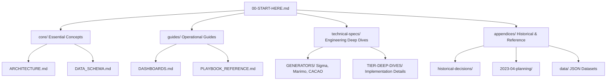

# SentinelMesh Navigation Map

This map explains how the documentation folders relate to each other and provides a guide for where to find information based on your current task.

## Documentation Hierarchy

## Where should I look?

| If you want to...                | Look in...         | Key Document                                                        |
| -------------------------------- | ------------------ | ------------------------------------------------------------------- |
| **Understand the system design** | `core/`            | [ARCHITECTURE.md](core/ARCHITECTURE.md)                             |
| **Check API/Data formats**       | `core/`            | [DATA_SCHEMA.md](core/DATA_SCHEMA.md)                               |
| **Operate the dashboards**       | `guides/`          | [DASHBOARDS.md](guides/DASHBOARDS.md)                               |
| **Browse implemented features**  | `core/`            | [CORE_FEATURES.md](core/CORE_FEATURES.md)                           |
| **Read technical specs**         | `technical-specs/` | [DOCUMENTATION_MAP.md](technical-specs/DOCUMENTATION_MAP.md)        |
| **Search the 60k+ playbooks**    | `guides/`          | [PLAYBOOK_REFERENCE.md](guides/PLAYBOOK_REFERENCE.md)               |
| **Review threat actors**         | `appendices/`      | [THREAT_ACTORS_REFERENCE.md](appendices/THREAT_ACTORS_REFERENCE.md) |
| **See historical context**       | `appendices/`      | [README.md](appendices/README.md)                                   |

## Related Documentation Patterns

Most active documents include a **Related Documentation** section at the bottom to help you navigate between conceptual, operational, and technical layers of the same feature.

- **Concepts** (in `core/`) link to **Operations** (in `guides/`)
- **Operations** link to **Specs** (in `technical-specs/`)
- **Specs** link to **Archives** (in `appendices/`) if they have historical versions.
