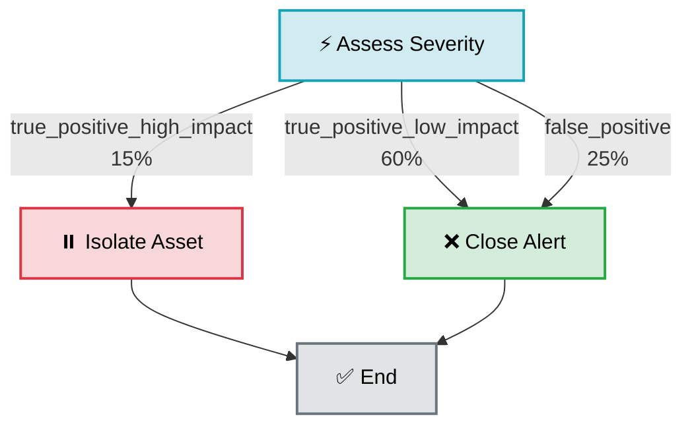
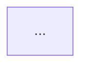
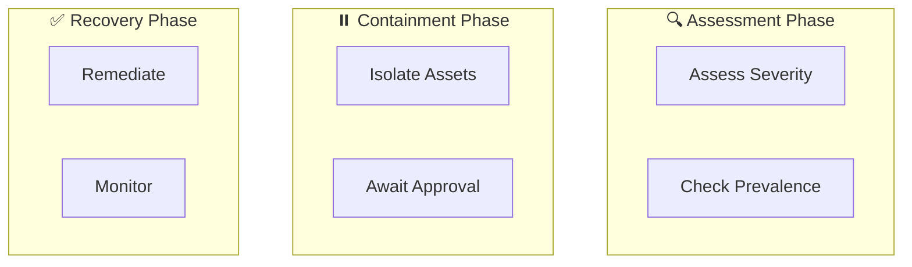

# Specification: Utilize Mermaid.js Decision DAGs for Playbook Visualization

## Problem Statement

Operators executing incident playbooks face cognitive overload:

- **Monolithic 500-line notebooks** require reading cell-by-cell to understand flow
- **Branching logic implicit** in code (no visual representation)
- **Risk assessment requires expertise** — operators can't quickly identify critical paths
- **What-if scenarios slow down** incident response ("which containment actions happen if I approve this?")

Without visualization, operators:

- Miss critical branching paths that affect containment
- Approve decisions without understanding downstream implications
- Lack situational awareness during execution
- Cannot quickly identify which paths are reversible vs irreversible

**Impact:**

- Slower incident response (more time understanding playbook)
- Operator errors (wrong decision path selected)
- Risk blindness (state-mutating actions not highlighted)

---

## Goals

1. **Immediate visualization** of playbook logic structure
2. **Risk awareness**: Color-code paths by impact level
3. **Decision clarity**: Show all possible branches and outcomes
4. **What-if analysis**: Help operators anticipate consequences
5. **Situational awareness**: Flowchart visible during execution

---

## Functional Requirements

### R1: DAG Structure Extraction

**R1.1 — Playbook Logic Parsing**
From playbook structure, extract:

- **Decision points** (agent decisions, branching)
- **Actions** (remediation, containment, investigation)
- **Outcomes** (possible transitions from each node)
- **Risks** (whether action mutates state)

Example input playbook structure:

```json
{
  "entry_point": "assess_severity",
  "branches": {
    "assess_severity": {
      "type": "decision",
      "description": "Determine alert severity and confidence",
      "outcomes": {
        "true_positive_high_impact": {
          "target": "initiate_containment",
          "probability": 0.15
        },
        "true_positive_low_impact": {
          "target": "escalate_to_soc",
          "probability": 0.6
        },
        "false_positive": {
          "target": "close_alert",
          "probability": 0.25
        }
      }
    },
    "initiate_containment": {
      "type": "action",
      "state_mutating": true,
      "severity": "high",
      "description": "Isolate affected assets",
      "next": "await_approval"
    },
    "close_alert": {
      "type": "action",
      "state_mutating": false,
      "description": "Close alert in SIEM",
      "next": "terminal"
    }
  }
}
```

**R1.2 — Node Types**

- **Decision**: Agent or human decision point, has multiple outcomes
- **Action**: Single action, has one successor
- **State Mutation**: Action that changes incident state (containment, remediation)
- **Query**: Information gathering (read-only, safe)
- **Alert**: Escalation or notification
- **Terminal**: End state

**R1.3 — Risk Classification**
Per node:

- **SAFE** (Green): Query or read-only action
- **MEDIUM** (Yellow): Moderate impact, reversible
- **HIGH** (Red): Significant impact, may be reversible
- **CRITICAL** (Dark Red): Severe impact, likely irreversible

Determined by:

- `state_mutating: true` → at least HIGH
- `severity: "high"` → HIGH or CRITICAL
- No mutation → SAFE

---

### R2: Mermaid.js Diagram Generation

**R2.1 — Syntax Generation**
Convert extracted nodes/edges to Mermaid flowchart syntax:



**R2.2 — Styling Rules**

| Node Type      | Safe Risk    | Medium Risk  | High Risk           | Critical            |
| -------------- | ------------ | ------------ | ------------------- | ------------------- |
| Query          | 🟢 `#d4edda` | N/A          | N/A                 | N/A                 |
| Action         | 🟢 `#d4edda` | 🟡 `#fff3cd` | 🔴 `#f8d7da`        | 🔴 `#f5c6cb`        |
| Decision       | 🔵 `#d1ecf1` | 🟡 `#fff3cd` | N/A                 | N/A                 |
| State Mutation | N/A          | 🟡 `#fff3cd` | 🔴 `#f8d7da` (bold) | 🔴 `#f5c6cb` (bold) |
| Alert          | 🔴 `#f8d7da` | 🔴 `#f8d7da` | 🔴 `#f8d7da`        | 🔴 `#f5c6cb`        |

**R2.3 — Edge Labels**

- Display decision outcome names (e.g., "true_positive_high_impact")
- Show probabilities if available (e.g., "60%")
- Format: `label\nprobability%`

**R2.4 — Visual Indicators**
Optional emoji indicators:

- ⚡ Decision point
- ⏸️ Containment/pause action
- 🔍 Investigation/query
- ❌ Close/dismiss
- ✅ Complete/success
- ⚠️ Warning/escalation

---

### R3: Diagram Embedding

**R3.1 — Notebook Cell Placement**

- **Position**: Cell 1 (immediately after title/overview)
- **Type**: Markdown cell
- **Content**: Markdown header + Mermaid code block + legend

**R3.2 — Cell Content Format**

````markdown
## 📊 Playbook Decision Flowchart

This diagram shows all possible decision paths through the playbook.

**Legend:**

- 🟢 **Green**: Safe (information-gathering only)
- 🟡 **Yellow**: Medium risk (some asset impact)
- 🔴 **Red**: High risk (state-mutating actions like containment)
- 🔵 **Blue**: Decision point

**How to use:**

1. Review flowchart before execution
2. Identify which branch your incident will follow
3. Note any high-risk (red) nodes in your path
4. Plan approval/escalation timing


````

````

**R3.3 — Rendering Support**
Diagram must render in:
- Jupyter Notebook (browser-based)
- Marimo reactive notebooks
- GitHub (Markdown preview)
- HTML export (when converted)
- JupyterLab

Mermaid.js library handles rendering automatically in all modern browsers.

---

### R4: Dynamic Diagram Updates

**R4.1 — Build-Time Generation (Static)**
- Playbook structure known at generation time
- Diagram generated once, embedded in notebook
- Unchanging throughout execution

**R4.2 — Runtime Regeneration (Dynamic)**
- In Cell 4 (routing decision), playbook can compute routing dynamically
- After routing decision made, regenerate diagram showing executed path
- Highlight taken path in bold or different color

Example:
```python
REDACTED
````

---

### R5: Risk Visualization Strategy

**R5.1 — Color-Based Risk Assessment**

Operators should be able to **glance at the diagram** and immediately see:

- Which paths are state-mutating (RED)
- Which paths are safe/reversible (GREEN)
- Probability of each path (percentages)

**R5.2 — Visual Hierarchy**

- **Most critical paths**: Bold borders, dark red (`#721c24`)
- **High-risk paths**: Red (`#dc3545`)
- **Medium-risk paths**: Yellow (`#ffc107`)
- **Safe paths**: Green (`#28a745`) or blue (`#17a2b8` for decisions)

**R5.3 — Complexity Management**
For large playbooks (50+ nodes):

- Group nodes by decision stage
- Use subgraphs for clarity
- Provide "collapsed" view with high-level decisions only
- Allow operators to expand for details

Example (50-node playbook with subgraphs):



---

## Non-Functional Requirements

### NF1: Performance

| Operation                         | Target | Rationale                         |
| --------------------------------- | ------ | --------------------------------- |
| DAG extraction (50-node playbook) | <50ms  | Build-time, acceptable latency    |
| Mermaid syntax generation         | <50ms  | Build-time                        |
| Total diagram generation          | <200ms | Build-time, one-time per playbook |
| Diagram rendering (browser)       | <500ms | Runtime, acceptable UX            |

### NF2: Visual Quality

- **Resolution-independent**: SVG rendering (scales to any screen size)
- **Accessibility**: Color + text labels (not color-only for risk)
- **Printing**: Diagram must be legible when printed
- **Dark mode**: Diagram colors adjusted for dark backgrounds

### NF3: Maintainability

- Diagram generated from single source of truth (playbook structure)
- Changes to playbook structure automatically update diagram
- No manual diagram editing required
- Diagram and code always in sync

---

## Example Walkthrough

### Scenario: Ransomware Incident Playbook

**Playbook structure:**

- Entry point: `assess_severity`
- 3 decision points (severity, prevalence, approval)
- 5 possible paths (escalate, isolate, monitor, remediate, close)
- 2 high-risk paths (isolate assets, terminate processes)

**Generated diagram:**

```
┌─────────────────────────┐
│  Assess Severity (BLUE) │
└──────────┬──────────────┘
     /     |      \
 15% / 60% | 25%   \
   /       |        \
┌────────┐ ┌──────┐ ┌─────────┐
│Escalate│ │Monitor│ │Close(GN)│
│  (RED) │ │(YEL) │ │         │
└────────┘ └──────┘ └─────────┘
    |        |          |
    └────────┴──────────┘
          |
      ┌───────┐
      │ End   │
      └───────┘
```

**Visual summary (at a glance):**

- Red path (15%): High-risk escalation/isolation
- Yellow path (60%): Medium-risk monitoring
- Green path (25%): Safe close

**Operator decision-making:**

- "If I approve escalation, it's RED (high risk)"
- "Most likely (60%) we just monitor"
- "Small chance (15%) we need containment"

---

## Test Specifications

### Unit Tests

1. **test_extract_nodes_linear** — Simple A→B→C path
2. **test_extract_nodes_branching** — Decision with 3+ outcomes
3. **test_extract_nodes_parallel** — Multiple concurrent branches
4. **test_node_type_classification** — Correct node types assigned
5. **test_risk_level_safe** — Query = SAFE
6. **test_risk_level_high** — State-mutating = HIGH
7. **test_risk_level_critical** — Severity=critical → CRITICAL
8. **test_edge_probability_preserved** — Probabilities in output
9. **test_mermaid_syntax_valid** — Generated syntax is valid Mermaid
10. **test_mermaid_colors_applied** — Color classes applied per risk level
11. **test_mermaid_edges_labeled** — Outcome names appear on edges
12. **test_markdown_cell_valid** — Generated cell is valid Markdown
13. **test_performance_50_nodes** — <200ms for 50-node playbook
14. **test_empty_playbook** — Handled gracefully
15. **test_missing_entry_point** — Handled with warning
16. **test_cycles_in_playbook** — Cycles don't cause infinite loops

### Integration Tests

17. **test_notebook_includes_dag_cell** — Generated notebook has diagram
18. **test_dag_cell_position** — Diagram is Cell 1 (after title)
19. **test_mermaid_renders_jupyter** — Renders in Jupyter/Lab
20. **test_mermaid_renders_github** — Renders on GitHub markdown preview
21. **test_all_generators_support_dag** — V2, V1, Marimo, CACAO all include

### Scenario Tests

22. **test_ransomware_playbook_dag** — Realistic ransomware DAG renders correctly
23. **test_lateral_movement_playbook_dag** — Complex multi-stage playbook renders
24. **test_false_positive_playbook_dag** — Simple closed-loop playbook

---

## Edge Cases & Handling

| Edge Case                             | Handling                                           |
| ------------------------------------- | -------------------------------------------------- |
| Playbook with cycles (feedback loops) | Detect and flatten to avoid infinite visualization |
| Very large playbook (100+ nodes)      | Use hierarchical layout or provide zoom/scroll     |
| Missing descriptions on nodes         | Use node IDs as fallback labels                    |
| No probabilities provided             | Omit probability labels, render outcomes equally   |
| Unreachable nodes (dead code)         | Render but gray out (unreachable)                  |
| Orphaned branches (no incoming edges) | Highlight as potential bug in playbook logic       |

---

## Success Criteria

✅ 100% of playbooks include decision DAG visualization
✅ All nodes and edges visible at once (no clipping)
✅ Risk colors clear and distinguishable (color-blind accessible)
✅ Diagram generates in <200ms
✅ Diagram renders in Jupyter, Marimo, GitHub
✅ Operators report improved understanding of playbook logic
✅ Decision paths clear without reading code

---

## Browser & Rendering Support

Mermaid.js requires:

- Modern browser (Chrome, Firefox, Safari, Edge 2020+)
- JavaScript enabled
- SVG support

Fallback (if Mermaid not available):

- Display warning: "Diagram requires JavaScript and modern browser"
- Provide ASCII text representation of DAG as fallback

---

## Accessibility Requirements (WCAG 2.1 Level AA)

- ✅ Color + text labels (not color-only)
- ✅ Sufficient contrast between colors (4.5:1 minimum)
- ✅ Text descriptions for all nodes
- ✅ Alternative text representation (table of paths)
- ✅ Keyboard navigation (if Mermaid provides)
