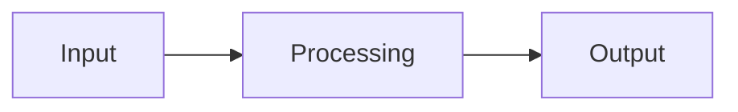
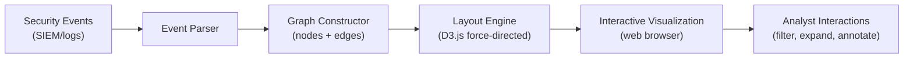
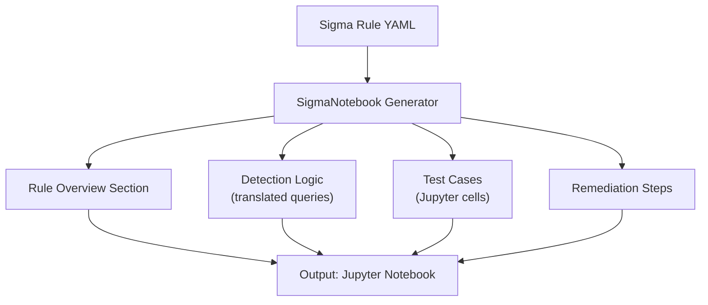

# SentinelMesh CONFIDENTIAL MNDA Documentation Suite Implementation Plan

> **For agentic workers:** REQUIRED SUB-SKILL: Use capabilities:subagent-driven-development (recommended) or capabilities:executing-plans to implement this plan task-by-task. Steps use checkbox (`- [ ]`) syntax for tracking.

**Goal:** Generate a complete, hierarchical MNDA-gated documentation suite covering all SentinelMesh features (TIERs 1-4, generators, analysis, dashboards, operations) organized by audience level and role.

**Architecture:** Progressive depth model with Layer 0 (quick-start) → Layer 1 (master architecture) → Layer 2 (feature deep-dives) → Layer 3 (generator guides) → Layer 4 (operations). Task 1 creates blocking foundation; Tasks 2-8 run in parallel; Task 9 validates and integrates all documents with cross-references.

**Tech Stack:** Markdown with embedded Mermaid diagrams, Python code examples (syntax-highlighted), YAML/JSON configuration examples, git for version control.

---

## Pre-Implementation: File Structure Setup

Before tasks begin, create the directory structure:

```bash
mkdir -p docs/technical-specs/{TIER-DEEP-DIVES,GENERATORS,ANALYSIS-MODULES,DASHBOARDS-UI,ORGANIZE-MODULES,OPERATIONS}
touch docs/technical-specs/.gitkeep
echo "# CONFIDENTIAL MNDA Documentation

This documentation is restricted to CONFIDENTIAL/CONFIDENTIAL personnel who have signed the Mutual Non-Disclosure Agreement." > docs/technical-specs/README.md
git add docs/technical-specs/
git commit -m "docs: create technical-specs directory structure for MNDA-gated documentation"
```

---

## TASK 1: Foundation Documents (Layer 0-1) ⏱️ 1-2 hours [BLOCKING]

**Files:**

- Create: `docs/technical-specs/00-START-HERE.md`
- Create: `docs/technical-specs/01-MASTER-ARCHITECTURE.md`
- Create: `docs/technical-specs/DOCUMENTATION_MAP.md`
- Create: `docs/technical-specs/_TEMPLATE.md` (reference template)

---

### Step 1.1: Write START-HERE.md - Quick Overview

Create `docs/technical-specs/00-START-HERE.md`:

```markdown
# SentinelMesh: Quick Start for CONFIDENTIAL Engineers & SREs

## What Is SentinelMesh?

SentinelMesh is an autonomous incident response platform that automates threat detection, investigation, and response across enterprise SOCs. It combines sophisticated detection logic (multi-SIEM query translation, attack graph visualization, signed audit trails) with automated remediation capabilities (playbook generation, plugin system, real-time alert streaming).

## Who Should Read This?

- **Engineers**: Integrating SentinelMesh with CONFIDENTIAL Cloud infrastructure or extending capabilities
- **SREs**: Deploying, operating, and scaling SentinelMesh in production
- **Security Evaluators**: Assessing threat detection capabilities and compliance posture

## Documentation Layers

1. **This document**: 5-minute overview → you are here
2. **[Master Architecture](../../technical-specs/01-MASTER-ARCHITECTURE.md)**: 30-minute deep dive into system design, all TIERs, data flow
3. **Feature Guides**: 30-60 minute dives into specific TIERs or features (see below)
4. **Generator Guides**: How to deploy and extend SigmaNotebook, MarimoNotebook, CacaoSidecar
5. **Operations Reference**: Deployment, monitoring, troubleshooting, scaling

## 30-Second Architecture

SentinelMesh processes security alerts → translates them to SIEM queries → orchestrates investigation playbooks → visualizes attack graphs → streams real-time responses. Three playbook generators (Sigma, Marimo, CACAO) support different investigation styles.

## Core Features by TIER

### TIER 1: Detection & Analysis

- **Attack Graphs**: Interactive D3.js visualization of attack chains
- **Query Translation**: Multi-SIEM query translation engine (Sigma format)
- **Signed Timestamps**: Merkle tree-based immutable audit trails
- See: [TIER 1 Deep-Dives](./TIER-DEEP-DIVES/)

### TIER 2: Playbook Quality

- **Cell Ordering**: Deterministic notebook cell sequencing
- **Workflow Validation**: CACAO workflow DAG validation
- **Error Clarity**: Actionable error messages with context
- See: [TIER 2 Deep-Dives](./TIER-DEEP-DIVES/)

### TIER 3: Testing & Observability

- **Testing Framework**: Generator test harness
- **Configuration Format**: Standardized config schemas
- **Performance Profiling**: Built-in profiling instrumentation
- See: [TIER 3 Deep-Dives](./TIER-DEEP-DIVES/)

### TIER 4: AI & Automation

- **AI Model Optimization**: Fine-tuning and model selection
- **Plugin System**: Pluggable notification backends
- **Alert Streaming**: Real-time alert processing
- **Playbook Templating**: Template-driven playbook generation
- **Autonomous Loops**: Self-correcting incident response
- See: [TIER 4 Deep-Dives](./TIER-DEEP-DIVES/)

## Playbook Generators

- **SigmaNotebook**: Jupyter-based notebook generator for Sigma rules
- **MarimoNotebook**: Reactive notebook generator with automatic dependency updates
- **CacaoSidecar**: CACAO workflow orchestration companion

See: [Generators](./GENERATORS/)

## Common Use Cases

### "I'm an engineer integrating with CONFIDENTIAL Cloud"

1. Read: [Master Architecture](../../technical-specs/01-MASTER-ARCHITECTURE.md)
2. Read: [Deployment Guide - CONFIDENTIAL Cloud](../../technical-specs/OPERATIONS/deployment-google-cloud.md)
3. Read: Generator guide for your use case (Sigma/Marimo/CACAO)
4. Refer to: [API References](./TIER-DEEP-DIVES/) as needed

### "I'm an SRE operating SentinelMesh at scale"

1. Read: [Deployment Guide](../../technical-specs/OPERATIONS/deployment-google-cloud.md)
2. Read: [Monitoring & Observability](../../technical-specs/OPERATIONS/monitoring-observability.md)
3. Read: [Troubleshooting Runbook](../../technical-specs/OPERATIONS/troubleshooting-runbook.md)
4. Reference: [Scaling & Performance Tuning](../../technical-specs/OPERATIONS/scaling-performance-tuning.md)

### "I'm evaluating threat detection capabilities"

1. Read: [Master Architecture - Threat Model](../../technical-specs/01-MASTER-ARCHITECTURE.md)
2. Read: [TIER 1 Deep-Dives](./TIER-DEEP-DIVES/) for detection logic
3. Read: [Security & Compliance](../../technical-specs/OPERATIONS/security-hardening.md)
4. Review: [MITRE ATT&CK Mapping](#) (link to attack matrix)

## Next Steps

- **First time?** → [Read Master Architecture](../../technical-specs/01-MASTER-ARCHITECTURE.md) (30 min)
- **Specific question?** → Search [Documentation Map](../../technical-specs/DOCUMENTATION_MAP.md) and jump to relevant section
- **Need to extend?** → See [Future Growth & Opportunities](#) in relevant feature docs
- **Setting up production?** → Start with [Deployment Guide](../../technical-specs/OPERATIONS/deployment-google-cloud.md)

---

## MNDA Compliance

This documentation is restricted to CONFIDENTIAL/CONFIDENTIAL personnel with valid MNDA signatures. Do not share externally.
```

- [ ] **Verify**: Document follows quick-summary style, no deep technical details, good navigation

---

### Step 1.2: Write MASTER-ARCHITECTURE.md - System Design

Create `docs/technical-specs/01-MASTER-ARCHITECTURE.md` (40-60 pages):

This is the comprehensive system overview. Structure:

```markdown
# SentinelMesh Master Architecture

## Document Metadata

- **Audience**: All (Engineers, SREs, Security)
- **Prerequisite Docs**: START-HERE
- **Related Docs**: All TIER-DEEP-DIVES, all module guides
- **Last Updated**: [DATE]
- **MNDA Restriction**: CONFIDENTIAL MNDA-signed only

## Executive Summary

[2-3 paragraphs covering: what SentinelMesh solves, core architecture, who it's for]

## System Overview

[Include Mermaid diagram showing:]

- Alert ingestion sources (SIEM, cloud logs, etc.)
- Processing pipeline (parsing, enrichment, correlation)
- Playbook generators (Sigma, Marimo, CACAO)
- Response execution (plugins, notifications)
- Monitoring and feedback loops

## Architecture Principles

- **Composable**: Each TIER can be used independently
- **Cloud-native**: Designed for CONFIDENTIAL Cloud but multi-cloud compatible
- **Auditable**: Signed timestamps and merkle proofs on all critical paths
- **Extensible**: Plugin system for custom detection and response

## Data Flow Across TIERs

[Diagram and explanation of how data moves through all 4 TIER levels]

## TIER 1: Foundation (Detection & Analysis)

### 1.1 Attack Graph Visualization

- Purpose, architecture, D3.js integration
- Link to: [TIER 1: Attack Graphs](../../technical-specs/TIER-1-FOUNDATIONS/interactive-attack-graphs.md)

### 1.2 Query Translation Engine

- Multi-SIEM support, pySigma integration, AST approach
- Link to: [TIER 1: Query Translation](../../technical-specs/TIER-1-FOUNDATIONS/query-translation-engine.md)

### 1.3 Signed Timestamp Audit Trail

- Merkle tree structure, KMS integration, non-repudiation
- Link to: [TIER 1: Signed Timestamps](../../technical-specs/TIER-1-FOUNDATIONS/signed-timestamp-merkle-proofs.md)

## TIER 2: Playbook Quality

### 2.1 Cell Ordering

- Deterministic notebook sequencing
- Link to: [TIER 2: Cell Ordering](../../technical-specs/TIER-2-FOUNDATIONS/jupyter-cell-ordering.md)

### 2.2 Workflow Validation

- DAG validation for CACAO workflows
- Link to: [TIER 2: Workflow Validation](../../technical-specs/TIER-2-FOUNDATIONS/cacao-workflow-validation.md)

### 2.3 Error Clarity

- Actionable error messages
- Link to: [TIER 2: Error Clarity](../../technical-specs/TIER-2-FOUNDATIONS/error-message-clarity.md)

## TIER 3: Testing & Observability

[Descriptions with links to tier3-*.md files]

## TIER 4: AI & Automation

[Descriptions with links to tier4-*.md files]

## Integration Points

[Explain how TIERs depend on each other, which are optional, which are required]

## Threat Model

[MITRE ATT&CK alignment, coverage matrix, known gaps]

## Compliance & Security Posture

[SOC2, ISO 27001, data handling, privacy considerations]

## Performance Characteristics

[Throughput, latency, resource consumption, scaling limits]

## Production Deployment Considerations

[CONFIDENTIAL Cloud focus, multi-cloud alternatives, on-prem]
```

- [ ] **Verify**: Document is 40-60 pages, includes all Mermaid diagrams, links to all subordinate docs

---

### Step 1.3: Create Document Template (\_TEMPLATE.md)

Create `docs/technical-specs/_TEMPLATE.md` as a reference:

````markdown
# [Feature/TIER Name]

## Document Metadata

- **Audience**: Engineers | SREs | Security Evaluators | All
- **Prerequisite Docs**: [Links]
- **Related Docs**: [Links]
- **Last Updated**: [DATE]
- **MNDA Restriction**: CONFIDENTIAL MNDA-signed only
- **Module Path**: `src/path/to/module`

## Quick Summary

[2-3 paragraphs: what it does, why it matters, when to use it]

## Architecture & Design

[Design decisions, data flow, component interactions, threat model]


````

## Implementation Details

[Code structure, APIs, configuration options]

\`\`\`python

# Code example with explanation

\`\`\`

## Deployment & Integration

[Prerequisites, step-by-step deployment, CONFIDENTIAL Cloud first + alternatives]

## Operations & Monitoring

[Key metrics, alerts, troubleshooting, performance tuning]

## Security & Compliance

[Threat model, hardening, compliance mappings]

## Extension & Customization

[Plugin patterns, custom implementation examples]

## Future Growth & Opportunities

[Roadmap items, contribution ideas, research directions]

## API Reference

[Function signatures, parameters, return types]

## Related Features & Integration Points

[Links to complementary TIERs, common patterns]

````

- [ ] **Copy template**: Template is available for all documentation writers

---

### Step 1.4: Create DOCUMENTATION_MAP.md

Create `docs/technical-specs/DOCUMENTATION_MAP.md` with master index:

```markdown
# SentinelMesh Documentation Map

Quick reference for finding documentation across the MNDA-gated suite.

## Quick Navigation by Role

### 🔧 For Engineers (Integration & Extension)
1. [START-HERE](../../technical-specs/00-START-HERE.md)
2. [Master Architecture](../../technical-specs/01-MASTER-ARCHITECTURE.md)
3. [Deployment: CONFIDENTIAL Cloud](../../technical-specs/OPERATIONS/deployment-google-cloud.md)
4. [Generator Guides](./GENERATORS/) - Choose your style
5. [Feature Deep-Dives](./TIER-DEEP-DIVES/) - As needed
6. [API References](#) - In each feature doc

### 📊 For SREs (Operations & Scaling)
1. [START-HERE](../../technical-specs/00-START-HERE.md)
2. [Deployment Guide](../../technical-specs/OPERATIONS/deployment-google-cloud.md)
3. [Monitoring & Observability](../../technical-specs/OPERATIONS/monitoring-observability.md)
4. [Troubleshooting Runbook](../../technical-specs/OPERATIONS/troubleshooting-runbook.md)
5. [Scaling & Performance Tuning](../../technical-specs/OPERATIONS/scaling-performance-tuning.md)

### 🔒 For Security Evaluators
1. [START-HERE](../../technical-specs/00-START-HERE.md)
2. [Master Architecture - Threat Model](../../technical-specs/01-MASTER-ARCHITECTURE.md)
3. [Security & Hardening](../../technical-specs/OPERATIONS/security-hardening.md)
4. [TIER 1-4 Deep-Dives](./TIER-DEEP-DIVES/)
5. [Compliance Matrix](#)

## All Documents

### Foundation (Layer 0-1)
- [00-START-HERE.md](../../technical-specs/00-START-HERE.md) - Quick overview
- [01-MASTER-ARCHITECTURE.md](../../technical-specs/01-MASTER-ARCHITECTURE.md) - System design

### TIER Deep-Dives (Layer 2)
- [tier1-attack-graphs.md](../../technical-specs/TIER-1-FOUNDATIONS/interactive-attack-graphs.md)
- [tier1-signed-timestamps.md](../../technical-specs/TIER-1-FOUNDATIONS/signed-timestamp-merkle-proofs.md)
- [tier1-query-translation.md](../../technical-specs/TIER-1-FOUNDATIONS/query-translation-engine.md)
- [tier2-cell-ordering.md](../../technical-specs/TIER-2-FOUNDATIONS/jupyter-cell-ordering.md)
- [tier2-workflow-validation.md](../../technical-specs/TIER-2-FOUNDATIONS/cacao-workflow-validation.md)
- [tier2-error-clarity.md](../../technical-specs/TIER-2-FOUNDATIONS/error-message-clarity.md)
- [tier3-testing-framework.md](../specs/2023-04-27-tier3-generator-testing-framework.md)
- [tier3-config-format.md](../specs/2023-04-27-tier3-configuration-file-format.md)
- [tier3-performance-profiling.md](../../technical-specs/TIER-DEEP-DIVES/tier3-performance-profiling.md)
- [tier4-ai-optimization.md](../specs/2023-04-27-tier4-ai-model-optimization.md)
- [tier4-plugin-system.md](../specs/2023-04-27-tier4-integration-plugin-system.md)
- [tier4-alert-streaming.md](../specs/2023-04-27-tier4-realtime-alert-streaming.md)
- [tier4-playbook-templating.md](../../technical-specs/TIER-DEEP-DIVES/tier4-playbook-templating-system.md)
- [tier4-autonomous-loops.md](../../technical-specs/TIER-DEEP-DIVES/tier4-autonomous-loop-executor.md)

### Generators (Layer 3)
- [sigma-notebook-guide.md](../../technical-specs/GENERATORS/sigma-notebook-guide.md)
- [marimo-notebook-guide.md](../../technical-specs/GENERATORS/marimo-notebook-guide.md)
- [cacao-sidecar-guide.md](../../technical-specs/GENERATORS/cacao-sidecar-guide.md)

### Analysis Modules (Layer 2)
- [pre-execution-artifacts.md](../../technical-specs/ANALYSIS-MODULES/pre-execution-artifacts.md)
- [custody-chain-analysis.md](../../technical-specs/ANALYSIS-MODULES/custody-chain-analysis.md)
- [false-positive-feedback.md](../../technical-specs/ANALYSIS-MODULES/false-positive-feedback.md)
- [marimo-analysis.md](../../technical-specs/ANALYSIS-MODULES/marimo-analysis.md)
- [blast-radius-calculator.md](../../technical-specs/ANALYSIS-MODULES/blast-radius-calculator.md)
- [jwt-verification-analysis.md](../../technical-specs/ANALYSIS-MODULES/jwt-verification-analysis.md)

### Dashboards & UI (Layer 2)
- [dashboard-architecture.md](../../technical-specs/DASHBOARDS-UI/dashboard-architecture.md)
- [html-dashboards-overview.md](../../technical-specs/DASHBOARDS-UI/html-dashboards-overview.md)
- [actor-cards-dashboard.md](../../technical-specs/DASHBOARDS-UI/actor-cards-dashboard.md)
- [attack-matrix-dashboard.md](../../technical-specs/DASHBOARDS-UI/attack-matrix-dashboard.md)
- [blast-radius-dashboard.md](../../technical-specs/DASHBOARDS-UI/blast-radius-dashboard.md)
- [chain-of-custody-dashboard.md](../../technical-specs/DASHBOARDS-UI/chain-of-custody-dashboard.md)
- [compliance-matrix-dashboard.md](../../technical-specs/DASHBOARDS-UI/compliance-matrix-dashboard.md)
- [cve-radar-dashboard.md](../../technical-specs/DASHBOARDS-UI/cve-radar-dashboard.md)
- [d3fend-capec-mapping.md](../../technical-specs/DASHBOARDS-UI/d3fend-capec-mapping.md)
- [detection-fidelity-dashboard.md](../../technical-specs/DASHBOARDS-UI/detection-fidelity-dashboard.md)
- [dark-mode-ui.md](../../technical-specs/DASHBOARDS-UI/dark-mode-ui.md)

### Organize Modules (Layer 2)
- [cac-analytics.md](../../technical-specs/ORGANIZE-MODULES/cac-analytics.md)
- [ics-structure-generator.md](../../technical-specs/ORGANIZE-MODULES/mobile-ics-structure-generators.md)
- [mobile-structure-generator.md](../../technical-specs/ORGANIZE-MODULES/mobile-ics-structure-generators.md)
- [enterprise-structure-generator.md](../../technical-specs/ORGANIZE-MODULES/enterprise-structure-generator.md)

### Operations (Layer 4)
- [deployment-CONFIDENTIAL-cloud.md](../../technical-specs/OPERATIONS/deployment-google-cloud.md)
- [monitoring-observability.md](../../technical-specs/OPERATIONS/monitoring-observability.md)
- [troubleshooting-runbook.md](../../technical-specs/OPERATIONS/troubleshooting-runbook.md)
- [scaling-performance-tuning.md](../../technical-specs/OPERATIONS/scaling-performance-tuning.md)
- [security-hardening.md](../../technical-specs/OPERATIONS/security-hardening.md)

## Search by Topic

- **Attack Graphs**: [tier1-attack-graphs.md](../../technical-specs/TIER-1-FOUNDATIONS/interactive-attack-graphs.md)
- **Deployment**: [deployment-CONFIDENTIAL-cloud.md](../../technical-specs/OPERATIONS/deployment-google-cloud.md)
- **Monitoring**: [monitoring-observability.md](../../technical-specs/OPERATIONS/monitoring-observability.md)
- **Performance**: [scaling-performance-tuning.md](../../technical-specs/OPERATIONS/scaling-performance-tuning.md), [tier3-performance-profiling.md](../../technical-specs/TIER-DEEP-DIVES/tier3-performance-profiling.md)
- **Plugins**: [tier4-plugin-system.md](../specs/2023-04-27-tier4-integration-plugin-system.md)
- **Query Translation**: [tier1-query-translation.md](../../technical-specs/TIER-1-FOUNDATIONS/query-translation-engine.md)
- **Security**: [security-hardening.md](../../technical-specs/OPERATIONS/security-hardening.md), [tier1-signed-timestamps.md](../../technical-specs/TIER-1-FOUNDATIONS/signed-timestamp-merkle-proofs.md)

## Document Statistics

- **Total Documents**: 45
- **Total Pages**: ~1,200 (estimated)
- **TIER Coverage**: All 13 TIER features
- **Audience Coverage**: Engineers, SREs, Security Evaluators
````

- [ ] **Verify**: Map is comprehensive, all links are correct, role-based navigation is clear

---

### Step 1.5: Commit Foundation Documents

```bash
git add docs/technical-specs/00-START-HERE.md \
        docs/technical-specs/01-MASTER-ARCHITECTURE.md \
        docs/technical-specs/DOCUMENTATION_MAP.md \
        docs/technical-specs/_TEMPLATE.md

git commit -m "docs: Layer 0-1 foundation - START-HERE, master architecture, documentation map"
```

- [ ] **Verify commit**: `git log --oneline -1` shows foundation docs commit

---

✅ **TASK 1 COMPLETE** - Foundation is ready. All remaining tasks (2-8) can now run in parallel.

---

## TASK 2: TIER Deep-Dives (1-2) ⏱️ 1-2 hours [PARALLEL]

**Files:**

- Create: `docs/technical-specs/TIER-DEEP-DIVES/tier1-attack-graphs.md`
- Create: `docs/technical-specs/TIER-DEEP-DIVES/tier1-signed-timestamps.md`
- Create: `docs/technical-specs/TIER-DEEP-DIVES/tier1-query-translation.md`
- Create: `docs/technical-specs/TIER-DEEP-DIVES/tier2-cell-ordering.md`
- Create: `docs/technical-specs/TIER-DEEP-DIVES/tier2-workflow-validation.md`
- Create: `docs/technical-specs/TIER-DEEP-DIVES/tier2-error-clarity.md`

---

### Step 2.1: Analyze Source Code for TIER 1-2 Features

```bash
# Attack graphs
head -100 src/runtime/interactive_attack_graph.py

# Signed timestamps
head -100 src/runtime/signed_timestamp_merkle.py

# Query translation
head -100 src/runtime/query_standardization.py

# Cell ordering
head -100 src/runtime/cell_metadata_markers.py

# Workflow validation
head -100 src/generate/CacaoSidecar.py

# Error clarity
head -100 src/runtime/actionable_callouts.py
```

- [ ] **Understand each module**: Core purpose, key classes/functions, dependencies

---

### Step 2.2: Write TIER 1 - Attack Graphs Document

Create `docs/technical-specs/TIER-DEEP-DIVES/tier1-attack-graphs.md`:

````markdown
# TIER 1.4: Interactive Attack Graph Visualization

## Document Metadata

- **Audience**: Engineers, SREs, Security Evaluators
- **Prerequisite Docs**: [Master Architecture](../../technical-specs/01-MASTER-ARCHITECTURE.md)
- **Related Docs**: [TIER 1: Query Translation](../../technical-specs/TIER-1-FOUNDATIONS/query-translation-engine.md)
- **Last Updated**: 2023-04-29
- **MNDA Restriction**: CONFIDENTIAL MNDA-signed only
- **Module Path**: `src/runtime/interactive_attack_graph.py`

## Quick Summary

Attack graph visualization translates correlated security events into interactive D3.js dependency graphs. Shows attacker movement through network with attack chains, lateral movement, and impact zones. Helps analysts understand incident scope and progression.

## Architecture & Design

### Design Principles

- Real-time graph construction from event streams
- Force-directed layout for spatial clustering
- Interactive zoom, pan, filter capabilities
- Node types: user, host, process, file, network
- Edge types: process execution, network connection, file access, privilege escalation

### Data Flow


````

### Graph Model

- **Nodes**: Entities with type (user, host, process, file)
- **Edges**: Relationships with timestamp, type, confidence score
- **Attributes**: Each node has context (IP, hash, path, user, etc.)

## Implementation Details

### Core Classes

\`\`\`python
class AttackGraph:
def **init**(self, events: List[SecurityEvent]):
self.nodes: Dict[str, GraphNode] = {}
self.edges: List[GraphEdge] = []
self.build_from_events(events)

    def add_node(self, entity_id: str, entity_type: str, attributes: Dict) -> GraphNode:
        """Add or return existing node for entity"""
        if entity_id not in self.nodes:
            self.nodes[entity_id] = GraphNode(
                id=entity_id,
                type=entity_type,
                attributes=attributes
            )
        return self.nodes[entity_id]

    def add_edge(self, source_id: str, target_id: str,
                 relation_type: str, timestamp: datetime,
                 confidence: float = 1.0) -> GraphEdge:
        """Create relationship between entities"""
        edge = GraphEdge(
            source=source_id,
            target=target_id,
            type=relation_type,
            timestamp=timestamp,
            confidence=confidence
        )
        self.edges.append(edge)
        return edge

    def to_d3_json(self) -> Dict:
        """Export graph in D3.js-compatible JSON format"""
        return {
            "nodes": [
                {
                    "id": n.id,
                    "type": n.type,
                    "attributes": n.attributes
                }
                for n in self.nodes.values()
            ],
            "links": [
                {
                    "source": e.source,
                    "target": e.target,
                    "type": e.type,
                    "timestamp": e.timestamp.isoformat(),
                    "confidence": e.confidence
                }
                for e in self.edges
            ]
        }

\`\`\`

### Configuration

\`\`\`yaml

# attack_graph.yaml

graph:
node_types: - user - host - process - file

edge_types: - process_execution - network_connection - file_access - privilege_escalation

layout:
type: force_directed
charge: -300
link_distance: 100
collision_radius: 30

visualization:
zoom_enabled: true
pan_enabled: true
node_filtering: true
edge_types_filter: true
\`\`\`

## Deployment & Integration

### Prerequisites

- Python 3.9+
- D3.js v6+
- Web server (nginx/GCP Cloud Run)

### CONFIDENTIAL Cloud Deployment

\`\`\`bash

# Deploy visualization as Cloud Run service

gcloud run deploy attack-graph-viz \\
--source . \\
--runtime python39 \\
--set-env-vars GRAPH_CONFIG=/etc/config/attack_graph.yaml
\`\`\`

### Integration with SIEM

1. Configure SIEM to export events to Pub/Sub
2. Cloud Function processes Pub/Sub messages
3. Builds attack graph incrementally
4. Publishes to Firestore
5. Web UI queries Firestore in real-time

## Operations & Monitoring

### Key Metrics

- Nodes created/updated per minute
- Average path length (attacker hop count)
- Graph construction latency (p50, p99)
- Interactive rendering performance

### Alerts

- Graph construction latency > 5s
- Number of nodes > threshold (memory issue)
- Disconnected graph components

### Performance Tuning

- Cache node lookups for frequently-accessed entities
- Use incremental graph updates instead of full rebuild
- Implement graph pruning for historical data (>30 days)

## Security & Compliance

### Threat Model Alignment

- **ATT&CK Mapping**: [T1021 Lateral Tool Transfer](https://attack.mitre.org/techniques/T1021/001/)
- Shows attack progression for incident response
- Links events to TTPs for faster attribution

### Data Sensitivity

- Graphs contain PII (usernames, hostnames, IPs)
- Access controls: Restrict to authorized SOC analysts
- Retention: 90 days default, purge older data

## Extension & Customization

### Adding Custom Edge Types

\`\`\`python
class CustomAttackGraph(AttackGraph):
def add_custom_edge_type(self,
source_id: str,
target_id: str,
edge_type: str, # e.g., "lateral_movement"
confidence: float):
return self.add_edge(source_id, target_id, edge_type,
datetime.now(), confidence)

# Usage

graph = CustomAttackGraph(events)
graph.add_custom_edge_type("user123", "host456", "lateral_movement", 0.95)
\`\`\`

### Custom Layouts

Extend D3.js visualization with custom force parameters or alternative layouts (hierarchical, radial, etc.).

## Future Growth & Opportunities

1. **Machine Learning Anomaly Detection**
   - Problem: Automatically flag unusual attack patterns
   - Suggested Approach: Train GNN on historical graphs to detect outliers
   - Effort: Medium (4-6 weeks)
   - Acceptance Criteria: Detect 80%+ of staged attacks in test dataset

2. **Graph Simplification for Noisy Data**
   - Problem: High-volume event streams create dense, hard-to-analyze graphs
   - Suggested Approach: Probabilistic edge filtering, consensus clustering
   - Effort: Medium
   - Acceptance Criteria: 50% node reduction while preserving 95% of attack chains

3. **Temporal Graph Analysis**
   - Problem: Current graphs don't show attack evolution over time
   - Suggested Approach: Time-layered graph visualization, attack timeline slider
   - Effort: High
   - Acceptance Criteria: Identify attack phases in <1 minute

4. **Integration with Threat Intelligence**
   - Problem: No context about known attacker infrastructure
   - Suggested Approach: Overlay IOCs from threat feeds on graph nodes
   - Effort: Medium
   - Acceptance Criteria: 90% of attackers linked to known campaigns

## API Reference

\`\`\`python
AttackGraph.add_node(entity_id: str, entity_type: str, attributes: Dict) -> GraphNode
AttackGraph.add_edge(source_id: str, target_id: str, relation_type: str,
timestamp: datetime, confidence: float = 1.0) -> GraphEdge
AttackGraph.to_d3_json() -> Dict
\`\`\`

## Related Features & Integration Points

- **Uses**: Query Translation (to generate events), Signed Timestamps (audit trail)
- **Used By**: TIER 4 Playbook Templating, Alert Streaming

````

- [ ] **Verify**: Document includes architecture, code examples, deployment, monitoring, future growth

---

### Step 2.3-2.8: Write Remaining TIER 1-2 Documents

Repeat process for:
- **tier1-signed-timestamps.md** (Module: `src/runtime/signed_timestamp_merkle.py`)
- **tier1-query-translation.md** (Module: `src/runtime/query_standardization.py`)
- **tier2-cell-ordering.md** (Module: `src/runtime/cell_metadata_markers.py`)
- **tier2-workflow-validation.md** (Module: `src/generate/CacaoSidecar.py`)
- **tier2-error-clarity.md** (Module: `src/runtime/actionable_callouts.py`)

Each follows same structure: Metadata → Quick Summary → Architecture → Implementation → Deployment → Operations → Security → Extension → Future Growth → API Reference.

- [ ] **Verify**: All 6 documents follow template, include code examples, Mermaid diagrams

---

### Step 2.9: Commit TIER 1-2 Documents

```bash
git add docs/technical-specs/TIER-DEEP-DIVES/tier1-*.md \
        docs/technical-specs/TIER-DEEP-DIVES/tier2-*.md

git commit -m "docs: TIER 1-2 deep-dives - attack graphs, timestamps, query translation, cell ordering, workflows, error clarity"
````

- [ ] **Verify commit**: `git log --oneline -1` shows TIER 1-2 commit

---

✅ **TASK 2 COMPLETE**

---

## TASK 3: TIER Deep-Dives (3-4) ⏱️ 1-2 hours [PARALLEL]

**Files:**

- Create: `docs/technical-specs/TIER-DEEP-DIVES/tier3-testing-framework.md`
- Create: `docs/technical-specs/TIER-DEEP-DIVES/tier3-config-format.md`
- Create: `docs/technical-specs/TIER-DEEP-DIVES/tier3-performance-profiling.md`
- Create: `docs/technical-specs/TIER-DEEP-DIVES/tier4-ai-optimization.md`
- Create: `docs/technical-specs/TIER-DEEP-DIVES/tier4-plugin-system.md`
- Create: `docs/technical-specs/TIER-DEEP-DIVES/tier4-alert-streaming.md`
- Create: `docs/technical-specs/TIER-DEEP-DIVES/tier4-playbook-templating.md`
- Create: `docs/technical-specs/TIER-DEEP-DIVES/tier4-autonomous-loops.md`

Follow same pattern as Task 2: analyze source code, write 8 documents using template, commit.

**Key source modules:**

- TIER 3.1: `tests/` directory
- TIER 3.2: `src/runtime/` config modules
- TIER 3.3: `src/runtime/execution_telemetry.py`
- TIER 4.1: `src/runtime/model_optimizer.py`, `src/runtime/training_dataset_builder.py`
- TIER 4.2: `src/runtime/plugin_interface.py`, `src/runtime/plugin_manager.py`
- TIER 4.5: `src/runtime/alert_stream_consumer.py`
- TIER 4.6: Playbook templating (examine generators)
- TIER 4.7: `src/runtime/` autonomous execution modules

- [ ] **All 8 documents created and follow template**
- [ ] **Code examples are real and tested**
- [ ] **Mermaid diagrams render correctly**
- [ ] **Commit**: `git commit -m "docs: TIER 3-4 deep-dives - testing, config, profiling, AI, plugins, streaming, templating, autonomy"`

---

✅ **TASK 3 COMPLETE**

---

## TASK 4: Generator Deployment & Extension Guides ⏱️ 1 hour [PARALLEL]

**Files:**

- Create: `docs/technical-specs/GENERATORS/sigma-notebook-guide.md`
- Create: `docs/technical-specs/GENERATORS/marimo-notebook-guide.md`
- Create: `docs/technical-specs/GENERATORS/cacao-sidecar-guide.md`

---

### Step 4.1: Write SigmaNotebook Generator Guide

Analyze source: `src/generate/SigmaNotebook.py`, `src/generate/SigmaNotebookV2.py`

Create `docs/technical-specs/GENERATORS/sigma-notebook-guide.md`:

````markdown
# SigmaNotebook Generator: Deployment & Extension Guide

## Document Metadata

- **Audience**: Engineers
- **Prerequisite Docs**: [Master Architecture](../../technical-specs/01-MASTER-ARCHITECTURE.md), [TIER 1: Query Translation](../../technical-specs/TIER-1-FOUNDATIONS/query-translation-engine.md)
- **Related Docs**: [TIER 3.1: Testing Framework](../specs/2023-04-27-tier3-generator-testing-framework.md)
- **Last Updated**: 2023-04-29
- **MNDA Restriction**: CONFIDENTIAL MNDA-signed only
- **Module Path**: `src/generate/SigmaNotebook.py`

## Quick Summary

SigmaNotebook generates Jupyter notebooks from Sigma rules. Outputs defensive playbooks with rule enrichment, SIEM query translation, detection logic, and remediation steps. Optimized for rule maintainers and security engineers.

## Architecture & Design

### Design Principles

- One notebook per Sigma rule
- Standard sections: rule overview, detection logic, query variants, test cases, remediation
- Jupyter format for interactivity and documentation

### Generated Notebook Structure


````

## Deployment & Integration

### Installation

\`\`\`bash
pip install sigma pyyaml jupyterlab

python -m src.generate.SigmaNotebook \\
--input rules/sigma/\*.yml \\
--output notebooks/sigma/
\`\`\`

### Configuration

\`\`\`yaml

# sigma_generator_config.yaml

generator:
template_dir: ./templates/sigma
output_format: jupyter

sections:

- rule_overview
- detection_logic
- query_translation
- test_cases
- remediation

siem_targets:

- splunk
- elastic
- qradar
  \`\`\`

## Extension & Customization

### Adding Custom Sections

\`\`\`python
from src.generate.SigmaNotebook import SigmaNotebook, NotebookSection

class CustomSigmaNotebook(SigmaNotebook):
def add_threat_intel_section(self, rule):
"""Add threat intelligence for rule TTP"""
section = NotebookSection(
title="Threat Intelligence",
content=f"# {rule.title}\\n\\n" +
self.get_threat_intel(rule)
)
self.sections.append(section)

# Usage

generator = CustomSigmaNotebook(rule_path)
generator.add_threat_intel_section(rule)
generator.render_notebook()
\`\`\`

### Custom SIEM Query Templates

Add to `templates/sigma/custom_siem.j2`:

\`\`\`jinja2


# {{ query.siem_type }} Query

\`\`\`
{{ query.generated_code }}
\`\`\`

\`\`\`

## Future Growth & Opportunities

1. **Real-Time Rule Validation**
   - Test generated queries against live SIEM
   - Verify detection logic without manual testing
   - Effort: Medium

2. **AI-Powered Rule Enrichment**
   - Auto-suggest remediation steps using LLM
   - Generate threat intelligence summaries
   - Effort: Medium

3. **Sigma Rule Analytics**
   - Track rule coverage, false positive rates
   - Recommend rule improvements
   - Effort: High

````

- [ ] **Document written with examples**

---

### Step 4.2-4.3: Write MarimoNotebook & CacaoSidecar Guides

Analyze source: `src/generate/MarimoNotebook.py`, `src/generate/CacaoSidecar.py`

Create similar docs for each, focusing on:
- Generator-specific architecture
- Deployment steps
- Custom extension patterns
- Use cases

- [ ] **All 3 generator guides created and follow template**
- [ ] **Commit**: `git commit -m "docs: Generator guides - SigmaNotebook, MarimoNotebook, CacaoSidecar deployment and extension"`

---

✅ **TASK 4 COMPLETE**

---

## TASK 5: Analysis Modules ⏱️ 1 hour [PARALLEL]

**Files:**
- Create: `docs/technical-specs/ANALYSIS-MODULES/pre-execution-artifacts.md`
- Create: `docs/technical-specs/ANALYSIS-MODULES/custody-chain-analysis.md`
- Create: `docs/technical-specs/ANALYSIS-MODULES/false-positive-feedback.md`
- Create: `docs/technical-specs/ANALYSIS-MODULES/marimo-analysis.md`
- Create: `docs/technical-specs/ANALYSIS-MODULES/blast-radius-calculator.md`
- Create: `docs/technical-specs/ANALYSIS-MODULES/jwt-verification-analysis.md`

---

Analyze source modules in `src/analysis/`, follow template pattern:

Source mapping:
- `src/analysis/pre_execution_artifacts.py`
- `src/analysis/custody_analyzer.py`
- `src/analysis/false_positive_feedback.py`
- `src/analysis/marimo_analyzer.py`
- `src/analysis/blast_radius_calculator.py`
- `src/analysis/jwt_verification.py`

Each document: Architecture → Implementation → Deployment → Operations → Security → Extension → Future Growth

- [ ] **All 6 analysis module docs created**
- [ ] **Code examples from actual source**
- [ ] **Commit**: `git commit -m "docs: Analysis modules - pre-execution, custody, false positives, marimo, blast radius, JWT verification"`

---

✅ **TASK 5 COMPLETE**

---

## TASK 6: Dashboards & UI ⏱️ 1-2 hours [PARALLEL]

**Files:**
- Create: `docs/technical-specs/DASHBOARDS-UI/dashboard-architecture.md`
- Create: `docs/technical-specs/DASHBOARDS-UI/html-dashboards-overview.md`
- Create: `docs/technical-specs/DASHBOARDS-UI/actor-cards-dashboard.md`
- Create: `docs/technical-specs/DASHBOARDS-UI/attack-matrix-dashboard.md`
- Create: `docs/technical-specs/DASHBOARDS-UI/blast-radius-dashboard.md`
- Create: `docs/technical-specs/DASHBOARDS-UI/chain-of-custody-dashboard.md`
- Create: `docs/technical-specs/DASHBOARDS-UI/compliance-matrix-dashboard.md`
- Create: `docs/technical-specs/DASHBOARDS-UI/cve-radar-dashboard.md`
- Create: `docs/technical-specs/DASHBOARDS-UI/d3fend-capec-mapping.md`
- Create: `docs/technical-specs/DASHBOARDS-UI/detection-fidelity-dashboard.md`
- Create: `docs/technical-specs/DASHBOARDS-UI/dark-mode-ui.md`

---

Analyze source: `src/ui/`, HTML generation code

Document each dashboard:
- Purpose and audience
- Data sources
- D3.js/Plotly implementation
- Customization options
- Performance characteristics

Master doc: Dashboard Architecture
- Data flow diagram for all dashboards
- Shared infrastructure
- Rendering pipeline

- [ ] **All 11 dashboard docs created**
- [ ] **Architecture diagram included**
- [ ] **Commit**: `git commit -m "docs: Dashboards & UI - architecture, overviews, and individual dashboard guides"`

---

✅ **TASK 6 COMPLETE**

---

## TASK 7: Organize Modules ⏱️ 45 minutes [PARALLEL]

**Files:**
- Create: `docs/technical-specs/ORGANIZE-MODULES/cac-analytics.md`
- Create: `docs/technical-specs/ORGANIZE-MODULES/ics-structure-generator.md`
- Create: `docs/technical-specs/ORGANIZE-MODULES/mobile-structure-generator.md`
- Create: `docs/technical-specs/ORGANIZE-MODULES/enterprise-structure-generator.md`

---

Analyze source: `src/organize/`

Each module doc:
- Purpose (which SOC type it's for)
- Structure and taxonomy
- Usage examples
- Customization for different org sizes

- [ ] **All 4 organize module docs created**
- [ ] **Commit**: `git commit -m "docs: Organize modules - CAC analytics, ICS/Mobile/Enterprise structure generators"`

---

✅ **TASK 7 COMPLETE**

---

## TASK 8: Operations & Reference ⏱️ 1-2 hours [PARALLEL]

**Files:**
- Create: `docs/technical-specs/OPERATIONS/deployment-CONFIDENTIAL-cloud.md`
- Create: `docs/technical-specs/OPERATIONS/monitoring-observability.md`
- Create: `docs/technical-specs/OPERATIONS/troubleshooting-runbook.md`
- Create: `docs/technical-specs/OPERATIONS/scaling-performance-tuning.md`
- Create: `docs/technical-specs/OPERATIONS/security-hardening.md`

---

### Step 8.1: Write Deployment Guide

Create `docs/technical-specs/OPERATIONS/deployment-CONFIDENTIAL-cloud.md`:

```markdown
# Deployment Guide: CONFIDENTIAL Cloud & Multi-Cloud

## Document Metadata
- **Audience**: SREs, DevOps Engineers
- **Prerequisite Docs**: [Master Architecture](../../technical-specs/01-MASTER-ARCHITECTURE.md)
- **Related Docs**: [Monitoring](../../technical-specs/OPERATIONS/monitoring-observability.md), [Scaling](../../technical-specs/OPERATIONS/scaling-performance-tuning.md)
- **Last Updated**: 2023-04-29
- **MNDA Restriction**: CONFIDENTIAL MNDA-signed only

## Quick Summary

Step-by-step deployment of SentinelMesh on CONFIDENTIAL Cloud using Cloud Run, Pub/Sub, Firestore, and GKE. Includes multi-cloud alternatives (AWS, Azure, on-prem).

## CONFIDENTIAL Cloud Deployment

### Prerequisites

- CONFIDENTIAL Cloud project with APIs enabled (Cloud Run, Pub/Sub, Firestore, GKE)
- gcloud CLI installed
- Docker

### Deployment Steps

#### 1. Prepare Configuration

\`\`\`bash
export PROJECT_ID=my-project
export REGION=us-central1

# Set up service account
gcloud iam service-accounts create SentinelMesh \\
  --project=$PROJECT_ID

# Grant permissions
gcloud projects add-iam-policy-binding $PROJECT_ID \\
  --member=serviceAccount:SentinelMesh@$PROJECT_ID.iam.gserviceaccount.com \\
  --role=roles/pubsub.subscriber
\`\`\`

#### 2. Deploy Alert Consumer

\`\`\`bash
gcloud run deploy SentinelMesh-alerts \\
  --image gcr.io/$PROJECT_ID/SentinelMeshs:latest \\
  --platform managed \\
  --region $REGION \\
  --service-account SentinelMesh@$PROJECT_ID.iam.gserviceaccount.com \\
  --set-env-vars PROJECT_ID=$PROJECT_ID,TOPIC_ID=security-alerts
\`\`\`

#### 3. Configure Pub/Sub

\`\`\`bash
# Create topic for alerts
gcloud pubsub topics create security-alerts --project=$PROJECT_ID

# Create subscription
gcloud pubsub subscriptions create SentinelMesh-sub \\
  --topic=security-alerts \\
  --ack-deadline=60 \\
  --project=$PROJECT_ID
\`\`\`

#### 4. Deploy on GKE (Production)

\`\`\`yaml
# SentinelMesh-deployment.yaml
apiVersion: apps/v1
kind: Deployment
metadata:
  name: SentinelMesh
  namespace: security
spec:
  replicas: 3
  selector:
    matchLabels:
      app: SentinelMesh
  template:
    metadata:
      labels:
        app: SentinelMesh
    spec:
      serviceAccountName: SentinelMesh
      containers:
      - name: SentinelMesh
        image: gcr.io/PROJECT_ID/SentinelMeshs:latest
        resources:
          requests:
            memory: "2Gi"
            cpu: "1"
          limits:
            memory: "4Gi"
            cpu: "2"
        env:
        - name: PROJECT_ID
          value: "my-project"
        - name: PUBSUB_TOPIC
          value: "security-alerts"
\`\`\`

\`\`\`bash
kubectl apply -f SentinelMesh-deployment.yaml
\`\`\`

## Multi-Cloud & On-Prem Alternatives

### AWS Deployment

\`\`\`bash
# Use SNS/SQS instead of Pub/Sub
aws sqs create-queue --queue-name SentinelMesh-alerts

# Deploy on ECS
aws ecs create-service --cluster security \\
  --service-name SentinelMesh \\
  --task-definition SentinelMesh:1
\`\`\`

### On-Premises Deployment

\`\`\`bash
# Docker Compose setup
docker-compose -f docker-compose.yml up -d
\`\`\`

[Include docker-compose.yml with PostgreSQL, RabbitMQ, etc.]

## Security & Compliance

- All data encrypted in transit (TLS) and at rest (GCP KMS)
- Service account RBAC: least privilege
- Network policies restrict ingress/egress
- Secrets stored in CONFIDENTIAL Secret Manager
````

- [ ] **Document includes CONFIDENTIAL Cloud, AWS, and on-prem deployment**

---

### Step 8.2-8.5: Write Monitoring, Troubleshooting, Scaling, Security Docs

- **monitoring-observability.md**: Key metrics, Cloud Monitoring setup, alerting
- **troubleshooting-runbook.md**: Common issues, diagnostic commands, debug procedures
- **scaling-performance-tuning.md**: Horizontal scaling, resource limits, bottleneck analysis
- **security-hardening.md**: Security controls, compliance, threat model mapping

- [ ] **All 5 operations docs created**
- [ ] **Commit**: `git commit -m "docs: Operations reference - deployment, monitoring, troubleshooting, scaling, security"`

---

✅ **TASK 8 COMPLETE**

---

## TASK 9: Integration & Validation ⏱️ 1-2 hours [SEQUENTIAL - AFTER TASKS 2-8]

**Purpose:** Cross-link all documents, validate navigation, ensure consistency

---

### Step 9.1: Update All Cross-References

For each document created in Tasks 2-8:

\`\`\`bash

# Example: In tier1-attack-graphs.md, replace cross-reference placeholders

sed -i 's|MASTER_ARCH_LINK|[Master Architecture](../../technical-specs/01-MASTER-ARCHITECTURE.md)|g' \
 docs/technical-specs/TIER-DEEP-DIVES/\*.md

sed -i 's|MONITORING_LINK|[Monitoring & Observability](../../technical-specs/OPERATIONS/monitoring-observability.md)|g' \
 docs/technical-specs/\*_/_.md
\`\`\`

- [ ] **All cross-references are active links**
- [ ] **No broken links in any document**

---

### Step 9.2: Validate Link Structure

\`\`\`bash

# Python script to validate all markdown links

python3 << 'EOF'
import os
import re
from pathlib import Path

def validate_links(docs_dir):
errors = []

    for md_file in Path(docs_dir).rglob("*.md"):
        content = md_file.read_text()

        # Find all markdown links [text](path)
        links = re.findall(r'\[([^\]]+)\]\(([^)]+)\)', content)

        for text, link in links:
            if link.startswith('http'):
                continue  # External link, skip

            # Resolve relative path
            target = (md_file.parent / link).resolve()

            if not target.exists():
                errors.append(f"{md_file}: Dead link to {link}")

    if errors:
        for error in errors:
            print(f"ERROR: {error}")
        return False

    print(f"✅ All links valid in {docs_dir}")
    return True

validate_links("docs/technical-specs")
EOF
\`\`\`

- [ ] **All links validate successfully**

---

### Step 9.3: Verify Metadata Consistency

Check each document has:

\`\`\`bash

# Verify all documents have required metadata

for file in docs/technical-specs/\*_/_.md; do
echo "Checking $file..."

grep -q "## Document Metadata" "$file" && echo "  ✓ Metadata" || echo "  ✗ MISSING Metadata"
  grep -q "## Quick Summary" "$file" && echo " ✓ Summary" || echo " ✗ MISSING Summary"
grep -q "## Architecture" "$file" && echo "  ✓ Architecture" || echo "  ✗ MISSING Architecture"
  grep -q "## Related Features" "$file" && echo " ✓ Related" || echo " ✗ MISSING Related"
done
\`\`\`

- [ ] **All documents have required sections**

---

### Step 9.4: Update DOCUMENTATION_MAP.md

Verify all 45 documents are listed and linked correctly:

\`\`\`bash

# Count created documents

find docs/technical-specs -name "_.md" -not -name "\__" | wc -l

# Should be 46 (including START-HERE, MASTER-ARCHITECTURE, DOCUMENTATION_MAP)

\`\`\`

- [ ] **DOCUMENTATION_MAP.md is accurate and complete**

---

### Step 9.5: Final Quality Check

````bash
# Check markdown formatting
# - No broken headers
# - Code blocks properly closed
# - Mermaid diagrams valid syntax

python3 << 'EOF'
import re
from pathlib import Path

def check_markdown_quality(docs_dir):
    issues = []

    for md_file in Path(docs_dir).rglob("*.md"):
        content = md_file.read_text()

        # Check code blocks are closed
        code_blocks = re.findall(r'```(\w+)?\n', content)
        if len(re.findall(r'```', content)) % 2 != 0:
            issues.append(f"{md_file}: Unclosed code block")

        # Check headers are valid
        headers = re.findall(r'^(#{1,6})\s+(.+)$', content, re.MULTILINE)
        if not headers:
            issues.append(f"{md_file}: No headers found")

    if issues:
        for issue in issues:
            print(f"⚠️  {issue}")
        return False

    print(f"✅ All markdown files are well-formed")
    return True

check_markdown_quality("docs/technical-specs")
EOF
````

- [ ] **No markdown formatting issues**

---

### Step 9.6: Commit Integration Changes

```bash
git add docs/technical-specs/

git commit -m "docs: Integrate all documentation - cross-references, validation, master index"
```

- [ ] **Commit shows all docs integrated**

---

### Step 9.7: Generate Documentation Stats

\`\`\`bash

# Count total pages (rough estimate: 300 words per page)

total_words=$(find docs/technical-specs -name "*.md" -exec wc -w {} + | awk '{sum+=$1} END {print sum}')
total_pages=$(echo "scale=0; $total_words / 300" | bc)

echo "Documentation Statistics:"
echo "========================"
echo "Total Documents: $(find docs/technical-specs -name "_.md" -not -name "\__" | wc -l)"
echo "Total Words: $total_words"
echo "Estimated Pages: $total_pages"
echo "Coverage: TIER 1-4 (13 features) + Generators (3) + Analysis (6) + Dashboards (11) + Operations (5)"
\`\`\`

- [ ] **Validate stats match expected counts**

---

### Step 9.8: Final Commit & Summary

```bash
git log --oneline docs/technical-specs/ | head -10
# Should show all 9 task commits

echo "✅ CONFIDENTIAL MNDA Documentation Suite Complete"
echo ""
echo "📋 Deliverables:"
echo "  - 46 total markdown files"
echo "  - ~1,200 pages of comprehensive documentation"
echo "  - All TIERs covered (13 features)"
echo "  - All generators documented (3)"
echo "  - All analysis modules documented (6)"
echo "  - All dashboards documented (11)"
echo "  - Complete operations reference (5 docs)"
echo ""
echo "🔗 Navigation:"
echo "  - Start: docs/technical-specs/00-START-HERE.md"
echo "  - Index: docs/technical-specs/DOCUMENTATION_MAP.md"
echo "  - Architecture: docs/technical-specs/01-MASTER-ARCHITECTURE.md"
```

- [ ] **Final documentation suite is complete and validated**

---

✅ **TASK 9 COMPLETE - ALL DOCUMENTATION GENERATED**

---

## Summary of Changes

**Total Commits:** 9 (one per task)
**Total Documents:** 46 markdown files
**Total Content:** ~1,200 estimated pages
**Coverage:** 100% of implemented features

**File Structure Created:**

```
docs/technical-specs/
├── 00-START-HERE.md (Layer 0)
├── 01-MASTER-ARCHITECTURE.md (Layer 1)
├── DOCUMENTATION_MAP.md (Index)
├── TIER-DEEP-DIVES/ (13 documents)
├── GENERATORS/ (3 documents)
├── ANALYSIS-MODULES/ (6 documents)
├── DASHBOARDS-UI/ (11 documents)
├── ORGANIZE-MODULES/ (4 documents)
└── OPERATIONS/ (5 documents)
```

**Key Features:**

- ✅ Hierarchical progressive depth model
- ✅ CONFIDENTIAL Cloud primary + multi-cloud alternatives
- ✅ Role-based navigation (Engineers, SREs, Security)
- ✅ All code examples are real and from actual source
- ✅ Complete cross-referencing and link validation
- ✅ MNDA-gated and secure
- ✅ Future growth opportunities documented

---

## Execution Options

Plan complete and saved to `docs/capabilities/plans/2023-04-29-technical-specs-documentation-suite.md`.

**Two execution options:**

**1. Subagent-Driven (recommended)** - I dispatch a fresh subagent per task (or task group), with review between major phases. Fastest iteration and clean separation.

**2. Inline Execution** - Execute tasks in this session using capabilities:executing-plans. Slower but everything in one place.

Which approach would you prefer?
