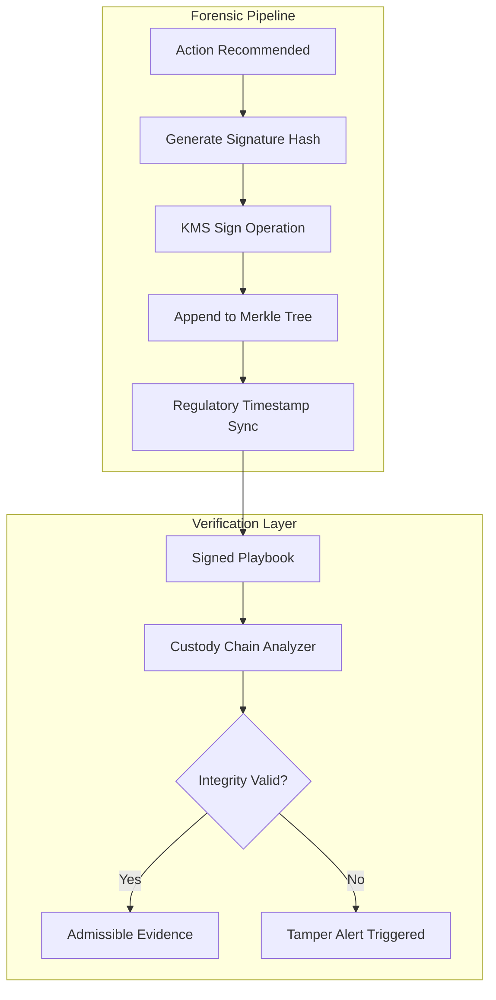

# Forensic & Security capabilities: High-Assurance IR

## Document Metadata

- **Audience**: Forensic Investigators | Security Architects | Legal Counsel | Compliance Auditors
- **Prerequisite Docs**: [01-MASTER-ARCHITECTURE.md](../../technical-specs/01-MASTER-ARCHITECTURE.md), [kms-schema-signer.md](../../technical-specs/TIER-1-FOUNDATIONS/kms-schema-signer.md)
- **Related Specs**: `2023-04-23-sign-executions-via-detached-jws-design.md`, `2023-04-23-implement-append-only-execution-logs-design.md`
- **Last Updated**: 2023-04-29
- **MNDA Restriction**: CONFIDENTIAL MNDA-signed only
- **Module Path**: `src/runtime/execution_signer.py`, `src/runtime/signed_timestamp_merkle.py`

## Quick Summary

The Forensic & Security capabilities are the core pillars that differentiate SentinelMesh from standard automation frameworks. In a world where autonomous agents can perform destructive remediation, **non-repudiation and tamper-evidence** are non-negotiable. These features ensure that every action—from the initial alert triage to the final containment command—is cryptographically bound to a verified identity, timestamped by a hardware-backed authority, and woven into an immutable ledger.

These capabilities transform SentinelMesh into a "Digital Notary" for incident response, ensuring that all findings are admissible in legal proceedings and resistant to adversarial manipulation.

---

## 1. Persona-Based Value Proposition

### For the Forensic Investigator

- **Chain of Custody**: Every byte of data captured or modified is signed, ensuring that "What you see is what happened."
- **Reconstruction Accuracy**: Snapshotting the execution environment allows for pixel-perfect reconstruction of the agent's state during a critical decision.

### For the Security Architect

- **Zero-Trust Tooling**: Even if the SentinelMesh container is compromised, an attacker cannot forge signatures or modify historical logs without breaking the Merkle chain.
- **Hardware-Backed Trust**: All cryptographic operations rely on [Cloud KMS HSMs](../../technical-specs/TIER-1-FOUNDATIONS/kms-schema-signer.md), removing the risk of key extraction from memory.

### For Legal & Compliance

- **Regulatory Admissibility**: Meets the "Best Evidence Rule" requirements by providing cryptographically verifiable proof of procedural adherence.
- **Audit Automation**: One-click generation of integrity certificates for any incident, significantly reducing the cost of SOC2/ISO audits.

---

## 2. Superpower Modules: Deep-Dive

### 2.1 Detached JWS Execution Signing

- **Goal**: Bind every cell execution to a verified, hardware-backed identity.
- **Design Rationale**: In-line signatures (like standard JWS) can be difficult to manage in streaming logs. **Detached** signatures allow for the artifact (the log) and the proof (the signature) to be stored and verified independently.
- **Technical Detail**:
  - Uses `src/runtime/execution_signer.py`.
  - Every cell's `input_source` and `output_result` are hashed (SHA-256).
  - The hash is sent to [Cloud KMS](../../technical-specs/TIER-1-FOUNDATIONS/kms-schema-signer.md) for signing using an asymmetric EC key.
  - The resulting signature is stored in the notebook's `metadata.aso_signatures` field.

### 2.2 Append-Only Execution Logs (Merkle Provenance)

- **Goal**: Create a tamper-evident timeline of the entire incident response.
- **Design Rationale**: Standard logs can be edited by anyone with `root` access. SentinelMesh logs use a **Merkle Tree** structure where every new log entry contains the hash of the previous entry, signed by the KMS.
- **Technical Detail**:
  - Managed by `src/runtime/signed_timestamp_merkle.py`.
  - If a single character in a log entry from 3 hours ago is changed, all subsequent hashes in the chain will fail verification.
  - **Verification**: The [Custody Chain Analysis](../../technical-specs/ANALYSIS-MODULES/custody-chain-analysis.md) module can traverse the entire chain in O(log N) time to confirm integrity.

### 2.3 Cell Content Checksums (Template Integrity)

- **Goal**: Prevent "Template Injection" attacks.
- **Design Rationale**: If an attacker modifies the python code in a playbook template _after_ it was generated but _before_ it was executed, they could redirect remediation efforts.
- **Technical Detail**:
  - The generator calculates a checksum for every cell.
  - The runtime performs a "Check-before-Run" validation. If the hash doesn't match, execution is halted and a high-severity `UI_TAMPER_ALERT` is triggered.

### 2.4 Regulatory Reporting Timestamps

- **Goal**: Provable adherence to reporting SLOs (e.g., 72-hour GDPR breach notification).
- **Technical Detail**:
  - Uses `src/runtime/regulatory_timestamps.py`.
  - Injects timestamps signed by the NIST/KMS authority directly into the playbook. These timestamps are independent of the system clock, preventing "Clock Drift" or "Clock Spoofing" attacks.

### 2.5 Execution Environment Snapshots

- **Goal**: Capture the "Ghost in the Machine" during execution.
- **Technical Detail**:
  - Captures: `os.environ`, `pip freeze` (dependency versions), `sys.path`, and active `KMS_KEY_VERSION`.
  - Stored as a signed JSON artifact alongside the playbook.

---

## 3. Architecture Visualization



---

## 4. Security & Compliance Deep-Dive

### 4.1 Legal Admissibility & "Best Evidence"

SentinelMesh's forensic architecture is designed to satisfy the **Daubert Standard** for scientific evidence. By using industry-standard hashing (SHA-256) and hardware-backed signing (FIPS 140-4), we provide a level of proof that exceeds standard "Admin Logs."

### 4.2 Compliance Mapping

- **SOC2 (Integrity)**: Directly addresses the "Processing Integrity" and "Availability" criteria.
- **GDPR (Article 33)**: Provides the signed "Timestamp of Discovery" required for the 72-hour reporting window.
- **NIST 800-53 (IR-4, AU-10)**: Fulfills requirements for "Incident Handling" and "Non-Repudiation."

---

## 5. Operations & Implementation

### Verification Command (CLI)

```bash
python -m src.analysis.custody_analyzer \
  --playbook path/to/playbook.ipynb \
  --kms-key-id projects/.../cryptoKeys/aso-signer
```

### Key Rotation Strategy

Keys should be rotated every 90 days. The [Merkle Chain](../../technical-specs/TIER-1-FOUNDATIONS/signed-timestamp-merkle-proofs.md) supports multi-key validation, allowing historical logs signed with old keys to remain valid as long as the public keys are preserved in the KMS archive.

---

## 6. Future Growth & Opportunities

- **Zero-Knowledge Proofs (ZKP)**: Allowing external auditors to verify that "A specific remediation happened" without revealing the sensitive details of the internal network.
- **Blockchain Integration**: (Optional) Publishing the Merkle Root of the SOC audit trail to a public or private blockchain for absolute, cross-organizational non-repudiation.
- **Hardware-Enforced Logic**: Binding the signing keys to specific "Safety Logic" within the HSM, ensuring that even the ASO runtime cannot sign a "Destructive" action unless certain conditions are met.
