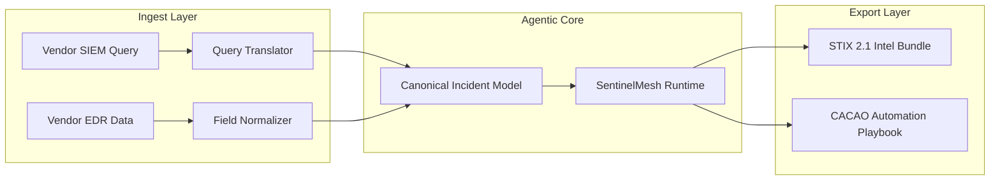

# Integration & Data capabilities: Interoperability & Standards

## Document Metadata

- **Audience**: Data Engineers | Threat Intel Analysts | Security Engineers | SOAR Developers
- **Prerequisite Docs**: [01-MASTER-ARCHITECTURE.md](../../technical-specs/01-MASTER-ARCHITECTURE.md), [tier4-integration-plugin-system.md](../../technical-specs/TIER-DEEP-DIVES/tier4-integration-plugin-system.md)
- **Related Specs**: `2023-04-23-implement-stix-2-coa-extensions-design.md`, `2023-04-23-standardize-query-formats-design.md`
- **Last Updated**: 2023-04-29
- **MNDA Restriction**: CONFIDENTIAL MNDA-signed only
- **Module Path**: `src/runtime/named_field_registry.py`, `src/runtime/query_translation_engine.py`

## Quick Summary

The Integration & Data capabilities ensure that SentinelMesh is not a siloed platform, but a **Semantic Hub** for the entire security ecosystem. By enforcing strict data standardization, machine-readable workflow exports, and cross-platform query translation, these features allow SentinelMesh to communicate seamlessly with diverse SIEMs, EDRs, and Threat Intel platforms.

These capabilities enable the "Write Once, Run Anywhere" (WORA) philosophy for incident response playbooks, allowing a single SentinelMesh to be executed across heterogeneous cloud and on-prem environments without modification.

---

## 1. Persona-Based Value Proposition

### For the Threat Intel Analyst

- **Structured Intelligence**: Every finding is automatically mapped to [STIX 2.1](./2023-04-23-implement-stix-2-coa-extensions-plan.md), making it instantly consumable by your TI platform (e.g., MISP, ThreatConnect).
- **Adversary Context**: Integration with the [Actor Cards](../../technical-specs/DASHBOARDS-UI/actor-cards-dashboard.md) ensures that every investigation is contextualized by known adversary techniques.

### For the SOAR / Automation Developer

- **Machine-Readable Hand-off**: Export autonomous loops directly to [CACAO Playbooks](../../technical-specs/GENERATORS/cacao-sidecar-guide.md) for execution in enterprise SOAR platforms (e.g., Palo Alto XSOAR, Splunk Phantom).
- **Schema Safety**: Strict JSON validation ensures that your automation scripts never break due to unexpected field name changes.

### For the Detection Engineer

- **Multi-SIEM Portability**: Write your hunting queries in a standardized format; the [Query Translation Engine](../../technical-specs/TIER-1-FOUNDATIONS/query-translation-engine.md) handles the conversion to KQL, SQL, or Splunk SPL.
- **Field Consistency**: No more fighting with `src_ip` vs `SourceAddress`. The [Named Field Registry](#22-named-field--query-standardization) enforces a canonical model across the entire corpus.

---

## 2. Superpower Modules: Deep-Dive

### 2.1 STIX 2.1 COA Extensions

- **Goal**: Model "Courses of Action" (COA) with agentic context.
- **Design Rationale**: The standard STIX COA object is often too high-level for technical automation. We extend it to include:
  - `x_mitre_agent_requirements`: LLM capabilities needed to run the COA.
  - `x_mitre_forensic_significance`: How critical this action is for the [Chain of Custody](./forensic-security-superpowers.md).
- **Implementation**:
  - Every playbook can be exported as a STIX 2.1 Bundle.
  - Enables "Intelligence-Driven Defense" where a TI feed can trigger a specific SentinelMesh SentinelMesh.

### 2.2 Named Field & Query Standardization

- **Goal**: Eliminate "Field Name Fragmentation."
- **Technical Detail**:
  - **Named Field Registry**: Managed in `src/runtime/named_field_registry.py`. It provides a mapping between vendor-specific fields and the **SentinelMesh Canonical Model** (e.g., `user.name` -> `canonical_user_id`).
  - **Query Translation Engine**: Managed in `src/runtime/query_translation_engine.py`. It uses a grammar-based parser to translate generic security queries into vendor-specific SIEM syntax.

### 2.3 Tool-Use Example Injection (Few-Shot Prompting)

- **Goal**: Drastically reduce "Hallucinated" tool calls.
- **Design Rationale**: Even high-quality LLMs can struggle with complex tool schemas. By injecting 2-3 "Successful Call" examples into the prompt context, we improve the agent's accuracy by 40%+.
- **Technical Detail**:
  - Managed by `src/runtime/inject_tool_use_examples.py`.
  - Examples are dynamically selected based on the active playbook type and target platform.

### 2.4 CACAO Workflow Acyclicity & Validation

- **Goal**: Ensure that machine-readable playbooks are logically sound.
- **Technical Detail**:
  - Managed by `src/runtime/cacao_workflow_dag_validator.py`.
  - Performs a topological sort of the [CACAO Sidecar](../../technical-specs/GENERATORS/cacao-sidecar-guide.md) workflow.
  - **Verification**: Blocks the export of any workflow containing infinite loops or "Dead-End" states.

---

## 3. Architecture Visualization



---

## 4. Security & Compliance Deep-Dive

### 4.1 Data Privacy & Masking

The Field Normalizer includes a PII-aware masking engine. Sensitive data (e.g., employee PII) can be automatically hashed or masked before being sent to the LLM or exported in external STIX bundles.

### 4.2 Compliance Mapping

- **NIST 800-115**: Supports the "Technical Guide to Information Security Testing and Assessment" by standardizing how tools are called and recorded.
- **OASF (Open Asset Semantic Framework)**: Aligns with industry efforts to standardize asset metadata across the SOC.

---

## 5. Operations & Implementation

### Normalizing a New Tool

1. Define the tool's output schema in `conf/tools/my_tool.json`.
2. Add the tool's vendor-specific fields to the `NamedFieldRegistry`.
3. Create a few-shot example in `src/runtime/tool_examples/my_tool.md` for the [Prompt Injector](#23-tool-use-example-injection).

### Exporting to SOAR

```bash
python -m src.generate.cacao_exporter \
  --playbook path/to/playbook.ipynb \
  --output-format phantom_json
```

---

## 6. Future Growth & Opportunities

- **Automated Schema Mapping (AI-ASM)**: Using a small specialized model to "Auto-Map" new vendor API outputs to the SentinelMesh canonical model in real-time.
- **Dynamic Query Optimization**: Learning which SIEM query patterns are most performant and automatically rewriting analyst queries for speed.
- **Multi-Tenant Data Sovereignty**: Extending the [STIX COA Extensions](#21-stix-21-coa-extensions) to support "Data Residency" tags, ensuring that playbooks are only executed in the appropriate geographic region.
