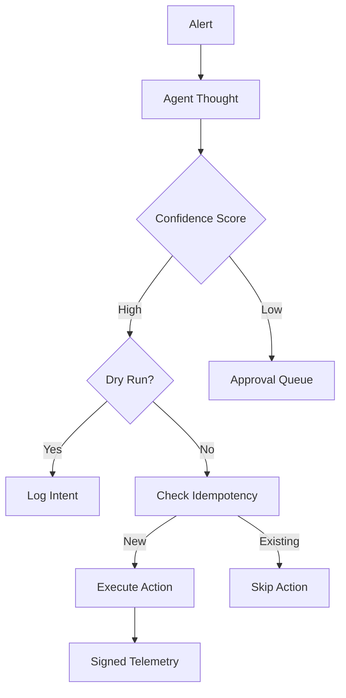

# Runtime & Agentic capabilities: Safety & Autonomy

## Document Metadata

- **Audience**: AI Engineers | SOC Analysts | SREs | Risk Managers
- **Prerequisite Docs**: [01-MASTER-ARCHITECTURE.md](../../technical-specs/01-MASTER-ARCHITECTURE.md), [tier4-autonomous-loop-executor.md](../../technical-specs/TIER-DEEP-DIVES/tier4-autonomous-loop-executor.md)
- **Related Specs**: `2023-04-23-implement-dry-run-mode-design.md`, `2023-04-23-prohibit-black-box-agent-thinking-design.md`
- **Last Updated**: 2023-04-29
- **MNDA Restriction**: CONFIDENTIAL MNDA-signed only
- **Module Path**: `src/runtime/dry_run_wrapper.py`, `src/runtime/confidence_threshold.py`

## Quick Summary

The Runtime & Agentic capabilities are the "Operational Guardrails" that enable high-assurance autonomy in SentinelMesh. While standard agents often operate as "Black Boxes" that take direct actions on production systems, SentinelMesh enforces a strict regime of **Transparency, Idempotency, and Risk-Based Gating**. These features ensure that the agent remains a "Trusted Collaborator" that can explain its reasoning, navigate problem spaces with multiscale agency, and defer to human judgement when TAME-based competency thresholds are breached.

These capabilities are the key to scaling SOC operations without sacrificing safety or control through bounded cognitive horizons.

---

## 1. Persona-Based Value Proposition

### For the SOC Analyst

- **Explainable Autonomy**: The agent must provide a "Chain of Thought" (CoT) reasoning before every action. You are never left wondering "Why did it do that?"
- **Safety Gates**: Low-confidence actions are automatically queued for your review, ensuring you only spend time on the most critical/ambiguous decisions.

### For the SRE / Systems Engineer

- **Idempotency Guarantee**: You can re-run playbooks or specific cells without worrying about duplicate side-effects (e.g., blocking a user who is already blocked).
- **Dry-Run Confidence**: Verify new playbooks against production data without taking any actual state-mutating actions.

### For the Risk Manager

- **Quantifiable Uncertainty**: The [Confidence Threshold](../specs/2023-04-23-implement-confidence-threshold-tags-design.md) provides a mathematical basis for determining which actions can be automated and which require human oversight.
- **Audit-Ready Reasoning**: Every autonomous decision is backed by a signed justification, fulfilling requirements for "Explainable AI."

---

## 2. Superpower Modules: Deep-Dive

### 2.1 Dry-Run Mode

- **Goal**: Safe validation of complex remediation logic.
- **Design Rationale**: Fear of "Runaway AI" is the primary barrier to SOC automation. Dry-run mode provides a sandbox for the agent to demonstrate its intent without consequence.
- **Technical Detail**:
  - Uses `src/runtime/dry_run_wrapper.py`.
  - Every tool call is intercepted by the wrapper. If `DRY_RUN=True`, the tool logic is skipped and response is returned to the agent.

### 2.2 Idempotency Keys & State Safety

- **Goal**: Prevent "Action Storms" and duplicate side-effects.
- **Design Rationale**: Network retries or human error can lead to the same command being sent multiple times. Idempotency ensures that $f(f(x)) = f(x)$.
- **Technical Detail**:
  - Every state-mutating tool call requires an `idempotency_key`.
  - Keys are derived from: `hash(incident_id + cell_id + tool_name + target_resource)`.
  - The [Plugin Interface](../../technical-specs/TIER-DEEP-DIVES/tier4-integration-plugin-system.md) uses these keys to check if the action has already been successfully completed.

### 2.3 Prohibit Black-Box Thinking (Transparent Reasoning)

- **Goal**: Enforced explainability for every autonomous step.
- **Design Rationale**: Trust is built through transparency. We prohibit the agent from taking a tool action without first emitting its internal reasoning.
- **Implementation**:
  - Managed by `src/runtime/transparent_reasoning.py`.
  - The agent's system prompt enforces a strict JSON schema: `{ "reasoning": "...", "justification": "...", "action": "..." }`.
  - If the "reasoning" block is empty, the runtime rejects the output and forces a retry.

### 2.4 Confidence Threshold Gating (Competency Measurement)

- **Goal**: Automatic escalation of high-risk/low-certainty decisions by measuring agentic competency.
- **Technical Detail**:
  - Managed by `src/runtime/confidence_threshold.py`.
  - The agent must output a `confidence_score` (0-1.0), which acts as a real-time measure of its competency within the current problem space.
  - **Logic**:
    - `score >= 0.90`: Fully Autonomous (if playbook type allows).
    - `0.70 <= score < 0.90`: Require [HITL Approval](../../technical-specs/TIER-DEEP-DIVES/tier4-autonomous-loop-executor.md).
    - `score < 0.70`: Abort and notify human analyst immediately.

### 2.5 Modular Playbook Branching (DAGs)

- **Goal**: Atomic, non-linear investigation paths.
- **Technical Detail**:
  - Uses [Marimo Reactive DAGs](../../technical-specs/GENERATORS/marimo-notebook-guide.md).
  - Allows the playbook to "fork" based on tool results. For example: if `check_ip_reputation` returns "Malicious," branch to `Isolate Host`; if "Suspicious," branch to `Increase Monitoring`.

---

## 3. Architecture Visualization



---

## 4. Security & Compliance Deep-Dive

### 4.1 Safety: The "Kill-Switch" Protocol

Every autonomous loop includes a global timeout and a "Max Actions" quota. If the agent attempts to perform more than 5 state-mutating actions in a single incident without human review, the loop is automatically severed.

### 4.2 Compliance Mapping

- **NIST AI Risk Management Framework**: Fulfills requirements for "Explainability and Interpretability."
- **ISO 42001**: Addresses "AI System Transparency" and "Human Oversight" controls.

---

## 5. Operations & Implementation

### Configuring Thresholds

Thresholds are defined in the master [Playbook Configuration](../../technical-specs/TIER-DEEP-DIVES/tier3-configuration-file-format.md) (`.aso.yaml`).

```yaml
runtime_guards:
  min_autonomous_confidence: 0.92
  max_autonomous_actions: 5
  dry_run_default: true
```

### Debugging Reasoning

If an agent is consistently providing poor reasoning, use the [AI Model Optimization](../../technical-specs/TIER-DEEP-DIVES/tier4-ai-model-optimization.md) pipeline to fine-tune the "Justification" prompts.

---

## 6. Future Growth & Opportunities

- **Optimized Multiscale Agency**: (Experimental) Implementing "morphogenetic" guidance to allow agents to navigate complex problem spaces while maintaining goal stability.
- **Reinforcement Learning from Human Feedback (RLHF)**: Tuning the confidence thresholds automatically based on how often humans override the agent's "Autonomous" decisions.
- **Collaborative Reasoning**: Allowing multiple agents (e.g., a "Triage Agent" and a "Forensics Agent") to debate an action before it is executed.
- **Time-Lock Puzzles for Autonomy**: (Experimental) Requiring the agent to solve a [Time-Lock Puzzle](../../technical-specs/TIER-1-FOUNDATIONS/time-lock-puzzles.md) before executing a "High Risk" autonomous action, providing a natural delay for human intervention.
