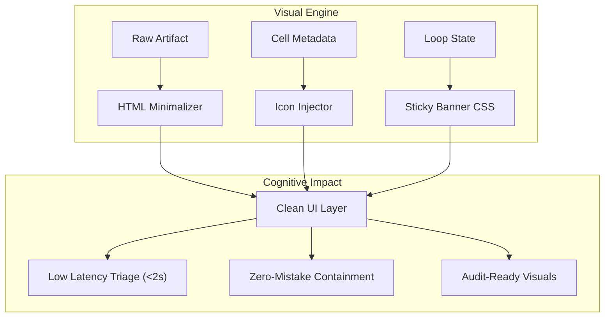

# Visual & UI capabilities: High-Clarity SOC Design

## Document Metadata

- **Audience**: SOC Analysts | UI/UX Designers | Engineering Managers | Accessibility Auditors
- **Prerequisite Docs**: [01-MASTER-ARCHITECTURE.md](../../technical-specs/01-MASTER-ARCHITECTURE.md), [dark-mode-ui.md](../../technical-specs/DASHBOARDS-UI/dark-mode-ui.md)
- **Related Specs**: `2023-04-23-adopt-dark-mode-default-design.md`, `2023-04-23-implement-distinct-iconography-design.md`
- **Last Updated**: 2023-04-29
- **MNDA Restriction**: CONFIDENTIAL MNDA-signed only
- **Module Path**: `src/ui/`, `src/runtime/cell_icon_registry.py`

## Quick Summary

The Visual & UI capabilities suite represents the "Human Interface" of SentinelMesh. While the underlying agent logic is complex, the user interface is designed for **Minimalist Clarity**. These features are not merely aesthetic; they are functional safeguards designed to reduce the cognitive load on human analysts during high-pressure incident response. By standardizing iconography, hierarchy, and status visibility, SentinelMesh ensures that critical data is never missed and that the "Next Best Action" is always intuitively obvious.

---

## 1. Persona-Based Value Proposition

### For the Junior SOC Analyst

- **Clarity of Action**: Clearly distinguishes between "Observation" cells and "State-Mutating" (destructive) cells.
- **Error Reduction**: Sticky status banners ensure the analyst always knows which playbook phase they are in, even when scrolling through thousands of lines of logs.

### For the Senior Incident Commander

- **Rapid Triage**: Iconography allows for "pattern matching" across the playbook. A quick glance reveals the balance between investigation, containment, and verification.
- **Executive Summarization**: Standardized header hierarchies enable rapid scrolling to "BLUF" (Bottom Line Up Front) sections for reporting.

### For the UI/UX Designer

- **Design System Tokens**: Provides a set of standardized CSS variables and SVG assets that can be extended to new dashboard modules.
- **Consistency**: Enforces a unified "SOC-First" aesthetic across Jupyter, Marimo, and HTML outputs.

---

## 2. Superpower Modules: Deep-Dive

### 2.1 Distinct Iconography System (🔍, 🛡️, 🧪)

- **Goal**: Instant cognitive categorization of execution steps.
- **Design Rationale**: Human brains process images 60,000x faster than text. Using specific icons for Triage vs. Remediation reduces the time required to understand a cell's purpose.
- **Implementation**:
  - Icons are managed in `src/runtime/cell_icon_registry.py`.
  - Every generated cell header includes an SVG injection.
  - **Palette Alignment**: 🔍 (Indigo) for Investigate, 🛡️ (Rose) for Contain/Remediate, 🧪 (Emerald) for Verify.

### 2.2 Sticky Status Banners

- **Goal**: Maintain situational awareness across deep vertical notebooks.
- **Design Rationale**: Analysts often lose track of the "Overall Incident State" when debugging deep in a notebook. The sticky banner persists the current [Autonomous Loop](../../technical-specs/TIER-DEEP-DIVES/tier4-autonomous-loop-executor.md) state at the top of the viewport.
- **Implementation**:
  - Injected via a custom CSS `<style>` block in the notebook metadata.
  - Uses `position: sticky; top: 0; z-index: 9999;` to override standard notebook scrolling.
  - **Dynamic Color**: Changes from Amber (Investigating) to Rose (Remediating) to Emerald (Resolved).

### 2.3 Actionable Callouts (High-Contrast Alerts)

- **Goal**: Force human attention on critical decisions.
- **Design Rationale**: Standard markdown quotes are easily ignored. Actionable callouts use bold borders and "Attention" iconography to signal required human input or critical risk.
- **Implementation**:
  - Enforced via the `src/runtime/actionable_callouts.py` formatter.
  - **Example Code**:
    ```markdown
    > [!IMPORTANT]
    > **CRITICAL CONTAINMENT ACTION REQUIRED**
    > This step will isolate the Core Database. Verify all replicas are active before proceeding.
    ```

### 2.4 Minimalist HTML Outputs (Signal-to-Noise)

- **Goal**: Eradicate "JSON Vomit" from the analyst view.
- **Design Rationale**: Raw API responses are difficult to read and audit. Minimalist outputs extract the Top 5 most relevant fields and present them in a clean, filterable HTML table.
- **Implementation**:
  - Logic resides in `src/runtime/minimalist_html_outputs.py`.
  - **Features**: Truncation of long strings, syntax highlighting for code snippets, and "Click-to-Expand" for raw JSON.

### 2.5 Standardized Header Hierarchy (H1-H4)

- **Goal**: Predictable navigation for 1,000+ playbook types.
- **Implementation**:
  - **H1**: Incident Name & ID (The "Who/What")
  - **H2**: Phase Name (Triage, Containment, Eradication)
  - **H3**: Specific Task (e.g., "Verify Token Integrity")
  - **H4**: Technical Sub-steps or Tool Logs.

---

## 3. Architecture Visualization



---

## 4. Security & Compliance Deep-Dive

### 4.1 Safety: The "No-Miss" UI

- By highlighting actionable callouts, the system reduces the risk of an analyst accidentally skipping a mandatory "Human-in-the-Loop" (HITL) approval gate.
- **Verification**: UI regression tests ensure that status banners are never obscured by tool outputs.

### 4.2 Accessibility (WCAG 2.1 AA)

- **Contrast Ratios**: All text-on-background combinations meet the 4.5:1 minimum ratio for normal text.
- **Non-Color Cues**: Status is never conveyed _only_ by color; every banner and icon includes a corresponding text label (e.g., "STATUS: REMEDIATING").
- **Screen Reader Support**: All injected SVGs include `<title>` and `aria-label` tags.

---

## 5. Operations & Customization

### How to Add a New Icon

1. Open `src/runtime/cell_icon_registry.py`.
2. Add a new entry to the `ICON_MAP` dictionary with the SVG source and CSS class.
3. Update the `PlaybookTypeEnforcement` logic to map the new icon to a specific cell tag.

### Customizing the Dark Theme

- All UI capabilities use the CSS tokens defined in [dark-mode-ui.md](../../technical-specs/DASHBOARDS-UI/dark-mode-ui.md). Modify the `--aso-accent-*` variables to update the entire suite's theme.

---

## 6. Future Growth & Opportunities

- **Eye-Tracking Optimization**: Using heatmaps from actual SOC trials to reposition critical banners and callouts.
- **Biometric UI Feedback**: (Experimental) Adjusting the UI "Urgency" (animation speed, color saturation) based on the analyst's detected stress levels or time-on-task.
- **Augmented Reality (AR) Overlay**: Exporting these visual primitives to AR headers for physically distributed "War Rooms."
