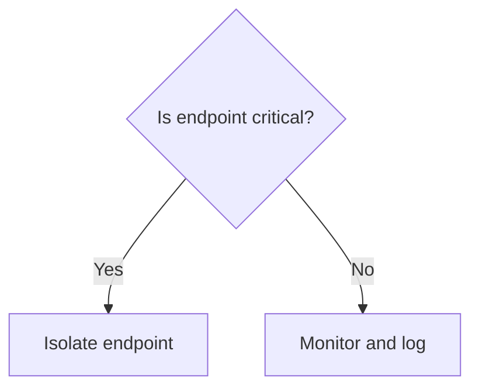

# Feature: Mermaid DAG Visualization (v0.2)

Incident response involves complex attack chains. Mermaid DAG Visualization renders attack graphs, containment flowcharts, and timelines for clarity and stakeholder communication.

## Problem

Attack chains and containment decisions are complex:

- Lateral movement paths across 10+ endpoints
- Process creation chains spanning parent → child → grandchild
- Decision trees for triage and containment
- Timeline of incident evolution

**Impact**: Stakeholders can't easily understand incident scope. Containment decisions are hard to justify without visual representation.

## Solution

Generate Mermaid diagrams showing incident structure:

````python
REDACTED
```mermaid\n{mermaid}\n```"))
````

Output renders as visual directed acyclic graph (DAG) in Jupyter.

## Implementation

### Three Graph Types

#### 1. Attack Graphs

Nodes: hosts, processes, alerts  
Edges: lateral movement, process creation

```mermaid
graph TD
    finance-01["FINANCE-01 (Patient Zero)"]:::critical
    finance-02["FINANCE-02"]:::high
    p1["payload.exe"]:::critical

    finance-01 -->|PSExec| finance-02
    p1 -->|process creation| explorer.exe
```

#### 2. Containment Flowcharts

Nodes: decisions, actions  
Edges: conditional flows



#### 3. Incident Timelines

Events ordered by timestamp showing incident evolution.

## Integration Points

### SigmaNotebookV2

Cell 4 (Analysis) generates attack graph:

````python
REDACTED
```mermaid\n{mermaid}\n```"))
````

Cell 5 (Containment) generates decision flowchart:

````python
REDACTED
```mermaid\n{flow.export_to_mermaid()}\n```"))
````

## Performance

| Operation             | Latency |
| --------------------- | ------- |
| Add host/process      | <1ms    |
| Render 10-node graph  | ~5ms    |
| Render 100-node graph | ~20ms   |

## Test Coverage

- **6 unit tests**: Node and edge creation
- **4 unit tests**: Mermaid export
- **2 integration tests**: Full graphs with 20+ nodes

## Design Decisions

### Why Mermaid?

- ✅ Pure text (no binary files)
- ✅ Works in Jupyter/HTML/Markdown
- ✅ Version control friendly (Git diffs readable)
- ✅ Stakeholders can copy-paste into presentations

### Why three graph types?

- ✅ Attack graphs show incident scope
- ✅ Flowcharts justify containment decisions
- ✅ Timelines show response tempo

### Why styled nodes?

Severity coloring helps spot critical components:

```python
REDACTED
```

## Regulatory Alignment

- **GDPR Article 32**: Visual documentation of incident response
- **HIPAA Breach Notification**: Diagram incident scope for regulators
- **CCPA**: Flowcharts show data handling decisions
- **Litigation**: Visual evidence aids jury understanding

## Real-World Example

Ransomware incident with 8-endpoint lateral movement:

```
FINANCE-01 (patient zero, critical risk)
├── FINANCE-02 (PSExec) → database server reached
├── FINANCE-03 (SMB) → accounting shared drive
└── HR-01 (network enumeration) → no sensitive data

Containment decision:
┌─ Database server critical? → Yes → Isolate immediately
├─ Sensitive data on share? → Yes → Isolate immediately
└─ HR data? → No → Monitor only
```

## Next Steps

- v0.2.1: Add node metrics (file count, user count, alert count)
- v0.2.2: Animated timeline showing incident progression
- v0.3: Interactive graphs with drill-down to evidence
