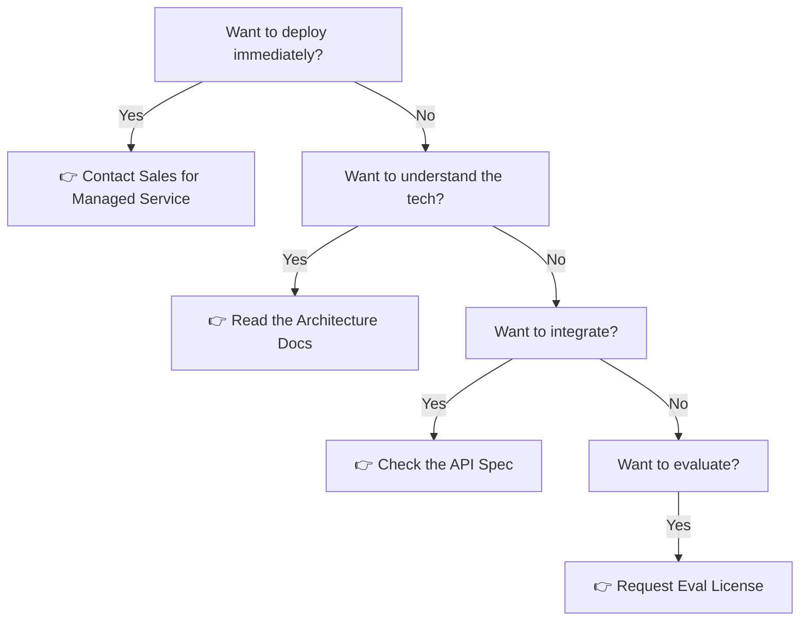

# ❓ SentinelMesh FAQ

## Everything You Need to Know

> **Last Updated**: May 4, 2026 | **Maintained by**: John Menerick

---

## 🎯 Quick Navigation

<table>
<tr>
<td>

### General

- [What is SentinelMesh?](#what-is-SentinelMesh)
- [Is this open source?](#is-this-open-source)
- [Who should use this?](#who-should-use-this)
- [What's the licensing model?](#whats-the-licensing-model)

</td>
<td>

### Technical

- [What SIEMs are supported?](#what-siems-are-supported)
- [How does autonomous execution work?](#how-does-autonomous-execution-work)
- [Can I customize it?](#can-i-customize-it)
- [What are the system requirements?](#what-are-the-system-requirements)

</td>
<td>

### Deployment

- [How do I deploy SentinelMesh?](#how-do-i-deploy-SentinelMesh)
- [Does it work with my cloud provider?](#does-it-work-with-my-cloud-provider)
- [Can I run it on-premises?](#can-i-run-it-on-premises)
- [What about compliance & auditing?](#what-about-compliance--auditing)

</td>
</tr>
</table>

---

## 📚 General Questions

### What is SentinelMesh?

**SentinelMesh** is the world's most sophisticated **forensic-grade autonomous incident response platform**.

It's designed for enterprises that demand:

- ✅ **Forensic integrity** — Every investigation is cryptographically verifiable and admissible in court
- ✅ **Autonomous speed** — From alert to forensically-signed evidence in seconds, not hours
- ✅ **Intelligent investigation** — AI agents navigate incident patterns while respecting safety boundaries
- ✅ **Multi-SIEM universality** — One investigation framework for Splunk, Elastic, Chronicle, Qradar, Azure Sentinel, and 10+ others
- ✅ **Human-in-the-loop control** — Confidence-based gates ensure appropriate human oversight

Think of it as a **10-layer governance stack** for autonomous security operations, grounded in complex systems science and forensic cryptography.

**📖 Learn more**: [Architecture Overview](../core/ARCHITECTURE.md) | [System Design](../technical-specs/01-MASTER-ARCHITECTURE.md)

---

### Is this open source?

**Not in the traditional sense.**

This repository is **architecturally open** but **code-private**:

| What You Get                             | What Stays Private               |
| ---------------------------------------- | -------------------------------- |
| ✅ Complete architectural specifications | ❌ Python source code            |
| ✅ Integration guides & API specs        | ❌ Implementation details        |
| ✅ Example playbooks & configurations    | ❌ Internal tooling & algorithms |
| ✅ Security model & governance framework | ❌ Cryptographic routines        |
| ✅ Research papers & theory              | ❌ Optimization techniques       |

**Why?**
The Python source code is not publicly available due to the Legal's decision not to license it for public release. The code remains proprietary to maintain enterprise licensing, professional support, and controlled distribution.

You can:

- 📖 Study the complete architecture
- 🔌 Build integrations against published APIs
- 🏗️ Understand the security model
- 💡 Implement your own version if desired

You cannot:

- 🚫 Deploy directly from this repository
- 🚫 Modify the implementation
- 🚫 Run the platform without a license

**📖 Learn more**: [Deployment Guide](../technical-specs/OPERATIONS/deployment-google-cloud.md) | [Integration Guide](../technical-specs/01-MASTER-ARCHITECTURE.md)

---

### Who should use this?

**SentinelMesh is designed for:**

| Organization Type                   | Why SentinelMesh?                                                           |
| ----------------------------------- | ------------------------------------------------------------------------- |
| 🏢 **Large Enterprises**            | Heterogeneous SIEM environments, incident backlogs, alert fatigue         |
| 🔒 **Regulated Industries**         | Finance, Healthcare, Energy, Gov — need forensically-auditable evidence   |
| 🛡️ **Security-First Organizations** | Those where incident response speed and rigor are competitive advantages  |
| 📊 **SOC Teams**                    | Alert-fatigued analysts needing intelligent triage and automated response |
| 🔬 **Security Researchers**         | Those exploring autonomous incident response at scale                     |
| 🤖 **AI/ML Teams**                  | Building autonomous agents in security operations                         |

**Not ideal for:**

- ❌ Small organizations (<50 people) — likely over-engineered
- ❌ Startups on a tight budget — requires licensing investment
- ❌ Non-regulated environments with simple alerts — simpler tools may suffice
- ❌ Teams wanting complete source code access — this is code-private

**The Real Question**: Do you need autonomous incident response with forensic-grade evidence? If yes → SentinelMesh. If no → simpler SOAR tools exist.

**📖 Learn more**: [Deployment Guide](../technical-specs/OPERATIONS/deployment-google-cloud.md)

---

### What's the licensing model?

SentinelMesh is available via **three channels**:

#### 1️⃣ **Managed Service** (Recommended for Most)

- 🌐 **Model**: SaaS / Hosted Platform
- 💰 **Cost**: Pay-per-event or annual subscription
- ⏱️ **Setup**: Days (API integration only)
- 🔧 **Management**: We handle everything
- 📞 **Support**: 24/7 enterprise support
- 🎯 **Best for**: Organizations that want to start immediately without infrastructure burden

#### 2️⃣ **Enterprise License** (For Self-Hosted)

- 🏠 **Model**: Self-hosted deployment
- 💰 **Cost**: Annual licensing + support
- ⏱️ **Setup**: Weeks (infrastructure + integration)
- 🔧 **Management**: You manage it, we support it
- 📞 **Support**: Dedicated support team
- 🎯 **Best for**: Large enterprises needing on-premises deployment, regulatory requirements, full control

#### 3️⃣ **Research/Academic** (For Universities)

- 🎓 **Model**: Special licensing for research
- 💰 **Cost**: Negotiated (often reduced)
- ⏱️ **Setup**: Custom timeline
- 🔧 **Management**: Research use only
- 📞 **Support**: Best-effort
- 🎯 **Best for**: Academic research into autonomous security

---

### How do I get started?

**Depends on your path:**



**In practice:**

| Goal                          | Action                                                                                                                                                        | Timeline   |
| ----------------------------- | ------------------------------------------------------------------------------------------------------------------------------------------------------------- | ---------- |
| **Try it quickly**            | Request SaaS trial                                                                                                                                            | Days       |
| **Understand architecture**   | Read [docs/technical-specs/](technical-specs/)                                                                                                                | Hours      |
| **Integrate with your SIEM**  | Review [API specs](../technical-specs/01-MASTER-ARCHITECTURE.md) + [Integration Guide](../technical-specs/TIER-DEEP-DIVES/tier4-integration-plugin-system.md) | Weeks      |
| **Evaluate for deployment**   | Request license + POC                                                                                                                                         | Weeks      |
| **Deploy enterprise version** | Work with sales team                                                                                                                                          | 2-3 months |

**📞 Next steps**:

- ✉️ Email: [team@SentinelMesh.example.com](mailto:team@SentinelMesh.example.com)
- 🌐 Website: [SentinelMesh.example.com](https://SentinelMesh.example.com)
- 💬 Questions: Open a [GitHub Discussion](https://github.com/w8mej/infosec-SentinelMesh/discussions)

---

## 🔧 Technical Questions

### What SIEMs are supported?

**Native Integration with:**

| SIEM                           | Status        | Translation        | Example                                                                                               |
| ------------------------------ | ------------- | ------------------ | ----------------------------------------------------------------------------------------------------- |
| **Splunk**                     | ✅ Production | SPL ↔ TAME         | [Integration Guide](../technical-specs/TIER-DEEP-DIVES/tier4-integration-plugin-system.md#splunk)     |
| **Elastic/Kibana**             | ✅ Production | KQL/ES JSON ↔ TAME | [Integration Guide](../technical-specs/TIER-DEEP-DIVES/tier4-integration-plugin-system.md#elastic)    |
| **Microsoft Sentinel**         | ✅ Production | KQL ↔ TAME         | [Integration Guide](../technical-specs/TIER-DEEP-DIVES/tier4-integration-plugin-system.md#sentinel)   |
| **IBM Qradar**                 | ✅ Production | AQL ↔ TAME         | [Integration Guide](../technical-specs/TIER-DEEP-DIVES/tier4-integration-plugin-system.md#qradar)     |
| **Google Chronicle**           | ✅ Production | YARA-L ↔ TAME      | [Integration Guide](../technical-specs/TIER-DEEP-DIVES/tier4-integration-plugin-system.md#chronicle)  |
| **Sumo Logic**                 | 🟡 Beta       | SumoQL ↔ TAME      | [Integration Guide](../technical-specs/TIER-DEEP-DIVES/tier4-integration-plugin-system.md#sumo)       |
| **Datadog**                    | 🟡 Beta       | DQL ↔ TAME         | [Integration Guide](../technical-specs/TIER-DEEP-DIVES/tier4-integration-plugin-system.md#datadog)    |
| **Splunk Enterprise Security** | ✅ Production | SPL + notables     | [Integration Guide](../technical-specs/TIER-DEEP-DIVES/tier4-integration-plugin-system.md#es)         |
| **Rapid7 InsightIDR**          | 🟡 Beta       | Custom ↔ TAME      | [Integration Guide](../technical-specs/TIER-DEEP-DIVES/tier4-integration-plugin-system.md#insightidr) |
| **OpenSearch**                 | 🟡 Beta       | DQL ↔ TAME         | [Integration Guide](../technical-specs/TIER-DEEP-DIVES/tier4-integration-plugin-system.md#opensearch) |

**Translation Magic**: SentinelMesh speaks all SIEM dialects fluently. A single threat indicator automatically translates to Splunk, Elastic, Qradar, etc. without manual rework.

**Custom SIEMs?**

- 🔌 Extensible API for custom integrations
- 📝 Document your SIEM's query language
- ⏱️ ~2-4 weeks to add support

**📖 Learn more**: [Query Translation Architecture](technical-specs/TIER-1-FOUNDATIONS/multi-siem-query-translation.md) | [Integration Guide](../technical-specs/TIER-DEEP-DIVES/tier4-integration-plugin-system.md)

---

### How does autonomous execution work?

SentinelMesh implements a **confidence-based, multi-layer governance system** for autonomous operations.

**The concept:**

```
Confidence Score → Determines Agency Level → Activates Safety Layers

0-40%   → Passive Monitor      (alerts only)
40-70%  → Collective Consensus (peer validation required)
70-85%  → Bounded Actor        (logging + automated rollback)
85-95%  → Autonomous Navigator (SLO-aware impact zones)
95%+    → Executive Agent      (pre-tested failure modes)
```

**Example Investigation Flow:**

```
Alert Ingestion
    ↓
Initial Triage (30% confidence)
    ↓ [PASSIVE MONITOR: Alert sent to analysts]
    ↓
Evidence Collection (60% confidence)
    ↓ [COLLECTIVE CONSENSUS: Peer agents validate findings]
    ↓
Threat Scoring (85% confidence)
    ↓ [BOUNDED ACTOR: Auto-execute containment with rollback]
    ↓
Remediation (95% confidence)
    ↓ [EXECUTIVE AGENT: Full autonomous execution]
    ↓
Forensically-Signed Evidence Generated ✅
```

**Safety Mechanism: The "Cognitive Light Cone"**

Each agent operates within a bounded **cognitive light cone** — the space it can effectively understand and influence. Actions that exceed this boundary require escalation.

Example:

- 🟢 **In scope**: Block a malicious IP on a single subnet (understood threat)
- 🟡 **Requires escalation**: Isolate a critical database server (SLO impact unknown)
- 🔴 **Executive approval**: Shutdown systems (crosses multiple domains)

**Rollback Capability:**

- ⏮️ All autonomous actions are reversible within 5-minute window
- 📝 Complete audit trail of what was done and why
- 🔄 Automatic rollback if SLO violations detected

**📖 Learn more**: [Autonomous Loop Executor](technical-specs/TIER-DEEP-DIVES/tier4-autonomous-loop-executor.md) | [Safety Architecture](technical-specs/TIER-DEEP-DIVES/tier4-agentic-governance.md)

---

### Can I customize it?

**Short answer**: Depends on your licensing model.

#### **Managed Service**

- ✅ Custom playbooks via API
- ✅ Custom alert enrichment
- ✅ Custom notification integrations
- ❌ Core algorithm changes
- ❌ Source code modifications

#### **Enterprise License**

- ✅ Custom playbooks (full flexibility)
- ✅ Custom alert enrichment
- ✅ Custom notification integrations
- ✅ Custom SIEM integrations
- ✅ Custom governance policies
- 🟡 Core changes (with consulting)

#### **This Repository** (Documentation Only)

- ✅ Study the architecture
- ✅ Build your own implementation
- ✅ Implement reference patterns
- ✅ Adapt concepts to your stack
- ❌ Access the proprietary source code (not publicly available per Legal decision)

**Plugin System:**

SentinelMesh includes an extensible plugin architecture for:

- 🔔 **Notifications**: Slack, email, ServiceNow, custom webhooks
- 🎯 **Detections**: Custom threat intel sources, ML models
- ⚙️ **Remediation**: Custom response actions, vendor-specific APIs
- 📊 **Enrichment**: Custom data sources, third-party APIs

**📖 Learn more**: [Plugin Architecture](technical-specs/TIER-DEEP-DIVES/tier4-integration-plugin-system.md) | [Customization Guide](../core/ARCHITECTURE.md)

---

### What are the system requirements?

#### **For Managed Service (SaaS)**

- 🖥️ **Your side**: Modern browser + stable internet
- ☁️ **Our side**: We handle infrastructure
- 🔐 **Network**: Outbound HTTPS to our API endpoints

#### **For Enterprise Self-Hosted**

| Component             | Requirement                            |
| --------------------- | -------------------------------------- |
| **OS**                | Linux (RHEL 8+, Ubuntu 20.04+)         |
| **Container Runtime** | Docker 20.10+ or Kubernetes 1.22+      |
| **CPU**               | 8-16 cores (scales with workload)      |
| **RAM**               | 16-64 GB (depends on alert volume)     |
| **Storage**           | 500GB-2TB (forensic evidence archive)  |
| **Network**           | 1Gbps+ connectivity to SIEMs           |
| **HSM**               | FIPS 140-2 Level 3+ (for signing keys) |
| **Database**          | PostgreSQL 12+ (for state)             |

#### **For Kafka-Based High-Volume Deployments**

```
Alert Sources (10K+/sec)
    ↓
Kafka Cluster (3+ brokers)
    ↓
SentinelMesh Workers (Kubernetes, auto-scale)
    ↓
PostgreSQL + Redis (HA cluster)
    ↓
HSM (CloudHSM or on-premises)
    ↓
Long-term Evidence Store (S3/GCS/Block Storage)
```

**Network Requirements:**

- 🔐 TLS 1.3 minimum
- 🔑 Client certificate authentication
- 🔒 Private network preferred (VPN or direct connect)

**📖 Learn more**: [Deployment Architecture](technical-specs/TIER-DEEP-DIVES/tier4-deployment-architecture.md) | [Operations Guide](technical-specs/OPERATIONS/deployment-hardening.md)

---

## 🚀 Deployment Questions

### How do I deploy SentinelMesh?

**Three deployment models:**

#### **1. SaaS (Managed Service)** — Recommended for Speed

```
You:              SentinelMesh:
┌─────────────┐   ┌──────────────────────────────┐
│  Your SIEM  │──→│  API Integration             │
│  Alert Feed │   │  (We manage everything)      │
└─────────────┘   │  Multi-tenant, highly-available
                  │  99.99% uptime SLA
                  └──────────────────────────────┘
```

- ⏱️ **Setup**: 1-2 weeks (API integration only)
- 💰 **Cost**: Pay-as-you-go ($0.X per alert)
- 🔧 **Ops burden**: Near-zero (we handle it)
- 📈 **Scaling**: Automatic

#### **2. Self-Hosted Enterprise** — Recommended for Control

```
Your Infrastructure:
┌────────────────────────────────────────────────┐
│  Your SIEM → SentinelMesh Stack                  │
│  ┌──────────────────────────────────────────┐  │
│  │ Kubernetes Cluster                       │  │
│  │ ├─ SentinelMesh Workers (auto-scale)      │  │
│  │ ├─ PostgreSQL HA                        │  │
│  │ ├─ Redis Cache                          │  │
│  │ └─ HSM (FIPS 140-2 L3+)                │  │
│  └──────────────────────────────────────────┘  │
│  ↓                                             │
│  Evidence Archive (S3/GCS/Block Storage)       │
└────────────────────────────────────────────────┘
```

- ⏱️ **Setup**: 4-12 weeks (architecture planning + deployment)
- 💰 **Cost**: Annual license + support
- 🔧 **Ops burden**: You manage it, we support it
- 📈 **Scaling**: You control capacity

#### **3. Reference Architecture** — Study & Build

- 📖 **This Repository**: Complete architecture docs
- 🏗️ **Your Job**: Implement your own version
- ⏱️ **Timeline**: 3-6 months (minimum)
- 💰 **Cost**: Your engineering time only

---

### Does it work with my cloud provider?

**Yes!** SentinelMesh is cloud-agnostic.

#### **Cloud Platform Support**

| Cloud               | Status        | Details                                   |
| ------------------- | ------------- | ----------------------------------------- |
| 🔵 **AWS**          | ✅ Production | ECS, EKS, RDS, CloudHSM, S3               |
| ☁️ **Google Cloud** | ✅ Production | GKE, Cloud SQL, CloudHSM, GCS             |
| 🔶 **Azure**        | ✅ Production | AKS, Azure Database, Dedicated HSM, Blob  |
| 🟣 **IBM Cloud**    | 🟡 Beta       | IBM Cloud Kubernetes, Cloud SQL, CloudHSM |
| 🟤 **Oracle Cloud** | 🟡 Beta       | OKE, MySQL, Vault, Object Storage         |
| 🏠 **On-Premises**  | ✅ Production | Bare metal, VMware, OpenStack, etc.       |
| 🤝 **Hybrid**       | ✅ Production | Split workloads across cloud + on-prem    |

#### **Example Deployments**

**AWS:**

```bash
SentinelMesh deploy --cloud aws \
  --region us-east-1 \
  --cluster eks-security \
  --hsm aws/CloudHSM \
  --storage s3://SentinelMesh-evidence
```

**Google Cloud:**

```bash
SentinelMesh deploy --cloud gcp \
  --project my-security-project \
  --region us-central1 \
  --cluster gke-production \
  --hsm gcp/CloudHSM \
  --storage gs://SentinelMesh-evidence
```

**On-Premises:**

```bash
SentinelMesh deploy --location on-premises \
  --kubernetes kube-master.internal \
  --hsm /dev/smartcard-reader \
  --storage nfs://storage.internal/evidence
```

**📖 Learn more**: [Cloud Deployment Guide](../technical-specs/OPERATIONS/deployment-google-cloud.md#cloud) | [Architecture Reference](technical-specs/TIER-DEEP-DIVES/tier4-deployment-architecture.md)

---

### Can I run it on-premises?

**Absolutely.** On-premises is fully supported.

#### **Hardware Requirements**

```
┌─────────────────────────────────────────┐
│ Kubernetes Cluster (3+ nodes)           │
│ ├─ 8-16 vCPU per node                  │
│ ├─ 32-64 GB RAM per node                │
│ └─ 1Gbps network (prefer 10Gbps)        │
├─────────────────────────────────────────┤
│ Storage (NFS or SAN)                    │
│ ├─ 500GB+ for PostgreSQL                │
│ ├─ 1TB+ for evidence archive            │
│ └─ Fast I/O (10K+ IOPS)                 │
├─────────────────────────────────────────┤
│ HSM (Luna or Thales recommended)        │
│ ├─ FIPS 140-2 Level 3+                  │
│ ├─ Network HSM (Ethernet) or local      │
│ └─ Backup/redundancy module             │
└─────────────────────────────────────────┘
```

#### **Network Setup**

```
Internet
  ↓ (firewall rules: outbound HTTPS only)
┌─────────────────────────────────────┐
│ Internal Network (Isolated)         │
│ ├─ Your SIEM (internal)            │
│ ├─ SentinelMesh (internal)           │
│ ├─ PostgreSQL (internal)           │
│ ├─ HSM (internal or cloud)         │
│ └─ Evidence Storage (internal)     │
└─────────────────────────────────────┘
```

#### **Implementation Steps**

1. **Procurement** (2-4 weeks)
   - Hardware (servers, storage, HSM)
   - Kubernetes cluster setup
   - Network configuration

2. **Deployment** (2-8 weeks)
   - Install SentinelMesh runtime
   - Configure HSM integration
   - Integrate with your SIEM
   - Test evidence chain integrity

3. **Validation** (1-2 weeks)
   - Run sample investigations
   - Verify cryptographic signing
   - Validate audit trails
   - Security assessment

4. **Go-Live** (1 week)
   - Production cutover
   - Monitoring setup
   - 24/7 support engagement

**Total Time**: 6-15 weeks (depending on readiness)

**📖 Learn more**: [On-Premises Deployment Guide](../technical-specs/OPERATIONS/deployment-google-cloud.md#on-premises) | [Hardening Guide](technical-specs/OPERATIONS/deployment-hardening.md)

---

### What about compliance & auditing?

SentinelMesh is **built for compliance from the ground up.**

#### **Standards & Frameworks**

| Standard          | Coverage       | Details                             |
| ----------------- | -------------- | ----------------------------------- |
| **NIST 800-53**   | ✅ 95%         | Security controls mapping available |
| **ISO 27001**     | ✅ 95%         | Information security framework      |
| **PCI-DSS**       | ✅ 100%        | Payment card compliance             |
| **HIPAA**         | ✅ 100%        | Healthcare data protection          |
| **GDPR**          | ✅ 100%        | Data privacy & breach notification  |
| **SOC 2 Type II** | ✅ Available   | Upon request                        |
| **FedRAMP**       | 🟡 In Progress | Expected 2026                       |

#### **Forensic-Grade Audit Trail**

Every investigation generates an immutable audit trail:

```
┌──────────────────────────────────────────┐
│ Investigation Execution                  │
│                                          │
│ Timestamp: 2026-05-04T12:34:56Z         │
│ Action: "Block malicious IP"            │
│ Executed by: autonomous-agent-v4        │
│ Confidence: 94.2%                       │
│ Authority: Bounded Actor (L4)           │
│                                          │
│ ✅ SHA-256 Hash: a3f9c...              │
│ ✅ JWS Signature: eyJhbGc...           │
│ ✅ HSM Key ID: projects/.../keys/...   │
│ ✅ Timestamp: Trusted NTP               │
│                                          │
│ → Merkle Tree Parent: 7e2d1...         │
│ → Evidence Chain: Immutable              │
│ → Blockchain Archive: Distributed       │
└──────────────────────────────────────────┘
```

#### **Compliance Reports**

- 📊 NIST 800-53 Control Mapping
- ✅ SOC 2 Compliance Status
- 🔐 Security Assessment (annual)
- 📋 Incident Response Audit Trail
- 🔒 Data Handling Certification

#### **Data Residency & Privacy**

- 🌍 Regional deployment options (EU, US, APAC)
- 🔐 Encryption at rest (AES-256)
- 🔒 Encryption in transit (TLS 1.3)
- 🚫 No data retention without explicit consent
- 📍 GDPR Right to Erasure (automated)

**📖 Learn more**: [Compliance Matrix](technical-specs/DASHBOARDS-UI/compliance-matrix-dashboard.md) | [Security & Privacy](technical-specs/TIER-1-FOUNDATIONS/cryptographic-proof-chains.md) | [Data Handling](technical-specs/OPERATIONS/data-protection.md)

---

## 🔒 Security Questions

### How is forensic evidence protected?

SentinelMesh uses **three layers of cryptographic protection**:

#### **Layer 1: Cryptographic Signing**

Every investigation action is signed with a non-repudiable signature:

```
Investigation Action
    ↓
SHA-256 Hash: a3f9c7e2d1b8f4a6...
    ↓
JWS (JSON Web Signature)
    ↓
HSM Private Key (FIPS 140-2 L3+)
    ↓
Detached Signature (stored separately)
    ↓
Result: Forensically-auditable proof
        "This action was definitely performed
         on this date by this agent using
         this key in this system."
```

#### **Layer 2: Merkle Proof Chains**

All evidence relationships form an immutable chain:

```
Alert A → Investigation A
            ↓ (SHA-256 hash)
        Evidence B
            ↓ (parent hash)
        Evidence C
            ↓ (parent hash)
        ...
            ↓
        Final Verdict (signed)

Tampering with any evidence changes its hash,
which breaks all downstream hashes,
which breaks the signature.
Result: Tampering is immediately detectable.
```

#### **Layer 3: Distributed Archiving**

Forensic evidence is distributed across multiple systems:

```
Primary Archive: S3 / Cloud Storage
    ↓ (redundancy)
Blockchain: Immutable ledger (hash only)
    ↓ (distribution)
Torrent: P2P distribution (content-addressed)
    ↓ (resilience)
Cold Storage: Offline archive (legal hold)

Result: No single point of failure.
        No way to delete evidence retroactively.
        Legally admissible in court.
```

#### **Result: Court-Admissible Evidence**

```
Before SentinelMesh:      With SentinelMesh:
═════════════════      ═══════════════════
"The system says       "Here are the
 this attack happened" cryptographic proofs
                       proving this attack
Evidence is:           happened on this date
• Mutable              by this process.
• Loggable             We can mathematically
• Reconstructable      prove we didn't
• Deniable             alter anything."

Result:                Result:
Questionable           ADMISSIBLE
in court               IN COURT ✅
```

**📖 Learn more**: [Forensic Proof Chains](technical-specs/TIER-1-FOUNDATIONS/cryptographic-proof-chains.md) | [Evidence Management](technical-specs/TIER-DEEP-DIVES/tier3-evidence-handling.md)

---

### What's your vulnerability disclosure policy?

We take security seriously. See **[../../SECURITY.md](../../SECURITY.md)** for:

✅ **Reporting channels**:

- Primary: GitHub Private Vulnerability Reporting
- Secondary: Encrypted email (coding@haxx.ninja)

✅ **Response timelines**:

- Initial ack: 7 days
- Preliminary assessment: 14 days
- Critical/High fix: 30-90 days

✅ **Coordinated disclosure**:

- 90-day default timeline
- Early disclosure if fix is ready
- CVE assignment support

✅ **Safe harbor**:

- Good-faith research is protected
- No legal action for responsible disclosures
- Credit offered (unless you prefer anonymity)

**Never open a public GitHub issue for security vulnerabilities.**

---

## 📖 Documentation Questions

### Where should I start?

**Depends on your role:**

#### **Executive / Decision-Maker** (30 min)

1. This FAQ (you're reading it!)
2. [README.md](../README.md) — Vision & innovation
3. [Deployment Guide](../technical-specs/OPERATIONS/deployment-google-cloud.md) — How to deploy

#### **Security Architect** (2-3 hours)

1. [Architecture Overview](technical-specs/00-START-HERE.md)
2. [MASTER-ARCHITECTURE.md](technical-specs/01-MASTER-ARCHITECTURE.md)
3. [Autonomous Governance](technical-specs/TIER-DEEP-DIVES/tier4-agentic-governance.md)
4. [Forensic Integrity](technical-specs/TIER-1-FOUNDATIONS/cryptographic-proof-chains.md)

#### **SIEM Engineer** (4-8 hours)

1. [Integration Guide](../technical-specs/TIER-DEEP-DIVES/tier4-integration-plugin-system.md)
2. [Query Translation](technical-specs/TIER-1-FOUNDATIONS/multi-siem-query-translation.md)
3. [API Specification](../technical-specs/01-MASTER-ARCHITECTURE.md)
4. Example integrations in [docs/examples/](examples/)

#### **DevOps / Infrastructure** (4-8 hours)

1. [Deployment Architecture](technical-specs/TIER-DEEP-DIVES/tier4-deployment-architecture.md)
2. [Hardening Guide](technical-specs/OPERATIONS/deployment-hardening.md)
3. [Operations Runbook](technical-specs/OPERATIONS/)
4. [Cloud Deployment](../technical-specs/OPERATIONS/deployment-google-cloud.md#cloud)

#### **Security Researcher** (2-4 hours)

1. [README](../README.md) — See research series links
2. [Morphogenetic SOC](https://www.securesql.info/series/morphogenetic-soc/) — Complex systems theory
3. [Autonomous AI SOC](https://www.securesql.info/series/autonomous-ai-soc/) — AI governance
4. [Research Papers](technical-specs/../technical-specs/01-MASTER-ARCHITECTURE.md)

#### **Developer (Building Integrations)** (6-12 hours)

1. [API Specification](../technical-specs/01-MASTER-ARCHITECTURE.md)
2. [Plugin Architecture](technical-specs/TIER-DEEP-DIVES/tier4-integration-plugin-system.md)
3. [Code Examples](examples/integrations/)
4. [Contributing Guide](../CONTRIBUTING.md)

**📖 Full documentation index**: [DOCUMENTATION_MAP.md](technical-specs/DOCUMENTATION_MAP.md)

---

### Is there API documentation?

**Yes!** Complete API specs and examples available.

**📖 Read**: [API Specification](../technical-specs/01-MASTER-ARCHITECTURE.md)

**Quick examples:**

```bash
# Ingest an alert
curl -X POST https://api.SentinelMesh.example.com/ingest \
  -H "Authorization: Bearer <YOUR_API_TOKEN>" \
  -H "Content-Type: application/json" \
  -d @alert.json

# Check investigation status
curl https://api.SentinelMesh.example.com/investigations/inv-12345 \
  -H "Authorization: Bearer <YOUR_API_TOKEN>"

# Retrieve forensic evidence
curl https://api.SentinelMesh.example.com/evidence/inv-12345 \
  -H "Authorization: Bearer <YOUR_API_TOKEN>" \
  > evidence.json

# Verify cryptographic signature
SentinelMesh verify evidence.json --signature evidence.jws --key signing-key.pem
```

**📖 Learn more**: [Full API Spec](../technical-specs/01-MASTER-ARCHITECTURE.md) | [Integration Examples](examples/integrations/) | [Authentication](../technical-specs/01-MASTER-ARCHITECTURE.md#authentication)

---

## 📊 Interactive Dashboards & Metrics

### Want to See SentinelMesh in Action?

**Live demonstration dashboards** are available at:

## 🌐 **https://neosis.securesql.info**

These interactive dashboards showcase the real metrics, KPIs, and analytics that security teams use to understand SOC performance, autonomous execution patterns, and threat intelligence posture.

#### **What You'll See:**

| Dashboard                        | What It Shows                                                                 |
| -------------------------------- | ----------------------------------------------------------------------------- |
| **Impact Tier Risk**             | How threats are classified by business impact and remediation priority        |
| **Blast Radius Analysis**        | Scope and potential impact of security incidents and responses                |
| **HITL Composition**             | Breakdown of human-in-the-loop gates and autonomous execution decisions       |
| **Bottleneck Analysis**          | Which roles, tools, and processes are creating investigation delays           |
| **Compliance Matrix**            | Real-time compliance posture against NIST 800-53, ISO 27001, PCI-DSS, HIPAA   |
| **Signature Algorithm Mix**      | ML model performance, threat detection accuracy, and false positive rates     |
| **CVE Radar**                    | Known vulnerabilities affecting your environment and remediation status       |
| **Actor Intelligence**           | Threat actors, campaigns, and their tactics/techniques in your infrastructure |
| **Custody & Evidence Chain**     | Forensic integrity metrics and cryptographic proof chains                     |
| **Autonomous Confidence Scores** | Agent decision confidence levels and safety gate activations                  |

#### **Key Metrics Tracked:**

- 📈 **Investigation Speed**: Alert to evidence in X seconds
- 🤖 **Autonomous Accuracy**: % of high-confidence automated decisions
- 🚫 **False Positives**: Alert noise reduction over time
- 🔐 **Evidence Integrity**: Forensic proof chain validation
- ⏱️ **MTTR**: Mean time to response per threat level
- 👤 **HITL Ratio**: % human decisions vs. autonomous decisions
- 💾 **Evidence Volume**: GB of forensic data archived & retained
- 🛡️ **Compliance Coverage**: % of security controls implemented

#### **Why This Matters:**

Security leaders use these dashboards to:

- **Understand SOC Health** — Real metrics on investigation speed, accuracy, and compliance
- **Justify Budgets** — Demonstrate ROI on autonomous incident response
- **Benchmark Performance** — Compare against industry standards and peer organizations
- **Track Improvements** — Monitor MTTR, false positive reduction, analyst efficiency gains
- **Manage Risk** — Real-time visibility into threat exposure and remediation progress

#### **🚀 Explore the Dashboards:**

**→ [Visit neosis.securesql.info Now](https://neosis.securesql.info)**

These dashboards represent what your organization will have visibility into when deploying SentinelMesh. They answer the question: _"What does a truly intelligent, measured security operations center look like?"_

---

## ❓ Still Have Questions?

**Can't find what you're looking for?**

| Question Type          | Where to Ask                                                                                |
| ---------------------- | ------------------------------------------------------------------------------------------- |
| 💡 General questions   | [Open a GitHub Discussion](https://github.com/w8mej/infosec-SentinelMesh/discussions)         |
| 🐛 Found a bug?        | [GitHub Issues](https://github.com/w8mej/infosec-SentinelMesh/issues)                         |
| 🔒 Security issue?     | [../../SECURITY.md](../../SECURITY.md)                                                      |
| 📧 Partnership / Sales | Email: [team@SentinelMesh.example.com](mailto:team@SentinelMesh.example.com)                    |
| 📞 Enterprise Support  | Contact your account manager                                                                |
| 🎓 Academic Research   | [Research collaboration info](technical-specs/../technical-specs/01-MASTER-ARCHITECTURE.md) |
| 📊 See Live Dashboards | Visit [neosis.securesql.info](https://neosis.securesql.info)                                |

---

## 📚 Related Documentation

- **[Architecture Overview](technical-specs/00-START-HERE.md)** — Start here for technical deep-dive
- **[DOCUMENTATION_MAP.md](technical-specs/DOCUMENTATION_MAP.md)** — Complete index of all docs
- **[Deployment Guide](../technical-specs/OPERATIONS/deployment-google-cloud.md)** — How to deploy
- **[Integration Guide](../technical-specs/TIER-DEEP-DIVES/tier4-integration-plugin-system.md)** — How to integrate
- **[../../SECURITY.md](../../../SECURITY.md)** — Vulnerability disclosure
- **[Contributing Guide](../CONTRIBUTING.md)** — How to contribute

---

<div align="center">

### 🚀 Ready to Get Started?

[**View the Architecture →**](technical-specs/00-START-HERE.md) | [**Contact Sales →**](mailto:team@SentinelMesh.example.com) | [**Read the Research →**](https://www.securesql.info)

---

**Made with 🔐 for security teams that demand rigor, intelligence, and scale.**

_Last updated: May 4, 2026 — Maintained by John Menerick_

</div>
