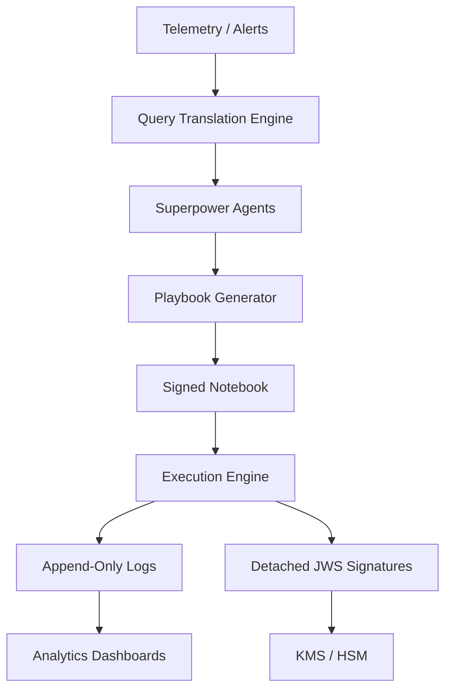

# SentinelMesh Master Architecture

## Document Metadata

- **Audience**: Engineers | SREs | Security Evaluators
- **Prerequisite Docs**: [00-START-HERE.md](./00-START-HERE.md)
- **Last Updated**: 2023-04-29
- **MNDA Restriction**: CONFIDENTIAL MNDA-signed only

## Executive Summary

SentinelMesh is a high-assurance, agent-driven security operations framework. It enables the creation, validation, and autonomous execution of security playbooks through a tiered maturity model. The architecture ensures that every action is signed, verified, and logged, providing a robust chain of custody for security operations.

## Core Pillars

1. **Verifiable Execution**: Every playbook cell and execution step is signed using detached JWS and Merkle proofs.
2. **Modular Intelligence**: "capabilities" provide specialized agentic capabilities that can be composed into complex workflows.
3. **Observability by Design**: Interactive dashboards provide real-time visibility into compliance, detection fidelity, and the homeostatic stability of autonomous loops.
4. **Standardization**: Strict adherence to CACAO, STIX 2.1, and Sigma standards ensures interoperability across the agentic nervous system.

## The TIERed Maturity Model

SentinelMesh follows a 4-TIER maturity model:

### [TIER 1: Foundations](./TIER-1-FOUNDATIONS/)

Foundational security and integrity features:

- **Interactive Attack Graphs**: Visualizing threat paths.
- **KMS Schema Signer**: Hardware-backed signing of playbook metadata.
- **Query Translation**: Standardizing across disparate telemetry sources.
- **Signed Timestamps**: Cryptographically verifiable execution time.
- **Time-Lock Puzzles**: Securing sensitive incident data.

### [TIER 2: Playbook Quality](./TIER-DEEP-DIVES/tier2-cacao-workflow-validation.md)

Ensuring playbooks are robust and well-formed:

- **Workflow Validation**: Acyclicity and CACAO schema compliance.
- **Error Clarity**: Human-readable error messages for agentic failures.
- **Cell Ordering**: Enforcing logical flow in Jupyter/Marimo notebooks.

### [TIER 3: Testing & Observability](./TIER-DEEP-DIVES/tier3-generator-testing-framework.md)

Hardening the generation pipeline:

- **Generator Testing**: Automated testing of playbook generation.
- **Performance Profiling**: Identifying bottlenecks in agentic thinking.
- **Config Standardization**: Unified configuration schemas.

### [TIER 4: AI & Automation](./TIER-DEEP-DIVES/tier4-autonomous-loop-executor.md)

Closing the loop with autonomous execution:

- **Optimized Multiscale Agency**: Calibrating performance and TAME-based competency.
- **Autonomous Loops**: End-to-end execution without human gating.
- **Plugin System**: Extensible architecture for third-party integrations.

## System Components

### Playbook Generators

- **SigmaNotebook**: Transforms Sigma rules into interactive Jupyter playbooks.
- **MarimoNotebook**: Creates reactive, DAG-based playbooks for complex analysis.
- **CacaoSidecar**: Attaches CACAO JSON metadata to every playbook for orchestration.

### Analysis & Dashboarding

The system aggregates execution logs and metadata to generate a suite of HTML5 dashboards:

- **Compliance Matrix**: Mapping coverage to regulatory frameworks.
- **Detection Fidelity**: Scoring the accuracy of detection logic.
- **Blast Radius**: Visualizing the potential impact of an incident.

## Data Flow

## Security & Trust Model

SentinelMesh operates on a zero-trust model for agentic actions:

- **Explicit Allowed Callers**: Restricting which agents can invoke specific tools.
- **Execution Signing**: All state-mutating actions must be signed by a trusted identity.
- **Environment Snapshots**: Capturing the exact state of the environment during execution.

## Competency-Bounded Agency

SentinelMesh manages the tension between scale and safety through **Competency-Bounded Agency**. Instead of binary automation, the system utilizes tiered competency measurements to define the spatio-temporal "light cone" in which an agent is permitted to operate.

| Confidence | Agency Level         | TAME Safeguard Architecture                                                         |
| :--------- | :------------------- | :---------------------------------------------------------------------------------- |
| 0–40%      | Passive Monitor      | **Safety Interlock**: Zero Local agency; alerts passed to Executive Agency.         |
| 40–70%     | Collective Consensus | **Multi-Agent Validation**: Peer-to-peer goal alignment required.                   |
| 70–85%     | Bounded Actor        | **Audit Trail Homeostasis**: Full logging with automated rollback setpoints.        |
| 85–95%     | Autonomous Navigator | **Cognitive Light Cone**: Agency strictly bounded by SLO-aware impact zones.        |
| 95%+       | Executive Agent      | **Morphogenetic Simulation**: High-competency execution with failure mode modeling. |

## Next Steps

To understand specific features, refer to the [Documentation Map](./DOCUMENTATION_MAP.md).
