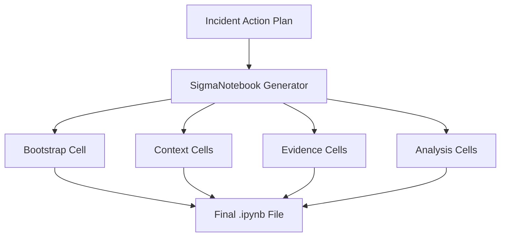

# SigmaNotebook (Jupyter V1) Implementation Guide

## Document Metadata

- **Audience**: Engineers | SREs
- **Prerequisite Docs**: [01-MASTER-ARCHITECTURE.md](../01-MASTER-ARCHITECTURE.md)
- **Related Docs**: [sigma-notebook-v2-guide.md](./sigma-notebook-v2-guide.md)
- **Last Updated**: 2023-04-29
- **MNDA Restriction**: CONFIDENTIAL MNDA-signed only
- **Module Path**: `src/generate/SigmaNotebook.py`

## Quick Summary

The `SigmaNotebook` generator is the foundational engine for creating standard Jupyter (`.ipynb`) incident response playbooks. It translates structured incident action plans into a sequential series of markdown and code cells that analysts can execute to investigate and respond to threats.

This generator is optimized for broad compatibility with standard Jupyter environments (notebook, lab, VS Code, Google Colab) and serves as the baseline for all SentinelMesh investigation workflows.

## Architecture & Design

- **Template-Based Generation**: Uses a modular cell-generation approach to build the notebook structure.
- **Sequential Flow**: Enforces a logical IR lifecycle: Bootstrap -> Context -> Evidence -> Analysis -> Containment -> Postmortem.
- **Markdown-First Documentation**: Automatically generates detailed executive summaries (BLUF) and technical context for every incident.
- **Code Injection**: Dynamically injects Python code for SIEM queries, data processing, and tool interactions.



## Implementation Details

- **Core Class**: `SigmaNotebook`
- **Key Methods**:
  - `generate()`: Orchestrates the full generation process.
  - `add_markdown_cell(content)`: Utility for injecting documentation.
  - `add_code_cell(source)`: Utility for injecting executable logic.

### Code Example: Extending the Generator

```python
REDACTED
```

## Deployment & Integration

- **Prerequisites**: `pip install nbformat`
- **Integration**: Typically triggered by the `TriageAgent` upon detection of a high-severity alert.
- **Platform Compatibility**: Fully compatible with Google Cloud Vertex AI Workbench and Colab Enterprise.

## Operations & Monitoring

- **Performance**: Standard generation time is < 2 seconds.
- **Error Handling**: Captures failures in query translation and surfaces them as error cells within the notebook.

## Security & Compliance

- **Auditability**: Every generated cell includes a `cell_id` and metadata tag for tracking.
- **Hardening**: Automatically sanitizes user inputs to prevent notebook-level code injection.

## Extension & Customization

- **Custom Templates**: Developers can modify the `bootstrap` cells in `src/generate/templates/` to include corporate-specific logging libraries or authentication decorators.
- **New Cell Types**: Support for adding custom "Analysis Modules" via the `add_analysis_step()` interface.

## Future Growth & Opportunities

- **Interactive Widgets**: Integrating `ipywidgets` into the standard template for better analyst interaction during the "Containment" phase.
- **Automatic Kernel Selection**: Detecting the local environment and automatically configuring the notebook kernel (e.g., choosing `conda-env-security-py310`).

## API Reference

- `SigmaNotebook(action_plan: IncidentActionPlanModel)`: Constructor.
- `generate() -> dict`: Returns the raw JSON structure of the `.ipynb` file.
