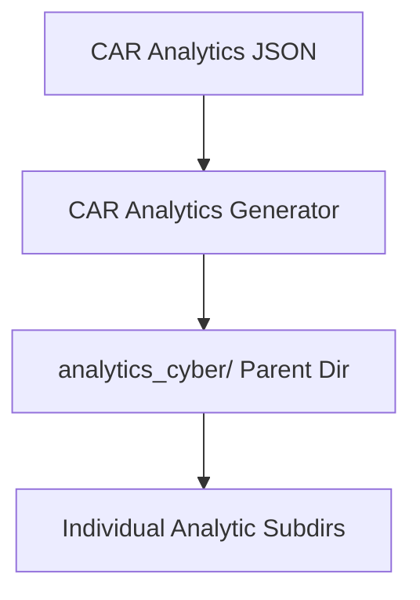

# CAR Analytics Directory Generator

## Document Metadata

- **Audience**: Engineers | Detection Engineers
- **Prerequisite Docs**: [01-MASTER-ARCHITECTURE.md](../01-MASTER-ARCHITECTURE.md)
- **Related Docs**: [enterprise-structure-generator.md](./enterprise-structure-generator.md)
- **Last Updated**: 2023-04-29
- **MNDA Restriction**: CONFIDENTIAL MNDA-signed only
- **Module Path**: `src/organize/CAR_Analytics.py`

## Quick Summary

The CAR Analytics Directory Generator is a specialized organization tool that builds a directory structure based on the Cyber Analytics Repository (CAR) by MITRE. It parses the `analytics.json` schema to create dedicated folders for each CAR entry within the `autonomic_loops/remediation/analytics_cyber` tree.

This ensures that analytics-focused playbooks—which often span multiple ATT&CK techniques—have a dedicated home organized around specific detection analytics rather than just adversary tactics.

## Architecture & Design

- **CAR Schema Integration**: Directly parses the `conf/schemas/analytics.json` file.
- **Normalization**: Automatically normalizes CAR entry names (e.g., converting "CAR-2013-01-001" to "car.2013.01.001" for filesystem compatibility).
- **Analytics-First Organization**: Prioritizes the "Detection Analytic" as the primary organizational unit.



## Implementation Details

- **Core Script**: `src/organize/CAR_Analytics.py`
- **Key Logic**:
  - `file_path`: Points to `conf/schemas/analytics.json`.
  - `parent_dir`: Points to `autonomic_loops/remediation/analytics_cyber`.
  - Name transformation: `name.replace('-', '.', 1).lower()`.

### Code Example: Directory Pattern

```
analytics_cyber/
├── car.2013.01.001/
├── car.2014.11.002/
└── car.2020.09.001/
```

## Deployment & Integration

- **Usage**: Run via CLI: `python src/organize/CAR_Analytics.py`.
- **Integration**: Works alongside the [Enterprise Structure Generator](./enterprise-structure-generator.md) to provide a multi-dimensional view of the playbook corpus.

## Operations & Monitoring

- **Analytic Coverage**: Use the [Detection Fidelity Dashboard](../DASHBOARDS-UI/detection-fidelity-dashboard.md) to track the performance of playbooks within these CAR-specific directories.

## Security & Compliance

- **Detection Engineering Standard**: Aligns SentinelMesh with the MITRE CAR standard, facilitating better interoperability with other detection engineering teams.

## Future Growth & Opportunities

- **Automatic Analytic-to-Technique Mapping**: Creating a cross-reference between CAR entries and ATT&CK techniques within the playbook metadata.

## API Reference

- `os.makedirs()`: Used to recursively build the parent and child directories.
