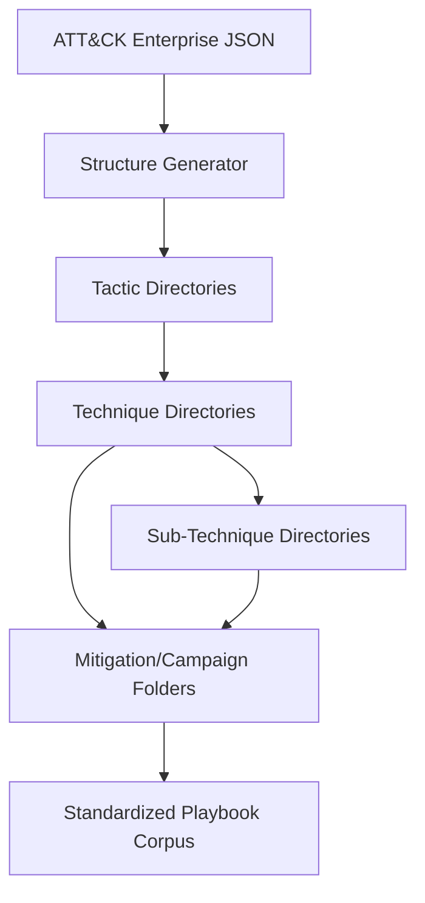

# Enterprise Structure Generator (MITRE ATT&CK)

## Document Metadata

- **Audience**: Engineers | Detection Engineers
- **Prerequisite Docs**: [01-MASTER-ARCHITECTURE.md](../01-MASTER-ARCHITECTURE.md)
- **Related Docs**: [attack-matrix-dashboard.md](../DASHBOARDS-UI/attack-matrix-dashboard.md)
- **Last Updated**: 2023-04-29
- **MNDA Restriction**: CONFIDENTIAL MNDA-signed only
- **Module Path**: `src/organize/Enterprise_createstructure.py`

## Quick Summary

The Enterprise Structure Generator is a utility script that automates the creation of a hierarchical directory structure for SentinelMesh playbooks, based on the MITRE ATT&CK Enterprise Matrix. By parsing the official ATT&CK STIX/JSON schema, the generator creates a standardized layout of tactics, techniques, and sub-techniques.

This ensure that the 1,000+ playbooks in the corpus are organized in a consistent, industry-standard manner, making them easily discoverable by both human analysts and the [Playbook Performance Analytics](../DASHBOARDS-UI/html-dashboards-overview.md) pipeline.

## Architecture & Design

- **Schema-Driven**: Consumes the official MITRE ATT&CK v18.1 Enterprise schema.
- **Relational Mapping**: Correctly handles the complex relationships between Tactics, Techniques, Sub-techniques, Mitigations, and Campaigns.
- **Sanitized Naming**: Automatically sanitizes technique names for cross-platform filesystem compatibility (removing special characters and spaces).
- **Component Association**: Creates dedicated subfolders for `Mitigations`, `Campaigns`, and `Data_Components` within each technique directory to provide full defensive context.



## Implementation Details

- **Core Script**: `src/organize/Enterprise_createstructure.py`
- **Key Functions**:
  - `load_attack_data()`: Parses the STIX JSON.
  - `get_mitre_ext_id()`: Resolves the canonical TXXXX ID.
  - `generate_component_folders()`: Builds the structured sub-folders for associated metadata.

### Code Example: Directory Pattern

```
enterprise/
├── initial_access/
│   ├── phishing-_-t1566/
│   │   ├── Mitigations/
│   │   │   └── user_training--m1017/
│   │   ├── Subtechniques/
│   │   │   └── spearphishing_attachment--t1566.001/
```

## Deployment & Integration

- **Environment Variables**:
  - `ATTACK_JSON`: Path to the input schema.
  - `OUTPUT_DIR`: Target directory for the generated structure.
- **Usage**: Run via CLI: `python src/organize/Enterprise_createstructure.py`.

## Operations & Monitoring

- **Scalability**: Capable of generating thousands of directories in seconds.
- **Consistency**: Guarantees that the directory structure perfectly matches the version of the ATT&CK matrix specified in the input schema.

## Security & Compliance

- **Standardization**: Enforces a "Security-as-Code" approach to directory management, reducing human error in playbook organization.
- **Auditability**: The predictable structure makes it easy to audit the coverage of specific compliance controls (e.g., NIST IR-4) across the corpus.

## Future Growth & Opportunities

- **Automatic Playbook Migration**: Adding logic to move existing playbooks into their newly generated "Home" directories based on their metadata tags.
- **Multi-Version Support**: Allowing the generator to create "Diff" structures when upgrading between different versions of the ATT&CK matrix.

## API Reference

- `main()`: The entry point for the generation pipeline.
- `safe_name(name)`: Sanitizes strings for the filesystem.
