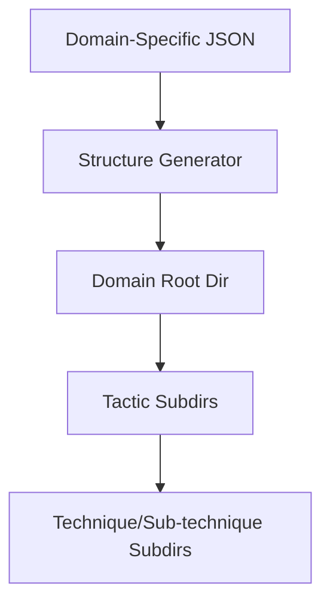

# Mobile & ICS Structure Generators

## Document Metadata

- **Audience**: Engineers | Detection Engineers
- **Prerequisite Docs**: [01-MASTER-ARCHITECTURE.md](../01-MASTER-ARCHITECTURE.md), [enterprise-structure-generator.md](./enterprise-structure-generator.md)
- **Related Docs**: [attack-matrix-dashboard.md](../DASHBOARDS-UI/attack-matrix-dashboard.md)
- **Last Updated**: 2023-04-29
- **MNDA Restriction**: CONFIDENTIAL MNDA-signed only
- **Module Path**: `src/organize/Mobile_createstructure.py`, `src/organize/ICS_createstructure.py`

## Quick Summary

The Mobile and ICS Structure Generators are specialized variants of the [Enterprise Structure Generator](./enterprise-structure-generator.md). They automate the creation of directory hierarchies for playbooks targeting non-traditional domains:

1. **Mobile**: Based on the MITRE ATT&CK Mobile Matrix (Android, iOS).
2. **ICS**: Based on the MITRE ATT&CK Industrial Control Systems Matrix (OT, SCADA).

These generators ensure that SentinelMesh's coverage of critical infrastructure and mobile platforms is as organized and rigorous as its enterprise IT response capabilities.

## Architecture & Design

- **Domain Specificity**: Uses the specific STIX/JSON schemas for Mobile and ICS matrices.
- **Unified Logic**: Shares the same core relational mapping and sanitization logic as the Enterprise generator to ensure a consistent developer experience.
- **Tactic Mapping**: Correctly handles domain-specific tactics (e.g., "Inhibit Response Function" in ICS or "App Store Discovery" in Mobile).



## Implementation Details

- **Mobile Script**: `src/organize/Mobile_createstructure.py`
- **ICS Script**: `src/organize/ICS_createstructure.py`
- **Key Difference**: Each script points to a different `INPUT_SCHEMA` and `BASE_OUTPUT_PATH` by default.

### Code Example: ICS Directory Pattern

```
ics/
├── inhibit_response_function/
│   ├── alarm_suppression-_-t0801/
│   │   ├── Mitigations/
│   │   │   └── segmentation--m0801/
```

## Deployment & Integration

- **Mobile Usage**: `python src/organize/Mobile_createstructure.py`
- **ICS Usage**: `python src/organize/ICS_createstructure.py`
- **Integration**: Both are integrated into the master `Makefile` for full-corpus organization.

## Operations & Monitoring

- **Domain Health**: Use the [ATT&CK Matrix Heatmap](../DASHBOARDS-UI/attack-matrix-dashboard.md) to monitor the playbook density within these newly created structures.

## Security & Compliance

- **Critical Infrastructure Protection**: The ICS generator specifically supports compliance with standards like NERC CIP and IEC 62443 by organizing playbooks around OT-specific attack patterns.

## Future Growth & Opportunities

- **Cross-Domain Mapping**: Identifying "Shared Techniques" that appear in both Enterprise and Mobile/ICS matrices and creating symlinks to shared playbook templates.

## API Reference

- `main()`: Entry point for the domain-specific generation.
