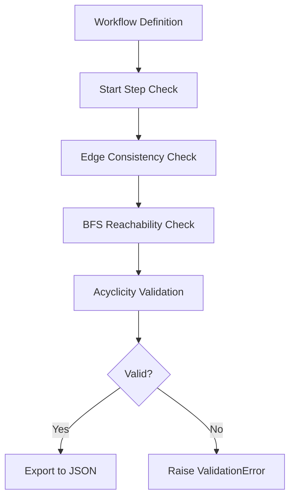

# CACAO Workflow Step Validation

## Document Metadata

- **Audience**: Engineers
- **Prerequisite Docs**: [01-MASTER-ARCHITECTURE.md](../01-MASTER-ARCHITECTURE.md)
- **Related Docs**: [cacao-sidecar-guide.md](../GENERATORS/cacao-sidecar-guide.md)
- **Last Updated**: 2023-04-29
- **MNDA Restriction**: CONFIDENTIAL MNDA-signed only
- **Module Path**: `src/generate/CacaoSidecar.py`

## Quick Summary

CACAO Workflow Step Validation ensures that the JSON-based automation playbooks generated by SentinelMesh are logically sound and compliant with the CACAO security orchestration standard.

By validating the directed acyclic graph (DAG) of the workflow before serialization, this feature prevents common errors such as unreachable steps, broken links (orphaned nodes), and infinite loops, which could cause orchestration engines to fail during critical incident response.

## Architecture & Design

- **DAG Validation**: Uses Breadth-First Search (BFS) to verify reachability from the `start_step`.
- **Integrity Checks**: Ensures every `on_completion`, `on_success`, and `on_failure` target exists within the workflow definition.
- **Cycle Detection**: Detects unintended cycles that are not explicitly defined as loop structures.
- **Fail-Fast**: Validation runs immediately before the playbook is exported, raising an error if any structural defects are found.



## Implementation Details

- **Core Method**: `_validate_workflow()` in `CacaoSidecar`.
- **Validation Steps**:
  1. Verify `workflow_start` key exists.
  2. Iterate through all steps and verify all transition targets exist.
  3. Perform BFS to ensure all nodes are reachable from the start.

### Code Example

```python
REDACTED
```

## Deployment & Integration

- **Integration**: Part of the standard `CacaoSidecar` generation pipeline.
- **Dependencies**: No external libraries required; uses standard Python set and queue operations.

## Operations & Monitoring

- **Error Surfacing**: Validation errors include the specific step ID and the nature of the failure (e.g., "Unreachable step: host_isolation").
- **Audit Logs**: Validation results are logged to the generator telemetry.

## Security & Compliance

- **Standard Adherence**: Ensures output playbooks meet the OASIS CACAO 1.1/2.0 specifications.
- **Operational Safety**: Prevents the deployment of "dead-end" playbooks that could leave systems in an inconsistent state.

## Future Growth & Opportunities

- **Semantic Validation**: Adding checks to ensure that "containment" steps are only called after "investigation" steps have provided a verdict.
- **Policy Enforcement**: Integrating with enterprise OPA (Open Policy Agent) rules to validate that certain high-risk steps have mandatory human approval gates.

## API Reference

- `_validate_workflow()`: Internal method. Raises `AssertionError` with descriptive message on failure.
