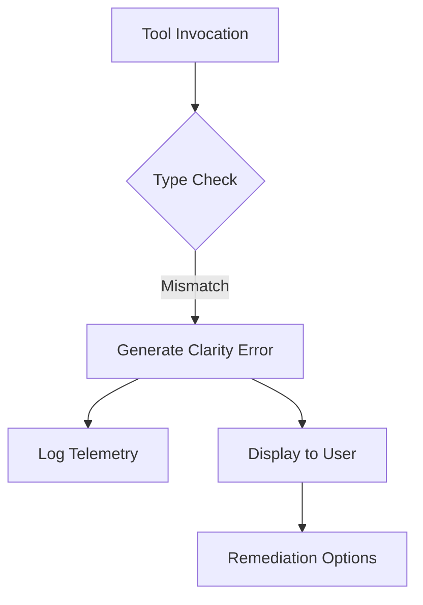

# Error Message Clarity for Configuration Mismatches

## Document Metadata

- **Audience**: Engineers | SREs
- **Prerequisite Docs**: [01-MASTER-ARCHITECTURE.md](../01-MASTER-ARCHITECTURE.md)
- **Related Docs**: [enforce-playbook-type-properties.md](../../capabilities/specs/2023-04-23-enforce-playbook-type-properties-design.md)
- **Last Updated**: 2023-04-29
- **MNDA Restriction**: CONFIDENTIAL MNDA-signed only
- **Module Path**: `src/runtime/playbook_type_enforcement.py`

## Quick Summary

Error Message Clarity ensures that when an SentinelMesh agent encounters a configuration conflict—such as attempting to use a containment tool within an investigation-only playbook—the error provided is actionable and descriptive.

Instead of generic stack traces or vague "Permission Denied" messages, analysts receive clear guidance on why the action was blocked and what steps they can take to resolve the mismatch, significantly reducing MTTR (Mean Time To Resolution) for playbook development and execution.

This module is grounded in **Human Factors Engineering** and **Aviation Safety Standards (FAA Cockpit Resource Management)**, specifically focusing on cognitive load mitigation during high-stress incident response. By providing pre-computed remediation options, we prevent "choice paralysis" and ensure the analyst can make critical decisions quickly and accurately.

## Architecture & Design

- **Typed Exceptions**: Introduces the `UnauthorizedPlaybookTypeError` to represent specific policy violations.
- **Remediation Suggestions**: The error class embeds specific "Options" in the message (e.g., "Use playbook_type='remediation'").
- **Contextual Awareness**: Errors include the tool name, the required category for that tool, and the current playbook type.
- **Telemetry Integration**: Every clarity-enhanced error is logged with structured metadata for dashboard analysis.



## Implementation Details

- **Core Class**: `UnauthorizedPlaybookTypeError`.
- **Logic**: Centralized in `playbook_type_enforcement.py`.

### Code Example

```python
REDACTED
```

## Deployment & Integration

- **Integration**: All SentinelMesh generators catch these exceptions and surface them in the primary notebook output cell.
- **Consistency**: Standardized across Python scripts, Jupyter notebooks, and Marimo playbooks.

## Operations & Monitoring

- **Error Trends**: SREs can monitor the `error_clarity_count` metric to identify common configuration pitfalls across the enterprise.
- **User Feedback**: Used to refine the "Remediation Options" list over time.

## Security & Compliance

- **Guardrail Enforcement**: Prevents unauthorized actions while ensuring that legitimate response activity is not blocked by obscure configuration errors.
- **Policy Audit**: Clear errors provide a definitive record of why a specific security guardrail was triggered.

## Future Growth & Opportunities

- **Automated Fixes**: In interactive sessions, providing a "Fix this for me" button that automatically updates the `playbook_type` metadata if the analyst has sufficient privileges.
- **LLM Error Analysis**: Passing the error context to a sub-agent to generate even more specific, environment-aware troubleshooting steps.

## API Reference

- `UnauthorizedPlaybookTypeError(tool_name, required_category, playbook_type)`: Custom exception with formatted string output.
