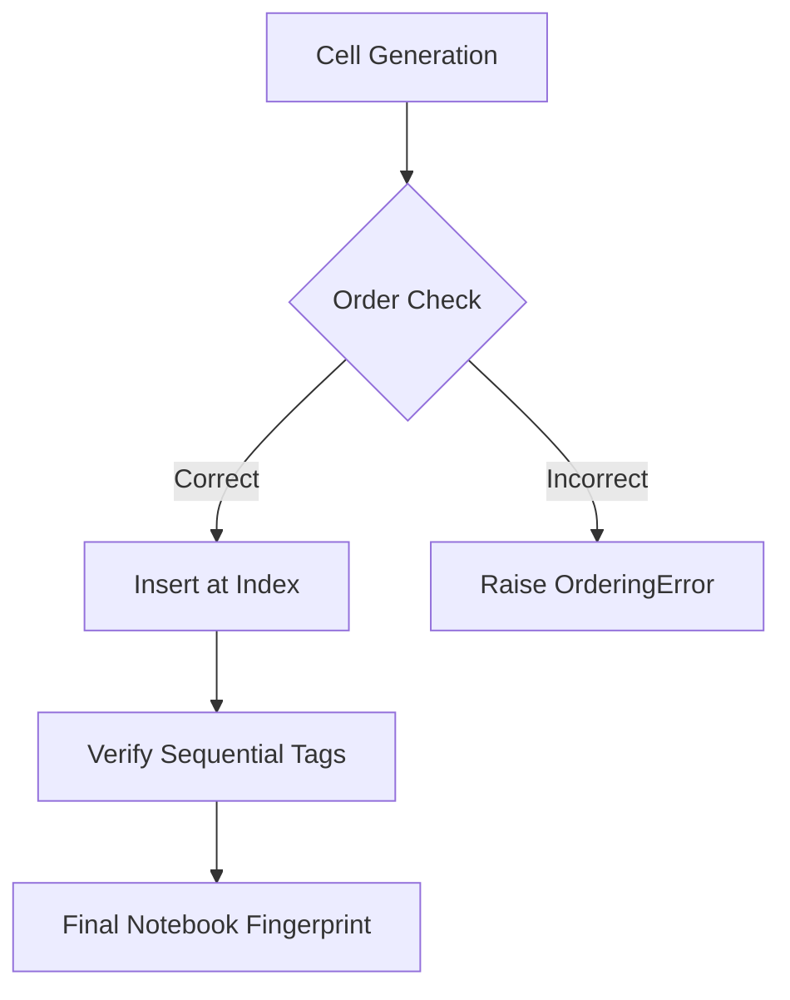

# Jupyter V1 SigmaNotebook Cell Ordering

## Document Metadata

- **Audience**: Engineers
- **Prerequisite Docs**: [01-MASTER-ARCHITECTURE.md](../01-MASTER-ARCHITECTURE.md)
- **Related Docs**: [sigma-notebook-guide.md](../GENERATORS/sigma-notebook-guide.md)
- **Last Updated**: 2023-04-29
- **MNDA Restriction**: CONFIDENTIAL MNDA-signed only
- **Module Path**: `src/generate/SigmaNotebook.py`

## Quick Summary

Jupyter V1 Cell Ordering enforces a strict, logical sequence for all generated playbooks. It ensures that critical operational steps—such as environment bootstrap, precondition checks, and evidence collection—always occur in the correct order to maintain execution integrity and data causality.

By preventing the out-of-order insertion of dynamically generated cells, this feature eliminates runtime errors caused by missing dependencies and ensures that containment actions are never executed before the necessary evidentiary data has been captured.

## Architecture & Design

- **Index Validation**: The generator maintains an internal state of the current cell index and validates that new cells are inserted at the tail or a specific allowed position.
- **Tag-Based Enforcement**: Every cell is assigned metadata tags (e.g., `bootstrap`, `preconditions`, `evidence`). The generator verifies the tag sequence against a predefined "Gold Standard" template.
- **Fingerprinting**: The final notebook is fingerprinted to ensure the cell order matches the cryptographically signed layout.



## Implementation Details

- **Core Logic**: Managed within the `SigmaNotebook` and `SigmaNotebookV2` generator classes.
- **Required Sequence**:
  1. **Bootstrap**: Environment setup, imports, and credentials.
  2. **Incident Context**: Incident ID and metadata.
  3. **Preconditions**: SIEM query translation and environment checks.
  4. **Evidence Collection**: Primary data gathering.
  5. **Analysis**: Agentic reasoning and verdict generation.
  6. **Containment**: Remediative actions (gated).
  7. **Postmortem**: Summary and documentation.

### Code Example

```python
REDACTED
```

## Deployment & Integration

- **Integration**: Enforced at the `generate_notebook()` phase.
- **Backward Compatibility**: Supports both V1 (Jupyter) and V2 (Enhanced) playbook templates.

## Operations & Monitoring

- **Validation Metrics**: Tracks `cell_ordering_failure_count` to detect issues with dynamic cell injectors.
- **Audit Reports**: The cell sequence is recorded in the playbook's `proof_chain` for forensic verification.

## Security & Compliance

- **Causality Proof**: Ensures that remediation is only performed after investigation, supporting legal requirements for "reasonable and proportionate" response.
- **Tamper Resistance**: Out-of-order cell execution is detected by the `SignedTimestampProofChain`.

## Future Growth & Opportunities

- **Dynamic DAG Layouts**: For non-linear playbooks, transitioning from simple list ordering to a graph-based dependency model (already partially implemented in Marimo).
- **Sub-playbook Insertion**: Securely allowing third-party plugins to inject cells into specific "slots" without breaking the core ordering constraints.

## API Reference

- `validate_cell_sequence()`: Internal generator method.
- `metadata.tags`: List of strings used to identify cell types for ordering.
