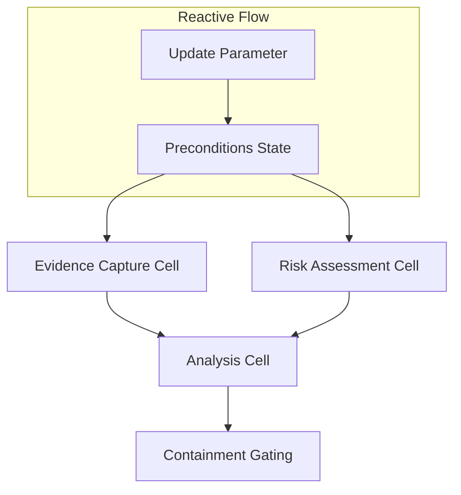

# MarimoNotebook Reactive DAG Update

## Document Metadata

- **Audience**: Engineers
- **Prerequisite Docs**: [01-MASTER-ARCHITECTURE.md](../01-MASTER-ARCHITECTURE.md)
- **Related Docs**: [marimo-notebook-guide.md](../GENERATORS/marimo-notebook-guide.md)
- **Last Updated**: 2023-04-29
- **MNDA Restriction**: CONFIDENTIAL MNDA-signed only
- **Module Path**: `src/generate/MarimoNotebook.py`

## Quick Summary

MarimoNotebook Reactive DAG Update brings modern, reactive programming to incident response playbooks. Unlike traditional linear notebooks (like Jupyter), Marimo playbooks treat cells as nodes in a directed acyclic graph (DAG) where dependencies are explicitly managed.

When an upstream variable changes—such as an analyst updating a detection parameter or a new piece of threat intelligence arriving—the Marimo reactive engine automatically re-executes only the necessary downstream cells. This ensures that the incident state is always consistent and up-to-date without manual cell re-execution.

## Architecture & Design

- **Reactive State**: Uses `marimo.state` to track and broadcast changes across the playbook.
- **Explicit Dependencies**: Cells use the `@mo.reactive` decorator to define exactly which upstream states they depend on.
- **Selective Re-execution**: Only the sub-graph affected by a change is updated, optimizing performance and reducing unnecessary API calls to SIEM/EDR tools.
- **Dynamic UI**: UI elements (sliders, text inputs) are bound to reactive states, providing a truly interactive analysis environment.



## Implementation Details

- **Core Decorator**: `@marimo.reactive` (often aliased as `@mo.reactive`).
- **State Management**: `mo.state()` for cross-cell communication.

### Code Example

```python
REDACTED
```

## Deployment & Integration

- **Integration**: `MarimoNotebook` generator produces `.py` files compatible with the Marimo CLI and web interface.
- **Dependency**: Requires `marimo` library in the runtime environment.

## Operations & Monitoring

- **State Consistency**: Ensures that the "Investigation" and "Containment" cells are always looking at the same version of the evidentiary data.
- **Debugging**: Marimo's built-in DAG visualizer allows analysts to see exactly why a cell is re-executing.

## Security & Compliance

- **Provable State**: Every reactive update is captured in the `SignedTimestampProofChain`, ensuring that the reactive "path" taken by the analyst is fully auditable.
- **Consistency Guardrails**: Prevents situations where an analyst executes containment based on stale or inconsistent evidence from an un-run cell.

## Future Growth & Opportunities

- **Real-time Alerting**: Binding reactive states to a live WebSocket stream, allowing the playbook to update in real-time as an attack progresses.
- **Multi-user Reactivity**: Collaborative reactive playbooks where multiple analysts can update states simultaneously (using Marimo's shared-state features).

## API Reference

- `MarimoNotebook.generate_python()`: Generates the reactive Python script.
- `mo.state(initial_value)`: Creates a reactive state container.
- `@mo.reactive`: Decorator to mark a function (cell) as reactive.
