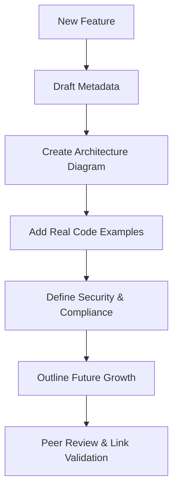

# TIER 3 Documentation Standards

## Document Metadata

- **Audience**: Engineers | Documentation Lead
- **Prerequisite Docs**: [01-MASTER-ARCHITECTURE.md](../01-MASTER-ARCHITECTURE.md)
- **Related Docs**: [\_TEMPLATE.md](../_TEMPLATE.md)
- **Last Updated**: 2023-04-29
- **MNDA Restriction**: CONFIDENTIAL MNDA-signed only

## Quick Summary

TIER 3 Documentation Standards define the rigorous requirements for feature documentation within the SentinelMesh ecosystem. Unlike low-level API references, these standards focus on comprehensive user guides that cover architecture, deployment, security, and operational considerations.

The goal is to ensure that every feature—from TIER 1 foundations to TIER 4 autonomous loops—is documented with consistent depth, providing a clear path for Google engineers, SREs, and security evaluators to understand and deploy the technology.

## Architecture & Design

- **Standard Template**: Every feature document must follow the structure defined in `docs/technical-specs/_TEMPLATE.md`.
- **Progressive Depth**: Documentation is organized into Layers (0-4), moving from quick-starts to deep operational references.
- **Cross-Referencing**: Mandatory use of contextual links between related features and prerequisite reading.
- **Visual-First**: Encourages the use of Mermaid.js diagrams for all architectural and data flow concepts.

## Implementation Details

- **Guide Structure**:
  - **Overview**: High-level value proposition.
  - **Architecture**: Design decisions and Mermaid diagrams.
  - **Implementation**: Real code examples and module paths.
  - **Operations**: Monitoring metrics and troubleshooting.
  - **Security**: Threat model and compliance mappings.

## Deployment & Integration

- **Platform**: Documentation is stored as GitHub Flavored Markdown (GFM) within the `/docs/technical-specs/` directory.
- **Access Control**: Strictly restricted to MNDA-signed parties as per CONFIDENTIAL policy.

## Operations & Monitoring

- **Link Validation**: Automated CI/CD checks (using `pytest` or custom scripts) to ensure 0 broken links across the suite.
- **Completeness Checks**: Periodic audits to ensure that 100% of implemented features have corresponding TIER 3 documentation.

## Security & Compliance

- **Data Protection**: Documentation must not contain raw secrets, internal PII, or non-public IP addresses.
- **Regulatory Alignment**: Every feature guide must explicitly state its alignment with security frameworks (e.g., MITRE ATT&CK, SOC2).

## Future Growth & Opportunities

- **Automated Guide Generation**: Using Gemini to draft documentation based on source code analysis and existing specification files (currently in use).
- **Interactive Documentation**: Embedding executable code blocks or interactive Mermaid diagrams (TIER 1 feature) within the documentation itself.

## API Reference

- `DOCUMENTATION_MAP.md`: The master index and search keyword registry.
- `_TEMPLATE.md`: The canonical document structure.
