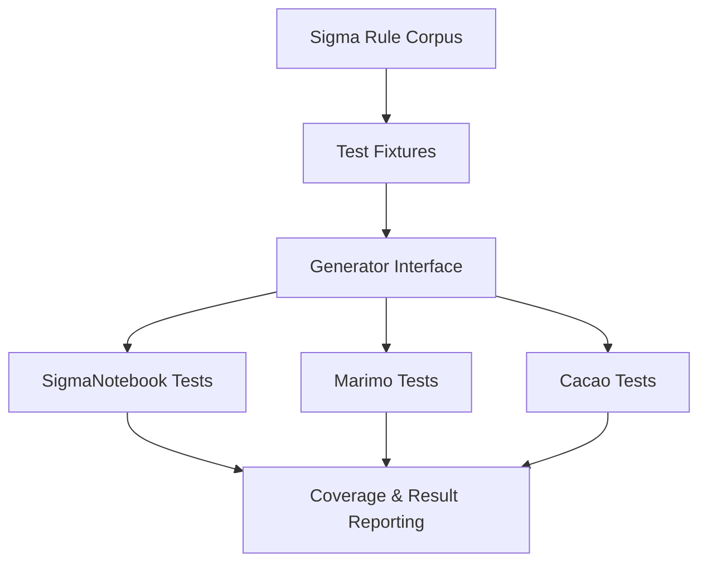

# Generator Testing Framework

## Document Metadata

- **Audience**: Engineers
- **Prerequisite Docs**: [01-MASTER-ARCHITECTURE.md](../01-MASTER-ARCHITECTURE.md)
- **Related Docs**: [tier3-performance-profiling.md](./tier3-performance-profiling.md)
- **Last Updated**: 2023-04-29
- **MNDA Restriction**: CONFIDENTIAL MNDA-signed only
- **Module Path**: `tests/fixtures/generator_fixtures.py`

## Quick Summary

The Generator Testing Framework provides a standardized, high-coverage testing environment for the four core SentinelMesh playbook generators (`SigmaNotebook`, `SigmaNotebookV2`, `MarimoNotebook`, and `CacaoSidecar`).

By utilizing a shared library of fixtures and real-world Sigma rules, the framework ensures that every generator produces syntactically correct and operationally sound playbooks. It eliminates boilerplate code in tests and allows developers to focus on validating the specific logic of new features and capabilities.

## Architecture & Design

- **Fixture Library**: Centralized `pytest` fixtures for common inputs like `IncidentActionPlanModel` and `SigmaDetectionLogic`.
- **Real-Rule Integration**: Tests are run against a corpus of 10+ real-world Sigma rules to ensure production readiness.
- **Generator Polymorphism**: A unified testing interface allows the same test suite to be run against all generators to verify cross-platform consistency.
- **Coverage Driven**: Targeted at maintaining >= 80% code coverage for all generator-related modules.



## Implementation Details

- **Core Fixtures**:
  - `sigma_rule_hot_threat`: A sample C2 detection rule.
  - `incident_action_plan`: A pre-configured action plan model.
- **Validation Hooks**: Includes hooks to verify that generated `.ipynb` and `.py` files pass linting and schema validation.

### Code Example

```python
REDACTED
```

## Deployment & Integration

- **Test Runner**: Uses `pytest` with the `pytest-cov` plugin.
- **CI/CD**: Integrated into the GitHub Actions pipeline; every commit must pass the full generator test suite.

## Operations & Monitoring

- **Regression Testing**: Automatically detects if changes to a shared superpower (e.g., `KMS Signing`) break any of the downstream generators.
- **Fuzzing (Future)**: Randomly mutating Sigma rules to test the robustness of the query translation and generation logic.

## Security & Compliance

- **Safe Execution**: Tests are run in isolated virtual environments to prevent side effects from malicious or malformed Sigma rules.
- **Artifact Validation**: Ensures that every generated playbook includes mandatory security cells (signing, checksums).

## Future Growth & Opportunities

- **Visual Regression Testing**: Automatically rendering generated notebooks to HTML and comparing them against baseline "Gold" versions to detect UI/UX regressions.
- **Performance Gating**: Integrating with the Performance Profiling Framework to fail tests if a generator exceeds its latency budget (e.g., > 5 seconds).

## API Reference

- `tests/fixtures/generator_fixtures.py`: Source of truth for test data.
- `conftest.py`: Configuration for the `pytest` environment.
