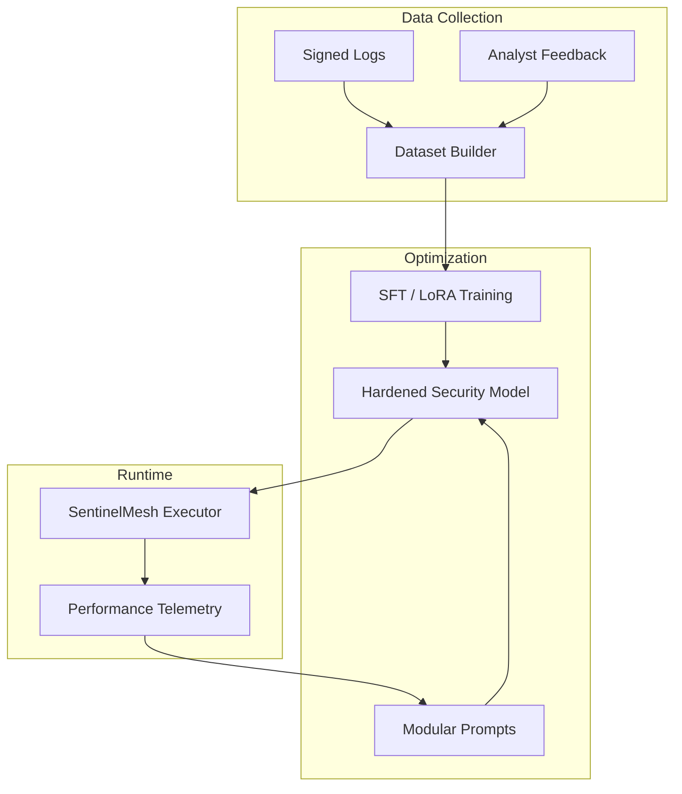

# TIER 4 Deep-Dive: AI Model Optimization & Fine-Tuning

## Document Metadata

- **Audience**: AI Engineers | Data Scientists | SOC Leadership
- **Prerequisite Docs**: [01-MASTER-ARCHITECTURE.md](../01-MASTER-ARCHITECTURE.md), [runtime-agentic-capabilities.md](../../appendices/2023-04-planning/runtime-agentic-superpowers.md)
- **Related Specs**: `2023-04-27-tier4-ai-model-optimization.md`, `2023-04-23-eradicate-monolithic-prompts-design.md`
- **Last Updated**: 2023-04-29
- **MNDA Restriction**: CONFIDENTIAL MNDA-signed only
- **Module Path**: `src/runtime/model_optimizer.py`, `src/runtime/training_dataset_builder.py`

## Quick Summary

AI Model Optimization is the "Continuous Learning" engine of SentinelMesh. While standard agents rely on off-the-shelf LLMs, SentinelMesh utilizes a multi-stage pipeline to optimize models for the specific, high-stakes requirements of security operations. This includes **Modular Prompt Engineering, Fine-Tuning on Forensic Datasets, and Model Distillation** to create lightweight, high-performance "Specialist Agents" for triage, forensics, and remediation.

The goal is to move beyond "General Purpose" reasoning to "Security-Hardened" intelligence that understands the nuances of adversarial behavior, tool constraints, and organizational risk.

---

## 1. Persona-Based Value Proposition

### For the Data Scientist / AI Engineer

- **High-Fidelity Training Data**: The [Training Dataset Builder](#22-training-dataset-builder) automatically extracts "Golden Traces" from successful incident responses to create high-quality SFT (Supervised Fine-Tuning) datasets.
- **Performance Benchmarking**: The [Model Optimizer](#23-model-optimization-pipeline) provides side-by-side comparisons of different models (Gemini, Llama, Claude) against security-specific benchmarks.

### For the SOC Manager

- **Cost & Latency Optimization**: By distilling knowledge from expensive "Frontier" models into smaller, task-specific models, we reduce API costs by up to 70% while improving response speed.
- **Explainability Assurance**: Fine-tuned models are optimized to produce standardized [Reasoning Blocks](../../appendices/2023-04-planning/runtime-agentic-superpowers.md), making their decisions more predictable and easier to audit.

### For the Security Auditor

- **Model Poisoning Prevention**: Our training pipeline includes rigorous "Data Sanitization" to ensure that adversarial inputs or False Positives are never leaked into the training set.

---

## 2. The Optimization Pipeline: Deep-Dive

### 2.1 Modular Prompt Engineering (Eradicating Monoliths)

- **Goal**: Replace massive, fragile system prompts with small, task-specific "Prompt Modules."
- **Design Rationale**: Monolithic prompts are difficult to debug and lead to "Prompt Injection" vulnerabilities. Modular prompts allow for precise control over agent behavior in specific phases (e.g., "Triage Mode" vs. "Forensics Mode").
- **Implementation**:
  - Managed by `src/runtime/modular_prompts/`.
  - Prompts are dynamically composed based on the playbook type and [Injected Tool Examples](../../appendices/2023-04-planning/integration-data-superpowers.md).

### 2.2 Training Dataset Builder (The "Golden Trace" Factory)

- **Goal**: Automatically capture the "Best Work" of human and autonomous analysts.
- **Technical Detail**:
  - Uses `src/runtime/training_dataset_builder.py`.
  - Scans the [Signed Execution Logs](../../appendices/2023-04-planning/forensic-security-superpowers.md) for incidents where the [Confidence Score](../../appendices/2023-04-planning/runtime-agentic-superpowers.md) was high AND the human analyst approved the action.
  - Exports these traces in OpenAI/JSONL or Google Vertex AI format.

### 2.3 Model Selection & Distillation

- **Selection Engine**: Dynamically selects the "Right Model for the Job."
  - **Triage**: Lightweight models (e.g., Gemini Flash) for rapid initial analysis.
  - **Deep Forensics**: Frontier models (e.g., Gemini Pro 1.5) for complex reasoning across long contexts.
- **Distillation**: (Future) Training a smaller internal model to mimic the outputs of a larger, more expensive teacher model on specific security tasks.

---

## 3. Architecture Visualization



---

## 4. Security & Compliance Deep-Dive

### 4.1 Model Integrity & Safety

Fine-tuned models are subjected to "Adversarial Red-Teaming" to ensure they cannot be tricked into taking destructive actions without proper gating. We also monitor for "Model Drift" where the agent's accuracy decreases as the threat landscape evolves.

### 4.2 Compliance Mapping

- **NIST AI RMF (Measure & Manage)**: Directly addresses the need for measuring model performance and managing the risks of autonomous decision-making.
- **GDPR (Article 22)**: Provides the technical foundation for "Meaningful Information" about the logic involved in automated decision-making.

---

## 5. Operations & Implementation

### Triggering an Optimization Run

```bash
python -m src.runtime.model_optimizer \
  --collect-days 30 \
  --min-confidence 0.95 \
  --target-model gemini-1.5-flash-aso-v2
```

### Benchmarking Performance

Use the [Performance Profiler](../OPERATIONS/monitoring-observability.md) to compare the "Before vs. After" latency and token usage of an optimized model.

---

## 6. Future Growth & Opportunities

- **Federated SOC Learning**: (Experimental) Allowing multiple SentinelMesh instances to share "Model Weights" or "Lessons Learned" without sharing raw forensic data.
- **Live Reinforcement Learning (RL)**: Tuning the agent's reward function based on the [Blast Radius](../ANALYSIS-MODULES/blast-radius-calculator.md) results—penalizing the agent for high-impact/low-reward actions.
- **Context-Window Optimization**: Automatically summarizing long forensic logs before sending them to the model, allowing the agent to "Remember" critical details across 1M+ token investigations.
